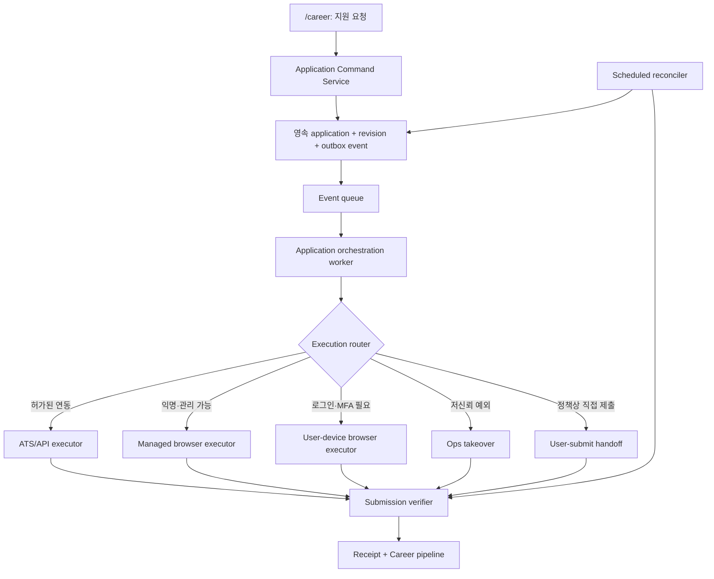

# Career Harper 대리 지원 실행 검증 보고서

검증일: 2026-08-27  
상태: 로컬 실행 spike 및 공개 ATS 구조 조사 완료  
관련 계획: [Career Harper 범용 대리 지원 실행 계획](./career-universal-application-execution-plan-ko.md)

> 이 보고서는 배포된 Harper 기능을 설명하지 않는다. 실제 기업에 테스트 지원서를 보내지 않았으며, 로컬 모의 채용 환경에서는 제출까지, 공개 ATS에서는 읽기 전용으로 제출 직전 구조까지만 검증했다.

## 1. 먼저 답: 전부 지원할 수 있는가

**아니다. 인터넷에 존재하는 모든 역할을 Harper가 100% 무인으로 대신 제출하는 것은 불가능하다.**

다만 아래 조건을 만족하는 공고는 특정 ATS에 한정하지 않고 Harper가 제출 실행을 주도할 수 있다.

- 웹 또는 허가된 API로 정상적인 지원 경로가 있다.
- 회사와 플랫폼 정책이 대리 실행 또는 자동화 보조를 허용한다.
- 필수 사실 답변과 제출 문서가 확보되어 있다.
- 로그인, MFA, CAPTCHA, 계정 생성처럼 사용자만 할 수 있는 단계에서 사용자가 동일 세션을 인계받을 수 있다.
- 제출 성공을 확인 페이지, 지원 ID, 확인 이메일, 조회 API 중 하나 이상으로 검증할 수 있다.

다음 범주는 Harper가 자동 제출 완료를 보장할 수 없다.

| 범주 | 이유 | 제품 처리 |
| --- | --- | --- |
| AI 작성 또는 제3자 대리 금지 | 후보자 본인의 말만 허용하는 공고가 실제로 존재한다. | 정책 판독 후 사용자 직접 작성·제출로 전환하거나 지원 불가 처리 |
| CAPTCHA·MFA·패스키·생체인증 | 우회해서는 안 되고 후보자 행동이 필요하다. | 동일 브라우저 세션을 사용자에게 잠시 인계 |
| 확인되지 않은 법적·사실 답변 | 연봉, 경업금지, 취업 허가, 제재 대상 여부 등을 추론하면 안 된다. | 질문을 저장하고 사용자 답변 후 재개 |
| 웹 경로가 없는 지원 | 네이티브 앱, 방문, 전화, 오프라인 서류만 허용될 수 있다. | 해당 채널을 별도 지원하거나 사용자 직접 처리 |
| 폐쇄·삭제·오래된 공고 | 수집 URL이 더 이상 실제 폼으로 연결되지 않는다. | canonical URL을 다시 찾고, 없으면 종료 |
| 사이트 차단·약관 제한 | reCAPTCHA, 속도 제한, 자동화 금지, 지역/IP 제한이 있다. | 제휴/API, 사용자 기기, 운영자 또는 직접 제출로 분기 |
| 제출 결과를 확인할 수 없음 | 타임아웃 뒤 실제 접수 여부가 불명확할 수 있다. | 자동 재시도 금지, 별도 조회·이메일 확인·운영자 확인 |

따라서 제품 약속은 “모든 공고 100% 무인 제출”이 아니라 다음이어야 한다.

> 지원 가능한 공고는 Harper가 제출과 확인까지 소유한다. 사용자만 해결할 수 있거나 정책상 대리가 불가능한 단계는 정확한 이유와 필요한 행동을 보여주고, 해결된 동일 실행을 이어서 완료한다.

## 2. 검증 환경

로컬에 5종 지원 폼과 영속 큐·워커를 가진 모의 채용 사이트를 만들었다.

- 단일 페이지 폼, PDF 이력서 업로드, 서술형 답변
- 3단계 동적 폼과 마지막 단계에서 새로 추가되는 필수 질문
- 로그인, 잘못된 OTP, 사용자 인계 후 재개
- 서버에는 접수됐지만 브라우저에는 HTTP 504가 반환되는 불확실 제출
- fixture에 없는 연봉 기대치와 경업금지 사실을 요구하는 폼
- `/career` 요청 저장, API 실행, 브라우저 실행 인계, 리스, 중복 감지, 제출 영수증

실행 코드는 제품 코드가 아니라 [검증용 spike](../scripts/spikes/career-application-execution/README.md)이며, 결과 상태는 `output/playwright/career-application-execution/state.json`에 남겼다.

사용한 후보자는 완전한 가상 fixture다. 공개 ATS 조사에서는 입력, 파일 업로드, 계정 생성, 제출을 하지 않았다.

## 3. LLM 브라우저 실행 결과

| 시나리오 | 실제 수행 | 결과 | 확인 근거 |
| --- | --- | --- | --- |
| 단일 폼 | 이름·연락처·서술형·취업 허가 입력, PDF 업로드, 제출 | 성공 | `receipt_c8055aed49d1` |
| 동적 3단계 폼 | 단계마다 DOM을 다시 읽고, 마지막에 새로 나타난 출장 질문까지 답변 | 성공 | `receipt_f4fb3e85954e` |
| 로그인·OTP | 잘못된 OTP의 401을 확인하고, 사용자 인계를 모사한 올바른 OTP 입력 뒤 동일 세션 재개 | 성공 | `receipt_256ef7b6a092` |
| 접수 후 504 | 제출 응답은 504였지만 별도 영수증 조회에서 실제 접수를 찾음. 재제출하지 않음 | 성공 여부 복구 | `receipt_9658e1171a46` |
| 답변 누락 | 알려진 이름·이메일만 입력. 연봉과 경업금지 답을 만들지 않고 제출 전 중단 | 의도한 중단 | `strictform` 영수증 0건 |
| 큐 기반 브라우저 인계 | `/career` 요청을 워커가 browser executor 상태로 넘기고, 별도 LLM 브라우저 세션이 실행한 뒤 같은 application ID에 영수증 기록 | 성공 | `app_c666d89cb1b2`, `receipt_6c83debd66a5` |

이 검증으로 확인한 것은 **알려진 정보로 구성된 일반 웹 폼은 ATS 전용 코드를 미리 만들지 않아도 LLM 브라우저 에이전트가 처리할 수 있다**는 점이다. 확인하지 못한 것은 실제 인터넷 전체의 성공률이다. 모의 폼 5종의 결과를 전체 ATS 커버리지 수치로 외삽해서는 안 된다.

## 4. 비동기 실행 방식 결과

| 실행 방식 | 실제 수행 | 결과 | 판단 |
| --- | --- | --- | --- |
| `/career` 요청 시 같은 웹 요청에서 실행 | spike에서는 의도적으로 사용하지 않음 | 장시간 폼, 브라우저 종료, 사용자 인계에 취약 | 제품 핵심으로 부적합 |
| 영속 큐 + 1회 서버 워커 | 저장된 요청 1건 처리 후 다시 실행 | 첫 실행 1건 성공, 두 번째 실행 0건 | 스케줄러 호출형 워커로 동작 가능 |
| 영속 큐 + 상시 서버 워커 | 워커를 먼저 띄운 뒤 요청 저장 | 약 1초 내 회수해 성공 | 핵심 실행 방식으로 적합 |
| API fast path | 파트너 모의 API로 제출 | 성공 | 제휴 ATS에서 최우선 경로 |
| 브라우저 handoff | 큐 워커가 브라우저 executor에 인계 | 별도 세션이 제출 후 callback 성공 | long-tail 웹 폼에 필요 |
| 중복 요청 | 같은 provider·role·email로 두 번 요청 | 두 번째 제출을 만들지 않고 기존 영수증 연결 | 필수 안전장치 동작 |
| 워커 crash 복구 | 첫 워커가 claim 뒤 종료, 1초 리스 만료 후 두 번째 워커 실행 | attempt 2에서 성공, 영수증 1건 | 리스 기반 재인계 가능 |
| 동시 워커 2개 | 요청 2건을 워커 2개가 동시에 claim | 각자 다른 요청 1건씩 처리 | 단일 claim 원자성 필요성을 확인 |

검증 중 브라우저 인계 상태의 `failure_reason`이 성공 후에도 남는 상태 버그를 발견했다. 성공 전환 시 `failure_reason`과 `blocking_reason`을 모두 지우도록 spike를 수정하고 같은 application ID를 다시 확인했다. 실제 구현에서도 상태 전이 불변식 테스트가 필요하다.

### Codex Scheduled 판단

Codex Scheduled는 정해진 시각에 반복 작업을 수행할 수 있지만, 데스크톱의 로컬 작업은 컴퓨터가 켜져 있고 Codex 앱이 실행 중이어야 한다. 이 제약 때문에 사용자 요청 직후 확실히 실행되어야 하는 프로덕션 application queue consumer로 삼지 않는다. [OpenAI Scheduled tasks 문서](https://learn.chatgpt.com/docs/automations?surface=app)

이번 spike에서 같은 워커를 1회 실행하는 polling 방식은 실제로 검증했다. 따라서 용도는 다음처럼 제한한다.

- 개발·파일럿에서 대기 요청을 주기적으로 집어가는 임시 실행기
- 오래 `queued`, `executing`, `submission_uncertain`에 머문 건 탐지
- 영수증 재조회와 운영 리포트

프로덕션 핵심은 요청 event에 즉시 반응하는 Harper 서버의 영속 큐와 상시 워커다. Codex Scheduled 또는 cron은 누락 탐지와 reconciliation 역할만 맡는다.

## 5. 공개 ATS 구조 조사

2026-08-27에 현재 공개된 실제 공고를 읽기 전용으로 열었다. 입력, 업로드, 계정 생성, 제출은 하지 않았다.

| ATS | 조사한 공개 공고 | 관찰 결과 | 실행상 의미 |
| --- | --- | --- | --- |
| Greenhouse | [Twilio 공고](https://job-boards.greenhouse.io/twilio/jobs/8098945) | 위치 combobox, 취업 허가·스폰서십·제재 관련 질문, 개인정보·AI 정책 확인, 자발적 자기식별, reCAPTCHA | 일반 DOM 작성은 가능해도 정책 판독, 후보자 사실 답변, CAPTCHA 인계가 필요 |
| Lever | [Coolbet 공고](https://jobs.lever.co/coolbet/4ec3b353-76c4-42c1-8d7f-4c9afb55f61a) | 이력서, 기본 정보, 링크, 자발적 EEO, 향후 연락 동의, 제출 버튼이 한 폼에 노출 | 익명 단일 폼은 관리 브라우저에 적합 |
| Ashby | [Searchable 공고](https://jobs.ashbyhq.com/searchable/8e4ca1d9-490f-43f9-aded-a74003f1a86d/) | 이력서 autofill, 위치 custom combobox, 스폰서십, 서술형, 소셜 링크 | semantic browser + custom widget 처리가 필요 |
| Workday | [PayPal 공고](https://paypal.wd1.myworkdayjobs.com/en-US/jobs/job/Software-Engineer_R0137244) | Apply Manually 뒤 계정 생성부터 시작하는 8단계 흐름, 비밀번호·약관·honeypot 필드 | 계정 lifecycle과 사용자 세션 인계 없이는 범용 무인 처리 곤란 |

추가로 검색에서 찾은 일부 Greenhouse·Lever·Workday URL은 이미 404 또는 “page doesn't exist”였다. 수집 시점의 URL을 그대로 실행하면 안 되고, 실행 직전에 canonical apply URL과 공고 활성 상태를 다시 확인해야 한다.

Greenhouse 공고 중에는 AI가 만든 답변을 금지하거나 본인의 말만 사용하라고 명시한 사례도 발견했다. 플랫폼 수준 허용 여부와 별개로 **개별 회사 공고의 AI 사용 정책**을 매번 읽어야 한다.

### 5.1 한국 근무지 공고 추가 실행 조사

같은 날 서울·한국 근무지 공고를 추가로 열고 실제 지원 폼 또는 로그인 경계까지 이동했다. 입력, 계정 생성, 업로드, 제출은 하지 않았다.

브라우저 DOM snapshot과 콘솔 증거는 `output/playwright/career-application-korea/.playwright-cli/`에 보관했다.

| 공고 | 실제 관찰 | Harper 판정 |
| --- | --- | --- |
| [UJET Software Engineer - Full Stack](https://job-boards.greenhouse.io/ujet/jobs/4709301005), Seoul | Greenhouse 익명 폼이 바로 노출됨. 이력서, 한국 취업 자격, 위치, 필수 희망 연봉과 reCAPTCHA가 있음. | 프로필에 연봉·취업 자격 답이 있고 CAPTCHA가 통과되면 Harper 제출 가능. 답이 없으면 질문 후 재개, CAPTCHA가 뜨면 사용자 인계. |
| [Match Group Senior Backend Engineer](https://jobs.lever.co/matchgroup/ef27d211-c82d-4b28-acf4-b9154784a906/apply), Seoul | Lever 익명 폼이 열림. 이력서, 연락처, 현 위치, 비자, 현재·희망 연봉, notice period, 영어 수준이 필수. | 확인된 답변이 모두 있으면 Harper 제출 가능. 없으면 필요한 사실만 질문한 뒤 같은 application을 재개. |
| [Wanted 필드서비스 백엔드 개발자](https://www.wanted.co.kr/wd/205339), Seoul | 관리 Playwright 브라우저에서 HTTP 403. 공고 자체는 검색 인덱스에서 활성으로 확인됐고 희망 연봉과 포트폴리오가 필수. | 관리 브라우저 자동 제출 불가. 사용자 기기 브라우저 executor를 먼저 시도하고, 연결할 수 없으면 `direct_apply_required`. |
| [Rallit 패스트뷰 백엔드 개발자](https://www.rallit.com/positions/1770/%EB%B0%B1%EC%97%94%EB%93%9C-%EA%B0%9C%EB%B0%9C%EC%9E%90-5%EB%85%84-%EC%9D%B4%EC%83%81), Seoul | 공고는 활성. `지원하기` 클릭 시 인프런 계정 로그인·회원가입 모달이 표시됨. | 로그인된 사용자 브라우저를 인계받을 수 있으면 로그인 후 Harper 재개. executor가 없으면 직접 지원 필요. |
| [Jumpit 서울거래 백엔드 시니어](https://jumpit.saramin.co.kr/position/54750549), Seoul | 마감일 2026-09-14인 활성 공고. `지원하기` 클릭 시 사람인 로그인 URL로 이동하고 비로그인 자동화 세션에서는 로딩이 완료되지 않음. | 사람인 로그인된 사용자 브라우저가 필요. 세션 인계 후 재개하거나 직접 지원. |
| [Boeing Korea Global Engagement Specialist](https://boeing.wd1.myworkdayjobs.com/en-US/external_subsidiary/job/Global-Engagement-Specialist_JR2026504386), Seoul | Workday `Apply Manually` 뒤 계정 생성부터 시작하는 7단계 폼과 honeypot이 노출됨. 동시에 현재 URL은 자회사 직원용이며 외부 지원자는 jobs.Boeing.com을 쓰라는 안내가 있음. | 현재 수집 URL로 제출하면 안 됨. 외부 지원 canonical URL을 다시 찾아야 하며, 올바른 Workday에서도 계정 생성·로그인은 사용자 인계가 필요. |
| Otis Korea Workday 공고 | 접근 시 `Workday is currently unavailable` 점검 페이지로 이동. | 즉시 제출 불가. 재시도 예약 후 계속 점검 중이면 직접 지원 대체 경로를 안내. |

추가로 Zebra, OutSystems, ERM의 검색 인덱스상 한국 공고 URL은 실제 브라우저에서 `page doesn't exist`였다. 첫 번째 Jumpit 표본도 이미 마감된 상태였다. 이는 “공고를 찾았다”와 “지금 지원할 수 있다”가 다른 상태임을 보여준다.

한국 공고 조사 결과를 제품 결과로 집계하면 다음 네 종류다.

1. `harper_can_submit`: 익명 폼이고 확인된 필수 답변이 모두 있는 Greenhouse·Lever 유형
2. `user_takeover_required`: 랠릿·점핏·Workday 계정처럼 로그인 뒤 Harper가 이어서 실행할 수 있는 유형
3. `direct_apply_required`: 정책 또는 접근 제한 때문에 사용자 본인이 남은 지원을 해야 하는 유형
4. `currently_unavailable`: 마감, 잘못된 canonical URL, 사이트 점검으로 현재 실행할 수 없는 유형

이번 환경에는 사용자 Chrome 연결이 없어서 Wanted가 로그인된 사용자 브라우저에서는 정상 동작하는지까지 확인하지 못했다. 따라서 Wanted를 영구적 자동화 불가로 단정하지 않고, **관리 브라우저 실패 → 사용자 기기 executor → 직접 지원** 순서로 라우팅한다.

## 6. 검토한 실행 방법 전체와 최종 용도

| 방법 | 장점 | 한계 | 최종 역할 |
| --- | --- | --- | --- |
| `/career` 요청 처리 중 즉시 브라우저 실행 | 구현이 단순해 보이고 사용자에게 바로 보임 | HTTP·브라우저 수명, 탭 이탈, 재시도, 인계, 수 분짜리 작업에 취약 | 사용하지 않음 |
| `/career`에서 요청만 영속 저장 | 대화와 실행이 분리되고 재개·감사 가능 | 별도 worker·상태 모델 필요 | 명령 진입점 |
| 이벤트 큐 + 상시 서버 워커 | 즉시 실행, 수평 확장, 리스·재시도·SLA 가능 | 운영 인프라 필요 | 기본 orchestration |
| Harper 관리 원격 브라우저 | 익명·신규 계정 폼을 서버에서 실행 가능 | CAPTCHA, 기기 신뢰, 정책, 세션 비용 | long-tail 기본 executor |
| 사용자 Chrome/로컬 브라우저 | 기존 로그인·패스키·MFA·지역 세션 활용 | 브라우저가 켜져 있어야 하고 권한 UI 필요 | 인증 필요 사이트 executor |
| ATS·기업 공식 API | 안정적이고 빠르며 영수증이 명확 | 파트너십과 provider별 구현 필요 | 가능한 경우 fast path |
| 사이트별 browser recipe | 반복 폼의 신뢰도·속도 개선 | UI 변경 유지보수 | 범용 에이전트 위 최적화 |
| LLM semantic browser | 사전 recipe 없는 폼에도 대응 | 오판, custom widget, anti-bot, 비용 | 범용 폴백, confidence gate 필요 |
| 이메일·리퍼럴 제출 | 웹 폼이 없을 때 공식 대체 경로 | 수신 확인과 데이터 형식이 제각각 | 공식 주소·추천인 동의가 있을 때 사용 |
| Harper 운영자 원격 인계 | 초기 long-tail와 저신뢰 예외 해결 | 비용, PII 접근 통제, 근무시간 | 정식 fallback |
| 사용자 직접 제출 | 정책상 자동화 금지에도 대응 | Harper가 마지막 클릭을 소유하지 못함 | compliant fallback |
| cron/Codex Scheduled | 구현·운영 점검이 간단 | 이벤트 즉시성·가용성 보장 부족 | reconciliation, 파일럿 polling |
| 외부 RPA/BPO | 구축 속도를 줄일 수 있음 | PII, 약관, 계정 보안, 비용과 종속성 | 법무·보안 검토 후 선택적 provider |

## 7. 권장 실행 구조

`/career`의 LLM은 외부 사이트에서 긴 작업을 직접 수행하지 않는다. 대상 역할과 사용자 명령을 해석하고, 불변 application ID와 답변·문서 revision을 만든 뒤 반환한다. 별도 워커 안의 브라우저 에이전트가 같은 revision으로 실행하고, 상태 이벤트가 `/career`에 다시 표시된다.

필수 불변식은 다음과 같다.

1. 한 application revision에는 한 개의 idempotency key가 있다.
2. `submit` 권한을 가진 활성 attempt는 하나뿐이다.
3. 타임아웃은 실패가 아니라 `submission_uncertain`이다.
4. 성공은 클릭이 아니라 receipt 검증이다.
5. 사용자·운영자 인계 뒤에도 application ID와 브라우저 세션을 유지한다.
6. LLM은 확인되지 않은 사실·법적 답변을 만들지 않는다.
7. 공고·회사별 AI와 자동화 정책을 실행 직전에 확인한다.

## 8. 제품화 전 실제 커버리지 측정

이번 spike로 전체 성공률 숫자를 정하지 않는다. 다음 표본 실험 뒤에만 커버리지 목표를 세운다.

1. 최근 30일 Harper 활성 외부 기회의 최종 지원 URL 전수를 수집한다.
2. provider, 국가, 로그인 필요, 계정 생성, CAPTCHA, AI 정책, long-tail 여부로 층화한다.
3. 트래픽 상위 provider와 무작위 long-tail 표본을 모두 포함한다.
4. 공개 사이트는 제출 직전까지 shadow run하고, 실제 제출은 ATS sandbox·Harper 소유 테스트 회사·승인된 파트너 공고에서만 수행한다.
5. 각 건을 `verified`, `needs_user`, `needs_ops`, `policy_blocked`, `technical_blocked`, `closed`, `uncertain`으로 분류한다.
6. 전체 요청 분모와 사유별 비율을 함께 공개한다. 지원 가능한 공고만 골라 성공률을 부풀리지 않는다.

출시 게이트는 임의의 “90%/95%” 숫자가 아니라 이 표본에서 얻은 기준선, 안전 사고 0건, 중복 제출 0건, 불확실 제출 자동 재시도 0건을 바탕으로 별도 결정한다.

## 9. 구현 순서

1. application 원장, revision, attempt, receipt, outbox와 상태 전이를 먼저 만든다.
2. `/career`는 요청을 저장하고 application ID를 반환하도록 한다.
3. 영속 큐와 상시 orchestration worker를 연결한다.
4. 운영자 수동 browser handoff로 제한 파일럿을 연다.
5. managed browser semantic agent를 shadow mode로 붙인다.
6. secure user takeover와 사용자 기기 executor를 추가한다.
7. 반복 도메인 recipe와 공식 API를 성공량 순서로 최적화한다.
8. scheduled reconciler로 stuck job과 receipt 누락을 감시한다.
9. 실제 표본 결과가 쌓인 뒤에만 자동 제출 allowlist와 커버리지 목표를 확장한다.

## 10. 검증의 한계

- 로컬 모의 폼은 실제 anti-bot, WAF, 브라우저 fingerprint, 지역 제한을 재현하지 않는다.
- 실제 ATS에는 지원서를 제출하지 않았으므로 end-to-end 실접수 성공은 sandbox 또는 파트너 환경에서 추가 검증해야 한다.
- 공개 공고 URL과 폼은 변경되거나 닫힐 수 있다.
- 이메일 확인, 계정 복구, 첨부 문서 parsing, 모바일 전용 흐름은 이번 spike에서 실행하지 않았다.
- 법률·플랫폼 약관 판단은 기술 spike로 대체할 수 없다.

이 한계 때문에 현재 증거로 할 수 있는 정확한 결론은 다음이다.

> 범용 LLM 브라우저와 비동기 워커 구조는 기술적으로 동작한다. 그러나 모든 공고의 무인 제출을 보장하지는 못한다. Harper는 여러 executor와 인계 경로를 가진 application orchestration 제품으로 설계해야 하며, 실제 지원 가능한 비율은 Harper 공고 표본과 승인된 실접수 환경에서 측정해야 한다.
