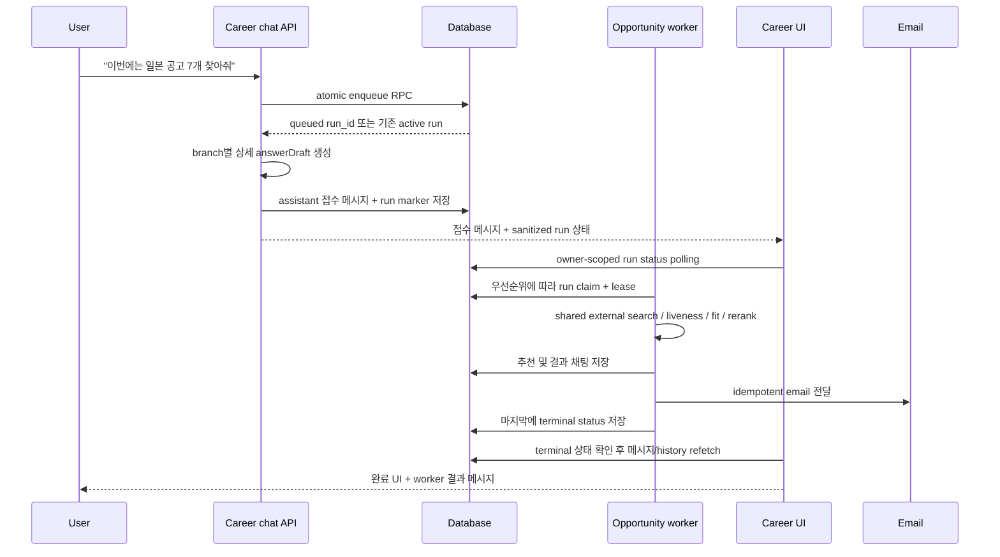

# `recommend_job_postings` 비동기 worker 전환 상세 구현안

문서 상태: 로컬 구현 완료, 배포 전 검증안

작성 기준: 2026-08-14

적용 범위: `harper_beta/` career chat, `harper_worker/` opportunity worker, 관련 DB migration

## 1. 결론

`recommend_job_postings`는 공고를 요청한 HTTP 요청 안에서 직접 검색하지 않고, 기존
`opportunity_discovery_run`에 **career chat 전용 external 검색 run**을 등록한 뒤 즉시
접수 결과를 반환하도록 바꾼다. 실제 검색·선별·저장·채팅/이메일 전달은 worker가 수행한다.

새 relation table은 만들지 않는다.

현재 로컬 구현은 beta와 worker의 기능 플래그를 모두 기본 OFF로 두며, 기존
`recommend_job_postings` 동기 검색 함수도 삭제하지 않는다. 따라서 migration과 worker를
먼저 배포해도 beta flag를 켜기 전에는 기존 사용자 요청이 자동으로 비동기 경로로 바뀌지
않는다.

assistant 접수 메시지의 마지막에 서버가 다음과 같은 고정 marker를 붙인다.

```md
[opportunity_run](/career?opportunityRunId=00000000-0000-4000-8000-000000000001&relation=accepted)
```

이 marker에는 **상태가 아니라 불변 `run_id`와 불변 관계 종류만** 들어간다. client는
marker를 화면에서 숨기고, 그 ID로 기존 `opportunity_discovery_run`을 조회하여 `queued`, `running`,
`completed`, `partial`, `failed` UI를 그린다.

따라서 다음이 모두 가능하다.

- 새로고침 뒤에도 같은 run 상태를 복원한다.
- 다른 기기에서도 상태를 확인한다.
- 나중에 새로운 run이 생겨도 과거 접수 메시지는 자기 run 상태를 계속 가리킨다.
- 완료 시 `talent_messages.content`를 수정하지 않는다.
- 메시지와 run을 연결하기 위한 새 테이블을 만들지 않는다.

사용자가 제안한 “고정 `[]()` 문자열을 client가 잡는 방식”은 방향이 맞다. 피해야 하는
것은 텍스트 marker 자체에 `queued`나 `completed`를 써서 그것을 진실로 취급하거나,
LLM에게 marker 생성을 맡기는 방식이다. marker는 관계만 나타내고 상태의 source of
truth는 항상 run row여야 한다.

## 2. 이번 변경의 목표

1. career client의 짧은 네트워크 수명과 사용자의 대기 시간을 검색 품질 제약에서
   분리한다.
2. external 공고 검색·liveness 확인·fit scoring·rerank 로직을 worker의 한 공통
   pipeline으로 모은다.
3. 사용자가 “이번에는 일본 공고”처럼 요청한 일회성 목적을 enqueue 시점에 동결한다.
4. 한 사용자에게 동시에 두 검색을 실행하지 않는다.
5. 온보딩 완료 검색, career chat 요청 검색, periodic 검색의 우선순위를 명시한다.
6. `bulk` 요청 개수는 기본 15, 최대 20의 “최대 전달 개수”로 처리한다.
7. 결과는 채팅과 이메일에 함께 전달하되, 많은 공고를 하나씩 길게 설명하지 않는다.
8. 일회성 요청이 정기 추천 3일 cadence나 internal/lifecycle cadence를 뒤로 미루지
   않게 한다.

## 3. 유지해야 하는 기존 계약

`kind=instant`는 기존 TypeScript 동기 검색의 `legacy` 전략을 유지하고,
`kind=bulk`만 worker로 실행 위치를 바꾼다. `recommend_job_postings`를 호출할지
판단하는 기존 제품 규칙은 유지한다.

- 사용자가 새 public/external 공고를 찾아 달라고 명시적으로 요청할 때 호출한다.
- 장기 hard filter나 “앞으로도”라는 미래 매칭 조건이면 먼저
  `update_talent_profile`로 저장하고 그 다음 검색을 요청한다.
- 단순 호기심·이번 한 번의 탐색이면 장기 선호를 바꾸지 않는다.
- 명백히 현재 프로필과 동떨어진 aspirational 요청이면 기존처럼 먼저 설명하고 필요한
  확인 질문 하나를 한다.
- `get_external_recommendation=false`처럼 external 추천을 명시적으로 꺼 둔 상태라면
  기존 재활성화 안내/동의 규칙을 거친 뒤 enqueue한다.
- `talent_setting.status=stopped`는 privacy opt-out이 아니다. 사용자가 직접 새 공고를
  요청하면 기존 계약대로 strong reaction으로 보고 `active` 복귀 신호로 처리한다.

마지막 두 규칙은 구분해야 한다.

- “일본”이라는 조건은 이번 run에만 적용하고 장기 선호로 저장하지 않는다.
- “새 추천을 직접 요청했다”는 행동 자체는 기존처럼 engagement/lifecycle 신호다.

on-demand worker 분기는 필요하면 상태를 `active`로 복귀시키되, 그 사실을 핑계로
internal 추천, lifecycle 안내, CV 요청 같은 다른 내용을 이번 결과 메일에 섞지 않는다.

## 4. 현재 구현에서 확인한 사실

### 4.1 career client의 동기 검색

현재 `src/lib/talentOnboarding/tools.ts`의 `recommend_job_postings`는 기본
`kind=instant`에서 `runCareerJobPostingRecommendations(strategy="legacy")`를 직접
호출한다. 사용자가 10~20개 수준의 많은 결과나 더 깊은 정밀 검색을 명시적으로
요청하거나 제안을 허용한 경우에만 `kind=bulk`로 worker run을 enqueue한다.

현재 공개 계약은 최대 5개이지만 실제 구현에는 서로 다른 숫자가 함께 존재한다.

- DB 검색 후보 pool: 최대 150 또는 pipeline별 별도 검색 limit
- 최종 추천 개수: 고정 5
- 요청 문장 속 숫자: 일부 파싱하지만 최종 target에는 반영되지 않음
- periodic worker batch: 설정값을 사용하며 보통 3..10으로 clamp

이번 변경에서는 이 숫자들을 분리한다.

- candidate/search pool limit는 검색 품질을 위한 내부 값이며 그대로 넉넉하게 둔다.
- instant는 기존 최종 추천 개수 최대 5를 유지한다.
- bulk의 `max_results`는 사용자에게 최종 전달할 최대 개수이며, 누락 시 15,
  최대 20을 적용한다.
- periodic의 기존 3..10 의미는 바꾸지 않는다.

### 4.2 기존 run schema

`opportunity_discovery_run`에는 이미 다음 필드가 있다.

- `id`, `talent_id`, `conversation_id`
- `trigger`, `run_mode`, `status`
- `trigger_payload`, `settings_snapshot`
- `dedupe_key`, `target_recommendation_count`
- `query_plan`, `coverage`, `message`, `error_message`
- `created_at`, `started_at`, `completed_at`, `updated_at`

그러므로 요청 목적, 최대 개수, dedupe, UI 연결을 위해 새 테이블이나 새 JSON column은
필요 없다.

2026-08-13 schema 점검 기준으로 DB의 `target_recommendation_count` 기본값은 10이고
check 범위는 1..200이다. 다른 run 종류에 영향을 주지 않도록 DB check를 20으로
좁히지 않는다. career tool/RPC/worker 세 경계에서만 최대 20을 검증하고, 새 run insert
시 값을 항상 명시한다.

현재 status는 `queued`, `running`, `completed`, `failed`, `partial`을 지원한다. stale
종료는 새 status를 추가하지 않고 `failed`와 structured `coverage` reason으로 표현할
수 있다.

### 4.3 현재 UI 상태 표시의 한계

현재 `recommendJobPostingStatus.ts`는 다음과 같은 thinking log snapshot을 파싱한다.

```txt
[[recommend_job_postings:running]]
[[recommend_job_postings:completed:candidates=37:recommendations=5]]
```

이 방식의 핵심 문제는 “텍스트를 썼다”가 아니라 다음 두 가지다.

- 어떤 `opportunity_discovery_run`과 연결된 상태인지 ID가 없다.
- 현재 HTTP 요청이 끝난 뒤 worker에서 바뀐 상태를 그 텍스트만으로 갱신할 수 없다.

새 marker는 이 문제를 해결한다. marker에는 run ID와 immutable presentation relation만
저장하고 상태는 DB에서 다시 읽는다.
기존 thinking log parser는 과거 메시지 호환을 위해 당분간 남기되, 새 marker가 있는
메시지는 marker-linked run 상태를 우선한다.

### 4.4 현재 scheduler가 on-demand run에 받는 영향

현재 scheduler는 `periodic_refresh_due`가 아닌 완료/부분완료 run을 넓게 묶어
`latest_non_periodic_completed_at`으로 사용한다. 이 값이 external, internal, base
lifecycle schedule anchor에 모두 들어간다.

따라서 새 immediate run을 구분 없이 완료하면 다음 periodic external 추천뿐 아니라
fresh internal 확인과 base lifecycle 판단까지 뒤로 밀릴 수 있다. 단순히 trigger를
`immediate_opportunity_requested`로 저장하는 것만으로는 부족하다.

## 5. 목표 흐름



사용자는 접수 응답을 받은 뒤 화면에 머물 필요가 없다. worker 결과는 별도 assistant
메시지로 저장되며 이메일도 함께 보낸다.

## 6. run을 구분하는 전용 계약

기존 `immediate_opportunity_requested` trigger는 ops 수동 internal 추천과 다른 기존
경로에서도 사용한다. trigger만 보고 새 on-demand external 경로로 보내면 안 된다.

다음 전용 marker를 `trigger_payload`에 둔다.

```json
{
  "schemaVersion": 1,
  "runContract": "career_chat_external_search_v1",
  "source": "recommend_job_postings",
  "actionScope": "external_only",
  "request": {
    "text": "이번에는 일본 공고 한번 줘볼래?",
    "messageId": "12345",
    "invocationKind": "direct_user_request",
    "sourceKind": "user_message",
    "sourceId": "12345",
    "requestedAt": "2026-08-13T02:15:00.000Z",
    "locale": "ko",
    "maxResults": 5,
    "scope": "one_off",
    "fingerprint": "sha256:..."
  },
  "preferenceMutation": "none",
  "locksConversationInput": false,
  "deliveryPolicy": {
    "chat": true,
    "email": true,
    "periodicEmailCooldownHours": 24
  },
  "cadencePolicy": {
    "affectsExternalCadence": false,
    "affectsInternalCadence": false,
    "affectsBaseCadence": false,
    "countsAsPeriodicDelivery": false
  }
}
```

직접 user request DB row의 canonical 값은 다음과 같다. programmatic origin의 trigger는
아래 6.1 표를 따른다.

```txt
trigger = immediate_opportunity_requested
run_mode = immediate
target_recommendation_count = 1..20 (bulk app default 15)
dedupe_key = career_recommend_job_postings:<talentId>:<userMessageId>
```

위 dedupe key는 일반 chat의 축약 예시다. 실제 canonical key는 아래 origin 계약을 따른다.

`request.text`와 source ID는 enqueue 시점에 동결한다. direct request이면
`request.messageId`도 동결한다. worker가 실행되는 시점의
“가장 최근 대화”를 요청 원문으로 사용하면 안 된다. 사용자가 대기 중 다른 이야기를
하면 검색 목적이 바뀌기 때문이다.

worker가 대화 맥락을 보조로 읽어야 한다면 다음을 지킨다.

- `request.text`가 항상 최우선이다.
- direct request의 message query는 가능하면 `id <= request.messageId`로 제한한다.
- enqueue 뒤에 생긴 메시지는 이번 목적을 덮어쓰지 않는다.
- 기존 profile/behavior context는 역량과 일반 배경을 이해하는 데만 사용한다.
- one-off 조건을 장기 behavior context나 `talent_setting`에 쓰지 않는다.

### 6.1 일반 user message가 아닌 기존 호출 경로

현재 tool은 일반 text chat 외에도 feedback follow-up, session-start/re-engagement 같은
programmatic turn에서 허용될 수 있다. 이 경로에서는 `userMessageId`가 null일 수 있다.
이번 1차 구현은 이 경로에 불안정한 임의 ID를 만들어 비동기 enqueue하지 않는다.

- 저장된 user message ID가 있는 direct chat 요청만 새 async RPC를 사용한다.
- stable origin ID가 없는 기존 programmatic 호출은 보존한 동기 검색 함수를 계속 사용한다.
- 동기 fallback 직전에는 동일 talent의 active async 전용 run을 확인한다. 조회에 실패하면
  중복 검색을 피하기 위해 fail-closed 안내를 반환하고, active run이 있으면 새 동기 검색을
  시작하지 않는다.

이 경계로 기존 호출 조건과 fallback 동작을 유지하면서도, retry마다 달라지는 ID 때문에
비동기 run이 중복 생성되는 문제를 피한다. programmatic 경로까지 비동기로 넓힐 때는 아래
안정적인 origin 계약을 먼저 구현한다.

`TalentToolExecutionContext`에 다음처럼 안정적인 origin을 전달한다.

```ts
type RecommendationRequestSource = {
  invocationKind:
    | "direct_user_request"
    | "feedback_followup"
    | "session_reengagement";
  kind: "user_message" | "feedback_event" | "session_event" | "other";
  id: string;
};
```

우선순위:

1. 일반 chat: 저장된 `talent_messages.id`
2. feedback follow-up: 해당 feedback/recommendation event의 안정적인 ID
3. session/re-engagement: 중복 방지 가능한 기존 persisted session/activity event ID
4. 불가피한 fallback: route가 생성하고 같은 retry에서 재사용하는 invocation ID

canonical dedupe key:

```txt
career_recommend_job_postings:<talentId>:<sourceKind>:<sourceId>
```

시간 bucket이나 request text만으로 dedupe하지 않는다. 동일한 문장을 나중에 다시 요청한
정상 사용까지 합칠 수 있기 때문이다. stable source ID를 만들 수 없는 programmatic
경로는 async flag를 켜기 전에 origin 계약을 먼저 보강한다.

`requestMessageId`는 `direct_user_request`일 때만 필수다. feedback/session turn에서는
null일 수 있고 `sourceEventKey`가 필수다. origin별 lifecycle 의미도 분리한다.

| invocation kind | run trigger | direct user request | lifecycle reaction |
| --- | --- | --- | --- |
| `direct_user_request` | `immediate_opportunity_requested` | yes | tool request 자체가 strong reaction; 필요 시 active 복귀 |
| `feedback_followup` | `all_batch_feedback_submitted` 또는 기존 feedback trigger | no | 원래 feedback event의 signal만 사용; tool enqueue가 reaction을 한 번 더 만들지 않음 |
| `session_reengagement` | 기존 session/reengagement trigger 정책 | no | session 시작 자체로 active 복귀하지 않음 |

현재 `career_tool_call:recommend_job_postings` 로그를 trigger 종류와 무관하게 strong reaction으로
세는 query가 있다면 `invocationKind=direct_user_request` 또는 동등한 persisted metadata만
세도록 바꾼다. 반대로 direct user tool usage log는 tool 실행 전에 남는 현행 의미를
유지하므로 active run 때문에 새 검색이 만들어지지 않아도 engagement 신호는 남는다.

### 6.2 enqueue snapshot과 실행 시점 live 값

모든 값을 enqueue 시점에 얼리거나, 반대로 모든 값을 worker 시작 시 다시 읽는 것도
안전하지 않다. 다음처럼 나눈다.

enqueue 후에도 바뀌면 안 되는 값:

- 이번 요청 원문과 safe purpose
- source/message ID
- 최대 결과 개수
- one-off/durable scope
- 응답 언어 snapshot
- request fingerprint와 requested time

실행/전달 직전에 다시 확인해야 하는 값:

- account가 아직 유효한지
- external 추천/contact/email opt-out
- 최신 blocked company 목록
- role이 아직 live인지
- 이미 다른 run에서 같은 role을 전달했는지
- email address/channel이 아직 사용 가능한지

profile, experience, durable insight는 worker 시작 시 최신 값을 읽어 fit 정확도를 높일 수
있다. 단, 최신 profile이 enqueue된 current request를 덮어쓰지는 않는다. 검색이 오래
걸리는 동안 hard block이나 opt-out이 바뀌면 저장/전달 직전 값을 우선한다.

enqueue 뒤 `get_external_recommendation=false`로 바뀌면 더 이상 결과를 보내지 않는다.
새 DB status를 추가하지 않는 phase 1에서는 `status=completed`로 terminal 처리하되
coverage에 `completionKind=cancelled_by_setting`과
`terminationReason=user_setting_changed`를 남긴다. serialized UI는 이를 일반
`completed` 문구가 아니라 “설정 변경으로 검색을 종료했습니다”로 표시한다. email만
opt-out이고 external 검색 자체는 허용되면 chat은 전달하고 email은 `skipped_policy`로
기록한다.

## 7. `recommend_job_postings` tool 입력 계약

```json
{
  "type": "object",
  "properties": {
    "request": {
      "type": "string",
      "description": "이번 검색에서 최우선으로 적용할 사용자의 전체 요청"
    },
    "kind": {
      "type": "string",
      "enum": ["instant", "bulk"],
      "default": "instant",
      "description": "기본 instant는 기존 legacy 동기 검색, 명시적으로 요청·허용된 bulk는 worker 정밀 검색"
    },
    "max_results": {
      "type": "integer",
      "description": "instant는 5, bulk는 사용자가 개수를 말하지 않으면 15이며 최대 20"
    }
  },
  "required": ["request"],
  "additionalProperties": false
}
```

서버 normalization은 LLM schema를 신뢰하지 않고 다시 수행한다. 누락되거나 알 수 없는
`kind`는 `instant`로 처리한다. `bulk`는 explicit request/permission이 있을 때만 LLM이
선택하며, 호출 전 더 오래 걸리는 정밀 검색이고 완료 시 이메일로 알린다고 안내한다.
bulk scheduling이 불가능하면 instant로 자동 전환하지 않는다.

- bulk 개수 누락: 15
- 1 미만: 1로 clamp
- 20 초과: 20으로 clamp
- 정수가 아닌 값: 안전하게 정수화할 수 없으면 15
- clamp가 발생하면 tool result에 원래 요청값과 조정 사실을 넣는다.

`max_results`는 보장 개수가 아니라 상한이다. 품질 기준을 통과한 공고가 2개뿐이면
요청 개수를 채우기 위해 약한 공고를 넣지 않는다.

요청 문장 안의 숫자를 worker가 다시 추측하지 않는다. tool input의 `max_results`와 DB
`target_recommendation_count`가 canonical이다.

JSON Schema에 hard `minimum/maximum`을 넣지 않는 것은 의도적이다. 입력은 integer로
받은 뒤 server가 최대 20으로 clamp하고 조정 사실을 반환한다. DB와 worker 경계에서도
다시 최대 20을 검증한다.

## 8. 원자적인 enqueue: 새 테이블 대신 RPC

현재처럼 application에서 `active 조회 -> insert`를 나누면 두 요청이 동시에 들어올 때
둘 다 active가 없다고 보고 run을 만들 수 있다. live DB에는 periodic active를 막는
partial index는 있지만 모든 immediate/initial queued row를 talent당 하나로 막는
제약은 없다.

새 테이블 대신 service-role 전용 RPC를 migration에 추가한다.

예시 이름:

```txt
enqueue_career_job_posting_discovery_run
```

트랜잭션 내부 순서:

1. `talent_id`와 `conversation_id`, source event 소유권을 검증한다.
   `direct_user_request`이면 `request_message_id`도 필수 검증한다.
2. talent 단위 advisory transaction lock을 획득한다.
3. 동일 `dedupe_key`가 이미 있으면 새 row를 만들지 않고 그 row를 반환한다. 그 row가
   active이면서 stale이면 먼저 조건부 `failed` 처리하되, 같은 user message retry가 새
   검색까지 만드는 것은 막는다.
4. 동일 dedupe row가 아닌 queued/running stale blocker가 있으면 조건부로 `failed`
   처리한다.
5. 남아 있는 fresh queued/running row를 `FOR UPDATE`로 찾는다.
6. fresh active가 있으면 새 row를 만들지 않고 그 row를 반환한다.
7. active가 없으면 명시한 target count와 payload로 queued row를 insert한다.
8. outcome과 필요한 row ID를 한 응답으로 반환한다.

여러 system event가 이미 queued일 수 있으므로 blocker 선택은 단순 최신순이 아니다.
`running`을 가장 먼저 보고, running이 없으면 worker와 같은 claim priority 및
`created_at, id` 순으로 가장 먼저 실행될 queued row를 반환한다. tool 안내문의
`blockingRun.purposeText`와 marker가 실제로 먼저 처리될 run을 가리켜야 한다.

RPC는 다음 outcome을 구분한다.

| outcome | 의미 | 새 run |
| --- | --- | --- |
| `queued` | 새 요청을 정상 접수 | 생성 |
| `deduplicated` | 같은 user message/tool call의 retry | 기존 dedupe row 재사용 |
| `active_same_request` | 다른 turn이지만 동일 목적의 fresh run이 이미 active | 생성 안 함 |
| `active_different_request` | 다른 목적의 fresh run이 이미 active | 생성 안 함, 새 조건 미반영 |
| `stale_replaced` | stale blocker를 종료하고 이번 요청을 접수 | 생성 |

동일 user message의 네트워크 retry는 idempotency 복구이지 새로운 사용자 의사가 아니다.
따라서 stale/failed인 동일 dedupe row를 다시 만났더라도 같은 message ID로 두 번째 run을
만들지 않는다. 사용자가 새 메시지로 다시 요청하면 새 dedupe key가 생기고
`stale_replaced` 또는 `queued`가 될 수 있다.

RPC가 raw `trigger_payload` 전체를 chat LLM에 반환하지는 않는다. application이 owner
검증 후 safe purpose를 만든다.

### 8.1 왜 전역 active unique index 하나로 끝내지 않는가

`(talent_id) WHERE status IN ('queued','running')` unique index를 바로 만들면 active
on-demand 중에 반드시 보존해야 하는 `conversation_completed` run enqueue 자체가
실패할 수 있다.

권장 제약은 다음과 같다.

- queued row는 event 보존을 위해 여러 개 존재할 수 있다.
- tool RPC는 제품 정책상 fresh active가 있으면 새 on-demand row를 만들지 않는다.
- worker는 talent당 running row가 하나만 되게 claim한다.
- DB safety net으로 `(talent_id) WHERE status='running'` partial unique index를 둔다.
- scheduler와 RPC가 같은 talent advisory lock namespace를 사용한다.

기존 `dedupe_key IS NOT NULL` global unique index도 유지한다. migration 전 실제 constraint와
index 이름, duplicate running row를 production에서 다시 preflight한다.

### 8.2 모든 enqueue producer가 같은 lock을 사용해야 한다

tool RPC와 periodic scheduler만 lock을 공유해서는 충분하지 않다. 다음 producer가 모두
같은 talent advisory key와 공통 enqueue primitive를 사용해야 한다.

- onboarding `conversation_completed`
- career chat direct on-demand
- feedback follow-up/refine
- session/reengagement가 만드는 검색
- periodic scheduler
- ops/manual run producer
- retry/recovery producer

producer별 “active가 있을 때” 정책은 동일할 필요가 없지만, 판단과 insert는 반드시 같은
lock 안에서 일어나야 한다.

| producer | fresh active가 있을 때 |
| --- | --- |
| `conversation_completed` | event를 잃지 않도록 dedupe된 queued row를 보존; highest priority |
| career tool direct/feedback/session | 새 검색을 만들지 않고 실제 먼저 실행될 blocker 반환 |
| periodic scheduler | enqueue하지 않고 다음 scheduler tick에서 재평가 |
| ops/manual | 기존 운영 계약에 따라 idempotent queue 가능, worker는 talent당 하나만 실행 |
| retry/recovery | parent/replacement reason을 확인하고 중복 retry 금지 |

conversation-completed event가 on-demand enqueue 직후 도착하면 queued row가 둘일 수 있다.
이는 허용한다. worker가 initial을 먼저 실행하고 on-demand를 그 다음 실행하며 동시에
running되지는 않는다. 반대로 tool 호출 시점에 initial이 이미 queued라면 tool은 새
on-demand를 만들지 않고 initial을 blocker로 안내한다.

공통 primitive는 worker claim priority와 같은 comparator를 제공한다. 그래야 여러 queued
row 중 사용자에게 알려준 blocker와 실제 다음 실행 row가 일치한다.

## 9. stale, lease, heartbeat

현재 beta는 약 3분 뒤 active run을 잠금 대상이 아닌 것처럼 취급하고, worker recovery는
기본 약 24시간 뒤 running run을 실패 처리한다. 두 기준이 달라 3분 이후 UI와 실제
worker 상태가 어긋날 수 있다.

2시간 stale 정책은 단순히 `created_at`만 보고 판단하면 안 된다. 2시간 넘게 정상 동작
중이고 heartbeat가 살아 있는 run을 죽일 수 있기 때문이다.

새 테이블 없이 기존 run에 다음 scalar column을 추가한다.

```txt
lease_heartbeat_at timestamptz null
last_progress_at timestamptz null
lease_token uuid null
```

`lease_heartbeat_at`은 worker process가 살아 있다는 뜻이고, `last_progress_at`은 planner
완료, retrieval 완료, scoring batch 완료, selection 완료, durable save 완료처럼 의미 있는
checkpoint를 통과했다는 뜻이다. 둘을 같은 timestamp로 쓰지 않는다.

판정 규칙:

- queued: `created_at` 이후 2시간 동안 claim되지 않으면 stale
- running process lost: 마지막 `lease_heartbeat_at`이 stale threshold를 넘음
- running hung: heartbeat는 살아 있어도 `last_progress_at`이 2시간 이상 전이거나
  configured overall hard deadline을 넘으면 stale
- legacy running이며 heartbeat가 없으면 `greatest(updated_at, started_at, created_at)` 사용
- 전체 run이 2시간을 넘었더라도 progress가 계속되고 명시적으로 허용한 long phase라면
  overall hard deadline 안에서는 유지할 수 있음
- 각 외부 LLM/network call에도 phase별 request timeout을 두어 heartbeat thread만 살아 있는
  무한 hang을 막음

worker claim 시:

1. 새 `lease_token`을 생성한다.
2. status를 `running`으로 바꾼다.
3. `started_at`, `lease_heartbeat_at`, `last_progress_at`, `updated_at`을 갱신한다.
4. 별도 DB connection에서 30~60초마다 lease heartbeat만 보낸다.
5. main pipeline이 실제 checkpoint를 마칠 때만 `last_progress_at`을 갱신한다.

검색 저장 전, chat/email 전달 전, terminal update 전에는 다음 조건을 확인한다.

```sql
WHERE id = :run_id
  AND status = 'running'
  AND lease_token = :lease_token
```

stale recovery가 이미 run을 failed 처리한 뒤 오래된 worker가 다시 completed로 되살리거나
이메일을 보내는 것을 막기 위한 기본 조건이다. 단순히 side effect 직전에 SELECT하는
것만으로는 검사 직후 lease가 회수되는 TOCTOU를 막지 못한다.

email/chat outbox authorization도 같은 DB transaction에서 lease token과 묶는다.

1. `status/lease_token` CAS가 성공한 holder만 pending delivery를 생성하거나
   claim한다.
2. stale recovery는 아직 pending인 이전 lease delivery를 atomically cancelled로 바꾼다.
3. outbox dispatcher는 delivery와 현재 run lease를 함께 확인한 뒤 `sending`으로 claim한다.
4. 이미 `sending`인 provider call은 recovery가 무조건 교체하지 않고 짧은 provider timeout과
   idempotency key 결과를 먼저 정산한다.
5. provider idempotency key는 lease가 바뀌어도 같은 run/channel에서 동일하게 유지한다.

외부 provider 호출 자체와 DB transaction을 완전히 원자화할 수는 없으므로, outbox claim,
fencing, provider idempotency를 함께 사용해 늦은 worker의 중복 side effect를 막는다.

stale 종료는 다음처럼 기록한다.

```json
{
  "failureKind": "stale_timeout",
  "terminationReason": "no_heartbeat",
  "previousStatus": "running",
  "previousLeaseHeartbeatAt": "...",
  "previousProgressAt": "...",
  "progressPhase": "external_fit_scoring",
  "recoveredAt": "...",
  "replacementRunId": "..."
}
```

사용자에게 raw error/stack trace는 보여주지 않는다. stale previous run의 safe purpose와
“오랫동안 진행 신호가 없어 종료했다”는 설명만 tool result에 넣는다.

stale recovery는 periodic scheduler가 우연히 실행될 때만 호출하면 안 된다. 현재처럼
worker가 work를 처리한 iteration에서 scheduler를 건너뛰는 구조에서는 backlog가 계속될
때 recovery도 계속 늦어질 수 있다. claim 성공 여부와 독립된 fixed timer로 recovery를
실행하고, tool enqueue RPC의 stale 판정과 같은 기준/helper를 사용한다.

## 10. tool result 상세 계약

tool result는 LLM이 상태를 추측하지 않도록 boolean과 이전/현재 목적을 명시적으로
분리한다.

```ts
type RecommendJobPostingsToolResult = {
  ok: true;
  outcome:
    | "queued"
    | "deduplicated"
    | "active_same_request"
    | "active_different_request"
    | "stale_replaced";

  accepted: boolean;
  newRunCreated: boolean;
  currentRequestAlreadyRepresented: boolean;
  currentRequestApplied: boolean;
  currentRequestMergedIntoActiveRun: false;

  requestedRequest: {
    requestText: string;
    purposeText: string;
    maxResults: number;
    originalMaxResults: number | null;
    maxResultsAdjusted: boolean;
    scope: "one_off" | "durable_profile_condition_already_saved";
  };

  statusRun: {
    id: string;
    status: "queued" | "running" | "completed" | "partial" | "failed";
    purposeText: string;
    maxResults: number | null;
    createdAt: string;
    startedAt: string | null;
    sourceKind: "initial" | "on_demand" | "feedback" | "periodic" | "other";
  };

  blockingRun?: {
    id: string;
    status: "queued" | "running";
    purposeText: string;
    maxResults: number | null;
    createdAt: string;
    startedAt: string | null;
    ageMinutes: number;
  };

  replacedRun?: {
    id: string;
    purposeText: string;
    previousStatus: "queued" | "running";
    terminationReason: "stale_timeout";
  };

  lifecycleEffect: {
    invocationKind:
      | "direct_user_request"
      | "feedback_followup"
      | "session_reengagement";
    directRequestCountsAsStrongReaction: boolean;
    reactivationExpected: boolean;
    preferenceChanged: false;
  };

  deliveryExpectation: {
    chat: "expected";
    email:
      | "expected"
      | "skipped_opt_out"
      | "unavailable"
      | "unknown";
    userFacingText: string;
  };

  statusRunId: string;
  statusRelation: "accepted" | "same_request" | "blocking_other_request";
  answerDraft: string;
  assistantInstruction: string;
  skipCommonAssistantInstruction: true;
};
```

위 타입은 enqueue를 시도할 수 있는 정상 branch의 계약이다. 명시적인 external opt-out
등으로 run 자체를 만들면 안 되는 방어 branch는 별도 discriminant를 사용한다.

```ts
type RecommendJobPostingsBlockedResult = {
  ok: true;
  outcome: "external_recommendations_disabled";
  accepted: false;
  newRunCreated: false;
  currentRequestAlreadyRepresented: false;
  currentRequestApplied: false;
  currentRequestMergedIntoActiveRun: false;
  requestedRequest: {
    requestText: string;
    purposeText: string;
    maxResults: number;
  };
  statusRun: null;
  statusRunId: null;
  statusRelation: null;
  lifecycleEffect: {
    invocationKind:
      | "direct_user_request"
      | "feedback_followup"
      | "session_reengagement";
    directRequestCountsAsStrongReaction: boolean;
    reactivationExpected: false;
    preferenceChanged: false;
  };
  deliveryExpectation: {
    chat: "not_scheduled";
    email: "not_scheduled";
    userFacingText: string;
  };
  answerDraft: string;
  assistantInstruction: string;
  skipCommonAssistantInstruction: true;
};
```

확인 가능한 enqueue 실패와 결과를 확인하지 못한 network 실패도 safe result로 닫는다.

```ts
type RecommendJobPostingsEnqueueProblemResult = {
  ok: false;
  outcome: "enqueue_failed" | "enqueue_status_unknown";
  accepted: false;
  newRunCreated: false;
  currentRequestAlreadyRepresented: false;
  currentRequestApplied: false;
  currentRequestMergedIntoActiveRun: false;
  requestedRequest: {
    requestText: string;
    purposeText: string;
    maxResults: number;
  };
  statusRun: null;
  statusRunId: null;
  statusRelation: null;
  retryable: boolean;
  retryAfterSeconds: number | null;
  deliveryExpectation: {
    chat: "not_scheduled" | "unknown";
    email: "not_scheduled" | "unknown";
    userFacingText: string;
  };
  answerDraft: string;
  assistantInstruction: string;
  skipCommonAssistantInstruction: true;
};
```

RPC network error는 commit 여부가 모호할 수 있다. 즉시 같은 dedupe key를 owner-scoped로
조회한다.

1. row가 보이면 정상 `deduplicated`/active result로 복구한다.
2. DB에 연결되어 row가 없음을 확인하면 `enqueue_failed`다.
3. DB 자체에 연결할 수 없어 확인도 못하면 `enqueue_status_unknown`이다. 중복 방지를 위해
   같은 turn에서 새 insert를 무작정 다시 하지 않고 reconciliation/session orphan probe를
   수행한다.

blocked/confirmed failure/unknown branch에는 확인된 run ID가 없으므로 marker를 붙이지
않는다. 예상 가능한 운영 실패는 위 safe result와 상세 `answerDraft`를 반환한다. schema
불일치나 programmer error 같은 예상 밖 예외는 throw할 수 있지만 route의 최종 fallback도
“검색이 접수되었다”고 주장해서는 안 된다.

중요한 필드 의미:

- `accepted`: 이번 tool invocation의 요청을 처리 대상으로 접수했는가.
- `newRunCreated`: 이번 invocation이 실제 새 row를 만들었는가.
- `currentRequestAlreadyRepresented`: retry 또는 동일 active run이 이미 같은 요청을
  정확히 나타내는가.
- `currentRequestApplied`: `statusRun`의 실제 검색 목적에 이번 요청 조건이 들어 있는가.
- `currentRequestMergedIntoActiveRun=false`: phase 1에서는 실행 중 요청 merge를 절대 하지 않는다.
- `statusRunId`: 접수 메시지 marker가 가리킬 새 run 또는 blocking run ID다.
- `statusRelation`: 이 메시지의 요청과 marker run의 관계다. 상태가 아니라 완료 후에도
  변하지 않는 presentation relation이다.
- `blockingRun.purposeText`: 사용자가 무엇이 먼저 진행 중인지 이해할 수 있는 안전한 설명이다.
- `deliveryExpectation`: 현재 설정 snapshot에서 약속할 수 있는 channel 범위다. chat은
  기본 delivery이고 email은 opt-out, 주소 부재, 확인 불가를 구분한다.

branch별 boolean은 다음처럼 고정한다.

| outcome | accepted | newRunCreated | alreadyRepresented | applied | merged |
| --- | --- | --- | --- | --- | --- |
| `queued` | true | true | false | true | false |
| `deduplicated` | true | false | true | true | false |
| `active_same_request` | false | false | true | true | false |
| `active_different_request` | false | false | false | false | false |
| `stale_replaced` | true | true | false | true | false |
| `external_recommendations_disabled` | false | false | false | false | false |
| `enqueue_failed` | false | false | false | false | false |
| `enqueue_status_unknown` | false | false | false | false | false |

관계값은 `queued`, `deduplicated`, `stale_replaced`에서 `accepted`,
`active_same_request`에서 `same_request`, `active_different_request`에서
`blocking_other_request`다. blocked/error처럼 연결할 run이 없으면 null이다.

이 표의 목적은 “새 run을 만들었는가”, “같은 요청이 이미 처리 중인가”, “서로 다른 새
조건을 기존 run에 합쳤는가”를 하나의 모호한 `accepted` 값으로 추측하지 않게 하는 것이다.

같은 요청 여부는 LLM의 의미 추론이 아니라 normalize된 request text와 max count로 만든
fingerprint의 exact match로 판단한다. exact match가 아니면 `active_different_request`로
보수적으로 안내한다.

### 10.1 safe purpose 생성 규칙

raw payload에는 ops metadata나 회사 측 정보가 있을 수 있으므로 그대로 LLM에 넘기지
않는다.

우선순위:

1. career on-demand: 저장된 `request.text`를 길이 제한·정규화하여 사용
2. `conversation_completed`: “온보딩 완료 후 첫 추천 검색”
3. `periodic_refresh_due` external: “정기 공고 추천 업데이트”
4. feedback trigger: “최근 공고 피드백을 반영한 새 추천 검색”
5. ops/manual/internal: 구체적인 비공개 metadata 없이 “다른 기회 검토”
6. 알 수 없는 run: “먼저 접수된 기회 검색”

## 11. branch별 사용자 안내문

`answerDraft`는 단순 한 줄이 아니라 사용자가 다음을 알 수 있게 작성한다.

- 새 요청이 실제로 접수되었는가
- 이번 조건이 반영되었는가
- 어떤 검색이 먼저 진행 중인가
- 최대 몇 개를 찾는가
- 화면에서 기다려야 하는가
- 결과를 어디에서 받는가
- 조건에 맞는 좋은 공고가 적으면 요청 개수보다 적을 수 있는가
- 다음 행동이 필요한가

chat LLM은 문체를 자연스럽게 다듬을 수 있지만 위 사실을 바꾸면 안 된다.

아래 예시는 email delivery가 현재 가능하다고 확인된 경우다. 모든 branch는
`deliveryExpectation`에 따라 channel 문구를 바꾼다.

| email expectation | 사용자 안내 |
| --- | --- |
| `expected` | “채팅과 이메일로 함께 알려드리겠습니다.” |
| `skipped_opt_out` | “이메일 수신 설정이 꺼져 있어 이 채팅으로 알려드리겠습니다.” |
| `unavailable` | “사용 가능한 이메일 주소가 없어 이 채팅으로 알려드리겠습니다.” |
| `unknown` | “이 채팅으로 알려드리고, 완료 시 이메일 전달이 가능한 상태면 함께 보내드리겠습니다.” |

worker 실행 중 설정이 바뀔 수 있으므로 `expected`도 “현재 설정 기준”의 기대다. 최종
channel 결과는 run coverage/delivery row가 source of truth다.

### 11.1 새 run 접수

```txt
요청하신 “일본에서 지원할 수 있는 포지션” 검색을 접수했어요. 이번 검색에서는 현재
프로필과 경력을 기본 맥락으로 보되, 방금 말씀하신 일본 조건을 가장 우선해서 최대
5개의 공고를 선별하겠습니다.

검색은 백그라운드에서 진행되므로 이 화면에 계속 머물러 계실 필요는 없어요. 준비가
끝나면 이 채팅과 이메일로 함께 알려드리겠습니다. 다만 조건에 충분히 맞는 공고가
5개보다 적으면 개수를 억지로 채우지 않고 기준을 통과한 공고만 보내드릴게요.

이번 일본 조건은 이번 검색의 목적이며, 별도로 요청하지 않는 한 향후 모든 추천의
장기 조건으로 저장하지 않습니다.
```

`statusRunId`는 새 run이다. 서버가 이 문구 뒤에 marker를 붙인다.

### 11.2 동일한 active 요청

```txt
같은 목적의 검색이 이미 접수되어 현재 진행 중이에요. 중복 검색을 하나 더 만들지는
않았습니다. 지금 진행 중인 검색에는 “일본에서 지원할 수 있는 포지션” 조건과 최대
5개 기준이 이미 포함되어 있습니다.

검색이 끝나면 이 채팅과 이메일로 알려드릴게요. 화면에 계속 머물러 계실 필요는
없습니다.
```

### 11.3 다른 active 요청

```txt
현재 먼저 요청하신 “서울 기반 LLM 인프라 포지션” 검색이 진행 중이라 새 검색을 만들지
않았습니다. 한 번에 한 검색만 진행하기 때문에, 방금 말씀하신 일본 조건은 현재 검색에
추가되거나 합쳐지지 않았어요.

먼저 진행 중인 검색이 끝나면 이 채팅과 이메일로 결과를 알려드리겠습니다. 완료된 뒤
일본 포지션을 다시 말씀해주시면 별도의 검색으로 접수할게요.
```

이 branch에서는 반드시 다음 값이 함께 있어야 한다.

```txt
accepted = false
currentRequestApplied = false
currentRequestMergedIntoActiveRun = false
blockingRun.purposeText = "서울 기반 LLM 인프라 포지션"
requestedRequest.purposeText = "일본에서 지원할 수 있는 포지션"
```

이 명시성이 있어야 LLM이 “일본 조건도 지금 검색에 추가하겠다”고 잘못 약속하지 않는다.

### 11.4 기존 initial/periodic run이 active

```txt
현재 온보딩 완료 후 첫 추천 검색이 먼저 진행 중이에요. 중복 검색을 만들지 않았고,
방금 요청하신 일본 조건은 현재 검색에는 반영되지 않았습니다.

먼저 진행 중인 검색 결과를 채팅과 이메일로 받아보신 뒤 일본 포지션을 다시 요청해
주시면, 그 조건만을 목적으로 새 검색을 접수하겠습니다.
```

periodic인 경우 “온보딩 완료 후 첫 추천” 대신 “정기 공고 추천 업데이트”를 사용한다.

### 11.5 stale run 종료 후 새 run 접수

```txt
먼저 진행 중이던 “서울 기반 LLM 인프라 포지션” 검색은 2시간 이상 진행 신호가 없어
정상적으로 계속되고 있다고 보기 어려웠습니다. 해당 검색은 문제 상태로 종료하고,
방금 요청하신 “일본에서 지원할 수 있는 포지션” 검색을 새로 접수했어요.

이번에는 최대 5개의 공고를 선별해 준비가 끝나는 대로 채팅과 이메일로 알려드릴게요.
화면에 계속 머물러 계실 필요는 없습니다. 조건에 맞는 공고가 적으면 개수를 억지로
채우지 않고 좋은 후보만 보내드리겠습니다.
```

### 11.6 15개 초과 요청

```txt
한 번의 검색에서 전달할 수 있는 최대 개수는 15개라서, 요청하신 20개 대신 최대
15개 기준으로 접수했어요. 품질 기준을 통과한 공고가 15개보다 적으면 실제 전달
개수는 더 적을 수 있습니다.
```

### 11.7 external 추천 비활성화

server-side 방어에서도 external 추천이 명시적으로 비활성화되어 있으면 run을 만들지
않는다. 기존 제품 규칙에 맞춰 먼저 재활성화 의사를 확인하거나 설정을 바꾸도록 안내한다.
`stopped` inactivity 상태와 명시적인 external opt-out을 혼동하지 않는다.

### 11.8 동일 invocation 재시도 시 이미 terminal인 경우

`deduplicated`는 active row만 반환하는 outcome이 아니다. 이전 HTTP 응답을 받지 못해 같은
source ID로 재시도했는데 run은 이미 terminal일 수 있다.

| 기존 status | 새 run | answerDraft 핵심 |
| --- | --- | --- |
| `queued/running` | 없음 | 같은 요청이 이미 접수·진행 중이며 중복 생성하지 않았음 |
| `completed` | 없음 | 같은 요청은 이미 완료됐고 결과 message/history를 확인할 수 있음 |
| `partial` | 없음 | 검색 결과는 준비됐고 chat에서 확인 가능하나 일부 channel 전달에 문제가 있었음 |
| `failed` | 없음 | 같은 invocation은 실패 상태이며 자동 중복 생성하지 않음; 새 메시지로 다시 요청하면 새 run 가능 |

completed 예시:

```txt
같은 요청은 이미 처리되어 검색이 완료된 상태예요. 중복 검색을 새로 만들지는
않았습니다. 이 채팅의 최신 결과와 전체 공고 보기에서 선별된 포지션을 확인해 주세요.
```

failed 예시:

```txt
같은 요청으로 접수된 이전 검색은 완료하지 못했고, 중복 실행을 막기 위해 같은 요청
기록으로 새 검색을 자동 생성하지는 않았습니다. 원하시면 새 메시지로 다시 요청해
주세요. 그러면 현재 조건으로 새로운 검색을 접수하겠습니다.
```

### 11.9 enqueue 실패 또는 결과 확인 불가

confirmed failure:

```txt
지금은 검색 요청을 등록하지 못해 실제 검색이 시작되지 않았습니다. 잠시 뒤 같은 조건으로
다시 요청해 주세요. 이번 응답만으로는 공고를 찾고 있거나 곧 결과를 보내드린다고
약속하지 않겠습니다.
```

commit 여부를 확인하지 못한 경우:

```txt
검색 요청의 접수 상태를 지금 확인하지 못했습니다. 중복 검색을 만들지 않기 위해 같은
요청을 즉시 다시 등록하지는 않았어요. 잠시 후 상태를 다시 확인하겠습니다. 검색 진행
표시가 나타나지 않으면 새 메시지로 다시 요청해 주세요.
```

두 경우 모두 확인된 run ID가 없으면 loading/completed marker를 붙이지 않는다.

### 11.10 branch별 필수 tool-result 필드

| outcome | status run | blocking run | replaced run | relation | answer의 필수 사실 |
| --- | --- | --- | --- | --- | --- |
| `queued` | 새 queued | 없음 | 없음 | accepted | 새 요청·개수·백그라운드·channel |
| `deduplicated` | 기존 row, terminal 가능 | 없음 | 없음 | accepted | 기존 status와 중복 미생성 |
| `active_same_request` | active row | 같은 row optional | 없음 | same_request | 조건이 이미 포함됨 |
| `active_different_request` | blocking active | 필수 | 없음 | blocking_other_request | 기존 목적, 새 목적, 새 조건 미반영 |
| `stale_replaced` | 새 queued | 없음 | stale row 필수 | accepted | 이전 문제 종료와 새 요청 접수 |
| `external_recommendations_disabled` | null | 없음 | 없음 | null | 설정 때문에 미접수, 변경 방법 |
| `enqueue_failed` | null | 없음 | 없음 | null | 실제 시작 안 됨, retry 가능 시점 |
| `enqueue_status_unknown` | null | 없음 | 없음 | null | 접수 여부 모름, 중복 방지/reconcile |

## 12. assistantInstruction 규칙

현재 모든 tool result에 붙는 공통 instruction은 “무엇을 확인·변경·저장·찾았는지
자세히 설명하라”고 되어 있다. queue-only 결과에 그대로 적용하면 아직 찾지 않은 공고를
찾았다고 말할 위험이 있다.

새 tool result는 `skipCommonAssistantInstruction=true`를 사용하고 branch 전용
instruction을 넣는다.

```txt
Use answerDraft as the factual source of truth. Explain the receipt in the user's language and
keep it detailed enough to cover whether a run was created, which request is actually active,
whether the new request was applied, the maximum result count, background delivery, and the next
step. Never claim that postings were already searched, found, selected, or saved. Never claim that
the new request was merged when currentRequestMergedIntoActiveRun=false. Do not mention internal
field names, run IDs, tool names, or raw errors.
```

LLM final response가 실패하면 route는 `answerDraft`를 그대로 deterministic fallback으로
저장한다. queue는 성공했는데 접수 메시지만 없는 상태를 만들지 않는다.

## 13. 메시지 marker 계약

### 13.1 canonical 형식

```md
[opportunity_run](/career?opportunityRunId=<uuid>&relation=<accepted|same_request|blocking_other_request>)
```

규칙:

- assistant 메시지 마지막의 standalone line만 marker로 인정한다.
- UUID 형식을 검증한다.
- `relation`은 위 세 enum만 허용한다. 빠졌으면 legacy/default `accepted`로 읽는다.
- user 메시지의 같은 문자열은 marker로 해석하지 않는다.
- label은 고정 `opportunity_run`이다.
- 빈 label `[](...)`은 로그에서 알아보기 어렵고 실수로 빈 focus target을 만들 수 있어
  사용하지 않는다.
- raw UUID만 href로 쓰지 않는다. 현재 URL normalization은 UUID를 role ID로 보고
  career history role 링크로 바꿀 수 있다.

### 13.2 server append

새 helper 예시:

```txt
src/lib/opportunityDiscovery/messageMarker.ts
```

함수:

```ts
createOpportunityRunMarker(runId)
extractOpportunityRunMarkers(content)
stripOpportunityRunMarkers(content)
ensureOpportunityRunMarker(content, { runId, relation })
```

`ensureOpportunityRunMarker`는 LLM이 우연히 만든 malformed/foreign marker를 제거하고,
server가 확인한 canonical marker 하나를 마지막에 붙인다. marker 생성 책임은 LLM이
아니라 `chat/route.ts`와 `chatTurn.ts` post-processing에 있다.

관계값이 필요한 이유는 다음 사례 때문이다.

```txt
먼저 진행 중인 서울 검색 run A
사용자가 일본 검색을 새로 요청
새 run은 만들지 않고 메시지는 run A를 참조
```

run A가 완료되더라도 일본 요청이 완료된 것은 아니다. marker가
`relation=blocking_other_request`이면 과거 메시지의 panel은 “이번 일본 요청 완료”가
아니라 “먼저 진행 중이던 서울 검색 완료”처럼 중립적으로 표시한다.

relation별 panel 주어:

| relation | active UI | terminal UI |
| --- | --- | --- |
| `accepted` | “요청하신 검색” | “요청하신 검색 완료” |
| `same_request` | “이미 진행 중인 같은 검색” | “같은 조건의 검색 완료” |
| `blocking_other_request` | “먼저 진행 중인 {run purpose}” | “먼저 진행 중이던 {run purpose} 완료” |

따라서 새로고침 후에도 message text를 다시 의미 분석하지 않고 올바른 주어로 상태를
표시할 수 있다.

### 13.3 기존 posting marker와 같은 패턴 재사용

현재 `[posting](role_uuid)`는 tool result에서 role ID를 수집한 뒤 서버가 assistant
응답에 누락된 marker를 붙이고, renderer가 이를 숨긴다. 새 run marker도 같은 구조를
재사용하되 namespace와 parser를 분리한다.

### 13.4 marker를 제거해야 하는 consumer

- 사용자 chat bubble
- `RichText` 링크 renderer의 방어적 fallback
- LLM recent conversation formatter
- conversation summary와 insight extraction
- 복사/공유용 visible text
- ops Messages tab
- email이나 다른 prompt에 들어가는 message content

marker가 장기 선호나 대화 내용으로 요약되어서는 안 된다.

### 13.5 완료 시 `talent_messages`를 수정하지 않는 이유

메시지를 수정하는 방식도 기술적으로는 가능하다. 다만 marker에 run ID가 있으면 얻는
것이 없고 실패 지점만 늘어난다.

- enqueue 시점에는 최종 assistant message가 아직 insert되지 않아 worker가 수정할
  message ID를 모른다.
- worker가 빨리 끝나면 run 완료가 접수 assistant insert보다 먼저 올 수 있다.
- run terminal update는 성공하고 message update만 실패하거나 그 반대인 상태가 생긴다.
- message가 수정되었음을 다른 기기에 알리기 위해서도 결국 polling/realtime과 refetch가
  필요하다.
- 같은 run을 여러 접수 메시지가 참조하면 어느 메시지를 수정할지 정책이 복잡해진다.
- 상태 문구를 message content에 쓰면 locale/copy 변경과 운영 상태가 한 문자열에 섞인다.
- worker가 frontend marker와 chat message 저장 방식에 직접 결합된다.

반대로 immutable marker는 한 번만 저장하면 된다. client가 이미 필요한 polling에서 run
상태를 읽으므로 추가 mutation이 없다. 따라서 “텍스트 marker를 쓴다”는 제안은 채택하되,
“완료 때 그 텍스트를 상태 문자열로 바꾼다”는 부분만 채택하지 않는다.

## 14. message hydration과 상태 API

`/api/talent/session`과 `/api/talent/messages`는 visible assistant 메시지에서 run ID를
모아 한 번에 조회한다.

```sql
WHERE id = ANY(:run_ids)
  AND talent_id = :current_user_id
```

`conversation_id` 일치를 필수로 하지 않는다. periodic run은 conversation ID가 null일
수 있고, 다른 conversation에서 시작된 active run을 현재 요청이 참조할 수도 있다.
대신 `talent_id` owner check는 service-role API에서도 반드시 한다.

기존 message row를 바꾸지 않고 response에 transient field를 붙인다.

```ts
type CareerMessage = {
  // existing fields
  recommendationSearchRun?: CareerOpportunityRun | null;
  recommendationSearchRelation?:
    | "accepted"
    | "same_request"
    | "blocking_other_request"
    | null;
};
```

enqueue는 성공했지만 client disconnect/process interruption 때문에 receipt message 저장이
실패한 경우도 복구한다. session API는 현재 conversation에 연결된 active run 가운데 어느
visible assistant marker에서도 참조하지 않는 row를 `unlinkedOpportunityRuns`로 반환한다.
UI는 이를 conversation 상단의 synthetic status panel로 보여준다.

- run의 `conversation_id`가 현재 conversation인 것을 우선한다.
- `conversation_id=null`인 global/periodic active는 기존 global opportunity status 영역에서
  보여준다.
- foreign talent row는 절대 반환하지 않는다.
- marker receipt가 나중에 보이면 synthetic panel을 제거하고 message-linked panel로
  전환한다.
- worker result message가 이미 저장된 terminal orphan은 결과/history를 우선 보여주고
  별도의 “접수 실패” 메시지를 뒤늦게 만들지 않는다.

이 fallback 때문에 client 연결 종료가 run과 UI 관계를 영구적으로 잃게 만들지 않는다.

과거 pagination과 active polling을 위해 owner-scoped batch endpoint도 둔다.

```txt
GET /api/talent/opportunity-runs?ids=<uuid,uuid,...>
```

- 최대 50개 ID
- UUID normalization과 dedupe
- 반드시 현재 user의 row만 반환
- raw `trigger_payload`, raw error, lease token은 반환하지 않음
- UI에 필요한 safe status, timestamps, counts, safe purpose만 반환
- marker ID가 없거나 현재 talent 소유가 아니면 marker는 화면에서 숨기고 run 상태를
  추측하지 않음; 일반 링크로도 렌더링하지 않고 owner-scoped refetch/운영 진단만 수행

응답 예시:

```json
{
  "ok": true,
  "runs": [
    {
      "id": "...",
      "status": "running",
      "active": true,
      "inputLocked": false,
      "purposeText": "일본에서 지원할 수 있는 포지션",
      "requestedMaxResults": 5,
      "candidateCount": null,
      "recommendationCount": null,
      "createdAt": "...",
      "startedAt": "...",
      "completedAt": null,
      "failureKind": null
    }
  ]
}
```

## 15. chat route 변경

streaming `/api/talent/chat/route.ts`와 non-stream `src/lib/career/chatTurn.ts`를 같은
helper/contract로 바꿔야 한다. 한쪽만 바꾸면 background/feedback/session-start turn에서
동작이 갈린다.

새 흐름:

1. user message를 저장한다.
2. tool start에는 “요청 접수 확인 중” 정도의 ephemeral UI만 stream한다.
3. tool이 atomic enqueue RPC를 호출한다.
4. tool result의 `statusRunId`와 outcome을 route-local 변수에 보관한다.
5. tool의 deterministic `answerDraft`를 canonical receipt로 확보한다.
6. chat LLM이 branch별 안내문을 작성한다. 이 단계는 짧은 ack budget 안에서만 수행한다.
7. branch별 factual guard를 통과하지 못하거나 LLM이 실패/timeout하면 `answerDraft`를 쓴다.
8. server가 canonical marker를 강제로 append한다.
9. assistant 접수 메시지를 저장한다.
10. SSE로 assistant message와 방금 반환된 run 상태를 보낸다.

marker는 이 접수 메시지에 붙는다. worker가 나중에 저장하는 결과 assistant 메시지는
기존 discovery run/delivery/preview 연결을 사용하므로 같은 marker를 다시 붙여 상태
panel을 중복 생성할 필요가 없다.

현재 동기 경로처럼 tool function return 시점에 `completed` thinking log를 기록하면 안
된다. function return은 검색 완료가 아니라 enqueue/active 확인 완료다.

route 마지막의 `opportunity_run` SSE event도 route 시작 전에 읽은 latest run이 아니라
tool result가 가리킨 `statusRun`을 사용한다.

enqueue가 성공한 이후의 receipt 저장은 client `req.signal` abort로 취소하지 않는다.
검색 본체는 이미 worker 소유이고, server는 짧은 독립 continuation에서 최소
`answerDraft + marker` 저장까지 끝낸다. LLM polish는 client 연결이 끊기거나 budget을
넘으면 포기한다.

factual guard는 최소 다음을 outcome과 대조한다.

- 새 run 생성 여부
- 현재 요청 적용 여부와 merge 여부
- blocking/current purpose text
- 최대 결과 개수와 clamp 여부
- delivery expectation
- “이미 공고를 찾았다/저장했다”는 완료형 주장 부재

특히 `active_different_request`, blocked, enqueue problem branch는 자유로운 rewrite보다
canonical `answerDraft`를 우선한다. LLM output과 canonical facts가 조금이라도 충돌하면
부분 수정하지 않고 전체를 `answerDraft`로 교체한다.

### 15.1 race 처리

- worker가 assistant 접수 메시지보다 먼저 완료해도 괜찮다. hydration 시 처음부터
  terminal panel을 그린다.
- run queue 후 LLM이 실패하면 `answerDraft + marker`를 저장한다.
- assistant insert 자체가 실패해도 run 실행은 취소하지 않는다. insert를 제한적으로
  retry하고 운영 로그에 `requestMessageId`, `runId`를 남긴다. 최종 worker 결과 메시지는
  별도로 도착하며 session의 `unlinkedOpportunityRuns` fallback이 상태 panel을 복원한다.
- 같은 turn에서 tool이 두 번 호출되어도 `dedupe_key`로 같은 run을 반환하고 marker는
  canonical 하나만 남긴다.

## 16. UI 상태와 polling

### 16.1 상태 매핑

| run status | 제목 | 설명 원칙 |
| --- | --- | --- |
| `queued` | 검색 대기 중 | 요청이 접수되었고 worker 시작을 기다림 |
| `running` | 포지션 검색 중 | 프로필과 이번 요청을 기준으로 선별 중 |
| `completed` | 검색 완료 | 검토/추천 개수를 coverage에서 표시 |
| `partial` | 검색 완료 · 일부 전달 문제 | 결과는 준비됐으나 이메일 등 일부 channel 문제 |
| `failed` | 검색을 완료하지 못함 | raw error 없이 재요청 방법 안내 |

`failureKind=stale_timeout`이면 “오랫동안 진행 신호가 없어 종료됨”처럼 더 정확한 문구를
사용할 수 있다.

0개 결과를 정상적으로 확인하고 안내 메시지를 보냈다면 `completed`다. “좋은 공고가
없음”은 시스템 실패가 아니다.

### 16.2 active와 input lock 분리

```ts
active = status === "queued" || status === "running";
inputLocked = active && locksConversationInput === true;
```

- onboarding initial run은 기존 정책에 따라 input/voice lock이 필요할 수 있다.
- career on-demand run은 `active=true`, `inputLocked=false`다.
- 사용자는 검색 중에도 다른 대화를 계속할 수 있다.
- 다만 추가 `recommend_job_postings` 호출은 새 run을 만들지 않고 active branch 안내를
  반환한다.

현재 polling이 `inputLocked`일 때만 동작하므로 on-demand용 조건을 분리한다. marker-linked
active run이 하나라도 있으면 run ID 기준으로 polling한다.

### 16.3 polling 규칙

- active run: 기본 4초 polling
- 같은 run을 여러 메시지가 가리키면 ID별 poll은 한 번만 수행
- 탭 hidden 시 backoff, visible/focus 복귀 시 즉시 재조회
- completed/failed 또는 retry 없는 partial 전환 시 polling 중지
- delivery retry가 남은 partial은 main search poll을 끄고 낮은 빈도의 delivery poll만 유지
- terminal을 확인하면 messages/session/history query를 invalidate/refetch
- terminal status는 worker가 결과 메시지 저장을 끝낸 뒤 마지막으로 써야 함
- 이후 다른 latest run이 생겨도 과거 메시지는 자기 marker ID 상태를 유지

현재 client의 3분 “expired lock”을 on-demand 상태 source로 사용하지 않는다. stale 여부는
server/worker의 lease와 heartbeat가 결정한다.

### 16.4 취소 버튼

현재 취소 버튼은 browser의 chat HTTP `AbortController`만 중단하고 이미 enqueue된 worker
run은 취소하지 못한다. server-side cancellation을 구현하기 전에는 새 async panel에서
취소 버튼을 숨긴다. 동작하지 않는 취소 UI를 보여주지 않는다.

추후 취소가 필요하면 새 테이블 대신 run에 `cancel_requested_at` 같은 column을 추가하고
worker checkpoint가 확인하도록 별도 설계한다. email provider 호출이 시작된 뒤의 취소는
best-effort라는 제한도 표시해야 한다.

## 17. worker claim 우선순위와 동시성

`immediate_opportunity_requested` 전체를 한 우선순위로 보면 ops manual internal run까지
섞인다. 반드시 전용 `runContract`를 함께 본다.

권장 claim order:

```sql
CASE
  WHEN trigger = 'conversation_completed' THEN 0
  WHEN trigger_payload->>'runContract' = 'career_chat_external_search_v1' THEN 1
  WHEN trigger IN ('immediate_opportunity_requested',
                   'all_batch_feedback_submitted',
                   'preference_became_more_active') THEN 2
  WHEN trigger = 'periodic_refresh_due' THEN 3
  ELSE 4
END,
created_at,
id
```

핵심 상대 순서는 다음과 같다.

```txt
conversation completed > career chat on-demand > periodic refresh
```

이미 running인 run을 preempt하지 않는다. 우선순위는 다음 queued claim부터 적용한다.

claim query에는 같은 talent의 다른 running row가 없는 조건을 넣고, running partial unique
index를 safety net으로 사용한다. 서로 다른 talent는 여러 worker가 병렬 처리할 수 있다.

## 18. worker 전용 실행 분기

`NewHarperAgentV2.run` 초반에서 `runContract=career_chat_external_search_v1`을 감지하여
전용 함수로 보낸다.

예시:

```txt
run_on_demand_external_recommendation_v2(...)
```

이 분기는 일반 periodic orchestration을 그대로 통과하지 않는다.

반드시 건너뛸 것:

- orchestration LLM의 contact/action 판단
- internal fit refresh와 internal candidate selection
- stale internal recommendation auto-dislike
- internal follow-up
- held role question
- CV/온보딩 질문
- no-available-internal notice
- lifecycle notice를 결과 본문에 add-on으로 섞는 동작
- regular final delivery/refiner 호출

수행할 것:

1. 명시적 direct request의 lifecycle reaction을 기존 계약대로 반영한다.
2. external 검색에 필요한 profile, experience, insight, 설정을 읽는다.
3. 기존 external recommendation와 feedback을 중복/fit 맥락으로 읽는다.
4. enqueue 당시 `request.text`를 primary goal로 search planner를 호출한다.
5. DB retrieval, liveness gate, fit scoring, listwise rerank를 수행한다.
6. rerank가 `search_more`를 요청하면 한 번만 추가 검색한다. 1차 후보와 추가 검색 후보를
   합치고 전체를 fit score로 다시 정렬한 뒤, 합쳐진 pool의 상위 후보를 `search_more` 불가
   상태에서 최종 rerank해 `send` 또는 `skip`을 확정한다. 추가 후보가 없거나 검색이
   실패하면 합집합은 최초 후보 pool과 같으며, 첫 rerank의 비종결 `search_more` 결정을
   그대로 0개 결과로 바꾸지 않고 같은 최종 판정을 수행한다.
7. 최대 target 수 이내에서 품질 기준을 통과한 role만 선택한다.
8. 별도 Luna delivery LLM으로 chat/email 문구만 쓴다.
9. 기존 recommendation/chat/email outbox 저장 경로를 재사용한다.
10. 모든 durable output 저장 후 run을 terminal로 바꾼다.

dry-run은 실제 DB 조회, 공고 생존 확인, 검색/평가/delivery LLM 호출까지 수행할 수 있다.
다만 추천·채팅·메일뿐 아니라 회사 정보 refresh, 공고 요약 cache, talent별 fit cache도
저장하지 않아야 한다. 즉 검증 과정에서 제품 상태를 바꾸지 않고 네트워크 호출 시간과
비용만 발생한다.

liveness gate는 사용자가 실제로 지원할 수 있는 링크인지 보수적으로 확인한다.

- DB에서 이미 `ended`/`expired`이거나 만료 시각이 지난 공고는 즉시 제외한다.
- 최종 지원 URL의 직접 `404`/`410`은 같은 URL을 독립적으로 한 번 더 요청한다. 두 요청이
  같은 최종 목적지에서 모두 `404`/`410`일 때만 이번 추천에서 제외하고 공고를 `ended`로
  저장한다.
- 두 번째 요청이 `200`, `403`, `429`, `5xx`, timeout 등으로 달라지면 일시 장애나 봇 차단
  가능성이 있으므로 공고를 종료하지 않고 fail-open으로 유지한다.
- Greenhouse API처럼 provider의 authoritative 상태 신호가 있으면 일반 페이지 응답보다
  우선한다. API가 live라고 확인한 공고는 외부 페이지가 404여도 종료하지 않는다.
- 네트워크 확인 중 URL, provider ID, row version이 바뀐 공고에는 과거 검사 결과를 저장하지
  않는다. dry-run에서는 확인 결과가 확실해도 DB 상태를 변경하지 않는다.

현재 `reactivate_talent_setting_for_user_run`은 reactivation 정보와 lifecycle notice를 run
payload에 함께 넣을 수 있다. on-demand에서는 이를 그대로 호출해 결과 메일에 notice가
섞이게 하지 않는다. 상태 전이/activity log만 수행하고 delivery add-on은 만들지 않는
작은 helper로 분리하거나, 기존 함수에 `attach_lifecycle_notice=false` 정책을 명시한다.
tool usage strong-reaction 기록과 실제 status 전이는 유지하되 이번 external 결과의 내용
범위는 끝까지 external-only로 유지한다.

### 18.1 external 검색 로직을 실제로 한 군데로 모으기

현재 v2 external search planner, retrieval, search-more, liveness, selector가
`new_harper_agent_v2.py`의 긴 일반 흐름에 인라인되어 있다. on-demand 함수에 이를
복사하면 이번 변경의 목적을 달성하지 못한다.

다음과 같은 공통 service/helper로 추출한다.

```txt
execute_external_search_and_select(
    context,
    request,
    target_max,
    selection_policy,
    history_policy,
    dry_run,
) -> ExternalSearchSelection
```

이 helper를 일반 periodic v2와 on-demand v2가 모두 사용한다.

공통 범위:

- search planner 입력/normalization
- role DB retrieval
- 기존 추천 ID/fingerprint 제외
- ended/inactive posting liveness filter
- search-more
- DeepSeek fit scoring/cache
- Luna listwise rerank
- 회사 diversity와 threshold
- query plan/coverage/candidate count 생성

분기별로 다른 것은 policy input뿐이다.

| 정책 | periodic | career on-demand |
| --- | --- | --- |
| 검색 목적 | profile/behavior/cadence | enqueue된 current request 우선 |
| 결과 개수 | 설정 기반 3..10 | bulk run target 최대 20(기본 15) |
| orchestration | 수행 | 생략, external 고정 |
| internal action | 가능 | 금지 |
| one-off history | 일반 | 조건은 장기 planner에 재사용 금지 |
| delivery prompt | 일반 final delivery | 경량 Luna 전용 |

동기 TypeScript 검색 구현은 `kind=instant`의 production 경로로 유지하며 항상
`legacy` 전략을 명시한다. worker 공통 pipeline은 `kind=bulk`만 담당한다.

## 19. 검색 개수 처리

on-demand worker는 `settings_snapshot.recommendationBatchSize`가 아니라 run row의
`target_recommendation_count`를 읽는다.

```py
target_max = clamp(run.target_recommendation_count or 15, 1, 20)
decision.min_external_count = 0
decision.target_external_count = target_max
decision.max_external_count = target_max
decision.min_internal_count = 0
decision.target_internal_count = 0
decision.max_internal_count = 0
```

`min_external_count=0`인 이유는 `max_results`가 상한이기 때문이다. threshold를 낮춰
개수를 채우지 않는다.

candidate retrieval limit는 target과 다르다. 15개를 전달하려면 rerank 전 후보 pool은
기존 150/200 수준으로 유지하고, selector/rerank 내부 cap이 target 15를 실제로 지원하는지
테스트한다. 현재 shortlist/rerank 후보 cap과 회사별 cap 때문에 15가 불가능해지는 숨은
상한이 없어야 한다.

periodic의 `desired_external_count` 3..10 동작은 바꾸지 않는다.

## 20. search planner 입력

전용 planner input에 현재 요청을 구조적으로 넣는다.

```json
{
  "run_context": {
    "search_goal_seed": "일본에서 지원할 수 있는 현재 오픈 포지션",
    "current_request": {
      "text": "이번에는 일본 공고 한번 줘볼래?",
      "messageId": "12345",
      "scope": "this_run_only",
      "maxResults": 5
    }
  },
  "user_context": {
    "profile": "...",
    "experience": "...",
    "stable_preferences": "...",
    "feedback_signals": "..."
  }
}
```

prompt 우선순위:

1. `current_request`가 이번 run의 최우선 조건이다.
2. profile의 역량·연차·경력은 요청을 해석하고 fit을 평가하는 배경이다.
3. stable preference와 현재 요청이 충돌하면 이번 run에서는 현재 요청을 따른다.
4. current request를 영구 선호로 추론하거나 저장하지 않는다.
5. 과거 search episode는 중복과 coverage 참고용이며 현재 요청을 무효화하지 않는다.
6. enqueue 뒤 대화는 이번 request를 덮어쓰지 않는다.

## 21. recommendation/history 의미

on-demand에서 선택한 role은 기존 `talent_opportunity_recommendation`에 동일하게 저장한다.
그래야 history, preview, feedback, role dedupe가 기존 UI와 함께 동작한다.

다만 다음 두 종류의 기억을 분리한다.

- role-level history: on-demand에서 이미 보여준 exact role/fingerprint는 이후 중복 추천에서
  제외한다.
- preference/search-goal history: “일본” 같은 one-off 검색 조건은 기본 periodic planner의
  장기 선호 근거로 재사용하지 않는다.

`query_plan`이나 search history episode에는 `scope=one_off`를 저장하고, 일반 periodic
planner projection에서는 제외하거나 명시적으로 one-off 참고값으로만 전달한다.

on-demand 결과에 사용자가 나중에 남긴 좋아요/싫어요와 이유는 별도의 명시적 feedback
신호이므로 기존 정책대로 향후 추천에 반영할 수 있다.

## 22. 경량 Luna delivery LLM

일반 `FINAL_DELIVERY_CALL`은 action 선택, internal/external 혼합, lifecycle/follow-up 등
복잡한 내용을 다루는 무거운 경로다. on-demand는 이미 action과 role이 확정되어 있어
별도 call을 사용한다.

```py
ON_DEMAND_EXTERNAL_DELIVERY_CALL = "on_demand_external_delivery"

{
    "model": GPT_5_6_LUNA_MODEL,  # resolves to "gpt-5.6-luna"
    "modelEnv": "OPP_ON_DEMAND_EXTERNAL_DELIVERY_MODEL",
    "temperature": 0.4,
    "maxTokens": 4096,
    "reasoningEffort": "medium"
}
```

운영 기본 모델은 정확히 `gpt-5.6-luna`다. env override는 장애 대응/실험용이며, 별도
승인 없이 일반 final-delivery Claude 모델로 묵시적으로 fallback하지 않는다.

한 번의 structured output call이 다음을 함께 작성한다.

```json
{
  "emailSubject": "...",
  "emailBody": "...",
  "chatMessage": "..."
}
```

이 LLM은 role을 다시 고르거나 순서를 바꿀 권한이 없다. selector가 준 locked roles만
설명한다.

작성 규칙:

- 선택된 모든 role을 빠짐없이 포함한다.
- 모든 role에는 role ID 기반 링크가 붙어야 한다.
- 자세한 개인화 설명은 최대 3개까지만 한다.
- 1~3위는 각각 최대 1~2개의 짧은 문장으로 fit과 핵심 tradeoff를 설명한다.
- 4위 이후는 `회사 · 역할명 — 한 줄 포인트` 형태의 compact list로 묶는다.
- 15개를 각각 긴 단락으로 설명하지 않는다.
- role detail에 없는 회사, 기술, 연봉, 비자, location 조건을 만들지 않는다.
- external public posting이며 Harper 내부 연결 기회가 아님을 혼동하지 않는다.
- 좋아요/싫어요와 구체적인 이유를 달라고 요청한다.
- 전체 보기 링크는 worker/renderer가 deterministic하게 붙인다.
- chat은 저장 한도 안에 들어오도록 email보다 짧게 쓴다.
- 0개면 조건에 충분히 맞는 공고를 찾지 못했다고 솔직하게 안내한다.

structured output validation이 실패하면 같은 call의 제한적 retry 또는 deterministic
fallback을 사용한다. 별도 문체 refiner는 호출하지 않는다.

### 22.1 예시 구조: 7개 결과

```txt
요청하신 일본 포지션을 확인해 7개를 추렸어요. 특히 잘 맞아 보이는 3개부터 간단히
설명드릴게요.

1. Company A · ML Platform Engineer
   [역할 링크]
   현재 ML platform 경험을 가장 직접적으로 활용할 수 있습니다. 다만 일본어 요구 수준은
   지원 전에 확인해보는 편이 좋습니다.

2. Company B · LLM Infrastructure Engineer
   [역할 링크]
   serving/infra 경험과 맞닿아 있습니다. 근무 위치 조건은 공고 상세를 확인해 주세요.

3. Company C · Applied AI Engineer
   [역할 링크]
   ...

함께 볼 만한 공고
- Company D · Senior Backend Engineer — AI product backend 비중이 큰 역할 [링크]
- Company E · Machine Learning Engineer — production ML 중심 역할 [링크]
- Company F · Platform Engineer — developer platform 중심 역할 [링크]
- Company G · Research Engineer — 연구와 제품 적용이 섞인 역할 [링크]

[전체 보기]

마음에 들거나 맞지 않는 공고에 피드백과 이유를 남겨주세요. 다음 추천에서 역할 범위와
조건을 더 정확히 조정하는 데 사용하겠습니다.
```

## 23. 저장과 전달 순서

기존 durable recommendation/chat/email outbox와 idempotency 경로를 재사용한다.

권장 순서:

1. selected recommendation rows 저장
2. worker result chat message와 preview 연결 저장
3. email delivery payload/outbox와 idempotency key 저장
4. DB commit
5. email provider 호출
6. delivery status 기록
7. run terminal status를 마지막에 기록

idempotency key 예시:

```txt
opportunity/<run_id>/chat
opportunity/<run_id>/email
```

같은 run retry에서 추천, chat, email을 중복 생성하지 않는다.

chat delivery 대상은 worker 실행 시점의 “가장 최근 conversation”이 아니라 run에 저장된
`conversation_id`다. 사용자가 검색 대기 중 다른 conversation을 열어도 결과가 엉뚱한
대화에 들어가면 안 된다. 원래 conversation이 실제로 삭제되었거나 더 이상 쓸 수 없다면
임의의 다른 대화에 조용히 쓰지 않고 chat channel을 실패/skip으로 기록하고 email 및
history 결과는 보존한다. 이 경우 run은 다른 channel 결과에 따라 `partial`이 될 수 있다.

### 23.1 channel별 결과와 run status

| 상황 | run status |
| --- | --- |
| 검색/선택 자체가 실패하고 유용한 결과 메시지도 없음 | `failed` |
| 추천과 chat 저장 성공, email provider 실패 | `partial` |
| email이 opt-out/주소 없음 등 정책상 skip되고 chat 성공 | `completed`, coverage에 `email=skipped_policy` |
| 0개 결과를 정상 확인하고 chat/email 안내 저장 | `completed` |
| chat/email 정상 전달 | `completed` |

email 실패 시 새 검색 run을 만들지 않는다. 같은 run과 같은 idempotency key로 delivery만
재시도할 수 있어야 한다.

terminal update는 result chat 저장보다 반드시 뒤에 있어야 한다. client가 terminal을 본 즉시
한 번 refetch했을 때 결과 메시지가 아직 없는 race를 방지한다.

### 23.2 `partial` 이후 delivery-only retry

`partial`은 검색/추천 결과 관점에서는 terminal이지만 delivery 복구가 남을 수 있다.
coverage/serialized response에 다음을 구분한다.

```json
{
  "searchTerminal": true,
  "deliveryRetryPending": true,
  "deliveryRetryDeadline": "...",
  "delivery": {
    "chat": "sent",
    "email": "retry_scheduled"
  }
}
```

정책:

1. main 4초 search polling은 `partial`에서 멈춘다.
2. `deliveryRetryPending=true`이면 UI는 focus/visibility refresh와 낮은 빈도(예: 30초)
   delivery-status polling만 유지한다.
3. transient email 실패만 최초 실패 이후 최대 3회의 provider retry를 허용하고, 최초
   retry 예약 시점부터 24시간이 지나면 더 이상 발송하지 않는다.
4. 같은 run/idempotency key의 email retry가 성공하면 CAS로
   `partial -> completed`를 허용하고 coverage를 `email=sent_after_retry`로 바꾼다.
5. `completed_at`은 최초 search/result 완료 시각으로 유지하고 별도
   `deliveryRecoveredAt`을 coverage에 기록한다.
6. retry deadline 또는 max attempt를 넘으면 status는 `partial`로 남기고
   `deliveryRetryPending=false`, `email=failed_permanent`로 확정한다.
7. retry는 검색, selection, recommendation/chat 저장을 다시 실행하지 않는다.
8. provider 호출 도중 worker가 중단되면 sealed payload와 같은 idempotency key로만 이어서
   확인한다. 논리 attempt를 임의로 늘리거나 새 주소로 payload를 바꾸지 않는다.

이 전이 때문에 status를 완전히 immutable terminal로 가정하는 코드와 DB update guard를
조정한다. 허용되는 terminal 전이는 delivery recovery의 `partial -> completed` 하나이며,
새 lease가 검색 결과를 덮어쓰는 통로로 사용하지 않는다.

## 24. cadence와 lifecycle 분리

### 24.1 정기 cadence anchor

career on-demand run의 완료/부분완료 시각은 다음 anchor에 들어가지 않는다.

- 다음 periodic external 추천일
- fresh internal 확인일
- internal follow-up/base lifecycle 판단일

기존 payload에 cadence flag가 없으면 `true`로 간주해 현행 동작을 유지한다. 새
`career_chat_external_search_v1`만 명시적으로 false다.

scheduler SQL의 한 군데만 고치면 안 된다. primary candidate query와 legacy/internal
scanner 등 `latest_non_periodic_completed_at`을 복제해 쓰는 모든 query를 함께 바꾼다.

### 24.2 periodic 검색의 role cutoff도 분리

cadence due date만 분리하고 periodic retrieval의 `created_after`가 여전히 “마지막 아무
external 추천”을 사용하면 다음 문제가 생긴다.

```txt
일본 one-off 검색 실행
-> 일부 일본 role 저장
-> generic periodic created_after가 일본 검색 시각으로 이동
-> 그 전에 올라왔지만 일본 검색에서 보지 않은 일반 role까지 누락
```

따라서 periodic의 publication cutoff는 마지막 **cadence-affecting external run/delivery**를
기준으로 계산한다. on-demand에서 실제로 보여준 role/fingerprint만 중복 제외에 남긴다.

### 24.3 연속 이메일 방지 cooldown

on-demand가 3일 cadence를 reset하지 않으면 이미 periodic이 due인 날 두 이메일이 연속으로
나갈 수 있다. cadence와 별도의 짧은 contact cooldown을 둔다.

권장 기본값:

```txt
OPPORTUNITY_PERIODIC_EMAIL_AFTER_ON_DEMAND_COOLDOWN_HOURS=24
```

규칙:

- on-demand email 후 24시간 동안 periodic external email만 보류한다.
- 원래 3일 cadence 날짜를 3일 뒤로 다시 계산하지 않는다.
- cooldown이 끝나면 원래 due 상태를 이어서 처리한다.
- internal opportunity/follow-up/lifecycle 판단은 24시간 뒤로 밀지 않는다.
- 필요하면 periodic run은 internal-only로 실행하고 external email action만 suppress한다.

### 24.4 lifecycle 카운트

- `direct_user_request`의 `recommend_job_postings` usage는 strong reaction이다.
- direct request인데 active run이 있어 새 검색이 만들어지지 않은 경우도 사용자가 관심을
  보인 사실은 남는다.
- feedback/session programmatic invocation은 tool call만으로 strong reaction을 새로 만들지
  않고 각 원본 event의 기존 lifecycle 의미를 사용한다.
- direct request로 passive/stopped에서 active 복귀하는 기존 계약을 유지한다.
- on-demand email은 periodic no-reaction email count에 포함하지 않는다.
- 불완전 온보딩 email cap과 자동 stopped 전이에도 on-demand email을 포함하지 않는다.
- 명시적 contact/email opt-out은 항상 우선한다.

## 25. 실패와 재시도 정책

### 25.1 검색 단계

- transient DB/LLM 오류는 같은 run 안에서 제한적으로 retry한다.
- retry 때 lease와 idempotency를 유지한다.
- 품질 기준을 통과한 role이 0개인 것은 retry를 위한 기술 실패가 아니다.
- 최종 실패하면 `failed`와 safe failure kind를 남긴다.
- on-demand stale run을 자동으로 새 검색 run으로 무한 재queue하지 않는다.

### 25.2 initial stale가 명시적 요청으로 교체되는 경우

stale initial run을 tool RPC가 명시적 on-demand 요청으로 교체했다면, 기존 initial retry
로직이 같은 event를 다시 queue해 검색 두 개를 만들지 않게 replacement reason을 확인한다.
새 on-demand batch가 사용자에게 실제 추천 결과를 전달하므로 stale initial retry는 이
경우 suppress한다.

### 25.3 delivery 단계

- chat/recommendation 성공 후 email만 실패하면 `partial`이다.
- email은 delivery-only retry한다.
- 이미 sent provider ID가 있으면 다시 보내지 않는다.
- failed UI에서 raw provider error를 노출하지 않는다.

## 26. 보안과 개인정보

- marker run ID 조회는 모든 endpoint에서 `talent_id=current user`를 강제한다.
- service role은 RLS를 우회하므로 application owner check가 필수다.
- run ID가 다른 사용자 메시지에 주입되어도 row를 반환하지 않는다.
- tool result에는 raw `trigger_payload`, ops metadata, internal role/company 상태를 넣지
  않는다.
- UI에는 raw `error_message`, lease token, email provider metadata를 보내지 않는다.
- request text는 길이를 제한하고 control character/Postgres unsafe character를 정리한다.
- marker는 assistant message에서만 해석한다.
- email/contact opt-out은 explicit user search보다 우선한다.

## 27. 관측성과 운영 정보

run `coverage`에 최소 다음을 남긴다.

```json
{
  "runContract": "career_chat_external_search_v1",
  "phase": "completed",
  "requestedMaxResults": 5,
  "candidateCount": 84,
  "liveCandidateCount": 61,
  "scoredCandidateCount": 25,
  "selectedCount": 4,
  "delivery": {
    "chat": "sent",
    "email": "sent"
  },
  "timingMs": {
    "queueWait": 1200,
    "planner": 8400,
    "retrieval": 900,
    "scoring": 22000,
    "deliveryDraft": 4100,
    "total": 40100
  }
}
```

필수 metric/log:

- enqueue outcome별 count
- enqueue-to-claim p50/p95
- total run duration p50/p95
- requested vs selected count
- active-same/different request 차단 수
- dedupe hit 수
- lease heartbeat age, progress age, phase deadline, stale recovery 수
- lease CAS failure 수
- search 0-result 수
- completed/partial/failed 비율
- chat/email channel status
- delivery-only retry와 duplicate suppression 수
- periodic cooldown 보류 수
- on-demand 이후 periodic cadence가 실제로 이동하지 않았는지

log에는 `runId`, `talentId`, `requestMessageId`, phase, timing을 넣되 사용자 request 전문과
민감한 profile 내용을 불필요하게 복제하지 않는다.

### 27.1 concurrency 제어와 사용량 제어는 다르다

“active run 하나”는 동시에 비싼 검색이 여러 개 도는 것을 막지만, 짧은 검색을 끝낸 뒤
사용자가 연속으로 다시 요청하는 횟수까지 제한하지는 않는다. 이번 변경은 “호출 조건을
기존과 동일하게 유지”하므로 phase 1에서 새로운 일일 사용자 quota를 추가하지 않는다.

대신 다음을 rollout gate로 둔다.

- 인증된 chat API의 기존 abuse protection 확인
- 사용자별 하루 enqueue/완료 횟수와 비용 metric
- 전체 queued age와 periodic starvation alert
- provider/LLM 장애 시 async enqueue를 끌 수 있는 circuit breaker
- worker concurrency와 model rate-limit별 backpressure

추후 제품 quota가 필요해지면 active-run branch에 암묵적으로 섞지 않고
`rate_limited`라는 별도 tool outcome, reset time, 정확한 사용자 안내를 설계한다.
사용자가 직접 요청한 on-demand 결과 email에는 periodic용 24시간 cooldown을 적용하지
않는다. 명시적 요청 결과를 누락시키지 않되, 반복 발송 비용/사용량은 위 metric으로 먼저
관찰한다.

## 28. 구현 파일 지도

### 28.1 `harper_beta`

신규 또는 주요 수정 예상:

- `supabase/migrations/..._career_chat_external_search_runs.sql`
  - lease heartbeat/progress/fencing/attempt column
  - enqueue RPC와 grant
  - running unique/index
- `src/lib/opportunityDiscovery/messageMarker.ts`
  - marker create/extract/strip/ensure
- `src/lib/opportunityDiscovery/onDemandJobSearch.ts`
  - input normalization, RPC wrapper, safe purpose, tool result builder
- `src/lib/opportunityDiscovery/types.ts`
  - run contract/status/serialized type 보강
- `src/lib/opportunityDiscovery/store.ts`
  - active/inputLocked/stale 의미 분리, owner-scoped fetch
- `src/lib/talentOnboarding/tools.ts`
  - tool schema `max_results`, direct search 대신 enqueue
- `src/lib/career/chatTurn.ts`
  - result capture, fallback, marker append
- `src/app/api/talent/chat/route.ts`
  - streaming result capture, marker append, correct SSE run
- `src/app/api/talent/session/route.ts`
  - marker batch hydration
- `src/app/api/talent/messages/route.ts`
  - marker batch hydration
- `src/app/api/talent/opportunity-runs/route.ts`
  - owner-scoped ids batch 조회
- `src/components/career/types.ts`
  - message-linked run type
- `src/components/career/chat/CareerTimelineSection.tsx`
  - marker-linked status 우선 렌더링
- `src/components/career/chat/elements/RecommendationSearchStatusPanel.tsx`
  - queued/partial/failed/stale copy
- `src/components/career/chat/CareerMessageBubble.tsx`
  - marker strip
- `src/components/ui/rich-text.tsx`
  - marker가 새어 나올 때 방어적으로 숨김
- `src/lib/career/opportunityFeedbackNote.ts`
  - LLM prompt formatter에서 marker strip
- `src/components/ops/career/MessagesTab.tsx`
  - raw marker 숨김 또는 구조화 상태 표시
- `src/lib/career/prompts/toolPolicyPrompt.ts`
  - “즉시 최대 5개 반환” 문구를 async 계약으로 수정
- `docs/system/tools.md`
  - 배포 시 실제 동작에 맞춰 갱신

기존 `src/lib/talentOnboarding/jobPostingRecommendations.ts` 동기 pipeline은 rollout
fallback/eval이 끝난 후 production 호출 경로에서 제거한다.

### 28.2 `harper_worker`

- `opp/worker.py`
  - priority claim, talent running guard, heartbeat recovery, cadence/cooldown
- `opp/new_harper_agent_v2.py`
  - early on-demand branch와 공통 pipeline 호출
- `opp/agentic/current_state.py` 또는 별도 lightweight loader
  - on-demand external-only context
- `opp/agentic/search_planner.py`
  - structured current request
- `opp/utils/new_retrieval.py`
  - on-demand target semantics를 periodic과 분리
- `opp/utils/external_deepseek_selector.py`
  - target 15와 no-padding 검증
- 신규 공통 external pipeline module
  - planner부터 selection까지 두 경로가 공유
- 신규 on-demand delivery prompt/normalizer module
  - Luna chat+email structured output
- `opp/new_config.py`
  - `ON_DEMAND_EXTERNAL_DELIVERY_CALL`
- `opp/utils/new_delivery.py`
  - on-demand channel status, lifecycle cap 제외
- `opp/utils/new_delivery_transport.py`
  - lease guard, terminal ordering, idempotent delivery
- `opp/agentic/search_history.py`
  - one-off goal이 periodic 선호로 승격되지 않게 projection 분리

## 29. 테스트 계획

### 29.1 marker unit test

- canonical marker 생성/추출/제거
- UUID validation
- malformed/foreign URL 무시
- user message에서는 해석하지 않음
- `[posting](roleId)`와 혼동하지 않음
- 여러 marker를 canonical 하나로 정규화
- accepted/same/blocking relation parse 및 terminal copy 구분
- 최종 rendered HTML에 link/focus target이 남지 않음
- LLM prompt와 ops message view에서 marker 제거

### 29.2 RPC/DB integration test

- bulk default 15, explicit 10, explicit 20
- 0/21/소수/문자열 normalization 계약
- schema가 21을 보존하고 server가 20으로 clamp해 조정 안내
- 동일 user message 동시 2회 -> run 한 개와 dedupe outcome
- feedback/session origin도 stable source ID로 idempotent enqueue
- source ID가 없는 programmatic path는 enable되지 않음
- 다른 요청 동시 2회 -> 하나만 accepted, 하나는 active outcome
- active initial/on-demand/periodic 각각 safe purpose 반환
- active different request는 새 조건 미반영 boolean 반환
- stale queued와 stale heartbeat running을 조건부 failed 처리 후 새 row 생성
- heartbeat만 fresh이고 progress가 2시간 멈췄으면 stale; progress가 이어지고 hard deadline
  안이면 유지
- 다른 talent의 run ID 조회 차단
- talent당 running unique 보장

### 29.3 chat/tool test

- tool availability와 기존 호출 조건 유지
- tool이 sync search를 호출하지 않고 enqueue만 수행
- LLM이 marker를 생략해도 server append
- LLM이 잘못된 marker를 써도 canonical 하나로 교체
- queue 뒤 final LLM 실패 시 `answerDraft + marker` 저장
- queue 뒤 client disconnect에서도 receipt persistence 또는 orphan fallback
- factual guard 실패 시 LLM 문구 대신 canonical answerDraft
- tool return을 completed로 기록하지 않음
- SSE가 방금 만든/참조한 run을 보냄
- DB enqueue 실패 시 성공 marker 없음
- enqueue 뒤 external opt-out 변경 시 결과 전달을 중단하고 종료 사유 표시
- active different branch가 이전 목적과 새 목적을 둘 다 제공
- `currentRequestMergedIntoActiveRun=false`가 final answer에서 보존
- 20개 요청은 15개로 조정했다고 안내

### 29.4 UI/API test

- queued/running/completed/partial/failed 상태 copy와 icon
- marker는 보이지 않고 클릭 가능 링크도 남지 않음
- reload와 pagination에서 terminal 상태 복원
- active-different marker가 blocker 완료를 “새 요청 완료”로 잘못 표시하지 않음
- marker 없는 active run을 `unlinkedOpportunityRuns`로 복원
- 다른 기기/focus 복귀에서 상태 갱신
- 동일 run marker가 여러 개여도 polling 한 번
- 이후 새 run이 생겨도 과거 panel은 자기 상태 유지
- on-demand active 중 일반 대화 가능
- 실제 server cancel이 없는 동안 취소 버튼 미노출
- terminal 확인 뒤 worker 결과 메시지/history refetch
- worker 실행 중 blocked company 변경이 최종 전달에 반영

### 29.5 worker pipeline test

- on-demand가 orchestration을 bypass
- external action만 존재
- internal refresh/follow-up/CV/onboarding/lifecycle content 없음
- enqueue request가 이후 chat보다 우선
- periodic과 on-demand가 같은 external pipeline helper 사용
- target 1/5/15
- threshold 미달 role로 개수 채우지 않음
- target 15에서 숨은 shortlist cap 없음
- selected role을 delivery LLM이 바꾸지 않음
- Luna 전용 call 사용, 일반 final delivery/refiner 미사용
- 모든 role 링크, 자세한 설명 최대 3개
- 0개 결과도 completed 안내

### 29.6 scheduler/lifecycle test

- claim order: conversation completed > on-demand > periodic
- 같은 talent 두 queued를 두 worker가 동시에 claim해도 running 하나
- 다른 talent는 병렬 실행
- lease heartbeat와 progress가 모두 fresh면 recover하지 않음
- heartbeat thread만 fresh하고 progress/phase deadline이 stale이면 recover
- stale run을 늦은 lease holder가 completed로 바꾸거나 전달하지 못함
- on-demand completed/partial이 external/internal/base cadence anchor를 이동하지 않음
- on-demand one-off가 generic periodic publication cutoff를 이동하지 않음
- on-demand email 직후 periodic external만 24시간 cooldown
- cooldown 후 원래 cadence 기준으로 실행
- internal due는 cooldown 중에도 실행 가능
- direct request는 기존처럼 strong reaction/reactivation
- on-demand email은 periodic no-reaction count와 incomplete-onboarding cap에서 제외

### 29.7 delivery idempotency test

- 동일 run retry에서 recommendation 중복 없음
- chat delivery 중복 없음
- email provider idempotency key 재사용
- chat 성공/email 실패는 partial
- email 실패 후 search 재실행 없이 delivery-only retry
- delivery retry 성공 시 partial→completed, 영구 실패 시 retryPending=false partial 유지
- terminal status가 결과 chat commit보다 먼저 보이지 않음

### 29.8 핵심 E2E 시나리오

1. 기기 A에서 “일본 공고 7개” 요청
2. queued receipt와 marker-linked loading 표시
3. 기기 B에서 새로고침 후 동일 loading 복원
4. worker가 최대 7개를 검색·선별
5. 두 기기에서 completed와 결과 message/history 확인
6. email에서 모든 role 링크와 전체 보기 확인
7. 완료 뒤 새 요청을 하면 이전 panel은 terminal, 새 panel만 active
8. 검색 중 “이번엔 한국 5개” 추가 요청
9. 기존 목적과 새 목적을 구분하고 한국 조건이 반영되지 않았다고 안내
10. 기존 run 완료 뒤 한국 요청을 다시 하면 새 run 접수

## 30. rollout 순서

### Phase 0: production preflight

- 실제 deployed revision과 DB constraint/index 확인
- active/running duplicate 존재 여부 확인
- trigger/status check constraint 확인
- worker 평균/p95 실행 시간 확인
- current email opt-out/cooldown source 확인

### Phase 1: additive DB migration

- lease heartbeat/progress/fencing/attempt column
- enqueue RPC
- service-role grant
- running unique/index
- 기존 code와 backward compatible하게 배포

running unique index는 lease/RPC migration과 분리한다. 별도 migration은 먼저 기존
`running` 중복을 검사하고, 중복이 있거나 짧은 lock timeout 안에 안전하게 index를 만들 수
없으면 전체 migration을 rollback해 배포를 중단한다. 임의로 한 run을 고르거나 실행 중인
row를 자동 종료하지 않는다.

### Phase 2: worker 선배포

- 전용 run contract 인식
- 공통 external pipeline 추출
- on-demand branch와 Luna delivery
- priority/lease/heartbeat/stale/cadence/cooldown
- beta가 아직 새 run을 만들지 않는 상태에서 dry-run/fixture 검증

### Phase 3: beta feature flag

예시:

```txt
CAREER_RECOMMEND_JOB_POSTINGS_ASYNC_WORKER=1
OPP_CAREER_CHAT_EXTERNAL_SEARCH_ENABLED=1
```

- async enqueue + marker + UI polling 활성화
- 소규모 cohort부터 시작
- flag off일 때 새 bulk enqueue를 중지한다. bulk 요청을 기존 instant sync path로 자동
  전환하지 않고 unavailable receipt로 명확히 안내한다.

단, flag rollback은 단순히 sync code로 즉시 돌아가는 것만으로 끝나지 않는다. 이미
queued/running async run이 있으면 sync 검색을 동시에 실행해 중복 추천을 만들 수 있다.

rollback 순서:

1. 새 async enqueue를 먼저 중지한다.
2. 기존 queued/running run은 worker 지원을 유지한 채 drain하거나 명시적으로 종료한다.
3. sync fallback도 owner의 fresh async active run이 있으면 검색하지 않고 기다림 안내를
   유지한다.
4. marker hydration/UI는 기존 run이 모두 terminal이 된 뒤에도 과거 메시지 호환을 위해
   남긴다.
5. worker contract flag는 queue가 완전히 drain되기 전에 끄지 않는다.

### Phase 4: 전체 전환

- queue latency, failure, delivery, cadence metric 확인
- 전 사용자 async 활성화
- 일정 기간 legacy thinking-log UI 호환 유지

### Phase 5: 중복 로직 제거

- production tool에서 TypeScript sync search 호출 제거
- 필요하면 eval script용 pure code만 별도 유지
- 관련 prompt와 운영 문서 정리

실제 배포가 성공한 시점에만 workspace `AGENTS.md` 규칙에 따라 관련 Notion 문서를
deployed behavior 기준으로 갱신한다. 설계 문서 작성이나 로컬 구현만으로는 Notion을
수정하지 않는다.

## 31. acceptance criteria

다음이 모두 참이어야 완료다.

1. `recommend_job_postings` HTTP 응답은 external 검색 전체 완료를 기다리지 않는다.
2. 호출 조건과 profile 업데이트 규칙은 기존과 같다.
3. instant는 기존 legacy 동기 검색으로 최대 5개를 반환하고, bulk는 기본 15·최대
   20이 DB와 worker까지 전달된다.
4. 한 사용자에게 두 run이 동시에 running되지 않는다.
5. fresh active가 있으면 새 요청을 만들거나 merge하지 않는다.
6. active different branch가 이전 목적과 새 목적을 모두 정확히 설명한다.
7. marker는 LLM이 아니라 server가 append한다.
8. marker는 화면/prompt/summary에 노출되지 않는다.
9. 새로고침·pagination·다른 기기에서 run 상태가 복원된다.
10. 완료 시 `talent_messages`를 수정하지 않아도 terminal UI가 보인다.
11. worker의 일반 periodic과 on-demand가 같은 external 검색 core를 사용한다.
12. on-demand는 internal/follow-up/lifecycle 내용을 결과에 섞지 않는다.
13. 최대 3개만 자세히 설명하고 나머지는 compact하게 소개한다.
14. 모든 role 링크, 전체 보기, feedback CTA가 있다.
15. chat 성공/email 실패는 partial이며 검색부터 중복 실행하지 않는다.
16. on-demand는 정기 external/internal/base cadence를 reset하지 않는다.
17. on-demand 직후 periodic external email만 짧은 cooldown으로 연속 발송을 피한다.
18. one-off 조건은 장기 선호가 되지 않지만 direct request의 strong reaction 의미는
    유지한다.
19. stale recovery 뒤 늦은 worker가 결과를 저장하거나 이메일을 보내지 못한다.
20. production 안정화 뒤 external 검색 로직의 제품 변경 지점이 worker 공통 pipeline
    한 곳으로 수렴한다.
21. stable origin ID가 없는 기존 programmatic 호출은 보존된 sync 경로를 사용하며,
    active async run과 겹치지 않는다.
22. rollout rollback 중에도 async run과 sync 검색이 중복 실행되지 않는다.

## 32. 최종 설계 판단

새 테이블을 만들 필요는 없다. 사용자가 제안한 고정 링크 방식은 아래 조건을 붙이면
충분히 견고하다.

```txt
assistant message text
  -> immutable run_id + presentation relation marker
  -> owner-scoped opportunity_discovery_run lookup
  -> live/terminal UI
```

완료 시 메시지를 수정하는 방식은 사용하지 않는다. 메시지 mutation도 결국 변경을 알기
위한 polling/realtime이 필요하고, run 완료와 message update 사이에 새로운 partial-failure
지점을 만든다. worker가 chat renderer의 문자열 형식에 결합되는 문제도 생긴다.

정리하면 marker는 “이 메시지가 어느 run을 설명하는가”만 저장하고, run row는 “지금
어떤 상태인가”를 저장한다. 이 둘을 분리하는 것이 새 테이블 없이도 refresh, multi-device,
retry, stale recovery를 모두 다루는 가장 단순한 구조다.
