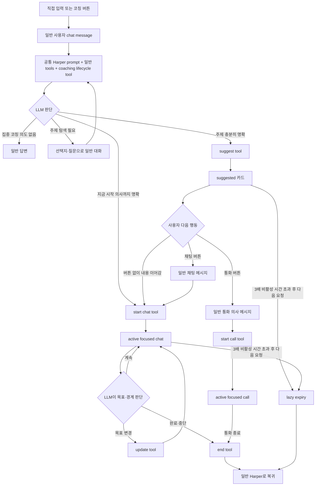

# Career 코칭 대화 구현 명세

문서 기준: 2026-09-22

이 문서는 기존 Career 대화 안에서 커리어 코칭을 자연스럽게 제안하고, 채팅 또는 통화로 진행하고, 적절한 시점에 종료하는 현재 로컬 구현 계약을 정의한다. 버튼 전용 진입 판정, 숨김 진입 메시지, 고정된 제안 흐름과 별도 상태 변경 API는 제거했다. 데이터베이스 migration 적용과 배포는 아직 하지 않았다.

범위는 온보딩을 마친 사용자의 Career 대화다. 온보딩 중에는 기존 onboarding flow와 그 전용 extraction·질문 진행을 유지하고, coaching lifecycle tool을 노출하지 않는다.

## 1. 제품 결정

Career 코칭은 별도 탭, 별도 대화방, 정해진 설문이 아니다. 사용자는 평소처럼 Harper에게 메시지를 보내고, 같은 Harper가 대화의 의미를 보고 집중 코칭을 제안하거나 시작한다.

다음 원칙을 사용한다.

1. 사용자가 직접 입력한 코칭 요청과 “커리어 고민과 다음 커리어에 대해서 이야기하기” 버튼은 같은 일반 채팅 경로를 사용한다.
2. 버튼은 화면에 보이는 일반 사용자 메시지 하나를 전송할 뿐이다. 별도 mode, 숨김 메시지, 진입 flag, 강제 tool 호출을 만들지 않는다.
3. 코칭 요청인지, 주제가 충분히 구체적인지, 선택지를 먼저 제시할지, 몇 분을 제안할지는 원본 Harper LLM이 판단한다.
4. 이 판단을 별도 intent classifier, 키워드 매칭, 정규식, 사후 검토 LLM, 고정 질문 순서로 구현하지 않는다.
5. LLM에는 일반 대화에서도 사용할 수 있는 `manage_career_coaching_activity` tool과 짧은 판단 지침을 제공한다.
6. LLM은 주제가 충분히 정해졌을 때 `suggest`, 사용자가 실제 논의를 시작했을 때 `start`, 목표가 바뀌었을 때 `update`, 대화가 끝났을 때 `end`를 선택한다.
7. 카드의 버튼은 편의를 위한 선택지다. 사용자는 버튼을 누르지 않고 다음 메시지를 입력해도 코칭을 시작하거나 이어갈 수 있다.
8. 채팅 코칭은 벽시계의 총 진행 시간이 아니라 목표와 agenda의 진척으로 운영한다. 시간은 대화 범위를 조절하는 계획 신호다.
9. 장시간 대화가 없을 때만 구조적인 만료 기준을 사용한다. 대화 의미에 따른 시작·진행·종료는 LLM이 판단한다.
10. 확인된 사실, 최신 시장 정보, 회사·역할 정보가 필요한 답변은 기존 read·search tool로 근거를 확보한다. 코칭이라는 이유로 추정 사실을 만들어내지 않는다.
11. `suggest`는 사용자가 집중적인 코칭 대화를 원한다는 의미가 현재 요청이나 직전 탐색 대화에서 확인될 때 사용한다. 단순 정보 질문, 공고 평가, 추천 요청, 설정 변경, 짧은 감정 표현만으로 카드를 만들지 않는다.
12. active activity보다 사용자의 현재 요청이 항상 우선한다. 잠깐 벗어난 질문에 코칭을 억지로 연결하지 않고, 실제 목적이 바뀌었으면 LLM이 activity를 update하거나 end한다.

## 2. 하지 않는 구현

다음 구현은 제거하거나 새로 만들지 않는다.

- `conversationStarterId=career_coaching`과 특정 문장의 정확 일치로 코칭 진입을 인정하는 로직
- `careerCoachingEntryRequested` 같은 버튼 전용 authorization flag
- `career_coaching_entry`처럼 사용자가 보낸 것처럼 저장하지만 화면에서는 숨기는 메시지
- “코칭”, “고민”, “이직” 같은 단어 목록으로 코칭 intent를 판정하는 코드
- 코칭 요청마다 주제와 시간을 반드시 한 번씩 질문하도록 강제하는 상태 머신
- 주제별 분기, 예를 들어 해외 이직·직무 전환·연봉·권태 전용 상태나 tool
- LLM 답변을 정규식으로 검사해 카드 생성 여부를 바꾸거나 정해진 문장으로 덮어쓰는 로직
- 코칭 시작 전에 별도 분류 LLM이나 사후 검토 LLM을 호출하는 구조
- 카드에서 채팅을 선택했다는 이유만으로 클라이언트가 LLM을 거치지 않고 활동을 시작시키는 API
- 예정 시간이 지났다는 이유로 진행 중인 응답을 끊거나 agenda 완료를 코드로 추정하는 로직
- 코칭 중 나온 모든 발언을 Memory나 Search Brief에 자동 저장하는 extractor
- activity가 있다는 이유만으로 일반 질문 끝에 원래 코칭 주제를 다시 묻는 deterministic re-engagement

## 3. 사용자 경험

### 3.1 자유로운 진입

다음 입력은 모두 동일한 `/api/talent/chat` 요청이다.

- 사용자가 직접 “커리어 관련해서 대화를 하고 싶어요”라고 입력한다.
- 사용자가 “요즘 커리어에 고민이 있어요”라고 입력한다.
- 사용자가 “미국으로 옮겨 일하는 문제를 같이 생각해보고 싶어요”라고 구체적인 고민을 입력한다.
- 사용자가 홈 화면의 코칭 버튼을 누른다.

코칭 버튼은 locale에 맞는 짧은 고정 문장을 composer가 일반 사용자 메시지로 전송한다. 메시지는 사용자가 누른 결과로 타임라인에 그대로 보이고, 다른 채팅과 같은 방식으로 저장된다. 버튼 클릭을 설명하는 별도 metadata는 필요하지 않다.

### 3.2 주제가 아직 넓은 경우

사용자가 막연하게 코칭을 요청하면 Harper는 이미 제공된 프로필, Search Brief, Memory, 최근 대화, 저장하거나 검토한 기회를 활용해 몇 가지 유용한 방향을 제안할 수 있다. 필요한 맥락이 기본 prompt에 충분하지 않으면 기존 범용 read tool을 사용한다.

이 단계에서 LLM이 따라야 하는 고정 질문 순서는 없다. 가능한 행동은 다음과 같다.

- 최근 맥락에서 구체적인 방향 몇 개를 제시하고 무엇이 가장 필요한지 묻는다.
- 사용자의 말에 이미 중요한 긴장이 보이면 그 차이를 짚고 한 가지 질문으로 범위를 좁힌다.
- 주제가 충분히 분명하면 별도 확인 질문 없이 하나의 코칭 활동을 제안한다.
- 사용자가 원하는 시간까지 이미 말했다면 그대로 사용하고, 말하지 않았다면 대화 범위에 맞는 시간을 먼저 제안한다.

아직 하나의 주제가 정해지지 않았다면 tool을 호출하지 않아도 된다. 일반 대화로 선택지를 탐색한 뒤 사용자가 방향을 고르면 `suggest`를 호출한다.

### 3.3 주제가 명확해진 경우

하나의 집중 대화로 만들 수 있을 정도로 주제가 구체적이면 LLM은 `manage_career_coaching_activity(action=suggest)`를 호출한다.

사용자가 주제를 골랐지만 아직 시작 여부를 고르는 중이면 `suggest`를 사용한다. 원인을 아직 모르는 문제도 원인 파악과 결정 자체를 정직한 topic으로 만들 수 있으므로, intake가 끝날 때까지 카드를 미루지 않는다. 이전 프로필에 구체적인 정보가 있다는 이유만으로 주제 선택을 시작으로 간주하지 않는다. 현재 메시지에서 바로 시작하겠다고 했거나 채널을 받아들였거나, 직전 코칭 탐색에 이어 실제 경험을 풀거나 선택한 주제의 분석을 요청한 경우에는 §3.4의 direct `start`를 사용할 수 있다.

`suggest`에는 다음 최소 정보가 들어간다.

- `topic`: 이번 집중 대화에서 다룰 하나의 자유 형식 주제
- `suggestedMinutes`: 이 범위를 다루기에 적절하다고 판단한 기본 시간

시간은 10·20·30분 enum으로 제한하지 않는다. 모델이 보통 사람이 이해하기 쉬운 단위로 제안하되, 사용자의 요청과 주제 범위를 따른다. 사용자가 다른 시간을 원하면 LLM이 `update`로 조정한다.

tool이 성공하면 사용자에게 보이는 제안 카드가 생성된다. Harper는 카드와 함께 왜 이 주제가 유용한지, 어느 정도 범위를 다룰 수 있는지를 자연스럽게 설명할 수 있다. 정해진 안내 문장을 출력하도록 강제하지 않는다.

카드는 아직 `suggested` 상태다. 다음 행동은 모두 가능하다.

- 카드의 `채팅으로 시작`을 누른다.
- 카드의 `통화로 시작`을 누른다.
- 버튼을 누르지 않고 바로 자기 상황을 설명한다.
- 시간이나 주제를 바꾸자고 말한다.
- 다른 이야기를 시작하거나 제안을 거절한다.

### 3.4 버튼 없이 채팅으로 시작

사용자가 제안 뒤에 “나는 미국에서 일하는 방법을 이야기하고 싶어”처럼 바로 내용을 이어가면, 원본 LLM은 이 메시지가 제안된 주제를 실제로 시작하는 발화인지 의미로 판단한다.

시작하는 발화라고 판단하면 같은 응답 안에서 먼저 `start`를 호출한다. 사용자가 “시작”이라는 단어를 썼는지 검사하지 않는다.

사용자가 첫 요청부터 주제와 원하는 시간, 바로 시작하겠다는 뜻을 충분히 밝혔으면 `start`가 active activity를 한 번에 생성할 수 있다. `suggest → start` 두 번의 mutation이나 카드 수락만을 위한 불필요한 사용자 턴을 요구하지 않는다.

`start`에는 다음 정보가 들어간다.

- suggested 카드에서 시작한다면 현재 activity의 ID와 revision, direct start라면 새 topic
- `channel=chat`
- 최종 `plannedMinutes`
- `agenda`: 이번 대화에서 판단하거나 만들어낼 핵심 항목 목록

agenda의 항목 수나 형태를 코드에서 시간별로 정하지 않는다. LLM이 예정 시간과 현재 주제의 복잡도를 보고 범위를 조절한다. 짧은 대화라면 가장 결정적인 한두 가지에 집중할 수 있고, 긴 대화라면 여러 판단 축과 실제 결과물을 포함할 수 있다.

tool이 성공하면 해당 턴부터 active coaching 지침으로 이어서 답한다. 다음 턴부터는 저장된 active activity가 prompt에 포함된다.

### 3.5 카드에서 채팅 선택

`채팅으로 시작` 버튼도 상태를 직접 변경하지 않는다. 일반 사용자 메시지, 예를 들어 “이 주제로 채팅을 시작할게요”를 같은 채팅 API로 전송한다.

LLM은 카드 상태와 사용자 메시지를 보고 `start(channel=chat)`를 호출한다. 이후 동작은 버튼 없이 시작한 경우와 같다. UI 버튼과 자연어 입력이 서로 다른 코칭 구현으로 갈라지지 않는다.

카드 버튼 요청에는 사용자가 실제로 누른 대상을 식별하는 `activityMessageId`와 `expectedRevision`을 구조적 reference로 함께 보낸다. 이 값은 intent를 대신하거나 상태를 직접 변경하지 않는다. 서버는 오래된 카드가 다른 activity를 시작시키지 않도록 reference의 소유권과 최신 revision을 확인하고, LLM에는 사용자가 선택한 카드의 snapshot을 제공한다. 화면의 사용자 메시지는 그대로 보이며 숨김 발화를 만들지 않는다.

### 3.6 카드에서 통화 선택

`통화로 시작` 버튼은 통화 의사를 나타내는 일반 사용자 메시지를 전송한다. LLM이 `start(channel=call)`을 호출하면 tool 결과에 클라이언트가 이해할 수 있는 `open_call` UI action이 포함된다.

클라이언트는 tool 성공을 확인한 뒤 기존 통화 UI를 연다. 통화가 열리기 전에는 activity가 성공적으로 active 상태가 되었는지 확인한다. 통화 연결이 실패하면 서버 전용 rollback이 방금 start한 revision과 여전히 일치할 때만 activity를 `suggested`로 되돌린다. 다른 기기나 후속 요청이 이미 상태를 바꿨으면 rollback하지 않고 최신 상태를 다시 읽는다. 사용자는 같은 카드에서 다시 시도하거나 채팅으로 이어갈 수 있다.

통화 session/token endpoint는 클라이언트가 보낸 opening prompt를 신뢰하지 않고 activity ID와 revision으로 저장된 active activity를 서버에서 다시 읽는다. channel이 call이고 최신 revision이 일치할 때만 저장된 topic, plannedMinutes, agenda를 통화 prompt에 제공한다. 첫 질문의 내용은 LLM이 결정한다. 카드 내용을 그대로 읽거나 다시 막연한 고민을 묻도록 고정하지 않는다.

active 통화에도 같은 lifecycle tool과 범용 read/search tool을 제공한다. 통화 중 topic이나 agenda가 실제로 바뀌면 update 결과를 즉시 현재 session에 반영하고, 통화가 끝나면 bound activity ID를 기준으로 end한다. 이 과정은 `conversationStarterId`에 의존하지 않는다.

### 3.7 active 채팅 코칭

active 상태에서는 공통 Harper prompt와 기존 도구에 짧은 focused-coaching instruction을 추가한다. 이 지침은 다음 결과를 요구하지만 순서를 강제하지 않는다.

- activity의 topic과 agenda를 현재 대화의 우선 맥락으로 사용한다.
- 사용자의 답에 따라 가설을 수정하고 agenda를 유연하게 재구성한다.
- 이미 아는 내용을 다시 수집하지 않는다.
- 질문만 연속해서 던지지 않고, 반영·정보 제공·비교·가정 검토·초안 작성·다음 행동 설계를 적절히 섞는다.
- 예정 시간에 맞춰 범위를 조절하되, 벽시계 때문에 답변을 끊지 않는다.
- 최신 정보가 결론을 바꾸면 기존 web/search/read tool로 확인한다.
- 세션이 끝날 때 사용자가 대화 전보다 명확한 판단, 실제 결과물 또는 가치 있는 다음 행동을 갖도록 한다.

agenda는 rigid checklist가 아니다. 사용자가 더 중요한 새 문제를 꺼내면 LLM은 대화를 자연스럽게 따라가고, 실제 집중 목표가 바뀌었을 때만 `update`로 topic이나 agenda를 바꾼다.

현재 발화가 코칭과 무관한 단발성 질문이면 그 질문을 먼저 직접 처리하고, 답변 끝에 코칭을 억지로 재개하지 않는다. 사용자가 잠깐 확인한 뒤 기존 주제로 돌아오는 맥락이면 activity를 유지할 수 있다. 사용자가 일반 작업으로 전환했거나 다른 목적을 계속 다루려는 의미가 분명하면 먼저 `end`하거나 `update`한 뒤 현재 요청을 처리한다. 이 구분도 키워드나 질문 종류 목록이 아니라 대화 의미로 판단한다.

### 3.8 종료

채팅 코칭의 기본 종료 기준은 의미적 목표 달성이다. 원본 LLM은 다음과 같은 맥락에서 `end`를 호출할 수 있다.

- 사용자가 그만하거나 다른 일반 작업으로 돌아가겠다고 한다.
- 사용자가 제안을 거절한다.
- agenda에서 중요했던 판단과 결과물이 충분히 정리되었다.
- 사용자와 합의한 다음 행동이 생겼고 더 이어갈 질문의 가치가 낮다.
- 대화 중 실제 목표가 사라지거나 별도 세션으로 다시 잡는 편이 낫다.

이를 단어 목록이나 완료 점수로 판정하지 않는다. 목표가 끝났는지 애매하면 LLM이 자연스럽게 확인할 수 있다. `end` 호출 뒤에는 현재 턴에서 결론과 다음 행동을 필요한 만큼 정리하고 추가 코칭 질문을 계속 붙이지 않는다.

`end`가 성공하면 conversation의 현재 activity pointer를 비운다. 다음 사용자 턴에는 active coaching instruction이 들어가지 않고 일반 Harper로 동작한다. 과거 카드와 대화는 타임라인에 그대로 남는다.

### 3.9 비활성 시간 만료

LLM의 의미 판단과 별개로, 응답하지 않은 제안이나 장시간 자리를 비운 세션이 영구적으로 현재 activity에 남지 않게 하는 구조적 fallback을 둔다.

- `suggest` 때 suggestedMinutes와 `updatedAt`을 저장한다.
- `start` 때 plannedMinutes와 startedAt을 저장한다.
- active의 마지막 활동 시각은 activity payload를 매 턴 다시 쓰지 않고, startedAt 이후 저장된 최신 일반 사용자·assistant chat 또는 call transcript의 시각으로 계산한다. 카드, system, 자동 event, 기술 메시지는 제외한다.
- 다음 요청의 사용자 메시지를 저장하기 전에 suggested는 `updatedAt + suggestedMinutes × 3`, active는 위에서 계산한 마지막 대화 시각과 `plannedMinutes × 3`을 비교한다. 현재 들어온 요청 때문에 만료 시계가 먼저 갱신되어서는 안 된다.
- 만료되었으면 같은 transaction에서 activity를 `ended`로 전환하고 pointer를 비운다.
- 만료 mutation 결과의 ended 카드도 같은 응답에서 클라이언트에 전달해, 오래된 suggested/active 버튼이 화면에 남지 않게 한다.
- 별도 cron이나 주기적인 LLM 호출은 필요하지 않다. 다음 요청에서 lazy하게 처리한다.
- 이 판정은 메시지 의미를 해석하지 않으며, 단지 suggested 또는 active activity 지침이 다음 방문까지 계속 붙는 것을 막는다.

만료 후 사용자가 이전 주제를 이어가고 싶다고 말하면 일반 Harper가 과거 대화를 보고 새 activity를 suggest하거나 바로 start할 수 있다. 별도 resume 상태를 만들 필요는 없다.

통화는 연결 종료가 명확한 구조적 경계이므로, 통화가 끝날 때 activity를 `end`한다. 통화 안에서 사용자가 먼저 종료를 요청하면 LLM이 `end`와 기존 통화 종료 tool을 함께 사용한다.

## 4. 전체 실행 흐름



## 5. Prompt 조립

### 5.1 활동이 없을 때

일반 post-onboarding prompt를 그대로 사용한다. 코칭 전용 대화 mode를 활성화하지 않는다. `manage_career_coaching_activity` tool의 설명과 아주 짧은 공통 지침만 제공한다.

공통 지침의 역할은 다음 정도다.

- 사용자가 집중적인 커리어 대화를 원할 때 tool을 사용할 수 있다.
- 주제가 넓으면 먼저 자연스럽게 탐색하고, 충분히 구체적이면 하나의 topic과 적절한 시간을 suggest한다.
- 사용자가 구체적인 topic과 지금 시작하겠다는 뜻을 이미 밝혔다면 suggest를 거치지 않고 start로 active activity를 만들 수 있다.
- `suggest`에는 현재 요청 또는 직전 탐색 대화에서 확인되는 집중 코칭 의도가 필요하다. 단순 정보 질문, 공고 평가, 추천 요청, 설정 변경이나 짧은 감정 표현을 그 자체만으로 coaching activity로 만들지 않는다.
- 현재 activity pointer가 없다면 과거 대화 맥락에 코칭 내용이 있어도 그것은 active agenda가 아니다. 사용자의 현재 요청 없이 과거 코칭을 재개하거나 re-engagement 질문을 만들지 않는다.

구체적인 표현, 선택지 개수, 질문 순서, 기본 시간은 prompt에 고정하지 않는다.

### 5.2 suggested 상태

다음의 작은 snapshot만 추가한다.

```text
Current coaching suggestion
- activity ID / revision
- topic
- suggested minutes
- status: suggested
```

이 snapshot은 사용자가 카드 버튼을 눌러야 한다고 강제하지 않는다. LLM은 사용자가 주제를 실제로 이어가면 start하고, 시간을 바꾸면 update하고, 거절하거나 다른 이야기로 이동하면 end하거나 일반적으로 답할 수 있다.

### 5.3 active 상태

다음 snapshot과 focused-coaching instruction을 추가한다.

```text
Active coaching activity
- activity ID / revision
- topic
- planned minutes
- agenda
- channel
```

공통 Harper의 사실성, 권한, 사용자 맥락, Search Brief, Memory, 범용 read/write tool 계약은 유지한다. active block은 현재 대화의 우선 목적을 알려 주지만, 다른 도구를 막거나 사용자의 새 요청을 무시하게 하지 않는다.

focused instruction은 특정 주제별 대본 대신 매 턴 같은 판단 원칙을 준다.

- 현재 사용자가 해결하려는 결정, 불확실성, 감정 또는 결과물 중 무엇이 핵심인지 최신 발화로 계속 수정한다.
- 반영, 구체적인 질문, 가정 검토, 근거 조회, 선택지 비교, 문구·계획 작성 중 지금 가장 가치 있는 행동을 선택한다. 고정 순서로 모두 수행하지 않는다.
- 사용자가 전제를 교정하면 이전 가설을 버리고, 확인되지 않은 해석을 사용자 사실로 승격하지 않는다.
- 외부 사실이 결론을 바꾸면 실제 tool로 확인하고, 확인할 수 없으면 추정과 사실을 구분한다.
- 현재 발화가 단발성 다른 질문이면 그것을 직접 해결하고 자동으로 코칭 질문을 덧붙이지 않는다.
- 목표가 충분히 해결되면 결정, 실제 결과물 또는 가치 있는 다음 행동을 정리하고 end한다.

### 5.4 ended 상태

ended activity는 현재 prompt에 전용 block으로 넣지 않는다. 과거 메시지와 카드로만 남는다. 이후 사용자가 관련 내용을 다시 꺼내면 일반 Harper가 필요한 범위에서 최근 대화나 Memory를 사용한다.

일반 prompt의 위 경계 때문에 과거 대화에 코칭 주제가 남아 있다는 이유만으로 세션이 되살아나지 않는다. 새 focused activity에는 현재 사용자의 의도와 새 lifecycle tool call이 필요하다.

### 5.5 현재 턴의 tool 결과

prompt는 요청 시작 시점의 상태로 조립되므로, 같은 턴에서 상태가 바뀌면 tool 결과의 짧은 `assistantInstruction`이 나머지 응답을 연결한다.

- `suggest` 성공: 제안 카드가 보인다는 사실과 자연스럽게 선택을 이어가라는 지침
- `start` 성공: 저장된 topic·시간·agenda로 지금부터 집중 대화를 진행하라는 지침
- `update` 성공: 바뀐 activity snapshot을 기준으로 계속하라는 지침
- `end` 성공: 필요한 결론과 다음 행동을 정리하고 집중 코칭을 더 이어가지 말라는 지침

응답 문구 자체는 tool 결과에 넣지 않는다.

## 6. Tool 계약

새로운 대화 상황마다 tool을 추가하지 않는다. 하나의 범용 lifecycle tool을 사용한다.

```ts
manage_career_coaching_activity({
  action: "suggest" | "start" | "update" | "end",
  activityMessageId?: number,
  expectedRevision?: number,
  topic?: string,
  suggestedMinutes?: number,
  plannedMinutes?: number,
  channel?: "chat" | "call",
  agenda?: string[]
})
```

### 6.1 `suggest`

하나의 집중 대화 주제와 기본 시간을 사용자에게 제안할 준비가 되었을 때 사용한다.

- topic과 suggestedMinutes가 필요하다.
- 현재 요청이나 바로 앞 탐색 대화에서 사용자가 집중 코칭을 원한다는 의미가 확인되어야 한다. 일반 커리어 질문이라는 이유만으로 호출하지 않는다.
- 주제가 아직 넓으면 먼저 일반 대화에서 선택지를 제안할 수 있다.
- 사용자의 말이 이미 충분히 구체적이면 추가 intake 없이 바로 suggest할 수 있다.
- 제안은 세션 시작이 아니다.
- 열린 activity가 있으면 중복 생성하지 않고, 현재 activity를 update하거나 end할지 LLM이 먼저 판단한다.

### 6.2 `start`

사용자가 제안한 주제를 실제로 논의하기 시작했거나 명확히 동의했을 때 사용한다.

- 기존 suggested activity를 시작할 때는 activityMessageId, expectedRevision, channel, plannedMinutes, agenda가 필요하다.
- 열린 activity가 없고 사용자가 처음부터 지금 시작하겠다는 뜻을 분명히 밝힌 경우에는 topic, channel, plannedMinutes, agenda로 active activity를 원자적으로 생성한다.
- 명시적인 카드 클릭은 가능한 근거 중 하나일 뿐 필수 조건이 아니다.
- agenda는 LLM이 시간과 주제에 맞게 작성한다.
- 사용자가 구체적인 고민을 곧바로 풀어놓았다면 별도 “시작할까요?” 질문 없이 같은 턴에 start할 수 있다.
- suggested 상태에서 사용자가 topic이나 시간을 교정하면서 시작하면, start가 최종 topic·plannedMinutes·agenda를 한 transaction에서 반영한다. `update`와 `start`를 연달아 호출할 필요가 없다.

### 6.3 `update`

사용자와의 대화로 topic, 시간 또는 agenda가 실질적으로 바뀌었을 때만 사용한다. 매 턴 progress를 저장하기 위한 tool이 아니다. 정성적인 agenda 진척은 다음 응답에서 대화 맥락으로 판단한다.

### 6.4 `end`

집중 대화가 완료되거나 중단되었을 때 사용한다. 종료 이유를 세부 enum으로 분류하지 않는다. 사용자에게 필요한 설명은 assistant 응답에 남기고, tool은 상태와 pointer만 안전하게 변경한다.

### 6.5 코드가 검증하는 것

Deterministic code는 다음 구조적 계약만 검증한다.

- 로그인 사용자와 conversation 소유권
- 허용된 action과 channel
- action별 필수 필드와 문자열·배열 길이
- activity ID와 conversation의 일치
- 허용된 상태 전이
- expectedRevision과 동시 수정 충돌
- conversation당 열린 activity 하나
- idempotency
- plannedMinutes의 제품상 허용 범위

주제가 좋은지, 코칭 요청인지, agenda가 충분한지, 목표가 완료되었는지는 코드가 판정하지 않는다.

suggestedMinutes와 plannedMinutes는 정수 5~120분만 구조적으로 허용한다. topic은 공백이 아닌 사용자 locale의 짧은 문장으로 제한하고, agenda는 1~8개의 짧은 항목만 허용한다. 이는 대화 의미를 분류하는 규칙이 아니라 잘못된 payload, 비정상적인 만료 시간과 과도한 카드 크기를 막는 데이터 경계다. 10·20·30분이나 특정 topic 목록으로 선택지를 제한하지 않는다.

### 6.6 같은 턴의 tool 실행과 응답

lifecycle tool은 실행 직후 응답 생성을 중단시키는 `stopAfterExecution` tool이 아니다. 성공 또는 실패 결과를 원본 LLM에 돌려주고, LLM이 결과를 반영한 최종 답변을 기존 방식으로 바로 stream한다. 일반 답변 전체를 tool 호출 여부가 확정될 때까지 보류하지 않는다.

streaming continuation은 최초 호출에 노출된 tool 전체를 계속 사용할 수 있어야 한다.

- 사용자 맥락이나 실제 기회가 필요한 제안에서는 기존 `read_talent_context`, 추천·역할 조회 등의 결과 뒤에 lifecycle tool을 호출할 수 있어야 한다.
- 최신 외부 사실이 필요한 시작 턴에서는 기존 search/read tool과 lifecycle tool을 같은 agent turn 안에서 필요한 순서로 사용할 수 있어야 한다.
- 종료 턴에 사용자가 durable fact나 Search Brief 변경을 명시적으로 확인했다면 기존 `write_talent_context`와 `end`도 같은 agent turn에서 독립적으로 성공하거나 실패할 수 있어야 한다.
- lifecycle mutation 뒤에는 tool 결과의 최신 activity snapshot과 `assistantInstruction`을 사용해 최종 답변을 만든다.
- 카드 생성, 시작, 변경 또는 종료를 완료했다고 말해야 하는 경우에는 먼저 lifecycle tool을 실행한다. 아직 성공하지 않은 상태를 사용자에게 완료된 것처럼 stream하지 않는다.
- 불필요한 반복 호출을 막기 위해 총 tool-call 상한은 기존 공통 상한을 유지한다. 한 번에 가능한 전이는 `suggest`, `start`, `update`, `end` 중 현재 요청에 필요한 하나가 기본이다.

직전 tool 이름별 continuation allowlist나 terminal 분류는 두지 않는다. `manage_career_coaching_activity`를 포함해 최초 호출에 노출된 모든 tool을 같은 turn의 다음 호출에서도 유지하여, 필요한 사실 확인과 카드 생성·상태 변경·최종 답변을 이어간다.

## 7. 상태와 데이터

### 7.1 최소 상태

상태는 세 개만 사용한다.

| 상태 | 의미 | prompt 영향 |
| --- | --- | --- |
| `suggested` | topic과 시간을 제안했지만 집중 대화는 시작하지 않음 | 작은 suggestion snapshot |
| `active` | 채팅 또는 통화의 focused coaching이 진행 중 | active snapshot + focused instruction |
| `ended` | 완료, 중단 또는 비활성 만료 | 전용 prompt 없음 |

별도 paused/resumed 상태는 두지 않는다. 짧은 중단은 active 상태와 sliding inactivity window 안에서 자연스럽게 이어지고, 만료 뒤 다시 이어가려면 LLM이 새 activity를 시작한다.

### 7.2 저장 방식

새 테이블을 추가하지 않는다. 현재 설계에서 도입한 저장 기반을 단순화해 재사용한다.

- `talent_messages.payload jsonb`: 사용자에게 보이는 코칭 카드와 activity payload
- `talent_conversations.career_coaching_activity_message_id`: 현재 suggested 또는 active activity를 가리키는 pointer

activity payload의 목표 형태는 다음과 같다.

```json
{
  "kind": "career_coaching_activity",
  "activityId": "uuid",
  "status": "suggested",
  "topic": "미국으로 옮겨 일하기 위한 현실적인 경로 정리",
  "suggestedMinutes": 20,
  "plannedMinutes": null,
  "agenda": [],
  "channel": null,
  "revision": 1,
  "createdAt": "...",
  "updatedAt": "...",
  "startedAt": null,
  "endedAt": null
}
```

topic, 시간, agenda는 LLM이 생성한 사용자 가시적 session plan이다. 이 값은 현재 prompt와 카드가 실제로 소비하므로 저장한다. 별도 reasoning, confidence, intent, progress score, 완료율은 저장하지 않는다.

### 7.3 mutation과 동시성

RPC는 한 transaction에서 소유권 확인, conversation 단위 lock, revision 검증, payload 변경, pointer 변경을 수행한다.

- `suggest`: 새 카드 생성, pointer 설정
- `start`: suggested → active 또는 열린 activity가 없을 때 active 카드 직접 생성
- `update`: suggested 또는 active 유지, 제공된 필드만 갱신
- `end`: suggested 또는 active → ended, pointer 제거
- lazy expiry: 조건을 만족한 suggested 또는 active → ended, pointer 제거
- call 연결 rollback: 방금 `start(channel=call)`한 revision과 정확히 일치할 때만 active → suggested

partial unique index로 conversation당 `suggested`와 `active`를 합쳐 하나만 허용한다. activity 조회는 conversation row의 pointer가 null이면 즉시 끝나므로 일반 사용자에게 추가 DB query가 생기지 않는다.

idempotency key는 모델이 만들지 않는다. 서버가 안정적인 client request ID 또는 저장된 user message ID, action, 대상 activity ID를 조합해 만든다. mutation이 성공한 뒤 stream이나 네트워크가 끊겨 같은 요청이 재시도되어도 같은 activity 결과를 반환해야 한다.

### 7.4 메시지 관계

버튼이 보낸 문장과 사용자가 직접 입력한 문장은 모두 `message_type=chat`이다. 코칭 카드는 `message_type=career_coaching_activity`인 assistant message다.

카드 메시지는 LLM 대화 원문에는 다시 주입하지 않는다. 현재 activity의 작은 snapshot을 별도 prompt block으로 제공한다. 카드가 빈 content를 가진다는 이유로 일반 대화 문맥을 오염시키지 않는다.

## 8. 카드와 UI

suggested 카드에는 topic, 제안 시간, `채팅으로 시작`, `통화로 시작`을 표시할 수 있다. 버튼은 편의 기능이며 필수 단계가 아니다.

active 카드에는 topic, plannedMinutes, agenda를 보여줄 수 있다. agenda는 진행률 UI나 체크박스로 강제하지 않는다. LLM의 내부 판단을 deterministic 완료율로 바꾸지 않기 위해서다.

ended 카드에는 종료 상태만 보여준다. 다음 방문마다 다시 참여를 유도하는 문구를 자동으로 만들지 않는다.

카드 버튼 동작은 다음 원칙을 따른다.

1. 사용자의 선택을 실제 chat message로 보내고, 클릭한 activity ID와 revision을 구조적 reference로 첨부한다.
2. 같은 `/api/talent/chat`과 같은 원본 LLM을 거친다.
3. LLM이 lifecycle tool을 호출한다.
4. tool 성공 뒤 UI를 갱신하거나 통화를 연다.

따라서 버튼과 자연어 입력의 의미 판단이 하나의 코드 경로에 머문다.

## 9. 사실성과 기존 도구

코칭 mode는 모델이 더 많은 사실을 아는 mode가 아니다. 다음 계약은 일반 대화와 같다.

- 저장된 프로필, Search Brief, Memory, 추천·저장 이력은 제공된 범위만 사실로 사용한다.
- 더 필요한 사용자 맥락은 범용 read tool로 읽는다.
- 비자, 연봉, 시장, 회사, 공고처럼 최신성이 중요한 내용은 web/search/company·opportunity tool로 확인한다.
- 조회하지 않은 최신 정보를 실제 데이터인 것처럼 말하지 않는다.
- 근거가 없으면 불확실성이나 추정임을 명확히 하고 필요한 확인을 제안한다.
- tool이 실패했으면 성공했다고 말하지 않는다.

코칭 전용 research tool이나 해외 이직 전용 tool은 추가하지 않는다.

## 10. Memory와 Search Brief

코칭의 activity, topic, agenda 자체를 Memory나 Search Brief에 복제하지 않는다. 시작·종료 선택, 나중에 이어갈지 여부, 다음 대화에서 할 일 같은 일회성 세션 운영 계획도 저장하지 않는다. 세션은 현재 집중 대화의 실행 상태이고, Memory와 Brief는 이후에도 사용할 확인된 사용자 맥락과 현재 탐색 기준이다.

원본 LLM은 기존 `read_talent_context`와 `write_talent_context`를 그대로 사용한다.

- 사용자가 확인한 장기적인 탐색 기준은 Search Brief에 반영할 수 있다.
- 이후 다시 설명하지 않아야 할 확인된 경험이나 결정 맥락은 Memory에 반영할 수 있다.
- Harper가 대화 중 세운 가설, 임시 agenda, 일시적인 감정은 사실처럼 저장하지 않는다.
- 무엇을 저장할지는 원본 LLM이 대화 의미로 판단한다.
- 별도 coaching extractor나 종료 후 일괄 저장 모델을 추가하지 않는다.

`end`와 context write는 서로 독립적인 tool call이다. 코칭을 끝냈다고 반드시 Memory를 쓰지 않고, Memory를 썼다고 activity를 자동 종료하지 않는다.

## 11. 일반 대화에 미치는 영향

자유 입력으로 코칭을 시작할 수 있으려면 post-onboarding 일반 agent에 lifecycle tool이 항상 제공되어야 한다. 이로 인해 생기는 의도한 영향은 다음 두 가지다.

1. 모든 일반 요청의 tool schema에 작은 lifecycle tool 하나가 추가된다.
2. LLM이 코칭 activity를 사용할지 의미로 판단할 수 있다.

추가 classifier, 선행 LLM 호출, 전체 답변 보류는 없으므로 일반 요청마다 별도의 모델 round trip을 추가하지 않는다. 모든 post-onboarding 요청에는 lifecycle tool schema만큼의 입력 token 비용이 생긴다. activity pointer가 null이면 activity row 조회와 expiry query를 하지 않고, 열린 activity가 있을 때만 snapshot 및 마지막 대화 시각을 읽는다.

잘못된 제안 가능성은 keyword gate로 막지 않는다. tool 설명, 공통 prompt, negative evaluation으로 관리한다. 일반적인 정보 질문, 공고 평가, 설정 변경, 문서 작업을 불필요하게 coaching activity로 만들지 않는지가 release gate다.

## 12. 주요 실행 시나리오

### A. 막연한 코칭 요청

사용자가 “커리어 코칭을 받고 싶어요”라고 말한다. Harper는 최근 맥락에서 가능한 방향을 몇 개 제안하고, 어느 방향이 필요한지와 대략적인 시간을 자연스럽게 묻는다. 하나의 주제가 아직 정해지지 않았으면 card를 만들지 않아도 된다.

### B. 구체적인 요청

사용자가 “미국에서 일하는 방향을 같이 생각해보고 싶어요”라고 말한다. Harper는 필요한 사용자 맥락과 최신 정보의 경계를 구분한다. 주제가 충분하면 적절한 시간을 정해 suggest하고 카드를 만든다. 확인하지 않은 비자 가능성을 확정적으로 말하지 않는다.

### C. 제안 뒤 버튼 없이 계속 말함

사용자가 자기 상황을 바로 설명한다. LLM은 이를 focused conversation의 실제 시작으로 판단해 `start(channel=chat)`를 호출하고, 예정 시간에 맞춘 agenda를 만든 뒤 같은 턴에서 대화를 이어간다.

### D. 카드에서 통화 선택

선택은 일반 메시지로 LLM에 전달된다. LLM이 `start(channel=call)`을 호출하고 tool 성공 뒤 통화가 열린다. 첫 응답은 topic과 agenda를 활용한다.

### E. active 중 공고 질문

공고가 현재 topic의 판단에 도움이 되면 agenda 안에서 다룬다. 별개 요청이면 직접 답하고 필요하면 activity를 update하거나 end한다. 관련성은 코드가 판정하지 않는다.

### F. active 중 목표가 바뀜

대화가 더 중요한 문제로 이동하고 사용자가 그 방향을 받아들이면 LLM이 `update`로 topic이나 agenda를 갱신한다. 몇 가지 예시를 위한 분기 코드는 없다.

### G. 자연스러운 종료

필요한 판단과 다음 행동이 정리되면 LLM이 `end`를 호출하고 결론을 전달한다. 다음 턴은 일반 Harper prompt를 사용한다.

### H. 사용자가 자리를 비움

제안 뒤 응답이 없거나 마지막 active 턴 뒤 계획 시간의 3배 동안 새 대화가 없으면 다음 요청 시작 시 activity를 lazy expiry한다. 새 요청은 일반 Harper가 처리한다.

### I. 일반 질문

사용자가 “이 공고 어때?”라고 묻는다. LLM은 일반 role·company 도구로 답할 수 있다. focused activity가 실제로 도움이 된다고 판단하지 않으면 lifecycle tool을 호출하지 않는다. 이를 특정 문장 예외 코드로 구현하지 않는다.

### 12.1 요청한 네 가지 주제의 품질 walkthrough

아래 발화들은 사용자가 먼저 코칭을 요청해 Harper가 방향을 탐색하고 있는 상황을 전제로 한다. 예시는 품질을 검토하기 위한 것이며 runtime의 주제별 분기, enum, 전용 tool 또는 prompt 예시 답안으로 옮기지 않는다.

| 사용자의 후속 발화 | 올바른 실행 | 품질상 반드시 지켜야 할 점 |
| --- | --- | --- |
| “해외로 이직하고 싶어. 어떻게 하면 될까?” | 해외 이동에서 실제로 결정해야 할 범위를 topic으로 좁혀 suggest한다. 사용자가 이어 말하면 start하며 현재 조건, 가능한 경로, 핵심 불확실성과 다음 행동을 다룰 agenda를 만든다. | 비자 가능성, 연봉, 채용 시장을 프로필만 보고 확정하지 않는다. 결론을 바꾸는 최신 사실은 search/read tool로 확인한다. |
| “지금은 개발자인데 PM으로 직무 전환을 하고 싶어.” | 사용자가 원하는 PM 역할과 전환 이유를 최신 맥락으로 파악하고, 기존 경험에서 이전 가능한 증거와 검증이 필요한 gap을 중심으로 범위를 잡는다. | 개발자→PM 전용 설문을 실행하지 않는다. 이미 알려진 경력을 다시 묻지 않고, 사용자가 말하지 않은 동기나 역량을 확정하지 않는다. |
| “연봉을 높여서 이직하고 싶은데 현실적으로 나 정도면 얼마일까?” | 현재 역할·경력·지역·회사 유형과 보상 구성 중 답에 필요한 맥락을 읽고, 최신 시장 자료가 필요하면 조회한 뒤 판단 가능한 범위를 만든다. | 기본급과 총보상을 섞지 않는다. 근거 없는 숫자를 만들지 않고, 공개 데이터의 한계와 개인 협상 범위를 구분한다. 단순 숫자 질문에 바로 답할 수 있으면 카드보다 답을 우선할 수 있다. |
| “요즘 일이 재미없네.” | 앞선 코칭 탐색에 대한 답이라면 무엇이 사라졌는지 이해하는 대화로 좁힐 수 있다. start 뒤에는 직무 자체, 문제의 반복, 성장, 자율성, 환경 또는 소진 중 실제 원인을 사용자의 답으로 구분한다. | 곧바로 이직이나 직무 변경을 권하지 않는다. 감정을 과도하게 진단하거나 임시 감정을 영구 선호로 저장하지 않는다. |

같은 문장이라도 앞에 코칭 요청이 없으면 동작이 달라질 수 있다. 예를 들어 일반 대화에서 “요즘 일이 재미없네”라고만 말한 경우에는 먼저 자연스럽게 반응하고 필요한 질문을 할 수 있지만, 그 문장 하나만으로 카드를 생성하지 않는다. 반대로 코칭 방향을 고르는 중의 같은 문장은 현재 요청에 대한 답이므로 suggest 또는 start의 근거가 될 수 있다. 이 차이는 문장 매칭이 아니라 전체 대화 의미로 판단한다.

### 12.2 전환·실패 walkthrough

| 상황 | 기대 동작 |
| --- | --- |
| suggested 카드 뒤 사용자가 버튼 없이 자세한 상황을 말함 | 해당 activity를 start하고 그 발화를 첫 코칭 내용으로 사용한다. 같은 내용을 다시 묻지 않는다. |
| 첫 요청부터 “20분 동안 이 주제로 지금 이야기하자”고 함 | start가 active activity를 직접 생성한다. suggest와 start를 연속 호출하지 않는다. |
| active 중 잠깐 관련 없는 사실 질문을 함 | 질문에 직접 답하고 코칭 질문을 자동으로 붙이지 않는다. 일시적 우회라면 activity를 유지할 수 있다. |
| active 중 일반 작업으로 완전히 전환함 | LLM이 end한 뒤 현재 요청을 처리한다. 이후 focused instruction이 남지 않는다. |
| 열린 activity가 있는데 사용자가 코칭 버튼을 다시 누름 | 현재 snapshot을 보고 이어갈지 목적을 바꿀지 자연스럽게 다룬다. 두 번째 열린 activity를 만들지 않는다. |
| 오래된 카드 버튼을 다른 기기에서 누름 | activity ID·revision 검증이 실패하며 다른 최신 activity를 잘못 시작하지 않는다. 최신 상태를 다시 보여준다. |
| suggest/start는 성공했지만 답변 stream이 끊김 | DB mutation은 유지하고 재조회 시 카드가 보인다. 같은 요청의 재시도는 idempotency key로 중복 activity를 만들지 않는다. |
| 통화 start 뒤 UI 연결이 실패함 | 정확히 방금 시작한 revision일 때만 suggested로 rollback한다. 후속 변경을 되돌리지 않는다. |
| inactivity 임계점을 넘긴 뒤 사용자가 이전 주제로 돌아옴 | 현재 요청을 저장하기 전에 기존 activity를 end한다. LLM은 과거 대화를 참고해 새 activity를 직접 start하거나 suggest할 수 있다. |

## 13. 실패와 복구

| 실패 | 처리 |
| --- | --- |
| lifecycle tool을 호출하지 않음 | 일반 답변은 그대로 전달된다. 카드가 필수라고 가정해 답변을 폐기하지 않는다. evaluation으로 누락률을 관리한다. |
| suggest RPC 실패 | 카드 생성 성공을 주장하지 않고 tool 오류를 받은 LLM이 자연스럽게 복구한다. |
| start RPC 실패 | active prompt나 통화 UI를 열지 않는다. |
| call UI 연결 실패 | start 직후 revision이 그대로일 때만 suggested로 rollback한다. 이미 바뀌었으면 최신 상태를 유지한다. |
| revision 충돌 | 최신 activity를 다시 읽어 LLM에 반환한다. 오래된 상태로 덮어쓰지 않는다. |
| 오래된 카드 action reference | 현재 activity와 ID·revision이 다르면 mutation하지 않고 최신 snapshot을 반환한다. |
| 중복 tool call | idempotency key와 transaction lock으로 같은 활동을 재사용한다. |
| activity mutation 뒤 stream 중단 | 저장된 activity를 유지하고 다음 조회에서 카드를 복구한다. 같은 요청의 재시도는 중복 생성하지 않는다. |
| 잘못된 payload | 카드로 렌더하지 않고 오류를 기록한다. |
| 만료와 사용자 요청 동시 발생 | 같은 transaction의 lock과 최신 timestamp가 순서를 결정한다. |
| 외부 정보 조회 실패 | 확인하지 못한 사실을 만들지 않고 한계나 대안을 설명한다. |

## 14. 고려 사항 20개 점검

| # | 고려 사항 | 설계 판단 |
| --- | --- | --- |
| 1 | 직접 입력 진입 | 모든 일반 chat message에서 원본 LLM이 판단한다. |
| 2 | 버튼 진입 | 보이는 일반 메시지만 전송하며 별도 flag가 없다. |
| 3 | 일반 대화 오탐 | tool 설명·prompt·evaluation으로 관리하고 keyword gate를 두지 않는다. |
| 4 | 주제 탐색 | 충분히 구체적이지 않으면 tool 전 일반 대화로 탐색한다. |
| 5 | 주제 일반화 | 자유 형식 topic을 사용하고 사례별 enum이 없다. |
| 6 | 시간 제안 | LLM이 범위에 맞춰 정하며 고정 선택지를 강제하지 않는다. |
| 7 | 카드 선택 강제 금지 | 사용자가 그냥 이어 말해도 start할 수 있다. |
| 8 | agenda 품질 | start 시 LLM이 시간과 주제에 맞춰 작성한다. |
| 9 | rigid checklist 방지 | agenda를 진행률 state machine으로 만들지 않는다. |
| 10 | 채팅 집중도 | active prompt가 topic·agenda·결과물을 우선한다. |
| 11 | 통화 연결 | 같은 activity와 tool 계약을 사용한다. |
| 12 | 의미적 종료 | LLM이 목표 달성과 사용자 경계를 보고 end한다. |
| 13 | 방치 세션 종료 | 현재 요청 저장 전, suggested 또는 마지막 저장 대화 시각에서 계획 시간의 3배가 지나면 lazy expiry한다. |
| 14 | 다음 방문 복귀 | ended pointer를 비워 일반 prompt로 돌아간다. |
| 15 | 사실성 | 기존 범용 read/search tool과 동일한 근거 계약을 쓴다. |
| 16 | Memory 경계 | 확인된 durable fact만 기존 공통 tool로 저장한다. |
| 17 | 동시성 | activity reference, revision, transaction lock, partial unique index를 사용한다. |
| 18 | 지연 | classifier나 사후 검토 호출을 추가하지 않는다. |
| 19 | 접근성 | 카드 action은 버튼과 상태를 읽을 수 있고 일반 입력으로도 대체 가능하다. |
| 20 | 평가 | 자유 진입, 자연스러운 start/end, 일반 요청 negative set을 새 dataset으로 검증한다. |

## 15. 기존 구현에서 교체할 항목

| 기존 요소 | 목표 변경 |
| --- | --- |
| coaching starter ID가 chat/call mode를 결정 | 버튼이 일반 chat message를 전송 |
| exact starter text 검증 | 제거 |
| `careerCoachingEntryRequested` | 제거 |
| `career_coaching_entry` 숨김 메시지 | 제거 |
| 코칭 버튼 요청을 타임라인에서 숨김 | 일반 사용자 메시지로 표시 |
| 진입/open activity에서만 lifecycle tool 노출 | post-onboarding 일반 agent에 tool 상시 노출 |
| `offer/start/update/pause/resume/close` | `suggest/start/update/end`로 단순화 |
| 카드 action이 별도 PATCH로 직접 mutation | 일반 chat → LLM tool 경로로 통합 |
| 카드 action에 대상 binding이 없음 | visible chat + activity ID/revision reference로 stale action 차단 |
| offered/paused 전용 prompt 분기 | suggested snapshot과 active focused block만 유지 |
| title + goal | topic + 시간 + start 시 agenda |
| call 시작 전 고정 opening instruction | active activity snapshot을 주고 LLM이 첫 응답 결정 |
| realtime/live session이 coaching starter ID로 context를 선택 | activity ID/revision을 bind하고 서버에서 active snapshot 재조회 |
| call wrapup이 coaching starter ID로 activity를 종료 | bound activity ID에 idempotent end 적용 |
| 발화 유무로 call close/pause 분기 | 통화 종료라는 구조적 경계에서 end |
| 무기한 active 가능성 | 현재 요청 저장 전 마지막 실제 대화 기준 inactivity × 3 lazy expiry |
| coaching tool이 read/search 뒤 호출되지 못함 | streaming continuation마다 최초 노출 tool 전체 유지 |

현재 migration이 어느 환경에도 적용되지 않았다면 같은 migration 파일을 목표 schema와 RPC로 교체한다. 이미 적용된 환경이 있으면 기존 migration을 수정하지 않고 별도 corrective migration을 만든다. 실제 적용 여부는 migration history가 아니라 live schema와 배포 기록으로 확인한다.

### 15.1 주요 구현 지점

| 코드 | 반영한 변경 |
| --- | --- |
| `src/lib/career/prompts/conversationStarters.ts`, `src/hooks/career/useCareerChat.ts` | coaching starter ID, 숨김 사용자 말풍선과 후속 mode 전달을 제거하고 visible 일반 chat으로 통합 |
| `src/app/api/talent/chat/route.ts` | `careerCoachingEntryRequested`, 전용 message type과 exact entry 경계를 제거하고, 요청 저장 전 expiry·항상 사용 가능한 post-onboarding lifecycle tool·activity reference를 연결 |
| `src/lib/career/llmTools.ts`, `src/lib/career/llm.ts` | activity가 있을 때만 tool을 노출하는 gate를 제거하고 최초 노출된 read/write/search·lifecycle tool 전체를 continuation에도 유지 |
| `src/lib/talentOnboarding/tools.ts` | `offer/pause/resume/close`와 entry authorization을 `suggest/start/update/end` 계약으로 교체하고 direct active start와 최신 snapshot 결과를 지원 |
| `src/lib/career/prompts/cases/coachingPrompts.ts`, `src/lib/career/prompts/conversationPlan.ts` | explicit-entry prompt와 paused 분기를 제거하고 no-activity 공통 지침, suggested snapshot, active focused block으로 교체 |
| `src/lib/career/careerCoachingActivitySchema.ts`, `src/lib/career/careerCoachingActivity.ts` | 상태·payload·RPC wrapper를 새 topic·시간·agenda·revision 계약으로 교체 |
| `supabase/migrations/20260921223000_career_coaching_activities.sql` | 적용 여부를 먼저 확인한 뒤 RPC, check/index, idempotency와 direct start를 목표 계약으로 수정하거나 corrective migration 추가 |
| `src/components/career/chat/CareerCoachingActivityCard.tsx`, `src/components/career/CareerFlowProvider.tsx` | 직접 PATCH mutation을 제거하고 visible chat + activity reference를 보내며 tool 결과의 `open_call`을 처리 |
| `src/app/api/realtime/token/route.ts`, `src/app/api/live/session/route.ts`, `src/lib/career/realtimeInstructions.ts` | starter ID 대신 activity ID/revision을 검증해 active call snapshot을 구성 |
| `src/app/api/talent/chat/call-wrapup/route.ts`, voice hooks | bound activity를 idempotent end하고 call 연결 실패의 revision-safe rollback을 적용 |
| 기존 coaching activity tests와 `docs/evaluation/career-coaching-dialogue` | 이전 상태·entry 가정을 새 계약으로 교체하되 frozen v1은 보존하고 lifecycle dataset을 version별로 별도 등록 |

## 16. 구현 상태

로컬 코드에는 다음 항목이 반영되어 있다.

1. 버튼은 보이는 일반 chat message를 보내며 starter 전용 코칭 mode를 사용하지 않는다.
2. 숨김 entry message와 exact entry 검증을 제거했다.
3. activity와 RPC는 `suggested/active/ended`, 시간, agenda, revision 계약을 사용하며 direct active start를 지원한다.
4. lifecycle tool은 `suggest/start/update/end`를 제공하고 post-onboarding 원본 agent가 직접 사용한다.
5. 범용 read/search와 lifecycle tool을 같은 turn 안에서 연결할 수 있다.
6. prompt는 no-activity 경계, suggested snapshot, active focused block으로 구성된다.
7. 카드 버튼은 activity ID/revision이 연결된 보이는 chat request를 보내며 call UI는 tool result로 연다.
8. 현재 요청 저장 전 lazy expiry, call 연결 실패 rollback, 통화 종료 시 end를 구현했다.
9. activity 및 streaming chain 단위 테스트를 새 계약으로 교체했다.

아직 실행 환경에 반영하지 않은 항목은 migration 적용, 브라우저 chat E2E, Realtime/Live call E2E다. 기존 coaching dialogue v1은 frozen 상태로 유지한다. 새 lifecycle 품질 평가는 v2~v4의 versioned dataset·gold·manifest와 별도 runner로 등록했다. 최신 v4는 Terra high 반복 3회 모두 14/14 structural pass, tool error 0건이었고 최종 코드 전체 human review도 통과했다.

## 17. 검증 기준

이 설계가 시나리오를 표현할 수 있다는 것과 실제 모델이 반복해서 좋은 대화를 만든다는 것은 다르다. 문서 walkthrough만으로 품질 통과를 주장하지 않는다. 구현 완료는 다음을 모두 만족해야 한다.

- 직접 입력과 버튼 입력이 같은 API와 prompt/tool 경로를 사용한다.
- 버튼 메시지가 일반 사용자 메시지로 보이고 저장된다.
- 특정 코칭 키워드가 없어도 사용자가 집중 대화를 명시적으로 원한다는 의미가 분명하면 LLM이 suggest할 수 있다.
- 코칭 관련 단어가 있어도 단순 정보 질문이라면 activity를 만들지 않을 수 있다.
- 막연한 요청에서는 유용한 선택지를 제시하고, 구체적인 요청에서는 불필요한 intake를 반복하지 않는다.
- 사용자가 카드 버튼 없이 대화를 이어가도 start된다.
- 첫 요청에서 즉시 시작 의사가 분명하면 한 번의 start로 active activity가 생성된다.
- start 시 시간 범위에 맞는 agenda가 생성된다.
- active 대화가 agenda를 rigid script로 사용하지 않는다.
- 필요한 외부 사실은 실제 tool 결과에 근거한다.
- 의미적 완료와 사용자 중단에서 end가 적절히 호출된다.
- inactivity expiry 뒤 일반 대화 prompt로 돌아간다.
- inactivity는 현재 요청을 저장하기 전에 판정되어 재방문 메시지가 만료를 무효화하지 않는다.
- 일반 공고 질문, 추천 요청, 설정 변경, 문서 작업의 응답 지연과 품질이 회귀하지 않는다.
- 범용 read/search가 필요했던 제안도 같은 turn 안에서 lifecycle tool과 최종 답변까지 완료된다.
- active 중 단발성 일반 질문에는 코칭 재참여 문구를 자동으로 붙이지 않는다.
- 오래된 카드 action이 최신 activity를 시작하거나 덮어쓰지 않는다.
- 동시 클릭과 중복 tool call이 하나의 열린 activity만 남긴다.
- tool 실패나 call 연결 실패 뒤 UI와 DB 상태가 일치한다.

### 17.1 모델 평가

기존 `docs/evaluation/career-coaching-dialogue` v1은 바꾸지 않았다. 새 흐름은 별도 lifecycle dataset과 gold를 version별로 보존하고 같은 frozen input에 반복 실행한다. 최신 기준은 v4다. 사례 문장은 runtime prompt에 복사하지 않는다.

등록된 lifecycle 평가에는 다음 묶음이 들어 있다.

- 막연한 코칭 요청에서 저장된 맥락이 충분한 경우와 부족한 경우
- 코칭 탐색 뒤 해외 이동, 개발자→PM, 보상 상승, 일의 재미 저하를 선택하는 대화
- 같은 네 발화를 코칭 요청 없이 일반 채팅에서 말한 대조 사례
- “이 공고 어때?”, 역할 추천, 설정 변경, 문서 작업 등 카드가 생기면 안 되는 negative set
- 카드 없이 이어 말하기, topic·시간 교정, 단발성 우회 질문, 장기적인 목적 전환, 자연스러운 완료
- 확인이 필요한 외부 사실이 있는 경우와 search/read 실패 사례

모델 품질 gate는 다음을 분리해 판정한다.

1. lifecycle 판단: 불필요한 카드 없이 적절한 suggest/start/update/end를 선택했는가.
2. 제안 품질: 기존 맥락을 과하게 되풀이하지 않고 지금 유용한 하나의 topic과 범위를 만들었는가.
3. 진행 품질: 이미 아는 내용을 반복하지 않고 사용자의 답에 따라 가설과 agenda를 바꾸며 실제 판단이나 결과물을 남겼는가.
4. 사실성: 외부 사실과 개인화된 해석을 구분하고 필요한 tool 결과에 근거했는가.
5. 종료 품질: 충분히 정리된 뒤 end하고, 이후 일반 요청에 코칭 re-engagement를 덧붙이지 않는가.

### 17.2 상태·UI 통합 검증

모델 평가와 별도로 RPC 및 브라우저 E2E에서 direct active start, stale revision, 다중 탭 중복 클릭, mutation 뒤 stream 중단, lazy expiry의 요청 저장 순서, call 연결 rollback, 통화 종료를 검증한다. 이 항목은 좋은 답변만 보고 통과 처리할 수 없다.

이 구현은 migration과 브라우저·통화 E2E가 통과하기 전에는 배포 완료로 간주하지 않는다.
