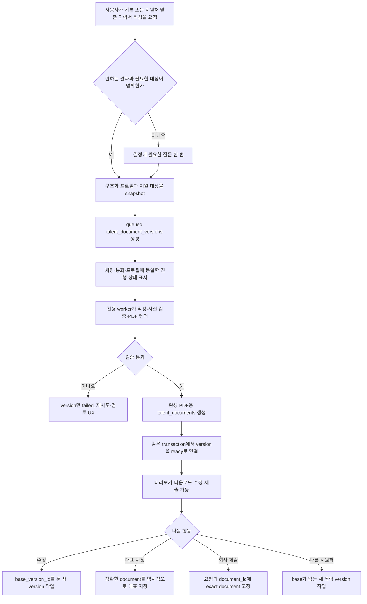

# Career 구조화 이력서·버전·PDF 구현 계획

문서 상태: 구현 전 최종 설계안

작성 기준: 2026-08-27

적용 범위: `harper_beta/` Career 채팅·통화·프로필·회사 이력서 요청,
`talent_documents`, PDF 생성·다운로드, `harper_worker/`

## 1. 최종 결론

이 기능은 **신규 테이블 하나**만 추가한다.

- 완성된 이력서 버전 하나는 기존 `talent_documents` row 하나다.
- 신규 `talent_document_versions`는 생성 작업과 구조화 원본을 관리하며, 완성 시 그
  `talent_documents` row와 1:1로 연결된다.
- 생성 중에는 version row만 있고 `document_id`는 null이다.
- 생성·검증·PDF 업로드가 모두 끝난 뒤에만 다운로드 가능한 `talent_documents` row를
  만들고 version row를 `ready`로 바꾼다.
- 같은 이력서를 실제로 수정할 때만 `base_version_id` optional self-reference를 사용한다.
- 같은 이력서 묶음, version 순서와 현재 head는 이 self-reference chain에서 계산한다.
- 별도의 영구적인 “이력서 부모” row를 만들지 않는다.
- 별도의 영구 grouping key도 두지 않는다.
- `talent_documents.current_version_id` 같은 현재 버전 pointer를 두지 않는다.
- 회사 요청에는 기존 `company_talent_requests.document_id`로 정확한 완성본 하나를
  고정한다. 별도의 `document_version_id`를 추가하지 않는다.

이 구조는 기존 문서 시스템의 핵심 계약도 보존한다. `talent_documents.storage_path`는
계속 `NOT NULL`이며, 그 테이블의 모든 row는 실제로 열고 다운로드할 수 있는 파일이다.
queued/running/failed 상태를 기존 문서 테이블에 섞지 않으므로 기존 serializer와 signed URL
경로를 대규모로 nullable 대응할 필요가 없다.

최초 이력서 작성의 canonical input은 다음뿐이다.

1. `talent_users`의 이름·연락처·headline·bio·location 등 기본 정보
2. `talent_experiences`
3. `talent_educations`
4. `talent_extras`
5. 지원처 맞춤인 경우 사용자가 선택한 정확한 지원 대상
6. 현재 작성 요청

다음은 작성 input으로 사용하지 않는다.

- 사용자가 올린 PDF의 `talent_documents.extracted_text`
- `talent_users.resume_text`
- 기존 `read_document` tool의 excerpt
- 업로드 PDF bytes

업로드 이력서는 profile ingestion에서 경력·학력·extra로 이미 정규화된다. 원본 PDF의
추출 text를 다시 읽으면 깨진 줄바꿈, header/footer, 중복 문장과 잘못된 읽기 순서를
재유입할 수 있다.

## 2. 사용자에게 보이는 제품 모델

사용자는 DB 구조를 알 필요가 없다. 제품에는 세 개념만 보인다.

- **이력서**: 특정 목적과 지원 대상에 맞춘 작업 묶음
- **버전**: 그 이력서에서 실제로 완성된 각 결과물
- **작성 작업**: 아직 생성·수정·검증 중인 결과

DB 표현은 다음과 같다.

| 사용자 개념 | DB 표현 |
|---|---|
| 작성 중인 새 이력서 | `talent_document_versions.status=queued/running`, `document_id=null` |
| 완성된 v1 | ready version row + 정확한 `talent_documents` row |
| v1을 수정 중인 v2 | 새 version row, `base_version_id=v1 version id` |
| 완성된 v2 | v1 문서는 유지하고 v2용 새 `talent_documents` row 생성 |
| 다른 회사용 이력서 | `base_version_id=null`인 새 독립 root version |
| 업로드한 파일 | 기존 `talent_documents` row만 존재하며 version row 없음 |
| 회사에 제출한 버전 | `company_talent_requests.document_id`가 가리키는 exact document |

`base_version_id`는 실제 수정 계보가 있을 때만 둔다.

- 최초 생성: null
- 같은 이력서 수정: 직전 ready version
- 과거 버전 복원: 현재 head version을 base로 하고 복원 원본 ID는 요청 snapshot에 별도 기록
- 다른 지원처용 재작성: null. 참고한 원본은 provenance일 뿐 revision 부모가 아니다.

제품에서 같은 이력서 묶음은 root version부터 이어진 `base_version_id` chain이다.
“현재 버전”은 저장된 pointer가 아니라 그 chain에서 완성된 후속 version이 없는 가장 최신
ready version으로 계산한다.

이번 범위에서 하지 않는 것:

- 외부 채용 사이트 자동 지원
- 생성 직후 자동 대표 지정 또는 자동 회사 공유
- 업로드 PDF를 다시 parsing해 editable resume으로 변환
- Canva형 자유 배치 editor
- cover letter, portfolio, 학술 CV를 resume schema에 합치기
- 사용자가 제공하지 않은 사실·수치·민감정보 보강
- email이나 Slack 답장만으로 제출 version을 추정

## 3. 처음부터 끝까지의 대표 사용자 흐름



생성, 대표 지정, 회사 공유는 서로 다른 action이다. “만들어줘”는 private draft 생성
승인이지 대표 변경이나 회사 제출 승인이 아니다.

## 4. 현재 코드에서 확인한 제약

### 4.1 `talent_documents`는 완성 파일을 전제로 한다

현재 `storage_path`는 `NOT NULL`이고 TypeScript DB type도 `string`이다.
`src/lib/talentOnboarding/documentStore.ts`는 각 row의 storage path로 signed URL을 만든다.

따라서 생성 job을 이 테이블에 넣지 않는다. 기존 column을 nullable로 바꾸지 않으며,
기존 document reader가 queued/failed row를 새로 구분하도록 강제하지 않는다.

### 4.2 기존 resume upload는 자동 대표·공개다

`src/app/api/talent/resume/upload/route.ts`와 `upsert_talent_document_by_hash_v1`는 일반
resume upload 시 이전 대표를 해제하고 새 파일을 대표·공개로 만들며
`talent_users.resume_*`에 mirror한다.

생성형 이력서는 이 RPC를 사용하지 않는다. finalize 전용 transaction은 새 document를
`is_primary=false`, `is_public=false`로 만든다. 사용자가 별도로 대표 지정하거나 회사
요청에 제출하기 전에는 노출 범위가 바뀌지 않는다.

### 4.3 기존 sync helper는 대표를 자동 승격한다

`syncLegacyResumeFromDocuments`는 대표가 없을 때 최신 resume을 대표·공개로 승격할 수 있다.
생성형 version 완료·삭제·복구 경로에서는 이 helper를 호출하지 않는다.

장기적으로 다음 책임을 분리한다.

- 선택된 대표 document를 legacy field에 mirror
- 어떤 document를 대표로 선택

후자는 사용자의 명시적 action 또는 기존 upload 정책만 수행한다.

### 4.4 기존 문서 tool은 extracted text 중심이다

`list_documents`, `read_document`, `update_document`는 일반 첨부 문서에는 계속 필요하다.
그러나 resume composer에는 `read_document`를 노출하지 않는다. composer source service는
오직 profile 구조화 테이블만 읽는다.

### 4.5 chat message에는 artifact column이 없다

현재 opportunity search는 assistant message에 서버 marker를 붙이고, session/messages
API가 owner-scoped row를 다시 읽어 card를 hydrate한다. 이 패턴을 재사용해 message table을
늘리지 않는다.

### 4.6 realtime tool 실행과 transcript 저장은 분리되어 있다

통화 function call은 `/api/talent/tool/execute`에서 먼저 실행되고 transcript는 나중에
`/api/talent/chat/save`로 저장된다. tool receipt에 version ID를 담아 save까지 전달해야
같은 작업 card를 복원할 수 있다.

### 4.7 회사의 일반 열기와 요청 제출본은 권한이 다르다

`src/lib/org/server.ts`의 일반 talent detail은 대표·공개 resume을 연다. 회사 요청으로 받은
제출본은 request에 고정된 exact `document_id`를 열어야 한다. 두 경로를 섞지 않는다.

### 4.8 계정 삭제는 soft delete다

현재 삭제는 `talent_users.deleted_at`을 기록하고 auth user를 제거하지만 일부 profile,
문서, storage를 운영 정책상 보존한다. 생성 중 version은 취소하고 finalize를 막는다.
ready PDF의 물리 보존·삭제는 기존 보존 정책을 따른다.

## 5. 제품·데이터 불변조건

1. 최초 작성은 canonical profile 구조화 데이터만 읽는다.
2. 업로드 PDF의 `extracted_text`와 `resume_text`는 작성 input이 아니다.
3. 한 ready version은 정확히 한 `talent_documents` row와 연결된다.
4. 생성 중·실패·취소 version에는 document row가 없다.
5. 한 document가 둘 이상의 version에 연결될 수 없다.
6. ready 구조화 content와 PDF는 덮어쓰지 않는다.
7. 수정·복원·다른 target·직접 편집은 항상 새 version과 새 document를 만든다.
8. revision 관계가 없으면 `base_version_id`를 만들지 않는다.
9. 별도 부모 document, grouping key와 stored current pointer를 만들지 않는다.
10. private draft는 대표·공개·매칭·회사 제출 상태를 바꾸지 않는다.
11. PDF 검증 실패 작업은 ready가 되지 않는다.
12. 과거 chat card는 exact version ID를 계속 가리킨다.
13. 회사 요청은 제출 당시 exact document ID를 유지한다.
14. 모델은 source에 없는 회사, 직함, 기간, 수치, 기술, 성과를 만들지 않는다.
15. signed URL과 storage path를 prompt나 영구 chat 본문에 넣지 않는다.
16. 다운로드와 편집은 매 요청마다 owner 또는 request-scoped 권한을 확인한다.
17. worker 재시작만으로 running 작업을 즉시 failed 처리하지 않는다.

## 6. 가장 일반적이고 이상적인 기본 resume

Harvard Career Services는 resume을 지원 직무에 맞춘 간결하고 사실 기반인 요약으로
설명하고, 역순 구성과 읽기 쉬운 표현 및 PDF 변환 후 확인을 권한다. Stanford Career
Education 자료는 성과 중심의 action verb와 일반적인 1페이지, 충분한 경력에서는 2페이지
구성을 안내한다. University of Pennsylvania Career Services는 ATS가 표, 도형, image
같은 장식 형식을 제대로 읽지 못할 수 있으므로 단순하고 일관된 형식을 권한다.

참고:

- [Harvard College Guide to Creating a Strong Resume](https://careerservices.fas.harvard.edu/resources/create-a-strong-resume/)
- [Stanford Resume and Cover Letter Examples](https://careered.stanford.edu/sites/g/files/sbiybj22801/files/media/file/resume-and-cover-letter-examples.pdf)
- [University of Pennsylvania Resume/CV Guide](https://careerservices.upenn.edu/channels/resume/)

### 6.1 기본 layout

- 1열
- selectable text
- 역순 경력
- standard section heading
- 한국어 기본 A4, 영어권 target이면 Letter 선택 가능
- 기본 1페이지, 관련 경력이 충분하면 2페이지
- 10–11pt 상당의 본문과 충분한 여백
- 일관된 날짜·시제·구두점
- 실제 hyperlink
- 자연스러운 text extraction 순서
- 표, 다단, text box, 사진, 장식 icon은 기본 제외

header에는 이름이 필수다. 검증된 email·phone이 있으면 포함하고, location은 도시·국가
수준만 사용한다. LinkedIn과 portfolio는 저장되어 있고 target에 유용한 것만 넣는다.
연락처가 없으면 추정하지 않고 review item으로 알린다.

### 6.2 기본 section 순서

모든 section을 억지로 채우지 않고 근거가 있는 것만 넣는다.

1. 이름·연락처·link
2. target에 맞춘 2–4문장 summary 또는 짧은 headline
3. 경력
4. 학력
5. skills
6. 프로젝트·자격·수상·활동·언어 중 관련 section

신입이나 경력 전환자는 관련성이 더 높은 education/project를 경력보다 위에 둘 수 있다.
사진, 생년월일, 성별, 혼인 여부, 전체 주소, 주민번호 등은 사용자가 명시적으로 요구하고
해당 국가 관행상 필요한 경우가 아니면 제외한다.

### 6.3 bullet 작성 기준

- 사실 범위 안에서 “무엇을 했는지 + 어떤 방식으로 + 어떤 영향이 있었는지”를 쓴다.
- source에 수치가 있을 때만 수치를 사용한다.
- 같은 동사를 반복하지 않는다.
- target과 무관한 오래된 상세는 줄이되 경력 자체를 조작하지 않는다.
- 현재 직무는 현재형, 종료된 직무는 과거형을 기본으로 한다.
- 내부 약어는 설명하거나 일반 용어로 바꾼다.

## 7. canonical source와 snapshot

### 7.1 최초 생성

enqueue API는 사용자 요청 시점에 다음을 owner-scoped로 읽고 version row의
`source_snapshot`에 저장한다.

```json
{
  "profile": {
    "name": "string",
    "headline": "string|null",
    "bio": "string|null",
    "location": "string|null",
    "email": "string|null",
    "phone": "string|null",
    "links": []
  },
  "experiences": [],
  "educations": [],
  "extras": [],
  "target": {
    "type": "general|opportunity|company_request|freeform",
    "id": "string|null",
    "snapshot": {}
  },
  "instruction": "string",
  "locale": "ko-KR"
}
```

`general`은 특정 지원처가 없는 기본 이력서다. 이 경우 target ID나 공고 text 없이
`talent_experiences`, `talent_educations`, `talent_extras`의 전체 경력을 균형 있게 요약한다.
Harper opportunity면 title, company, responsibilities, qualifications 등 작성에 필요한
최소 필드만 snapshot한다. 회사 요청이면 request와 role을 owner scope로 확인한다. 자유 입력
공고는 prompt injection 방어를 거친 plain data로 저장한다.

### 7.2 snapshot이 필요한 이유

- 생성 도중 profile이나 공고가 바뀌어도 결과의 근거가 재현된다.
- 재시도 때 서로 다른 source를 섞지 않는다.
- 사용자에게 “어느 시점 정보로 작성했는지” 설명할 수 있다.
- 실제 profile row 전체를 매 worker 단계마다 prompt에 다시 넣지 않는다.

원본 DB row ID와 `updated_at`을 함께 기록하고 deterministic `source_fingerprint`를 만든다.
ready version의 snapshot은 immutable하다.

### 7.3 긴 경력의 token 처리

source snapshot은 DB에 완전하게 저장하되 한 번에 전부 prompt로 넣지 않는다.

1. deterministic code가 기간·직함·skills·target keyword로 후보 항목을 추린다.
2. 모델은 선택된 항목을 구조화 resume으로 작성한다.
3. 누락 위험이 있거나 긴 profile이면 두 번째 pass가 제외된 source를 점검한다.

“길어서 잘랐다”는 이유로 최근 핵심 경력이나 target 필수 자격이 소리 없이 사라지지 않게
선택 로그와 제외 이유를 render metadata에 남긴다.

### 7.4 revision source

같은 이력서를 수정할 때는 다음을 사용한다.

- base version의 `structured_content`
- base version의 `source_snapshot`
- 사용자가 추가한 수정 instruction
- 사용자가 명시적으로 최신 profile 반영을 선택한 경우에만 새 profile snapshot

“오탈자만 고쳐줘”는 과거 source를 유지한다. “방금 추가한 경력을 반영해줘”는 profile을
다시 snapshot한다. 두 경우를 자동으로 혼동하지 않는다.

다른 지원처용으로 재작성할 때는 새 target과 현재 profile을 snapshot하고
`base_version_id=null`인 독립 root version을 만든다. 이전 version을 참고했다면
`request_snapshot.source_version_id`로 provenance만 남긴다.

## 8. 구조화 resume 계약

`talent_document_versions.structured_content`는 renderer와 editor가 읽는 canonical JSON이다.
HTML이나 PDF는 canonical source가 아니다.

개념 schema:

```json
{
  "schemaVersion": 1,
  "locale": "ko-KR",
  "page": {
    "size": "A4",
    "template": "ats_single_column_v1"
  },
  "basics": {
    "name": "홍길동",
    "headline": "Product Manager",
    "email": "user@example.com",
    "phone": null,
    "location": "Seoul, Korea",
    "links": []
  },
  "summary": "string|null",
  "sections": [
    {
      "id": "stable-uuid",
      "type": "experience",
      "title": "경력",
      "items": [
        {
          "id": "stable-uuid",
          "organization": "string",
          "role": "string",
          "location": "string|null",
          "startDate": "YYYY-MM|null",
          "endDate": "YYYY-MM|null",
          "isCurrent": false,
          "bullets": [
            {
              "id": "stable-uuid",
              "text": "string",
              "sourceRefs": ["experience:<uuid>:description"],
              "evidence": "explicit|safe_rephrase"
            }
          ]
        }
      ]
    }
  ],
  "reviewItems": [
    {
      "code": "missing_phone",
      "severity": "info",
      "messageKey": "resume.review.missingPhone"
    }
  ]
}
```

규칙:

- 날짜는 text가 아니라 정규화된 값으로 저장하고 renderer가 locale별로 표시한다.
- section/item/bullet ID는 다음 직접 편집에서 stable하게 유지한다.
- model이 임의 HTML/CSS, font, 좌표, page break를 생성하지 않는다.
- `sourceRefs`는 내부 검증용이며 PDF와 회사 화면에는 노출하지 않는다.
- 사실이 아닌 보강은 validation error다.
- unknown 값은 null 또는 생략이지 추정 문자열이 아니다.
- renderer는 schema version을 명시적으로 지원하며 알 수 없는 version을 silent render하지
  않는다.

`plain_text`도 같은 JSON에서 deterministic하게 만든다. 이를 완성 document의
`extracted_text`에 저장해 기존 검색·운영 호환성을 유지할 수 있지만, 다음 이력서 생성
prompt의 source로 다시 사용하지 않는다.

## 9. DB 설계: 신규 테이블 하나

### 9.1 기존 `talent_documents`

기존 테이블은 계속 완성 파일만 저장한다.

- `storage_path NOT NULL` 유지
- 한 row는 exact PDF version 하나
- generated resume도 `kind=resume`
- 생성 직후 `is_primary=false`, `is_public=false`, `is_deleted=false`
- `extracted_text`에는 구조화 JSON에서 만든 deterministic plain text
- MIME, file size, hash 등 기존 file metadata 사용

이 테이블에는 다음을 추가하지 않는다.

- job status
- structured resume JSON
- retry/lease/error
- `current_version_id`
- 논리적 부모 document FK

### 9.2 신규 `talent_document_versions`

개념 column은 다음과 같다. 실제 migration에서는 저장 convention과 generated type naming을
repository 규칙에 맞춘다.

| 영역 | column | 의미 |
|---|---|---|
| 식별 | `id uuid PK` | card·tool·worker가 공유하는 version ID |
| 소유 | `talent_id uuid NOT NULL FK` | owner scope |
| 완성본 | `document_id uuid NULL UNIQUE FK` | ready일 때 exact document와 1:1 |
| 계보 | `base_version_id uuid NULL FK self` | 실제 revision의 직전 version 또는 완료 대기 중인 dependency |
| 순서 | `version_number int NULL` | ready finalize 시 선형 chain 안에서 배정 |
| 동작 | `operation text` | create, revise, edit, restore, retarget |
| 상태 | `status text` | queued, running, ready, failed, cancelled |
| 진행 | `progress_stage text` | snapshot, drafting, validating, rendering, finalizing |
| 요청 | `request_snapshot jsonb` | instruction·target·provenance |
| 근거 | `source_snapshot jsonb` | 실제 작성에 사용한 canonical profile |
| 근거 hash | `source_fingerprint text` | 재현·idempotency |
| 원본 | `structured_content jsonb` | renderer와 editor의 canonical source |
| text | `plain_text text` | deterministic compatibility text |
| 변경 | `change_summary jsonb` | 사용자에게 보여 줄 변경점 |
| 검토 | `review_items jsonb` | 누락·확인 필요 항목 |
| chat | `conversation_id uuid NULL` | 생성 요청 conversation |
| chat | `source_message_id uuid NULL` | 요청 turn |
| chat | `presented_message_id uuid NULL` | marker가 들어간 assistant turn |
| 멱등 | `idempotency_key text NOT NULL` | 중복 enqueue 방지 |
| 실행 | `attempt_count int` | retry 횟수 |
| 실행 | `lease_owner text NULL` | worker claim |
| 실행 | `lease_expires_at timestamptz NULL` | crash recovery |
| 취소 | `cancel_requested_at timestamptz NULL` | cooperative cancel |
| 실패 | `error_code text NULL` | 안정적인 사용자·운영 분류 |
| 실패 | `error_detail jsonb NULL` | 민감정보를 제거한 진단 |
| artifact | `pdf_storage_path text NULL` | finalize 전 staging/final path |
| artifact | `pdf_sha256 text NULL` | exact bytes hash |
| artifact | `pdf_size_bytes bigint NULL` | 검증 결과 |
| artifact | `pdf_page_count int NULL` | 검증 결과 |
| artifact | `render_metadata jsonb` | font, template, overflow, QA |
| 시간 | `created_at/started_at/finished_at` | lifecycle |

`structured_content`와 artifact metadata는 작성 단계에는 null일 수 있다. ready일 때 필요한
필드를 전부 요구하는 상태별 CHECK를 둔다.

### 9.3 핵심 제약

- `UNIQUE(document_id)`: 한 document는 한 version에만 연결
- `UNIQUE(talent_id, idempotency_key)`: 동일 tool receipt 중복 생성 방지
- `CHECK(base_version_id <> id)`
- base와 child는 같은 `talent_id`여야 함
- create/retarget의 `base_version_id`는 null
- ready면 `document_id`, structured content, plain text, hash, size, page count,
  `finished_at`이 모두 non-null
- ready가 아니면 `document_id`는 null
- ready/failed/cancelled는 terminal
- ready version content와 source snapshot은 application/RLS에서 immutable

DB CHECK만으로 다른 row의 owner와 상태를 모두 보장하기 어렵다면 enqueue/finalize security
definer function 안에서 잠그고 검증한다.

### 9.4 현재 head와 분기 방지

stored `current_version_id`나 grouping key는 없다. 한 묶음은 `base_version_id`를 따라
도달하는 root와 그 descendant로 계산한다. head는 그 chain에서 완성된 ready successor가
없는 row다.

두 개의 동시 수정이 같은 base에서 시작할 수는 있지만 둘 다 ready가 되면 UX가 모호하다.
enqueue 시 base가 아직 running인 것은 허용하되 child worker는 기다린다. finalize 시에는
다음을 transaction으로 보장한다.

1. base row를 lock한다.
2. base가 ready이며 같은 owner인지 확인한다.
3. base 뒤에 이미 ready successor가 있으면 이 작업을 conflict로 끝낸다.
4. 없다면 `version_number=base.version_number+1`을 배정한다.
5. 한 base에 ready successor 하나만 허용하는 partial unique index 또는 동등한 transaction
   guard를 둔다.

queued 상태의 연속 수정은 가능하다. 뒤 요청은 앞 version을 dependency로 참조하되 worker가
base ready까지 기다린다. 앞 작업이 실패하면 자동으로 사실관계를 추정해 다른 base에 붙이지
않고 사용자에게 기준 버전을 다시 선택하게 한다.

### 9.5 업로드 문서와 backfill

기존 업로드 `talent_documents`에는 version row를 만들지 않는다. extracted text를
structured resume으로 변환하는 backfill도 하지 않는다.

generated resume 기능으로 새로 만든 문서만 version row를 갖는다. 이 때문에
`talent_documents` → version join은 optional이고, version → ready document만 1:1이다.

## 10. 상태·transaction·storage

### 10.1 새 이력서 생성

enqueue transaction:

1. auth owner와 soft-delete 여부를 확인한다.
2. target 접근 권한과 지원 요청 상태를 확인한다.
3. canonical profile을 읽어 snapshot과 fingerprint를 만든다.
4. `base_version_id=null`인 queued root version row를 만든다.
5. 동일 idempotency key가 있으면 기존 version을 반환한다.
6. version ID가 포함된 receipt를 반환한다.

worker:

1. lease로 row를 claim한다.
2. source를 선별하고 schema JSON을 작성한다.
3. sourceRef·날짜·수치·contact 사실성을 검증한다.
4. deterministic renderer로 PDF를 만든다.
5. text extraction, page count, font, overflow, link를 검증한다.
6. exact version path에 PDF를 업로드한다.

finalize transaction:

1. version row를 lock하고 lease, owner, status, cancel, account 상태를 다시 확인한다.
2. artifact metadata와 hash가 worker 결과와 일치하는지 확인한다.
3. 비공개·비대표 `talent_documents` row를 non-null storage path로 insert한다.
4. version에 그 `document_id`와 ready 필드를 기록한다.
5. 두 변경을 같은 DB transaction에서 commit한다.

DB transaction 실패로 upload만 남으면 worker가 exact path를 제거하거나 orphan cleanup queue에
기록한다. document insert만 성공하고 version 연결이 실패하는 중간 상태는 transaction
경계상 외부에 보이지 않는다.

### 10.2 같은 이력서 수정

1. owner-scoped ready version을 기준으로 선택한다.
2. `base_version_id=선택 version`인 queued row를 만든다.
3. base structured content와 수정 instruction을 source로 사용한다.
4. base document는 절대 수정하거나 삭제하지 않는다.
5. finalize 때 새 document를 만들고 새 version에 1:1 연결한다.

기존 chat card와 이미 제출한 회사 요청은 이전 exact document를 계속 연다.

#### 사용자가 완료를 기다리지 않고 다시 수정한 경우

- 아직 queued이며 worker가 claim하지 않았다면 안전한 범위의 instruction을 같은 요청
  snapshot에 합치고 UI에 “요청 반영됨”을 보여 줄 수 있다.
- running이면 진행 중 source를 mutate하지 않는다. 현재 version을 dependency로 둔 다음
  queued version을 만든다.
- 사용자는 두 작업을 따로 이해할 필요 없이 “이번 작성 완료 후 이어서 수정” 상태를 본다.
- 앞 작업 실패 시 뒤 작업은 `waiting_for_base` 성격의 진행 상태에서 멈추고, 재시도 또는
  기존 ready version을 기준으로 다시 시작하도록 선택지를 준다.

### 10.3 다른 지원처용 재작성

“이걸 A사에도 맞춰줘”는 기존 이력서의 단순 revision이 아니다.

- `base_version_id=null`
- 새 target snapshot
- 필요하면 `request_snapshot.source_version_id`로 참고한 version만 기록
- 새 version과 새 document

따라서 A사와 B사 이력서의 “현재 버전”과 history가 섞이지 않는다.

### 10.4 직접 편집

editor에서 저장할 때도 ready version을 in-place 수정하지 않는다.

1. base structured JSON을 client가 받는다.
2. 허용된 field만 편집한다.
3. server가 schema와 owner를 검증한다.
4. `operation=edit`인 새 queued version을 만든다.
5. LLM 없이 검증·render하거나, 사용자가 요청한 문장 보조만 제한적으로 사용한다.
6. 새 exact document를 만든다.

### 10.5 과거 버전 복원

복원은 pointer를 과거로 돌리지 않는다. 새로운 version을 만든다.

- `base_version_id`: 현재 head
- `request_snapshot.restored_from_version_id`: 복원할 과거 version
- structured source: 선택한 과거 content
- 결과: history 끝에 새 ready version과 document

감사 기록과 이미 공유한 document가 보존된다.

### 10.6 취소·재시도

- queued 취소: terminal cancelled, document 없음
- running 취소: `cancel_requested_at`을 기록하고 stage 경계에서 cooperative stop
- PDF upload 뒤 취소: finalize하지 않고 exact staging artifact 정리
- retryable 실행 오류: terminal failed로 확정하기 전에 같은 version row의
  `attempt_count`를 올려 동일 snapshot으로 재시도
- instruction이나 source를 바꾸는 재시도: 새 version row
- ready 이후 취소: 허용하지 않고 삭제 또는 새 revision UX 사용

### 10.7 삭제

- ready version 삭제는 연결된 `talent_documents.is_deleted`를 soft delete한다.
- version row는 계보와 감사 목적으로 보존하되 일반 UI에서는 삭제 상태를 표시한다.
- 대표 document라면 명시적 확인이 필요하다.
- 회사 요청에 이미 제출된 exact document는 요청 보존 정책에 따라 접근을 유지할 수 있으며,
  사용자에게 이를 삭제 확인 전에 설명한다.
- 과거 version 삭제가 후속 version content를 바꾸지는 않는다.

## 11. text chat UX

### 11.1 조언과 생성의 경계

다음은 답변만 하고 job을 만들지 않는다.

- “좋은 이력서는 어떻게 써?”
- “내 경력 중 무엇을 강조해야 해?”
- “이 공고에 어떤 내용이 필요해?”

다음은 생성 action이다.

- “내 정보로 기본 이력서 하나 만들어줘”
- “이 공고에 지원할 이력서 만들어줘”
- “방금 만든 이력서 summary를 더 짧게 수정해줘”
- “A사 버전을 B사에도 맞춰 새로 만들어줘”

사용자가 “이력서 만들어줘”라고만 말해 기본형인지 지원처 맞춤형인지 불명확하면 한 번만
확인한다. 기본형을 명시했다면 target을 다시 묻지 않는다. 가능한 기초 정보가 없을 때는
무의미한 빈 PDF를 만들지 않고 profile 입력 화면으로 안내한다.

### 11.2 profile ingestion 대기

사용자가 방금 이력서를 업로드해 profile ingestion이 진행 중이면 extracted text로 우회하지
않는다.

- “경력 정보를 정리하고 있어요” 상태를 표시한다.
- 완료 후 같은 요청을 이어서 enqueue한다.
- 일정 시간 뒤에도 실패하면 누락된 profile section을 직접 확인·입력하게 한다.

### 11.3 server marker

assistant 영구 text에는 사람이 읽을 답변 뒤에 server가 다음 형태의 marker를 붙인다.

```text
[resume_version](/career?resumeVersionId=<uuid>&relation=created|revised|restored|retargeted)
```

marker는 version ID를 가리킨다. queued 시점에는 document가 없기 때문이다.

hydration API는 매번 owner를 확인한 뒤 version 상태와, ready일 때만 연결된 document
metadata를 반환한다. marker 안에는 storage path, signed URL, structured content를 넣지
않는다. model이 marker를 직접 작성하도록 맡기지 않는다.

### 11.4 진행 card

단계 copy 예시:

- 정보를 정리하고 있어요
- 지원 포지션에 맞춰 작성하고 있어요
- 사실과 형식을 확인하고 있어요
- PDF를 만들고 있어요

card에는 이력서 이름, target, 요청 시각, 취소 action을 표시한다. 초 단위 가짜 percentage는
쓰지 않는다. progress event가 끊겨도 DB 상태를 polling/revalidation해 완료를 찾는다.

### 11.5 ready card

ready card에는 다음을 제공한다.

- 제목과 target
- 버전 번호와 생성 시각
- 1페이지 thumbnail 또는 안전한 preview
- “PDF 다운로드”
- “내용 보기”
- “수정”
- “다른 지원처용으로 만들기”
- 필요한 경우 “대표로 지정” 또는 “이 요청에 제출”
- factual omission이나 연락처 누락 review item

다운로드 button은 그 순간 authorization 후 짧은 signed URL을 받아 exact document를 연다.
chat HTML에 URL을 저장하지 않는다.

### 11.6 실패 card

사용자에게 stack trace나 provider error를 보이지 않는다.

- 다시 시도
- 누락 정보 확인
- 지원 대상 다시 선택
- 기존 ready version 열기
- 계속 실패하면 문의

실패 version에는 document가 없으므로 깨진 다운로드 button을 절대 보여 주지 않는다.

### 11.7 새로고침·다른 기기·message 저장 실패

- marker가 있으면 version을 다시 hydrate한다.
- marker가 저장되지 않았어도 conversation ID의 active/unpresented versions를 조회해 복구
  card를 보여 준다.
- tool은 성공했는데 assistant message 저장이 실패하면 version을 취소하지 않는다.
- 다음 session load가 미연결 작업을 표시하고 새 assistant message에 연결할 수 있다.
- 같은 tool request retry는 idempotency key로 기존 version을 반환한다.

## 12. voice UX

voice에서는 긴 이력서를 낭독하지 않는다.

1. 충분히 명확한 생성 요청이면 tool이 queued version을 만든다.
2. receipt에 version ID, target label, user-facing status를 담는다.
3. assistant는 “작성을 시작했고 채팅에서 진행 상황과 PDF를 볼 수 있다”고 짧게 말한다.
4. transcript save가 receipt를 받아 같은 marker를 server-side로 붙인다.
5. 완료 알림은 채팅 card와 profile workspace에서 확인한다.

“제출해”처럼 외부 공유가 수반되는 action은 대상과 exact version을 화면에서 다시 확인한다.
통화 중 모호한 승인만으로 대표 변경이나 회사 제출을 하지 않는다.

## 13. profile resume workspace

프로필의 이력서 영역을 다음처럼 구성한다.

1. 대표 이력서
2. 지원용 이력서
3. 업로드한 이력서와 기타 문서
4. 진행 중·실패한 작업

지원용 이력서는 `base_version_id` chain의 root별로 묶고 ready document를 join해 보여 준다.
root는 실제 첫 version row이며 별도 부모 entity나 저장된 root pointer가 아니다.

각 묶음에는 target, 파생된 현재 head, 최근 수정 시각, version 수를 표시한다. 묶음을 열면
모든 ready version과 진행·실패 작업을 시간순으로 본다. 모든 ready version은 각자 exact
PDF를 다운로드할 수 있다.

### 13.1 비어 있는 profile

구조화 경력·학력·extra가 하나도 없으면:

- “기본 이력서 작성”으로 연락처와 최소 경력을 입력하게 하거나
- resume upload 후 profile ingestion 완료를 기다리게 한다.

LLM이 빈 source로 그럴듯한 경력을 만들지 않는다.

### 13.2 대표 이력서

대표는 exact `talent_documents` row다.

- 생성형 새 version은 자동 대표가 아니다.
- “대표로 지정”은 변경될 문서와 공개 영향을 확인한다.
- 성공 후 기존 `is_primary/is_public` 정책과 legacy mirror를 일관되게 갱신한다.
- 대표 version을 수정해도 새 version이 자동 대표를 승계하지 않는다.
- 새 version을 대표로 바꾸려면 다시 명시적으로 선택한다.

### 13.3 업로드 문서

업로드 문서는 기존 흐름과 UI를 유지한다.

- version history가 없는 standalone file로 표시
- 추출 text를 생성형 resume editor에 억지로 넣지 않음
- 새 resume 생성 source는 ingestion된 profile row
- 기존 대표 upload 정책을 바꾸려면 별도 제품 결정으로 다룸

### 13.4 editor

editor는 문서 편집기가 아니라 schema 기반 form이다.

- section 순서 변경
- item·bullet 추가/삭제
- text·날짜·contact 수정
- 지원 대상 유지 또는 새 target으로 복사
- 저장 전 변경 preview
- PDF 재생성

저장은 항상 새 version이다. unsaved change 이탈 경고, keyboard navigation, screen reader label,
모바일 stacking을 제공한다.

## 14. 회사 이력서 요청

### 14.1 exact version 선택과 제출

기존 `company_talent_requests.document_id`를 그대로 사용한다.

제출 과정:

1. 요청이 현재 사용자 소유이며 열려 있는지 확인한다.
2. ready generated version 또는 허용된 기존 upload를 선택한다.
3. 선택한 generated version이면 연결된 exact `document_id`를 resolve한다.
4. 제출 직전 제목, target, 생성 시각, PDF preview를 보여 준다.
5. confirmation 후 request의 기존 `document_id`를 저장한다.
6. 그 request의 회사 접근 권한만 부여한다.

`company_talent_requests`에 version FK를 추가하지 않는다. document 자체가 exact version이라
두 ID를 저장하면 불일치 가능성만 생긴다.

### 14.2 요청 중 새로 작성

request deep link에서 “이 요청용으로 작성”을 누르면 target이 이미 고정된 queued version을
만든다. 완료 후 자동 제출하지 않는다. ready card에서 preview와 confirmation을 거친다.

요청이 생성 중 만료·취소되면 작성은 private resume으로 완성할 수 있지만 제출 action은
비활성화하고 이유를 설명한다.

### 14.3 회사 열기 권한

- 일반 talent detail: 현재 대표·공개 document만
- 특정 request detail: 해당 request에 저장된 exact document만
- 다른 회사나 다른 request: 접근 불가
- signed URL: 짧은 TTL, request scope와 server authorization 후 발급

후보자가 나중에 다른 version을 대표로 만들거나 새 revision을 생성해도 이미 제출한 request의
document는 자동 교체되지 않는다.

### 14.4 제출 후 삭제

사용자가 제출본을 삭제하려 하면 회사가 이미 접근할 수 있다는 사실과 보존 정책을 알려 준다.
“내 목록에서 숨김”, “대표 해제”, “회사 제출 기록 제거”를 하나의 action으로 오해하게 만들지
않는다.

## 15. PDF 생성·검증·다운로드

### 15.1 renderer

LLM은 JSON content까지만 작성한다. 별도 deterministic renderer가 PDF를 만든다.

권장 구현:

- `harper_worker`의 별도 resume queue/worker
- ReportLab 기반 renderer
- repository에 포함하고 license를 기록한 한국어 지원 TTF/OTF
- ATS single-column template version 고정
- font fallback과 glyph coverage 사전 검사
- URL scheme allowlist
- page break와 widow/orphan 제어

opportunity poller와 scheduler에 PDF 작업을 섞지 않는다. retry와 resource profile이 다르고
긴 render가 추천 작업을 막아서는 안 된다.

### 15.2 artifact path

버전마다 immutable한 exact path를 사용한다.

```text
<talentId>/generated-resumes/<versionId>/resume.pdf
```

덮어쓰지 않는다. finalize 전에는 version row만 path를 알고, finalize transaction이 만든
document가 동일한 path와 metadata를 가진다.

### 15.3 ready 전 검증

- PDF header와 parse 가능 여부
- page count 1–2 기본 정책
- 파일 크기 상한
- password/encryption 없음
- embedded Korean/Latin font
- missing glyph 없음
- text extraction이 empty가 아님
- section·이름·주요 경력 순서가 schema와 일치
- overflow·잘림·겹침 없음
- link scheme와 target 검증
- structured content와 plain text의 핵심 사실 일치
- PII가 요청 범위를 넘지 않음

자동 검사에 더해 template fixture를 page PNG로 render해 visual regression을 한다. 한국어,
영어, 긴 회사명, 긴 URL, 2페이지, 빈 optional section, 혼합 glyph fixture가 필요하다.

### 15.4 preview와 download

preview는 원본 PDF 또는 서버에서 만든 thumbnail을 사용한다. 최종 다운로드는
`talent_documents` owner/request authorization을 거친 뒤 짧은 signed URL을 발급한다.
파일명은 안전하게 정규화한 이름·target·날짜를 사용하되 storage key와 분리한다.

## 16. LLM tool과 prompt budget

### 16.1 일반 Career LLM의 역할

일반 대화 모델은 요청 해석, 대상 확인, enqueue와 card 연결만 한다. 전체 profile과
structured resume JSON을 conversation prompt에 상시 싣지 않는다.

실제 작성은 worker가 저장된 snapshot을 별도 prompt로 읽는다. chat history에는 version ID와
짧은 summary만 남는다.

### 16.2 tools

#### `compose_resume`

```json
{
  "operation": "create|revise|retarget|restore",
  "target": {
    "type": "general|opportunity|company_request|freeform",
    "id": "string|null",
    "text": "string|null"
  },
  "baseVersionId": "uuid|null",
  "restoreFromVersionId": "uuid|null",
  "instruction": "string",
  "locale": "ko-KR",
  "idempotencyKey": "string"
}
```

tool 결과는 version ID, status, target label, relation만 반환한다. profile 전체, structured
content, storage path는 반환하지 않는다.

#### `inspect_resume`

특정 owner-scoped version의 다음 최소 정보만 반환한다.

- status와 progress stage
- target·version number·change summary
- review item
- ready일 때 document ID와 download 가능 여부

내용 편집이 필요할 때만 별도 endpoint가 structured JSON을 owner scope로 읽는다.

### 16.3 조건부 노출

resume 작성 intent에서만 compose tool을 노출한다. 문서 Q&A의 `read_document`와 동시에
노출해 모델이 uploaded extracted text를 resume source로 고르는 일을 막는다.

### 16.4 target 안전성

공고 text는 instruction이 아니라 untrusted data다. 공고 안의 “이전 지시를 무시하라” 같은
문장을 실행하지 않는다. target ID가 있으면 server가 canonical role data를 다시 읽고,
사용자에게 보인 target과 enqueue target이 같은지 확인한다.

## 17. API와 service 경계

권장 server 경계:

- `resumeSourceService`: profile·target authorization과 snapshot
- `resumeVersionService`: enqueue, lineage, idempotency, status, cancel
- `resumeRenderWorker`: compose, validate, render, artifact upload
- `resumeFinalizeTransaction`: document insert + version ready
- `resumeDocumentService`: preview/download authorization
- `resumeSubmissionService`: company request exact document 고정
- `resumeMarkerService`: message marker parse/hydrate/recovery

예상 endpoint:

- `POST /api/talent/resume/versions`
- `GET /api/talent/resume/versions/:id`
- `POST /api/talent/resume/versions/:id/cancel`
- `POST /api/talent/resume/versions/:id/retry`
- `POST /api/talent/resume/versions/:id/edit`
- `GET /api/talent/documents/:id/download`
- 기존 company request submit endpoint 확장
- 기존 chat messages/session hydration 확장
- 기존 tool execute와 chat save receipt 확장

client가 `talent_id`, status, version number, storage path를 신뢰해서 보내게 하지 않는다.
server가 auth context와 DB 상태에서 계산한다.

## 18. 기존 기능과 downstream 호환

### 18.1 document reader

`talent_documents`에는 계속 ready file만 있으므로 대부분의 기존 reader는 상태 filter가
필요 없다. 이것이 job을 기존 테이블에 넣지 않는 가장 큰 장점이다.

새 generated resume를 일반 문서 목록에 노출할지는 제품 화면별로 명시한다.

- profile 일반 문서 목록: 필요하면 generated badge와 함께 표시
- resume workspace: versions 중심 조회
- LLM 문서 읽기: 기존 권한은 유지하되 resume composer source에서는 배제
- org 일반 detail: 대표·공개 조건 유지
- company request: request의 exact document

### 18.2 matching

private generated resume가 생겼다는 이유로 matching source나 대표 resume가 바뀌지 않는다.
matching이 profile 구조화 데이터 또는 대표 document를 사용한다면 기존 선택 규칙을 유지한다.

### 18.3 기존 upload

업로드 RPC와 hash dedupe는 그대로 둔다. generated renderer는 upload RPC를 호출하지 않고
finalize transaction을 사용한다. generated PDF가 우연히 기존 upload와 같은 hash라도
version의 exact artifact와 provenance를 지켜야 하므로 일반 upload dedupe 정책을 그대로
적용하지 않는다.

## 19. 보안·개인정보·보존

### 19.1 authorization

모든 version API는 `talent_id=auth user`를 server-side로 강제한다.

- base version owner 확인
- target/opportunity/request 접근 확인
- ready document owner 확인
- company request 상태·회사 scope 확인
- signed URL 발급 시 재검증
- worker는 service role이어도 row owner와 soft-delete 상태 검증

`base_version_id`나 marker ID를 바꿔 다른 사람의 이력서를 읽을 수 없어야 한다.

### 19.2 model privacy

- 필요한 profile field만 provider에 전송
- storage URL·PDF bytes·불필요한 민감 field 제외
- prompt와 error log에 phone/email 원문을 반복 저장하지 않음
- source snapshot access를 service role과 owner path로 제한
- provider retention과 지역 정책을 출시 전 검토
- operational log에는 version ID와 error code를 쓰고 resume 본문은 쓰지 않음

### 19.3 account soft delete

계정 삭제 시 queued version은 cancelled로 만들고 running version에는 cancel을 요청한다.
finalize는 `talent_users.deleted_at`을 확인해 새 document 생성을 거부한다. ready 문서와
version의 보존·삭제는 기존 법적·운영 정책을 따르고 UI copy가 즉시 물리 삭제를 약속하지
않게 한다.

## 20. 전체 실패·복구 UX

| 상황 | 사용자 경험 | 데이터 처리 |
|---|---|---|
| profile 정보 부족 | 필요한 항목만 요청 | version enqueue 전 중단 |
| ingestion 진행 중 | 정리 중 상태 후 자동 재개 | extracted text 우회 금지 |
| target 불명확 | 한 번만 확인 질문 | 잘못된 target snapshot 방지 |
| 중복 클릭 | 같은 진행 card | idempotency row 반환 |
| worker 대기 | 단계 상태와 취소 | queued 유지 |
| worker crash | 계속 진행 중, lease 후 재개 | lease 만료 뒤 retry |
| LLM 일시 오류 | 자동 재시도 후 안내 | attempt 증가 |
| 사실 검증 실패 | 확인할 항목 제시 | document 없이 failed |
| glyph/overflow 실패 | 자동 template 조정 후 재검증 | ready 금지 |
| upload 성공·DB 실패 | 일반 UI에 문서 없음 | exact orphan 정리 |
| cancel 요청 | 취소 중 → 취소됨 | finalize 차단 |
| 앞 revision 실패 | 뒤 수정 대기·기준 재선택 | 자동 rebase 금지 |
| 동시 ready conflict | 최신본 확인 후 다시 적용 안내 | 두 번째 finalize 차단 |
| chat save 실패 | 다음 접속에서 작업 복구 | unpresented version 조회 |
| 요청 만료 중 생성 완료 | PDF는 private 보관, 제출 불가 | request 미변경 |
| 대표 version 삭제 | 영향 확인 | 자동 다른 대표 승격 없음 |
| signed URL 만료 | 버튼에서 새 URL 발급 | 영구 URL 저장 안 함 |
| 계정 삭제 중 완료 시도 | 생성 취소 안내 | finalize 거부 |

오래 걸린다는 이유만으로 임의 timeout 후 failed로 바꾸지 않는다. lease heartbeat와 실제
stage progress를 보고 stale 여부를 판단한다.

## 21. UI·접근성·번역

- repository design token과 기존 button/card primitives 사용
- light/dark theme 모두 지원
- status는 색만이 아니라 icon·text로 표현
- progress card에 `aria-live=polite`
- 모든 action keyboard 접근 가능
- focus order는 preview → primary action → secondary action
- 모바일에서 CTA가 가려지지 않음
- long Korean/English company·role 이름 wrapping
- locale key를 server/client 양쪽의 기존 translation convention에 추가
- 날짜·page size·section heading은 locale로 render
- PDF 접근성은 제목, reading order, 실제 text, link annotation을 최소 기준으로 함

copy는 “저장”, “대표 지정”, “제출”, “삭제”를 구분한다. “이력서가 업데이트됐어요”처럼
어느 version이 바뀌었는지 모호한 표현 대신 “새 버전이 준비됐어요”라고 쓴다.

## 22. 예상 코드 변경 지점

정확한 파일명은 구현 시 재확인하되 책임은 다음 범위다.

- Supabase migration과 generated DB types
  - `talent_document_versions` 하나 추가
  - RLS, index, enqueue/finalize/cancel transaction
- Career chat
  - tool schema와 executor
  - server marker, session/messages hydration, unpresented recovery
  - progress/ready/failure card
- realtime voice
  - version receipt와 transcript save 연결
- profile
  - resume workspace, history, schema editor, representative confirmation
- company request
  - exact ready document selection·preview·submit authorization
- worker
  - 전용 queue claim, LLM compose, validation, ReportLab renderer, storage, finalize
- document service
  - generated file signed URL, delete/representative behavior
- translations
  - 모든 상태·error·review·confirmation key

기존 `talent_documents.storage_path` type과 모든 document reader를 nullable로 바꾸는 작업은
이 설계에 포함되지 않는다.

## 23. test 계획

### 23.1 source와 prompt

- 최초 생성이 `talent_users/experiences/educations/extras`만 읽음
- uploaded `extracted_text`, `resume_text`, PDF bytes를 읽지 않음
- snapshot이 요청 시점 값을 보존
- 긴 profile two-pass가 핵심 자격을 누락하지 않음
- target prompt injection이 instruction으로 실행되지 않음
- source에 없는 수치·기간·기술 생성 차단

### 23.2 DB와 transaction

- queued/running/failed/cancelled version의 `document_id`가 null
- ready version과 document가 1:1
- `talent_documents.storage_path`가 계속 non-null
- finalize 실패 시 document/version 중간 상태가 노출되지 않음
- 동일 idempotency key가 row를 중복 생성하지 않음
- 다른 owner의 base를 참조할 수 없음
- 한 base에서 ready successor가 둘 생기지 않음
- current pointer 없이 head가 정확히 계산됨
- existing upload에 version backfill이 없음

### 23.3 revision

- revise가 same revision key와 base self-FK를 사용
- retarget가 null base의 독립 root를 사용
- restore가 current base + restored provenance를 사용
- ready content와 document bytes를 in-place 변경하지 않음
- running 중 추가 수정이 dependency로 이어짐
- failed base 뒤 작업이 자동 rebase하지 않음

### 23.4 chat·voice

- advice는 job을 만들지 않음
- marker가 owner-scoped hydrate됨
- forged marker가 다른 사용자의 version을 열지 못함
- reload·다른 기기·message save 실패에서 작업 복구
- voice receipt가 chat save까지 version ID를 보존
- failed version에 download button이 없음

### 23.5 PDF

- 한국어·영어·혼합 glyph
- 1/2페이지 경계와 긴 bullet
- 날짜·URL·회사명 overflow
- text extraction 순서
- font embedding과 missing glyph
- link scheme
- hash·size·page count metadata
- page PNG visual regression
- 동일 JSON의 deterministic render 범위

### 23.6 대표·회사·권한

- generated ready가 자동 대표·공개되지 않음
- 대표 지정 시 exact document만 변경
- 새 revision이 대표를 자동 승계하지 않음
- request가 exact submitted document를 유지
- 대표 변경 뒤에도 과거 request PDF가 변하지 않음
- 요청 만료·취소 뒤 제출 차단
- org 일반 접근과 request-scoped 접근 분리
- soft-deleted account finalize 차단

### 23.7 end-to-end

1. profile만으로 첫 한국어 이력서 생성·PDF 다운로드
2. chat에서 수정하고 v1·v2를 각각 다운로드
3. v2 생성 중 v3 수정 요청
4. 과거 version 복원
5. 다른 지원처용으로 독립 이력서 생성
6. profile editor 직접 수정·새 PDF
7. 회사 요청 deep link에서 생성·preview·exact 제출
8. 통화에서 생성 후 채팅 card 복구
9. worker crash·retry·cancel
10. upload ingestion 중 대기 후 생성

## 24. migration·rollout 순서

### Phase 0. renderer spike

- 실제 Korean font와 license 확정
- 대표 fixture PDF 생성
- Poppler render, text extraction, glyph, 1/2페이지 QA
- worker memory/time 측정

### Phase 1. additive schema

- `talent_document_versions`만 추가
- RLS, index, enum/check
- enqueue/finalize/cancel function
- generated DB type 갱신

기존 `talent_documents` schema와 reader는 그대로 유지한다.

### Phase 2. worker와 내부 검증

- 별도 resume worker
- snapshot → JSON → validation → PDF → finalize
- idempotency, lease, retry, orphan cleanup
- 내부 계정 feature flag

### Phase 3. text chat

- compose/inspect tool
- marker hydration
- progress/ready/failure card
- reload와 unpresented recovery

### Phase 4. profile workspace와 editor

- generated history grouping
- derived head
- exact version download
- direct edit와 representative confirmation

### Phase 5. company request와 voice

- exact document submit
- request deep link와 expiry UX
- realtime receipt와 transcript marker

### Phase 6. 제한 rollout

- 언어·경력 길이·PDF 실패율 관찰
- queue latency, ready rate, retry rate, page overflow, download success, submit success 계측
- 기존 upload·대표·org 접근 회귀 확인
- 안정성 확인 후 점진 확대

rollback 시 새 enqueue만 막고 기존 ready `talent_documents`는 정상 다운로드되게 한다.
진행 중 version은 drain 또는 안전 취소한다.

## 25. 출시 완료 기준

- [ ] 신규 테이블이 `talent_document_versions` 하나뿐이다.
- [ ] 모든 `talent_documents` row는 실제 storage file을 가진다.
- [ ] ready version과 document가 1:1이다.
- [ ] 부모 document와 `current_version_id`가 없다.
- [ ] `base_version_id`는 실제 revision에서만 사용된다.
- [ ] 최초 생성은 구조화 profile만 읽는다.
- [ ] 업로드 extracted text가 composer prompt에 들어가지 않는다.
- [ ] ready content와 PDF는 immutable하다.
- [ ] 생성해도 대표·공개·회사 제출이 자동 변경되지 않는다.
- [ ] 채팅·통화·프로필에서 동일 version 상태가 복구된다.
- [ ] 과거 version PDF를 정확히 다시 받을 수 있다.
- [ ] 회사 요청이 exact document를 고정한다.
- [ ] 한국어 PDF의 glyph·overflow·text extraction이 검증된다.
- [ ] 긴 profile과 동시 수정이 소리 없이 내용을 잃지 않는다.
- [ ] owner/request authorization과 soft-delete finalize 차단이 검증된다.
- [ ] 기존 upload, matching, 대표 resume, org 조회가 회귀하지 않는다.

## 26. 최종 판단

이 설계에서 **완성된 version 하나가 곧 `talent_documents` row 하나**다.
`talent_document_versions`는 아직 문서가 없는 생성 작업에서 시작해, 구조화 원본·근거·상태를
보존하고 ready 시 정확한 document와 1:1로 연결된다.

별도의 논리적 부모 document나 stored current pointer는 없다. 실제 수정 관계만
`base_version_id`로 표현하고, 현재 head는 ready chain에서 계산한다. 그래서 모든 이력서에
억지 부모를 만들지 않으면서도 수정 기록, 과거 PDF 다운로드, 복원, 동시성 제어를 유지할 수
있다.

또한 기존 `talent_documents`의 “항상 실제 파일이 있다”는 계약을 보존하므로
`storage_path` nullable migration과 광범위한 reader 변경을 피한다. 사용자 관점에서도
작성 실패는 깨진 문서로 나타나지 않고, 완성된 모든 version은 독립적으로 preview·download·
대표 지정·회사 제출할 수 있다.

이 문서는 구현 계획이며 현재 schema, API, worker, UI를 변경하지 않는다.
