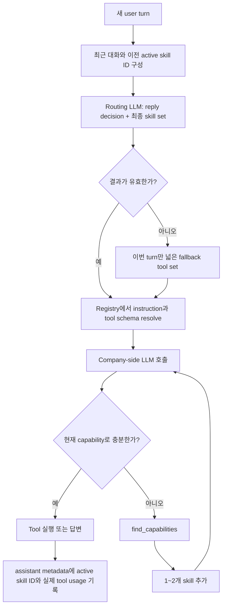

# Company-side LLM Skill·Tool 라우팅 구현 설계

상태: 구현 전 설계

대상: `/org` 웹 채팅과 `/org-Slack`이 공유하는 company-side LLM

## 1. 결론

Company-side LLM에 모든 tool schema와 모든 workflow 지침을 항상 넣지 않는다.
대신 다음 2단계 progressive disclosure를 사용한다.

1. 작은 routing LLM이 compact skill catalog와 현재 대화를 보고 이번 user turn에
   필요한 skill을 고른다.
2. Company-side LLM에는 선택된 skill의 상세 instruction과 tool schema만 넣는다.

여기서 skill은 실행 가능한 기능 자체가 아니라, 사용자의 한 종류의 목적을 처리하기
위한 instruction과 tool 묶음이다. Tool은 실제 read, write, 외부 action을 실행하는
함수다.

라우팅 누락을 줄이기 위해 company-side LLM에는 항상 작은 capability index와
`find_capabilities` meta tool을 제공한다. Router가 실패하거나 결과가 불확실한
turn에는 비용 최적화보다 recall을 우선해 더 넓은 tool set으로 fallback한다.

Skill은 매 turn 백지에서 다시 고르지 않는다. 직전 active skill을 routing prior로
전달한 뒤 이번 turn의 최종 active set을 다시 판단한다. 한 response의 tool loop
안에서는 active set을 제거하지 않고 필요할 때 추가만 한다.

확인이 필요한 action은 `pendingCandidateContact` 같은 workflow별 상태로 구현하지
않는다. 모든 side effect tool에 공통으로 적용되는 generic `ActionProposal`과
`approve_action`/`cancel_action` 실행 계층을 사용한다. Skill의 노출 여부는 실행
권한이나 사용자 확인을 대신하지 않는다.

## 2. 목표와 비목표

### 목표

- 필요하지 않은 tool schema와 workflow prompt를 제거해 input token을 줄인다.
- read, write, 후보자 연락, 후보자 연결 같은 의도를 놓치지 않는다.
- Slack reply routing과 skill routing을 가능하면 한 번의 작은 LLM 호출로 처리한다.
- stable prefix 뒤에 변경 빈도가 낮은 정보부터 놓고, 최신 사용자 메시지는 입력의
  마지막에 한 번만 놓아 prompt caching을 최대화한다.
- Skill 추가, tool 이동, 설명 변경을 registry 한 곳에서 이해하고 수정할 수 있게
  한다.
- Provider별 native tool search에 종속되지 않는 공통 동작을 만든다.
- Tool 수가 늘어도 workflow별 pending table과 조건문이 늘어나지 않게 한다.

### 비목표

- Skill을 권한 시스템으로 사용하지 않는다.
- Skill마다 고유한 confirmation state나 DB table을 만들지 않는다.
- 고정된 N-turn TTL을 skill의 주된 유지·제거 규칙으로 사용하지 않는다.
- 상세 tool schema를 routing LLM에 제공하지 않는다.
- Tool 검색을 이유로 현재 DB authorization이나 runtime validation을 약화하지 않는다.
- Agent Skills의 `SKILL.md` 파일 규격을 그대로 도입하는 것을 목표로 하지 않는다.
  Harper runtime에는 type-safe registry가 더 직접적인 source of truth다.

## 3. 용어와 수명

| 용어 | 의미 | 저장 범위 |
| --- | --- | --- |
| compact skill catalog | skill ID와 짧은 routing description | 배포 artifact, 항상 동일 |
| skill instruction | 선택된 skill의 상세 행동 지침 | 선택된 model request에만 주입 |
| active skill set | 이번 turn에서 사용 가능한 skill ID 집합 | 대화 metadata에 ID만 기록 |
| loaded tool set | active skill들이 resolve한 실제 tool schema의 합집합 | 각 company-side LLM 호출 |
| capability index | 본 LLM이 fallback 검색 여부를 판단할 짧은 skill 목록 | stable system prefix |
| action proposal | 확인 전의 완성된 generic tool invocation | 짧은 durable runtime state |

LLM API 호출 자체는 stateless이므로 상세 skill instruction과 tool schema는 필요한
각 model request에 다시 구성된다. 제품 관점의 연속성은 skill 본문을 대화에 저장해서
만드는 것이 아니라, 직전 `activeSkillIds`를 다음 router 입력에 전달해서 만든다.

### Turn 사이

매 user turn마다 router는 다음을 함께 보고 이번 turn의 최종 skill set을 출력한다.

- 현재 user message
- 최근 대화; 현재 message는 제외
- 직전 active skill IDs
- 현재 대화 scope의 generic pending action 요약
- compact skill catalog

따라서 이전 skill은 강한 후보이지만 자동으로 영구 유지되지는 않는다. 명확한 주제
전환이면 제거하고, 연속 질문이면 유지하고, 새 목적이면 추가한다.

### 한 response 안

처음 선택된 skill set을 `S0`라고 할 때 이후 tool loop는 다음 조건을 지킨다.

```text
S0 ⊆ S1 ⊆ S2 ...
```

`find_capabilities`가 새 skill을 찾으면 다음 completion부터 추가한다. 같은 response
도중 이미 노출한 skill이나 tool을 제거하지 않는다. 중간 제거는 LLM이 앞에서 세운
계획과 실제 capability를 어긋나게 한다.

### 제거 정책

고정 N-turn TTL 대신 매 turn 관련성을 다시 판단한다.

- 현재 요청 또는 최근 대화가 이어지면 keep
- 현재 요청에 새 목적이 있으면 add
- 명확한 주제 전환이면 drop
- 최대 active skill 수를 넘으면 관련도가 낮고 실제 사용되지 않은 skill부터 evict
- 대화 reset이나 매우 긴 idle expiration은 stale state 정리용 안전장치로만 사용

초기 최대치는 3개로 둔다. Router 결과가 불확실하면 억지로 3개에 맞추기보다 아래
fallback 정책을 사용한다.

## 4. Source of truth와 코드 배치

Skill과 tool의 관계를 문서, prompt, 조건문 여러 곳에 중복해서 작성하지 않는다.
구현 후 canonical mapping은 다음 파일 하나다.

```text
src/lib/org/agent/skills/
  types.ts
  registry.ts                 # skill ID, routing description, tool IDs
  router.ts                   # prompt 구성, 호출, 결과 parsing
  resolver.ts                 # selection, union, limit, deterministic ordering
  state.ts                    # 이전 active skill metadata read/write
  instructions/
    candidateResearch.ts      # 선택됐을 때만 주입할 상세 지침
    workspaceResearch.ts
    conversationHistory.ts
    companyRoleEdit.ts
    roleLifecycle.ts
    candidateContact.ts
    candidateConnection.ts

src/lib/org/agent/actions/
  policies.ts                 # tool별 side effect/confirmation 정책
  actionGate.ts               # proposal 생성, 승인, 취소, 실행
  actionStore.ts              # generic durable proposal 저장
```

`registry.ts`의 예상 형태는 다음과 같다.

```ts
export type CompanySkillDefinition = {
  id: CompanySkillId;
  routingDescription: string;
  instructions: string;
  toolIds: readonly OrgAgentToolName[];
};

export const COMPANY_SKILLS = [
  {
    id: "candidate_research",
    routingDescription:
      "Find, inspect, compare, or explain candidates and role pipelines. " +
      "Read-only. Do not use for contacting or deciding on a candidate.",
    instructions: candidateResearchInstructions,
    toolIds: ["get_talents", "read_talent", "read_role"],
  },
] as const satisfies readonly CompanySkillDefinition[];
```

Tool schema의 source of truth는 계속 `src/lib/org/agent/tools.ts`다. Registry에는
schema를 복사하지 않고 tool name만 참조한다. Resolver는 registry의 tool IDs를
`tools.ts`의 schema로 resolve하고, 중복을 제거한 뒤 `ORG_AGENT_TOOL_NAMES`의 canonical
순서로 정렬한다.

Skill instruction을 `.md` 파일로 런타임에 읽는 방식은 Next.js server bundle과
배포 artifact에 추가 복잡성을 만든다. 첫 구현은 type-checked TypeScript string을
사용한다. 나중에 외부 Agent Skills 규격과 호환할 필요가 생길 때 registry로 compile하는
build step을 추가할 수 있다.

## 5. Canonical skill과 tool 묶음

다음 표가 목표 구조의 의미상 mapping이다. 실제 구현 이후에는
`src/lib/org/agent/skills/registry.ts`만 수정하고, 이 표는 registry에서 생성하거나
registry contract test로 동기화를 검사한다.

| Skill ID | 사용 의도 | Tool 묶음 |
| --- | --- | --- |
| `candidate_research` | 후보 검색, 프로필·경력·추천 이유·비교, role pipeline과 stage 확인 | `get_talents`, `read_talent`, `read_role` |
| `workspace_research` | 회사 정보, workspace member·memory, role의 criteria·memory·description 확인 | `get_more_data`, `read_role` |
| `conversation_history` | 현재 visible context에 없는 과거 Harper-managed Slack 대화 조회 | `read_conversation_history` |
| `company_role_edit` | 회사·workspace·role 정보, criteria, memory의 명시적 저장·수정·삭제 | `get_more_data`, `read_role`, `update_data` |
| `role_lifecycle` | Role 채용 진행·중단·종료·삭제 변경 | `read_role`, `change_role_status` |
| `candidate_contact` | 후보자에게 질문·이력서 요청, 대기 연락 취소 또는 즉시 전달 | `get_talents`, `read_talent`, `contact_talent`, `change_talent_contact` |
| `candidate_connection` | 연결 대기 후보 수락·거절과 소개 방식 결정 | `get_talents`, `read_talent`, `read_role`, `decide_candidate_connection` |

Tool은 여러 skill에 포함될 수 있다. 이는 중복 schema를 뜻하지 않는다. Resolver가
합집합을 만들고 한 번만 노출한다. 예를 들어 `read_role`은 후보 평가, role 정보 조회,
수정 전 read, lifecycle 대상 확인에 모두 필요하다.

### Meta capability

다음 tool은 domain skill에 속하지 않는다.

| Tool | 노출 조건 | 의미 |
| --- | --- | --- |
| `find_capabilities` | 모든 일반 turn | 현재 tool로 요청을 해결할 수 없을 때 추가 skill 검색 |
| `approve_action` | 이 대화 scope에 pending action이 있을 때 | 저장된 exact invocation 승인 |
| `cancel_action` | 이 대화 scope에 pending action이 있을 때 | 저장된 invocation 취소 |

현재의 `prepare_candidate_connection`은 candidate decision 전용 confirmation workflow다.
Generic ActionGate로 전환한 목표 구조에서는 제거한다. `decide_candidate_connection`의
완성된 arguments를 ActionGate가 proposal로 저장하고, 다음 turn의 `approve_action`이
동일 arguments를 실행한다. Migration 중에는 기존 두 tool을
`candidate_connection`에 함께 묶을 수 있지만 최종 registry에는
`prepare_candidate_connection`을 남기지 않는다.

`update_data`의 `proposalId`/`proposalAction` 같은 confirmation 전용 argument도 같은
방식으로 generic action layer로 이동한다. 특정 key만 확인이 필요하다면 tool별
workflow를 만들지 않고 `policies.ts`의 argument-aware policy가 결정한다.

## 6. Routing description 작성 규칙

Router description은 tool 설명의 요약이 아니다. 사용자의 어떤 의도에서 이 skill을
고를지를 설명한다. 각 description은 다음 순서로 1~3문장만 쓴다.

1. positive trigger: 어떤 사용자 목적에 사용하는가
2. important aliases: 같은 목적을 표현하는 대표적인 다른 말
3. exclusion: 혼동하기 쉬운 어떤 목적에는 사용하지 않는가
4. effect: read-only인지 write/external action을 포함하는지

권장 예시는 다음과 같다.

| Skill ID | Routing description |
| --- | --- |
| `candidate_research` | Find, inspect, compare, or explain candidates and role pipelines, including profile, experience, stage, fit, recommendation reasons, lists, and counts. Read-only. Do not use for contacting or accepting/declining a candidate. |
| `workspace_research` | Read company details, workspace members, workspace memory, or role criteria, memory, and description. Read-only. Do not use for candidate profiles, old Slack history, or mutations. |
| `conversation_history` | Retrieve older Harper-managed Slack messages when the visible conversation is insufficient or refers to an earlier discussion. Historical read only; it does not verify current stored data. |
| `company_role_edit` | Save, change, correct, append, replace, rewrite, or delete company, workspace, or role information, criteria, and durable memory. Do not use for factual questions, lifecycle status, candidate contact, or candidate decisions. |
| `role_lifecycle` | Continue, pause, end, or explicitly delete hiring for an exact role and explain the operational effect. Deletion is distinct from ending. Do not use for editing role content or deciding on a candidate. |
| `candidate_contact` | Ask a candidate a question, request a resume, inspect contact status, cancel a pending request, or send an existing request immediately. External action may require confirmation. Do not use for merely reading or evaluating a candidate. |
| `candidate_connection` | Accept, decline, connect with, or stop the process for a candidate awaiting connection, including choosing introduction email or direct contact. Consequential action requiring confirmation. Do not use for general candidate evaluation or outreach questions. |

다음 내용은 routing description에 넣지 않는다.

- JSON arguments와 enum 전체
- DB table과 내부 구현 이름
- 긴 confirmation UX 문구
- tool result의 모든 field
- 예외 처리 전체

이 내용은 각각 tool schema, skill instruction, executor policy에 둔다.

## 7. Routing LLM prompt와 prompt caching

Prompt cache는 보통 request prefix가 같을수록 유리하다. 따라서 정보의 중요도만으로
순서를 정하지 않고, **변경 빈도가 낮은 정보부터 높은 정보 순서**로 놓는다. 최신
사용자 메시지는 반드시 전체 routing input의 마지막 section이며, recent conversation에
중복해서 넣지 않는다.

### Stable system message

다음 항목은 system message에 이 순서로 둔다.

```text
1. router 역할과 선택 원칙
2. compact skill catalog
3. read/write/external skill 선택에 대한 공통 안전 원칙
4. output JSON schema 설명
```

이 prefix에는 workspace ID, timestamp, request ID, 현재 active skill, 사용자 메시지를
넣지 않는다. Skill catalog는 skill ID 기준으로 항상 같은 순서로 직렬화한다. Prompt,
catalog, output contract가 실제로 바뀔 때만 명시적인 version을 올린다.

예상 system prompt 구조:

```text
<router_policy version="1">
Choose the smallest sufficient skill set, up to three skills.
Prefer recall when a read-only intent is plausible.
Select a write or external-action skill only when the current request asks for
that action or clearly continues an immediately preceding action discussion.
Skill availability is not authorization to execute an action.
</router_policy>

<skill_catalog version="1">
candidate_research | ...
workspace_research | ...
...
</skill_catalog>

<output_contract version="1">
Return the configured JSON object only.
</output_contract>
```

### Dynamic user message

동적 정보도 덜 자주 바뀌는 것부터 놓는다.

```text
<surface>web 또는 slack</surface>
<previous_active_skills>...</previous_active_skills>
<available_pending_actions>generic action summary only</available_pending_actions>
<resolved_mentions>...</resolved_mentions>
<recent_conversation>latest message 제외, 시간순</recent_conversation>
<latest_user_message>현재 메시지</latest_user_message>
```

`latest_user_message` 뒤에는 note, timestamp, schema reminder, instruction을 추가하지
않는다. Closing delimiter 외에는 현재 메시지 이후에 의미 있는 content가 없어야 한다.

Recent conversation은 현재 Slack router와 마찬가지로 bounded하게 유지한다. 초기값은
최근 6~10개 message, message당 360~600자다. Skill selection eval로 필요한 범위를
결정하며, 항상 최신 message를 별도 section에 한 번만 둔다.

### Router output

가능하면 provider의 structured output/JSON schema를 사용한다.

```ts
type CompanySkillRoutingResult = {
  replyDecision: "respond" | "ignore" | "uncertain";
  selectedSkillIds: CompanySkillId[];
  continuation: boolean;
  coverage: "exact" | "ambiguous" | "none";
};
```

- Slack은 `replyDecision`을 현재 reply router 대신 사용한다.
- Web은 `replyDecision=respond`로 취급한다.
- 자유로운 reasoning text와 부정확한 numeric confidence는 받지 않는다.
- `selectedSkillIds`는 최대 3개이며 registry에 없는 값은 parser가 제거한다.
- `coverage=none`은 요청에 tool이 필요 없다는 뜻일 수도 있으므로 본 LLM은 일반
  답변을 계속할 수 있다.

### Cache를 깨뜨리지 않기 위한 규칙

- Stable catalog와 JSON schema의 정렬을 매 request 바꾸지 않는다.
- 날짜, nonce, debug ID를 stable prefix에 넣지 않는다.
- 활성 tool schema도 canonical tool 순서로 정렬한다.
- Skill instruction은 항상 registry 순서로 조합한다.
- Current user message는 history와 latest section에 이중 삽입하지 않는다.
- Tool result와 workspace context는 system prompt에 넣지 않는다.
- Router prompt version은 실제 prompt 의미가 바뀔 때만 올린다.
- Provider별 cached input token을 따로 측정한다. Tool array 변경이 실제 cache에
  미치는 영향은 provider별로 다를 수 있으므로 추측으로 비용 절감을 계산하지 않는다.

## 8. Routing과 capability resolution 흐름



Router는 user turn당 한 번만 호출한다. Tool loop마다 다시 routing하지 않는다.
`find_capabilities`는 본 LLM이 실제로 capability 부족을 발견했을 때만 사용한다.

### Router failure와 불확실성

Availability는 fail-open, execution은 fail-closed로 취급한다.

- parse error, timeout, provider failure: 이번 turn만 전체 domain tool set을 노출
- `coverage=ambiguous`: 선택 결과와 직전 active skills를 합치고
  `find_capabilities`를 유지
- unknown skill ID: 제거하고 나머지를 사용; 전부 제거되면 failure fallback
- write/external tool 실행: 넓게 노출됐더라도 ActionGate, authorization, validation을
  반드시 통과

Router 장애 때문에 사용자가 기능을 잃는 것보다 한 turn의 token 비용이 커지는 편이
낫다. 반대로 router가 action skill을 골랐다는 이유만으로 action을 허용하면 안 된다.

### Main LLM fallback index

Company-side LLM의 stable prefix에는 tool name 전체가 아니라 다음 정도의 compact
capability index만 둔다.

```text
candidate_research: candidate and pipeline read
workspace_research: company, member, memory, and role read
conversation_history: older stored Slack context
company_role_edit: company and role data mutation
role_lifecycle: start, pause, end, or delete hiring
candidate_contact: candidate question or resume outreach
candidate_connection: accept or decline a pending connection
```

현재 loaded tool로 해결할 수 없지만 위 capability가 필요하면
`find_capabilities({ query, preferredSkillId? })`를 호출하게 한다. 검색 결과는 최대
2개 skill로 제한한다.

## 9. Generic action confirmation

Skill의 선택과 action 실행은 분리한다. Terminal tool에는 공통 policy metadata를
둔다.

```ts
type ToolExecutionPolicy = {
  effect: "read" | "write" | "external";
  confirmation:
    | "never"
    | "required"
    | ((args: unknown) => "never" | "required");
};
```

예:

```ts
export const TOOL_EXECUTION_POLICIES = {
  contact_talent: {
    effect: "external",
    confirmation: "required",
  },
  decide_candidate_connection: {
    effect: "external",
    confirmation: "required",
  },
  update_data: {
    effect: "write",
    confirmation: confirmationForUpdateArguments,
  },
} satisfies Partial<Record<OrgAgentToolName, ToolExecutionPolicy>>;
```

확인이 필요한 완성된 tool call을 받으면 ActionGate는 실행하지 않고 다음 generic
record를 저장한다.

```ts
type ActionProposal = {
  id: string;
  conversationScope: string;
  actorId: string;
  workspaceId: string;
  skillId: CompanySkillId;
  toolId: OrgAgentToolName;
  arguments: unknown;
  argumentsHash: string;
  preview: string;
  status: "pending" | "executed" | "cancelled" | "expired";
  expiresAt: string;
};
```

다음 user turn에는 domain skill을 강제로 활성화하지 않는다. Pending action의 bounded
summary를 router와 본 LLM context에 제공하고, 본 LLM에는 `approve_action`과
`cancel_action`을 노출한다. 여러 pending action이 있거나 “응”의 대상이 불명확하면
하나를 임의로 고르지 않고 질문한다.

`approve_action` 실행 시 서버는 다음을 다시 검사한다.

- 같은 workspace, actor, conversation scope의 proposal인가
- pending이고 만료되지 않았는가
- 저장된 arguments와 hash가 일치하는가
- 현재 actor가 여전히 해당 action 권한을 갖는가
- 대상 DB 상태가 proposal 이후 충돌하지 않았는가
- 같은 proposal이 이미 실행되지 않았는가

승인된 action은 저장된 exact arguments로만 실행한다. LLM이 승인 turn에 payload를
다시 생성하거나 수정하지 않는다. Arguments가 바뀌면 기존 proposal을 승인하지 않고
새 proposal을 만든다.

## 10. Company-side LLM prompt 구성

Skill routing 이후 본 LLM request도 안정적인 정보에서 동적인 정보 순서로 구성한다.

```text
1. stable core system prompt
2. stable compact capability index와 find_capabilities 규칙
3. active skill instructions; registry 순서
4. active tool definitions; canonical tool 순서
5. workspace context와 pending action summaries
6. recent conversation; 현재 message 제외
7. current user message; 마지막에 한 번만
```

Provider SDK가 tool definitions를 messages와 별도 top-level field로 직렬화하는 경우
물리적인 prefix 순서를 앱이 완전히 통제하지 못할 수 있다. 그래도 tool 배열과 skill
instruction 조합 순서를 deterministic하게 유지하고, 같은 skill set의 request가 같은
prefix를 만들도록 한다.

현재 `buildOrgAgentUserPrompt`가 user message를 dynamic prompt 마지막에 두는 원칙은
유지한다. Skill instruction으로 옮긴 workflow 문구를 conversation DB message에
저장하지 않는다.

## 11. Tool description 정리 원칙

현재 `src/lib/org/agent/tools.ts`의 일부 description에는 선택 조건, 긴 workflow,
confirmation 문구, 실행 후 답변 형식이 함께 들어 있다. Skill routing과 ActionGate가
구현되면 tool description에는 다음만 남긴다.

1. tool이 수행하는 정확한 동작
2. 식별자와 필수 argument
3. 반환하는 핵심 결과
4. side effect와 terminal 여부

다음은 다른 계층으로 옮긴다.

| 내용 | 위치 |
| --- | --- |
| 언제 이 업무 묶음을 선택하는가 | skill routing description |
| 여러 tool을 어떤 순서와 판단으로 쓰는가 | skill instruction |
| 확인이 필요한가 | action policy와 ActionGate |
| 권한, stale state, idempotency | tool executor |
| 실행 후 사용자에게 무엇을 설명하는가 | skill instruction과 structured tool result |

이를 통해 tool schema가 짧아지고, 같은 confirmation 지침이 system prompt와 tool
description에 중복되는 문제를 줄인다.

## 12. 구현 단계

### Phase 0: 측정 기준선

- model/provider별 input, cached input, output token과 latency 기록
- 현재 all-tools schema 문자 수와 stable system prompt 문자 수 기록
- 실제 user turn에서 호출된 tool, 불필요하게 노출된 tool 기록
- action/read/no-tool 대표 eval set 고정

### Phase 1: Registry와 shadow routing

- `skills/registry.ts`, type, contract test 추가
- 기존 Slack reply router를 structured reply+skill router로 확장
- Web에도 같은 router/resolver 사용
- 실제 tool은 계속 전부 노출하고 선택 결과만 log
- routed skills와 실제 called tools의 recall 측정

### Phase 2: Read-only skill gating

- `candidate_research`, `workspace_research`, `conversation_history`부터 실제 gating
- 본 LLM에 capability index와 `find_capabilities` 추가
- fallback 발생률과 tool miss를 측정
- router failure는 all-tools fallback

### Phase 3: Generic ActionGate

- 공통 action proposal schema/store/middleware 추가
- authorization, argument hash, expiration, idempotency 구현
- `approve_action`, `cancel_action` 추가
- 기존 update/candidate decision/contact 전용 confirmation을 순차 migration
- ActionGate 전환이 끝난 terminal tool부터 skill gating 적용

### Phase 4: Prompt 분리와 schema 축소

- 큰 system prompt의 domain workflow를 skill instructions로 이동
- tool description의 workflow/confirmation 중복 제거
- stable core prompt에는 모든 skill에 공통인 불변 정책만 유지
- prompt snapshot과 provider별 cached token 변화 확인

### Phase 5: 전면 적용

- 모든 skill gating 활성화
- shadow all-tools 비교 제거
- registry에서 mapping 문서 또는 snapshot 생성
- 운영 dashboard와 miss alert 유지

## 13. Test와 정적 검증

### Registry contract

- skill ID가 중복되지 않는다.
- 모든 `toolIds`가 `OrgAgentToolName`이다.
- Meta tool과 명시적 legacy tool을 제외한 모든 활성 tool이 최소 한 skill에 속한다.
- Routing description은 비어 있지 않고 정한 길이 제한을 넘지 않는다.
- Skill과 tool resolution 순서는 입력 순서와 무관하게 deterministic하다.
- 같은 tool이 여러 skill에 있어도 schema는 한 번만 반환된다.

### Router

- 최신 user message가 prompt의 마지막 section에 정확히 한 번만 존재한다.
- Recent conversation에는 최신 message가 없다.
- Skill catalog 정렬과 직렬화가 항상 같다.
- 직전 active skill을 포함한 짧은 follow-up을 continuation으로 고른다.
- 명확한 topic shift에서 이전 skill을 제거한다.
- No-tool 질문에서 빈 domain skill set을 허용한다.
- Parse failure, timeout, unknown-only 결과가 all-tools fallback으로 이어진다.
- Slack의 respond/ignore/uncertain 기존 behavior가 회귀하지 않는다.

### Resolver와 fallback

- 최대 3개 initial skill 제한
- Response 안에서 active set이 감소하지 않음
- `find_capabilities`가 최대 2개만 추가
- Tool union/dedup/canonical order
- Router가 놓친 대표 의도를 main LLM fallback이 복구

### ActionGate

- Skill을 선택한 사실만으로 side effect가 실행되지 않는다.
- 확인 필요 tool의 첫 호출은 DB/action을 실행하지 않는다.
- 승인 시 저장된 exact arguments만 실행한다.
- 변경, 만료, 다른 actor/scope, 이미 실행된 proposal은 거부한다.
- 여러 pending action에 대한 모호한 “응”은 임의 실행하지 않는다.
- Provider retry와 tool loop retry에도 한 번만 실행된다.

## 14. 운영 지표와 출시 기준

다음 지표를 surface, model, provider, skill별로 본다.

- Router skill recall: 실제 필요한/called tool이 selected skill union에 있었는가
- Fallback rate: `find_capabilities`와 all-tools fallback 비율
- Over-selection: 선택됐지만 사용되지 않은 skill/tool schema 비율
- No-tool turn의 domain schema 노출 비율
- Input token, cached input token, cache hit 비율과 실제 비용
- Router latency와 전체 response latency
- Tool-not-available error
- Action proposal 생성, 승인, 취소, 만료, policy block 수
- 승인 없이 실행된 confirmation-required action 수; 목표 0

초기 출시 기준:

- Read-only 대표 eval의 initial routing recall 99% 이상
- Consequential action eval은 router와 fallback을 합쳐 capability recall 100%
- Router 장애 시 기능 손실 0; all-tools fallback 확인
- No-tool turn에서 domain tool schema 0
- 전체 tool schema input의 p50 70% 이상 감소
- Generic ActionGate를 거치지 않은 confirmation-required 실행 0

Token 절감만 보지 않는다. Router 호출 비용, cache hit 변화, fallback 비용을 합친
turn 전체 비용과 latency로 판단한다.

## 15. 수정 가이드

### 새 skill을 추가할 때

1. `instructions/`에 상세 instruction을 추가한다.
2. `registry.ts`에 ID, 짧은 routing description, tool IDs를 한 번 등록한다.
3. Positive intent, confusing negative intent, follow-up eval을 추가한다.
4. Registry coverage와 deterministic snapshot test를 갱신한다.

### Tool을 다른 skill로 옮길 때

1. `registry.ts`의 `toolIds`만 수정한다.
2. Routing description이 실제 사용자 의도를 여전히 정확히 구분하는지 확인한다.
3. Tool policy는 옮기지 않는다. `actions/policies.ts`는 tool 자체의 side effect 계약이다.
4. Actual tool-call 로그로 두 skill 모두의 recall을 확인한다.

### Tool을 추가할 때

1. `tools.ts`에 schema와 executor validation을 추가한다.
2. 하나 이상의 registry skill에 할당하거나 meta/legacy 예외를 명시한다.
3. Read/write/external effect와 confirmation policy를 등록한다.
4. Registry coverage test가 통과하는지 확인한다.

핵심 원칙은 다음 세 가지다.

```text
어떤 사용자 의도에 필요한가  → skills/registry.ts
어떻게 안전하게 실행하는가    → actions/policies.ts + executor
정확히 어떤 입력을 받는가      → tools.ts
```

이 경계를 유지하면 tool과 skill 수가 늘어도 routing prompt, workflow instruction,
confirmation state를 한 파일에 몰아넣거나 여러 곳에 중복하지 않고 확장할 수 있다.
