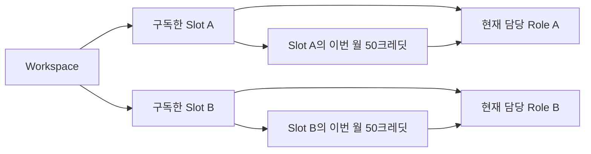
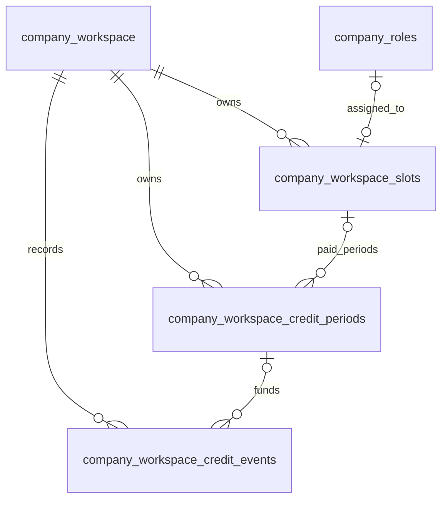

# Workspace별 Slot 구독·Role 용량·크레딧 시스템 설계

> **2026-10-08 정책 교체:** Free에서도 Role 무제한, 전체 Role 공용 월 10크레딧을 제공한다. 유료 Slot과 공용 크레딧은 공존하고, 자기 Slot 잔액을 먼저 사용한 뒤 공용 잔액을 사용한다. Slot 종료로 Role을 자동 중지하지 않는다. [현재 로컬 구현 정본 14절](workspace-billing-stripe-setup-ko.md#14-무제한-role과-독립-공용-크레딧--2026-10-08-로컬-구현)을 따른다. 아래의 1 Role·5크레딧·유료 전환 시 무료 제공량 제외·용량 부족 시 중지 설계는 **이전 설계 기록**이며 현재 정책이 아니다. 운영 배포는 아직 하지 않았다.


> **2026-10-08 여러 슬롯 구매:** 한 번의 Checkout에 1~100개의 슬롯을 결제한다. 같은 구매의 슬롯들은 결제일을 공유하지만 Role 배정·월 50크레딧·취소는 각각 독립적이다. 일부 취소는 현재 기간을 유지하면서 다음 갱신 수량만 줄인다. [구현·테스트·운영 적용 상태](workspace-billing-stripe-setup-ko.md#13-여러-슬롯을-한-번에-구매--2026-10-08-로컬-구현)를 따른다.

> **2026-10-08 제공 슬롯 추가:** 운영자가 지정한 수의 슬롯을 한 달간 제공하는 로컬 구현을 추가했다. 각 슬롯은 50크레딧과 유료 권한을 갖고 자동 결제·갱신 없이 종료된다. 기존 슬롯·기간 테이블을 재사용하며 구독 종료 후에도 기존 추천의 후보자 수락은 유지한다. 회사의 최종 연결 수락에는 현재 유효한 슬롯·크레딧이 필요하다. [구현·운영 방법 및 검증 범위](workspace-billing-stripe-setup-ko.md#12-한-달-제공-슬롯과-기존-추천-수락--2026-10-08-로컬-구현)를 따른다. 운영 반영·배포 완료를 뜻하지 않는다. 아래 이전 구현 범위에서 미채택으로 분류했던 운영 제공 슬롯은 이 절로 대체한다.

> **2026-10-07 용어 갱신:** 구독 상품은 Agent 대신 Slot으로 통일한다. 운영 DB 이름 변경과 구버전 호환, Stripe 변경 및 검증 범위는 [구현 문서 11절](workspace-billing-stripe-setup-ko.md#11-agent-상품-개념을-slot으로-통일--2026-10-07)을 따른다.

> **2026-10-07 계약 조건 갱신:** Free·표준 Slot에는 성공보수가 없다. 고객이 요청한 Enterprise에는 별도 비용 모델을 명시적으로 계약할 수 있다. 아래의 Scale 수수료 표현은 모든 Enterprise 고객에게 자동 적용되는 약정이 아니다. 월간·연간 모두 중도 취소의 일할·월할 환불 없이 결제 기간 끝까지 이용하며, 법정 권리·잘못된 청구·Harper 귀책은 별도로 처리한다. [회사 약관과 관련 문서 개정안](../legal/2026-10-subscription/README.md)에 국문·영문 문안, 참고 출시 계획과 구현의 차이, 공개 전 확인 사항을 기록했다. 아직 시행·배포하지 않은 검토본이다.

> **2026-10-07 구현 범위 갱신:** 이 문서는 전체 제품 목표 설계다. 현재 로컬 구현과 Stripe 설정의 정본은 [Workspace 구독 구현과 Stripe 설정](workspace-billing-stripe-setup-ko.md)이다. 실제 운영 배포를 뜻하지 않는다. Stripe 월/연 Subscription을 구매별로 만들고 선택한 수량만큼 개별 Slot을 유지하며 신규 테이블은 Slot·월 기간·차감/승인 이벤트의 **3개**다. 금액/영수증 내역은 Stripe에서 직접 조회한다. 아래의 제공자 미정, 별도 거래 원장, 운영 승인 Slot, 자동 credit reversal, 동시 마지막 종료 Role 예약, Worker 일괄 적용은 이번 구현에서 채택하지 않은 이전 목표/후속 범위다. `/company`는 후속 직접 가입 요청에 따라 온보딩으로 연결한다. 추천·매칭 Worker는 변경하지 않았다. 회사 가입에 추가하는 테이블은 없으며 기존 Workspace에 가입 도메인·진행 상태 두 칼럼을 둔다. 가입 절차·실제 검증·운영 적용 준비는 위 Stripe 설정 문서 9절을 따른다. Free 연결 대기 UI/회사 수락 API 제한만 적용한다.


- 문서 기준: 2026-10-07
- 상태: **목표 설계와 현재 로컬 구현을 함께 기록**. 현재 구현·운영 준비·검증의 정본은 위 Stripe 설정 문서다. 아래 후속 범위를 구현 또는 배포 완료로 해석하지 않는다.
- 대상: `/org`를 사용하는 회사 workspace의 internal Role과 회사측 채용 행동
- 범위: 이용 권한, Slot 구독, Role 배정, 월별 크레딧, 취소·갱신·Scale 전환, UI·LLM 경계, 데이터 구조와 도입 순서
- 최초 설계의 제외 범위: 결제 제공자·실제 청구. 2026-10-07 Stripe 카드 구독과 판매 가격 **월 USD 249 / 연 USD 2,388 선결제(월 환산 USD 199)**로 구체화했다. 월·연 상품 모두 Slot당 매월 50 credits이며 이월하지 않는다. 현재 로컬 앱은 월간·연간을 모두 지원하며 실제 Stripe Test 결제 왕복을 검증했다. 연간 Invoice 하나에 월별 크레딧 기간 12개를 만들고 현재 월의 제공량만 사용할 수 있다. 구현과 검증 상태는 위 설정 문서가 정본이다. Scale 수수료 산정·청구, 수동 크레딧 보정 UI는 후속 범위다.

## 1. 제안의 결론

**유료 Slot 한 개가 active Role 한 개를 운영할 용량을 제공한다. Role의 배정은 자동으로 처리하고, 크레딧은 각 Slot에 귀속되어 그 슬롯에 연결된 Role만 사용한다.**

Slot은 **채용 하나를 진행하는 구독 단위**다. 현재 담당 Role을 함께 기록해 종료 영향을 결정하며 별도의 Agent 상품이나 중복 테이블을 만들지 않는다. 하나의 유료 Slot 행이 이용 기간, 갱신 기준일, 종료 예약과 현재 담당 Role을 가진다. 사용자는 Role을 만들고 시작하거나 중지하면 된다. Slot 배정 변경은 원하는 경우에만 설정에서 제공한다.

무료 이용은 `active Role 최대 1개`, Scale은 `무제한`이라는 workspace 권한으로 처리한다. 무료 구독 행은 만들지 않는다.

이 구조의 핵심 결정은 다음과 같다.

1. 유료 Slot이 0개면 무료 이용이다. Active Role 1개와 월 5크레딧을 제공한다.
2. 유료 Slot이 하나라도 있으면 무료 용량·무료 크레딧은 더하지 않는다. Slot N개면 active Role N개와 Slot별 월 50크레딧이다.
3. 무료→Slot 1개 전환은 Role 한도를 1개에서 2개로 늘리지 않는다. 같은 Role을 유지하면서 유료 기능과 50크레딧을 이용하게 된다.
4. 새 Role 시작·재시작에는 빈 Slot을 자동 배정한다. 직접 변경은 하나의 선택 메뉴에서 처리한다.
5. 구독 종료는 **Slot에 예약**한다. 만료된 Slot의 Role은 남은 빈 Slot로 자동 이동하고, 용량이 부족할 때만 중지한다. 기존 유효 배정은 유지한다.
6. 크레딧은 Role에 묶지 않는다. 어느 Role의 행동이든 같은 workspace의 유효한 크레딧을 사용할 수 있다.
7. 각 Slot의 크레딧은 자기 갱신일에만 초기화된다. 다른 Slot의 남은 크레딧을 함께 초기화하지 않는다.
8. Scale은 workspace의 별도 상업 모델이다. Role·크레딧에 수량 제한을 두지 않으며 Slot을 무한히 생성하지 않는다.
9. Intro 요청과 연결 대기 후보의 회사 Connect/Accept를 각각 1크레딧의 **업무 행동**으로 기록한다. 버튼 클릭·메일 전송 횟수를 세지 않는다.
10. 크레딧 차감 정보는 LLM의 입력·도구 설명·결과·대화 기록에 전달하지 않는다. 성공 toast, Slack 알림과 후보자 연락에도 추가하지 않는다.

### 1.1 요구사항과 제안 기본값의 구분

| 구분 | 내용 |
| --- | --- |
| 사용자 요구 | 무료: active Role 1개·월 5크레딧·연결 대기 잠금·Harper의 선제 internal 추천 중단 |
| 사용자 요구 | Slot마다 active Role 1개와 월 50크레딧, 서로 다른 구독일에 따른 독립 갱신 |
| 사용자 요구 | Scale: active Role·크레딧 무제한, 채용 성과에 따른 수수료 모델 |
| 사용자 요구 | Intro 요청 1크레딧, 연결 대기 후보 Connect/Accept 1크레딧, 차감 설명을 LLM이나 toast에 넣지 않음 |
| 사용자 요구 | slot 자동 배정, 필요할 때만 직접 변경. 용량이 꽉 차도 Role 등록은 허용하고 채용 시작에서 안내와 함께 차단 |
| 사용자 요구 | 크레딧 부족으로 요청을 진행할 수 없을 때 Harper 팀 문의 안내. `/company`에서 회사 계정으로 바로 가입, 일반 화면에서 잔액·사용량 상시 노출 금지 |
| 사용자 요구 | 결제 내역 확인과 구독 취소를 쉽게 제공. 크레딧 이월 없음, 무료 5개를 쓴 뒤 유료 전환하면 50개를 새로 사용 |
| 제안 기본값 | 무료 한도와 유료 한도를 합산하지 않음 |
| 사용자 요구 | 크레딧은 슬롯별로 독립 사용·갱신하며 다른 슬롯에서 가져다 쓰지 않음. 이월 없음 |
| 제안 기본값 | 구독 취소는 현재 이용 기간 말에 반영, 빈 slot도 같은 월 크레딧을 받음 |
| 제안 기본값 | 만료된 Slot의 Role은 남은 빈 Slot로 자동 이동, 실제 용량 부족분만 중지 |
| 제안 기본값 | 마지막 Slot 만료 시 현재 Role 하나를 무료로 이어서 사용 |
| 제안 기본값 | 회사 선제 Intro를 수락한 후보의 자동 연결에는 두 번째 크레딧을 쓰지 않음 |
| 제안 기본값 | 무료 갱신 기준일은 workspace의 첫 서비스 이용 시작일, 유료는 각 Slot의 첫 구독 시각 |
| 제안 기본값 | 잔액·사용 내역의 상세는 구독 설정 화면에서 확인. 실패한 행동에는 요청을 진행할 수 없는 이유와 Harper 팀 문의 경로만 간결히 안내하고 LLM에는 차감 설명을 추가하지 않음 |

제안 기본값은 이번 문서에서 일관된 동작을 설명하기 위한 결정안이다. 확정된 기존 운영 정책으로 취급하지 않는다. 구현 전에 달리 정해도 Slot·기간·업무 행동이라는 구조는 유지할 수 있다.

### 1.2 단순성을 유지하는 기준

| 항목 | 설계 기준 |
| --- | --- |
| 일반 Role 흐름 | Role 등록과 채용 시작을 분리. 등록은 용량과 무관하게 허용하고 시작·중지에 slot 선택이나 배정 관리 단계 없음 |
| 무료 상태 | 가상 Slot 없이 workspace 한도와 무료 월 기간으로 표현 |
| Slot 만료 | 남은 빈 Slot을 먼저 사용. 배정 때문에 불필요하게 Role을 중지하지 않음 |
| 취소 대상 | Slot의 종료 예약과 현재 배정만 사용. 별도의 종료 Role 예약은 만들지 않음 |
| 데이터 구조 | 유료 Slot·월 기간·크레딧 이벤트·실제 결제 거래의 네 테이블. 현재 두 행동이 모두 1이므로 별도 배분 테이블 없음 |
| 재시도 | 업무 중복 차감과 외부 메일 전달 복구를 각각 검증. 전송 결과 불명 상태를 무조건 재발송하지 않음 |
| 무료 잠금 | 연결 대기 관계만 제한. 다른 Role에서 정상 공개된 같은 후보자의 정보까지 숨기지 않음 |

읽는 순서는 3~6장의 상품·배정 규칙, 7~10장의 크레딧·실패 규칙, 11~14장의 제품 경계, 15~18장의 구현·검증 순서다.

## 2. 비교 기준과 현재 구현에서 확인한 사실

### 2.1 참고 서비스

2026-09-28 확인한 [Jack & Jill US pricing](https://www.jackandjill.ai/pricing/us)은 slot마다 Role 하나를 운영하고, slot별로 Intro 요청 수를 제공하는 구조다. 무료 제공량과 Scale 조건은 Harper 요청과 다르므로 이 문서의 수량·제한은 Harper 요구사항을 따른다. Harper도 슬롯별 크레딧과 독립 갱신·취소 규칙을 사용한다.

### 2.2 로컬 코드 기준의 현재 구조

아래는 **현재 로컬 작업 트리**를 확인한 결과다. 운영 DB와 배포 revision은 이번 작업에서 조회하지 않았으므로 실제 운영 반영 여부를 주장하지 않는다.

| 확인한 위치 | 확인한 사실 | 새 설계에 대한 영향 |
| --- | --- | --- |
| `src/types/database.types.ts` | `payments`, `payment_attempts`, `billing_sessions`가 `user_id`를 중심으로 연결됨 | 개인 결제를 workspace 이용 권한의 원본으로 재사용하지 않음 |
| 같은 파일, `src/lib/billing/server.ts` | `credits`·`credits_history`도 개인 계정 단위이고 하나의 잔액을 초기화함 | Slot별 갱신을 표현할 기간별 잔액이 필요함 |
| `src/lib/org/roleStatus.ts` | `ORG_ACTIVE_ROLE_LIMIT=5`, active 계산에 `active/open/top_priority`를 포함 | 고정 5개 제한을 workspace별 용량으로 교체 |
| `src/lib/org/agent/roleCreationState.ts`, `roleCreationConfirmation.ts`, `toolExecution.ts` | Role 초안 생성에도 기존 제한이 적용되고 생성 확인이 활성화로 이어짐 | 용량과 무관한 등록, 별도의 채용 시작, 시작 시점의 자동 배정으로 분리 |
| `src/lib/org/server.ts` | Intro는 `request_company_intro_v1`을 사용하고 후보 수락은 `decide_company_intro_request_v1`을 사용 | Intro 요청 한 번에만 과금 경계를 추가 |
| 같은 파일, `setOrgCandidateStage` | 연결 메일 전송과 tag·processed stage·progress 저장이 여러 호출로 나뉨 | 차감만 앞뒤에 붙여서는 원자성이 생기지 않음. 연결 승인과 전달 작업의 durable commit이 필요 |
| `harper_worker/opp/company_first_search/repository.py` | 회사 단위 검색이 candidate-first와 company-first 경로를 함께 다룸 | 무료 제한은 company-first 검색 전체 중단이 아니라 candidate-first 시작 권한 중단 |
| `harper_worker/opp/utils/internal_fit.py`, `scripts/company_role_recurring_matching.py` | internal fit·선정·전달에 여러 진입점이 있음 | 무료 제한을 단일 화면이나 한 Worker에만 추가하면 누락됨 |
| `src/app/api/search/launch/route.ts` | People Search도 기존 payments/plans에서 이용 조건을 읽음 | 기존 테이블 제거 전에 별도의 기능 정책으로 의존성을 제거해야 함 |

기존 데이터·제품 계약의 정본은 다음과 같이 유지한다.

- Role 상태: `company_roles`, internal Role 설정: `company_internal_roles`
- 회사 선제 후보: `company_intro_candidates`
- 후보자에게 보이는 기회: `talent_opportunity_recommendation`
- 기존 pipeline과 동의·공유 상태: 기존 stage/tag/progress 및 현재 공통 command
- 새 구독 시스템: 어떤 Role을 시작할 수 있는지, 어떤 유료 기능을 사용할 수 있는지, 어떤 기간의 크레딧을 썼는지

구독 시스템이 후보자의 관심·동의·회사 공유 여부를 새로 해석하거나 복제하지 않는다.

## 3. Workspace의 이용 형태와 기능 권한

### 3.1 하나의 저장 모델, 세 가지 표시 상태

workspace에는 `commercial_model = standard | scale`을 저장한다. `standard` 안에서 현재 이용 가능한 유료 Slot 수로 Free와 Slot 이용을 계산한다.

```text
commercial_model = scale
  → Scale

commercial_model = standard + 유효한 paid Slot 0개
  → Free

commercial_model = standard + 유효한 paid Slot N개
  → Slot N개 구독
```

`plan=paid`와 `slot_count`를 별도로 저장하지 않는다. 취소 예약이 있어도 현재 기간이 남아 있으면 유효한 Slot이다. 구독 이력의 총 행 수나 자동 갱신 여부를 현재 Slot 수로 쓰지 않는다.

### 3.2 한도와 초기 기능표

| 기능 | Free | Slot N개 | Scale |
| --- | --- | --- | --- |
| Active internal Role | 1개 | N개 | 무제한 |
| 초안·중지·종료 Role 보관 | 수량 제한 없음 | 수량 제한 없음 | 수량 제한 없음 |
| 월 제공량 | 5 | Slot마다 50 | 무제한 |
| Role이 없는 Slot의 월 제공량 | 해당 없음 | 50 제공 | 해당 없음 |
| 먼저 제안 가능한 후보 검토 | 허용 | 허용 | 허용 |
| Intro 요청 | 잔액 내에서 허용 | 잔액 내에서 허용 | 허용 |
| 연결 대기 탭 | 잠금 | 허용 | 허용 |
| 연결 대기 후보의 새 Connect/Accept | 불가 | 잔액 내에서 허용 | 허용 |
| Harper가 먼저 시작하는 candidate-first internal 추천 | 불가 | 기존 자격·설정 안에서 허용 | 기존 자격·설정 안에서 허용 |
| 회사가 승인한 Intro에 대한 후보 수락·자동 연결 | 허용 | 허용 | 허용 |
| 이미 연결된 후보의 기존 채용 과정 | 기존 권한 안에서 유지 | 기존 권한 안에서 유지 | 기존 권한 안에서 유지 |

Free의 1 slot은 동시에 운영할 수 있는 active Role이 최대 1개라는 뜻이다. 매월 Role을 한 개만 만들 수 있다는 뜻은 아니며, 기존 Role을 중지하고 다른 Role을 시작할 수 있다. 월 단위로 초기화되는 것은 5크레딧이다.

Free의 5크레딧은 Intro 요청에 사용할 수 있다. 회사가 후보자에게 먼저 관심을 표하는 경로까지 막으면 무료 크레딧의 사용처가 없어지므로 해당 경로는 유지한다.

Scale의 무제한은 수량 한도 면제다. 후보자 동의, privacy, 회사 공유, test-only 격리, 연락 빈도, workspace 권한과 Role의 실제 운영 상태는 계속 검사한다. 같은 요청의 중복 처리도 계속 막는다.

### 3.3 기능 확장 방식

기능별 권한표는 한 서버 모듈에서 관리한다. 초기 capability key의 예는 다음과 같다.

```text
pending_connections.read
pending_connections.connect
internal_recommendations.initiate
company_intro.request
```

새로 제한할 기능이 생기면 기능 registry와 Free/Slot/Scale 정책에 추가한다. UI component마다 `plan === ...` 조건을 만들거나 workspace마다 같은 boolean을 여러 개 복제하지 않는다. 초기에는 workspace별 임의 override 테이블이나 범용 요금제 편집기를 만들지 않는다.

권한 판정은 두 층으로 구성한다.

1. **Workspace 이용 권한:** 현재 이 기능을 제공하는가. Role 활성화·새 sourcing에는 용량을, 새 Intro·Connect 승인에는 잔액을 검사한다.
2. **기존 업무 권한:** 이 팀원이 이 workspace와 Role을 관리할 수 있는가, 후보자가 공개·동의했는가, 해당 상태에서 이 행동이 가능한가.

두 층을 모두 통과해야 실행한다. 화면과 LLM에 제공하는 값은 각 surface에 필요한 projection이며, 최종 write는 현재 권한을 다시 검사한다.

### 3.4 현재 권한의 계산식

paid Slot은 다음 조건을 만족하는 승인 period가 현재 존재할 때 유효하다.

```text
period.starts_at <= effective_now < period.ends_at
AND period.confirmed_at <= effective_now
AND period.revoked_at IS NULL
AND slot.revoked_at IS NULL
AND (slot.cancel_effective_at IS NULL OR effective_now < slot.cancel_effective_at)
```

`effective_now`는 8.2의 서버 판정 시각이다. 잔액이 0인 period도 이용 기간 자체는 유효하다. 이 조건으로 유효한 paid Slot을 세고, Standard면 0개일 때 무료 용량 1, 그 밖에는 paid 수를 용량으로 쓴다. Scale이면 유한 용량과 잔액 계산을 건너뛴다.

잔액은 슬롯별로 계산한다. Free의 단일 슬롯은 무료 현재 기간을, 유료 Role은 현재 배정된 유효 Slot의 현재 기간만 사용한다. 다른 Slot의 잔액은 포함하지 않는다. 미래·만료·철회 기간과 paid 이용 중 무료 기간은 포함하지 않는다. 도입이 끝난 이용 workspace에서 원본이 누락·불일치하면 자동으로 유료 권한이나 새 50을 부여하지 않고 설정 오류로 처리한다.

일반 팀원에게는 기능 사용 가능 여부와 Role 상태에 필요한 최소 summary만 제공한다. 잔액·사용 내역·결제 내역은 구독 화면의 별도 권한 있는 조회로 분리하고, 구독·취소·모델 전환은 workspace 관리 authority로 제한한다. 직접 배정 변경은 관리 authority와 영향을 받는 Role 접근 권한을 모두 확인한다. Intro·Connect는 기존 후보자 관리 권한을 사용한다. User ID는 actor이고 이용권 소유자가 아니다.

## 4. Slot과 Role의 관계

### 4.1 하나의 Slot 행이 구독과 Role 배정을 함께 관리한다

Slot은 유료 구독의 단위이자 active Role 하나를 진행할 수 있는 용량이다. 구독과 용량을 별도의 1:1 객체로 나누지 않는다.

따라서 Slot 행에 `assigned_role_id`를 둔다. 이 값이 slot의 현재 사용자를 나타낸다. Role 테이블에 같은 `slot_id`를 함께 저장해 양방향 정본을 만들지 않는다.

유료 Slot만 이 테이블에 저장한다. 무료 상태의 담당 Role은 기존 Role 상태와 workspace의 최대 1개 한도로 충분히 표현할 수 있다. 무료 크레딧은 workspace의 무료 월 기간에 저장한다. Scale도 Role 배정 관계가 필요 없다.



### 4.2 항상 지킬 무결성

- 같은 workspace의 Slot만 해당 Role을 담당할 수 있다.
- Slot 한 개가 동시에 두 active Role을 담당할 수 없다.
- Role 한 개가 동시에 두 Slot을 사용할 수 없다.
- Slot 이용 중인 active internal Role은 현재 유효한 유료 Slot 하나에 배정된다.
- Free의 active internal Role은 Slot 배정 없이 최대 1개다.
- Scale의 active Role은 Slot 배정 없이 운영한다.
- `paused`, `ended`, `deleted`, `draft` Role은 slot을 차지하지 않는다.
- Role을 중지·종료·삭제해도 Slot을 취소하지 않는다. 구독과 월 제공량은 유지한다.
- Slot을 취소 예약해도 현재 Role을 즉시 중지하지 않는다.
- 크레딧 잔액 0은 Role 중지 조건이 아니다. 검색·검토와 이미 승인한 업무는 계속될 수 있다.

Active를 계산할 때 기존 `active/open/top_priority` 호환값을 한 정본에서 처리한다. 표시 label이나 LLM 문구로 active 여부를 판정하지 않는다. 만료·삭제 Role은 기존 availability 검사를 함께 적용한다.

### 4.3 slot이 꽉 찬 경우

**Role 등록과 채용 시작은 서로 다른 행동이다.** 등록 완료 시 Role 내용은 저장되어 Role 목록·상세에서 다시 열 수 있다. 등록된 Role은 `draft`를 유지하되 작성 완료 상태를 UI에서 `채용 대기`로 표시할 수 있다. 새 유료 status나 slot 예약을 만들지 않는다. 저장에는 빈 slot이 필요 없고, 기존 Role을 몰래 중지하지 않는다.

`채용 진행하기`를 누르는 시점에만 현재 workspace의 용량을 다시 확인한다. 빈 slot이 있으면 자동 배정하고 active로 전환한다. 꽉 찼다면 Role 내용과 상태를 그대로 두고, Role 화면에 `지금은 새 채용을 시작할 수 없어요. 진행 중인 채용을 하나 중지하거나 Slot을 추가해 주세요.`와 두 행동의 경로를 보여준다. 이 오류는 새 Role 등록 자체의 오류로 표시하지 않는다. Free의 두 번째 Role도 동일하다.

등록을 마친 뒤 다른 팀원이 마지막 slot을 사용했어도 저장된 Role은 보존한다. 채용 시작 transaction에서 다시 검사하며 동시 시작 중 한 건만 성공한다. 시작 실패 후 자동 재시도·자동 중지·자동 구매는 하지 않는다. 등록 확인 문구는 `Role을 등록했어요`까지만 말하고, 실제 active 전환이 성공하기 전에는 `채용을 시작했어요`라고 말하지 않는다.

현재 구현은 `roleCreationState.ts`와 `toolExecution.ts`에서 초안 생성 전 고정 5개 한도를 확인하고 `roleCreationConfirmation.ts`에서 생성 확인을 곧 활성화로 취급한다. 구현 시 이 선행 차단을 제거하고 등록 완료와 채용 시작을 분리해야 한다. `roleStatus.ts`의 `새 역할 더 등록할 수 없어요` 문구도 채용 시작 한도 안내로 바꾼다. 초안 보존과 기존 승인·동의 계약은 유지한다.

## 5. 자동 배정과 직접 이동

### 5.1 새 Role을 시작할 때

배정은 별도의 Role **채용 시작** command 안에서 자동으로 수행한다. 등록 command는 배정을 건드리지 않는다.

1. Workspace 권한과 현재 이용 형태를 확인한다.
2. Scale이면 slot 없이 활성화한다.
3. Free이면 현재 active Role이 없는지 확인하고 배정 없이 활성화한다.
4. 유료이면 현재 이용 가능한 빈 유료 slot을 고른다.
5. 배정과 Role 활성화를 같은 transaction에서 저장한다.

빈 유료 slot이 여러 개면 다음 순서로 고른다.

1. 종료 예약이 없는 Slot 우선.
2. 그 안에서는 구독 시각이 빠른 Slot, 마지막 tie-break는 ID.
3. 모두 종료 예약 상태면 종료 시각이 가장 늦은 Slot 우선, 이후 구독 시각·ID.

이 순서는 채용 적합성 판단이 아니라 서비스 수명과 배정의 재현성을 위한 구조 규칙이다. LLM이 slot을 선택하거나 Slot별 크레딧 잔액으로 배정하지 않는다.

종료 예정 Slot만 비어 있으면 Role을 그곳에 시작할 수 있다. Slot 종료일과 현재 기준의 Role 운영 영향을 inline으로 보여준다. 다른 유효 Slot이 비면 만료 때 자동 이동할 수 있으므로 Slot 종료일을 Role의 확정 종료일처럼 표시하지 않는다. 추가 확인 modal이나 slot picker는 만들지 않는다.

### 5.2 Role 중지·재시작

- 중지: Role 상태를 `paused`로 바꾸면서 배정을 해제한다.
- 재시작: 현재 이용 형태에 맞춰 용량을 확인하고, 유료 이용이면 빈 Slot을 자동 배정한다.
- 중지 전 사용했던 Slot을 고정해서 예약하지 않는다.
- 모든 slot이 사용 중이면 재시작은 실패하고 Role은 중지 상태를 유지한다.
- 종료·삭제도 배정을 해제한다. 회사의 기존 명시적 결정과 후보자 privacy에 관한 후속 처리는 현재 lifecycle command를 따른다.

### 5.3 직접 변경

Slot 관리 또는 Role 설정의 추가 메뉴에 `담당 Slot 변경` 하나를 제공한다. 목적 Slot을 고르면 서버가 필요한 변경을 처리한다. 사용자에게 이동·교환 모드를 따로 고르게 하지 않는다. Free와 Scale에는 이 메뉴가 없다.

| 현재 상황 | 변경 결과 |
| --- | --- |
| 목적 Slot이 비어 있음 | 해당 Role을 목적 Slot로 이동 |
| 목적 Slot에 다른 active Role이 있음 | 두 Role의 담당 Slot을 교환 |
| 목적 Slot이 만료·철회됨 | 변경 불가 |
| 다른 workspace Slot | 변경 불가 |
| Scale | 담당 Slot 변경 메뉴 없음 |

이동·교환은 두 배정을 한 transaction에서 처리한다. Role의 후보자·Brief·pipeline·추천 이력은 Role에 그대로 남는다. 크레딧도 옮기지 않으며 구독일·갱신일·취소일을 바꾸지 않는다.

종료 예정 Slot로 Role을 옮기면 그 Role이 용량 감소 시 중지 대상이 될 수 있다. 변경 전에 현재 기준의 영향과 시각을 보여준다. 배정 변경은 무료 유지 선택·월 기준일·잔액을 바꾸지 않는다.

### 5.4 무료에서 처음 Slot을 구독할 때

첫 유료 기간 승인과 함께 현재 무료 active Role 하나를 새 Slot에 자동 배정한다. Active Role 수는 그대로 1개다. 무료 active Role이 없으면 Slot은 비어 있다. 두 번째 이후 구독도 비어 있는 Slot을 추가하며 중지 Role을 자동 재시작하지 않는다.

무료→유료 전환 때문에 새 Role을 복제하거나 후보자·Brief·pipeline을 옮길 필요가 없다. 바뀌는 것은 이용 권한과 현재 배정뿐이다.

## 6. Slot 취소와 Role 중지 규칙

### 6.1 단순 count 모델보다 slot이 필요한 이유

Slot 수와 별도의 `종료할 Role`만 저장하면, 선택한 Role을 중지하고 다른 Role을 시작하는 순간 취소 계획이 현재 용량 사용과 어긋난다. 이를 보완하려면 Role 대체·취소 대상 재선정 규칙을 계속 추가해야 한다.

이 설계에서는 예약의 대상이 Slot로 고정된다. **만료 때 현재 배정과 남은 용량을 확인**하면 된다. Role 변경은 배정 변경이고, 구독 취소는 Slot 종료다. 별도의 slot 상태 머신이나 미래 Role 교체 계획은 만들지 않는다.

### 6.2 종료 예약

제안 기본값은 현재 월 이용 기간이 끝날 때 종료하는 방식이다.

- 예약 순간: Slot은 계속 유효하다. Role과 남은 크레딧을 현재 기간 말까지 쓸 수 있다.
- 종료 시각: 해당 Slot의 월 잔액은 만료되고 slot은 사라진다.
- 다른 paid Slot이 남음: 기존 유효 배정을 유지하고 만료된 Slot의 Role을 남은 빈 Slot로 자동 이동한다. 빈 Slot이 부족할 때만 남는 Role을 `paused`로 내린다.
- 마지막 paid Slot이 만료됨: 무료 전환 규칙을 적용해 Role 하나를 유지할 수 있다.
- Scale이면 paid Slot 만료가 Role을 중지시키지 않는다. Scale 권한으로 운영하기 때문이다.

정상적인 단월 구독에서는 종료 시각이 현재 period의 끝이다. 이미 다음 월까지의 실제 이용 기간을 승인한 특수 경우에는 확인된 연속 이용 기간의 마지막 경계까지 약속을 유지한다. 그보다 앞서 철회하려면 별도의 명시적 즉시 이용 철회 결정을 요구한다. 단순 취소 예약이 이미 승인된 기간을 조용히 없애지 않는다.

상태는 `이용 중`, `구독 종료 예정`, `구독 종료`로 보여줄 수 있다. 결제 제공자의 상태 enum은 제품 상태로 직접 쓰지 않는다.

실제 반복 청구가 연결된 Slot의 취소는 청구 중단을 신뢰 가능한 원본에서 확인한 뒤 `구독 종료 예정`으로 확정한다. 확인 전에는 `취소 확인 중`으로 표시하고 유효 기간·Role을 임의로 줄이지 않는다. 확인 결과가 불명확하면 같은 요청 key로 조회·재시도하여 이중 취소나 새 갱신을 막는다. 취소 예약 철회도 반복 청구 재개가 필요한 경우에는 그 확인 뒤 확정한다. 결제 수단이 없는 운영 승인 Slot은 운영자가 승인한 종료·철회가 그 확인 원본이다. 제공자별 호출 방법은 후속 결제 연동에서 정한다.

### 6.3 Slot 행에서 바로 취소하는 경험

구독한 **Slot 행의 `구독 취소`**에서 바로 그 Slot의 종료일, 현재 담당 Role, 그날 현재 배정 기준의 용량 감소 영향을 보여준다. 사용자에게 slot이나 종료할 Role을 먼저 고르게 하지 않는다. 담당 Role이 있다고 해서 반드시 중지되는 것은 아니다. 빈 다른 Slot이 생기면 만료 때 자동 이동한다. 1개→0개처럼 무료 전환 후에도 Role 한 개를 운영할 수 있다면 기능 변화만 설명한다.

영향받을 Role을 바꾸고 싶은 경우에만 기존의 선택적 `담당 Slot 변경` 메뉴를 사용할 수 있다. 취소 자체는 처음 preview한 Role을 미래의 종료 대상으로 고정하지 않는다. Preview 이후 Role을 중지·시작하거나 배정을 바꾸면 영향도 달라진다. 취소 확정 직전에 revision이 달라졌으면 최신 영향을 다시 보여주고 확정한다. 여러 Slot이 동시에 끝나 무료로 유지할 Role을 고르는 드문 경우는 6.5의 별도 선택을 적용한다.

### 6.4 사용자가 걱정한 예외의 처리

```text
Slot A: 계속 구독 / Role A
Slot B: 10월 20일 구독 종료 예정 / Role B

사용자가 Role B를 중지
  → B가 빈 slot이 됨

새 Role C 시작
  → 다른 빈 slot이 없다면 B에 자동 배정
  → Slot B의 종료일과 현재 기준의 Role 중지 예정 표시

10월 20일
  → B 만료 / Role C 중지
  → Role B는 이미 중지 상태이므로 추가 처리 없음
```

```text
같은 상황에서 Role A와 Role B의 담당 Slot을 교환
  → A가 Role B 담당 / B가 Role A 담당

10월 20일
  → B의 현재 Role A 중지
  → Role B는 A에서 계속 운영
```

사용자가 배정을 바꿨으므로 용량 부족 시의 중지 대상도 바뀐다. 배정 변경 preview와 Slot 관리 화면에 반영한다. 처음 선택한 Role과 현재 Role을 모두 저장해 우선순위를 만드는 설계는 하지 않는다.

다만 그 사이 다른 Role을 중지해 빈 Slot이 생겼다면 수동 이동은 필요 없다.

```text
Slot A: 계속 구독 / 비어 있음
Slot B: 10월 20일 구독 종료 예정 / Role C

10월 20일
  → B 만료
  → Role C를 A로 자동 배정
  → Role C 계속 active, 후보자·pipeline 유지
```

**Slot을 줄이는 행위는 전체 용량을 줄이는 것이지, 빈 용량이 남았는데도 특정 Role을 강제 종료하는 행위가 아니다.** Role 자체를 중지하려면 기존 Role 중지 기능을 사용한다.

### 6.5 마지막 Slot의 만료: 1개→0개

무료도 active Role 하나를 제공하므로 마지막 Role을 무조건 중지시키면 요구사항과 어긋난다. 현재 active Role 하나의 유료 배정을 해제하고 무료로 이어서 운영한다.

- Role 한 개가 active: 같은 Role 유지, 연결 대기 잠금과 선제 internal 추천 중단이 적용됨.
- active Role이 없음: 무료 용량 1개를 사용할 수 있음. 중지된 Role을 자동 재시작하지 않음.
- 여러 Slot이 동시에 끝나 여러 Role이 영향을 받음: 마지막 종료 batch의 preview에서 무료로 유지할 Role 하나를 정함. Role 하나만 남으면 선택 단계 없음.
- 선택한 Role이 만료 전 중지·삭제됨: 이를 되살리지 않음. 마지막 만료 batch의 현재 active Role 중 하나를 이어감.
- 명시적 선택이 없는 예외 복구: 현재 active Role 중 생성 시각이 가장 빠른 Role, ID 순으로 하나를 유지하고 나머지는 중지. 운영 이력에 기록.

동시 종료에서 선택이 필요한 경우에만 workspace의 `free_fallback_role_id`에 저장한다. 이는 여러 현재 active Role 중 하나를 무료로 유지하기로 한 실제 결정이며 reconciliation이 읽는다. 적용 뒤 비운다. 새 구독·취소 철회·종료일 변경으로 마지막 동시 종료 계획이 달라진 경우에도 이전 선택을 비우고 최신 preview를 사용한다. Role 중지·삭제는 선택을 무효로 만들 수 있지만 그 Role을 되살리는 근거가 되지 않는다.

여러 Slot이 서로 다른 날에 끝나면 각 시점의 남은 용량으로 처리한다. 남은 빈 Slot이 있으면 자동 이동하고, 없으면 그 시점에 용량을 초과하는 Role을 중지한다. 무료 용량을 미리 더하지 않는다. 이 경우 마지막까지 남은 Role 하나가 무료로 이어진다.

서로 다른 종료일에 하나의 `무료 유지 Role`을 미리 지정해 이전 용량 감소까지 예약하는 기능은 초기 버전에 넣지 않는다. 사용자가 다른 Role을 마지막까지 유지하려는 경우에만 선택적 담당 Slot 변경을 사용한다. 일반 취소는 이 변경을 요구하지 않는다.

유료 크레딧을 무료 크레딧으로 옮기지 않는다. 무료 이용은 자기 월 기준일과 그 월의 잔액으로 복귀한다.

### 6.6 취소 철회·재구독·갱신 실패

| 상황 | 처리 |
| --- | --- |
| 종료일 전 취소 철회 | 종료 예약 해제. 구독일·갱신 기준일·이번 월 잔액 유지 |
| 명시적 종료 예약·철회가 반영된 뒤 새 구독 | 새 paid Slot과 새 기준일. 이미 끝난 Slot 이력은 보존 |
| 명시적 취소 없이 다음 기간 승인이 지연됨 | 현재 이용 권한 만료. 다음 50크레딧을 임의 지급하지 않음 |
| 위 갱신 지연 뒤 해당 기간 승인이 확인됨 | 같은 Slot의 해당 기간을 한 번만 승인. 기준일 유지, 해당 기간 잔액만 제공 |
| 여러 기간이 지난 뒤 승인 확인 | 이미 끝난 기간의 크레딧을 현재 잔액에 누적하지 않음 |
| 갱신 실패 뒤 복구 | 유료 용량은 회복하되 중지 Role을 자동 재시작하지 않음. 무료 Role 한 개가 이어지는 첫 유료 복구는 그 Role을 자동 이관 |
| Role 없는 Slot 취소 | 종료 때 Role 중지 없음. 그 Slot의 잔액만 만료 |

명시적으로 끝낸 구독과 월 기간 승인이 잠시 없는 상태는 다르다. 전자는 새 구독이고, 후자는 취소가 없는 기존 갱신의 확인·복구다. 결제 재시도 횟수·유예기간은 이번 설계에서 정하지 않는다. 기본 시스템은 **확인된 이용 기간**을 원본으로 동작한다. 향후 유예를 도입해도 확인되지 않은 새 월 크레딧을 먼저 지급하지 않는 경계는 유지한다.

### 6.7 모든 용량 변경에 쓰는 한 가지 정리 규칙

취소·기간 미갱신·명시적 철회·무료 전환은 같은 capacity reconciliation을 사용한다.

1. 해당 경계의 최종 이용 형태와 유효 Slot을 계산한다. 같은 시각에 끝나는 Slot은 함께 처리한다.
2. 중지·종료·삭제 Role의 배정과 만료된 배정을 해제한다. 현재 유효 Slot의 정상 active 배정은 유지한다.
3. 유료 Slot이 남으면 배정을 잃은 현재 active Role을 빈 Slot에 자동 배정한다. 빈 Slot 선택은 5.1의 순서를 사용한다.
4. 여러 Role이 동시에 배정을 잃고 빈 Slot이 부족하면 기존 Slot의 구독 시각·ID 순으로 유지할 Role을 정하고 나머지를 중지한다. 정상 취소에서 다른 결과를 원하면 확정 전에 담당 Slot을 변경한다.
5. paid가 0이면 6.5대로 현재 active Role 최대 하나를 무료로 유지한다. Scale이면 모든 active Role을 배정 없이 유지한다.
6. Role의 중지는 기존 lifecycle command로 수행한다. 이미 중지된 Role을 남은 용량이나 늦은 갱신 승인만으로 재시작하지 않는다.

이 규칙은 **현재 용량을 정리하는 한 함수**다. Role 중요도 점수, LLM 선택, slot 교체 요청 상태, 별도 취소 대상 테이블은 필요 없다.

정기 작업이 여러 종료일을 놓쳤다면 미반영된 용량 감소를 시간순으로 처리하고, 같은 시각의 경계만 묶는다. 예를 들어 A가 10/10, B가 10/20 끝났는데 10/21 처음 정리하더라도, 10/10에 중지돼야 했던 A의 Role을 10/20 무료 전환 때 되살리지 않는다. 읽기와 Worker의 현재 상태 projection도 같은 정리 결과를 사용한다.

Workspace에 `capacity_reconciled_at`을 두어 **어느 시각까지 용량 변경을 반영했는지**만 기록한다. 그 이후의 미반영 경계를 계산하고, 배정·Role 상태와 함께 현재 판정 시각까지 한 transaction에서 갱신한다. 이미 정리한 과거 만료를 반복 적용해 나중에 재시작한 Role을 다시 중지하지 않는다. 읽기 projection은 같은 checkpoint 이후를 계산하되 저장하지 않는다. 별도의 경계 작업·slot 이력 테이블은 필요 없다.

새로운 Role 변경·취소 변경은 지난 경계를 먼저 정리한 뒤 적용한다. 기간 승인도 과거 경계를 건너뛰지 않으며, 승인과 정확히 같은 시각의 경계에는 이번 승인을 포함한 최종 이용 권한을 적용한다. `confirmed_at`보다 이전 경계에 늦게 받은 승인을 소급 사용해 중지 결정을 없애지는 않는다.

## 7. 크레딧의 지급·사용·만료

### 7.1 슬롯별 잔액

`크레딧` 탭에는 슬롯마다 Slot, 담당 Role, 남은 크레딧, 다음 갱신일을 표시한다. 공용 잔액 합계는 표시하지 않는다. 저장 원본은 기존 Slot의 **월 이용 기간별 잔액**이다. 별도의 슬롯·지갑 테이블을 추가하지 않는다.

```text
Slot A → Role A / 9월 5일~10월 5일 / 50 지급 / 18 사용 / 32 남음
Slot B → Role B / 9월 20일~10월 20일 / 50 지급 /  0 사용 / 50 남음

Role A는 A의 32개만, Role B는 B의 50개만 사용 가능
```

슬롯이 비어 있어도 그 잔액은 해당 슬롯에 남는다. Role을 새로 연결해도 지급량이 초기화되지 않는다. Role 교환 시 크레딧이 Role을 따라 이동하지 않는다. 새로 연결된 슬롯의 남은 크레딧과 갱신일을 따른다.

### 7.2 초기화의 정확한 의미

갱신은 기존 잔액에 50을 더하는 동작이 아니다.

```text
Slot A의 이전 기간 종료
  → 이전 기간의 남은 크레딧 만료
  → 새 기간을 한 번 생성
  → 새 기간 잔액 50
```

다른 Slot의 기간과 잔액은 바뀌지 않는다. 미사용분은 이월하지 않는다. 초기 구독과 확인된 매월 갱신은 같은 기간 생성 command를 사용한다.

### 7.3 서로 다른 갱신일의 예

모든 예시 시각은 KST다. A는 9월 5일 10:00, B는 9월 20일 16:00에 구독했다. 다음 기간이 정상 승인됐다고 가정한다.

| 시각·행동 | A 기간 잔액 | B 기간 잔액 | 의미 |
| --- | ---: | ---: | --- |
| 9/5 10:00 A 구독 | 50 | — | A의 첫 기간 시작 |
| 9/20 16:00 B 구독, A는 18 사용한 상태 | 32 | 50 | A 잔액 유지 |
| 10/5 09:59, Role A가 추가 24 사용 | 8 | 50 | A의 잔액 8은 곧 만료 |
| 10/5 10:00 A 갱신 | 50 | 50 | A의 8 만료·새 50 지급. B 유지 |
| 10/6 Role B에서 행동 12회 | 50 | 38 | B에서만 사용 |
| 10/18 Role B에서 추가 행동 38회 | 50 | 0 | B 잔액 소진 |
| 10/18 Role B에서 추가 요청 1회 | 50 | 0 | 부족으로 차단. A에서 대신 차감하지 않음 |
| 10/20 16:00 B 갱신 | 50 | 50 | B만 갱신 |

B가 갱신하지 않으면 B의 슬롯도 같은 시각에 만료된다. A의 Role이나 잔액은 초기화되지 않는다.

### 7.4 어느 슬롯에서 사용하는가

**요청한 Role에 현재 배정된 슬롯의 유효 월 기간에서만 차감한다.**

- 잔액이 0이면 다른 슬롯에 잔액이 있어도 요청을 차단한다. 유료 이용 중 무료 크레딧으로 대체하지 않는다.
- 새 Intro·Connect 승인은 활성 Role과 유효 슬롯을 요구한다. 슬롯 없는 draft·paused Role은 채용을 시작한 뒤 진행한다. 이미 승인한 업무의 재시도와 후속 연결은 원래 승인 사실을 사용하며 재차감하지 않는다.
- 종료 예약된 슬롯은 이용 기간이 끝나기 전까지 자기 잔액을 사용할 수 있다.
- Role 변경·중지·재시작으로 월 제공량이나 갱신일이 달라지지 않는다.
- Role 교환은 배정만 교환한다. 원래 잔액·갱신일·사용 이력의 슬롯 귀속을 바꾸지 않는다.
- 각 행동은 1크레딧이고 한 기간에서만 차감한다. Batch에도 각 Role의 슬롯별 잔액을 확인한다.
- 만료·미래·미승인·철회 기간은 사용할 수 없다. 무료·유료·Scale을 섞지 않는다.

개별 Role·팀원 지갑은 추가하지 않는다. 슬롯 배정과 기존 월 기간·사용 이벤트만 사용한다.

### 7.5 무료 월 크레딧과 전환 반복

무료 월 기준일은 workspace에서 `/org` 이용을 시작한 시각을 `free_credit_anchor_at`으로 한 번 저장한다. 매달 그 기준일에 5크레딧으로 새 기간을 연다. 유료 구독 기간에는 무료 용량을 더하거나 무료 크레딧을 사용할 수 없다.

무료→유료→무료가 같은 무료 월 안에서 일어나도 무료 크레딧을 새로 5개 지급하지 않는다.

**무료에서 유료로 전환하는 순간 첫 유료 Slot의 승인된 첫 월 기간은 50개로 시작한다.** 무료 잔액을 빼거나 더하지 않는다. 무료 5개를 모두 사용해 0개인 경우에도 유료 50개이고, 무료 2개를 써서 3개가 남은 경우에도 유료 50개다. 남은 무료분은 유료 이용 중 사용할 수 없으며, 이후 무료로 복귀할 때 같은 무료 월이 아직 끝나지 않았다면 그 기간의 남은 수만 다시 사용할 수 있다. 유료 기간의 미사용분도 다음 달이나 무료 기간으로 이월하지 않는다.

```text
무료 기간: 9/1~10/1, 5크레딧 중 4 사용 → 1 남음
9/10 paid Slot 구독 → 무료 1은 유료 이용 중 사용 불가
9/25 paid 이용이 끝나 Free로 복귀 → 같은 무료 기간의 1로 복귀
10/1 무료 새 기간 시작 → 이전 무료 잔액 만료, 새 5
```

일반 취소는 월말 반영이므로 위와 같은 짧은 복귀는 즉시 이용 철회 등에도 동일한 원칙을 적용하는 예다. 무료 기간 생성 자체는 유료 기간 중 매월 수행할 필요가 없다. Free 복귀 때 현재 기준일의 기간을 멱등 생성하고, 이미 해당 기간이 있으면 그 잔액을 재사용한다.

Scale 기간에도 유한 잔액을 사용하거나 무료 기준일을 재설정하지 않는다. 기간 경과에 따른 만료는 계속 진행되며, Scale 해제 때 만료된 유료 잔액을 되살리지 않는다.

## 8. 월 기준일과 시간 경계

### 8.1 30일이 아니라 달력상의 한 달

초기 계약은 월 단위다. `30일 후` 또는 갱신이 처리된 시각부터 한 달을 더하는 방식으로 계산하지 않는다.

- 기준 timezone: `Asia/Seoul`로 고정.
- DB의 절대 시각: timezone을 포함한 timestamp로 저장.
- 각 Slot의 원래 anchor와 기간 번호에서 해당 월의 경계를 계산.
- 해당 월에 원래 일자가 없으면 그 월의 마지막 날을 사용.
- 다음 달에는 원래 일자로 돌아옴. 2월에 28일로 맞췄다고 이후도 28일로 이동하지 않음.

예를 들어 2027년 1월 31일 15:00 구독은 2월 28일 15:00, 3월 31일 15:00 순서다. 윤년에는 2월 29일을 사용한다. Workspace 표시 timezone이 향후 바뀌어도 이미 구독한 Slot의 월 기준일을 바꾸지 않는다.

### 8.2 기간은 시작 포함·끝 제외

```text
period_start <= effective_now < period_end
```

10월 5일 10:00이면 9월 5일 시작한 기간은 이미 끝났고, 10월 5일 시작하는 승인된 기간만 사용할 수 있다. 종료 예약도 같은 경계다.

서버는 workspace lock을 획득한 뒤 DB의 실제 현재 시각을 한 번 읽고, 그 시각으로 현재 상태 정리와 이번 transaction의 실행 자격을 판정한다. Lock을 기다리기 전 transaction 시작 시각이 고정되는 `now()`를 판정 시각으로 쓰지 않는다. 구현에서는 `clock_timestamp()`에 해당하는 현재 시각을 고정한다. 사용자가 버튼을 누른 브라우저 시각이나 긴 LLM 실행의 시작 시각도 사용하지 않는다. 경계 전후의 동시 요청은 lock 아래에서 직렬화한다.

### 8.3 갱신 작업이 늦어도 권한은 정확해야 함

정기 작업은 미리 cache·표시 상태·Role 상태를 정리하는 수단이다. 권한의 원본은 현재 시각과 확인된 기간이다.

1. 조회는 현재 기간만 집계한다. 이전 `remaining` 값이 50이어도 만료됐다면 해당 슬롯에서 사용할 수 없다.
2. write command는 만료된 배정과 Free 전환을 먼저 조정한 뒤 실행 가능 여부를 판단한다.
3. 이미 승인된 다음 기간이 있으면 그것을 사용한다.
4. 유료 다음 기간 승인이 없으면 정기 작업이 50을 만들어 주지 않는다.
5. 무료의 현재 기간은 요청 시 멱등 생성할 수 있다.
6. 놓친 무료 월을 모두 보상 지급하거나 여러 과거 기간을 현재 잔액에 합치지 않는다.

읽기에서 매번 상태를 수정할 필요는 없다. 읽기는 현재 이용 가능 상태를 projection하고, 쓰기와 정기 reconciliation이 durable 상태를 조정한다. Worker도 이 현재 상태 판정을 사용해야 한다.

## 9. 처음 과금할 두 업무 행동

### 9.1 비용표

| 업무 행동 | 비용 | 확정되는 순간 |
| --- | ---: | --- |
| 먼저 제안 가능한 후보의 Intro 요청 | 1 | 새로운 Intro 요청과 후보자 전달 작업을 durable commit할 때 |
| 연결 대기 후보의 회사 Connect/Accept | 1 | 해당 후보를 연결하기로 승인하고 연결 수행 작업을 durable commit할 때 |
| 회사 선제 Intro에 대한 후보자의 수락 | 0 | 회사가 이미 1크레딧을 쓴 Intro의 약속을 실행 |
| Intro 수락 뒤 자동 warm intro·stage handoff | 0 | 같은 승인된 업무의 후속 실행 |
| 후보자의 일반 기회 수락·Harper 최종 확인 | 0 | 기존 후보자 결정과 사람의 확인 절차 |
| Pass·Reject·Role 생성·시작·중지 | 0 | 이번 비용표의 대상이 아님 |
| 검색·카드 조회·질문·연락·미팅·stage 이동 | 0 | 별도 정책을 정하기 전에는 임의 차감하지 않음 |
| 같은 업무의 메일 재시도·연결 복구 | 0 | 이미 기록한 요청을 이어서 수행 |

Scale에서도 어떤 업무가 실행됐는지 기록하지만 실제 차감은 0이다. 무한대 숫자나 매우 큰 잔액을 넣지 않는다.

### 9.2 Intro 요청 1의 의미

후보자를 선정해 `ready`를 만들 때는 차감하지 않는다. Intro 요청 dialog를 열거나 초안을 만드는 것도 차감하지 않는다. 회사가 실제 요청을 확정하고 서버가 다음 사실을 함께 저장할 때만 차감한다.

- 회사가 누구에게 어떤 Role로 제안하는지 확정한 commitment
- 후보자측 Intro recommendation과 기존 추천 대체 등 해당 lifecycle의 변화
- 기존 delivery run/outbox의 후보자 전달 작업
- 크레딧 업무 기록과 기간별 차감

후보자가 수락하면 기존 commitment로 자동 연결한다. 잔액이 0이거나 Free로 전환됐다는 이유로 두 번째 차감을 시도하거나 다시 회사 Connect를 요구하지 않는다. 후보자 수락·Role availability·privacy·공유 경계는 계속 검사한다.

같은 후보에게 실제로 별개의 Role 제안을 새로 확정하면 별개의 요청이다. 다만 새 요청이 가능한지는 기존 중복·동의·추천 lifecycle이 결정한다. 크레딧 시스템이 거절한 후보를 다시 제안 가능하게 만들지 않는다.

이미 존재하는 `ready` 후보의 새 Intro 요청도 현재 Role에 연결된 유효 슬롯과 그 잔액을 요구한다. `paused` Role의 ready 원본은 보존하되 새 요청은 채용 재개 후 진행한다. 이미 승인된 Intro의 재시도에는 다시 차감하지 않는다.

### 9.3 연결 대기 Connect/Accept 1의 의미

연결 대기에서 회사의 긍정 결정이 처음 확정될 때 1을 쓴다. 연결 방법에 따라 비용을 다르게 적용하지 않는다.

- Harper warm intro
- 회사가 직접 연락하기
- 기존 허용 범위의 인터뷰 조율
- 자동 연락 생략 후 연결 승인
- custom stage로 이동하면서 연결을 승인하는 기존 shortcut

모두 같은 회사 Connect 결정이면 1이다. 이미 연결된 후보의 stage 변경·메일 재발송·일정 조율은 별개의 Connect가 아니므로 추가 차감하지 않는다. 일반 stage 변경 전체에 차감 hook을 달면 안 된다.

Paid에서 새로운 pending Connect는 Role에 연결된 활성 슬롯과 그 잔액을 요구한다. `paused` Role은 채용 재개 후 진행한다. 이미 승인한 연결 재시도에는 새 슬롯이나 크레딧을 요구하지 않는다. Scale은 유한 슬롯·크레딧 검사 없이 기존 업무 권한을 따르고, Free의 pending Connect 잠금은 유지한다.

후보자나 회사가 이미 종료한 흐름을 다시 진행하는 경우는 기존 재동의 계약을 먼저 따른다. 기존 connection의 기술적 복구인지 새 연결 승인인지는 durable 업무 ID와 기존 lifecycle의 실제 사실로 구분한다. LLM 응답의 단어를 검사해서 재과금 여부를 결정하지 않는다.

### 9.4 비용 정책의 변경

비용표는 서버의 versioned action registry로 둔다. 처음에는 `intro_request=1`, `pending_connect=1`만 존재한다. 클라이언트와 LLM이 차감량·차감 eventType·Slot·월 기간을 직접 지정하지 않는다.

실행한 업무에는 당시 비용 정책 version과 비용을 기록한다. 기존 요청의 재시도에 새 정책을 적용하거나 기존 기간의 제공량 50을 소급 수정하지 않는다.

초기 원장은 비용 1인 행동과 Scale의 실제 차감 0을 지원한다. 향후 비용이 2 이상인 행동이 실제로 필요해지면 기간별 배분 구조를 그때 추가한다. Version 필드가 있다는 이유만으로 초기 코드가 임의의 다중 크레딧 비용을 지원한다고 가정하지 않는다. 새로운 1크레딧 행동 추가와 Free 기능 제한 추가는 기존 registry로 처리할 수 있다.

## 10. 원자성, 재시도와 실패

### 10.1 차감과 업무 승인은 같은 transaction

`잔액 조회 → 메일 전송 → 나중에 차감`은 잔액 1에서 두 요청이 동시에 실행될 수 있다. 반대로 `먼저 차감 → 업무 API 호출`은 업무 실패 뒤 차감만 남길 수 있다.

필요한 구조는 다음과 같다.

```text
DB 밖에서 필요한 초안 생성·입력 준비
  → DB transaction
     1. 기존 workspace·후보자 접근 권한과 안전 경계 확인
     2. 같은 업무가 이미 승인됐으면 기존 결과 반환
     3. 새 업무이면 현재 기간·배정 조정 후 이용 권한 확인
     4. 크레딧이 충분한지 확인
     5. 크레딧 차감 + 실제 업무 승인 + 전달 작업 저장
  → commit
  → 같은 전달 작업을 실행·재시도
```

외부 LLM·메일·Slack·결제 API를 호출하면서 DB lock을 오래 잡지 않는다. 준비 중 바뀐 Role·후보자·권한은 최종 commit에서 다시 확인한다.

크레딧 부족·기능 잠금·권한 실패면 차감, 새로운 recommendation, Connect 승인, 전달 작업을 모두 생성하지 않는다. 승인되지 않은 실행을 `나중에 잔액이 생기면 자동 발송`하도록 queue에 남기지 않는다.

### 10.2 업무별 멱등성

HTTP request UUID만으로는 사용자가 새 UUID로 같은 후보를 다시 눌렀을 때 중복 차감을 막을 수 없다. 실제 업무의 durable identifier를 사용한다.

| 행동 | 업무 key의 기준 |
| --- | --- |
| Intro 요청 | `intro:<company_intro_candidate_id>:<요청 회차의 기존 durable ID>` |
| 연결 대기 Connect | `connect:<recommendation_id>:<연결 회차의 기존 durable ID>` |
| 기술적 차감 취소 | `reversal:<원본 credit_event_id>` |
| 유료 월 지급 | `paid:<slot_id>:<period_number>` |
| 무료 월 지급 | `free:<workspace_id>:<period_number>` |

위 문자열은 의미를 설명하기 위한 예시다. 요청 회차가 기존 Intro 후보 행 자체로 유일하면 그 ID만으로 충분하다. 최초 Connect도 recommendation ID만으로 식별할 수 있다. 같은 recommendation에서 새 연결이 정당하게 성립하는 경우에는 기존 재동의·재진행 event ID를 사용한다. 그런 사실 없이 caller가 임의 UUID를 보내 새 유료 회차를 만들 수 없다.

Occurrence는 실제 업무 lifecycle의 사실로 서버가 결정하고, 같은 대상의 최초 승인 ID 생성도 공통 command와 unique constraint 아래 한 번만 수행한다. 버튼별·web별·Slack별·LLM별로 따로 만들거나 변경 가능한 `updated_at`, 생성된 메일 문장으로 결정하지 않는다. 같은 요청 재시도는 기존 업무 결과를 반환하고 차감하지 않는다. 현재 이용 형태가 바뀌어도 이미 승인된 동일 업무의 복구에 새 잔액을 요구하지 않는다.

같은 업무 key로 다른 Role·수신자·연결 stage를 보내면 기존 실행을 조용히 수정하지 않고 conflict로 처리한다. 실제 변경은 기존 업무 변경 계약으로 수행한다. 이후 새로운 유료 행동이 필요하다면 별도의 확정된 occurrence가 있어야 한다.

### 10.3 승인 뒤의 실행 실패

| 실패 지점 | 차감과 업무 상태 |
| --- | --- |
| 초안 생성·validation 실패 | 차감 0, 새 업무 없음 |
| DB transaction 실패 | 전부 rollback |
| commit 뒤 HTTP 응답 유실 | 기존 업무와 차감 유지, 같은 key 재시도는 같은 결과 |
| 후보자 전달·warm intro 일시 실패 | 기존 승인·차감 유지, 같은 전달 작업만 재시도 |
| 메일은 전송됐으나 후속 상태 저장 실패 | 전송 evidence와 같은 실행 ID로 handoff 복구, 재차감 없음 |
| 외부 API timeout으로 실제 전송 여부가 불명 | 같은 전달 ID로 receipt·provider 결과 확인. 새 승인·재차감·무조건 재발송 없음 |
| 장기 실패 | 실제 실행 문제를 운영자가 확인. 실패를 성공으로 표시하지 않음 |
| 회사 또는 후보자가 실제 실행 뒤 거절·취소 | 이미 확정한 유료 행동의 차감은 유지 |

회사 요청을 commit했다는 사실과 메일이 실제 전달됐다는 사실은 구분한다. 회사·후보자 답변 생성에는 기존 user-safe 업무 결과만 전달한다. 크레딧 처리 결과를 합쳐서 넘기지 않는다.

DB의 업무·차감은 unique constraint와 transaction으로 한 번만 확정할 수 있다. 외부 전달의 중복 방지는 별도의 실행 ID·provider 멱등성·receipt에 의존한다. 현재 로컬 `sendOrgIntroEmail`에도 idempotency key가 있지만, 이것만으로 외부 전송이 언제나 정확히 한 번이라고 단정하지 않는다. 실제 전달 경로와 지원 기간을 구현 때 확인한다. 결과를 확인할 수 없으면 기존 delivery 운영 복구로 넘기며, 전달되지 않았다는 증거 없이 자동 reversal을 하지 않는다.

### 10.4 보정 원장

부분 장애로 실제 승인된 행동이 성립하지 않았음을 확인해 크레딧을 보정해야 할 때는 원본 차감 행을 삭제하지 않는다. 내부 보정 command가 원본을 참조하는 reversal을 한 번 기록한다.

- 같은 원본에서 원래 차감량보다 많이 복원할 수 없음.
- 원래 사용한 기간에만 복원.
- 원본 기간이 아직 끝나지 않고 해당 이용권도 철회·종료되지 않았으면 그 기간의 잔액을 복원.
- 기간이 이미 만료·철회됐거나 원본 Slot이 종료됐으면 보정 사실만 기록하고 현재 잔액을 늘리지 않음.
- 무료 기간을 paid 이용 중 사용할 수 없더라도 그 무료 기간만 복원. 유료 슬롯에 더하지 않으며 같은 무료 기간으로 복귀할 때만 사용할 수 있음.
- 다른 Slot의 다음 달 기간에 넣거나 새 갱신일을 만들지 않음.
- 후보자의 거절·무응답·회사의 자발적 Role 중지는 기술 장애로 간주하지 않음.
- 자동 보정 판단에 LLM이나 메시지 keyword를 사용하지 않음. 실제 업무·전달 상태와 명시적 운영 승인만 사용.

결제금 환불은 별도 범위다. 여기의 reversal은 제품 크레딧 원장의 일관성을 위한 보정이다.

### 10.5 여러 후보를 한 번에 처리

초기 batch는 **새로운 승인 전부가 가능한 경우 함께 commit**하는 방식을 권장한다. 5명 중 2명만 잔액 때문에 임의로 실행하지 않는다.

- 이미 완료된 항목은 기존 결과로 반환하고 새 비용 합계에서 제외.
- 입력 안의 같은 업무는 한 건으로 합침. 같은 업무 key에 서로 다른 확정 입력이 있으면 batch conflict로 처리.
- 남은 항목의 권한·상태·총 비용을 commit 시점에 확인.
- 충분하면 항목별 credit event와 전달 작업을 한 transaction에서 기록.
- 부족하거나 대상 하나가 유효하지 않으면 새로운 항목은 모두 실행하지 않음.
- commit 후 전달 오류는 항목별 재시도. 성공한 후보에게 다시 보내지 않음.

화면은 처리 대상 조정이 필요하다는 사실과 계정 설정으로 가는 경로를 제공한다. LLM이나 toast에 크레딧 차감 설명을 붙이지 않는다.

## 11. LLM·toast와 구독 정보를 분리하는 계약

### 11.1 차감 정보를 처음부터 전달하지 않음

이번 요구는 문체 지시가 아니라 **데이터 경계**로 구현한다.

다음 값은 company-side LLM, Career LLM, 메일 writer, Slack writer의 입력·도구 결과에 넣지 않는다.

```text
credit_cost / deducted_credits / remaining_credits
credit_period_id / funding_slot_id
charged / credit_event_id / credit_reversal
갱신별 원장 / 차감 설명 / 크레딧 차감 안내 문장
```

도구 description에 차감 효과를 추가하거나 system prompt에 차감 언급을 금지하는 문장을 넣지 않는다. LLM에게 비용 계산·기간 선택·잔액 관리 tool도 제공하지 않는다. 기존 업무 tool과 승인 계약을 유지한다.

서버 내부 원장 결과를 일반 tool result에 펼쳐 넣지 않는다. 성공 결과는 업무 사실만 가진다.

```json
{
  "ok": true,
  "introCandidateId": "existing-domain-id",
  "status": "requested"
}
```

위 JSON은 shape 예시이며 새 exact schema를 요구하는 것이 아니다. 실제 기존 user-safe result를 유지하면서 billing 값이 섞이지 않도록 한다.

### 11.2 기능 잠금과 잔액 부족

실행 실패를 숨기거나 성공한 것처럼 답하게 하지는 않는다.

- 서버는 `기능 잠금`, `크레딧 부족`, `Role 용량 초과`, `권한 없음`, `일시적 오류`를 구조화된 실패로 구분한다. 원장·잔액·차감량은 서버 내부와 권한 있는 구독 화면에만 둔다.
- 웹에서 Intro 또는 연결 대기 Connect를 **새로 확정하려는 순간** 크레딧이 부족하면 그 행동 자리에서 `이 Role에 연결된 슬롯의 크레딧이 부족해요. Harper 팀에 문의해 주세요.`와 기존 `문의하기` 동선을 보여준다. 같은 요청을 나중에 자동 실행할 것처럼 말하지 않는다. Role·후보자 화면 전체에 경고 banner를 상시 표시하지 않는다.
- Free의 `연결 대기`는 기능 잠금으로 안내한다. 잠긴 기능을 크레딧 부족으로 설명하거나 이미 접근할 수 없는 후보자 정보를 안내에 포함하지 않는다.
- LLM에 반환하는 일반 업무 결과에는 현재 행동을 완료하지 못했다는 최소 사실만 둔다. 크레딧·잔액·차감·기간·실패 원장 코드는 주지 않는다. 같은 서버 결과의 별도 **UI/전달 전용** 필드에만 실패 종류를 담아 웹 채팅·버튼 주변 또는 Slack 전송 계층이 안내한다. 이 필드를 transcript·tool result·LLM 재입력에 저장하지 않는다. LLM 문장을 사후 치환하지 않는다.
- 일시적 오류와 권한 실패를 크레딧 부족으로 오인시켜 문의하도록 하지 않는다. 재시도 가능 여부와 접근 권한에 맞는 안내를 각각 제공한다. 성공 시에는 업무 결과만 표시하고 사용량 알림은 추가하지 않는다.

구독 화면을 직접 열면 권한 있는 팀원은 현재 잔액과 Slot별 갱신일을 확인할 수 있다. 행동 화면에는 `-1`, 사용 전후 잔액, 부족한 크레딧 수, 차감 영수증을 내보내지 않는다.

### 11.3 다른 데이터 경로의 누출 방지

최종 도구 결과만 정리해서는 충분하지 않다. 다음 경로도 같은 경계를 적용한다.

- agent bootstrap, role summary, inbox summary와 candidate read
- 대화 transcript에 저장하는 tool result와 최근 action 기록
- action completion event, 비동기 결과 전달, fallback error와 진행 log
- 후보자 상세 activity·timeline과 Slack 알림 payload
- 원본 DB error를 그대로 보여주는 executor catch 경로
- 회사·후보자 전달문을 작성하는 보조 writer의 context

운영 원장은 접근 통제된 별도 화면에서 읽는다. LLM의 일반 데이터 조회 catalog에 원장·billing 테이블을 추가하지 않는다. 금지어 regex로 답변을 지우거나 deterministic 성공 문구로 덮어쓰는 방식은 사용하지 않는다.

## 12. UI의 정보 구조

### 12.1 구독 설정 화면 — 현재 로컬 구현

`/org` 왼쪽 Organization 메뉴에 **`요금제 및 결제`** 진입점 하나를 둔다. `/org/billing`에 현재 workspace 식별자를 유지하며 **구독 / 크레딧 / 결제 내역** 세 탭을 제공한다. 선택한 탭은 URL에 보존해 직접 열거나 뒤로 돌아올 수 있다. 공개 `/company`의 시작 버튼은 회사 계정 가입과 온보딩으로 연결한다. 별도 사용량 전용 페이지는 만들지 않고, 공개 `/pricing`에서 Free / Slot / Enterprise를 비교한다.

| 탭 | 보여줄 정보와 행동 |
| --- | --- |
| 구독 | 이용 형태, 채용 중/가능 Role 수, 월 제공량, 다음 결제일. Slot별 담당 Role·실제 계약 가격·월/연 주기·갱신일·종료 상태. Slot 추가, 각 행의 취소·유지·배정 변경·결제 수단 관리 |
| 크레딧 | 슬롯별 Slot·담당 Role·월 잔량·갱신일, 실제 차감한 슬롯과 Role을 표시하는 사용 내역. 공용 합계·추가 구매 문의·사용 안내 문단 없음 |
| 결제 내역 | 카드 변경, Stripe Customer의 청구일·청구서 번호·금액·결제 상태·원문 링크·PDF 다운로드. 모바일에서는 각 청구서의 정보와 버튼을 세로로 모아 제공 |

여러 Slot의 갱신일을 하나로 합치지 않는다. Slot별 남은 크레딧과 `50개로 갱신`될 날짜·시각을 함께 보여준다. 기존 잔액에 대한 단순 `+50` 표시는 하지 않는다. 취소한 연간 Slot도 이미 결제한 이용 기간 안의 월 갱신은 표시한다. 결제가 필요한 상태를 이용 종료로 잘못 분류하지 않고, 카드 변경 등 필요한 행동을 제공한다.

결제 내역은 실제 Stripe Invoice를 조회한다. 금전 거래를 복제하는 새 테이블을 만들지 않으며, 크레딧 기간이나 차감 기록을 청구서로 표시하지 않는다. 환불 상세는 Stripe 원문 청구서/Portal에서 확인한다. 금액은 각 Slot의 계약 Price를 기준으로 하므로 판매 가격을 바꾸어도 기존 계약 금액이 잘못 표시되지 않는다. 빈 화면·오류·다시 시도·이전 내역 더 보기를 제공한다.

`Slot 추가`는 월 $249 또는 연 $2,388 선결제(월 환산 $199)를 고른 뒤 Stripe Checkout으로 이동한다. 어느 주기든 Slot당 매월 50개이고, 버튼 클릭이나 결제 완료 redirect만으로 지급하지 않는다. 신뢰 가능한 결제 완료 Invoice를 확인한 뒤 이용권을 반영한다.

`구독 취소`는 각 Slot 행에서 시작한다. 이용 종료일과 그때 담당 Role이 받을 영향을 확인하고 다음 갱신을 취소한다. 다른 Slot이 비어 있으면 Role이 자동 이동하고, 빈자리가 없을 때만 해당 Role을 중지한다. 마지막 Slot 종료 뒤에는 Free의 Role 한 개를 유지한다. 종료 전에는 같은 메뉴의 `구독 유지`로 취소 예약을 철회한다. 카드 변경은 Stripe Portal을 이용하며, Portal에서 상품·수량·구독 취소를 변경하지 못하게 설정한다.

Owner/Admin은 구독·결제·사용 내역을 관리한다. Viewer에게 구매나 청구서를 노출하지 않는다. **Role 화면의 데스크톱 왼쪽 메뉴 하단에는 해당 슬롯 잔액이 0~10개일 때만** Slot 이름과 남은 수를 표시한다. 관리 권한이 있으면 크레딧 탭으로 연결한다. 다른 슬롯의 잔액을 합산하거나 상시 문의 문구를 붙이지 않는다. Role을 선택하지 않았거나 11개 이상·무제한·조회 실패라면 숨긴다. 모든 Role·후보자 카드나 대화창에 상시 잔액을 붙이지 않는다.

### 12.2 일반 Role 사용 흐름

- Role 등록은 용량이 차 있어도 완료한다. 등록된 Role은 목록·상세에 남고 `채용 진행하기`로 별도 시작한다.
- `채용 진행하기`에서 용량이 부족하면 해당 Role 안에 이유와 `기존 채용 중지`·`Slot 추가` 경로를 보여주고 Role은 `채용 대기`로 남는다.
- Role 등록·시작 때 slot picker 없음. 시작에 성공하면 서버가 자동 배정한다.
- Role 설정에서 현재 담당 Slot과 현재 기준의 종료 영향 확인 가능.
- 배정 변경은 선택 메뉴에서만 제공.
- Role 중지는 기존 lifecycle UI 사용. 별도의 구독 취소로 연결하지 않음.
- 첫 Slot 구독 후 기존 무료 Role은 자동 배정. 추가 Slot은 비어 있는 상태로 시작.
- 추가 구독 완료 자체가 중지 Role의 자동 재시작을 의미하지 않음.

### 12.3 Free의 연결 대기 잠금

탭 label과 lock 표시를 유지하되, **잠긴 연결 대기 관계의** 카드·후보자 수·후보자 이름·상세 링크는 일반 회사 팀원에게 반환하지 않는다. 잠금 화면에서 이용 조건을 확인할 수 있다.

같은 관계를 보여주는 workspace Inbox의 필터·집계, 전체 board, 후보자 detail, 검색·mention, 다른 Role feed, Slack 알림과 company-side LLM read에도 적용한다. 탭만 잠그고 다른 API로 동일 pending 관계의 후보자·평가·공유 정보를 보여주면 잠금이 성립하지 않는다.

잠금 단위는 후보자 전체가 아닌 **workspace·Role·후보자의 해당 관계**다. 같은 후보자가 다른 Role에서 이미 연결됐거나 회사 선제 Intro로 정상 공개됐다면, 그 별도 관계에서 허용된 정보를 계속 보여준다. `talent_id`를 전역 차단하거나 잠긴 pending의 정보·수·activity를 다른 관계의 데이터에 합쳐 노출하지 않는다.

기존 pending 데이터는 삭제하지 않는다. 유료로 돌아왔을 때 현재 privacy·공유·Role availability를 다시 확인해 노출한다. Harper 운영자가 필요한 원본을 확인하는 기존 Ops 권한은 별도이며, 일반 workspace API에 우회 권한을 주지 않는다.

### 12.4 차감 시 화면 변화

Intro 요청·Connect 성공 경험에는 기존 업무 결과만 표시한다. 차감 toast·modal·추가 확인·`-1` animation·Slack 영수증을 추가하지 않는다.

Intro/수락 완료 및 비동기 작업 종료 뒤 관련 잔액 조회를 갱신한다. 탭을 다시 열거나 포커스가 돌아온 경우에도 갱신하고, 사이드바는 화면을 보는 동안 주기적으로 확인한다. 화면 값만 조용히 바뀌며 차감 설명은 끼워 넣지 않는다. 사용 내역은 사용자가 크레딧 탭을 열 때 조회한다.

### 12.5 화면 경계와 접근 동선

| 위치 | 변경 범위 |
| --- | --- |
| 공개 `/company` | 신청 대신 회사 계정 가입 → 온보딩 → 요금제 선택 |
| `/org` workspace 메뉴 | `요금제 및 결제` 진입점 하나. 데스크톱 하단의 잔액 안내는 10개 이하일 때만 표시 |
| `/org/billing` | 구독 / 크레딧 / 결제 내역의 세 탭. 개별 Slot 취소·유지·담당 Role 변경과 카드 관리 |
| `/pricing` | Free / Slot / Enterprise 세 상품. 월/연 선택과 Enterprise Contact |
| Role 등록·상세 | 용량과 무관한 등록 완료, 별도의 채용 시작, 시작 실패 시 해당 화면에서만 안내 |
| Intro·연결 대기 | 성공 시 기존 업무 결과만, 부족·잠금으로 실패한 시도에서만 안내 |
| 개인 `/my/billing` | workspace 결제 화면으로 쓰지 않고 구 경로 의존성을 정리 |

## 13. 추천·검색·기존 후보 흐름에 적용할 경계

### 13.1 선제 internal 추천의 자격

무료 제한을 Role의 정기 검색 설정을 덮어써서 구현하지 않는다. 회사의 검색 설정과 구독 권한은 서로 다른 사실이다. 유료로 돌아오면 기존 설정을 그대로 사용할 수 있어야 한다.

새로운 선제 candidate-first 추천에는 다음 조건을 모두 요구한다.

```text
기존 Role availability·자동화 설정
AND 실제로 운영 가능한 active Role 용량
AND workspace의 internal_recommendations.initiate 권한
AND 후보자 privacy·동의·차단·test-only·중복·연락 정책
```

해당 검사는 예정 실행 대상 선정뿐 아니라 **추천을 확정하고 전달하기 직전**에도 적용한다. Paid일 때 queue에 들어간 작업이 실행 시 Free가 됐으면 새 선제 추천을 만들지 않는다.

Scale도 기존 자동화 opt-in을 강제로 켜지 않는다. 잔액 0인 Slot workspace는 유료 기능 자체가 잠기지 않으며, 비용표에서 무료인 검색·추천은 계속될 수 있다. 실제 Intro·Connect 승인 때만 잔액을 검사한다.

### 13.2 적용 위치

| 단계 | 필요한 판정 |
| --- | --- |
| 예약·수동 회사 matching enqueue | 현재 유효 Role·기능 권한 확인 |
| Internal fit 갱신 대상 선정 | 새 선제 추천용 대상에서는 Free 제외. Company-first에 필요한 검색·점수는 유지하고 과거 fit은 삭제하지 않음 |
| Company matching의 후보 경로 결정 | Free는 company-first/no-action만 가능 |
| Candidate Opportunity Worker의 internal selection | Free의 새로운 선제 internal Role 제외 |
| Forced internal Role 실행 | forced 입력으로 구독 권한을 우회할 수 없음 |
| 실제 recommendation 저장·후보자 전달 | 최신 권한·배정·privacy를 다시 검사 |
| 새 candidate-first follow-up | Free 전환 뒤 추가 선제 접촉 중단 |
| 회사 Intro의 전달·응답·연결 재시도 | 이미 승인한 업무이면 같은 commitment를 이어감 |
| Ops 수동 추천 | 새 선제 추천에도 같은 권한 적용. 운영자라는 이유만으로 상업 권한을 암묵 면제하지 않음 |

Company-first Worker가 무료에서도 유용한 후보를 회사에 보여줄 수 있게 한다. 현재 periodic run의 mixed-route 모델 입력에는 해당 실행에서 허용된 route만 제공한다. 출력의 route identifier는 구조 계약으로 검증한다. 무료에서 invalid candidate-first 결과가 나오면 company-first로 문자열을 바꾸어 저장하지 않는다. 기존 bounded repair/failure 계약을 사용한다.

기능 권한으로 인해 search·scoring의 필요 범위가 달라지더라도 새 LLM classifier나 회사명·대화 keyword 분기를 추가하지 않는다. 기존 일반 query·scorer·reranker에 현재 가능한 외부 행동의 범위만 제공한다.

현재 회사 검색 SQL에는 연결 대기 포화 gate가 있다. 이를 Free에 그대로 공통 적용하면 과거 pending이 많다는 이유로 허용된 company-first 검색도 멈출 수 있다. Free에서는 잠긴 pending의 포화만으로 company-first 실행을 제외하지 않도록 허용 route의 검색 자격을 분리한다. 기존 company-first ready backlog·후보 중복·연락 제한은 유지한다.

이 문서는 Paid·Scale의 검색 용량 정책 전체를 바꾸거나 새 backlog 수량을 정하지 않는다. 무료 상품을 성립시키는 위 자격 변경만 구현 범위에 포함하고, 공유 SQL·Worker 계약에 영향을 반영한다. 후보자의 적합성이나 대화 판단을 새 코드 분기로 바꾸지 않는다.

### 13.3 이미 존재하는 추천·Intro·연결

`새로 시작할 수 있는가`와 `기존 업무를 이어갈 수 있는가`를 구분한다. 이미 승인한 업무의 후속 실행을 매번 새로운 유료 행동처럼 판정하면 잔액 0에서 후보자 수락을 이행하지 못한다.

| 상태·행동 | Free 전환 또는 slot 만료 후 처리 |
| --- | --- |
| 아직 회사가 요청하지 않은 company-first ready | 기존 카드 보존. 새 Intro 요청에는 기존 Role availability·현재 기능 권한·잔액 필요 |
| 이미 요청한 Intro의 전달 재시도·follow-up | 기존 commitment 안에서 계속. privacy·실제 Role 종료 조건은 유지 |
| 이미 요청한 Intro에 대한 후보자 수락 | 기존 acceptance coordinator로 처리. 추가 차감·회사 재승인 없음 |
| 기존 candidate-first 카드의 후보자 응답 | 실제 수락·거절 기록 가능. 구독 변경을 후보자 거절로 기록하지 않음 |
| 후보자 수락 후 일반 회사 공유 | Harper 사람의 최종 확인 유지. 구독이 이 절차를 자동 대체하지 않음 |
| 회사 공유가 끝난 기존 연결 대기 | 원본 보존, Free의 일반 회사 화면과 LLM에는 잠금 적용 |
| 연결 대기에서 아직 승인하지 않은 새 Connect | 현재 workspace 권한과 1크레딧 필요. Free에서는 불가 |
| 이미 회사가 승인한 Connect의 전달·handoff 복구 | 기존 승인과 동일 업무 ID로 계속. 추가 차감 없음 |
| 이미 연결된 채용 과정·일반 연락 | 기존 업무 권한·동의 안에서 유지. active Role을 자동 재시작하지 않음 |
| 실제 Role 종료·만료·삭제 또는 privacy 철회 | 해당 기존 lifecycle 계약이 승인된 업무에도 우선 |

현재 로컬 코드의 `companyIntroRoleIsAvailable`, `request_company_intro_v1`, `decide_company_intro_request_v1`은 기존 company-first artifact에 `paused`를 허용한다. `20260914123000_paused_internal_role_candidate_decisions.sql`도 중지 상태의 후보자 결정 유지 계약을 다룬다. 따라서 **구독 때문에 Role이 paused가 됐다는 사실만으로 기존 ready·Intro·추천을 전부 닫지 않는다.** 새로운 sourcing에는 유효 active 용량을 요구하고, 이미 있는 후보의 Intro·결정·연결에는 현재 기능 권한·비용과 기존 업무 availability를 적용한다.

회사 수락·거절과 후보자 결정은 구독 엔진이 추론하지 않는다. 미응답을 거절로 바꾸지 않으며 `talent_setting.status=stopped`를 privacy opt-out으로 해석하지 않는다.

### 13.4 후보자가 명시적으로 요청한 경우

무료 제한은 Harper가 먼저 internal Role을 추천하는 경로다. 후보자가 특정 회사·Role에 대해 명시적으로 요청한 조회·응답·연락은 그 사실과 기존 일반 도구·동의 계약으로 처리한다. 무료 workspace라는 이유로 후보자가 이미 승인한 전달을 숨은 발송 대기 단계로 바꾸지 않는다.

다만 회사측 연결 대기 잠금은 그대로다. 후보자 요청이 들어왔다는 이유로 회사의 유료 기능을 자동 해제하거나 회사가 열람·수락했다고 주장하지 않는다. 무료 회사가 신규 연결 대기 결정을 직접 처리할 수 없다는 것은 초기 상품의 제한이며, 이를 없애려면 별도의 제품 결정을 해야 한다. 초기 버전에서 새로운 후보자 예외 상태나 우회 Connect 경로를 만들지 않는다.

### 13.5 외부 채용 공고와 fixture

이 용량 제한은 회사 workspace가 운영하는 internal Role에 적용한다. Scraping으로 들어온 외부 공고와 그 source workspace에 Slot을 자동 생성하거나 외부 공고 수를 active slot에서 차감하지 않는다.

`information.testOnly=true`, stable `testFixture`, 명시적인 `testTalentIds` 격리는 그대로 유지한다. Scale의 무제한이나 무료 fixture 계정이 test-only guard를 면제하지 않는다. 구독 검증은 격리 DB·workspace에서 수행하는 것을 기본으로 한다.

## 14. Scale 모델

### 14.1 상업 모델로 명시

Scale은 Slot 구독의 수량 할인이나 큰 숫자의 요금제가 아니다. workspace에 `commercial_model=scale`을 명시한다.

- Active internal Role 수 제한 없음.
- 비용표의 유한 크레딧 제한 없음.
- Slot 배정 불필요.
- 초기 Free 제한 기능도 사용 가능.
- 기존 업무의 안전·동의·추천 품질·연락 정책은 유지.

Scale은 실제 상업 계약을 확인한 운영 권한으로만 부여한다. 일반 팀원이나 LLM이 role 정보 수정으로 이 값을 변경할 수 없다. 필요한 계약 참조만 저장하고 수수료율·청구서는 이번 범위에 넣지 않는다.

### 14.2 Slot 이용에서 Scale로 전환

전환 command는 다음을 한 번에 처리한다.

1. Workspace 관리 권한과 승인된 상업 모델 변경 확인.
2. 현재 revision 검증 후 Scale로 전환.
3. 현재 paid Slot의 추가 갱신을 종료 예약하는 domain 결정 기록.
4. 유료 Slot의 현재 Role 배정 해제. Role은 active 유지.
5. 유한 기간·차감 이력 보존. Scale 동안에는 유한 크레딧 사용 안 함.
6. 다음 실제 결제 연동 단계에서 이 종료 예약이 실제 청구 중단까지 전달되도록 연계.

현재 기간 중 미사용 금액의 환불·일할 정산은 이 문서에서 정하지 않는다. 모델 변경만 하고 기존 Slot의 청구가 계속되는 상태를 완성된 전환으로 취급해서는 안 된다.

Scale에서는 paid Slot이 자기 기간 말에 끝나도 Role을 paused로 내리지 않는다. 종료 조건 처리 후 workspace의 최종 유효 모델을 먼저 확인한다.

### 14.3 Scale에서 Standard로 전환

초기 버전은 운영자가 실제 확정된 전환 시점에 실행하는 명시적 command만 제공한다. Scale 기간 종료 예약·계약 자동 갱신·범용 미래 계획 테이블은 도입하지 않는다.

전환 preview에서 다음을 확정한다.

- 전환 후 사용할 유료 Slot과 승인된 이용 기간, 또는 Free.
- 유료 Slot N개면 유지할 active Role 최대 N개와 배정.
- 유료 Slot이 없으면 무료로 유지할 active Role 최대 1개.
- 나머지 active Role을 paused로 내리는 영향.
- 기존 commitment·이미 연결된 과정이 계속되는 범위.

유지할 Role 수가 새 용량을 초과할 때만 회사의 선택을 요구한다. 이미 용량 안에 있으면 모두 유지하고 자동 배정한다. Role이 많다는 이유로 중요도를 평가해 임의로 고르지 않는다. Preview 뒤 Role 상태가 바뀌면 최신 revision의 결과를 보여주고 확정한다.

Scale 때문에 끝난 과거 Slot을 자동 재구독하거나 과거 잔액을 복구하지 않는다. 새 구독 또는 아직 실제로 유효한 승인 기간만 용량의 원본으로 사용할 수 있다. 기존 구독이 계속 유효하다면 그 월 잔액을 그대로 사용하며 새 50을 중복 지급하지 않는다.

### 14.4 성과 수수료와의 향후 연결

Intro·Connect 업무 기록에는 실행 당시 `standard/scale`과 필요한 Scale 계약 참조를 남긴다. 향후 채용이 확정됐을 때 어느 상업 계약하에서 연결을 시작했는지 확인할 근거다.

수수료 발생 시점, 기존 접촉 후보 면제, 보증·환불, 모델 전환 전후 성과의 귀속은 실제 Scale 계약에서 정할 별도 주제다. Role 상태가 `hired`가 됐다는 이유만으로 이번 시스템이 비용을 자동 청구하지 않는다.

## 15. 제안 데이터 구조

### 15.1 최소 추가 구조

기존 workspace에 상업 모델·무료 기준일·revision을 추가하고, **네 테이블**을 새 정본으로 만든다. 앞의 세 개는 이용권·사용량, 마지막 하나는 실제 돈이 움직인 사실을 담는다. `plans`, 중복된 용량 테이블, 별도의 무료 구독 행, workspace 총 잔액 테이블, 임시 LLM 판단 테이블은 만들지 않는다.

| 객체 | 다른 데이터에서 복구할 수 없는 사실 | 실제 reader |
| --- | --- | --- |
| `company_workspace_slots` | 독립 유료 Slot 구독·월 기준일·종료 예약·현재 담당 Role | 배정·취소 command, UI, reconciliation |
| `company_workspace_credit_periods` | 승인된 특정 월 이용 기간과 지급량·그 기간의 잔액 | 권한 판정, 차감, 갱신 UI |
| `company_workspace_credit_events` | 어떤 실제 업무가 어느 월 기간에서 1을 썼거나 복원했는지, 당시 정책과 중복 방지 key | 업무 command, 재시도, 잔액 검증, 보정, 사용 내역 |
| Stripe Invoice / Customer Portal (외부 정본) | 실제 청구 금액·결제 상태·영수증. Harper DB에 복제하지 않음 | 결제 내역 목록과 상세 |

2026-10-07 구현에서는 Slot 행이 월/연 결제 주기와 전체 이용 종료일을 가지며, credit period는 항상 월 단위다. 연간 Invoice가 월 period 12개의 지급 근거가 된다. Invoice ID와 period 시작 시각의 조합을 유일하게 유지한다. 별도 장기 계약 테이블이나 가상 월 Invoice는 만들지 않는다.

현재 비용이 모두 1이므로 debit 한 건은 period 하나를 참조한다. 업무 원장과 기간 배분 원장을 분리할 필요가 없다. 지급의 정본은 period 행이고, event 행은 확정된 행동과 보정만 기록한다.



### 15.2 기존 `company_workspace`에 추가

| 필드 | 의미 |
| --- | --- |
| `commercial_model` | `standard` 또는 `scale`. Free/Slot은 별도 저장 안 함 |
| `free_credit_anchor_at` | 처음 `/org` 서비스를 이용한 시각. 무료 월 기준일의 고정 원본 |
| `billing_revision` | 구독·취소·배정·Role 용량·상업 모델 변경의 optimistic concurrency 검증 |
| `capacity_reconciled_at` | 이 시각까지 용량 경계를 반영했다는 checkpoint. 원본 배정과 Role 상태가 함께 commit된 경우만 전진 |
| `free_fallback_role_id` | 여러 Slot의 마지막 동시 종료에서 무료로 유지하기로 고른 Role. 적용·계획 변경 뒤 해제 |
| `scale_agreement_ref` | Scale 상업 계약의 안전한 내부 참조. 실제 문서·결제 secret은 넣지 않음 |

`is_internal`은 회사 데이터의 기존 의미를 유지한다. `is_internal=true`를 유료·Scale 여부로 해석하지 않는다.

### 15.3 `company_workspace_slots`

| 필드 | 의미 |
| --- | --- |
| `id`, `company_workspace_id` | 식별과 소유 workspace |
| `started_at`, `credit_anchor_at` | 유료 구독 시작과 고정 월 기준 시각 |
| `anchor_timezone` | 초기 `Asia/Seoul`, 이후 표시 timezone과 독립 |
| `assigned_role_id` | 현재 담당 active Role, 비어 있으면 null |
| `cancel_requested_at`, `cancel_effective_at` | 취소 요청 접수 시각과 확인 후 확정한 이용 종료 시각. 확인 중에는 후자가 null |
| `renewal_stop_request_key`, `renewal_stop_confirmed_at` | 반복 청구 중단 요청의 멱등 key와 신뢰 가능한 중단 확인 시각. 수단 없는 운영 승인에도 확인 근거 기록 |
| `revoked_at` | 명시적 즉시 이용 철회가 실제로 승인된 경우의 시각 |
| `created_by_company_user_id` | 구독 결정을 실행한 actor, 이용권 소유자는 workspace |
| `revision`, `created_at`, `updated_at` | 동시 변경과 운영 이력 |

처음 paid 구독은 승인된 첫 period와 함께 생성한다. 결제 준비 중 객체를 유효 Slot로 세지 않는다. 끝난 Slot을 삭제하거나 다른 workspace로 이전하지 않는다. 반복 청구를 쓰는 Slot은 중단 확인 전 `cancel_effective_at`을 설정하지 않는다. 외부 확인 뒤 DB 기록이 실패하면 같은 `renewal_stop_request_key`로 재조회·복구한다.

현재 이용 가능 여부는 Slot 행의 표시 status가 아니라 유효 period·종료 예약·철회·workspace 모델에서 계산한다. Slot 행은 유료 구독만 표현하므로 `kind=free/paid` 구분이 필요 없다. 구독·배정 변경은 기존 감사 event에 남겨 actor와 전후 값을 확인할 수 있게 한다. 감사 기록에 후보자 동의나 LLM 판단을 복제하지 않는다.

구독·취소 예약·철회·배정·상업 모델 변경의 감사 기록은 기존 `company_events`를 재사용한다. 현재 확인한 schema에는 `content/source/workspace_id`만 있으므로, 구조 기록용 `metadata` JSONB 칼럼을 추가하는 안이다. 구독 운영 source를 명시하고 actor·대상·revision·변경 전후 값을 같은 transaction에서 남긴다. 운영 화면이 이 사실을 읽는다. 이 source는 일반 회사·후보자 LLM context에서 제외하며, 새로운 일반 감사 테이블은 만들지 않는다.

### 15.4 `company_workspace_credit_periods`

| 필드 | 의미 |
| --- | --- |
| `id`, `company_workspace_id`, `slot_id` | 기간 식별·workspace 귀속. 유료는 Slot ID, 무료는 null |
| `period_number` | 원래 anchor에서 계산한 월 번호, 첫 기간 0 |
| `starts_at`, `ends_at` | 시작 포함·끝 제외의 고정 월 경계 |
| `confirmed_at`, `confirmation_key` | 실제로 권한이 승인된 시각과 멱등 domain event key |
| `allowance`, `remaining` | 이번 기간 지급량과 transaction에서 갱신하는 잔액 |
| `grant_policy_version` | 5·50 제공량 정책 snapshot |
| `revoked_at` | 이 기간 권한이 명시적으로 철회된 경우 |
| `created_at` | 감사용 시각 |

Paid 기간은 신뢰 가능한 이용 기간 승인 command만 생성한다. 무료 기간은 workspace의 `free_credit_anchor_at`과 기간 번호에서 계산한다. 승인 key도 이 원본으로 서버가 결정한다. 무료 현재 기간의 생성은 idempotent이며 paid 이용 중에는 지급하거나 집계할 필요가 없다. 유료 승인과 무료 자동 지급의 authority를 같은 client endpoint에 열지 않는다.

같은 Slot·월 기간이 새 승인 event ID로 다시 들어와도 지급하지 않는다. 기존 anchor·경계·지급량과 같으면 기존 기간을 반환하고, 다른 값이면 conflict다. `upsert`로 이미 사용한 period의 `remaining`을 50으로 덮어쓰지 않는다.

종료 예약 뒤에는 종료 시각을 넘기는 새 period를 승인하지 않는다. 명시적 종료 예약·철회가 반영된 뒤 도착한 갱신 승인·중복 callback으로 같은 Slot을 재구독하지 않는다. 기존 동일 period의 조회·재수신은 지급 없이 처리한다. 명시적으로 끝낸 구독의 새 이용 시작은 새 구독을 요구하며, 취소 없이 승인만 지연된 갱신은 6.6대로 같은 Slot을 복구할 수 있다. 종료 전 예약 철회는 같은 기준일을 유지한다.

미래 기간이 미리 승인돼도 시작 전에는 용량·잔액으로 세지 않는다. 과거 기간이 늦게 확인돼도 `confirmed_at` 이전에 발생했던 실패 행동을 소급 성공으로 바꾸거나 자동 실행하지 않는다. 이미 끝난 기간은 해당 슬롯의 현재 사용 가능량에서 제외한다.

만료 때 남은 수를 원장에서 지워서 0으로 만들 필요는 없다. `remaining`은 그 기간의 최종 미사용분도 보존하며, 사용 가능 여부는 시각·철회 상태로 판정한다.

### 15.5 `company_workspace_credit_events`

| 필드 | 의미 |
| --- | --- |
| `id`, `company_workspace_id` | 식별과 workspace 귀속 |
| `kind` | `debit` 또는 `reversal` |
| `action_code`, `business_key` | 비용표의 업무 종류와 canonical 업무 occurrence key |
| `domain_entity_id`, `domain_event_id` | Intro·연결 승인 등 기존 업무 정본 참조 |
| `period_id` | 사용한 월 기간. Scale의 실제 차감 0만 null 허용. Reversal은 원본과 같은 period |
| `delta` | 실제 잔액 변화. 초기 debit은 -1 또는 0, reversal은 +1 또는 0 |
| `payload_fingerprint` | Role·수신자·연결 방법·stage 등 확정한 구조 입력의 fingerprint. LLM 문장 평가 용도로 쓰지 않음 |
| `cost_policy_version`, `nominal_cost` | 당시 비용 계약. 초기 두 행동은 1 |
| `commercial_model_snapshot`, `scale_agreement_ref` | 실행 당시 상업 모델과 필요한 참조 |
| `reversal_of_event_id`, `reversal_reason_ref` | 보정할 원본 debit과 명시적 기술 보정 근거 |
| `actor_company_user_id`, `created_at` | 실제 actor와 확정 시각 |

이 테이블은 구독 관련 업무 원장이다. 요청의 실행 대기·전송 중·연결 완료 등 업무 lifecycle을 여기에서 새로 운영하지 않는다. 그런 사실은 기존 recommendation·Intro ledger·전달 작업·progress가 정본이다.

거부된 요청은 debit event를 만들지 않는다. 접근 통제된 일반 운영 log에 실패 원인만 남길 수 있다. 중복 재시도는 기존 event를 읽는다. Scale에서도 debit event를 한 번 기록하되 `period_id=null`, `delta=0`이다.

### 15.6 거래 내역: Stripe 원본 조회로 대체

2026-10-07 구현에서는 별도 거래 테이블을 만들지 않는다. 권한을 확인한 workspace의 `stripe_customer_id`로 Invoice 목록을 조회하고, 해당 Invoice의 hosted URL로 상세·영수증을 연다. 페이지 cursor가 다른 Customer의 Invoice이면 거부한다. 결제 수단 변경은 제한된 Customer Portal에서 제공한다.

환불을 자동으로 이용 기간 철회·크레딧 보정으로 바꾸지 않는다. 실제 청구 원장은 Stripe에 있고 Harper 원본은 이용 기간과 승인된 업무다. 다음 절의 reversal 설계는 후속 제안이며 현재 migration의 `delta`는 `-1` 또는 `0`이다.

### 15.7 잔액과 보정의 검증식

Period와 event는 다음 식으로 검증한다.

```text
period.remaining = period.allowance + SUM(그 period의 events.delta)
0 <= period.remaining <= period.allowance
debit.delta IN (-1, 0)
reversal.delta IN (1, 0)
원본 debit 하나당 reversal 최대 하나
```

`remaining`은 성능을 위한 검증 가능한 집계다. 단독으로 값을 덮어쓰지 않으며 event와 같은 transaction에서 변경한다. 별도의 workspace balance 행은 두지 않는다.

원본 기간이 아직 끝나지 않고 이용권도 철회·종료되지 않았으면 `delta=+1`로 그 기간만 복원한다. 현재 모델에서 사용할 수 없는 무료·유료 기간이면 현재 슬롯의 사용 가능량은 늘지 않는다. 만료·철회·Slot 종료된 원본 기간에는 같은 period를 참조하는 `delta=0` reversal만 남긴다. Scale의 원본 `delta=0`을 보정해 유한 잔액을 만들지 않는다. 이 기준은 10.4의 원래 기간 내 기술 보정 정책을 적용한 것이다.

### 15.8 제약과 index

- `assigned_role_id` unique: 같은 Role의 중복 배정 방지. 교환 시에는 transaction 안에서 두 배정을 먼저 해제한 뒤 새 배정을 저장한다.
- Slot·Role·period·event의 workspace 일치: 가능한 관계는 composite FK로 강제.
- 유료 기간: `(slot_id, period_number)` unique.
- 무료 기간: `slot_id IS NULL` 조건의 `(company_workspace_id, period_number)` unique.
- `(company_workspace_id, confirmation_key)` unique.
- 기간의 양수 길이, anchor 기반 월 경계, 중복·겹친 승인 기간을 command와 DB에서 검증.
- `(company_workspace_id, kind, action_code, business_key)` unique.
- 실제 거래의 `(company_workspace_id, source_system, source_transaction_key)` unique, 양수 금액과 유효 통화 검사. 환불은 같은 workspace·Slot의 결제를 참조하고 누적 환불액이 원결제액을 넘지 않도록 transaction에서 검증.
- `reversal_of_event_id` unique, 원본 debit과 같은 workspace·period 및 허용 delta 검사.
- 정수 지급·차감량, 허용된 action identifier, 원본 범위 내 reversal 검증.
- 일반 수정·삭제로 사용·거래 ledger를 변경하지 못하게 privilege 제한. Actor의 탈퇴는 원장·Slot 삭제로 cascade하지 않음. 표시용 actor FK는 필요하면 null 처리하되 기존 승인 ID·행위 시각은 보존.
- workspace·Slot·period·event·거래·원거래 참조 FK와 현재 기간 조회에 필요한 index 명시. 결제 목록은 `(company_workspace_id, occurred_at DESC, id DESC)`로 최신순 페이지 조회한다.
- 기간 조회는 `(company_workspace_id, ends_at, starts_at)`, 배정 조회는 workspace·Role 중심.
- `now()`를 partial index 조건으로 사용하지 않음. 시간 경계는 query에서 판정.

활성 Role 수는 raw status와 배정만 따로 세지 않고 6.7의 정리 규칙을 반영한 **effective active Role**로 읽는다. 만료된 Slot의 배정을 그대로 유효하다고 세지 않으며, 다른 빈 Slot로 자동 이동할 Role은 계속 active로 취급한다. 화면·Worker·write는 같은 함수를 사용한다. Free의 최대 1개와 Scale의 무제한도 이 함수에서 처리한다.

### 15.9 접근 통제

사용·거래 원장과 Slot·period 원본은 서버 전용으로 둔다. 노출 schema의 새 테이블에는 RLS를 적용하고 raw table 접근 권한을 명시적으로 제한한다. [Supabase RLS 문서](https://supabase.com/docs/guides/database/postgres/row-level-security)

테이블이 Data API에 노출되는 설정과 DB grant, RLS는 각각 확인한다. 일반 client에 원본 테이블 접근 권한을 주지 않고 서버 API에서 workspace membership·관리 권한을 재검증한다. Summary view를 만들면 underlying RLS 우회 여부를 확인하고, 노출 view는 `security_invoker` 등 실제 접근 모델에 맞춰 보호한다. Privileged RPC는 비노출 schema·명시적 실행 권한·고정 `search_path`를 기본으로 검토한다.

- Browser는 summary·Slot 관리·사용 내역·결제 내역용 server API만 사용.
- 현재 workspace의 실제 membership과 기존 authority로 조회·관리 권한 확인.
- Slot 구독·취소·배정 관리 권한과 후보자 Intro·Connect 권한을 구분.
- 일반 팀원의 후보자 행동은 해당 workspace 잔액을 사용. 개인 지갑 생성 없음.
- 사용 내역에서 접근할 수 없는 Role·후보자의 정보는 제외하거나 안전한 요약으로 projection.
- 일반 client는 지급량·기간·상업 모델·원장·보정을 직접 쓰지 못함.
- Privileged RPC가 필요하면 실행 권한·고정 search path·workspace 검사 명시. 기존 service 권한이라도 caller의 업무 권한을 생략하지 않음.
- 후보자·LLM의 일반 조회 catalog에는 billing 원본을 노출하지 않음.

## 16. 서버 command와 기존 업무의 연결

### 16.1 내부 command 목록

다음은 서버의 재사용 가능한 업무 함수다. 새 LLM 도구 목록이 아니다.

| Command | 책임 | 최소 입력·원본 |
| --- | --- | --- |
| `getWorkspaceEntitlements` | 현재 모델·유효 용량·기능 projection. 잔액은 권한 있는 구독 화면용 별도 projection | Workspace, 현재 시각, 조회 목적·권한 |
| `confirmSlotPeriod` | 신뢰 가능한 새 구독·월 이용 기간 승인 | Workspace, Slot 또는 신규 구독 ID, 기간 번호, 승인 key |
| `recordBillingTransaction` | 실제 확정된 결제·환불 거래를 멱등 기록 | 신뢰 가능한 외부 거래 key·금액·통화·workspace·대상 Slot |
| `scheduleSlotEnd` | 현재 구독의 기간말 종료 예약. 반복 청구 중단 확인과 멱등 복구 경계 포함 | Slot, expected revision, 중단 요청 key |
| `resumeSlotRenewal` | 종료 전 예약 철회. 필요한 반복 청구 재개 확인 뒤 반영 | Slot, expected revision |
| `activateRoleWithCapacity` | Role 활성화·빈 slot 자동 배정 | 기존 Role ID와 업무 권한 |
| `pauseRoleAndReleaseCapacity` | 기존 Role 중지·배정 해제 | 기존 Role ID·기존 중지 계약 |
| `changeSlotAssignment` | 선택적인 Role 이동·교환 | 두 Slot 또는 Role과 목적 Slot, revision |
| `reconcileWorkspaceCapacity` | 만료·철회·무료 전환의 현재 상태 조정 | Workspace, DB 현재 시각 |
| 기존 `request_company_intro_v1` 확장 | Intro commitment·전달 작업·1 차감 동시 확정 | 기존 Intro 입력과 내부 비용 계약 |
| 기존 회사 Connect 공통 command 확장 | 회사 연결 승인·전달 작업·1 차감 동시 확정 | 기존 recommendation·stage·연결 방법·승인 입력 |
| `reverseCreditEvent` | 명시적 기술 보정 | 원본 debit event와 보정 authority |
| `changeWorkspaceCommercialModel` | Scale/Standard 전환·Role 유지·배정 | 명시적 상업 모델·현재 revision·회사 선택 |

기존 web·Slack·company-side LLM·Ops는 같은 업무 command를 사용한다. 별도의 `check_credits`, `deduct_credits`, `choose_slot` 대화 도구를 추가하지 않는다.

현재 기간 유효성·용량 정리의 정본은 공통 DB 함수로 둔다. 웹 서버와 Python Worker는 이 함수를 호출하거나 같은 내부 API의 projection을 사용한다. 각 런타임이 Free·Slot·Scale 계산을 따로 구현하지 않는다. 조회는 같은 DB snapshot에서 원본과 checkpoint를 읽고, 최종 write는 workspace lock 아래 다시 판정한다. LLM에는 그 결과 중 업무에 필요한 capability·availability만 전달한다.

최종 용량 경계는 화면의 count 검사에 맡기지 않는다. Role 생성의 기본 status, 활성화·재시작, import, Ops 수정, service writer도 공통 활성화 coordinator 또는 동등한 DB guard를 통과해야 한다. 직접 `status='active'`를 쓰는 우회 경로를 남기지 않는다. 이 guard의 대상은 도입 manifest로 관리하는 `/org` 회사의 internal Role이며, 외부 수집 공고에는 적용하지 않는다.

### 16.2 Intro 경로

`requestOrgCompanyIntro`에서 호출하는 `request_company_intro_v1` 또는 그 동일한 transaction coordinator 안에 비용 확정을 추가한다.

1. 기존 후보자·회사 route lock과 권한·동의 검사.
2. 이미 같은 Intro가 요청됐으면 기존 결과 반환.
3. 새 요청이면 현재 workspace 이용 권한·기존 Role availability·크레딧 검사. 기존 ready의 paused 허용 유지.
4. 기존 추천 대체·새 Intro recommendation·회사 commitment·delivery enqueue와 debit 함께 commit.
5. 기존 Candidate Opportunity Worker가 동일 delivery run을 실행.

후보자 수락과 회사 요청이 경합하는 경우에도 기존 pair의 route uniqueness를 유지한다. 후보자가 기존 추천을 먼저 수락해 회사 Intro가 새로 성립하지 않으면 Intro debit도 남기지 않는다. 이후 실제 회사 pending Connect가 성립하면 그 행동에만 1을 적용한다.

### 16.3 Pending Connect 경로의 필수 정리

현재 `setOrgCandidateStage`에는 메일 전송, tag 변경, processed stage와 progress 저장이 분리돼 있다. 이 경로에 `deduct` 호출 하나를 추가하는 것으로 완료 처리하지 않는다.

새 Connect 승인 시 다음을 같은 transaction에 넣는다.

- 회사의 실제 긍정 결정 occurrence.
- 기존 `talent_progress`에 durable 회사 연결 승인 event. 실제 next stage·연결 방법·수신자와 actor를 보존.
- 해당 월 기간을 참조하는 크레딧 debit event와 잔액 갱신.
- 비동기 전달이 필요한 경우 기존 durable delivery queue의 실행 작업.

메일 draft는 transaction 밖에서 준비하되 최종 승인 revision·대상·수신자를 commit 때 검증한다. 기존 `contact_queue`를 사용할 경우 회사 연결 실행용 작업 type과 consumer를 함께 지원해야 한다. 단지 새 payload를 넣고 기존 worker가 처리한다고 가정하지 않는다. 작업은 승인 event ID와 검증된 실제 전달 payload를 참조하며 새 추론 계획을 저장하지 않는다.

메일 없는 직접 연락·자동 연락 생략처럼 DB 안에서 끝나는 방식은 승인과 기존 stage 반영을 함께 완료할 수 있다. Warm intro는 실제 전달 성공 뒤 normal stage handoff를 완료한다. 전달 전에는 연결 완료를 주장하지 않는다.

재시도는 같은 승인 event·전달 idempotency key를 사용한다. Credit event 테이블을 새로운 연결 상태 머신으로 쓰지 않는다. 기존 domain event·delivery receipt에서 업무 완료와 복구를 읽는다. 회사 선제 Intro의 자동 handoff는 이미 debit한 commitment의 수행이므로 새 Connect debit을 만들지 않는다.

### 16.4 동시 실행과 lock 순서

잔액 1에서 동시에 서로 다른 두 행동이 들어오면 하나만 새로 승인돼야 한다. 같은 요청의 동시 재시도는 한 승인과 한 차감으로 합쳐져야 한다. PostgreSQL 행 lock과 unique constraint를 이 경계에 사용한다. [PostgreSQL locking 문서](https://www.postgresql.org/docs/current/explicit-locking.html)

현재 candidate·company route lock 계약을 보존하면서 모든 관련 writer가 하나의 순서를 사용하도록 맞춘다.

```text
기존 Talent/privacy lock (필요한 행동만, ID 순)
  → 기존 company–Talent route lock (필요한 행동만)
  → workspace billing/capacity lock (복수 workspace면 ID 순)
  → Slot·Role·Intro/recommendation 등 행 lock (고정 순서)
  → credit period·event 행 lock (고정 순서)
```

Role 시작·Slot 취소처럼 후보자가 없는 행동은 workspace lock부터 시작한다. 그 lock을 잡은 뒤 역방향으로 Talent/route lock을 취득하는 cleanup을 호출하지 않는다. 필요한 후보자 cleanup은 기존 event 경로로 이어가고 최신 Role·권한 guard가 그동안의 새 실행을 막는다.

구현 때 실제 RPC·trigger·Worker의 lock 순서를 함께 확인해야 한다. 기존 함수가 추천 행을 먼저 잠그고 뒤에서 workspace lock을 얻는 방식으로 일부 경로만 바꾸면 deadlock을 만들 수 있다. Retry도 같은 업무 key를 유지한다.

초기에는 workspace당 짧은 transaction을 직렬화한다. 현재 비용 행동의 빈도에서 복잡한 분산 예약·선차감 lease를 도입할 이유는 없다. 실제 contention이 확인되면 같은 무결성을 유지하며 분리한다.

### 16.5 갱신·reconciliation 작업

- 정기 작업은 만료 예정·방금 만료된 Slot과 현재 무료 기간을 정리.
- 유료 갱신은 실제 기간 승인 없이 생성하지 않음.
- 한 workspace의 같은 시각 만료를 한 batch로 계산. 3→2→1→0 중간 상태를 UI나 다른 command에 노출하지 않음.
- 각 용량 감소 경계에서 6.7의 자동 배정·최소 중지를 적용. 여러 과거 경계는 시간순으로 처리.
- Role 상태 변화는 현재 lifecycle·event pipeline을 사용. DB status만 직접 변경하고 downstream 처리를 생략하지 않음.
- `capacity_reconciled_at` 이후의 경계만 반영. Role 상태·배정·checkpoint를 함께 commit해 이미 처리한 기간·종료를 다시 적용하지 않음.
- 갱신 승인·취소 철회·종료가 같은 경계에서 경합해도 같은 workspace lock·revision 아래 하나의 현재 상태로 정리.

### 16.6 예상되는 구현 영향 범위

| 위치 | 책임 |
| --- | --- |
| `src/lib/org/roleStatus.ts` | 고정 5개 제한을 effective 용량으로 교체 |
| `src/lib/org/agent/roleCreationState.ts`, `roleCreationConfirmation.ts`, `toolExecution.ts` | 등록 전 고정 한도 차단 제거, Role 등록과 채용 시작 분리, 시작 때만 자동 배정 |
| `src/lib/org/server.ts`, `src/app/api/org/*` | 현재 이용 권한, Intro·Connect 원자성, 잠긴 pending 조회 projection |
| `src/lib/org/agent/data.ts`, `toolExecution.ts`, `promptFormat.ts` | 기존 업무 도구 통합, billing 결과가 LLM context에 섞이지 않도록 projection |
| `src/lib/org/routes.ts`, `src/components/org/workspace/*`, `OrgPipeline.tsx`, `OrgRoleTalentBoard.tsx` | workspace 구독 진입점·결제 목록·취소·Role 시작 안내·연결 대기 잠금 |
| `src/lib/org/serviceFaq.ts`, `src/i18n/org/{ko,en}.ts`와 관련 회사 안내 | 실제 구독 도입 시 현재 `월 구독료 없음` 안내를 상품 정책에 맞게 갱신. 업무 LLM에 차감·잔액 정보는 주지 않음 |
| `harper_worker/opp/company_first_search/*` | route별 권한·용량, 시작·commit 직전 검증 |
| `harper_worker/opp/utils/internal_fit.py`, `opp/agentic/final_delivery.py` | 새 선제 internal 자격과 실제 전달 직전 guard |
| `scripts/company_role_recurring_matching.py`와 관련 internal scheduler | 구독 상태가 변경된 queued 작업의 자격 검증 |
| `harper_worker/email_reply/contact_queue.py` | 회사 연결 승인 후 전달 작업을 재사용할 경우 type·consumer·재시도 지원 |
| `supabase/migrations/*`, `src/types/database.types.ts` | 새 정본·실제 금전 거래 기록·transaction RPC·privilege·old dependency 정리 |

이 목록은 역할·동의·문장 품질에 대한 기존 계약을 재작성하라는 지시가 아니다. 새로운 이용 권한과 업무 원장의 진입점 누락을 확인하는 구현 지도다.

## 17. 기존 billing 체계를 대체하는 도입 순서

### 17.1 최종 상태

다음 기존 테이블은 새 시스템의 원본으로 사용하지 않고, 의존성 제거·정리 뒤 삭제하는 것이 목표다.

```text
payments
payment_attempts
plans
billing_sessions
credits
credits_history
```

테이블 이름만 바꿔 기존 개인 구독을 새 workspace 구독으로 가장하지 않는다. 옛 schema와 영구적인 dual write도 유지하지 않는다.

### 17.2 삭제 전에 확인할 독자와 실행 경로

| 경로 | 교체·정리 내용 |
| --- | --- |
| `/my/billing`, 이전 billing 페이지, `src/lib/billing/*` | 새 workspace 구독 화면·domain 함수로 대체 또는 사용 종료. 개인 결제 내역을 workspace 결제 내역에 섞지 않음 |
| `/api/toss/subscriptions/*`, 기존 다른 provider callback | 새 구독 domain 승인과 별도 결제 연동 경계로 재작성하거나 종료 |
| `/api/internal/billing/sweep`·예약 workflow | 구 billing 갱신·차감 중지, 새 reconciliation으로 교체 |
| `/api/credits/free-refresh`, `annual-refresh`, `deduct` | 새 기간·업무 command로 대체. client가 amount/eventType으로 임의 차감하는 경로 제거 |
| People Search의 plan 조회·검색 quota·잔액 조회 | Workspace 권한에서 읽도록 분리. Intro·Connect 외 검색 비용을 임의 추가하지 않음 |
| Settings·사용량 UI·캐시·notification | 새 workspace summary·실제 결제 내역 사용, 상시 잔액 badge·차감 설명 유입 제거 |
| 회사 FAQ·안내 문구 | 유료 구독과 충돌하는 기존 `월 구독료 없음` 설명 갱신. 공개 `/company`는 직접 가입 온보딩으로 연결 |
| 기존 공개 `/pricing`와 해당 문구 원본 | `/company`와 별도 경로임을 확인하고, 실제 상품 출시 시 미정 가격을 만들어 표시하거나 과거 수수료 정책을 새 구독의 사실처럼 안내하지 않도록 점검 |
| 계정 삭제·workspace 정리·회사 합치기 | 개인 소유 결제 삭제 로직 정리. Actor 탈퇴와 workspace 이용권 소유를 분리 |
| FK·RPC·RLS·trigger·view·generated types | 옛 schema 참조 제거와 새 privilege 검증 |

전체 의존성은 실제 참조 검색으로 inventory를 작성한다. 위 예시 경로만 처리했다고 삭제하지 않는다. `gtm_plans` 등 이름이 비슷한 다른 제품 테이블은 이번 billing 정리 대상이 아니다.

### 17.3 기존 workspace 분류

기존 workspace를 자동으로 전부 Free로 바꾸지 않는다. 기존 active Role이 여러 개인 회사와 기존 성과 수수료 회사가 영향을 받기 때문이다.

도입 manifest에서 실제 `/org` 이용 workspace마다 다음을 확정한다.

- `standard` 또는 `scale`과 상업 계약 근거.
- 무료 서비스 anchor 또는 각 기존 Slot로 인정할 이용 기간·anchor.
- 유지할 Role·배정, 필요한 경우 중지할 Role에 대한 회사 결정.
- 과거 개인 구독과 여러 workspace 사이의 실제 매핑.
- 기존 잔액의 폐기·한 번의 이관 여부와 정확한 수량·귀속.

개인의 기존 credits를 그 사람이 속한 모든 workspace에 복제하지 않는다. 이름·이메일 domain·회사명으로 결제 귀속을 추측하지 않는다. Scraping source workspace에는 무료 서비스 기간을 대량 생성하지 않는다.

기존 개인 잔액의 상업적 인정 여부는 별도 도입 결정이다. Slot 수에 임의 환산하거나 매월 반복 지급으로 만들지 않는다. 한 번의 잔액 이관이 실제로 필요해지면 그것을 위한 명시적 지급 계약을 설계한 뒤 진행한다. 초기 정상 모델에 임시 legacy plan을 추가하지 않는다.

기존 결제·환불·영수증 이력도 삭제 전에 보존·조회 범위를 확인한다. 실제 귀속 workspace가 증빙으로 확인된 거래만 새 workspace 결제 내역으로 한 번 이관하고, 개인 결제 또는 귀속이 불명확한 과거 거래는 새 Slot 결제인 것처럼 표시하지 않는다. 기존 기록의 필요한 읽기 경로와 보관 방식을 먼저 마련한 뒤 구 테이블을 제거한다.

### 17.4 순서

1. **의존성·전환 manifest 작성:** 코드·예약 실행·callback·DB reader를 추적하고 기존 workspace의 전환안을 정함. 전환 후 Role·배정과 checkpoint의 시작 시각도 같은 기준으로 확정.
2. **새 schema와 단위 경계 구현:** 기간·배정·업무 원장, 권한, atomic command. 이 단계는 격리 환경에서 검증.
3. **기존 업무 진입점 통합:** Role 완료·재시작, Intro, 모든 Connect shortcut, web·Slack·LLM·Ops를 같은 command로 연결.
4. **조회·Worker 통합:** Inbox·board·detail·알림 잠금, 모든 새 internal 추천 경로의 현재 권한 검사.
5. **UI와 도입 preview:** Role 등록 후 채용 시작 분리, 자동 배정, 요청 실패 안내, 취소 영향·여러 갱신일·실제 결제 내역을 실제 화면에서 확인. 공개 `/company`에서 가입·온보딩 진입도 확인.
6. **pilot 전환:** 명시적으로 정한 workspace만 manifest대로 이관. 같은 업무를 구·신 두 시스템이 동시에 차감하지 않도록 전환 경계를 확정.
7. **구 billing 실행 중지:** 기존 청구·갱신·callback의 처리 상태를 확인하고 구 잔액 write를 종료. 외부에 남은 기존 자동 청구까지 정리돼야 함.
8. **전체 전환과 옛 schema 제거:** 모든 reader·writer가 새 원본을 쓰는지 확인 후 옛 table·RPC·페이지·type 제거.

여러 앱·Worker를 동시에 한 번에 바꿀 수 없다면 도입 기간에는 새 command가 최종 권한을 강제하도록 먼저 준비한다. 구 client가 기존 API를 직접 호출해 새 제한을 우회할 수 있는 pilot은 시작하지 않는다. Cutover selector가 필요하더라도 상품의 영구적인 세 번째 이용 형태로 만들지 않는다.

기록된 실제 유료 행동이 생긴 뒤 rollback할 경우 원장·승인된 업무·기간을 삭제해서 과거로 돌리지 않는다. 신규 시작을 멈추고 같은 사실을 보존한 복구를 수행한다. 이미 승인한 후보자 전달과 연결을 버리지 않는다.

이번 문서 작성에서는 이 단계들을 실행하지 않는다. 실제 DB 변경·구 billing 종료·배포는 이후 구현 및 명시적으로 승인된 실행 범위에서 수행한다.

## 18. 검증해야 할 제품 사례와 불변식

아래는 구현 시의 업무·데이터 검증 기준이다. 새로운 LLM 평가 dataset이나 시나리오별 runtime branch가 아니다. Prompt·model을 실제 변경해 평가할 때는 별도의 evaluation registry 지침을 따른다.

### 18.1 용량·배정·취소

| 사례 | 기대 결과 |
| --- | --- |
| Free에서 첫 Role 시작 | Slot 행·배정 없이 active 1개 |
| Free에서 두 번째 Role 등록 | Role 목록·상세에 저장, `채용 진행하기`에서만 안내와 함께 차단 |
| Slot 1개가 이미 Role을 담당할 때 추가 Role 등록 | 등록 완료, 기존 Role 유지. 새 Role의 채용 시작만 차단 |
| 등록 뒤 다른 팀원이 마지막 slot 사용 | 등록 내용 보존, 채용 시작 재검사에서 한도 안내 |
| Role 시작 실패 뒤 Slot 추가·다른 Role 중지 | 저장된 Role에서 다시 시작 가능, 자동 slot 배정 |
| Free에서 Slot 1개 구독 | 기존 active Role 자동 배정, 여전히 최대 1개 |
| Slot 2개 중 하나가 비어 있음 | 새 Role 자동 배정, picker 없음 |
| 같은 마지막 slot에 두 팀원이 동시 시작 | 하나만 active, 다른 초안 보존 |
| Role 중지·종료·삭제 | slot 해제, Slot 구독·월 잔액 유지 |
| 중지 Role 재시작 | 현재 빈 slot 사용, 이전 Slot에 대한 예약 없음 |
| Role을 빈 Slot로 이동 | Role 이력 유지, 갱신일·잔액 유지 |
| 두 active Role의 Slot 교환 | 두 배정 동시에 변경, 한 Role의 이중 점유 없음 |
| 취소 예약 뒤 담당 Role 중지 | 빈 Slot은 종료일까지 유지 |
| 취소 예약 Slot에 새 Role 배정 | Slot 종료일과 현재 기준의 용량 감소 영향 표시 |
| 취소 예약 뒤 Role 교환 | 현재 배정으로 영향 재계산, 처음 선택한 Role을 추적하지 않음 |
| Slot 2→1, 두 Role active | 만료 Slot의 현재 Role paused, 정상 배정 유지 |
| Slot 2→1, 살아 있는 Slot이 비어 있음 | 만료 Slot의 Role 자동 이동, 중지 없음 |
| Slot 3→2, active Role 2개 | 정상 배정 유지, 배정을 잃은 Role은 빈 Slot로 자동 이동 |
| Slot 1→0 | 현재 Role 최대 1개 배정 해제 후 무료 유지, 유료 기능 잠금 |
| 같은 시각 여러 Slot 만료 | 최종 용량에 맞춘 한 번의 reconciliation |
| 서로 다른 종료일의 정리 지연 | 시간순 정리, 먼저 중지된 Role을 무료 전환에서 되살리지 않음 |
| 정리 완료 후 갱신 복구·Role 수동 재시작 | 이후 정리에서 이전 만료를 재적용하지 않음 |
| 선택한 무료 유지 Role이 이미 paused | 자동 재시작 안 함, 현재 active 대상에서 선택 |
| Scale에서 paid Slot 만료 | active Role 중지 없음 |
| Scale→Standard, Role이 새 용량 안에 있음 | 선택 단계 없이 모두 유지·자동 배정 |
| 용량 감소 preview 후 다른 팀원이 Role 시작 | revision 충돌, 최신 영향으로 확정 |
| import·Ops·직접 status writer로 활성화 | 같은 용량 경계 적용, 고정 count로 우회 불가 |
| 구독 구매 actor 탈퇴 | workspace 이용권·다른 팀원의 업무 유지 |

### 18.2 기간·잔액

| 사례 | 기대 결과 |
| --- | --- |
| 서로 다른 Slot 구독일 | 다른 월 기준일·다른 기간 행 |
| Slot A만 갱신 | A 이전 잔액 만료·새 50, B 유지 |
| 월 31일·윤년·서버 timezone 차이 | 원래 anchor와 KST 기준, 다음 달 drift 없음 |
| 만료 시각 직전·정확히 같은 시각 | 시작 포함·끝 제외 일관성 |
| 종료 경계를 넘겨 lock을 기다린 요청 | lock 뒤 실제 DB 시각으로 판정, 만료 잔액 사용 없음 |
| 정기 reconciliation 지연 | 만료 잔액·slot 사용 불가 |
| 동일 승인 event 재수신 | 기간 하나, 지급 한 번 |
| 새 event ID로 같은 기간 재승인 | 새 50 추가 지급 없음 |
| 같은 기간 승인에 다른 anchor·지급량 | conflict, 사용된 잔액 덮어쓰기 없음 |
| 종료 예약 뒤 종료 시각을 넘기는 새 기간 승인 | 새 이용 기간·50 지급 없음 |
| 명시적 취소 뒤 늦은 갱신 callback | 끝난 Slot 재개 없음, 새 구독과 구분 |
| 다음 기간 승인이 없는 갱신일 | 50 선지급 안 함 |
| 늦게 승인된 갱신 | 같은 기간 한 번, 과거 실패 행동 자동 재실행 없음 |
| 경계와 정확히 같은 시각의 갱신 승인 | 해당 transaction의 최종 권한으로 판정, 중간 Free 전환 미노출 |
| Free→paid→Free 같은 무료 월 | 무료 잔액 재지급 없음 |
| 무료 5개 모두 사용 후 Slot 1개 구독 | 무료 사용분 차감 없이 새 paid 월 기간 50개 사용 가능 |
| 무료 2개 사용·3개 남은 뒤 Slot 1개 구독 | paid 월 기간 50개 사용 가능, 무료 3개와 합쳐 53개로 표시하지 않음 |
| 유료 기간 종료·월 갱신 | 남은 유료 크레딧 이월 없음. 확인된 다음 paid 기간만 새 50개 |
| 빈 유료 Slot·Role 교환 | 월 제공량·기준일 유지 |
| 여러 슬롯에 잔액이 남음 | 요청 Role의 슬롯만 차감. 그 슬롯이 0이면 다른 슬롯 잔액과 무관하게 차단 |
| Scale 사용 | 무한대 잔액 행 없음, 실제 차감 0 |
| Scale 해제 | 만료된 잔액 복원 없음 |

### 18.3 업무·재시도·권한

| 사례 | 기대 결과 |
| --- | --- |
| Intro dialog·초안만 생성 | 차감 0 |
| 새 Intro 요청 commit | debit 1·commitment·전달 작업 함께 확정 |
| Intro 후보 수락·자동 연결 | 추가 차감 0, 회사 재승인 없음 |
| 새 pending Connect | 승인 방법과 무관하게 1 |
| 이미 연결된 후보 stage 변경 | 추가 차감 0 |
| 같은 업무 web·Slack·LLM 동시 실행 | 한 승인·한 차감 |
| 잔액 1에서 다른 업무 두 개 경합 | 하나만 새로 승인 |
| 같은 key와 다른 수신자·stage | conflict, 기존 실행 수정·추가 차감 없음 |
| commit 뒤 응답 유실·메일 일시 실패 | 같은 업무·전달 ID로 복구, 중복 차감 없음 |
| 외부 전송 결과 불명 | receipt·provider 멱등성 확인, 새 ID로 무조건 재발송·reversal 안 함 |
| paused Role의 기존 ready·pending 처리 | 현재 권한·비용과 기존 availability 적용, Role 자동 재시작 없음 |
| Free 전환 전 승인된 연결 복구 | 현재 잔액 0이어도 기존 승인 수행 |
| 후보자 수락과 회사 Intro 요청 race | 기존 route 계약 유지, 성립하지 않은 Intro 차감 없음 |
| 후보자 privacy 철회·실제 Role 종료 | 기존 안전 경계 우선, 성공 주장 없음 |
| 같은 기술 보정 동시 재시도 | 원본 이하로 한 번 복원 |
| 만료 뒤 기술 보정 | 보정 이력만 기록, 현재 잔액 증가 없음 |
| paid 이용 중 과거 무료 기간의 유효한 보정 | 원본 무료 기간만 복원, paid 슬롯 잔액 증가 없음 |
| 잘못된 workspace·권한·period ID | 실패, 어떤 부수 효과도 없음 |
| batch 신규 대상 일부 무효·잔액 부족 | 새 승인 전부 미실행, 기존 완료 결과 보존 |
| Intro 새 요청 시 잔액 0 | 요청·차감·발송 없음, 행동 위치에서 Harper 팀 `문의하기` 안내 |
| pending Connect 새 요청 시 잔액 0 | 연결 승인·차감·전달 없음, 행동 위치에서 Harper 팀 `문의하기` 안내 |
| Free의 잠긴 pending Connect | 크레딧 부족 대신 기능 잠금 안내, 후보 정보 노출 없음 |
| 일시적 서버 오류·권한 없음 | 크레딧 부족으로 오인하지 않는 별도 안내 |

### 18.4 Free 잠금과 데이터 경계

| 사례 | 기대 결과 |
| --- | --- |
| Free에서 연결 대기 탭 | lock, 카드·이름·수·상세 데이터 미반환 |
| Inbox·mention·다른 Role feed·Slack으로 우회 | 같은 잠금과 projection 적용 |
| 같은 후보가 다른 Role에서 정상 공개됨 | 그 관계 정보만 유지, 잠긴 pending 정보와 합치지 않음 |
| 일반 API·company-side tool로 직접 pending Connect | 현재 권한 검사에서 실패 |
| Paid일 때 queued, 실행 시 Free인 candidate-first | 새로운 선제 추천·발송 없음 |
| Free의 company-first 검색 | company-first/no-action만 가능, Intro는 잔액 내 실행 |
| Free인데 과거 pending이 포화됨 | 허용된 company-first 검색을 그 이유만으로 중단하지 않음 |
| Forced·Ops 경로의 새 선제 추천 | 일반 권한을 암묵 우회하지 않음 |
| 기존 paused Role의 후보자 응답 | 기존 decision 계약 보존, 과금 때문에 자동 종료 안 함 |
| Scale·fixture에서 test-only Role | canonical 격리 유지 |
| LLM 실제 입력·tool result·완료 context | 비용·차감·기간 원장 값 없음 |
| 성공 toast·Slack·후보자 메일 | 차감 안내·설명 없음 |
| 내부 billing 오류 발생 | raw DB error·잔액·비용이 LLM으로 전달되지 않음 |
| 구독 설정 화면 직접 조회 | 실제 잔액과 모든 Slot별 갱신일 확인 가능 |
| Slot 2개 중 1개 구독 취소 예약 | 어느 Slot이 언제 끝나는지·현재 Role 영향 표시, 기간말까지 현 이용 유지, 종료 전 철회 가능 |
| 청구 중단 실패 | 취소 완료로 표시하지 않음, 재시도 가능한 오류 안내 |
| 청구 중단 성공·DB 확인 기록 실패 | 같은 요청 key로 외부 상태 재확인·복구, 이중 취소·가짜 갱신 없음 |
| 결제 내역 목록 | 실제 확정 결제·환불만 최신순, 금액·날짜·Slot·영수증 표시. 승인 기간·크레딧 지급은 결제로 표시하지 않음 |
| 일반 Role·후보자·대화 화면 | 잔액·사용량 상시 노출 없음, 성공 때 차감 toast 없음 |
| 공개 `/company` | 신청 없이 가입하여 Free 또는 유료 요금제를 선택 |

필수 데이터 기준은 중복 차감 0, 음수 잔액 0, 잘못된 workspace 사용 0, 유효 용량 초과 0, 새 무료 선제 internal 추천 0, 승인된 업무의 불필요한 재과금 0이다.

문서 단계에서 이 사례를 production에 실행하지 않는다. 구현 검증은 격리 DB에서 시간 경계·동시 transaction·실패 복구를 포함해 수행하고, 실제 화면·LLM context는 원장 유입 여부와 업무 결과를 확인한다. 차감 관련 단어의 유무만으로 전체 대화 품질을 판정하지 않는다.

## 19. 운영에서 확인할 값

- Workspace별 현재 유효 Slot 수·active Role 수·배정 불일치.
- 만료된 slot에 남은 raw active Role과 reconciliation 지연.
- Period 지급 중복, negative balance, 잔액 집계와 ledger 불일치.
- 새로운 Intro·Connect 승인 수와 debit event 수의 일치. Scale의 delta=0도 승인 기록에 포함.
- 승인 뒤 전달·handoff 장기 실패, 전송 결과 불명, 같은 업무의 재시도 상태.
- Free workspace의 새 candidate-first 생성·전달 여부.
- 잠금된 pending 후보자의 일반 회사 API 노출 여부.
- LLM completion 경로에 원장 payload가 들어간 구조적 오류.
- 모델 전환 뒤 종료 예약된 기존 Slot과 실제 청구 종료 연계의 누락.

지표·운영 원인은 구독 엔진과 운영 화면에 남긴다. 제품 채팅과 회사·후보자 알림에 크레딧 사용 보고서를 생성하지 않는다.

Workspace 삭제·합치기는 일반 팀원 탈퇴와 다르다. 서로 다른 workspace의 Slot·잔액을 자동 합산하거나 이동하지 않는다. 실제 이용권·Scale 계약·중복 기간을 확인하는 별도 명시적 운영 절차가 필요하며, 초기 합치기 command에서는 진행 중 구독의 자동 병합을 막는다.

## 20. 구현 전 확정할 상품 결정

이 문서의 추천 기본값으로 구현하면 다음 항목까지 일관되게 동작한다. 다르게 정하려는 항목만 변경하면 된다.

| 항목 | 추천 기본값 | 변경하면 달라지는 범위 |
| --- | --- | --- |
| 무료 한도와 유료의 합산 | 합산 안 함 | Free→paid 용량·지급·배정 정책 |
| Slot별 크레딧 사용처 | 해당 슬롯에 연결된 Role만 사용 | Role 교환·재배정은 슬롯 잔액·갱신일을 바꾸지 않음 |
| 미사용 크레딧 | 이월 안 함 | 기간 종료·구독 취소·잔액 UI |
| 무료→첫 Slot의 현재 잔액 | 새 paid 기간 50개, 무료 사용분과 합산·차감 없음 | 전환 직후 잔액·무료 복귀 |
| 빈 Slot | 매월 50 제공 | Role 중지·재배정과 지급을 연동해야 함 |
| 일반 구독 취소 | 확인된 이용 기간 말 | 즉시 종료·일할 지급·회수 정책 |
| Slot 만료 뒤 빈 용량이 남음 | 자동 이동 후 부족분만 중지 | 특정 Role을 강제 중지하는 별도 상품 규칙 |
| 마지막 Slot 종료 | 현재 Role 하나 무료 유지 | 마지막 취소 preview와 무료 전환 |
| 회사 선제 Intro 수락 | 추가 비용 없음 | 자동 연결 시 부족 잔액 처리와 회사의 사전 약속 |
| 무료 기준일 | 첫 workspace 서비스 이용 시각 | 월초 일괄 리셋을 원하면 anchor 정책만 변경 |
| 갱신 승인 지연 | 기존 기준일의 해당 기간에 50 한 번, 종료일 유지, 일할 크레딧 없음 | 기간 길이·일할 제공량·유예 정책 |
| 중지 Role의 기존 후보 처리 | 기존 availability 유지, 현재 기능·비용 적용 | 기존 Intro·후보자 결정 계약 |
| 기술 보정 뒤 원래 기간 만료 | 현재 잔액 추가 안 함 | 별도 보상 지급을 원하면 독립 지급 계약 필요 |
| 잔액 부족 상세 | 숫자·사용 내역은 구독 화면에서만, 막힌 요청에는 Harper 팀 문의 안내 | LLM·일반 행동 화면의 데이터 경계 |
| 결제 내역 | 실제 확정 금전 거래만 workspace 구독 화면에 표시 | 결제 연동·환불·권한 |
| 공개 `/company` | 직접 가입과 온보딩 연결 | Exa 키·인증 redirect·가입 migration 운영 준비 후 배포 |
| Scale 부여·해제 | 운영 권한의 명시적 전환 | 셀프 전환·기간 예약·수수료 계약 자동화 |
| 기존 고객의 전환 | Workspace별 명시적 manifest | 기존 이용권·잔액·Role 유지 범위 |
| People Search 등 구 plan 의존 기능 | 기존 billing 의존 제거, 이번 비용표 외 임의 차감 없음 | 해당 제품의 추가 기능·quota 정책 |

N만원의 실제 가격과 결제 수단은 위 구조와 독립적으로 정할 수 있다. 가격을 바꿔도 slot의 현재 배정, Slot별 월 기준일, 업무별 중복 방지와 LLM 데이터 경계를 다시 설계할 필요는 없다.

## 21. 관련 정본과 참고

- [회사 선확인 후보자 추천 제품 계약](./company-first-talent-recommendation-product-plan-ko.md)
- [회사 단위 Talent Search Worker 계약](./company-first-talent-search-worker-implementation-plan-ko.md)
- [Company-side agent 개발 계약](../company-side-agent-engineering-contract-ko.md)
- [회사측 UX Writing Guide](../company-side-ux-writing-guide-ko.md)
- [후보자·회사 연락 계약](../company-talent-contacts-ko.md)
- [Test internal-role 격리 계약](../test-internal-role-isolation-ko.md)
- [Jack & Jill US pricing](https://www.jackandjill.ai/pricing/us), 2026-09-28 페이지 확인. 직접 페이지의 slot 구조만 참고하며 다른 국가·옛 pricing 검색 결과와 혼합하지 않음.
- [PostgreSQL Explicit Locking](https://www.postgresql.org/docs/current/explicit-locking.html), transaction·lock 설계 참고.
- [PostgreSQL Current Date/Time](https://www.postgresql.org/docs/current/functions-datetime.html#FUNCTIONS-DATETIME-CURRENT), lock 대기 후 판정 시각 참고.
- [Supabase Row Level Security](https://supabase.com/docs/guides/database/postgres/row-level-security), DB 접근 경계 참고.

이 문서는 이후 구현의 설계안이다. 기존 제품 문서나 Notion의 배포된 기능 설명을 이 안으로 먼저 바꾸지 않는다. 실제 구현·배포가 완료되면 그 revision의 행동을 확인해 영향받은 정본과 팀원용 제품 문서를 업데이트한다.
