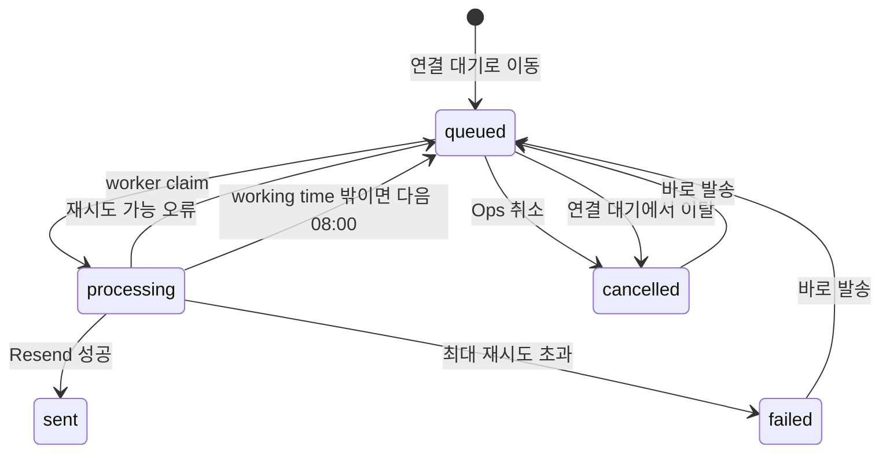

# Internal 연결 확정 안내 메일 구현 계획

작성일: 2026-07-27  
상태: 구현 완료, 배포 전 검증 완료

## 1. 목표

Ops가 `/ops/matching`에서 이미 추천을 수락한 talent를 `수락`에서
`연결 대기`로 옮기면, 해당 talent에게 연결 확정 안내 메일을 예약한다.

자동 발송은 다음 두 조건을 모두 만족해야 한다.

1. talent가 추천을 수락한 뒤 최소 24시간이 지났다.
2. KST 기준 working time인 오전 8시부터 오후 7시 사이이다.

`/ops`의 `TalentDetail` 전체 Progress에서는 이 메일의 예약, 발송 중,
발송 완료, 취소, 실패 상태를 확인할 수 있어야 한다. 예약 상태에서는
취소하거나 즉시 발송을 요청할 수 있어야 한다.

## 2. 결론

새 메일 전용 테이블이나 새 cron은 만들지 않는다.

기존 `contact_queue`와 계속 실행 중인
`harper-contact-queue-worker.service`를 재사용한다. 현재 큐에는 이미 다음
기능이 있다.

- `scheduled_at` 기반 due job 조회
- `queued`, `processing`, `sent`, `cancelled`, `failed` 상태
- `FOR UPDATE SKIP LOCKED` 기반 claim
- stale lock 복구와 재시도 횟수
- Resend idempotency key
- talent별 Reply-To alias 생성
- `talent_messages`, `career_email_messages` 발송 이력 기록

따라서 08:00, 12:00, 19:00 Vercel cron을 추가하는 것보다 정확한
`scheduled_at`을 저장하는 편이 더 단순하다. 기존 claim index도
`(status, scheduled_at, created_at)` 순서이므로 due row만 읽는다.

다만 worker 장애나 재시도로 due 시각보다 늦게 처리될 수 있으므로,
worker는 실제 발송 직전에 working time과 현재 연결 상태를 다시 검증해야
한다.

## 3. 기준 시각

### 3.1 수락 시각

기존 internal recommendation progress 정책과 같은 기준을 쓴다.

```text
accepted_at =
  talent_opportunity_recommendation.feedback_at
  ?? talent_opportunity_recommendation.created_at
```

수락 여부는 다음 중 하나로 판단한다.

```text
feedback in ('like', 'positive')
or saved_stage = 'accepted'
```

가능하면 `feedback_at`이 있는 최신 recommendation을 대상으로 삼고,
fallback은 데이터 정합성 보완용으로만 사용한다.

### 3.2 자동 발송 가능 시각

timezone은 talent의 locale과 무관하게 `Asia/Seoul`로 고정한다. 현재
talent별 timezone 필드가 없고 Ops working time 요구사항이기 때문이다.

```text
base_at = max(stage_changed_at, accepted_at + 24 hours)

if KST(base_at) < 08:00:
  scheduled_at = 같은 KST 날짜 08:00
else if KST(base_at) >= 19:00:
  scheduled_at = 다음 KST 날짜 08:00
else:
  scheduled_at = base_at
```

경계는 `08:00:00 <= time < 19:00:00`으로 정의한다. 19시부터는 다음 날
08:00으로 넘긴다.

예시:

| 수락 시각 | 연결 대기로 이동 | 자동 발송 시각 |
| --- | --- | --- |
| 월 10:00 | 월 12:00 | 화 10:00 |
| 월 18:30 | 월 20:00 | 화 18:30 |
| 월 20:00 | 화 10:00 | 수 08:00 |
| 월 09:00 | 화 07:00 | 화 08:00 |
| 월 09:00 | 화 11:00 | 화 11:00, 즉시 due |

주말과 공휴일은 현재 요구사항에 없으므로 별도로 제외하지 않는다.

## 4. 수동 `바로 발송`의 의미

자동 발송에는 24시간과 working time을 hard guard로 적용한다.

Ops의 `바로 발송`은 명시적인 수동 예외로 취급한다. 아직 24시간이
지나지 않았거나 working time 밖이라면 확인창에 아래 의미를 분명히
표시한 뒤 진행한다.

```text
자동 발송 조건보다 이른 시각입니다.
24시간/working time 조건을 무시하고 지금 발송할까요?
```

확인 후에는 queue를 `scheduled_at = now()`로 되살리고 payload에 다음
감사 정보를 저장한다.

```json
{
  "manualOverride": {
    "requestedAt": "...",
    "requestedBy": "ops-user@...",
    "bypassAcceptanceDelay": true,
    "bypassWorkingTime": true
  }
}
```

worker는 수동 override일 때 시간 조건만 건너뛴다. recommendation이
여전히 수락 상태인지, 현재 stage가 `내부:연결대기`인지, talent와 이메일이
유효한지는 수동 발송에서도 반드시 확인한다.

## 5. 데이터 모델

### 5.1 `contact_queue` 확장

새 type:

```text
internal_connection_confirmed
```

추가 column:

```text
role_id uuid null references company_roles(role_id)
recommendation_id uuid null references talent_opportunity_recommendation(id)
```

payload에는 조회 fallback과 감사용 snapshot만 저장한다.

```json
{
  "acceptedAt": "...",
  "companyName": "...",
  "createdBy": "ops-user@...",
  "locale": "ko",
  "roleName": "...",
  "source": "ops_matching_pending_connection",
  "talentName": "..."
}
```

상태/관계 조회는 JSON이 아니라 `role_id`, `recommendation_id` column을
사용한다.

### 5.2 unique index 변경

현재 `contact_queue_user_type_uidx(user_id, type)`는 한 talent가 서로
다른 회사 또는 포지션 두 개를 동시에 수락하는 경우를 막는다.

기존 lifecycle type에는 현재 singleton 정책을 유지하고, 새 type은
recommendation별로 하나만 존재하게 바꾼다.

```sql
drop index if exists public.contact_queue_user_type_uidx;

create unique index contact_queue_legacy_user_type_uidx
  on public.contact_queue(user_id, type)
  where type in (
    'career_signup_no_profile_submit',
    'career_profile_submitted_no_answer',
    'internal_recommendation_call_abandoned'
  );

create unique index contact_queue_type_recommendation_uidx
  on public.contact_queue(type, recommendation_id);
```

PostgreSQL unique index는 `NULL`을 여러 개 허용하므로 기존 row에는 영향이
없다. 새 type row는 `recommendation_id`를 필수로 넣는다.

`contact_queue_type_check`에는 새 type을 추가하고, role/recommendation
삭제 정책은 `ON DELETE CASCADE`로 둔다. user 삭제 시에는 기존
`contact_queue_user_id_fkey`가 이미 cascade한다.

### 5.3 메일 이력 type

`career_email_messages.mail_type_check`에 아래 값을 추가한다.

```text
internal_connection_confirmed
```

`onboarding`으로 기록하면 Ops 메일 탭과 이후 분석에서 의미가 섞이므로
별도 type을 쓴다.

## 6. 상태 전이



세부 규칙:

- `sent`인 recommendation은 stage를 다시 이동해도 재발송하지 않는다.
- Ops가 직접 취소한 row는 같은 recommendation에 대해 자동으로 되살리지
  않는다. 필요하면 `바로 발송`으로만 되살린다.
- stage 이탈 때문에 자동 취소된 row는 이후 다시 `연결 대기`로 이동했을
  때 새 자동 발송 시각으로 되살릴 수 있다.
- `processing`은 취소 버튼을 비활성화한다. due row는 짧게 processing을
  거치므로 예약 단계에서 취소하는 것이 기본 흐름이다.
- `failed`는 자동으로 계속 재시도하지 않고 Ops에서 오류를 확인한 뒤
  `바로 발송`으로 재시도한다.

## 7. 연결 대기 전환 시 enqueue

현재 stage write의 단일 진입점인
`setOpsMatchingReviewStage()`에 동기화 helper를 연결한다.

`stage === "pending_connection"`일 때:

1. 최신 recommendation을 읽는다.
2. recommendation이 수락 상태가 아니면 queue를 만들지 않는다. 기존
   stage 변경 동작 자체는 유지하고, worker도 발송 직전에 수락 상태를
   다시 확인한다.
3. `accepted_at`과 stage 변경 시각으로 `scheduled_at`을 계산한다.
4. `(type, recommendation_id)`로 idempotent insert 또는 update한다.
5. 기존 row가 `sent` 또는 Ops 수동 취소이면 그대로 둔다.
6. stage 이탈 자동 취소 row라면 다시 `queued`로 만들 수 있다.

다른 stage로 이동할 때:

1. 같은 `role_id`, `talent_id`, type의 미발송 row를 찾는다.
2. `queued` 또는 `failed`이면 `cancelled`로 바꾼다.
3. payload에 `cancellation.source = "stage_changed"`와 actor를 남긴다.
4. `sent`에는 손대지 않는다.

현재 stage write는 tag 삭제, tag insert, progress insert가 하나의 DB
transaction으로 묶여 있지 않다. 이번 변경에서는 queue sync를 항상
idempotent하게 실행하고, 같은 stage POST를 재시도해도 queue sync가 다시
실행되게 한다. 중간 실패가 보이면 API는 오류를 반환하며 Ops가 같은
이동을 재시도할 수 있다.

장기적으로 stage write 전체를 RPC transaction으로 옮길 수 있지만, 이번
메일 하나 때문에 기존 stage mutation 전체를 재작성하지 않는다.

## 8. worker 발송 직전 재검증

`email_reply/contact_queue.py`에서 새 type은 onboarding 완료 여부와
무관하게 처리해야 한다. 현재 함수 상단의 공통
`onboarding_done -> cancelled` 분기와 `_send_contact_email()`의 기본
onboarding guard를 새 type에 그대로 적용하면 모든 정상 talent 메일이
취소되므로 반드시 예외 처리한다.

발송 직전 순서:

1. queue status가 여전히 `processing`인지 확인한다.
2. payload의 수동 override가 없으면 현재 KST가 working time인지
   확인한다.
3. 자동 발송인데 working time 밖이면 다음 KST 08:00으로 reschedule한다.
4. recommendation row가 존재하고 여전히 수락 상태인지 확인한다.
5. 해당 talent/role의 최신 internal stage tag가 정확히
   `내부:연결대기`인지 확인한다.
6. queue의 `recommendation_id`, `role_id`, `user_id`가 recommendation과
   일치하는지 확인한다.
7. talent email, name, role name, company name, locale을 다시 읽는다.
8. 고정 template을 렌더링하고 Reply-To alias를 붙여 Resend로 보낸다.
9. queue를 `sent`로 바꾸고 `talent_messages`,
   `career_email_messages(mail_type = internal_connection_confirmed)`에
   기록한다.

자동 발송의 24시간 조건도 발송 직전에 다시 확인한다. DB 값 기준
`accepted_at + 24h`가 아직 미래라면 올바른 working time으로 다시
예약한다.

Resend idempotency key는 기존 규칙을 그대로 쓴다.

```text
contact-queue/{queue_id}
```

worker가 Resend 성공 뒤 DB 기록 전에 죽어도 같은 queue retry가 중복
메일을 만들지 않게 한다.

## 9. locale과 메일 template

locale은 기존 worker 정책을 그대로 재사용한다.

```text
talent_setting.setting_locale
?? talent_setting.preferred_locale
?? 'ko'
```

현재 `text_to_simple_email_html()`은 `**bold**`를 strong tag로 바꾸지
않는다. 따라서 이 메일은 plain text와 HTML을 별도로 만든다.

- text에는 별표 없이 같은 문구를 넣는다.
- HTML에서 `{회사명} · {포지션}`과 `진행이 어려우신가요?` 부분을
  `<strong>`으로 렌더링한다.
- 이름, 회사명, 포지션은 반드시 HTML escape한다.
- 기존 Harper delivery footer와 Reply-To를 유지한다.
- LLM은 사용하지 않는다.

### 9.1 한국어

제목:

```text
[Harper] {회사명} 연결이 확정되었습니다. 다음 단계를 안내드려요
```

본문:

```text
{이름}님, 안녕하세요. Harper입니다.

{회사명} · {포지션} 연결이 확정되었습니다. Harper가 회원님의 프로필과 추천 사유를 {회사명}에 직접 소개합니다.

회사가 검토 후 진행을 결정하면 초기 인터뷰(Initial Call) 일정 조율 메일이 도착합니다. 빠르면 오늘 중에 올 수도 있어요. 검토 결과에 따라 진행되지 않을 수도 있으며, 그 경우에도 결과를 알려드리고 더 잘 맞는 기회를 계속 찾아드릴게요.

메일이 도착하면 편한 시간으로 일정만 잡아주세요. 빠른 응답과 약속된 인터뷰 참석은 회사들이 Harper를 특별히 신뢰하는 이유이며, 회원님의 응답과 참여 이력은 이후 기회 매칭에도 반영됩니다.

혹시 진행이 어려우신가요?

Harper는 서로의 시간을 존중하는 멤버들의 커뮤니티입니다. 일정이 맞지 않거나, 다른 기회와 진행 중이시라면 지금 알려주세요. 취소 사실은 회사에 전달되지 않고, 회원님의 상황을 알수록 다음에 더 맞는 기회를 찾아드릴 수 있어요.

혹시 중단하시고 싶다면 현재 이메일로 답장해주세요. 별도 답장이 없으면 예정대로 진행됩니다.

궁금한 점이 있으면 이 메일에 바로 회신 주세요.

Harper 드림
```

### 9.2 English

Subject:

```text
[Harper] {Company} will reach out soon to schedule your interview
```

Body:

```text
Hi {Name},

Your connection with {Company} · {Position} is confirmed. Harper is personally introducing you to {Company}, sharing your profile and why you're a great fit.

Once {Company} reviews and decides to move forward, you'll receive an email from them to schedule your initial call, possibly as early as today. Depending on their review, this opportunity may not proceed. If so, we'll let you know and keep finding you a better fit.

When the email arrives, just pick a time that works for you. Prompt responses and showing up to confirmed interviews are why companies place special trust in Harper, and your participation history shapes your future matching.

Not able to proceed?

Harper is a community of members who respect each other's time. If the timing isn't right or you're in the middle of another process, please tell us now. The company never hears about it, and knowing your situation helps us find you a better fit next time.

If you'd like to stop, just reply to this email. Unless we hear from you, we'll proceed as planned.

Questions? Just reply to this email.

Harper
```

## 10. Internal API

새 endpoint:

```text
PATCH /api/internal/matching/connection-confirmation-email
```

request:

```json
{
  "action": "cancel | send_now",
  "queueId": "...",
  "talentId": "..."
}
```

공통:

- `requireInternalApiUser()`를 사용한다.
- type이 `internal_connection_confirmed`인지 확인한다.
- `queueId`와 `talentId`를 함께 scope한다.
- 현재 recommendation과 stage를 다시 검증한다.

`cancel`:

- `queued` 또는 `failed`만 취소한다.
- `cancelled_at`, actor, cancellation source를 저장한다.
- `processing` 또는 `sent`면 `409`를 반환한다.

`send_now`:

- `queued`, `failed`, `cancelled`을 `queued`로 변경한다.
- `scheduled_at = now()`, `attempts = 0`, lock/error/cancel field를
  초기화한다.
- manual override actor와 시각을 payload에 기록한다.
- `processing` 또는 `sent`면 `409`를 반환한다.

API가 직접 Resend를 호출하지는 않는다. worker의 Reply-To, idempotency,
메일 이력 기록 경로를 하나로 유지하기 위해 due 상태로만 만든다. 현재
worker poll interval이 1초이므로 사용자 관점에서는 즉시 발송이다.

## 11. `/ops` Progress UI

`fetchOpsMatchingProgress()`가 기존 `talent_progress`와 recommendation
timeline에 더해 새 type의 `contact_queue` row를 반환한다.

응답에는 별도 배열을 둔다.

```ts
type OpsMatchingConnectionConfirmationEmail = {
  attempts: number;
  cancelledAt: string | null;
  canCancel: boolean;
  canSendNow: boolean;
  companyName: string | null;
  createdAt: string;
  id: string;
  lastError: string | null;
  locale: "ko" | "en";
  recommendationId: string | null;
  roleId: string | null;
  roleName: string | null;
  scheduledAt: string;
  sentAt: string | null;
  status: "scheduled" | "sending" | "sent" | "cancelled" | "failed";
  talentId: string;
};
```

`TalentProgressFeed`는 이 배열을 기존 timeline에 합친다. queue가 미래
시각이라는 이유로 미래 event처럼 정렬하지 않고, `sent_at ?? created_at`
기준으로 정렬한다. 예약 시각은 card 안에서 별도로 강조한다.

표시:

| 상태 | 제목 | 보조 문구 | Action |
| --- | --- | --- | --- |
| queued | 연결 확정 안내 메일 예정 | `{scheduledAt} 발송 예정` | `취소`, `바로 발송` |
| processing | 연결 확정 안내 메일 발송 중 | `발송을 처리하고 있습니다` | 없음 |
| sent | 연결 확정 안내 메일 발송 | `{sentAt} 발송 완료` | 없음 |
| cancelled | 연결 확정 안내 메일 취소 | `{cancelledAt} 취소` | `바로 발송` |
| failed | 연결 확정 안내 메일 실패 | `lastError` 요약 | `취소`, `바로 발송` |

role context를 표시하는 전체 Progress에서는 기존과 같이
`{회사명} · {포지션}`을 card 상단에 표시한다.

mutation 성공 후 아래 query를 invalidate한다.

```text
opsMatching.progress(talentId, null)
opsMatching.progress(talentId, roleId)
```

`바로 발송` 후 `scheduled` 또는 `sending`인 동안에만 2초 간격으로
짧게 refetch하고, `sent`, `failed`, `cancelled`가 되면 polling을
중단한다.

## 12. 변경 파일

### `harper_beta`

- `supabase/migrations/<timestamp>_internal_connection_confirmation_email.sql`
  - contact queue column, constraint, index
  - career email mail type
- `src/types/database.types.ts`
  - migration 적용 후 type regenerate
- `src/lib/contactQueue.ts`
  - 새 queue type
- `src/lib/ops/connectionConfirmationEmail.ts`
  - enqueue/cancel/send-now, API response mapping
- `src/lib/ops/connectionConfirmationSchedule.ts`
  - KST schedule 계산
- `src/lib/ops/connectionConfirmationEmail.test.ts`
  - schedule 경계값 테스트
- `src/lib/ops/matching.ts`
  - stage 변경과 queue sync
  - Progress 조회에 email queue 포함
- `src/app/api/internal/matching/connection-confirmation-email/route.ts`
  - cancel/send-now
- `src/hooks/ops/useOpsMatching.ts`
  - action mutation과 invalidation
- `src/components/ops/career/TalentProgressFeed.tsx`
  - 상태 card와 action

### `harper_worker`

- `localized_copy.py`
  - 한국어/영어 제목과 고정 문구
- `email_reply/contact_queue.py`
  - 새 type routing
  - 발송 직전 시간/stage/recommendation 검증
  - 고정 text/HTML 발송과 mail type 기록
- `tests/test_contact_queue.py`
  - scheduling guard, locale, 취소, stage mismatch, idempotent send
- 필요 시 `tests/test_localized_copy.py`
  - exact subject/body 검증

`vercel.json`과 systemd service 파일은 바꾸지 않는다.

## 13. 테스트 시나리오

### schedule

- 수락 후 24시간이 working time 안이면 정확히 24시간 뒤
- 24시간 기준이 08:00 전이면 같은 날 08:00
- 24시간 기준이 19:00 후면 다음 날 08:00
- stage 변경 시 이미 24시간이 지났고 working time이면 즉시 due
- worker가 늦게 살아나 19:00 후에 due job을 claim하면 다음 날 08:00

### 대상 검증

- accepted recommendation만 enqueue
- `연결 대기`에서 벗어난 미발송 row 자동 취소
- 발송 직전 stage mismatch면 취소
- 발송 직전 recommendation이 rejected로 바뀌면 취소
- 한 talent가 서로 다른 recommendation 두 개를 가진 경우 row 두 개 생성
- 같은 recommendation에 대한 stage POST 재시도는 row 하나만 유지

### Ops action

- queued cancel
- queued send-now
- manually cancelled send-now
- failed send-now
- processing/sent cancel은 409
- sent send-now는 409
- 조건 밖 send-now 확인창과 audit payload

### 메일

- `setting_locale=ko` 한국어 제목/본문
- `setting_locale=en` 영어 제목/본문
- 이름/회사/포지션 HTML escape
- Reply-To alias 존재
- queue idempotency key 존재
- `career_email_messages.mail_type=internal_connection_confirmed`
- Progress가 queued에서 sent로 갱신

## 14. 배포 순서

1. DB migration을 먼저 적용한다.
2. `harper_worker`를 배포한다.
3. `harper_beta` API와 Ops UI를 배포한다.
4. staging 또는 제한된 실제 recommendation 하나로 예약 생성만 확인한다.
5. Ops에서 취소 후 상태 반영을 확인한다.
6. 같은 row를 `바로 발송`하여 Resend, Reply-To, 한국어/영어 copy,
   Progress와 Mail 탭 기록을 확인한다.
7. 정상 확인 뒤 전체 Ops stage 전환에 활성화한다.

worker가 새 type을 모르는 상태에서 web이 먼저 enqueue하면 worker가
`unsupported_type`으로 취소하므로 반드시 worker를 먼저 배포한다.

## 15. 확정 안내 메일 회신으로 진행 종료

- 발송 시 만든 고유 Reply-To alias를
  `career_email_messages.metadata.replyTo`에 저장하고, 같은 metadata에
  `recommendationId`, `roleId`, `contactQueueId`, 회사명, 포지션명을 함께
  저장한다.
- 메일의 회사·포지션 문구는
  `/career/history?historyTab=new&id={roleId}&source=connection_confirmed_email`
  링크로 렌더링한다. 링크의 roleId는 사용자 확인과 추적을 위한 보조
  정보이며, DB mutation 대상은 Reply-To alias로 찾은 원본 발신 메일의
  recommendationId로 고정한다.
- 해당 메일에 “중단해주세요”, “진행이 어렵습니다”, “stop”, “withdraw”
  등 명확한 중단 의사가 회신되면 email reply LLM은
  `update_internal_opportunity_response(action=stop_connection)`을 호출한다.
- tool의 recommendationId와 원본 발신 메일 metadata의 recommendationId가
  다르면 아무 상태도 바꾸지 않고 clarification으로 종료한다.
- 처리 시 recommendation의 `feedback`, `feedback_at`, `feedback_reason`은
  유지하고 `saved_stage=closed`로 전환한다. 즉 수락 이력인 `like`를
  `dislike`로 바꾸지 않으면서 제품의 기존 “진행 종료”와 같은 상태가 된다.
- 같은 transaction에서 기존 internal stage tag를
  `내부:프로세스중단`으로 교체하고, `talent_progress`에
  `source=email_reply`, `stopReason=candidate` 이력을 추가하며,
  contact queue payload에 `recipientResponse.status=stopped`를 기록하고,
  해당 recommendation을 기다리던 `internal_opportunity_request` call도
  completed로 닫는다.
- 이 mutation은
  `stop_internal_connection_from_confirmation_email(...)` security-definer
  함수에서 기존 `change_internal_talent_opportunity_decision(...,
  stop_process, ...)`를 호출해 한 transaction으로 처리한다. 따라서 제한된
  worker DB role에서도 Ops 제품 경로와 동일한 종료 규칙을 사용한다.
- 자동 답장은 대상 회사·포지션의 진행 종료 완료, 추가로 할 일 없음,
  회사에 취소 사실을 전달하지 않음, 더 잘 맞는 기회를 계속 찾는다는
  내용을 사용자의 저장 locale로 보낸다.
- Ops Progress의 발송 완료 카드에는 회신 처리 시각과 사유를 표시하고,
  별도의 `org_stage_change` 이벤트도 timeline에 남긴다.
