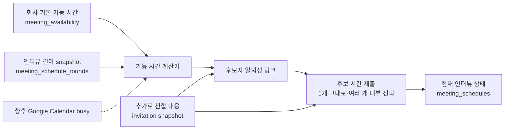
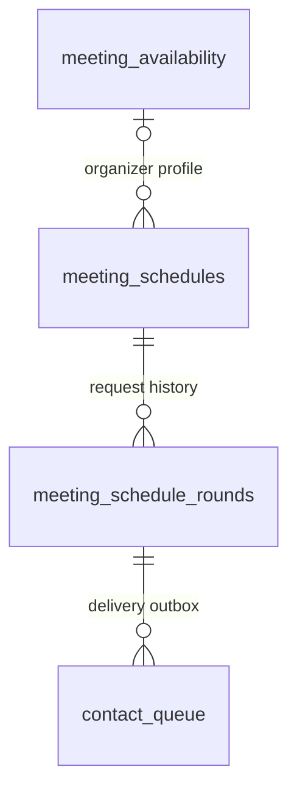

# 인터뷰 일정 조율 구현 설계

상태: 4차 로컬 구현 완료 (후보자 이메일·공개 선택 링크·자동 확정, 배포 전)

문서 기준: 2026-08-25

적용 범위: `/org`, company-side LLM, 회사 측 Slack, `/career`, 후보자 이메일, Harper worker

## 1. 최종 결론

이 기능은 테이블 개수를 최소화하는 것이 아니라, 서로 다른 수명 주기를 가진 세 가지 도메인을
정확히 분리해 구현한다.

| 구분 | 결정 |
| --- | --- |
| 새 테이블 | `meeting_availability`, `meeting_schedules`, `meeting_schedule_rounds` |
| 기존 테이블 재사용 | `contact_queue`, `talent_progress`, `company_messages` |
| company-side LLM 새 tool | `manage_interview_availability`, `manage_interview_schedule` |
| Career Harper 새 tool | 현재 추가하지 않음. 거절·재조율을 Career 대화에서 실행해야 할 때 별도 승인 후 검토 |
| 연결 수락 | 기존 연결 decision tool에 `schedule_interview` 방식만 추가 |
| 2차 이후 인터뷰 | 같은 `manage_interview_schedule`의 `create_schedule`, 새 tool 없음 |
| 회차별 날짜 제한 | v1에서 제거, 기본 availability만 slot 계산에 사용 |
| 회차별 추가 메시지 | round의 `additional_message`에 source·visibility·번역 snapshot |
| 후보자 시간 선택 | LLM이 아니라 `/meeting/{token}` 공개 페이지 |
| 여러 시간 중 최종 선택 | 제출 시 유효한 option이 2개 이상이면 내부 `gpt-5.6-luna` 1회 호출, 회사의 수동 선택 없음 |
| 회사 확정 알림 | 설정된 Slack 채널에 한 번, 개인별 DM·메일 없음 |
| Google Calendar·Meet | 향후 14일 busy sync, 확정 event·양측 초대·Meet 생성과 재시도 상태를 지원 |

1차에서 `meeting_availability`와 Integrations 편집 흐름을 만들었고, 2차에서 실제 연결 수락
대화가 쓰는 `meeting_schedules`와 `meeting_schedule_rounds` draft를 추가했다. 3차에서는 웹 연결
수락 modal의 `일정 조율`, 회사 Inbox의 일정 action, URL 기반 일정 상세, draft 수정과 availability
설정 후 복귀를 연결했다. 4차에서는 실제 slot 계산기, locale별 후보자 이메일 preview,
`contact_queue` 발송, `/meeting/{token}`의 signed slot 1~5개 제출, 한 시간 즉시 확정과 여러 시간의
`gpt-5.6-luna` 자동 선택을 로컬 코드로 연결했다.

현재 회사 측 구현은 availability가 있는 연결 수락만 schedule/round draft와 연결 상태를 저장한다.
organizer의 가능 시간이나 이메일이 없으면 후보자 상태와 draft를 먼저 만들지 않고 실제 가능 시간
설정 URL만 안내한다. 웹에서는 후보자·Role·추천 식별자만 navigation context로 전달해 설정을 닫은
뒤 같은 후보자의 연결 modal을 `일정 조율` 상태로 다시 연다. 서버는 이 식별자를 권한으로 믿지 않고
기존 후보자 상세와 연결 수락 API에서 다시 검증한다. 이미 저장된 draft의 일정 상세에서
availability를 수정하러 간 경우에는 `returnScheduleId`로 같은 상세를 다시 연다.
`preparing + draft_blocker`를 먼저 저장하는 흐름은 아직 넣지 않았다.

이번 구현은 Career Harper tool을 추가하거나 변경하지 않는다. 후보자 일정 선택과 제출은 공개
페이지와 application service가 직접 처리한다. 여러 option용 `gpt-5.6-luna` 호출도 회사나 후보자
LLM이 선택하는 tool이 아니라 public submit service 내부의 단일 Structured Output 호출이다.
향후 Career 대화에서 거절·재조율을 실제로 실행해야 한다면 새 tool이 필요한지 먼저 제품 결정을
받은 뒤 추가한다.

세 테이블의 책임은 다음처럼 겹치지 않는다.

- `meeting_availability`: 회사 구성원이 계속 수정하는 반복 가능 시간 profile
- `meeting_schedules`: 한 인터뷰의 현재 상태와 현재 확정 시간
- `meeting_schedule_rounds`: 후보자에게 보낸 각 요청과 재조율 회차의 immutable에 가까운 기록

후보 시간, 참석자, 날짜 예외, 발송 건마다 테이블을 더 만들지는 않는다. 작은 bounded collection은
JSONB로 두고, 이메일 outbox와 사용자 activity는 기존 테이블을 재사용한다.

### 1.1 왜 세 테이블인가

| 후보 구조 | 판단 | 이유 |
| --- | --- | --- |
| membership JSON + 회차별 `meeting_schedules` 한 테이블 | 사용하지 않음 | 핵심 membership에 일정 도메인이 결합되고, 현재 인터뷰 상태를 매번 여러 회차에서 파생해야 함 |
| availability 한 테이블 + schedule 안에 rounds JSON | 사용하지 않음 | token lookup, 회차별 idempotency, 동시 submit, 과거 링크 상태 조회가 어려움 |
| availability + stable schedule + round | 선택 | 현재 상태 조회와 회차 이력을 모두 단순하게 유지함 |
| interval, override, option, attendee, event를 모두 별도 테이블 | v1에서 사용하지 않음 | 현재 cardinality에 비해 join과 migration만 늘고 제품 요구가 없음 |

`meeting_schedules`는 안정적인 aggregate다. 재조율 중에도 같은 ID를 유지하고 현재 확정 시간,
active round, confirmed round를 직접 가리킨다. `meeting_schedule_rounds`가 과거 요청을 보존한다.
이 분리로 다음을 동시에 만족한다.

- 과거 링크가 왜 만료되거나 교체되었는지 정확히 표시할 수 있다.
- 과거에 회사가 승인한 메일 원문과 후보자가 제출한 시간을 보존한다.
- 재조율 정책에 따라 기존 확정 일정을 유지한 채 새 시간을 받을 수 있다.
- 재시도, 리마인드, 취소를 회차별 idempotency key로 안전하게 처리한다.



`company_talent_requests`는 일정의 원장으로 재사용하지 않는다. 이 테이블은 회사 질문과 이력서
요청, 후보자 답변 중계에 맞춰져 있다. 일정 회차와 확정 시간을 얹으면 기존 상태 의미가 깨진다.
Career pending action을 보여주는 방식과 `contact_queue` 발송 방식만 재사용한다.

### 1.2 v1에서 의도적으로 없애는 설정

시나리오별 사용 빈도에 비해 상태와 예외를 크게 늘리는 다음 기능은 v1에서 만들지 않는다.

- 회차별 `dateStart`, `dateEnd`
- 회차별 `allowedWindows`, `blockedWindows`
- 회사가 회차마다 정하는 후보자 응답 기한
- 만료된 같은 링크의 기한 연장

후보자에게 보여줄 시간은 언제나 organizer의 최신 기본 availability, 이번 인터뷰의 길이, 이미
확정된 Harper 일정으로만 계산한다. 링크 만료 시각은 서버가 일관된 규칙으로 계산하고, 만료 뒤
다시 요청하려면 새 round와 새 링크를 만든다.

대신 각 invitation에는 `추가로 전할 내용`을 선택적으로 저장하고 `candidate`, `internal`, `both` 중
공개 범위를 함께 둔다. `가능하면 가장 빠른 시간을 골라 주세요` 같은 선호는 후보자에게 보여줄
수도, Harper 자동 선택에만 사용할 수도 있다. 어느 경우에도 문구가 실제 slot을 숨기거나 제한하지는
않는다.

### 1.3 여러 시간은 받되 회사 선택 단계는 없앤다

후보자에게 한 시간만 고르게 하면 구현은 단순하지만, 실제 조율에서는 2~3개의 대안을 받는 편이
실패율을 낮춘다. 복잡도를 만드는 것은 여러 시간 자체가 아니라, 제출 뒤 회사를 다시 호출해 하나를
고르게 하는 두 번째 의사결정 단계다.

따라서 후보자는 1~5개를 제출할 수 있지만 결과는 항상 제출 요청 안에서 바로 한 시간으로 확정한다.

- 1개 제출: 서버가 그대로 확정하며 LLM을 부르지 않는다.
- 제출 시 유효한 option이 2개 이상: 내부 선택기에서 `gpt-5.6-luna`를 한 번 호출해 후보 시간의
  우선순위와 짧은 회사 안내 문구를 만든다.
- 후보자가 여러 option을 냈어도 유효한 것이 하나만 남으면 모델 없이 그 시간을 확정하고, 전부
  사라졌을 때만 다시 선택하게 한다.
- 선택 입력: 후보자가 제출한 시간, 제출 시점에 다시 계산한 organizer의 가능 시간, invitation에
  저장된 `additionalMessage`, 회사 timezone과 locale이다.
- 추가 메시지에 `가능하면 가장 빠르게` 같은 선호가 있으면 선택 기준으로 사용하고, 명시적 선호가
  없으면 가장 이른 유효 시간을 우선한다.
- 모델 결과는 제안일 뿐이다. 서버가 후보자가 실제 제출한 option인지, 아직 가능한지 다시 검증한
  뒤에만 확정한다.
- 모델 호출 실패, timeout, schema 오류에는 가장 이른 유효 option과 결정론적 locale 문구를
  사용한다. 모델 재시도 때문에 후보자 제출을 지연시키지 않는다.

이 결정으로 `submitted`, `awaiting_company`, `company_decision_due_at`, 회사 option picker, 회사
선택 reminder, 회사의 `confirm_time` action이 모두 사라진다. `candidate_options`는 후보자가 실제로
제시한 대안과 자동 선택 근거를 보존하기 위해 남긴다. 재조율의 `replacement_policy`는 현재 확정
시간을 유지할지 즉시 취소할지라는 별개의 실제 요구이므로 유지한다.

## 2. 제품 원칙

### 2.1 선택 가능한 시간의 원장은 기본 availability 하나다

- `매주 평일 10:00~19:00`: 계속 바뀔 수 있는 회사 구성원의 기본 가능 시간
- 특정 날짜를 설정 화면에서 직접 수정: 그 구성원의 모든 active link에 적용되는 날짜 예외
- 인터뷰 길이: 해당 schedule과 round snapshot에 고정되는 계산 입력
- `가능하면 가장 빠른 시간으로`: slot을 제한하지 않지만 여러 option 자동 선택에는 쓰이는
  invitation의 추가 메시지

후보자가 링크를 열 때 기본 availability의 최신 값을 읽는다. 따라서 회사가 반복 시간이나 날짜
예외를 바꾸면 아직 제출되지 않은 모든 링크의 선택지도 함께 바뀐다. 특정 후보자에게만 적용되는
날짜 범위나 제외 시간은 두지 않는다.

사용자가 `이번 인터뷰는 다음 3일만 보여줘`라고 말하면 지원되는 것처럼 저장하지 않는다. company-side
LLM은 v1에서 이를 hard constraint로 적용할 수 없다는 점을 설명하고, `가능하면 가장 빠른 시간을
골라 주세요`라는 추가 메시지를 보낼지 확인한다. 실제로 참석할 수 없는 날짜라면 기본 availability의
날짜 예외를 바꿔야 하며, 이 변경은 다른 active link에도 적용된다는 영향을 함께 보여준다.

### 2.2 외부 발송 전에는 결과를 정확히 보여준다

회사가 일정 조율 방식을 고르거나 자연어 한 문장만 말한 것만으로 후보자에게 메일을 보내지 않는다. 최종 확인 화면 또는
company-side LLM confirmation에는 아래 내용을 기본값 중심으로 함께 보여준다.

- 후보자와 역할
- organizer와 회사 참석자
- 인터뷰 제목과 시간 길이
- 저장된 가능 시간 요약, 향후 14일 범위와 이미 제외되는 일정
- 후보자 공개 추가 메시지가 있으면 실제 표시될 정확한 문구
- 내부 선택 메모가 있으면 후보자에게 보이지 않는다는 label과 자동 선택에 쓰일 정확한 문구
- organizer와 참석자 이메일
- 후보자 메일은 locale에 맞춰 Harper가 작성한다는 전달 방식

메일 전체 제목과 본문을 기본 대화에 펼치거나 회사가 각 field를 채우게 하지 않는다. 시스템이
작성하는 정형 invitation은 일정 상세의 `보낼 메일 보기`에서 필요할 때 확인·수정할 수 있게 하고,
기본 대화는 `이대로 물어볼까요?`라는 한 번의 확인으로 끝낸다. 가능 시간이 이미 있으면 연결 수락
modal도 같은 요약과 `연결을 수락하고 일정 요청 보내기` 한 번으로 연결 수락, 최초 회차 생성,
outbox 등록을 끝낸다.

가능 시간이 없을 때는 현재 구현도 선행 설정 경로에서 연결 상태나 draft를 바꾸지 않는다. 이미
웹 연결 modal에서 들어갔다면 설정을 저장·닫은 뒤 같은 후보자의 일정 조율 기본안으로 돌아오고,
이미 저장된 draft의 일정 상세는 `가능 시간 열기`로 설정 화면을 열고 저장·닫기 뒤 같은 상세로 돌아온다.
후보자 발송을 구현할 때도 availability 저장만으로 자동 발송하지 않고 별도의 외부 발송 확인을
받는다.

### 2.3 LLM은 해석과 문장 작성을 돕고 상태의 정본이 되지 않는다

- 자연어 시간을 정규화하고 실제 날짜·시간 preview를 만든다.
- 후보자 locale에 맞는 자연스러운 메일 초안을 쓴다.
- 서버가 읽은 상태만 설명한다.
- token 원문, 임의 timestamp, provider 발송 성공 여부를 만들어내지 않는다.
- write tool은 proposal/confirmation을 거친 뒤에만 실행한다.

날짜 계산, 가능 slot 계산, 충돌 검사, token 검증, 상태 전이는 모두 결정론적 서버 코드가 한다.

### 2.4 후보자에게는 한 번의 명확한 요청을 보낸다

최초 요청은 후보자 이메일 한 통으로 보낸다. 같은 본문을 Career 채팅에도 중복 발송하지 않는다.
Career Home과 composer에는 동일한 일정 링크를 가리키는 pending action만 표시한다.

리마인드, 확정, 취소, 재조율은 최초 요청과 다른 lifecycle 알림이므로 필요한 경우 별도로 보낼
수 있다. “메일 한 통”은 최초 요청을 중복 발송하지 않는다는 뜻이지 이후 상태 변경 알림까지
막는다는 뜻이 아니다.

### 2.5 모든 중간 상태에는 돌아갈 곳과 다음 행동이 있어야 한다

이 흐름은 설정 modal, 연결 수락, 외부 이메일, 공개 링크, Org Inbox, Career Home을 오간다.
따라서 각 화면을 개별적으로 완성하는 것보다 다음 연결 규칙을 지키는 것이 더 중요하다.

- 가능 시간 설정처럼 보조 작업으로 이동했다면 저장 후 시작한 schedule draft로 정확히 돌아간다.
- 후보자와 회사 중 지금 행동할 사람은 항상 한쪽뿐이며, 양쪽 화면에 서로 다른 요청을 동시에
  띄우지 않는다.
- 후보자에게 전달된 회차의 조건과 문구는 덮어쓰지 않는다. 변경은 새 회차를 만든다.
- 재조율할 때 기존 확정 시간을 유지할지 바로 취소할지는 명시적인 선택으로 기록한다.
- 실패, 만료, 직접 연락 전환도 끝 상태만 보여주지 않고 재시도, 새 요청, 직접 연락, 전체 종료 중
  실제 가능한 다음 행동을 보여준다.

사용자가 같은 설정을 두 번 하거나 이미 보낸 메일의 상태를 추측하게 만드는 경로는 완료된
흐름으로 보지 않는다.

## 3. 회사 기본 가능 시간 UX

### 3.1 진입점과 URL

`Organization > Integrations`에서 Slack section 아래에 큰 카드 버튼을 둔다.

- 제목: `인터뷰 가능 시간 설정`
- 미설정 설명: `후보자에게 제안할 수 있는 시간을 먼저 알려 주세요.`
- 설정 설명: `Asia/Seoul · 평일 10:00~19:00 외 2개 예외`
- 권한: 활성 Workspace 멤버는 자기 설정만 수정
- Owner/Admin: 다른 멤버의 설정 여부와 요약만 조회

카드가 여는 URL은 다음으로 통일한다.

```text
/org/settings?dialog=interview-availability&orgId={workspaceId}
```

company-side LLM이 답변에 넣는 `[스케줄]` 링크와 연결 수락 modal의 CTA도 같은 URL을 쓴다.
URL-driven dialog이므로 새로고침, deep link, 브라우저 뒤로가기가 동작해야 한다.

특정 schedule draft에서 이동한 경우에는 임의의 `returnTo` URL 대신 검증 가능한 schedule ID만
붙인다.

```text
/org/settings?dialog=interview-availability&orgId={workspaceId}&returnScheduleId={scheduleId}
```

`returnScheduleId`는 권한 경계가 아니다. 서버가 해당 schedule이 같은 Workspace의 것이고 현재
사용자가 관리할 수 있는지 다시 검증한다. 일반 Integrations 카드에서 열었을 때는 이 값이 없다.

### 3.2 기본 화면

desktop에서는 큰 2-column dialog, mobile에서는 full-screen dialog다.

- 왼쪽: 월 calendar와 날짜별 상태
- 오른쪽: 월~일 반복 시간 editor
- 왼쪽 하단: timezone
- dialog 하단: 저장 CTA

주간 editor는 요일별 최종 interval을 직접 보여준다.

```text
월요일   10:00 - 19:00   [삭제] [+ 추가]
화요일   10:00 - 19:00   [삭제] [+ 추가]
수요일   10:00 - 19:00   [삭제] [+ 추가]
목요일   10:00 - 19:00   [삭제] [+ 추가]
금요일   10:00 - 19:00   [삭제] [+ 추가]
토요일   가능한 시간 없음            [+ 추가]
일요일   가능한 시간 없음            [+ 추가]
```

`매일`, `평일`, `주말`은 별도 rule type이 아니라 빠른 입력 preset이다. 저장할 때 월~일 배열로
펼친다. preset을 적용할 때는 기존 시간에 `추가`할지 해당 요일의 시간을 `바꿀지` 명시한다.
요일별 enable toggle은 두지 않는다. 마지막 interval을 삭제하면 `가능한 시간 없음`이 되고, 같은
행의 `+ 추가`를 누르면 기본 interval 하나가 생긴다. 시간 select의 화살표는 resting state에서
숨기고 hover, focus 또는 열린 상태에서만 보여준다.

- 입력 select: 15분 단위
- 후보 slot 간격 기본값: 30분
- 한 요일에 여러 interval 허용
- 겹치거나 맞닿은 interval은 서버가 병합
- overnight interval은 v1에서 금지하고 자정 기준 두 날짜로 나눠 입력

### 3.3 특정 날짜 편집

날짜를 누르면 오른쪽 panel은 애니메이션 없이 해당 날짜 편집 화면으로 바로 바뀐다. 상단에는
`이 날짜에는 인터뷰가 어렵습니다` checkbox 하나만 둔다. 체크하면 그 날짜의 최종 interval을 빈
배열로 만들고, 체크를 풀면 직전 가능 시간 또는 해당 요일의 기본 시간을 복원한다.

아래에는 00:00부터 24:00까지 한 시간 단위 버튼을 세로 목록으로 보여준다. 선택된 버튼은 가능한
시간, 선택되지 않은 버튼은 불가능한 시간이며 버튼을 누르는 즉시 해당 한 시간을 최종 interval에
추가하거나 뺀다. 시간 목록만 독립적으로 scroll되고 화면을 열 때 08:00 블록이 목록 위쪽에 오도록
시작한다. 이 날짜의 결과가 주간 기본값과 다를 때만 checkbox 오른쪽에 작은 `초기화` action을
보여주며, 초기화하면 날짜 override를 삭제하고 다시 weekly rule을 따른다.

날짜별 빠른 편집은 한 시간 단위지만 저장 형태는 기존과 같은 15분 단위 interval 배열을 유지한다.
따라서 주간 editor에서 만든 15분 경계와 향후 slot 계산 정밀도는 잃지 않는다. 날짜 화면 전환과
dialog 닫기에는 motion animation을 사용하지 않는다.

날짜 예외는 “기본 시간에서 무엇을 빼라”는 명령 목록이 아니라 그 날짜의 최종 가능 interval을
저장한다.

- 평소 목요일 10:00~19:00, 특정 목요일 16:00 이후 불가 → `10:00~16:00`
- 하루 전체 불가 → 빈 배열
- 예외 삭제 → 다시 weekly rule 사용

이 구조가 add/subtract 우선순위 없이 가장 예측 가능하다.

### 3.4 calendar 표현

- 가능 시간이 있는 날짜: `primary-faded`
- 선택한 날짜: `primary`
- 가능한 시간: `primary-faded`, `text-neutral-primary`
- 불가능한 시간: `bg-bg-floating`, `text-neutral-disabled`
- 향후 외부 Calendar busy: `critical-faded`, `text-critical`, `Calendar 일정` label

색만으로 상태를 구분하지 않고 label, icon, disabled state를 함께 쓴다. raw `bg-white`,
`text-black/30` 대신 현재 semantic token을 사용한다.

달력 날짜 칸 크기는 dialog 호출부의 `--cell-size` CSS 변수로 조정한다. 현재 구현은 mobile
`1.95rem`, 넓은 화면 `2.3rem`을 사용하며 shared Calendar의 기본 padding을 추가하지 않는다.

### 3.5 저장 방식

dialog는 편집 중 local draft를 유지하고 저장할 때 전체 document를 한 번 PUT한다.

- 닫기 전 unsaved change 확인
- `version` 기반 optimistic concurrency
- 다른 창에서 먼저 저장했으면 최신 값을 다시 불러와 충돌 안내
- 저장 성공 전에는 company-side LLM이 새 시간이 반영됐다고 말하지 않음

`returnScheduleId`가 있으면 저장 성공 후 같은 draft의 slot을 다시 계산하고 다음 일정 상세 dialog로
이동한다.

```text
/org/inbox?dialog=interview-schedule&scheduleId={scheduleId}&orgId={workspaceId}
```

slot이 생겼으면 현재 slot 요약, 추가로 전할 내용, 메일 원문을 보여주고, 여전히 0개면 정확한 blocker와 수정 action을
보여준다. 어느 경우에도 저장만으로 후보자에게 자동 발송하지 않는다. 여러 draft가 같은 organizer의
설정을 기다리고 있어도 모두 자동 발송하지 않고, 돌아가기로 지정된 한 건만 연다. 나머지는 Org
Inbox에 그대로 남긴다.

설정한 organizer에게 후보자 관리 권한이 없으면 availability 저장까지만 완료하고 `가능 시간을
저장했어요. 일정 담당자가 요청을 이어갈 수 있어요`라고 안내한다. 일정 상세를 열거나 메일을
승인하는 권한까지 `returnScheduleId`로 부여하지 않는다. 원래 일정을 만들던 사용자의 Org Inbox
draft는 새 availability를 읽어 `메일 확인·발송 필요` 상태로 바뀐다.

과거 날짜 override는 운영상 필요가 없으므로 30일이 지난 항목을 저장 시 정리한다. 미래 예외와
최근 audit에 필요한 범위는 유지한다.

## 4. 연결 수락과 일정 요청 흐름

### 4.1 연결 방식 선택

회사가 후보자 연결을 수락할 때 첫 선택을 다음 두 가지로 바꾼다.

1. `Harper가 일정 조율`
2. `이메일로 바로 연결`

두 번째를 고르면 현재의 Email intro 흐름을 그대로 사용한다. `Direct contact`는 기존 정책대로
회사가 명시적으로 요청한 경우에만 제공한다. 이번 기능 때문에 연락처 직접 공유를 기본 메뉴로
노출하지 않는다.

일정 조율을 고르거나 채팅에서 `바로 미팅 잡아줘`라고 하면 다음 기본안을 즉시 만든다.

- organizer와 첫 참석자: 요청한 현재 사용자
- 제목: `{회사명} <> {후보자명} Intro`
- 인터뷰 길이: 60분
- 후보자 제안 범위: 향후 14일
- 방식: Google Meet
- 추가로 전할 내용: 사용자가 말한 경우에만 저장

이 값들을 하나씩 질문하지 않는다. 저장된 가능 시간과 이미 제외되는 Harper 미팅, organizer
이름·이메일까지 한 번에 요약하고 `이대로 물어볼까요?`라고 묻는다. 사용자가 `45분으로`,
`박수현님도 넣어줘`처럼 수정한 항목이 있을 때만 기본안을 갱신해 한 번 더 확인한다. 메일 제목과
본문은 후보자 locale에 맞춰 시스템이 작성하며 기본 확인에서 별도 입력을 요구하지 않는다.

v1의 후보 slot은 `organizer` 한 명의 availability를 기준으로 계산한다. 다른 회사 참석자는 미팅
participant snapshot이며 향후 Calendar invitation 수신자지만, v1의 weekly rule이나 외부 Calendar
availability 교집합 대상은 아니다. 다만
다른 참석자에게 이미 확정된 Harper 미팅은 알고 있는 hard busy이므로 slot에서 제외한다. 참석자를
추가할 때 `확정된 Harper 미팅은 확인하지만 다른 참석자의 개인 가능 시간은 아직 자동으로 확인하지
않아요`라고 명시한다. 여러 interviewer의 전체 availability 교집합은 Google Calendar 연동과 함께
별도 요구로 확장한다.

organizer dropdown에는 각 멤버의 `가능 시간 설정됨/미설정` 상태를 표시한다. 현재 사용자와 다른
organizer가 미설정이면 현재 사용자의 availability dialog를 대신 열지 않는다. `설정 링크 복사`와
`organizer 바꾸기`를 제공하고, 링크를 받은 organizer가 자기 가능 시간을 저장하도록 한다.

### 4.2 기본 가능 시간이 있을 때

서버가 현재 가능 시간을 계산해 실제로 slot이 있는지 먼저 확인한다. availability profile이
있다는 이유만으로 준비 완료로 보지 않는다.

company-side LLM의 안내 의미는 다음과 같다.

> 김하퍼님에게 바로 미팅 가능 시간을 물어볼게요. 이정민님이 설정한 가능 시간은 평일
> 08:00~19:00예요. 이미 확정된 Harper 미팅과 날짜별 예외를 제외하고, 향후 2주 안에서 가능한
> 시간을 고르게 할게요. 미팅은 60분, 제목은 `Wonderful Japan <> 김하퍼 Intro`, 참석자는
> 이정민님(recruiter@example.com), 방식은 Google Meet으로 둘게요. 이대로 물어볼까요? 더 추가할
> 참석자나 바꿀 시간이 있다면 말씀해 주세요.

웹에서도 같은 기본안을 먼저 보여주며 메일 원문은 필요할 때 펼쳐서 본다. 최종 확인 후에만 연결
수락과 최초 invitation queue 등록이 함께 실행된다.

확인 직후에는 `보냈어요`라고 단정하지 않고 일정 상세 dialog에서 실제 delivery 상태를 보여준다.

- outbox 생성 직후: `김하퍼님에게 일정 선택 요청을 전달하기 시작했어요.`
- provider 발송 성공 후: `김하퍼님에게 일정 선택 요청을 보냈어요.`
- 발송 실패: 연결 수락은 유지됐는지, 메일이 전달되지 않았는지와 `다시 보내기` action을 함께 표시

사용자는 여기서 `일정 요청 보기` 또는 `Pipeline으로 돌아가기`를 선택할 수 있다.

### 4.3 기본 가능 시간이 없거나 계산 결과가 0개일 때 — 후속 일정 상세 단계

schedule을 `preparing`, 첫 round를 `draft`로 만들고 `draft_blocker`를 저장한다. 메일은 생성하거나
보내지 않는다.

> 아직 이정민님의 가능한 일정을 받지 못했어요. [스케줄]에서 미팅 가능한 시간을 설정해
> 주세요. 범위를 넉넉히 주실수록 조율하기 쉬워요. 또는 “매주 평일 오전 8시부터 오후 7시,
> 이번 주 목·금은 오후 4시 이후에는 어려워”처럼 말씀해 주시면 반복 시간과 날짜 예외가 영향을
> 주는 현재 일정 링크를 먼저 보여드린 뒤 설정할게요.

설정이 끝나도 자동 발송하지 않는다. 대기 중인 schedule로 돌아와 현재 slot 요약, 추가로 전할
내용, 메일 원문을 확인한다.

availability document는 있지만 min notice, booking horizon, 다른 확정 인터뷰 때문에 slot이 0개인
경우도 같은 대기 상태로 처리하되 이유를 구체적으로 표시한다. blocker에 따라 primary action도
달라야 한다.

| blocker | 먼저 보여줄 action | 보조 action |
| --- | --- | --- |
| 현재 사용자의 기본 가능 시간 미설정 | `가능 시간 설정하기` | `organizer 바꾸기` |
| 다른 organizer의 기본 가능 시간 미설정 | `설정 링크 복사` | `organizer 바꾸기` |
| 기본 가능 시간에서 현재 slot 없음 | `가능 시간 설정 바꾸기` | `organizer 바꾸기` |
| 후보자 이메일 없음 | `연락처 확인하기` | 일정 draft로 돌아가기 |

가능 시간 설정에서 왔다면 새 schedule을 만들지 않고 기존 draft와 round를 그대로 갱신한다.

### 4.4 추가로 전할 내용

회차별 날짜 제한 대신 invitation마다 선택적인 메시지 하나와 공개 범위를 둔다.

- field label: `추가로 전할 내용 (선택)`
- 공개 범위: `후보자에게 표시`, `Harper만 참고`, `둘 다`
- helper: `선택 가능한 시간을 제한하지 않고, 후보자 안내나 Harper의 자동 선택 선호로 사용해요.`
- 예: `가능하면 가장 빠른 시간을 골라 주세요.`
- 예: `일정이 바뀔 수 있어 가능하신 시간을 2~3개 골라 주시면 좋아요.`
- 예: `대표님과의 첫 미팅으로 약 45분 정도 진행할 예정이에요.`

회사가 직접 입력하거나 company-side LLM이 자연어에서 초안을 만들 수 있다. 모든 공개 범위의
메시지는 자동 option selector 입력에 들어간다. `후보자에게 표시`와 `둘 다`만 이메일·선택 페이지에
나가며, 후보자 locale이 다르면 LLM이 의미를 바꾸지 않는 번역 초안을 만든다. `Harper만 참고`는
번역하거나 외부 template에 넣지 않는다. preview에는 공개 범위, 후보자에게 보일 문구, 내부에만
남을 문구를 명확히 구분한다. source, visibility, 필요한 경우 승인된 localized text를
round의 `additional_message`에 snapshot으로 저장한다.

`다음 3일 안에서만 골라 주세요`처럼 hard constraint를 요구하면 추가 메시지로 바꿔 적용했다고
말하지 않는다. v1에서는 특정 invitation만의 날짜 제한을 지원하지 않으며, 후보자에게는 기본
availability의 booking horizon 안에 있는 최신 slot이 모두 보인다고 설명한다. 사용자가 동의하면
`가능하면 가장 빠른 시간을 골라 주세요`처럼 soft preference로 저장하되 후보자에게도 보여줄지
Harper만 참고할지는 회사가 고른 visibility를 그대로 따른다.

최종 발송 transaction은 최신 slot을 다시 계산한다. preview와 slot 개수가 조금 달라져도 추가
확인을 요구하지 않고, 0개가 됐을 때만 발송을 막고 4.3의 blocker 흐름으로 돌아간다. slot이 1개뿐인
경우에는 preview에서 선택 폭이 좁다는 점을 알리되 발송은 허용한다. retry는 같은 승인 문구를
재사용하고 LLM을 다시 부르지 않는다.

### 4.5 회사 일정 상세와 재진입

Org Inbox의 일정 action, 회사 측 Slack CTA, company-side LLM의 일정 링크는 다음 URL-driven
dialog를 공통 목적지로 쓴다.

```text
/org/inbox?dialog=interview-schedule&scheduleId={scheduleId}&orgId={workspaceId}
```

이 dialog가 회사가 조율 중인 한 인터뷰의 정본 UI다.

- 상단: 후보자, Role, 인터뷰 제목과 길이, organizer
- 첫 영역: 지금 필요한 한 가지 행동과 기한
- 현재 확정 시간이 있으면 유지 여부와 함께 고정 표시
- 후보자에게 보낸 회차, delivery 상태, 후보자가 제출한 시간
- `일정 다시 요청하기`, `Harper 조율 그만두기`, `인터뷰 진행 종료`는 보조 action으로 분리
- 과거 회차는 접힌 history로 표시하고 수정할 수 없음

후보자가 여러 시간을 제출했다면 제출한 option과 자동 선택된 한 시간, 선택에 반영된 추가 메시지를
읽기 전용으로 보여준다. 회사가 option을 다시 고르는 control은 없다. 변경을 원하면 `일정 다시
요청하기`로 재조율을 시작한다. URL을 새로고침하거나 Slack에서 다시 열어도 같은 확정 상태를
읽어야 하며, 완료된 action을 다시 실행하지 않는다.

## 5. 후보자 이메일과 시간 선택 페이지

### 5.1 이메일 생성

locale 우선순위는 다음과 같다.

1. `talent_setting.setting_locale`
2. `talent_setting.preferred_locale`
3. `ko`

LLM은 제목과 자연스러운 본문을 만들고 서버는 사실 필드를 고정한다.

- 후보자 이름
- 회사명과 역할명
- organizer 이름
- 인터뷰 예상 시간
- 일정 선택 URL
- 서버가 계산한 선택 기한
- 표시 timezone 안내
- visibility가 `candidate` 또는 `both`인 승인된 추가 메시지, 있으면 포함

메일에는 다음 의미가 들어가야 한다.

- 어떤 회사의 누가 후보자를 만나고 싶어 한다는 사실
- 링크에서 가능한 시간을 고를 수 있다는 안내
- 가능하면 2~3개를 선택해 달라는 낮은 압력의 요청
- 어렵거나 진행하지 않으려면 답장하거나 Career Harper에 말할 수 있다는 안내
- 후보자 공개로 승인된 추가 메시지가 있으면 표준 본문과 구분된 짧은 영역

회사명, URL, 후보자 이름이 누락되거나 사실과 충돌하면 결정론적 locale template으로 fallback한다.
승인된 subject/body template/locale/recipient는 round에 snapshot으로 저장하며 worker 재시도
때 LLM을 다시 부르지 않는다. body의 일정 URL 자리에는 `{{scheduling_url}}` placeholder를
사용하고 실제 opaque URL은 발송 직전에 결정론적으로 넣는다. 회사 preview에는 이 자리에 안전한
일정 선택 링크가 들어간다는 사실을 보여준다.

visibility가 `candidate` 또는 `both`인 추가 메시지는 표준 이메일 본문 안에서 LLM이 다시 요약하지
않는다. 서버가 승인된 localized text를 별도 `추가 요청` 영역으로 넣어 이메일과 후보자 선택
페이지에 같은 문구를 표시한다. `internal`이면 외부 template과 공개 API에 넣지 않고 영역 자체를
생략한다.

### 5.2 공개 URL과 token

```text
/meeting/{opaqueToken}
```

- server secret, 회차 ID, key version에서 HMAC으로 만든 256-bit pseudorandom token
- DB에는 SHA-256 hash와 secret이 아닌 key version만 저장
- token 원문에 talent ID, email, schedule ID를 포함하지 않음
- public route rate limit
- GET만으로 token을 소비하지 않음
- 성공한 POST 이후 같은 회차에는 다시 제출할 수 없음

HMAC 방식은 token을 DB에 평문이나 queue payload로 저장하지 않으면서 worker가 같은 회차의 URL을
재현하게 해 준다. secret rotation 때는 만료되지 않은 token의 이전 key version을 유지한다.

### 5.3 후보자 화면

desktop은 왼쪽 calendar, 오른쪽 시간 목록이고 mobile은 날짜 아래 시간 목록이다.
화면 언어는 invitation에 저장된 locale을 기본으로 하고, 사용자가 바꾸면 그 선택을 이 회차의
표시 설정으로만 저장한다.

- 실제 slot이 하나 이상 있는 날짜만 활성화
- 회사명, Role, 인터뷰 제목, 예상 시간 길이, 선택 기한을 먼저 표시
- 후보자 공개로 승인된 추가 메시지가 있으면 calendar 위에 같은 locale로 표시
- `10:00~11:00`처럼 종료 시간까지 표시
- 상단에서 timezone 확인·변경
- 1~5개 선택 가능
- 2~3개 선택 권장, 한 개만 선택해도 제출 가능
- 몇 개를 내든 제출 뒤 Harper가 가능한 시간 중 하나를 바로 확정한다는 점을 제출 전에 설명
- 선택 순위 입력은 v1에서 요구하지 않음
- 제출 직전 선택한 날짜·시간과 timezone을 다시 요약

첫 open 때 browser timezone을 저장하되 locale이나 IP만으로 timezone을 추정하지 않는다.
timezone 변경은 표시만 바꾸며 같은 순간을 다른 시각으로 저장하지 않는다.

GET 응답은 raw UTC timestamp를 제출 값으로 쓰게 하지 않고 짧게 유효한 signed `slotId`를
반환한다. `slotId`는 회차 ID, start/end, availability version, 만료 시각을 HMAC으로 묶는다.
POST는 `slotId`만 받고 모든 서명이 유효하고 현재 round에 속하는지 먼저 검증한다. 서명이 잘못됐거나
다른 round의 ID가 섞였으면 전체 요청을 거절한다. 그 뒤 최신 가능 시간을 다시 계산해 제출 option을
`valid`와 `stale`로 나눈다. availability version이 달라졌다는 이유만으로 실패시키지 않으며, 유효한
option이 하나라도 남으면 그 안에서 확정을 계속한다. 전부 stale일 때만 409와 최신 slot을 반환한다.

GET 시 현재 slot이 0개면 빈 calendar를 그대로 보여주지 않는다. 서버는 active round가 실제로
선택 불가능한지 idempotent하게 재확인해 만료 처리하고 회사 action을 만든다. 후보자에게는 `현재
선택할 수 있는 시간이 없어 회사에서 새 시간을 확인할 예정이에요`라는 상태를 보여준다. GET만으로
정상 token을 소비하거나 후보자의 의향을 기록하는 것은 아니다.

### 5.4 제출 이후 링크 상태

round를 보존하므로 과거 token도 안전하게 상태를 설명할 수 있다.

- 제출 후 확정: 이미 사용된 링크임을 알리고 제출한 후보 시간, 최종 확정 날짜·시간과 timezone 표시
- 기한 만료: `일정 선택 기간이 지났어요.`
- 새 회차로 교체: 기존 링크가 바뀌었다는 사실만 표시하고 새 token은 노출하지 않음
- Harper 조율 종료: 회사가 직접 연락할 예정이라는 안내
- 취소: 취소 주체를 과도하게 노출하지 않는 종료 안내
- token이 존재하지 않음: 일반적인 유효하지 않은 링크 안내

새 token을 과거 링크 응답이나 LLM prompt에 노출하지 않는다.

### 5.5 제출과 확정

- 1개를 제출했고 여전히 유효하면 그대로 확정한다.
- 여러 개를 제출했지만 1차 검사에서 하나만 유효하면 모델 없이 그 option을 확정한다.
- 1차 검사에서 유효한 option이 2~5개면 `gpt-5.6-luna`를 한 번 호출해 우선순위와 회사 안내 message
  template을 받는다. 모델에는 유효한 opaque option ID와 서버가 만든 정확한 시간 문자열만 보낸다.
- 최종 transaction은 회사 participant lock 아래에서 제출 option을 다시 `valid`와 `stale`로 나눈다.
  하나 이상 남으면 모델 ranking에서 현재 유효한 첫 option을 확정하고, ranking이 쓸 수 없으면 가장
  이른 유효 option으로 fallback한다. 전부 stale일 때만 아무 상태도 저장하지 않고 409를 반환한다.
- 모델 실패나 잘못된 출력에도 가장 이른 유효 option을 확정하고 결정론적 안내 문구를 사용한다.
- 후보자에게는 같은 POST 응답에서 제출한 시간과 최종 확정 시간을 보여준다. 회사가 다시 고르는
  대기 화면이나 pending action은 없다.
- 제출 option 일부가 stale이었다면 `선택하신 시간 중 일부는 방금 예약할 수 없게 되어, 나머지
  가능 시간 중 이 일정으로 확정했어요`라고 알리되 내부 미팅 정보나 충돌 상대는 노출하지 않는다.

확정되면 후보자에게 확정 이메일을 보내고 Org 일정 상세 상태를 갱신한다. 회사 push 알림은 설정된
Slack channel에 한 번만 게시하며 요청자·organizer·attendee에게 별도 DM이나 개별 메일을 보내지
않는다. 한 option이면 결정론적 문구를, 여러 option이면 선택기가 만든 짧은 안내를 사실값 치환 뒤
회사측 일정 대화의 마지막 확정 message로 저장하고, 그 뒤에 일반적인 중복 확정 message를 추가하지
않는다. 예를 들면
`이토님이 8월 28일 10시, 13시, 16시를 가능하다고 하셨고, 그중 10시가 가장 적절해 해당 시간으로
미팅을 잡아두었어요. 변경을 원하시면 말씀해 주세요.`이다. 후보자 이메일에는 `접속 방법은 회사에서
별도로 안내할 예정이에요`라는 현재 범위를
명시한다. 이번 범위에서는 Calendar event, Google Meet, 기타 미팅 링크를 만들지 않는다. 따라서
메일과 LLM은 `미팅 링크를 보냈다`고 말하면 안 된다. 회사 일정 상세에도 `Harper가 미팅 접속
방법을 만들거나 보내지는 않았어요`라는 limitation을 표시하되, 완료할 수 없는 별도 pending
action을 만들지는 않는다.

## 6. 데이터 모델



### 6.1 `meeting_availability`

회사 구성원 한 명의 반복 가능한 기본 가능 시간 profile이다. membership과 수명 주기가 비슷해
보여도 별도 테이블로 둔다. 일정 규칙은 독립적으로 versioning해야 하고, 일반 membership 조회에
큰 JSON과 일정용 update contention을 섞지 않는 편이 낫다. 향후 여러 profile이 실제로 필요해져도
membership schema를 다시 뜯지 않고 확장할 수 있다.

| 컬럼 | 타입 | 용도 |
| --- | --- | --- |
| `company_workspace_id` | uuid | Workspace FK, composite PK |
| `company_user_id` | uuid | `company_users.user_id` FK, composite PK |
| `timezone` | text | IANA timezone |
| `weekly_rules` | jsonb | ISO weekday별 interval |
| `date_overrides` | jsonb | 특정 local date의 최종 interval |
| `version` | bigint | optimistic concurrency |
| `updated_at` | timestamptz | 수정 시각 |

v1은 `(company_workspace_id, company_user_id)`를 PK로 사용해 기본 profile 하나만 허용한다. 초안에서
검토했던 `id`, `settings`, `created_at` 세 컬럼은 제거한다.

- 별도 `id`: profile을 참조할 때도 Workspace와 organizer가 이미 필요하므로 의미 없는 surrogate
  key가 된다.
- `settings`: 인터뷰 길이는 개별 schedule에 속한다. slot step, notice, horizon, buffer는 해당
  제품 설정 UI가 생기기 전까지 application default로 유지한다.
- `created_at`: 이 profile에서 제품이 읽는 시각은 마지막 변경 시각뿐이므로 `updated_at`만 둔다.

```json
{
  "weeklyRules": {
    "1": [{ "start": "10:00", "end": "19:00" }],
    "2": [{ "start": "10:00", "end": "19:00" }],
    "3": [{ "start": "10:00", "end": "19:00" }],
    "4": [{ "start": "10:00", "end": "19:00" }],
    "5": [{ "start": "10:00", "end": "19:00" }],
    "6": [{ "start": "19:00", "end": "21:00" }],
    "7": [{ "start": "19:00", "end": "21:00" }]
  },
  "dateOverrides": {
    "2026-08-27": [],
    "2026-08-28": [{ "start": "10:00", "end": "16:00" }]
  }
}
```

위 예시는 두 JSON 컬럼을 한 번에 표현한 것이다. 요일은 ISO weekday `1=월요일`, `7=일요일`로
고정한다. `date_overrides`에 날짜가 있으면 weekly 결과를 완전히 교체하고 빈 배열은 하루 전체
불가능을 뜻한다.

서버는 interval 정렬, 병합, 범위와 IANA timezone을 검증한 뒤 profile 전체를
optimistic update한다. DB CHECK는 JSON object와 필수 상위 구조 정도만 검사한다.

### 6.2 `meeting_schedules`

한 인터뷰의 안정적인 aggregate다. 최초 요청부터 여러 번의 재조율과 최종 취소까지 ID가 바뀌지
않는다. Org/Career 조회와 LLM context는 먼저 이 테이블을 읽고, 상세 이력이 필요할 때 round를
읽는다.

이름과 상태는 Calendar provider에 종속되지 않지만, v1부터 임의의 모든 미팅을 담는 polymorphic
테이블로 만들지는 않는다. 이번 구현에서는 Role과 talent를 필수 관계로 검증한다. 실제로 다른
미팅 종류가 생기면 그때 `meeting_kind`와 관계 범위를 확장한다.

| 컬럼 | 타입 | 용도 |
| --- | --- | --- |
| `id` | uuid | schedule PK, 외부 UI가 참조하는 안정적인 ID |
| `company_workspace_id` | uuid | Workspace FK |
| `role_id` | uuid | Role FK |
| `recommendation_id` | uuid | 최초 연결 대상 recommendation FK |
| `talent_id` | uuid | 후보자 FK |
| `organizer_company_user_id` | uuid | 가능 시간과 충돌 검사의 기준 |
| `status` | text | 인터뷰 전체의 현재 상태 |
| `title` | text | 기본 `{회사명} <> {후보자명} Intro` |
| `duration_minutes` | integer | 이번 인터뷰 길이 |
| `company_attendees` | jsonb | 회사 참석자 snapshot |
| `active_round_id` | uuid | 현재 응답을 기다리는 round, 없으면 nullable |
| `idempotency_key` | text | 연결 수락 double execution 방지 |
| `version` | bigint | optimistic concurrency |
| `updated_at` | timestamptz | 수정 시각 |

2차 draft 구현에서는 위 컬럼만 만든다. 검토했던 `created_by_company_user_id`, `created_at`,
`resolution`, `confirmed_at` 네 컬럼은 뺐다. 생성자는 첫 round의 source message로 확인할 수 있고,
아직 취소·확정 기능이 없는 단계에서 빈 lifecycle 컬럼을 미리 둘 필요가 없기 때문이다.
`confirmed_round_id`, `confirmed_start_at`, `confirmed_end_at`은 후보자 제출 transaction을 구현할 때
함께 추가한다.

`company_attendees`는 v1에서 보통 1~5명인 bounded snapshot이므로 JSONB가 적절하다. organizer는
충돌 검사와 권한 조회에 사용하므로 별도 FK 컬럼으로 둔다. 저장할 때 organizer도 snapshot에 정확히
한 번 포함하되, 바쁜 시간 조회는 이 중복 표현에 의존하지 않고 아래 두 조건의 합집합으로 정의한다.

- 다른 confirmed schedule의 `organizer_company_user_id`가 현재 organizer와 같음
- 다른 confirmed schedule의 `company_attendees`에 현재 organizer의 `companyUserId`가 포함됨

즉 현재 organizer가 다른 Harper 미팅의 주최자가 아니라 단순 참석자여도 그 시간은 바쁘다. 이
조회는 기존 schedule row의 scalar FK와 JSONB snapshot을 함께 사용하므로 새 attendee 테이블이
필요하지 않다. 같은 검사는 현재 schedule의 다른 `company_attendees`에도 반복해 이미 확정된 Harper
미팅과의 겹침을 막는다. 다만 attendee의 weekly availability profile까지 교집합으로 계산하는 것은
아니다. 반복 가능 시간의 기준은 계속 organizer 한 명이고, 이미 확정된 Harper busy만 모든 회사
참석자에게 hard blocker로 적용한다.

```json
[
  {
    "companyUserId": "...",
    "name": "이정민",
    "email": "recruiter@example.com",
    "role": "organizer"
  }
]
```

schedule status는 다음 값만 애플리케이션에서 사용한다.

| 상태 | 의미 |
| --- | --- |
| `preparing` | 가능 시간, 후보자 이메일 또는 메일 승인을 기다림 |
| `inviting` | invitation이 queue 또는 processing 상태 |
| `awaiting_talent` | 후보자에게 전달 완료, 시간 선택 대기 |
| `confirmed` | 현재 시간이 확정됨 |
| `cancelled` | 한쪽의 명시적 종료 결정으로 전체 인터뷰 종료 |
| `expired` | active 요청이 만료됐고 유지할 기존 확정 시간도 없음 |
| `handed_off` | Harper 일정 조율만 종료하고 회사의 직접 연락으로 전환 |
| `failed` | 발송 또는 상태 복구에 운영 확인 필요 |

후속 후보자 제출 단계에서는 `confirmed_round_id`, `confirmed_start_at`, `confirmed_end_at`을
추가한다. `active_round_id`와 `confirmed_round_id`를 분리하는 이유는 재조율 때문이다. 어느 쪽이 변경을
요청했든 기존 시간을 유지하면서 대체 시간을 찾는 정책이라면 `confirmed_round_id`와 확정 시간을
남긴 채 새 `active_round_id`를 둘 수 있다. 새 시간이 확정되면 한 transaction에서 confirmed
pointer와 시간을 교체한다.

pointer와 status invariant는 다음과 같다.

| schedule 상태 | `active_round_id` | `confirmed_round_id` |
| --- | --- | --- |
| `preparing`, `inviting`, `awaiting_talent` | 있음 | 기존 시간 유지형 재조율이면 값이 있을 수 있음 |
| `confirmed` | 없음 | 있음 |
| `cancelled`, `expired`, `handed_off` | 없음 | 없음 |
| `failed` | 복구할 round가 있으면 있음 | 기존 확정 일정을 유지하는 실패라면 있을 수 있음 |

schedule status만 바꾸거나 pointer만 바꾸는 경로는 허용하지 않는다. 둘은 항상 같은 transaction에서
갱신한다.

busy 계산에서 `confirmed meeting`은 schedule status 문자열이 아니라 `confirmed_round_id`,
`confirmed_start_at`, `confirmed_end_at`이 모두 있는 schedule을 뜻한다. 유지형 재조율 중에는
status가 `awaiting_talent`여도 기존 확정 시간이 남으므로 `status='confirmed'`만 조회하면 실제 바쁜
시간을 놓친다.

재조율 여부는 별도 raw status가 아니라 `active_round.round_number > 1`로 판단한다. 재조율 중
유지되는 기존 확정 시간은 `confirmed_round_id`로 함께 보여준다. `handed_off`는 인터뷰 거절이
아니므로 회사 pipeline을 종료하지 않는다.

### 6.3 `meeting_schedule_rounds`

후보자에게 시간을 요청한 한 회차의 인터뷰 설정, 추가 메시지, 링크, 메일, 제출 결과와 자동 선택
근거를 보존한다. 후보자 POST가 성공하면 `awaiting_talent`에서 바로 `selected`가 된다. `selected`
이후에는 supersede 또는 전체 취소 전이와 delivery timestamp 같은 운영 필드 외에는 수정하지 않는다.

| 컬럼 | 타입 | 용도 |
| --- | --- | --- |
| `id` | uuid | round PK, token과 queue의 기준 |
| `schedule_id` | uuid | `meeting_schedules` FK |
| `round_number` | integer | schedule 안에서 1부터 증가 |
| `status` | text | 이 요청 회차의 상태 |
| `draft_blocker` | text | availability missing, no slots, email missing 등 |
| `meeting_config_snapshot` | jsonb | 발송 회차의 제목, 길이, organizer, 참석자 |
| `additional_message` | jsonb | source text와 공개 범위 |
| `source_company_message_id` | bigint | 이 회차를 시작한 company message |
| `version` | bigint | optimistic concurrency |
| `updated_at` | timestamptz | 수정 시각 |

2차 draft 구현에서는 위 컬럼만 만든다. 검토했던 `created_at`, `initiated_by`, `invitation`,
`token_hash` 네 컬럼은 뺐다. actor는 source company message로 찾고, invitation과 token은 실제 공개
링크·메일 발송 단계에서 필요한 필드와 함께 추가한다. 후보자 option, 자동 선택, 확정 시각,
재조율 closure도 해당 lifecycle을 구현하기 전에는 만들지 않는다.

round status는 다음과 같다.

| 상태 | 의미 |
| --- | --- |
| `draft` | 아직 보내지 않았고 blocker 또는 회사 승인이 남음 |
| `invite_queued` | 승인된 invitation outbox 생성 |
| `awaiting_talent` | provider 발송 성공, 후보자 선택 대기 |
| `selected` | 후보자 제출과 자동 선택이 완료되어 이 round의 한 시간이 확정됨 |
| `superseded` | 새 round 또는 새 확정 결과로 교체 |
| `cancelled` | 전체 취소나 round 철회 |
| `expired` | 서버가 계산한 token 기한 종료 |
| `failed` | 해당 round의 delivery 복구 필요 |

`draft_blocker`는 `availability_missing`, `no_slots`, `candidate_email_missing`,
`invitation_approval_required`처럼 UI와 pending action이 다음 행동을 결정할 수 있는 값만
애플리케이션에서 사용한다. DB에 과도한 CHECK를 두어 새로운 정상 사유를 막지는 않는다.

`replacement_policy`는 누가 재조율을 시작했는지가 아니라 기존 확정 시간이 실제로 유효한지에
따라 정한다.

- `keep_until_replaced`: 기존 일정은 유효하며 더 나은 시간을 찾는다. 새 회차가 만료되거나
  철회되면 기존 확정 상태로 돌아간다.
- `cancel_immediately`: 기존 시간에는 참석할 수 없다. 명시적 확인과 필요한 상대방 안내 뒤 기존
  confirmed pointer를 바로 비운다.

`바꾸고 싶다`만으로는 어느 쪽인지 추측하지 않는다. `그 시간에는 참석할 수 없다`처럼 현재 일정이
불가능하다는 뜻이 분명하면 취소 영향을 preview하고 확인받는다.

schedule의 title, duration, attendee는 다음 재조율에서 바뀔 수 있으므로 invitation 승인 순간
`meeting_config_snapshot`에 고정한다. 후보자 링크의 slot 길이와 과거 회차 표시는 이 snapshot을
사용한다. 반면 organizer의 기본 availability는 제출 전까지 최신 profile을 읽는다.

```json
{
  "recipient": "candidate@example.com",
  "locale": "ja",
  "subjectTemplate": "...",
  "bodyTemplate": "... {{scheduling_url}} ...",
  "additionalMessage": {
    "sourceText": "가능하면 가장 빠른 시간을 골라 주세요.",
    "sourceLocale": "ko",
    "visibility": "both",
    "deliveredText": "可能であれば、最も早い時間をお選びください。",
    "deliveredLocale": "ja"
  },
  "approvedByCompanyUserId": "...",
  "approvedAt": "2026-08-25T03:00:00.000Z"
}
```

추가 메시지는 선택값이다. 없으면 `additionalMessage`를 null로 둔다. `visibility`는 `candidate`,
`internal`, `both`만 허용한다. application layer에서 앞뒤 공백 제거, plain text, 길이 상한을
검증하고 HTML과 임의 link를 안전하게 escape한다. `internal`이면 `deliveredText`와
`deliveredLocale`은 null이고 selector에는 source text만 전달한다. 후보자 공개 범위에서 번역을
사용하지 않으면 source와 delivered text가 같다. 회사가 승인한 뒤에는 같은 round에서 수정하지
않고, 바꾸어 다시 보내려면 새 round를 만든다.

`candidate_options`는 공개 submit API만 저장한다. 모델은 이 배열의 opaque `optionId`만 순위로
반환할 수 있고 임의 timestamp를 만들 수 없다. `auto_selection`은 모델 호출을 상태의 정본으로
만들기 위한 컬럼이 아니라, 왜 어느 option을 골랐고 어떤 회사 문구를 만들었는지 재현하기 위한
작은 audit snapshot이다.

```json
[
  {
    "optionId": "o_01",
    "startAt": "2026-08-26T01:00:00.000Z",
    "endAt": "2026-08-26T02:00:00.000Z",
    "validAtConfirmation": true,
    "staleReason": null
  },
  {
    "optionId": "o_02",
    "startAt": "2026-08-26T05:00:00.000Z",
    "endAt": "2026-08-26T06:00:00.000Z",
    "validAtConfirmation": false,
    "staleReason": "participant_busy"
  }
]
```

```json
{
  "method": "llm",
  "model": "gpt-5.6-luna",
  "promptVersion": "meeting-option-selector-v1",
  "rankedOptionIds": ["o_01", "o_02"],
  "validOptionIdsAtCommit": ["o_01"],
  "discardedOptionIds": ["o_02"],
  "selectedOptionId": "o_01",
  "selectionReason": "추가 메시지의 빠른 일정 선호를 반영",
  "companyMessageTemplate": "{{candidate_name}}님이 {{candidate_options}}를 가능하다고 하셨고, 그중 {{selected_time}}이 가장 적절해 해당 시간으로 미팅을 잡아두었어요. 변경을 원하시면 말씀해 주세요.",
  "fallbackReason": null
}
```

모델 출력은 Structured Outputs로 위 허용 field만 받는다. 안내 문구의 이름·후보 시간 목록·선택
시간은 모델 자유 텍스트로 확정하지 않고 필수 placeholder를 서버가 authoritative 값으로 치환한다.
알 수 없는 placeholder, 제출하지 않은 option ID, 비어 있는 ranking은 모델 결과로 사용하지 않고
fallback한다. 정확히 1개 제출은 `method=single_option`, 여러 개 중 하나만 유효하면
`method=only_valid_option`으로 저장하고 모델을 호출하지 않는다. 모델 실패 시 `method=fallback`과
실패 범주만 저장하며 provider 원문 오류나 prompt 전문은 보존하지 않는다. candidate option에는
제출 원문을 모두 보존하되 최종 transaction 기준 유효성과 제한된 stale reason을 함께 기록한다.

### 6.4 FK 생성 순서와 index

`meeting_schedules.active_round_id`와 `confirmed_round_id`는 round와 순환 참조한다. migration은
availability → schedule → round 순으로 테이블을 만든 뒤 schedule의 두 pointer FK를 추가한다.
schedule은 먼저 pointer 없이 insert하고 같은 transaction에서 round를 만든 뒤 pointer를 갱신한다.
pointer는 `(schedule.id, round_id)`에서 `(round.meeting_schedule_id, round.id)`로 이어지는 composite
FK를 사용해 다른 schedule의 round를 가리킬 수 없게 한다.
`previous_round_id`도 `(meeting_schedule_id, previous_round_id)` composite FK로 같은 schedule 안의
round만 가리키게 한다.

필수 제약과 index는 다음과 같다.

- availability primary key `(company_workspace_id, company_user_id)`
- schedule unique `idempotency_key`
- round unique `(meeting_schedule_id, round_number)`
- round unique `(meeting_schedule_id, id)` for pointer composite FK
- round unique `idempotency_key`
- round unique `token_hash` where not null
- contact queue unique `delivery_key` where not null
- 한 schedule에 non-terminal round는 partial unique index로 최대 하나
- `(company_workspace_id, status, updated_at)` schedule index
- `(talent_id, status, updated_at)` schedule index
- `(organizer_company_user_id, confirmed_start_at)` partial schedule index where confirmed time is not null
- `GIN (company_attendees jsonb_path_ops)` partial schedule index where confirmed time is not null
- `(meeting_schedule_id, round_number desc)` round index
- `(status, token_expires_at)` partial round index for awaiting-talent rounds

schedule과 round는 제품에서 hard delete하지 않는다. round FK는 `ON DELETE RESTRICT`를 기본으로
하고, 개인정보 삭제는 기존 계정 삭제 정책에 맞춘 별도 redaction 경로로 처리한다.

### 6.5 JSONB와 별도 테이블의 경계

다음은 cardinality가 작고 항상 부모와 함께 읽는 snapshot이므로 JSONB로 둔다.

- weekly interval, date override
- 회사 참석자 1~5명
- round의 meeting config snapshot
- 후보자가 제출한 option 1~5개
- 승인된 이메일 원문과 추가 메시지 source/visibility/localized text
- 전체 취소·직접 연락 전환 metadata
- round 종료 metadata

다음은 별도 테이블로 나누지 않는다.

- 참석자: 여러 interviewer의 availability 교집합과 RSVP가 필요해질 때 검토
- 후보 option: option별 독립 상태나 analytics가 필요해질 때 검토
- schedule event: round와 기존 `talent_progress`가 현재 요구를 충족
- 이메일 outbox: 기존 `contact_queue` 재사용

이렇게 하면 세 개의 실제 도메인만 정규화하고, 현재 요구에 없는 calendar table 더미는 만들지
않는다.

## 7. 기존 테이블 재사용

### 7.1 `contact_queue`

nullable 컬럼 두 개만 추가한다.

| 컬럼 | 용도 |
| --- | --- |
| `meeting_schedule_round_id` | 정확한 `meeting_schedule_rounds` FK |
| `delivery_key` | 회차와 발송 목적별 unique idempotency key |

새 queue `type`은 `meeting_schedule_delivery` 하나다. 목적은 `payload.deliveryKind`로 구분한다.

```text
invitation
reminder
candidate_confirmation
candidate_cancellation
candidate_handoff_notice
reschedule_invitation
company_schedule_notice
```

예시는 `meeting:{roundId}:invitation`, `meeting:{roundId}:reminder`다. queue payload에는 정확한
channel, from, to, subject, body template을 snapshot한다. worker가 회차 ID와 key version으로
동일한 opaque URL을 메모리에서 재현해 template에 넣는다. worker retry는 같은 원문과 URL을
재사용하며 token 평문을 DB나 log에 남기지 않는다.

최초 `invitation`의 channel은 email only다. Career에는 같은 본문을 보내지 않고 pending action만
노출한다.

`invite_queued → awaiting_talent` 전이는 API 응답이 아니라 worker가 provider 성공을 확인한 뒤
수행한다. `company_schedule_notice`는 Workspace에 설정된 Slack channel 하나만 대상으로 하며
`meeting:{roundId}:company_schedule_notice:slack`처럼 회차당 하나의 delivery key를 쓴다. 요청자,
organizer, attendee별 DM·메일 job은 만들지 않는다. Slack이 연결되지 않았으면 Org 일정 상세와
canonical company message만 갱신하고 별도 push 알림은 생략한다.

### 7.2 `talent_progress`

일정 상태의 정본이나 유일한 history로 사용하지 않는다. schedule과 round가 상세 원장이다.
`talent_progress(kind=meeting_schedule_event)`에는 후보자·회사 타임라인과 LLM context에 필요한
짧은 milestone만 남긴다.

- `meetingScheduleId`, `roundId`, `roundNumber`
- `eventType`
- actor와 surface
- 회사나 후보자에게 이미 전달된 결과
- 확정·취소 시간 snapshot

주요 event는 created, invitation sent, candidate submitted, confirmed, reschedule requested,
reschedule withdrawn, handed off, cancelled, expired 정도다.

### 7.3 `company_messages`

web과 Slack에서 회사가 본 질문, preview, confirmation, 실행 결과를 기존 방식대로 기록한다.
schedule row에는 전체 대화를 복사하지 않고 `source_company_message_id`만 둔다.

한 option이 제출되면 결정론적 확정 문구를, 여러 유효 option이 제출되면 사실값을 치환한
`companyMessageTemplate`을 canonical `company_messages`에 한 번 append한다. 이 message ID를 Slack
delivery가 참조하고 retry도 같은 원문을 사용한다. 확정 API 응답이나 company-side LLM 후처리가
별도의 일반 확정 답변을 append하지 않아, 이 안내가 해당 확정 흐름에서 회사가 보는 마지막
message가 된다. Org Inbox는 확정 상태를 조회해 보여주는 화면이지 별도 알림 recipient가 아니다.

## 8. 가능 시간 계산기

모든 surface가 한 domain module을 사용한다.

```text
src/lib/meetings/availability.ts
```

입력은 다음과 같다.

- organizer의 `meeting_availability` profile
- active round의 `meeting_config_snapshot`과 duration
- 현재 schedule의 organizer와 `company_attendees`에서 중복 제거한 회사 participant ID 목록
- 각 participant에 대해 다른 confirmed-time `meeting_schedules`의 organizer이거나
  `company_attendees`에 포함된 시간
- 현재 schedule ID
- 유지형 재조율이라면 현재 schedule에 남아 있는 기존 확정 시간
- 현재 시각
- 선택적인 `externalBusyIntervals`

계산 순서는 다음과 같다.

1. organizer timezone의 local date마다 weekly rule을 펼친다.
2. date override가 있으면 그 날짜의 weekly 결과를 교체한다.
3. min notice와 booking horizon 밖을 뺀다.
4. buffer를 포함해 회사 participant 중 한 명이라도 organizer 또는 참석자인 다른 schedule의 현재
   확정 시간과 겹치는 시간을 뺀다.
5. 유지형 재조율이면 같은 schedule에 남아 있는 기존 확정 시간도 뺀다.
6. 외부 busy interval이 있으면 뺀다.
7. duration과 slot step으로 candidate slot을 만든다.
8. UTC start/end로 변환하고 가장 빠른 시간부터 정렬한다.

내부 busy 조회는 현재 schedule을 제외하고 다음 조건으로 한다.

```sql
confirmed_round_id IS NOT NULL
AND confirmed_start_at IS NOT NULL
AND confirmed_end_at IS NOT NULL
AND id <> :current_schedule_id
AND (
  organizer_company_user_id = :participant_company_user_id
  OR company_attendees @> '[{"companyUserId":"<participant-company-user-id>"}]'
)
```

실제 query는 Workspace와 조회 시간 범위도 함께 제한하고, 위 조건을 현재 schedule의 각 회사
participant ID에 적용한다. organizer 조건은 confirmed time이 있는 row에 둔 partial B-tree index,
attendee 조건은 같은 predicate의 partial JSONB GIN index를 사용하고 schedule ID와 interval로
중복을 제거한다. 따라서 현재 사용자가 다른 Harper 미팅의 참석자로만 들어가도 후보자 calendar에서
그 시간은 즉시 선택 불가가 된다. 이 busy interval을 availability override에 복사하지 않으므로
미팅 취소·변경도 다음 계산에 바로 반영된다.

round의 `additional_message`는 slot 계산기 입력은 아니어서 선택 가능한 시간을 숨기지 않는다.
다만 후보자가 2개 이상을 제출한 뒤 실행되는 자동 선택기의 선호 입력에는 포함한다. 예를 들어
`가능하면 가장 빠른 시간으로`는 후보자가 볼 수 있는 slot을 줄이지 않지만, 제출한 option 중 가장
이른 시간을 우선하는 근거가 된다.

weekly rule은 local time, candidate option과 confirmed time은 UTC다. timezone 변환을 UI마다
직접 구현하지 않는다. DST에서 존재하지 않는 local time은 제외한다. 동일 local time이 두 번
생기는 날은 offset을 명확히 표시할 수 없으면 ambiguous slot을 보수적으로 제외한다.

후보자가 링크를 열 때, 제출 전 1차 검사, 최종 확정 transaction에서 모두 같은 계산기를 부른다.

## 9. 상태 전이와 transaction

### 9.1 최초 요청

```text
연결 대기
→ 회사가 Harper 일정 조율 선택
→ schedule=preparing, round=draft
→ slot 없음: round.draft_blocker 저장
→ 회사가 정확한 메일 승인: schedule=inviting, round=invite_queued
→ worker 발송 성공: schedule=awaiting_talent, round=awaiting_talent
```

가능 시간이 이미 있으면 연결 수락, 첫 회차 insert, invitation outbox insert를 한 transaction으로
처리한다. 중간 실패 시 후보자 stage만 바뀌거나 메일만 나가는 상태가 생기면 안 된다.

### 9.2 후보자 제출

```text
schedule=awaiting_talent, round=awaiting_talent
→ 최신 계산에서 유효 option 0개: 409, 상태 변경 없음
→ 유효 option 1개: 서버가 해당 option 선택
→ 유효 option 2~5개: gpt-5.6-luna 1회로 option 우선순위와 회사 안내 template 생성
→ 최종 transaction에서 남아 있는 유효 option 재검사
→ round=selected, schedule=confirmed
```

외부 모델 호출 중 DB transaction이나 participant lock을 잡고 있지 않는다. application service가
token, signed slot과 현재 가능 시간을 먼저 읽기 검증한 뒤, option이 2개 이상일 때만 Responses
API의 `gpt-5.6-luna`, 낮은 reasoning effort, Structured Outputs로 한 번 호출한다. 여기서 option
개수는 후보자가 누른 원래 개수가 아니라 1차 검사에 남은 유효 option 개수다. 이 모델은 공식적으로
Responses API와 Structured Outputs를 지원한다. 모델은 tool을 호출하거나 상태를 쓰지 않고 다음
값만 반환한다.

이 호출은 짧은 timeout을 둔 동기식 한 번으로 끝낸다. 별도 `selecting` status, model job table,
worker retry를 만들지 않으며 timeout이면 같은 POST 안에서 fallback해 후보자가 중간 상태를 보지
않게 한다.

- 제출된 opaque option ID의 전체 우선순위
- 짧은 선택 이유
- `candidate_name`, `candidate_options`, `selected_time` 필수 placeholder가 있는 회사 안내 template

visibility와 관계없이 추가 메시지 source text를 입력하고, 후보자 공개본이 있으면 승인된 번역본도
함께 넣는다. 여기에 회사 locale, organizer timezone, 1차 검사에서 유효한 option, 그 option들이 속한
organizer의 가능 window와 서버가 렌더링한 정확한 시간 문자열을 입력한다. 후보자의 개인정보는 이
결정을 위해 필요한 이름과 일정 맥락만 보내고 이메일·
token은 보내지 않는다. 모델이 추가 메시지에 없는 새로운 제약을
추론하거나 제출되지 않은 시간을 선택하지 못하게 한다. 구현 기준 모델 ID는
[`gpt-5.6-luna`](https://developers.openai.com/api/docs/models/gpt-5.6-luna)이며 환경 설정으로 이름을
바꿀 수 있게 하되 v1 기본값은 이 ID로 고정한다.

그 뒤 최종 transaction이 schedule, active round, availability profile을 잠그고 token, expiry,
status, signed slot을 다시 검증한다. organizer와 `company_attendees`의 company user ID를 중복 제거해
UUID 순서로 정렬하고, 각 ID의 advisory lock을 항상 같은 순서로 얻는다. 그 아래에서 각 participant가
organizer 또는 참석자인 다른 confirmed-time schedule과 Google Calendar adapter의 fresh busy를 다시 읽는다.
제출 option을 다시 `valid`와 `stale`로 나눈 뒤 하나라도 valid이면 ranking의 첫 valid option을
선택한다. 모델 호출 뒤 1순위가 사라졌어도 2순위가 남았다면 그대로 계속한다. ranking을 사용할 수
없으면 가장 이른 valid option으로 fallback한다. valid option이 0개일 때만 409로 전체 요청을
되돌리고 최신 slot을 반환한다. 확정 시 다음을 한 transaction에 저장한다.

- `candidate_options`, selected fields, `auto_selection`
- schedule의 confirmed 시간과 `confirmed_round_id`, 비워진 `active_round_id`
- 후보자 확정 이메일 outbox와 설정된 채널용 Slack notice outbox 한 건
- 최종 회사 안내를 담은 canonical `company_messages` row와 progress event

회사 안내 template의 placeholder는 transaction에서 확정된 authoritative 값으로 치환한다. 이
message를 회사측 일정 대화의 가장 마지막 확정 안내로 append하고, API나 company-side LLM이 뒤에
`일정이 확정됐어요` 같은 일반 message를 하나 더 쓰지 않는다. Slack은 같은 의미를 surface에 맞게
렌더링할 뿐 별도 판단을 하지 않는다. 알림 발송은 worker가 수행하며 실패해도 확정 상태는 유지한다.

### 9.3 회사가 재조율

1. `기존 일정은 가능하지만 다른 시간을 선호`하는지 `기존 시간에는 참석 불가`인지 구분한다.
2. 최신 기본 availability의 slot을 먼저 계산하고, 기존 일정 처리 방식, 새 추가 메시지와 후보자
   안내 메일을 preview한다.
3. `keep_until_replaced`면 기존 confirmed pointer를 유지한 채 새 active round를 만든다.
4. `cancel_immediately`면 회사가 영향을 명시적으로 확인한 뒤 기존 confirmed round를 `cancelled`로
   바꾸고 confirmed pointer와 시간을 비운다.
5. 유효한 slot이 있으면 새 invitation을 queue하고, 없으면 draft blocker와 회사 action을 남긴다.
6. 새 시간이 확정되면 기존 시간을 유지하던 경우에만 이전 confirmed round를 `superseded`로 바꾸고
   pointer를 새 round로 교체한다.

slot이 0개인 상태에서 기존 시간을 바로 취소하려면 `기존 일정 취소하기`를 별도로 확인받는다.
단순히 재조율 화면을 열거나 추가 메시지를 편집한 것만으로 확정 일정을 없애지 않는다. 기존 시간이
유효한 경우에는 대체 시간이 정해질 때까지 유지하는 방식을 기본 제안한다.

아직 시간이 확정되기 전 회사가 추가 메시지나 메일을 바꾸어 다시 보내려는 경우에는 기존 active
round만 `superseded`로 만들고 새 round를 만든다. 이 경우에는 지울 confirmed pointer가 없다.

### 9.4 후보자가 재조율

1. `시간이 안 맞는다`와 `인터뷰를 진행하지 않겠다`를 구분한다.
2. 현재 시간도 가능하지만 변경을 선호하면 `keep_until_replaced`, 참석할 수 없다고 명시하면
   `cancel_immediately`를 제안하고 현재 일정 취소 영향을 확인한다.
3. 새 active round를 만들고 유효한 slot이 있으면 현재 회사 availability로 새 링크를 보낸다.
4. 회사에는 변경 요청, 기존 일정의 유지·취소 여부, 지금 필요한 행동을 함께 알린다.
5. `keep_until_replaced`에서 새 시간이 확정되면 한 transaction에서 이전 confirmed round를
   `superseded`로 바꾸고 schedule의 confirmed pointer와 시간을 새 round로 교체한다.

유지형 새 회차가 만료되거나 후보자가 변경 요청을 철회하면 active pointer를 비우고 schedule을
다시 `confirmed`로 바꾼다. 기존 confirmed round와 시간은 그대로 남는다. 즉시 취소형 회차가
만료되면 되살릴 기존 일정은 없으므로 schedule은 `expired`가 되고 회사에 availability 확인 action을
남긴다.
후보자가 직접 요청한 후속 링크이므로 회사에 별도 발송 승인을 다시 요구하지 않는다. locale별
결정론적 재조율 template을 사용하고 회사에는 실행 결과를 알린다.

후보자가 이미 시작된 재조율을 철회하면 `cancel_reschedule` action으로 active round만 취소한다.
기존 일정을 유지 중이면 원래 확정 상태로 돌아가고, 기존 시간을 이미 취소했다면 철회만으로 그
시간을 자동 복구하지 않는다.

후보자 제출은 한 transaction에서 바로 확정되므로 `회사 선택 전 철회`라는 중간 상태는 없다.
제출 뒤 변경 요청은 확정 뒤 재조율로 처리하고, 사용한 링크를 다시 열어 option을 수정하게 하지
않는다.

새 round는 기존 meeting config를 사용하고 요청 시점의 최신 기본 availability와 booking horizon을
읽는다. 이전 round의 추가 메시지는 자동 복사하지 않는다. 회사가 시작한 재조율이면 새 메시지를
입력하거나 이전 문구를 다시 사용할지 preview에서 고르고, 후보자가 시작한 재조율이면 locale별
결정론적 재조율 안내만 사용한다. 계산 결과 slot이 없으면 회사에 기본 availability를 확인해 달라는
action을 만든다.

### 9.5 transaction command

LLM tool과 DB command는 다른 개념이다. 서로 다른 lock과 권한 경계를 하나의 거대한 RPC로 합치지
않고 다음 세 transaction command로 나눈다.

#### `start_meeting_schedule_v1`

- application service가 회차 UUID와 HMAC token hash를 미리 계산
- 후보자와 Role, 현재 stage, `creationMode` 재검사
- 최초 `connection_acceptance`이면 연결 수락을 함께 처리
- 이후 `connected_candidate`이면 이미 연결됐는지 확인하고 pipeline stage는 바꾸지 않음
- schedule과 첫 round idempotent insert
- active round pointer 설정
- 가능하면 승인된 invitation outbox insert
- progress milestone insert

#### `submit_meeting_schedule_options_v1`

- token, expiry, active round, schedule 상태 검증
- schedule, round, availability profile row lock
- signed slot과 최신 가능 시간 재검증
- 제출 option을 valid/stale로 분류하고 하나 이상 valid일 때만 진행
- organizer와 모든 회사 attendee의 confirmed Harper busy 재검증
- participant advisory lock을 중복 제거한 UUID 순서로 획득해 교차 schedule deadlock 방지
- application service가 전달한 ranking과 message template schema 검증
- 최종 valid가 1개면 그대로, 여러 개면 ranking의 첫 valid option 선택
- 모델 오류 때 application service가 만든 가장 이른 option fallback만 허용
- stale을 포함한 후보 option audit, schedule 확정, 후보자 confirmation outbox, Slack notice 한 건과
  마지막 회사 message 저장

공개 token 요청에만 필요한 보안과 lock이 있으므로 일반 action RPC에 억지로 합치지 않는다.

#### `change_meeting_schedule_v1`

`action`으로 다음을 처리한다.

- `approve_invitation`
- `cancel_schedule`
- `hand_off_schedule`
- `start_company_reschedule`
- `start_talent_reschedule`
- `cancel_reschedule`
- `expire_round`
- `retry_delivery`

action마다 허용 status, expected version, actor 권한을 검증한다. 외부 provider 호출은 transaction
안에서 하지 않고 outbox까지만 만든다. 후보 option 확정은 공개 submit command만 수행하며 회사용
수동 확정 action은 없다.

새 회차가 필요한 action도 application service가 새 UUID와 token hash를 미리 계산해 command에
전달한다. transaction이 실패하면 외부 발송이 없으므로 계산된 token은 노출되지 않는다.

availability 전체 저장은 단일 row optimistic update이므로 별도 RPC를 만들지 않는다.

## 10. API

### 10.1 회사 인증 API

#### `/api/org/meeting-availability`

- `GET`: 현재 사용자의 availability
- `PUT`: expected version과 normalized 전체 document 저장

#### `/api/org/meeting-schedules`

- `GET`: Workspace의 active, confirmed schedule 목록 또는 한 schedule 조회
- `POST`: 이미 연결된 후보자의 2차 이후 인터뷰 schedule draft 생성

최초 인터뷰를 연결 수락과 함께 만들 때는 기존 connection decision transaction을 통과한다. 이후
인터뷰는 연결 상태를 다시 바꾸지 않고 이 POST가 같은 domain service를 호출한다. 두 경로 모두
외부 발송 전 같은 preview와 approval을 거친다.

#### `/api/org/meeting-schedules/[scheduleId]/actions`

- invitation 승인
- 취소
- 재조율
- 재조율 철회
- Harper 조율을 직접 연락으로 전환
- 재시도

route 파일을 action마다 늘리지 않는다.

### 10.2 공개 후보자 API

#### `/api/meeting/[token]`

- `GET`: token 상태, 후보자에게 필요한 metadata, visibility가 `candidate`/`both`인 승인된 `additionalMessage.deliveredText`, 현재 signed slot 반환
- `POST`: signed slot 1~5개 제출, 자동 선택과 최종 확정 결과 반환

weekly rule 원문, additional message source text, 다른 미팅, 참석자 이메일, 외부 Calendar 제목은
공개 응답에 넣지 않는다.

### 10.3 Career API

기존 `/api/talent/pending-actions`에 `interview_schedule` kind를 추가한다. 별도 일정 목록 API는
v1에서 만들지 않고 Career chat server가 해당 talent의 bounded active/confirmed schedule을 읽는다.

후보자가 invitation 이메일에 답장한 경우에는 기존 inbound email 처리 경로를 재사용한다. 원본
delivery의 round FK와 확인된 발신자 주소로 schedule을 찾고 다음 규칙을 적용한다.

- `진행하지 않겠습니다`처럼 명시적인 전체 거절만 같은 cancel domain operation으로 전달
- `이번 주는 어렵습니다`, `시간을 바꾸고 싶습니다`는 재조율 의도로 처리
- 전체 거절인지 시간 문제인지 모호하면 상태를 바꾸지 않고 한 가지만 다시 확인
- 전달되거나 발신자가 일치하지 않는 메일은 token 대체 인증 수단으로 사용하지 않음

이메일 reply용 일정 테이블이나 별도 LLM tool을 추가하지 않는다. reply parser는 해석만 하고 실제
write는 Career Harper와 같은 application service, permission, idempotency 경계를 사용한다.

## 11. LLM tool과 context

### 11.1 company-side LLM

기존 `prepare_candidate_connection`과 `decide_candidate_connection`의 connection method에
`schedule_interview`를 추가한다. 이것이 연결 수락을 실행하는 정본이다.

availability와 개별 schedule은 입력 schema, 권한, confirmation 문구가 다르므로 두 tool로 나눈다.
반복 시간 편집과 개별 인터뷰 lifecycle을 한 범용 tool에 섞는 것보다 모델 선택과 validation이
명확하다.

```text
manage_interview_availability
```

- `get`
- `set`

`set`은 normalized weekly rule, date override, timezone만 받는다. company-side LLM이
자연어를 구조화한 뒤 실제 요일과 날짜를 preview하고, 사용자가 확인하면 저장한다.

```text
manage_interview_schedule
```

지원 action은 다음과 같다.

- `get_schedule`
- `create_schedule`
- `update_draft`
- `approve_invitation`
- `cancel`
- `reschedule`
- `cancel_reschedule`
- `hand_off`

read action은 바로 결과를 반환한다. write action은 기존 company-side LLM의 proposal/confirmation
구조를 사용한다.

여러 option을 고르는 `gpt-5.6-luna` 호출은 회사가 선택하는 tool이 아니라 공개 submit service
내부의 bounded selector다. 따라서 company-side LLM tool 수와 `manage_interview_schedule` action을
늘리지 않는다.

`update_draft`는 organizer, 참석자, 제목, 길이, `additionalMessageSourceText`,
`additionalMessageVisibility`만 받는다. 회차별
날짜 범위, 제외 시간, 응답 기한 field는 tool schema에 넣지 않는다. candidate/both message가
후보자 locale과 다르면 tool 결과가 localized preview를 함께 반환하고, `approve_invitation`은
visibility와 후보자 공개본·내부본을 구분해 정확한 승인 대상으로 포함한다.

기본 availability를 실제로 바꾸려는지, 특정 후보자에게 선호를 메시지로 전하려는지 모호할 때만
한 가지를 질문한다. hard date restriction 요청을 additional message로 적용했다고 표현하지 않는다.

### 11.2 Career Harper

현재 후보자 일정 선택 구현에는 Career Harper tool을 추가하지 않는다. 후보자가 이메일의 공개
calendar 링크에서 정확한 signed slot을 선택하고 application service가 바로 확정하므로 Career
LLM이 option을 해석하거나 write를 실행할 이유가 없다.

Career Home pending action이나 읽기 context는 후속 단계에서 tool 없이 projection으로 제공할 수
있다. 후보자가 Career 대화에서 전체 거절·재조율·재조율 철회를 실제로 실행해야 하는 단계가 오면
그때 필요한 write 경계를 다시 설명하고 승인받은 뒤 tool 추가 여부를 결정한다. 그 전에는 Career
LLM이 일정 상태를 바꾸지 않는다.

### 11.3 context 주입

company-side LLM에는 Workspace의 action 필요 schedule을 최대 10개만 넣는다.

- schedule/active round ID
- 후보자와 Role
- organizer
- 현재 상태와 다음 action
- 확정된 경우 후보자가 제출한 option 요약과 자동 선택된 시간
- active round의 승인된 추가 메시지 source/visibility/localized text
- 유지 중인 기존 확정 시간
- 재조율 중 기존 시간의 유지·취소 정책

Career Harper에는 해당 talent의 active 및 가까운 confirmed schedule을 최대 5개만 넣는다.

- 회사와 Role
- 일정 선택 필요 여부
- 제출 여부
- 후보자 timezone의 확정 시간
- 유효한 scheduling URL 존재 여부
- 후보자에게 실제로 표시된 추가 메시지, 있으면 포함
- 거절·재조율 가능 여부
- 진행 중인 재조율을 철회할 수 있는지

token 원문, 전체 회사 availability, 다른 구성원의 일정, provider payload는 prompt에 넣지 않는다.

## 12. pending action

### 12.1 Career

`CareerPendingAction` union에 하나를 추가한다.

```ts
type CareerPendingInterviewScheduleAction = {
  id: string;
  scheduleId: string;
  kind: "interview_schedule";
  companyName: string;
  roleId: string;
  roleTitle: string;
  roundNumber: number;
  status: "awaiting_talent";
  isReschedule: boolean;
  schedulingUrl: string;
  expiresAt: string;
};
```

`id`는 active round ID이고 `scheduleId`는 전체 인터뷰의 안정적인 ID다. Home card와 composer
action은 같은 round를 가리킨다. 제출하면 pending 목록에서 제거한다.
확정 일정은 pending action이 아니라 Career Harper의 가까운 일정 context에 남긴다.

### 12.2 회사

별도 pending action 테이블을 만들지 않는다. 다음 상태를 query해 Org Inbox와 company-side LLM에
표시한다.

- schedule=`preparing` + round blocker: 가능 시간 또는 후보자 이메일 설정 필요
- schedule=`preparing` + round=`draft`: 메일 확인·발송 필요
- schedule 또는 active round=`failed`: 발송 재시도 또는 운영 확인 필요
- active round의 invitation delivery가 hard bounce: 후보자 이메일 확인 또는 링크 재전달 필요

Slack 알림 여부는 기존 Workspace Slack 설정과 같은 전달 정책을 사용한다.

모든 action은 4.5의 일정 상세 URL을 연다. 같은 schedule에 여러 이유의 card를 만들지 않고 가장
가까운 한 가지 행동만 우선한다.

### 12.3 상태별 알림과 다음 행동

| 사건 | 후보자에게 보이는 것 | 회사에 보이는 것 | 다음 행동 주체 |
| --- | --- | --- | --- |
| invitation outbox 생성 | 아직 없음 | `전달 중` 상태 | worker |
| provider 발송 성공 | 일정 요청 이메일, Career pending action | `일정 선택 대기` | 후보자 |
| 후보자가 한 시간 제출 | 즉시 확정 화면과 확정 이메일 | Org 상세 상태 갱신, Slack 채널 공지 한 번 | 없음 |
| 후보자가 여러 시간 제출 | 자동 선택된 시간의 확정 화면과 확정 이메일 | 마지막 회사 message 저장, Slack 채널 공지 한 번 | 없음 |
| 후보자 무응답 | 최초 요청과 같은 링크의 reminder 한 번 | 계속 `일정 선택 대기` | 후보자 |
| Harper 조율을 직접 연락으로 전환 | 이미 연락받았다면 전환 안내 | `회사에서 직접 연락` 상태 | 회사 |
| 전체 취소 | 필요한 경우 locale별 종료 안내 | 종료 주체와 다음 상태 | 없음 |

회사의 일정 상태 정본은 schedule이고 Org 상세는 이를 조회한다. push 알림은 설정된 Slack 채널
한 곳에 회차당 한 번만 보내며 개인별 DM·메일은 만들지 않는다. 후보자 확정 이메일이나 Slack
공지가 실패해도 schedule 확정 자체를 되돌리지 않고 각 delivery를 idempotent하게 재시도한다.
사용자 문구는 저장된 상태와 실제 전달 완료를 구분한다.

## 13. 리마인드와 만료

별도 reminder table은 만들지 않는다. 실제 이메일·Slack 발송은 `contact_queue.delivery_key`로 한 번만
예약하고, Harper worker가 `token_expires_at` partial index를 짧게 scan해 만료 대상에
`change_meeting_schedule_v1(expire_round)`를 호출한다. 여러 worker가 실행돼도
row lock과 expected version으로 한 번만 전이한다.

### 13.1 후보자 무응답

자동 리마인드는 한 번만 보낸다.

- 기준: 최초 발송 성공 약 24시간 뒤, 허용 범위 20~36시간
- 목표 시각: 후보자 timezone의 10:30을 우선하되 반드시 09:00~18:00 안에서 가장 가까운 시각
- 후보자 timezone 미확인: `talent_setting`의 명시적 timezone, 그것도 없으면 organizer timezone
- locale이나 IP로 timezone을 추정하지 않음
- 최초 메일이 늦은 저녁이라 +24시간 시점도 부적절하면 허용 범위 안의 다음 정상 시간대로 이동
- 제출, 거절, 취소, 만료, 새 회차 시작 시 이전 reminder job 취소
- reminder 실행 직전에 link 상태와 현재 slot을 다시 계산

reminder는 같은 round의 링크와 candidate/both로 승인된 추가 메시지만 재사용한다. internal message는
reminder에 노출하지 않는다. 자동 reminder가 새 문구를 만들거나 추가 메시지를 더 강한 표현으로
바꾸지 않는다.

남은 slot이 없거나 reminder를 보낼 때 이미 token이 만료됐다면 메일을 보내지 않고 회차를
만료한 뒤 회사에 `새 시간 요청하기` action을 남긴다. 두 번째 자동 독촉은 하지 않는다. 첫
리마인드 뒤에도 응답이 없으면 회사가 다음 중 하나를 명시적으로 선택한다.

- 새 추가 메시지를 포함하거나 비워 둔 새 회차와 새 링크를 보낸다. 기존 링크는 `superseded`가 된다.
- `Harper 조율 그만두기`로 전환하고 회사가 직접 연락한다.
- 인터뷰 자체를 더 진행하지 않고 전체 종료한다.

`가능하면 가장 빠른 시간으로` 같은 추가 메시지는 자동 reminder 시각을 바꾸지 않는다. urgency를
별도 구조화 field로 해석하지 않는 것이 이번 단순화의 일부다.

### 13.2 링크 만료

다음 중 가장 빠른 시각을 사용한다.

- 발송 후 5일
- 마지막 제안 slot에서 min notice를 뺀 시각

이 값은 후보자가 제출하기 전 링크 기한이다. 제출 성공과 함께 한 시간이 바로 확정되므로 별도의
회사 선택 기한은 없다.

만료는 거절이 아니다. active round를 `expired`로 바꾸고 pointer를 비운다. 유지 중인 confirmed
round가 있으면 schedule은 다시 `confirmed`, 없으면 `expired`가 된다. 회사에는 같은 링크 기한
연장이 아니라 새 요청, 직접 연락 전환, 전체 종료 action을 보여준다. 이미 만료된 token을 다시
살리지 않는다.

## 14. 취소와 예외

### 14.1 후보자가 진행하지 않겠다고 한 경우

후보자가 명시적으로 인터뷰 자체를 거절하면 다음을 한 lifecycle operation으로 처리한다.

- active round와 confirmed round가 있으면 `cancelled`로 표시하고 선택 기록은 보존
- schedule의 active/confirmed pointer와 현재 확정 시간을 비우고 `resolution` 저장
- 미처리 invitation/reminder/confirmation queue 취소
- 기존 회사 후보자 process를 현재의 명시적 종료 action으로 `process_stopped` 처리
- 회사에 후보자가 더 진행하지 않기로 했다고 안내

`제시된 시간이 안 맞는다`, `이번 주는 어렵다`는 전체 거절이 아니라 재조율이다. 모호하면 이
구분만 확인한다.

### 14.2 회사가 진행하지 않겠다고 한 경우

- active round와 confirmed round가 있으면 `cancelled`로 표시하고 선택 기록은 보존
- schedule의 active/confirmed pointer와 현재 확정 시간을 비우고 `resolution` 저장
- 회사 pipeline을 명시적 종료 처리
- 아직 후보자에게 아무 메일도 전달되지 않았다면 외부 취소 메일을 보내지 않음
- invitation 또는 확정 안내가 이미 전달됐다면 후보자 locale의 종료 안내 발송
- 이미 보낸 메일을 회수했다고 말하지 않음

### 14.3 오래 열린 후보자 화면

POST 시 서명이 유효한 제출 option 중 일부가 더 이상 가능하지 않아도 하나 이상 남으면 그 안에서
확정을 계속한다. 사라진 option은 `stale`로 audit에 보존하지만 임의의 비슷한 시간으로 바꾸지는
않는다. 전부 불가능해졌을 때만 409와 최신 slot을 반환한다. 서명이 잘못되거나 다른 round의
`slotId`가 섞인 요청은 일부만 살리지 않고 전체를 거절한다.

### 14.4 동시에 두 일정을 확정

각 schedule의 organizer와 회사 attendee ID를 중복 제거하고 UUID 순으로 advisory lock을 얻은 뒤,
각 participant가 organizer 또는 참석자인 다른 `meeting_schedules`의 현재 확정 범위를 다시
조회한다. 두 schedule이 organizer는 달라도 한 attendee를 공유하면 같은 lock을 사용하므로 먼저
확정된 transaction만 성공하고 다음 요청은 conflict를 반환한다. 유지형 재조율 중 이 schedule에
남아 있는 기존 확정 시간은 새 slot 생성 단계에서 이미 제외한다.

### 14.5 후보자 이메일 없음

schedule draft는 만들 수 있지만 invitation 승인은 막는다. 회사에 연락처 확인 action을 보여주며
발송 성공으로 표시하지 않는다.

### 14.6 organizer 비활성화·탈퇴

- 새 invitation과 후보자 submit 확정을 막음
- 기존 confirmed 일정을 자동 취소하지 않음
- Owner/Admin에게 organizer 교체 action 표시
- organizer 변경 후 availability와 충돌 재계산

### 14.7 queue가 이미 processing인 상태에서 취소

queued/failed job은 즉시 취소한다. processing job은 provider 결과를 확인한 뒤, 실제로 전달됐다면
그 사실을 기록하고 필요한 취소 안내를 새 delivery로 보낸다. 회수됐다고 가정하지 않는다.

### 14.8 기본 availability를 바꾼 경우

기본 가능 시간 저장은 조율 중인 모든 항목을 자동으로 상태 전이시키지 않는다.

- 아직 후보자가 제출하지 않은 active link: 다음 GET과 submit부터 최신 slot을 사용
- 후보자 submit이 진행 중이면 최종 transaction에서 모든 option을 최신 상태로 재검증
- 현재 confirmed schedule: 자동 취소·이동하지 않음
- 발송 전 draft: 저장 후 다시 계산하되 자동 발송하지 않음

따라서 사용자는 반복 시간을 고쳤다는 이유만으로 이미 확정된 인터뷰가 사라지거나 후보자가 냈던
시간이 기록에서 지워지는 일을 겪지 않는다. 변경 때문에 active link의 slot이 모두 사라지면 다음
open 또는 예약된 reminder 검사에서 round를 만료하고 회사 action을 만든다.

### 14.9 회사가 직접 연락하기로 전환한 경우

`Harper 조율 그만두기`는 인터뷰 거절과 구분한다. 아직 확정 시간이 없는 schedule에서만 실행하고
다음과 같이 처리한다.

- active round를 `cancelled`로 닫고 링크와 reminder를 비활성화
- schedule pointer를 비우고 status를 `handed_off`로 변경
- `resolution.kind=handed_off`와 actor, reason, 시각 저장
- 회사 pipeline은 진행 상태로 유지하고 자동 일정 pending action만 제거
- 후보자가 이미 invitation을 받았다면 `회사가 직접 일정을 조율하기로 했고 별도로 연락할 예정`인
  안내 문구를 preview한 뒤 발송
- 후보자에게 아무 연락도 가지 않았다면 전환 안내를 보내지 않음

전환 완료 문구는 Harper가 메일을 보내지 않았으며 회사가 먼저 연락해야 한다는 다음 행동을
분명히 말한다. 이미 confirmed 상태라면 이 action을 제공하지 않는다. 확정 뒤 인터뷰 자체를
취소하려면 전체 취소를, 시간만 바꾸려면 재조율을 사용한다.

직접 연락이 잘되지 않아 다시 Harper 조율로 돌아오려면 같은 schedule에 새 round를 만들 수 있다.
이때 이전 handoff event는 `talent_progress`에 남기고 현재 `resolution`은 비운다. 회사가
직접 연락으로 넘긴 뒤 인터뷰 자체를 종료하면 `handed_off → cancelled` 전이를 허용하고 pipeline도
그때 명시적으로 종료한다.

### 14.10 최초 invitation delivery가 실패한 경우

- provider가 발송을 수락하기 전에 실패하면 schedule과 round를 `failed`로 두고 Career pending
  action은 아직 만들지 않는다. 회사에는 연결 수락이 유지됐고 후보자 메일은 전달되지 않았다는
  사실과 `다시 보내기`를 보여준다.
- 재시도는 같은 round, token, 승인된 원문을 사용한다. LLM으로 메일을 다시 생성하지 않는다.
- provider가 수락한 뒤 비동기 hard bounce가 확인되면 schedule을 과거 상태로 되돌리지 않는다.
  Career pending action과 token은 유지하되 자동 이메일 reminder는 중단하고, 회사에 이메일 주소
  확인 또는 같은 링크 재전달 action을 보여준다.
- 후보자가 이미 제출했다면 늦게 도착한 bounce event가 확정 상태를 바꾸지 않는다.

provider event를 지원하지 않는 v1 환경에서는 `provider accepted`를 발송 완료 경계로 삼고, 실제
반송을 확인하지 못한다는 운영 제한을 명시한다.

## 15. Google Calendar와 Meet 실행 계약

Composio personal connection을 사용해 모든 visible calendar의 향후 14일 blocking event를
`company_user_calendar_busy_blocks`에 privacy-minimal range로 저장한다. 계산기 입력은 다음
interface를 유지한다.

```ts
type BusyInterval = {
  startAt: string;
  endAt: string;
  source: "harper_meeting" | "external_calendar";
};
```

Harper confirmed busy와 sync된 external busy는 organizer와 모든 회사 attendee에 적용한다.
연결이 활성화되는 즉시 첫 sync를 실행하고, 일정 요청 준비·발송 전에도 다시 확인한다. 후보자가
선택 페이지를 열거나 회사 사용자가 가능 시간 dialog를 열 때는 기존 `last_synced_at` 기준으로 이전
성공 sync에서 5분이 지난 경우에만 갱신하며, 후보자의 최종 제출 직전에는 항상 한 번 더 확인한다.
별도 수동 Sync action이나 새 table·column은 사용하지 않는다. sync는 recurring instance를 펼치고
취소·transparent·birthday·working location·본인 거절 event를 제외한다. provider event ID 단위로
중복을 막고 시간이 이동한 event는 기존 range를 갱신한다.
calendar·event ID는 domain-separated SHA-256 값으로 저장하고, event title, description,
attendee와 원본 calendar ID는 저장하거나 후보자에게 노출하지 않는다.
연결 token이 만료되어도 이미 가져온 향후 busy는 끝날 때까지 유지해 갑작스러운 중복 예약을 막는다.
사용자가 연결 해제를 시작하면 저장된 busy는 즉시 제거하며, 이후 동기화에는 재연결이 필요하다.

후보자 일정 요청의 미리보기와 실제 발송은 organizer의 활성 Google Calendar 연결을 각각 확인한다.
이미 연결이 없거나 만료된 상태에서는 Meet 전달을 약속하는 후보자 메일을 보내지 않는다. 발송 뒤
연결이 만료되거나 provider가 일시 실패한 경우에는 확정 시간은 유지하고 회사 일정 상세의 재시도로
같은 Calendar event를 복구한다.

후보자 제출의 최종 DB transaction과 busy sync는 같은 attendee advisory lock을 사용한다. 확정 뒤에는
organizer primary calendar에 private schedule marker를 가진 event를 만들고 후보자와 각 company
attendee에게 `send_updates=all`로 invitation을 보낸다. 외부 성공 뒤 로컬 저장이 실패해도 marker 검색으로
같은 event를 복구한다. `meeting_schedule_calendar_events`가 생성/실패/Meet 미생성 상태와 재시도를
기록하며 `meeting_schedules`는 계속 Harper의 업무 원장이다.

## 16. 권한과 보안

| 행동 | 권한 |
| --- | --- |
| 자신의 availability 읽기·수정 | 활성 Workspace 멤버 |
| 다른 멤버 availability 요약 보기 | Owner/Admin |
| 다른 멤버 availability 수정 | v1에서 금지 |
| 일정 조율 방식으로 연결 수락 | 후보자 관리 권한 |
| 연결된 후보자의 새 인터뷰 일정 생성 | 후보자 관리 권한 |
| invitation 승인 | 후보자 관리 권한 |
| 회사 취소·재조율·직접 연락 전환 | 후보자 관리 권한 |
| 공개 slot 조회·제출 | 유효한 회차 token |
| Career 거절·재조율·재조율 철회 | 해당 talent 본인 |

추가 보안 원칙은 다음과 같다.

- public route는 Supabase table을 client에서 직접 읽지 않고 server/service-role boundary를 통과
- token 원문을 hash한 뒤 indexed `token_hash`로만 회차 조회
- signed slot의 서명과 만료 검증
- GET과 POST 별도 rate limit
- Workspace FK와 actor 권한을 transaction에서 재검사
- email, token, 외부 Calendar 세부 정보는 log와 LLM prompt에서 마스킹
- idempotency key로 double click, worker retry, Slack/web 중복 실행 방지

web server와 worker에는 같은 versioned `MEETING_SCHEDULING_SECRET` keyring을 설정한다. token과
signed slot은 같은 master key를 그대로 섞어 쓰지 않고 `meeting-token`, `meeting-slot` domain
label로 각각 파생한다. TypeScript와 Python 구현이 같은 값을 만드는 고정 test vector를 두고,
이전 key는 그 key로 만든 마지막 링크가 모두 만료될 때까지 유지한다.

## 17. 구현 위치와 순서

### 17.1 파일 구조

```text
src/lib/meetings/
  types.ts
  availability.ts
  availabilityValidation.ts
  optionSelector.ts
  scheduleState.ts
  server.ts
  copy.ts
  tokens.ts
  presentation.ts

src/components/org/meetings/
  InterviewAvailabilityCard.tsx
  InterviewAvailabilityDialog.tsx
  WeeklyAvailabilityEditor.tsx
  DateAvailabilityEditor.tsx
  InterviewSchedulingDecision.tsx
  InterviewScheduleDialog.tsx

src/components/meeting/
  CandidateMeetingScheduler.tsx
```

주요 기존 수정 위치는 다음과 같다.

- `src/components/org/workspace/pages/OrgSettingsPage.tsx`
- `src/components/org/OrgCandidateDecisionDialogs.tsx`
- `src/lib/org/server.ts`
- `src/lib/org/agent/tools.ts`
- `src/lib/org/agent/toolExecution.ts`
- `src/lib/org/agent/prompts.ts`
- `src/lib/org/slackTalentReviewView.ts`
- `src/lib/career/pendingActions.ts`
- `src/app/api/talent/pending-actions/route.ts`
- `src/app/api/talent/chat/route.ts`
- `harper-email-reply-worker.service` 내부 contact queue 처리기:
  `harper_worker/email_reply/contact_queue.py`

### 17.2 구현 단계

#### 1단계: domain과 DB

1. `meeting_availability` migration
2. generated DB type 갱신
3. availability validation/normalization
4. 현재 사용자 GET·PUT API와 optimistic concurrency

#### 2단계: 회사 availability

1. Integrations 카드와 URL dialog
2. weekly editor와 preset
3. date mode/override editor
4. timeline preview
5. timezone 설정
6. optimistic conflict 처리
7. draft에서 진입했을 때 저장 후 원래 schedule로 복귀

#### 3단계: 연결 수락과 company-side surface

1. [완료] `meeting_schedules`, `meeting_schedule_rounds`의 draft migration
2. [완료] `{회사명} <> {후보자명} Intro`, 60분, 현재 사용자 참석자, 향후 14일, Google Meet 기본안
3. [완료] 기존 prepare/decide tool에 `schedule_interview`
4. [완료] web 연결 수락에서 연락 방식과 일정 조율 선택, 기본안 한 번 확인
5. [완료] availability 유무에 따른 저장 차단과 안내
6. [완료] 회사 Inbox 일정 action, URL 기반 상세, title·길이·참석자·추가 메시지 수정
7. [완료] version 기반 draft 동시 수정 방지와 availability 설정 후 상세 복귀
8. [남음] Slack에서 저장된 일정 상세 CTA 제공
9. [남음] 이미 연결된 후보자의 2차 이후 schedule 생성
10. [완료] 실제 slot 계산기, timezone/DST test, organizer와 모든 회사 참석자의 confirmed Harper busy 제외
11. [남음] `manage_interview_availability`
12. [남음] `manage_interview_schedule`

#### 4단계: 외부 요청

1. [완료] locale별 email generator와 fallback
2. [완료] 추가 메시지 source/visibility/localized text 생성과 공개 범위별 정확한 preview
3. [완료] 이메일·추가 메시지 승인 snapshot
4. [완료] `contact_queue` delivery와 email reply worker 내부 처리기 재시도
5. [완료] public token page와 signed slot
6. [완료] one-time submit과 제출 후 read-only 상태

#### 5단계: 확정과 lifecycle

1. [완료] 한 option 자동 확정
2. [완료] 여러 option `gpt-5.6-luna` Structured Output 선택과 earliest fallback
3. [부분 완료] 회사의 마지막 확정 message 저장과 Org 상세 표시. 후보자 확정 메일·Slack 채널 공지는 남음
4. [부분 완료] Org Inbox 상태 표시. Career pending action은 남음
5. 리마인드와 만료
6. 양쪽 취소
7. 회차 기반 양방향 재조율
8. 재조율의 기존 시간 유지·즉시 취소 정책
9. 직접 연락 전환과 진행 중 재조율 철회

#### 6단계: 운영 확인

1. web, Slack, company-side LLM의 confirmation 의미 일치
2. locale별 실제 이메일 확인
3. 중복 발송, stale slot, concurrency smoke test
4. 실제 배포 후에만 service FAQ와 관련 Notion 문서 갱신

## 18. 테스트 계획

### 18.1 availability

- 매일·평일·주말 preset 정규화
- 하루 여러 interval과 병합
- 날짜 전체 불가와 다른 시간 사용
- override 삭제 시 weekly 복귀
- min notice, horizon, duration, step, buffer
- 현재 organizer가 organizer인 다른 confirmed-time 일정 충돌
- 현재 organizer가 `company_attendees`에만 포함된 다른 confirmed-time 일정 충돌
- 현재 schedule의 다른 company attendee가 organizer 또는 attendee인 confirmed-time 일정 충돌
- 다른 schedule이 유지형 재조율로 `awaiting_talent`여도 남아 있는 confirmed time 충돌
- timezone과 DST nonexistent/ambiguous time

### 18.2 상태와 DB

- availability profile은 Workspace 멤버별 하나이며 membership row를 수정하지 않음
- 연결 수락·첫 회차·outbox atomicity
- 이미 연결된 후보자의 후속 schedule 생성은 pipeline stage를 다시 바꾸지 않음
- 같은 idempotency key 중복 방지
- 한 schedule에 non-terminal round 하나만 허용
- schedule의 active/confirmed round pointer 일관성
- 다른 schedule의 round를 pointer로 지정할 수 없음
- expected version conflict
- token hash, expiry, status 검증
- 제출 후 같은 token 재제출 거절
- 한 option 자동 확정
- 1차 검사에서 유효 option이 2개 이상인 정상 제출에는 `gpt-5.6-luna`를 한 번만 호출
- 여러 option을 제출했지만 하나만 유효하면 모델 없이 해당 option 확정
- 모델이 반환한 option ID가 제출 목록에 없으면 가장 이른 유효 option fallback
- 모델 timeout·schema 오류면 재시도 없이 가장 이른 유효 option fallback
- 모델 결과 뒤 1순위가 stale이어도 다음 ranked valid option으로 확정
- 제출 option 일부가 stale이면 나머지 valid option으로 확정하고 stale audit 보존
- 제출 option이 전부 stale일 때만 아무 상태도 저장하지 않고 409
- organizer 또는 company attendee를 하나라도 공유하는 두 schedule의 동시 확정 충돌과 lock 순서
- `auto_selection`과 selected fields, schedule pointer, 후보자 outbox, Slack 채널 notice 한 건의 atomicity
- 요청자·organizer·attendee별 회사 DM·메일 job이 생성되지 않음
- Slack retry에도 같은 channel delivery key와 provider idempotency를 써서 중복 공지를 방지
- Slack 미연결 Workspace에서는 확정 상태와 canonical message만 남고 push job이 생성되지 않음
- 회사의 수동 선택 상태·action·reminder가 생성되지 않음
- 취소 시 관련 queued delivery 취소
- `handed_off`가 pipeline을 종료하지 않고 일정 pending action만 제거
- `handed_off`에서 Harper 조율 재개 시 같은 schedule의 새 round 생성

### 18.3 회차와 재조율

- 재조율해도 stable schedule ID는 유지
- 새 회차가 과거 token/hash/copy/options를 덮어쓰지 않음
- 발송 뒤 schedule duration을 바꿔도 과거 round의 config snapshot은 유지
- 회차별 추가 메시지 source/visibility/localized text와 승인본 유지
- internal message가 후보자 이메일·페이지·공개 API에 노출되지 않음
- candidate/both message만 후보자 locale로 표시되고 모든 visibility가 selector 입력에는 포함됨
- 추가 메시지를 바꾸어 다시 보낼 때 기존 invitation을 수정하지 않고 새 round 생성
- 과거 token이 selected/superseded/cancelled 상태를 정확히 표시
- 요청 주체와 무관하게 `keep_until_replaced`는 대체 확정 전 기존 confirmed 유지
- 요청 주체와 무관하게 `cancel_immediately`는 확인 뒤 기존 confirmed 해제
- 유지형 새 시간 확정 시 old/new 상태 원자적 교체
- 유지형 재조율 만료·철회 시 기존 confirmed 유지
- 즉시 취소형 재조율 만료·철회 시 이전 시간을 자동 복구하지 않음
- 후보자 제출 뒤 변경 요청은 확정 round를 수정하지 않고 새 재조율 round 생성
- 서로 다른 두 재조율 요청의 중복 회차 방지

### 18.4 API와 보안

- 다른 Workspace 접근 차단
- 다른 회사 멤버 availability 수정 차단
- token 원문 DB 미저장
- tampered/expired signed slot 거절
- public 응답에서 private rule, attendee email, event title 비노출
- availability version이 바뀌어도 선택 slot이 여전히 유효하면 제출 허용
- 오래 열린 화면에서 일부 stale이면 남은 option으로 확정, 전부 stale이면 409
- public GET에서 slot 0개인 active round의 idempotent 만료와 회사 action 생성
- provider 발송 idempotency
- provider 수락 전 실패와 수락 후 hard bounce의 서로 다른 상태 처리

### 18.5 UI와 접근성

- URL open/close/back/refresh
- availability 저장 후 `returnScheduleId`의 기존 draft로 복귀
- 권한 없는 `returnScheduleId` 무시와 접근 차단
- organizer 본인은 후보자 관리 권한 없이도 자기 availability를 저장할 수 있지만 schedule 상세는 볼 수 없음
- mobile full-screen
- keyboard로 날짜와 interval 편집
- 색 외 label로 상태 구분
- unsaved close 확인
- stale version reload
- 후보자 1~5개 선택과 제출 요약
- 추가 메시지 공개 범위 세 가지와 외부·내부 preview 구분
- 몇 개를 제출해도 바로 한 시간이 확정된다는 점을 제출 전에 안내
- 회사 일정 상세에서 제출 option·자동 선택 시간·근거는 읽기 전용이고 재조율만 action으로 표시
- 제출·만료·교체·취소 화면

### 18.6 LLM contract

- 실제 slot은 기본 availability 하나에서만 계산
- 반복 시간·날짜 예외는 availability tool, 후보자 안내나 내부 선택 선호는 schedule의 visibility가
  있는 추가 메시지로 구분
- `향후 3일만`을 hard constraint로 지원한다고 말하지 않음
- 추가 메시지가 slot, token 만료, reminder 시각을 바꾸지 않음을 설명
- source와 후보자에게 보일 localized text를 정확히 preview
- 정확한 수신자·본문·시간을 확인하기 전 발송하지 않음
- provider 성공 전 `보냈어요`라고 말하지 않음
- availability profile은 있으나 slot이 0개인 상태를 구분
- 시간 불일치와 전체 거절을 구분
- 재조율 시 기존 시간 유지와 즉시 취소를 구분
- 후보자 채팅 문장으로 임의 option 저장 금지
- web과 Slack의 같은 결정이 같은 transaction을 실행
- 직접 연락 전환과 전체 인터뷰 종료를 구분

내부 option selector는 company-side LLM과 별도의 작은 contract로 테스트한다.

- 1개 제출에는 모델을 호출하지 않음
- 1차 검사에서 유효한 option이 2~5개면 `gpt-5.6-luna`를 한 번만 호출
- 입력은 현재 유효 option, 모든 visibility의 추가 메시지 source, company locale/timezone으로 제한
- Structured Output의 ranking은 제출된 opaque option ID만 허용
- 회사 안내 template은 세 필수 placeholder를 모두 포함하고 그 외 placeholder는 거절
- 서버가 후보자명·후보 option·확정 시간을 치환해 모델의 시간 환각을 차단
- 추가 메시지의 선호를 반영하되 새 hard constraint를 만들지 않음
- 선호가 없으면 가장 이른 시간을 우선
- 최종 회사 안내가 일정 대화의 마지막 message이고 뒤에 중복 확정 message가 없음

## 19. 완료 기준

- 회사 멤버가 weekly rule과 날짜 예외를 저장할 수 있다.
- company-side LLM이 같은 설정을 읽고 확인 후 수정할 수 있다.
- 연결 수락 시 일정 조율과 이메일 연결을 선택할 수 있다.
- 이미 연결된 후보자에게도 같은 흐름으로 2차 이후 인터뷰를 요청할 수 있다.
- 실제 slot이 없으면 후보자에게 아무 메일도 나가지 않고 회사 action이 남는다.
- 회사가 현재 slot 요약, 정확한 메일 원문과 추가 메시지를 확인한 뒤 발송할 수 있다.
- 회차별 날짜 범위·제외 시간 없이 최신 기본 availability만 후보자 선택지에 적용된다.
- 추가 메시지는 `candidate`, `internal`, `both` visibility를 가지며 candidate/both만 이메일과 선택
  페이지에 같은 승인 문구로 보인다.
- 후보자가 locale에 맞는 최초 이메일 한 통과 일회성 링크를 받는다.
- 후보자가 서명된 slot 1~5개를 제출하고, 일부가 stale이어도 하나 이상 유효하면 확정할 수 있다.
- 제출한 회차 링크로 다시 수정할 수 없다.
- 최종 유효 option 하나는 그대로 확정되고, 2개 이상이면 `gpt-5.6-luna` 1회와 서버 재검증으로
  즉시 하나가 확정된다.
- 가능 시간 설정 후 처음 만들던 schedule draft로 돌아와 발송 확인을 이어갈 수 있다.
- 회사는 일정 상세 URL에서 후보자가 낸 option과 자동 확정 결과를 읽고, 원하면 재조율을 시작한다.
- 현재 organizer가 다른 confirmed Harper 미팅의 organizer 또는 attendee이면 그 시간이 후보자 slot에서 제외된다.
- 다른 회사 attendee에게 이미 확정된 Harper 미팅도 같은 방식으로 제외된다.
- 자동 선택 안내가 회사측 일정 대화의 마지막 확정 message로 저장되고 중복 안내가 뒤따르지 않는다.
- 회사 push 알림은 설정된 Slack 채널에 한 번만 게시되고 개인별 DM·메일은 보내지 않는다.
- company-side LLM과 Career Harper가 현재 조율 action과 확정 일정을 안다.
- 무응답 자동 follow-up은 후보자에게만 회차당 최대 한 번이다.
- 취소와 양방향 재조율이 회차 이력을 잃지 않고 동작한다.
- 재조율 중 기존 확정 일정의 유지·즉시 취소 정책이 사용자 의도대로 동작한다.
- 직접 연락 전환은 Harper 조율만 끝내고 전체 후보자 process를 종료하지 않는다.
- Google Meet나 Calendar event를 만들지 않았는데 만들었다고 표시하지 않는다.

## 20. 현재 코드와 문서의 관계

현재 로컬 코드는 Email intro의 기존 발송 경계를 유지하면서 `contact_queue`에 schedule 전용 delivery
type을 추가했다. 승인된 후보자 메일 snapshot과 재시도는 worker가 담당하고, 공개 페이지 service가
최신 slot 재계산·일회성 제출·자동 확정을 담당한다. Career pending action은 아직 추가하지 않았고,
Career Harper tool도 추가하거나 변경하지 않았다. 이후 Career 대화에서 거절·재조율 같은 상태 변경을
실행해야 할 때는 필요한 tool 여부를 별도로 결정한다.

현재 배포된 Harper는 인터뷰 일정을 직접 만들거나 확정하지 않는다고 안내한다. 이 설계 문서를
수정하는 것만으로 `serviceFaq`, service knowledge, translation, Notion을 바꾸지 않는다. 실제 기능이
배포된 뒤에만 다음을 live behavior에 맞춰 갱신한다.

- 연결 수락 후 선택 가능한 방식
- Harper가 일정 요청 이메일과 후보자 링크를 제공하는 범위
- 시간 확정과 미팅 링크 생성의 차이
- Google Calendar가 아직 연결되지 않았다는 제한
- 취소와 재조율 방식

이 문서는 구현 설계안이며 현재 배포 동작의 정본이 아니다.

## 21. 시나리오 walkthrough

아래 시나리오는 각 화면이 보기 좋은지만 확인하는 것이 아니라, 한 사용자가 중간에 나갔다가
돌아오고 delivery가 늦거나 조건이 바뀌어도 다음 행동을 잃지 않는지 검증한다.

### 21.1 기본 가능 시간이 있고 후보자가 한 시간을 고르는 경우

| 순서 | 사용자가 겪는 흐름 | 상태와 전달 |
| --- | --- | --- |
| 1 | 회사가 `바로 미팅 잡아줘`라고 말한다. Harper가 `{회사명} <> {후보자명} Intro`, 60분, 현재 사용자 참석자, 향후 14일, Google Meet 기본안과 가능 시간을 한 번에 요약한다. | schedule=`preparing`, round=`draft`, 아직 외부 전달 없음 |
| 2 | 일정 상세에서 실제 slot 요약과 locale별 메일 원문을 확인하고 `일정 요청 이메일 보내기`를 누른다. | outbox 저장과 schedule=`awaiting_talent`, round=`queued`가 한 transaction에 저장 |
| 3 | 일정 상세가 `전달 중`을 보여준다. | provider 결과 전에는 `보냈어요`라고 말하지 않음 |
| 4 | 발송이 성공한다. 후보자는 locale에 맞는 이메일과 일회성 링크를 받는다. | round=`sent`, Career pending action은 아직 없음 |
| 5 | 후보자가 timezone을 확인하고 한 시간을 제출한다. | submit transaction이 availability와 공유 참석자 충돌을 잠근 뒤 schedule/round=`confirmed` |
| 6 | 후보자는 같은 링크에서 확정 시간을 읽기 전용으로 보고, Org 상세에는 후보 선택과 자동 확정 안내가 보인다. | 후보자 확정 메일·Slack 채널 공지·Google Calendar/Meet 생성은 후속 단계 |

이 경로에서 추가 확인 modal은 없다. 외부 발송 전 한 번, 후보자 제출 전 한 번만 정확한 결과를
확인한다.

### 21.2 기본 가능 시간이 없는 상태에서 일정 조율을 선택하는 경우

현재 회사 측 구현은 가능 시간이 없을 때 연결이나 빈 draft를 먼저 만들지 않되, 웹에서는 설정 뒤
같은 후보자의 연결 결정을 잃지 않게 navigation context를 유지한다.

| 순서 | 사용자가 겪는 흐름 | 상태와 전달 |
| --- | --- | --- |
| 1 | 회사가 일정 조율을 선택하지만 organizer의 가능 시간이 없다. | 연결 상태와 schedule/round 변화 없음, 후보자 메일 없음 |
| 2 | `가능 시간 설정하기`를 누르면 후보자·Role 식별자를 복귀 context로 가진 availability dialog가 열린다. | 새 schedule이나 새 round를 만들지 않음 |
| 3 | 평일 10:00~19:00를 저장한다. | availability version 증가 |
| 4 | 설정을 닫으면 같은 후보자의 연결 modal이 일정 조율 상태로 다시 열리고 최신 가능 시간과 기본안을 본다. | 자동 연결 수락·외부 전달 없음 |
| 5 | `일정 초안 저장하고 연결하기`를 누른다. | schedule=`preparing`, round=`draft`, 후보자 연결 수락 저장 |
| 6 | 회사 Inbox의 일정 상세가 열리고 title·길이·참석자·추가 메시지를 다시 확인하거나 수정한다. | 후보자 메일과 공개 링크는 아직 없음 |

draft를 만든 뒤에는 설정 dialog를 닫거나 브라우저를 나가도 Org Inbox에 남는다. draft를 만들기
전에는 URL의 복귀 context만 있으므로 해당 설정 탭 자체를 닫으면 영속 pending action은 생기지 않는다.
설정 저장·닫기에서는 어떤 후보자의 작업을 하던 중이었는지 다시 찾지 않도록 같은 연결 modal로
돌아간다.

일정을 만들던 사람과 organizer가 다르면 `설정 링크 복사`로 organizer 본인에게 전달한다. organizer가
후보자 관리 권한이 없을 때는 자기 가능 시간만 저장하고 후보자 정보나 메일 원문은 보지 않는다.
원래 담당자의 Inbox가 준비된 draft를 이어받는다.

### 21.3 `가능하면 다음 3일 안에`라고 요청하는 경우

| 순서 | 회사가 겪는 흐름 | 실제 동작 |
| --- | --- | --- |
| 1 | `이번에는 급하니 다음 3일 안에서 잡아 줘`라고 말한다. | hard date constraint로 저장하지 않음 |
| 2 | company-side LLM이 이번 invitation만 날짜를 제한하는 기능은 없다고 설명한다. | 지원하지 않는 기능을 적용했다고 말하지 않음 |
| 3 | `가능하면 가장 빠른 시간을 골라 주세요`라는 추가 메시지와 `둘 다` visibility를 제안하고 후보자 locale 문구를 보여준다. | source/visibility/localized text preview |
| 4 | 회사가 승인한다. | 추가 메시지와 visibility를 invitation snapshot에 저장하고 현재 slot로 발송 |
| 5 | 후보자는 가장 빠른 순서의 전체 slot과 추가 메시지를 함께 본다. | 메시지는 선호이며 3일 이후 slot도 숨기지 않음 |

3일 이후 시간이 실제로 불가능하다면 organizer의 기본 availability 날짜 예외를 바꿀 수 있지만,
그 변경은 다른 active link에도 적용된다. 특정 후보자에게만 hard limit가 꼭 필요하면 v1의 Harper
조율로 지원되는 것처럼 우회하지 않고 회사가 직접 조율하도록 안내한다.

### 21.4 후보자가 여러 시간을 내고 Harper가 바로 하나를 확정하는 경우

| 순서 | 사용자가 겪는 흐름 | 상태와 전달 |
| --- | --- | --- |
| 1 | 후보자가 10시, 13시, 16시 세 시간을 고르고 제출한다. | 공개 service가 signed slot과 최신 availability를 1차 검사 |
| 2 | `가능하면 가장 빠른 시간으로`라는 저장된 추가 메시지와 세 option을 `gpt-5.6-luna`에 보낸다. | Structured Output으로 선택한 option ID와 회사 안내 문구를 정확히 한 번 받음 |
| 3 | 모델은 10시와 짧은 안내 문구를 반환한다. | 아직 DB 확정 전이며 모델은 상태를 쓰지 못함 |
| 4 | 그사이 10시가 다른 Harper 미팅으로 막힌다. 서버는 모델을 다시 부르지 않고 남은 유효 시간 중 가장 이른 13시를 선택한다. | round/schedule=`confirmed`, 후보자가 처음 제출한 세 option과 deterministic fallback audit 저장 |
| 5 | 후보자는 즉시 13시 확정을 보고, Org 상세에는 `세 시간을 가능하다고 하셨고 13시로 잡아두었다`는 안내가 마지막으로 보인다. | Slack 채널 한 번 공지는 후속 단계이며 수동 선택·개인 DM 없음 |

모델이 timeout이거나 제출하지 않은 option을 반환하면 가장 이른 유효 시간과 결정론적 안내
문구로 같은 transaction을 완료한다. 모델 호출 뒤 일부 option이 사라져도 두 번째 모델 호출 없이
하나 이상 남으면 확정을 계속하고,
전부 사라졌을 때만 409와 최신 slot을 반환한다. 성공한 링크를 다시 열면 제출 option과 최종 확정
시간을 읽기 전용으로 보여주며 수정은 재조율로만 한다.

### 21.5 현재 organizer가 다른 Harper 미팅의 참석자인 경우

| 순서 | 사용자가 겪는 흐름 | 상태와 전달 |
| --- | --- | --- |
| 1 | 미팅 A는 이정민이 organizer이고, 이미 확정된 미팅 B는 박수현이 organizer지만 `company_attendees`에 이정민이 들어 있다. | 두 schedule 모두 `confirmed`, B의 14:00~15:00가 이정민의 participant busy |
| 2 | 미팅 A의 후보자가 링크를 연다. | busy query가 `organizer_company_user_id = 이정민 OR company_attendees contains 이정민`을 적용 |
| 3 | 후보자 calendar에는 14:00~15:00가 선택지로 나오지 않는다. | attendee JSONB 때문에 제외되며 새 테이블이나 availability override 복사 없음 |
| 4 | 후보자가 화면을 연 뒤 미팅 B가 확정됐다면 예전 14시 slot을 제출한다. | 최종 transaction이 같은 조건으로 다시 조회해 409와 최신 slot 반환 |
| 5 | 미팅 B가 취소되거나 변경되면 후보자가 다시 열었을 때 14시가 기본 availability 범위 안에서 복구된다. | confirmed schedule을 live 계산하므로 별도 동기화 작업 없음 |

같은 사람이 한 미팅의 organizer이면서 attendee snapshot에도 들어 있는 정상 데이터는 interval을
한 번만 빼도록 중복 제거한다. Google Calendar가 연결되면 이 Harper participant busy와 external
busy를 같은 계산기에서 합친다.

### 21.6 후보자가 응답하지 않아 회사가 직접 연락하는 경우 — 목표 설계, 현재 미구현

아래 1~5는 후속 구현 목표다. 현재 코드는 링크 만료만 판정하며 자동 reminder, 회사 pending
action, `handed_off` 전환을 만들지 않는다.

1. 발송 성공 뒤 후보자 현지의 정상 시간대에 같은 링크로 자동 reminder를 한 번 보낸다.
2. 실행 직전 slot이 남아 있지 않으면 reminder를 보내지 않고 회사에 새 요청 action을 만든다.
3. 그래도 응답이 없으면 회사는 새 추가 메시지를 넣은 새 요청, 직접 연락 전환, 전체 종료 중 하나를
   고른다.
4. `Harper 조율 그만두기`를 선택하면 일정 링크와 reminder만 닫고 schedule=`handed_off`로 바꾼다.
5. 후보자가 이미 메일을 받았다면 전환 안내를 보내고, 회사에는 Harper가 더 연락하지 않으므로
   직접 연락해야 한다고 알린다.

이 시나리오에서 candidate process는 계속 진행 중이다. `응답 없음`, `직접 연락`, `인터뷰 거절`을
모두 `cancelled`로 합치면 회사와 Career Harper가 다음 행동을 잘못 이해하므로 `handed_off`를 별도
schedule 상태로 둔다.

### 21.7 확정 뒤 회사 또는 후보자가 변경을 요청하는 경우 — 목표 설계, 현재 미구현

아래 정책은 재조율 round를 구현할 때의 목표다. 현재 회사 UI와 공개 후보자 링크에는 확정 취소,
새 round 생성, `replacement_policy` 실행 경로가 없다.

`누가 요청했는가`만으로 기존 일정을 처리하지 않는다.

| 실제 의도 | 새 round 정책 | 기존 확정 시간 | 새 회차가 실패·만료되면 |
| --- | --- | --- | --- |
| 더 좋은 시간을 찾고 싶지만 현재 시간도 가능 | `keep_until_replaced` | 새 시간 확정 전까지 유지 | 기존 확정으로 복귀 |
| 현재 시간에는 참석할 수 없음 | `cancel_immediately` | 영향 확인과 상대방 안내 뒤 즉시 취소 | 자동 복구하지 않음 |

회사가 변경을 요청하면 최신 slot, 새 추가 메시지와 후보자 안내 원문을 먼저 확인한다. 후보자가 Career Harper에서
요청하면 같은 정책을 설명하고, 유효한 slot이 있으면 결정론적 재조율 메일을 보낸 뒤 회사에 결과를
알린다. 이미 active 재조율이 있으면 새 회차를 중복 생성하지 않고 기존 진행 상태와 링크를
안내한다. 후보자가 유지형 재조율을 철회하면 기존 확정 일정으로 돌아간다.

### 21.8 이미 연결된 후보자에게 2차 인터뷰를 요청하는 경우 — 목표 설계, 현재 미지원

아래 1~5는 필요한 목표 흐름이다. 현재 draft의 idempotency key는
`connection_schedule:{workspaceId}:{recommendationId}`로 고정되어 같은 추천에 새 schedule을 만들 수
없고, 연결 수락 흐름도 이미 진행 중인 후보자의 2차 인터뷰 진입점으로 쓰이지 않는다. 따라서 현재
동작을 아래처럼 지원한다고 안내하면 안 된다.

1. 회사가 Pipeline이나 company-side LLM에서 `김하퍼님 2차 인터뷰를 다음 주에 잡아 줘`라고
   요청한다.
2. 서버는 기존 연결을 다시 수락하지 않고 새 `meeting_schedules` aggregate와 첫 round만 만든다.
3. organizer, 길이, 현재 slot 요약, 추가 메시지와 메일 원문을 최초 요청과 같은 방식으로 확인한
   뒤 발송한다.
4. 1차 인터뷰 schedule과 2차 인터뷰 schedule은 서로 다른 stable ID를 갖고, 같은 회사 사용자가
   organizer 또는 attendee인 확정 시간 충돌 계산에는 함께 참여한다.
5. 회사 참석자를 더 넣어도 weekly availability와 향후 외부 Calendar는 v1에서 organizer 한 명만
   기준이지만, 이미 확정된 Harper 미팅의 busy는 모든 회사 참석자에게 적용된다는 범위를 화면에
   표시한다.

이 경로 때문에 `meeting_schedules`에 `(talent_id, role_id)` unique를 두지 않는다. 한 후보자와
Role에 여러 인터뷰가 존재할 수 있으며, `title`, 시간, schedule ID로 구분한다.

### 21.9 취소와 delivery가 엇갈리는 경우 — 목표 설계, 현재 부분 구현

현재 구현은 발송 전 eligibility 재검사, provider 재시도, queue와 round의 발송 실패 상태 정합성까지
처리한다. 다만 회사·후보자의 명시적 취소, 처리 중 provider 결과에 따른 후속 종료 안내, 확정 알림
outbox는 아직 없다. 아래 항목은 그 후속 목표를 포함한다.

- 후보자가 명시적으로 인터뷰를 거절하면 schedule과 회사 pipeline을 함께 종료하고 회사에 알린다.
- 회사가 전체 종료하면 후보자에게 이미 invitation이나 확정 안내가 전달됐는지 확인해 필요한 경우에만
  종료 메일을 보낸다.
- invitation이 `queued`면 취소하고, `processing`이면 provider 결과를 확인한다.
- processing 중 실제 전달됐다면 `메일을 보내지 않았어요`라고 단정하지 않고 종료 안내를 새 delivery로
  보낸다.
- 확정 알림 전달 실패는 확정 transaction을 되돌리지 않는다. 각 알림을 같은 idempotency key로
  재시도한다.

### 21.10 시나리오 검증 뒤의 구조 판단

위 흐름을 닫기 위해 새 테이블을 더 만들 필요는 없지만, 기존 세 테이블의 의미를 억지로 합친 것도
아니다.

| 발견한 요구 | 둘 위치 | 이유 |
| --- | --- | --- |
| 설정 후 원래 작업 복귀 | URL의 `returnScheduleId` | 영속 도메인 상태가 아니라 navigation context |
| 회차별 추가 메시지 | round의 `additional_message` | visibility에 따라 후보자 이메일·페이지와 내부 selector에 다르게 쓰이는 승인 snapshot |
| 여러 후보 시간의 자동 선택 | round의 `candidate_options`와 `auto_selection` | 후보자가 준 대안과 모델·fallback 근거, 마지막 회사 안내를 한 회차에 보존 |
| organizer 또는 attendee의 Harper busy | schedule의 organizer FK와 `company_attendees` JSONB | 현재 스키마의 두 참여 경로를 합쳐 조회하며 새 테이블이 필요 없음 |
| 재조율 중 기존 시간 처리 | round의 `replacement_policy` | 회차마다 달라지는 승인된 정책 |
| 직접 연락으로 전환 | schedule의 `handed_off`와 `resolution` | 인터뷰 aggregate의 현재 결과이며 전체 거절과 다름 |
| 외부 메일·Slack 재시도 | 기존 `contact_queue` | 이미 있는 delivery outbox 책임 |
| 사용자에게 보이는 사건 이력 | 기존 `talent_progress` | 이미 있는 lifecycle activity 책임 |

회차별 날짜 constraint를 제거해도 availability, 현재 interview aggregate, 발송·응답 회차는 서로
수명 주기가 다르므로 세 테이블의 경계는 유지한다. 추가 메시지는 invitation과 함께 생성·승인되고
visibility에 따라 selector 또는 외부 전달에 쓰이므로 별도 테이블보다 기존 invitation JSON snapshot
안에 두는 것이 맞다.

## 22. 회사 사용자 시나리오 기반 현재 코드 점검 — 2026-08-26

이 절은 목표 설계가 아니라 **현재 로컬 코드에서 실제로 이어지는 경로**를 기준으로 한다. DB
migration 적용이나 배포를 뜻하지 않는다. 후보자에게 메일을 보내는 단계까지 포함하지만 Google
Calendar event와 Google Meet 링크 생성은 여전히 범위 밖이다. Career Harper에는 새 tool을 추가하지
않았다.

### 22.1 결론

| 구분 | 수 | 의미 |
| --- | ---: | --- |
| 대응 | 8 | 아래 전제와 경계 안에서 처음부터 끝까지 상태가 이어진다. |
| 부분 대응 | 1 | 실패 상태는 정확하지만 회사가 제품 안에서 복구하는 다음 action이 없다. |
| 미지원 | 1 | 현재 aggregate 진입점과 idempotency 계약으로는 실행할 수 없다. |

이번 점검에서 실제 결함 네 가지를 수정했다.

1. 가능 시간이 없는 사용자가 채팅으로 시간을 알려줘도 저장할 방법이 없던 문제: company-side
   `manage_interview_availability` 실행 경로를 추가했다. 현재 사용자 본인의 설정만 바꾸며, Career
   Harper tool은 추가하지 않았다.
2. 다른 구성원이 draft를 수정할 때 저장된 organizer 이메일이 비어 있으면 수정자의 이메일로 잘못
   대체될 수 있던 문제: organizer와 requester가 같은 사용자일 때만 requester 이메일을 fallback으로
   쓴다.
3. 발송 eligibility가 사라져 queue가 취소되어도 round가 `queued`에 남아 공개 링크가 살아 있을 수
   있던 문제: queue `cancelled`와 round `delivery_failed`를 함께 기록한다.
4. invitation 발송 뒤 organizer timezone이 바뀌면 최신 slot의 날짜와 후보자·회사 표시 timezone이
   달라지던 문제: active link는 최신 availability timezone을 쓰고, 확정 시 사용한 timezone을
   selection snapshot에 저장한다.

### 22.2 일반 시나리오 1 — 가능 시간 없이 시작해 채팅으로 매주 07:00~20:00를 설정

**회사 발화 예시**

> 이토님 바로 미팅 잡아줘.

1. company-side LLM은 `schedule_interview` 기본안을 준비하려 하지만 현재 사용자의
   `meeting_availability`가 없음을 확인한다.
2. 후보자의 연결 상태나 schedule을 먼저 만들지 않고, 가능 시간 설정 링크와 함께 한 가지 blocker만
   안내한다.
3. 사용자가 `매주 오전 7시부터 오후 8시까지 가능해`라고 말한다.
4. 새 company-side availability 실행 경로가 월~일 모두 `07:00-20:00`, 기본 timezone
   `Asia/Seoul`로 저장한다. 이미 설정이 있으면 이번 발화에서 지정한 요일만 교체하고 다른 요일과
   날짜별 예외는 유지한다.
5. 같은 turn에는 후보자 작업을 섞지 않는다. 저장 완료 뒤 `이토님 미팅 다시 준비해줘`처럼 대상
   후보자의 요청을 다시 하도록 안내한다.
6. 다시 요청하면 제목 `{회사명} <> 이토 Intro`, 60분, 현재 사용자 organizer·첫 참석자, 향후
   14일, Google Meet 기본안을 한 번에 보여주고 확인을 받는다.
7. 회사가 승인하면 후보자를 `connected`로 바꾸고 schedule=`preparing`, round=`draft`를 만든다.
   후보자에게는 아직 아무것도 보내지 않는다.
8. 회사가 일정 상세에서 locale별 LLM 메일 초안을 확인·수정하고 전송해야 비로소
   schedule=`awaiting_talent`, round=`queued`가 된다.

**판정: 대응.** 사용자가 예시처럼 채팅에서 시간을 설정하는 핵심 단절을 이번 점검에서 닫았다.
다만 availability 저장과 후보자별 일정 기본안 준비는 의도적으로 서로 다른 두 turn이다. 하나의
발화가 설정 저장과 연결 수락까지 동시에 실행하지 않게 해 잘못된 후보자 변경을 막는다.

### 22.3 일반 시나리오 2 — 기존 가능 시간으로 “바로 미팅 잡아줘”

1. 현재 사용자는 평일 `10:00-19:00`, 주말 불가, 특정 금요일 오후 불가를 이미 저장했다.
2. `김민지님 바로 미팅 잡아줘`라고 하면 Harper는 title, 길이, organizer, 참석자, 기간, provider를
   하나씩 묻지 않는다.
3. 최신 availability 요약과 기본값을 합쳐 한 번만 확인한다. 확정된 다른 Harper 미팅은 지금 단계의
   설명과 실제 후보자 slot 계산에서 제외된다.
4. `이대로 해줘`가 바로 앞의 정확한 기본안 승인일 때만 schedule draft와 연결 수락을 저장한다.
5. 일정 상세에서 slot 수와 후보자 locale 메일을 미리 본 뒤 회사가 전송한다.

**판정: 대응.** 확인 전에는 연결·draft·메일이 모두 없고, 확인 뒤에도 회사가 상세에서 전송하기
전까지 외부 전달이 없다. Google Meet은 provider 기본값일 뿐 이 단계에서 link를 만들었다고 말하지
않는다.

### 22.4 일반 시나리오 3 — 45분, 추가 참석자, “가장 빠른 시간” 내부 메모

**회사 발화 예시**

> 45분으로 하고 수현님도 넣어줘. 가능하면 가장 빠른 시간으로 잡아줘. 이 말은 후보자한테는
> 보내지 마.

1. Harper는 직전 기본안을 덮어쓰는 완전한 revised proposal을 다시 준비한다.
2. 수현님의 이메일은 같은 Workspace 구성원에서만 resolve한다. 외부 이메일이나 다른 Workspace
   구성원은 참석자로 저장하지 않는다.
3. duration은 15분 단위인 45분으로 저장한다.
4. 추가 메시지는 `internal` visibility로 저장되어 후보자 메일·공개 페이지에는 보이지 않지만, 여러
   후보 시간 중 하나를 자동 선택하는 selector에는 선호 정보로 전달된다.
5. 수정된 전체안을 다시 확인받은 뒤에만 draft를 저장한다.

**판정: 대응.** 추가 메시지는 hard constraint가 아니라 선택 선호다. 후보자에게 특정 3일만
노출하는 것처럼 slot 범위를 실제로 제한하지 않는다.

### 22.5 일반 시나리오 4 — 웹 연결 수락 화면에서 일정 조율 선택, 설정 후 원래 후보자로 복귀

1. 회사 사용자가 후보자 연결 modal에서 `Harper가 일정 조율`을 고른다.
2. availability가 없으면 연결 수락 API를 호출하지 않고 가능 시간 modal로 이동한다.
3. URL에 후보자·Role·복귀 context를 보존한 채 사용자가 반복 시간과 날짜별 예외를 저장한다.
4. modal을 닫으면 같은 후보자의 연결 modal이 다시 열리고, 최신 설정을 반영한 기본안을 보여준다.
5. 회사가 `일정 초안 저장하고 연결하기`를 눌러야 schedule draft와 연결 수락이 기록된다.

**판정: 대응.** 설정을 저장하지 않고 닫으면 후보자 상태는 바뀌지 않는다. draft가 만들어진 뒤에는
Org Inbox에서 다시 열 수 있다. 단, draft 생성과 candidate stage 변경은 아직 하나의 DB transaction이
아니므로 중간 DB 오류가 발생하면 자동 재시도 대신 Harper 팀 확인을 요구하는 안전 문구가 나온다.

### 22.6 일반 시나리오 5 — 후보자가 한 개 또는 여러 시간을 제출

1. 후보자 링크는 최신 availability, date override, 확정된 Harper busy를 반영한 slot만 보여준다.
2. 후보자는 1~5개를 고를 수 있고, 제출 전에 서버가 slot ID를 다시 검증한다.
3. 한 개만 제출하면 LLM 없이 그 시간을 선택한다.
4. 여러 개면 `gpt-5.6-luna`를 최대 한 번 호출해 후보 option, 회사 가능 시간에서 살아 있는 slot,
   round의 추가 메시지를 보고 하나와 회사 안내 문구를 고른다.
5. LLM 오류나 유효하지 않은 선택은 가장 이른 유효 시간으로 결정론적으로 fallback한다.
6. 그사이 선택지가 일부 사라지면 LLM을 다시 부르지 않고 남은 선택지로 fallback한다. 전부 사라지면
   409로 최신 시간을 다시 고르게 한다.
7. 성공하면 schedule과 round를 같은 transaction에서 `confirmed`로 만들며, 링크 재제출은 막는다.

**판정: 대응.** 회사가 후보자의 여러 option 중 하나를 다시 수동으로 고르는 단계는 없다. 후보자가
낸 원래 option과 최종 자동 선택 근거·메시지는 round에 남는다.

### 22.7 까다로운 시나리오 6 — organizer가 아닌 참석자의 다른 Harper 미팅과 충돌

1. 현재 일정의 참석자는 정민님과 수현님이다.
2. 다른 confirmed meeting의 organizer는 제3자지만 `company_attendees`에 수현님이 포함되어 있다.
3. slot 계산은 각 현재 참석자에 대해 다른 meeting의
   `organizer_company_user_id = 참석자` **또는** `company_attendees contains 참석자`를 busy로 본다.
4. 후보자가 링크를 연 뒤 충돌 미팅이 새로 확정돼도 제출 직전 재계산과 DB transaction 검사가 같은
   시간을 막는다.
5. 가능한 slot이 하나도 없으면 회사의 preview/send를 409로 막고 메일을 발송하지 않는다.

**판정: 대응.** 별도 unavailable-time 테이블 없이 confirmed `meeting_schedules`를 live busy source로
쓴다. 향후 Google Calendar busy도 이 계산 결과에 합치면 된다.

### 22.8 까다로운 시나리오 7 — 메일 발송 뒤 가능 시간·날짜 예외·timezone 변경

1. 회사가 `Asia/Seoul` 기준으로 invitation을 발송한다.
2. 후보자가 열기 전에 organizer가 가능 시간을 줄이거나 특정 날짜를 불가로 바꾼다.
3. 링크는 invitation 발송 때의 slot 목록을 고정해서 쓰지 않고 현재 availability version으로 다시
   계산하므로 사라진 시간은 선택지에서 빠진다.
4. organizer가 timezone까지 바꾸면 active 후보자 페이지의 달력·시간과 새 slot의 `dateKey` 모두
   최신 timezone을 사용한다.
5. 후보자 제출 중 timezone/version이 다시 바뀌면 version check가 확정을 막고 최신 목록을 요구한다.
   정상 확정이면 실제 사용한 timezone을 selection snapshot에 저장해 회사 상세와 제출 완료 화면이
   나중 설정 변경에도 같은 시각 표현을 유지한다.

**판정: 대응.** 이번 점검 전에는 active slot은 새 timezone인데 후보자·회사 표시는 invitation의 옛
timezone을 쓰는 결함이 있었고 이를 수정했다.

### 22.9 까다로운 시나리오 8 — 서로 다른 후보자가 공유 참석자의 같은 시간을 동시에 제출

1. 후보자 A와 B의 서로 다른 schedule에 수현님이 참석자로 들어 있다.
2. 두 후보자가 같은 시각을 거의 동시에 제출한다.
3. DB 함수는 schedule/round row lock뿐 아니라 두 schedule이 공유하는 모든 회사 참석자 ID에 대해
   정렬된 advisory transaction lock을 잡는다.
4. 먼저 확정한 요청만 성공한다. 두 번째 요청은 첫 확정을 busy로 발견해 409가 되고 최신 slot을
   다시 고르게 된다.

**판정: 대응.** application의 사전 계산만 믿지 않고 최종 transaction에서 attendee overlap을 다시
검사해 이중 예약을 막는다.

### 22.10 까다로운 시나리오 9 — 중복 전송, worker 취소, 링크 만료, 후보자 무응답

1. 회사가 전송 버튼을 두 번 눌러도 schedule version과 round 상태를 검사해 outbox row와 public
   token을 하나만 만든다.
2. worker는 발송 직전에 active round, schedule 상태, 만료 시각, 후보자의 현재 이메일과 active
   account를 다시 확인한다.
3. 후보자 이메일 변경·계정 삭제·만료·active round 교체로 발송을 취소하면 queue=`cancelled`,
   round=`delivery_failed`를 함께 기록한다. 공개 링크는 `queued|sent`가 아니므로 사용할 수 없다.
4. provider 오류는 재시도 횟수가 남으면 queue로 돌아가고, terminal 실패일 때 round를
   `delivery_failed`로 닫는다.
5. 정상 발송됐지만 후보자가 14일 동안 응답하지 않으면 공개 링크는 만료된다.

**판정: 부분 대응.** 1~4의 무결성과 만료 판정은 대응한다. 그러나 회사 UI에는 failed/cancelled를
정확히 표시할 뿐 `다시 보내기`, 새 round, 자동 reminder, 직접 연락 전환 action이 아직 없다.
무응답 하루 뒤 자동 follow-up도 구현되지 않았다.

### 22.11 까다로운 시나리오 10 — 이미 연결된 후보자의 2차 인터뷰

**회사 발화 예시**

> 김민지님 2차 인터뷰를 다음 주에 잡아줘.

현재 `createMeetingScheduleDraft`의 idempotency key는 Workspace와 recommendation당 하나이며,
company-side 연결 결정 흐름은 pending/stopped 경계의 연결 수락을 중심으로 한다. 이미 연결된 후보자에
대해 같은 recommendation으로 독립된 두 번째 schedule aggregate와 round를 만드는 진입점이 없다.

**판정: 미지원.** 기존 1차 schedule을 재사용하거나 이미 연결된 후보자를 다시 수락한 것처럼
처리하면 안 된다. 구현하려면 새 테이블이 아니라 다음 두 변경이 필요하다.

- `connection_schedule`과 별도의 interview creation command 및 명시적 idempotency key
- 한 recommendation 아래 여러 `meeting_schedules`를 목록·상세에서 구분하는 진입점

### 22.12 아직 회사에 약속하면 안 되는 경계

- 확정 뒤 회사 또는 후보자의 취소·재조율 round
- 후보자 무응답 자동 reminder와 회사 pending action
- 2차·3차 인터뷰 생성
- 후보자 확정 안내 메일
- Google Calendar에서 사라지거나 취소된 기존 busy range를 즉시 제거하는 full mirror sync
- 생성된 Calendar event의 취소·재조율을 Harper에서 다시 provider에 반영하는 흐름

### 22.13 코드 경로별 점검표

| 단계 | authoritative code | 확인한 경계 |
| --- | --- | --- |
| 채팅 가능 시간 저장 | `availabilityEdits.ts`, `availabilityServer.ts`, company-side agent executor | 현재 사용자만 수정, unspecified rule 보존, version 충돌 방지 |
| 기본안·확인 | `scheduleDraft.ts`, `scheduleDraftServer.ts`, company-side agent prompt/executor | 60분·기본 title·현재 사용자 참석자, availability 없으면 무변경 |
| 웹 연결 수락 | `OrgCandidateDecisionDialogs.tsx`, `/api/org/stage` | 설정 modal 복귀, 승인 전 무변경 |
| draft 편집 | `/api/org/meeting-schedules/*`, `OrgMeetingScheduleDialog.tsx` | version compare-and-set, 외부 발송 전 preview |
| slot 계산 | `slotsServer.ts`, `slots.ts`, `calendarSyncServer.ts` | organizer와 모든 회사 참석자의 Harper busy와 향후 14일 Calendar busy 제외 |
| invitation 발송 | `invitationServer.ts`, `contact_queue.py` | durable outbox, 발송 직전 eligibility, 실패 시 round와 queue 정합성 |
| 후보자 제출 | `invitationServer.ts`, `selection.ts`, DB submit RPC | 최신 재계산, Luna 최대 1회, deterministic fallback, Calendar sync와 공유하는 attendee lock |
| Calendar·Meet 전달 | `meetingCalendarServer.ts`, Calendar retry API | private marker 중복 방지, 양측 초대, Meet 미생성/실패 상태와 재시도 |
| 회사 결과 확인 | `scheduleDraftServer.ts`, `OrgMeetingScheduleDialog.tsx` | 원래 option, 자동 선택 메시지, 확정 timezone, Calendar·Meet 전달 상태 표시 |

현재 구조에서 새 테이블을 추가해야 해결되는 점검 결함은 없었다. 채팅 availability는 기존
`meeting_availability`에 저장하고, delivery 실패는 기존 round와 `contact_queue`, timezone audit는 기존
`selection_snapshot`을 사용했다. 2차 인터뷰도 새 테이블 문제가 아니라 command와 idempotency 범위의
문제다.
