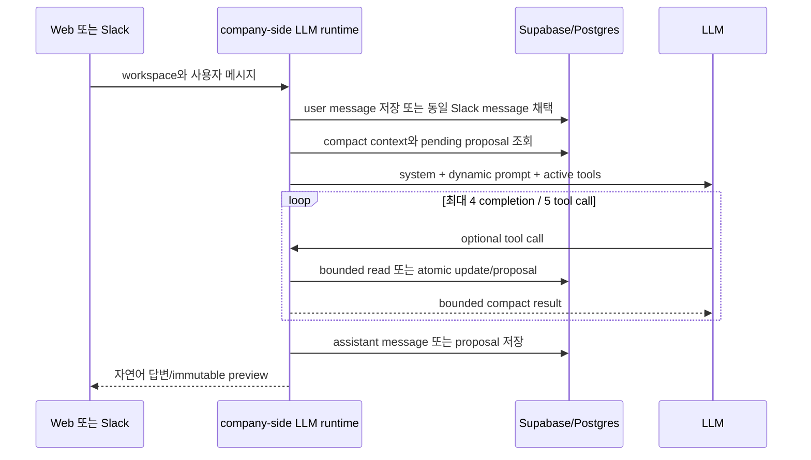

# Company-side LLM 구현·Tool 레퍼런스

이 문서는 `/org` 웹 채팅과 `/org-Slack`의 **company-side LLM** 구현 계약을
요약한다. 코드가 최종 소스 오브 트루스다.

## 소스 오브 트루스

| 범위 | 파일 |
| --- | --- |
| model과 fallback | `src/lib/org/agent/modelConfig.ts` |
| system/user prompt | `src/lib/org/agent/prompts.ts` |
| always-on context와 retention 주입 | `src/lib/org/agent/context.ts` |
| compact 직렬화 | `src/lib/org/agent/promptFormat.ts` |
| tool schema | `src/lib/org/agent/tools.ts` |
| bounded read | `src/lib/org/agent/data.ts` |
| flat key catalog | `src/lib/org/agent/companyDataCatalog.ts` |
| append/replace/rewrite | `src/lib/org/agent/companyDataMutation.ts` |
| runtime validation과 실행 | `src/lib/org/agent/toolExecution.ts` |
| proposal context | `src/lib/org/agent/proposals.ts` |
| tool loop와 proposal presentation | `src/lib/org/agent/chat.ts` |
| 대화·메시지·retention selector | `src/lib/org/agent/store.ts` |
| 웹 진입점 | `src/app/api/org/agent/chat/route.ts` |
| Slack 실행·proposal activation | `src/app/api/internal/org-agent/slack-turn/route.ts` |

## 데이터 원본

```text
company workspace
  ├─ company_internal_roles.request  # role별 후보 매칭 기준의 원본
  ├─ company_memories
  │    ├─ role_id is null            # workspace memory, 최대 1개
  │    └─ role_id                    # role memory, role당 최대 1개
  ├─ company_conversations           # workspace 공용 대화
  ├─ company_agent_update_proposals  # 확인 대기 변경안
  └─ company_events                  # compact 변경 기록
```

`company_internal_roles.request`가 role별 후보 매칭 기준의 유일한 저장소다.

request는 어떤 후보를 매칭할지에 관한 기준이고, memory는 그 밖의 지속적으로
기억할 회사/role 맥락이다. conversation summary는 과거 대화의 압축본일 뿐 현재
request나 memory를 대신하지 않는다.

## 한 turn의 흐름



`update_data`는 같은 assistant message에서 반드시 단독 호출되며, 한 user turn에
한 번만 실행된다. 호출하면 그 turn의 tool use를 종료한다.

## Always-on context

매 turn에 항상 들어가는 것은 다음으로 제한한다.

- 회사명, brief, company details/workspace memory availability
- internal·non-expired role의 ID/제목/사람용 상태, bounded pipeline count,
  request/memory 존재 여부
- effective activity 기준 최근 후보-포지션 20개
- 최근 workspace summary 2개
- 현재 웹 chat 또는 현재 Slack thread의 raw message 최대 14개
- 같은 scope의 pending proposal pointer와 유지 중인 `get_more_data`
- mention, partial/unavailable note, 현재 user message

role request/memory/JD 본문과 큰 회사 정보는 기본으로 넣지 않는다. 자세한 budget은
[Prompt·Context 설계](./org-agent-context-engineering-ko.md)를 본다.

## 활성 Tool

| Tool | 목적 | DB 변경 |
| --- | --- | --- |
| `get_talents` | 후보 식별용 bounded search | 없음 |
| `read_talent` | 특정 후보의 role/stage/progress, Harper 공유 정보와 선택적 profile | 없음 |
| `read_role` | 특정 role의 선택 block 읽기 | 없음 |
| `get_more_data` | workspace optional data 읽기 | 없음 |
| `update_role_criteria` | structured role criteria 전체 교체 또는 선택 편집 | 있음 |
| `update_data` | 회사·role 정보를 단일 atomic batch로 변경/확인 | 있음 |
| `change_role_status` | Role의 진행·중단·종료 lifecycle 변경 | 있음 |
| `decide_candidate_connection` | 연결 대기 후보자의 수락·거절과 연락 방식 결정 | 있음 |
| `manage_role_pipeline_stages` | Role의 custom 단계 추가·이름 변경·빈 단계 삭제 | 있음 |
| `move_candidate_stage` | 연결 이후 후보자를 활성 pipeline 단계 사이에서 이동 | 있음 |

pipeline 구조 변경과 후보자 위치 변경은 서로 다른 terminal tool이다. 단계만 고치는
요청이 후보자 위치·연락·일정을 함께 바꾸지 않으며, 후보자를 옮기는 요청도 단계
구조를 바꾸지 않는다.

## `get_talents`

후보 이름, 이메일, headline, talent ID 또는 포지션명으로 company-visible 후보를
찾는다.

| argument | 필수 | 기본/한도 |
| --- | --- | --- |
| `query` | 예 | 1~200자 |
| `roleId` | 아니오 | 정확한 role을 알 때만 |
| `limit` | 아니오 | 기본 10, 최대 20 |
| `offset` | 아니오 | 기본 0, 최대 200 |

결과는 talent/role ID, 이름, 이메일, headline, 사람용 stage, 짧은 fit과 pagination을
반환한다. role 전체 pipeline을 읽는 검색 도구가 아니며 그 경우 `read_role`을 쓴다.
`searchProfile=true`는 bio, 구조화된 경력·학력·extra에서만 검색하며 raw resume text는
검색하거나 snippet으로 반환하지 않는다.

## `read_talent`

| argument | 필수 | 기본/한도 |
| --- | --- | --- |
| `talentIds` | `talentId`와 둘 중 하나 | exact ID 1~10개, 중복 금지 |
| `talentId` | `talentIds`와 둘 중 하나 | 단일 후보용 legacy 호환 필드 |
| `roleId` | 아니오 | 특정 role에 한정할 때 |
| `includeProfile` | 아니오 | 기본 `false` |
| `progressLimit` | 아니오 | 기본 10, 최대 30 |

`talentIds`와 `talentId`를 동시에 보내면 실패한다. 기본 결과에는 후보 식별 정보,
현재 workspace에서 보이는 role/stage, fit, feedback,
memo, tradeoff, 최근 progress, 회사 연락 이력, 이력서 등록 여부가 포함된다. 또한 최신
`talent_insights.content`에서 다음 다섯 항목을 항상 읽어 `Harper에게 말해준 정보`로
전달한다.

- 원하는 다음 역할 (`next_scope`)
- 선호 근무 지역·방식 (`location`)
- 선호하는 회사·팀 조건 (`team_style_fit`)
- 꼭 있어야 하는 조건 (`must_haves`)
- 피하고 싶은 조건 (`deal_breakers`)

회사별 동의, insight 작성 시점, 요청 topic으로 이 다섯 항목을 제한하지 않는다. 값이 없으면
빈 값으로 표시한다. 보상 insight와 민감한 개인정보 표현은 포함하지 않는다.

`includeProfile=true`일 때만 bio, 최근 경력 8개, 학력 5개, extra 5개를 추가한다.
`talent_users.resume_text`와 resume excerpt는 DB에서 읽거나 tool result에 직렬화하지
않는다. resume는 공개 가능한 primary resume 파일의 존재 여부와 안내 문구만 반환한다.

여러 후보를 한 번에 읽을 때도 전체 tool result는 48,000자 한도 안에 들어오도록 후보별
detail을 bounded하게 직렬화한다. 특정 후보의 detail이 잘리면 해당 item에
`detail_complete=false`를 표시하므로, exact 나머지 정보가 필요할 때 그 후보 한 명만
다시 읽는다.

조회는 최신 board page에만 의존하지 않는다. talent/role과 최근 progress의
recommendation ID를 bounded하게 다시 확인하므로 최근 활동이 생긴 오래된
recommendation도 읽을 수 있다. Slack은 `company_safe` audience를 사용한다.

## `read_role`

`roleId` 또는 `exactTitle` 중 하나로 internal·non-expired role을 읽는다. exact title은
정규화 후 하나만 일치할 때만 성공하고, 0개/여러 개면 후보 목록을 반환한다.

| argument | 의미 |
| --- | --- |
| `include` | `criteria`, `memory`, `pipeline`, `description` 중 필요한 block만 |
| `stage` | pipeline 후보 page를 특정 stage로 제한할 때만 |
| `peopleLimit` / `peopleOffset` | 기본 10/0, 최대 20/200 |
| `recentUpdateLimit` | 기본 10, 최대 20; 0이면 생략 |

`include`를 생략하면 이름, 상태, 위치, 근무 방식 같은 base만 읽는다.

- `criteria`: `company_internal_roles.request`와 선택적인 0~6개의 structured criteria
- `memory`: 해당 role의 `company_memories`
- `pipeline`: bounded count, 후보 page, 최근 progress
- `description`: role JD 본문

request, memory, description은 Markdown을 보존하고 field별
`included/complete/truncated` marker를 준다. long text rewrite는 해당 field의
complete read가 있어야 한다. pipeline count가 cap에 닿으면 정확한 수가 아니라
lower bound이며 `countsComplete=false`다.

`pipeline` 결과는 사람이 읽는 label과 함께 변경에 필요한 exact stage ID와 정렬
순서를 반환한다. custom 단계는 `custom:<uuid>` 형식이며, 후보자마다 현재
`currentStageId`와 `currentStageLabel`을 함께 준다. “다음 단계”는 이 최신 정렬
순서에서 현재 단계 바로 다음을 뜻한다.

## `manage_role_pipeline_stages`

정확한 internal Role 하나의 custom pipeline 구조를 바꾸는 단독·terminal tool이다.
호출 직전에 `read_role(include=["pipeline"])`로 최신 stage ID와 순서를 읽어야 한다.

| action | 필수 값 | 동작 |
| --- | --- | --- |
| `add` | `roleId`, `labels` 1~6개 | 입력 순서대로 custom 단계 추가; 같은 이름은 재생성하지 않음 |
| `rename` | `roleId`, exact `stageId`, `label` | custom 단계 이름만 변경 |
| `delete` | `roleId`, exact `stageId` | 후보자가 한 명도 없는 custom 단계만 삭제 |

기본 단계인 연결 대기·연결됨·최종 오퍼·프로세스 종료는 수정하거나 삭제하지 않는다.
단계 삭제는 사용 중이면 거절하고 후보자 태그를 함께 지우지 않는다. 어떤 action도
후보자 위치, Role 조건·요청·메모·상태, 후보자 연락이나 인터뷰 일정을 바꾸지 않는다.

## `move_candidate_stage`

후보자 한 명을 같은 Role의 활성 pipeline 단계 사이에서 옮기는 단독·terminal
tool이다. argument는 `roleId`, `talentId`, `expectedCurrentStageId`,
`targetStageId`다. 현재 위치와 목표 위치는 호출 직전 pipeline read에서 본 exact
ID를 사용한다.

허용되는 단계는 `connected`, `final_offer`, 그리고 해당 Role의 `custom:<uuid>`다.
`pending_connection`, `process_stopped`, 내부 보관 단계에서는 이 tool을 쓰지 않는다.
연결 시작·거절·중단·재활성화는 기존 후보 연결 decision/lifecycle 경로를 사용한다.

서버는 후보자의 실제 현재 stage가 `expectedCurrentStageId`와 같은지 다시 확인하고,
달라졌으면 409 conflict로 거절한다. 이동은 stage tag와 progress만 기록하며 후보자
연락·이메일·일정 생성은 하지 않는다.

## `get_more_data`

```json
{
  "kinds": ["members", "company_details", "workspace_memory"],
  "fullTextKeys": ["workspace_request"]
}
```

`kinds`는 1~3개다.

- `members`: 이름, 이메일, 사람용 workspace 역할과 total/returned/complete
- `company_details`: 회사명, 홈페이지, LinkedIn, 위치, 설립 연도, 직원 수, 관련
  링크, 누적 투자금, 최근 투자 단계, legacy workspace request와 field별 complete
  marker. 기존 채용·투자 링크는 별도 값이 아니라 관련 링크에 합쳐 반환한다.
- `workspace_memory`: `company_memories`의 workspace Markdown

pitch 전문은 이미 모든 호출에 들어가므로 `fullTextKeys`로 다시 읽지 않는다.
`fullTextKeys`는 `company_details`와 함께 legacy `workspace_request` 전문이 필요한
수정에서만 사용한다.

field content 합계는 12,000자, framing을 포함한 직렬화는 14,000자까지다. 선택한
kind는 같은 웹 대화 또는 Slack thread의 다음 사용자 turn T1~T3에 최신 값으로
자동 재조회된다. activation 후 24시간이 지나면 제거되고, kind별 재호출은 그
kind의 lease와 selector만 갱신한다.

## `update_role_criteria`

사용자가 명시적으로 요청했을 때 internal role의 0~6개 structured criteria를
변경한다. 충분한 판단 축이 있으면 3~6개를 권장하지만 필수 개수는 아니다. 현재 기준이
prompt에 보이지 않으면 먼저 `read_role(include=["criteria"])`로 읽는다. 한 호출에서는
전체 교체와 선택 편집 중 정확히 하나만 사용한다.

특정 기준만 편집할 때는 `edits`를 사용한다. 여러 edit은 입력 순서로 계산한 뒤 한 번에
저장되므로, 중간 하나가 실패하면 아무것도 반영되지 않는다.

```json
{
  "roleId": "role-id",
  "edits": [
    {
      "operation": "update",
      "targetName": "Technical depth",
      "criteria": "설계부터 운영까지 복잡한 기술 문제를 해결한 근거"
    },
    {
      "operation": "add",
      "name": "Communication",
      "criteria": "복잡한 의사결정을 이해관계자에게 명확히 설명한 경험"
    }
  ]
}
```

| operation | 필수 값 | 동작 |
| --- | --- | --- |
| `add` | `name`, `criteria` | 기준 한 개 추가 |
| `update` | 정확한 `targetName`, 그리고 `name`/`criteria` 중 하나 이상 | 선택한 기준의 이름이나 상세 내용만 수정 |
| `delete` | 정확한 `targetName` | 선택한 기준 삭제 |

기준에는 별도 item ID가 없으므로 `targetName`은 현재 이름과 정확히 같아야 한다. 같은
이름이 중복되면 선택 편집을 거절한다. 최종 목록이 6개를 초과하는 편집은 거절하며,
삭제 결과가 0개가 되는 것은 허용한다.

전체를 다시 쓸 때는 기존 `criteria` 배열 형식을 그대로 사용한다.

```json
{
  "roleId": "role-id",
  "criteria": [
    { "name": "Experience", "criteria": "관련 성과와 기간" },
    { "name": "Technical depth", "criteria": "기술적 복잡성과 주도 범위" },
    { "name": "Collaboration", "criteria": "협업과 의사결정 근거" }
  ]
}
```

## `update_data`

Role lifecycle 상태는 이 tool로 변경하지 않는다. 상태 변경은 아래
`change_role_status`만 사용한다.

두 mode 중 정확히 하나를 사용한다.

### 1. changes mode

```json
{
  "summary": "Backend Engineer 필수 경력 기준 추가",
  "changes": [
    {
      "key": "role_request",
      "roleId": "role-id",
      "kind": "append",
      "section": "hard_constraints",
      "value": "B2B SaaS 백엔드 경력 3년 이상"
    }
  ]
}
```

- `summary`: 변경 내용만 담은 한 줄, 1~160자
- `changes`: 1~12개
- role key에는 `roleId` 필수, workspace key에는 금지
- `baseProposalId`: 기존 pending proposal을 수정·승계할 때만 사용

operation:

| kind | 동작 | 추가 조건 |
| --- | --- | --- |
| `append` | text/list 뒤에 추가, list는 중복 제거 | `role_request`는 `section` 필수 |
| `replace` | 정확한 부분 문자열 한 번 교체 | `oldValue` 필수, 0회/2회 이상이면 실패 |
| `rewrite` | 전체 값을 새 값으로 교체 | 기존 long text가 있으면 complete read 필수 |

`role_request` append의 section은 `hard_constraints` 또는
`preferred_criteria`다. 기존 문서가 비정형이면 원문을 legacy section에 보존하면서
다음 canonical heading을 만든다.

```markdown
## Hard constraints

## Preferred criteria
```

`role_request` rewrite도 두 heading을 모두 포함해야 한다. 같은 target의 여러
operation은 입력 순서로 fold되고 최종 DB write는 한 번이다. batch 중 하나라도
검증·conflict에 실패하면 전체를 적용하지 않는다.

flat key는 다음 범주다.

- 회사/workspace: 이름, 회사 정보 문서(pitch), legacy workspace request,
  홈페이지·LinkedIn, 위치, 설립 연도, 직원 수, 관련 링크, 누적 투자금, 최근 투자
  단계
- memory: `workspace_memory`
- role: 이름, 설명, 외부 JD, 위치, 근무 방식, 고용 형태
- role 기준/기억: `role_request`, `role_memory`

모든 서술형 회사 정보와 후보자 안내용 회사 문구는 pitch 문서에 쓴다. 홈페이지와
LinkedIn 이외의 채용·투자·보도·참고 URL은 모두 관련 링크에 쓴다. 별도 회사 소개,
한 줄 소개, 로고, 채용 페이지, 투자 링크, 주요 분야, 투자사 목록·설명, 최근 투자
설명 field는 company-side LLM에 노출하지 않는다. 논리 key가 실제 어느 table에
있는지는 LLM에 노출하지 않는다.

### 2. proposal mode

```json
{
  "proposalId": "stored-proposal-id",
  "proposalAction": "apply"
}
```

`proposalAction`은 `apply`, `reject`, `preview` 중 하나다. request/memory 계열
(`role_request`, `workspace_memory`, `role_memory`, legacy `workspace_request`)이
포함된 changes batch는 직접 적용되지 않고 confirmation proposal이 된다.

1. 서버가 현재 값과 final value로 deterministic preview를 만든다.
2. exact final payload와 최대 3,000자의 preview를 24시간 proposal로 저장한다.
3. user에게 “이렇게 수정할까요?”와 전체 preview를 보여준다.
4. 다음 turn의 명시적 확인에서 저장된 proposal을 적용한다. LLM이 final value를
   다시 생성하지 않는다.

웹에서는 proposal과 assistant preview message를 함께 저장한다. Slack에서는 먼저
`draft`를 만들고, immutable preview를 Slack에 성공적으로 게시한 뒤
`activate_slack_company_agent_update_proposal_v1`이 같은 thread의 pending proposal로
활성화하고 assistant message를 저장한다. 게시/activation 전 draft는 적용할 수 없다.

같은 scope의 pending proposal은 다음 prompt의 `<pending_update>`에 짧게 들어간다.
사용자가 기존안을 수정하면 `baseProposalId`로 기존 변경을 유지한 채 일부를 바꾼다.
현재 DB 값이 달라졌으면 proposal은 `stale`이 되고 아무 값도 쓰지 않는다.

### 직접 적용과 event

confirmation이 필요 없는 명시적 변경은 `apply_company_data_changes_v1`이 atomic
batch로 즉시 반영한다. confirmation-required field가 하나라도 있으면 batch 전체가
proposal로 간다.

성공한 chat/Slack update는 같은 RPC에서 `company_events`에 `source`, workspace,
최대 300자의 한 줄 summary를 저장한다. `/org` 웹사이트의 회사/role 편집도
`source=website` event를 기록한다. event는 현재 저장만 하며 LLM context에서 읽지
않는다.

## `change_role_status`

정확한 internal Role 하나의 lifecycle을 바꾸는 단독·terminal tool이다. 사용자가
명시적으로 상태 변경을 요청한 경우에만 호출한다.

| status | 사용자 표현 | 의미 |
| --- | --- | --- |
| `active` | 진행 | 채용을 진행하며 Harper가 주기적으로 적합한 인재를 연결한다. |
| `paused` | 중단 | Role은 열어두되 추가 후보 추천만 중단한다. 이미 진행 중인 후보자와 연결은 유지한다. |
| `ended` | 종료 | Role 상태를 종료로 바꾸고 종료 시각을 기록해 추가 추천을 막는다. 후보자 기회 화면은 종료로 해석하며, 미응답 내부 추천은 이력 조회 시 보관된다. 이 변경 하나가 모든 기존 후보 stage와 회사 요청을 원자적으로 닫지는 않는다. |

argument는 exact `roleId`와 `status` 두 개다. `paused`를 기존 후보 프로세스까지
끝내는 의미로 사용하거나, 단순히 새 추천만 잠시 멈추려는 요청에 `ended`를 사용하면
안 된다. 상태 변경은 기존 atomic company-data RPC와 event 기록 경로를 공유하지만,
기존 후보 stage와 회사 요청의 종료가 필요하면 별도 stage·요청 정리 경로를 실행하고
그 결과를 확인해야 한다.

## 동시성·부분 데이터 안전

- long text rewrite 전에 complete current value를 읽어야 한다.
- 같은 parallel tool-call batch의 read 결과는 그 batch의 write 권한으로 쓰지 못한다.
- apply RPC는 expected current value가 다르면 conflict/stale로 끝나며 silent overwrite를
  하지 않는다.
- truncated tool result는 complete read state를 열지 않는다.
- 동일 결과면 write 없이 `already_reflected`를 반환한다.
- 후보 stage 이동은 호출 직전 읽은 `expectedCurrentStageId`가 실제 현재 stage와
  다르면 적용하지 않는다.
- custom 단계 삭제는 후보자가 없는 단계만 허용하며 사용 중인 단계와 후보자 위치를
  보존한다.
- Slack user message insert 재시도는 thread, timestamp, conversation, workspace,
  role, content가 모두 같을 때만 기존 row를 채택한다.

## Model과 실행 한도

- 웹·Slack 기본 model: `deepseek-v4-flash` (`reasoning_effort=high`)
- 공통 서버 기본값: `ORG_AGENT_MODEL`
- Slack 전용 override: `SLACK_ORG_AGENT_MODEL` (`ORG_AGENT_MODEL`보다 우선)
- 웹 내부 model selector는 요청마다 model을 지정하며 공통 기본값보다 우선한다.
- 허용 model: `deepseek-v4-flash`, `deepseek-v4-pro`, `gpt-5.6-luna`,
  `gpt-5.6-terra`, `claude-sonnet-5`, `grok-4.3`
- DeepSeek V4는 DeepSeek Chat Completions endpoint와 `DEEPSEEK_API_KEY`를 사용한다.
  thinking mode에서 tool call이 발생하면 `reasoning_content`를 다음 tool turn에
  그대로 전달한다.
- Luna와 Terra는 Responses API에서 `reasoning.effort=high`로 호출한다.
- tool loop 최대 4회, 실제 tool call 최대 5개
- 누적 tool result 최대 48,000자
- 일반 completion 최대 4,000 tokens
- complete long text read 후 rewrite completion 최대 32,000 tokens
- tool-free final 최대 2,000 tokens

## 지원하지 않는 작업

company-side LLM은 현재 다음을 직접 실행하지 않는다.

- 새 role 생성·삭제
- Slack integration, billing, contract 변경
- sourcing run 즉시 시작

관련 실제 LLM message/tool trace는
[`LLM_CALL_TRACE_KO.md`](../src/lib/org/agent/LLM_CALL_TRACE_KO.md)를 본다.
