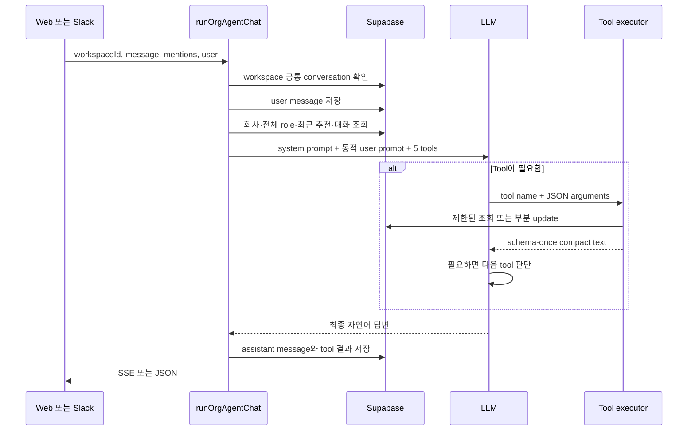

# Organization Agent 구현·Tool 레퍼런스

이 문서는 Organization 웹과 Slack에서 공통으로 사용하는 Harper LLM의 전체
흐름을 설명한다. 직접 수정할 때는 아래 “소스 오브 트루스” 파일부터 보면 된다.

## 소스 오브 트루스

| 알고 싶은 것 | 파일 |
| --- | --- |
| 어떤 model을 쓰는가 | `src/lib/org/agent/modelConfig.ts` |
| system/user prompt 원문 | `src/lib/org/agent/prompts.ts` |
| 매번 prompt에 넣는 데이터 | `src/lib/org/agent/context.ts` |
| prompt/table/tool-result 직렬화 | `src/lib/org/agent/promptFormat.ts` |
| tool 이름·argument schema | `src/lib/org/agent/tools.ts` |
| tool의 DB 조회 구현 | `src/lib/org/agent/data.ts` |
| 한 turn의 tool state·read visibility | `src/lib/org/agent/toolState.ts` |
| tool argument 검증·쓰기 실행 | `src/lib/org/agent/toolExecution.ts` |
| LLM 호출과 tool loop | `src/lib/org/agent/chat.ts` |
| 대화·메시지 저장 | `src/lib/org/agent/store.ts` |
| 긴 대화 요약 | `src/lib/org/agent/summary.ts` |
| 브라우저 진입 API | `src/app/api/org/agent/chat/route.ts` |
| Slack 진입 API | `src/app/api/internal/org-agent/slack-turn/route.ts` |

## 핵심 구조

Agent 대화는 더 이상 Job/role 하나에 고정되지 않는다.

```text
company workspace 1개
  └─ company_conversations 1개 (role_id = null)
       ├─ 웹 chat message
       └─ 여러 Slack thread message
```

LLM은 매 turn마다 모든 role의 간단한 목록을 보고 사용자의 문장에서 대상 role을
고른다. 여러 role이 비슷해서 잘못 고를 가능성이 있으면 하나를 추측하지 않고
사용자에게 확인한다.

후보자와 role을 실제로 읽거나 변경할 때만 tool argument의 `talentId`와 `roleId`를
사용한다. 따라서 대화 자체의 scope와 작업 대상의 scope가 분리되어 있다.

## Model

- 웹 기본: `grok-4.3`
- Slack 기본: `gpt-5.6-luna`. 유효한 `SLACK_ORG_AGENT_MODEL` 환경 변수로 바꿀 수
  있다.
- 허용 model: `claude-sonnet-5`, `grok-4.3`, `gpt-5.6-luna`
- Grok의 fallback은 Claude이고, Claude/Luna의 fallback은 Grok이다.
- 한 completion의 output limit은 2,000 tokens다. `gpt-5.6-*`에는
  `max_completion_tokens`, 나머지에는 `max_tokens`를 사용한다.
- 코드가 `temperature=0.1`을 요청하지만 sampling parameter를 지원하지 않는
  model에서는 공통 wrapper가 제거한다. `gpt-5.6-*`에는 기본
  `reasoning_effort=low`도 추가한다.

정확한 값은 `src/lib/org/agent/modelConfig.ts`와
`src/lib/org/agent/chat.ts`의 `runCompletion()`을 본다.

각 provider에 최종 전달되는 request와 tool 재호출 예시는
`src/lib/org/agent/LLM_CALL_TRACE_KO.md`를 본다.

## 한 turn의 호출 흐름



Tool은 `tool_choice = auto`로 제공한다. LLM이 필요 없다고 판단하면 첫 completion이
바로 최종 답변이다.

한 turn 한도:

- tool loop 최대 4회
- 실제 tool call 합계 최대 5개
- 한도가 끝난 뒤에는 tool 없는 마지막 completion으로 답변만 만든다.

일반적인 다단계 예는 `get_talents → read_talent → update_role → 최종 답변`이다.

## LLM에 항상 들어가는 데이터

동적 prompt는 `buildOrgAgentUserPrompt()`가 만든다.

| 섹션 | 데이터 | 제한 |
| --- | --- | --- |
| Company | 이름, description, pitch, 회사 공통 request | 필드별 DB 최대 길이 |
| All positions | 모든 role의 ID, 이름, 상태, 위치, 근무 형태, 고용 형태, 일 단위 updated date | core는 전부 |
| Role requests | 비어 있지 않은 role request | role당 600자, 섹션 8,000자 |
| Recent recommendations | talent ID, 이름, headline, role, stage, 짧은 fit, 추천일 | 최신 20명 |
| Older summaries | 오래된 웹·Slack 통합 대화 요약 | 최근 2개, 각 1,200자 |
| Recent conversation | 웹·Slack을 합친 직전 대화 | 최신 14개 조회 후 약 8,000자 |
| Resolved mentions | 브라우저 `@후보자`의 talentId/roleId | 요청에 포함된 mention |
| New message | 이번 사용자 메시지 | 최대 8,000자 |

중요한 점:

- UUID가 tool argument로 필요하지 않은 `workspaceId`, `recommendationId`는 prompt에서
  제외한다.
- 최근 추천 이메일은 항상 넣지 않는다. 이메일 검색이 필요하면 `get_talents`가
  읽는다.
- 반복 레코드는 JSON object 배열 대신 `header 1회 + TSV rows`로 직렬화한다.
- entity/update/progress 시간은 정렬된 순서를 유지하고 `YYYY-MM-DD`까지만 넣는다.
- 후보자의 bio, 전체 이력서, 경력, 학력은 항상 넣지 않는다.
- 한 role의 전체 후보 목록이나 전체 progress도 항상 넣지 않는다.
- 이 큰 데이터는 각각 `read_talent`, `read_role`로 필요한 만큼만 읽는다.
- 웹과 Slack은 workspace의 같은 대화 기억을 사용한다. 어느 surface에서 질문해도
  최근 웹 채팅과 여러 Slack thread의 메시지 및 통합 summary를 함께 읽는다.
- Slack speaker는 `표시 이름 [Slack user ID]`로 들어가며, 이름 scope가 없는
  installation도 ID로 서로 구분된다.
- 오래된 웹·Slack 대화는 하나의 workspace summary로 요약해 다음 turn에 다시 넣는다.
- role request가 `…`로 잘렸거나 `omitted_role_requests`에 있으면
  `update_role(request=...)` 전에 `read_role`을 해야 한다. 실행기도 이 순서를
  검증해서 잘린 내용을 전체 값처럼 덮어쓰지 못하게 막는다.

system prompt 원문은 `buildOrgAgentSystemPrompt()` 하나에 모여 있다. Agent의
말투, role 선택 정책, read/write 정책을 바꾸려면 이 함수만 수정하면 된다.

동적 prompt는 긴 reference data를 먼저 배치하고 실제 `<user_message>`를 마지막에
둔다. DB 문자열과 대화 이력은 `<workspace_context>` 안의 데이터로 표시하며,
cell 안의 `<`/`>`는 section tag를 닫을 수 없도록 치환한다.

## 제공 Tool 한눈에 보기

| Tool | 종류 | 용도 | DB 변경 |
| --- | --- | --- | --- |
| `get_talents` | read | 이름·이메일·headline·talent ID·포지션명으로 후보 검색 | 없음 |
| `read_talent` | read | 후보 상세, 현재 role/stage, 최근 progress 조회 | 없음 |
| `read_role` | read | role 상세, 전체 stage별 인원수, 제한된 후보 page, 최근 update 조회 | 없음 |
| `update_company` | write | 회사 description/pitch/공통 request 부분 변경 | `company_workspace` |
| `update_role` | write | 선택한 role 정보와 request 부분 변경 | `company_roles` |

웹과 Slack은 동일한 5개 tool을 받는다. Surface에 따른 tool 차이는 없다.

## `get_talents`

후보자 또는 포지션 이름으로 후보 목록을 찾는다.

Arguments:

| 필드 | 필수 | 기본/한도 | 의미 |
| --- | --- | --- | --- |
| `query` | 필수 | 1~200자 | 이름, 이메일, headline, talentId 또는 포지션명 |
| `roleId` | 선택 | - | 이미 role을 정확히 알 때 그 role로 제한 |
| `limit` | 선택 | 기본 10, 최대 20 | 반환 수 |
| `offset` | 선택 | 기본 0, 최대 200 | 다음 page |

Application 내부 return object는 아래와 비슷하지만, 이 JSON 전체를 LLM에 보내지
않는다.

```json
{
  "items": [
    {
      "candidate": {
        "talentId": "...",
        "name": "...",
        "email": "...",
        "headline": "..."
      },
      "role": { "roleId": "...", "name": "Backend Engineer" },
      "recommendationId": "...",
      "stage": "pending_connection",
      "fitSummary": "...",
      "recommendedAt": "...",
      "updatedAt": "..."
    }
  ],
  "limit": 10,
  "offset": 0,
  "hasMore": false
}
```

LLM에는 같은 결과가 다음처럼 column header를 한 번만 가진 compact text로
들어간다. 다음 tool 결정에 필요 없는 `recommendationId`, `updatedAt`은 뺀다.

```text
status=ok
offset=0 limit=10 has_more=false
<matches>
talent_id  name  email  headline  role_id  role  stage  fit  recommended
...        ...   ...    ...       ...      ...   ...    ...  2026-07-30
</matches>
```

검색 자체는 `talent_users`에서 수행하지만, 결과는 이 workspace role의
`talent_opportunity_recommendation`이 있는 후보로 다시 제한한다. 다른 회사의
후보 데이터는 반환하지 않는다.

## `read_talent`

Arguments:

| 필드 | 필수 | 기본/한도 | 의미 |
| --- | --- | --- | --- |
| `talentId` | 필수 | - | 안정적인 후보 ID |
| `roleId` | 선택 | - | 특정 role의 기록만 볼 때 |
| `includeProfile` | 선택 | 기본 `false` | bio/resume/경력/학력/extras 포함 여부 |
| `progressLimit` | 선택 | 기본 10, 최대 30 | 최근 progress 수 |

`includeProfile=false`여도 항상 다음은 반환한다.

- 이름, 이메일, headline
- 이 workspace에서 연결된 각 role의 이름과 ID
- 각 recommendation의 현재 stage, fit, feedback, memo, tradeoff
- 최근 `talent_progress`

`includeProfile=true`일 때만 추가한다.

- bio와 location
- resume excerpt 최대 4,000자
- 최근 경력 최대 8개
- 학력 최대 5개
- extras 최대 2,000자

후보가 이 workspace의 어떤 role에도 추천되지 않았다면 `404` 성격의 tool error를
반환한다.

## `read_role`

Arguments:

| 필드 | 필수 | 기본/한도 | 의미 |
| --- | --- | --- | --- |
| `roleId` | 필수 | - | 읽을 role |
| `stage` | 선택 | - | 사용자가 특정 stage를 요청했을 때만 후보 page를 제한 |
| `peopleLimit` | 선택 | 기본 10, 최대 20 | 이번 page 후보 수 |
| `peopleOffset` | 선택 | 기본 0, 최대 200 | 다음 page |
| `recentUpdateLimit` | 선택 | 기본 10, 최대 20 | 최근 progress 수 |
| `includeDescription` | 선택 | 기본 `true` | 긴 JD 포함 여부 |

Return은 다음 덩어리로 구성된다.

- `role`: 이름, description, request, status, location 등
- `stageCounts`: 전체 pipeline의 정확한 stage별 인원수
- `people`: total, limit, offset, hasMore와 후보 목록
- `recentUpdates`: 최근 role progress
- `availableStages`: built-in/custom stage ID와 표시 이름

전체 현황·인원수 질문에서는 `stage`를 생략하고 `stageCounts`를 사용한다. 후보
목록 전체를 한꺼번에 LLM에 넣지는 않는다. 예를 들어 “연결됨 후보 30명의
목록”을 읽으려면 LLM은 `stage=connected, peopleLimit=20, offset=0`과 필요할
경우 `offset=20`을 별도 호출해야 한다. `recommended`는
`processed_stage/saved_stage`가 모두 비어 있는 recommendation을 뜻한다.

## `update_company`

부분 update다. 전달하지 않은 필드는 바뀌지 않는다.

Arguments:

| 필드 | 필수 | 제한 | 의미 |
| --- | --- | --- | --- |
| `changeSummary` | 필수 | 최대 500자 | 변경 감사용 짧은 설명 |
| `companyDescription` | 선택 | 최대 8,000자 또는 null | 회사 설명 |
| `pitch` | 선택 | 최대 8,000자 또는 null | 후보자 대상 pitch |
| `request` | 선택 | 최대 6,000자 또는 null | 모든 role에 적용할 채용 기준 |

`request`만 변경할 때는 optimistic concurrency check를 사용한다. LLM이 읽은 뒤
다른 사용자가 request를 바꿨으면 덮어쓰지 않고 실패한다.

회사 `request`는 후보 관리 권한으로 변경할 수 있다. description/pitch를 포함한
회사 정보 변경은 workspace 관리 권한이 필요하다.

## `update_role`

부분 update다. `roleId`와 실제로 변경할 필드만 전달한다.

Arguments:

| 필드 | 필수 | 제한 |
| --- | --- | --- |
| `roleId` | 필수 | 현재 workspace의 role ID |
| `changeSummary` | 필수 | 최대 500자 |
| `name` | 선택 | 최대 200자, null 불가 |
| `description` | 선택 | 최대 20,000자 또는 null |
| `request` | 선택 | 최대 6,000자 또는 null |
| `externalJdUrl` | 선택 | 최대 2,000자 또는 null |
| `locationText` | 선택 | 최대 300자 또는 null |
| `workMode` | 선택 | `onsite`, `hybrid`, `remote`, null |
| `employmentTypes` | 선택 | `full_time`, `part_time`, `internship`, `contract` 배열 |
| `status` | 선택 | `top_priority`, `active`, `paused`, `ended` |

`request`만 변경할 때는 기존 값을 조건으로 update해 동시 덮어쓰기를 막는다.
동일한 값이면 DB write 없이 `already_reflected`를 반환한다.

항상 넣은 role request가 잘렸거나 prompt budget 때문에 빠진 경우 실행기는
`update_role(request=...)`를 거절한다. LLM이 `read_role`로 전체 request를 읽은 뒤
같은 turn에서 다시 호출하면 허용한다.

## Request 작성 규칙

`company.request`와 `role.request`는 patch가 아니라 완성된 문자열이다. LLM에는 다음
규칙을 준다.

- 기존의 관련 없는 기준은 보존한다.
- 새 지시를 병합한 전체 replacement 문자열을 보낸다.
- 후보 이름과 talentId를 request에 저장하지 않는다.
- 후보 예시는 “B2B SaaS scale-up 경험” 같은 객관적인 기준으로 일반화한다.
- 회사 전체 원칙이 명확할 때만 company request를 바꾼다.
- role이 모호하면 update 전에 확인한다.

## 권한과 Slack

웹:

- 현재 로그인 사용자가 service actor다.
- conversation 접근과 후보 read/write에는 `manage_candidates`가 필요하다.
- company description/pitch 변경에는 `manage_workspace`가 필요하다.

Slack:

- Slack 사용자를 Harper 계정과 매핑하지 않는다.
- 허용된 채널의 모든 사용자가 `@Harper`를 호출할 수 있다.
- 실제 tool은 Slack app 설치 사용자, 없으면 workspace member 한 명을 service
  actor로 사용한다.
- 따라서 허용 채널은 write tool까지 실행 가능한 신뢰 경계다.
- `reply_to_harper_threads` 기본값은 `false`라서 기본적으로 `@Harper` mention이
  있어야 호출된다.
- Slack 채널과 thread의 legacy `role_id`는 더 이상 Agent scope로 사용하지 않는다.

## 대화 DB migration

적용할 migration:

```text
supabase/migrations/20260730140000_org_agent_workspace_conversation.sql
```

이 migration은:

1. conversation/message/summary의 `role_id`를 nullable로 만든다.
2. 기존 role별 conversation을 workspace당 하나로 병합한다.
3. 기존 메시지와 summary를 삭제하지 않고 target conversation으로 옮긴다.
4. 새 workspace conversation에 `role_id = null`을 사용한다.
5. Slack channel/thread의 기본 role requirement를 제거한다.

새 대화 메시지는 `role_id = null`이다. migration 전 메시지의 `role_id`는 어느
role 대화에서 왔는지 알려주는 legacy provenance로 남는다.

## 지원하지 않는 작업

현재 tool이 없으므로 직접 실행하지 않는다.

- 후보 수락·거절
- 후보 stage 이동
- 후보에게 이메일·메시지 발송
- 새 role 생성·삭제
- Slack integration 설정 변경
- billing/contract 변경
- sourcing run 즉시 시작

새 tool을 추가하려면 보통 다음 순서로 고친다.

1. `tools.ts`에 schema 추가
2. `data.ts`에 bounded data function 추가
3. `toolExecution.ts`에 runtime validation과 실행 branch 추가
4. `promptFormat.ts`에 LLM용 최소 return view 추가
5. `prompts.ts`에는 tool schema만으로 설명할 수 없는 공통 정책만 추가
6. 이 문서와 관련 test 갱신
