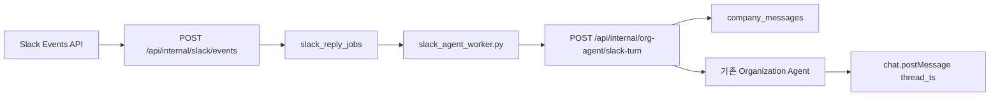

# Harper Slack Agent 구현 문서

## 목표

1. Harper가 Organization의 허용된 Slack 채널에 메시지를 보낸다.
2. 사용자가 Harper 메시지의 thread에 댓글을 달면 같은 thread의 앞선 맥락을 읽고 답한다.
3. 허용 채널에서 `@Harper`를 mention하면 기존 Organization Agent가 답한다.

활성화된 Slack 채널과 Harper Workspace membership을 함께 권한 경계로 사용한다.
Slack user email이 현재 Harper Workspace의 Owner 또는 Admin과 일치할 때만
company-side LLM을 실행한다. 멤버가 아니거나 Viewer이면 LLM, 조회, 변경 tool을
실행하지 않고 호출자에게만 보이는 ephemeral 권한 안내를 보낸다. Slack user ID와
표시 이름은 메시지 작성자를 구분하고 대화 맥락 및 감사 기록을 만드는 데 사용한다.

## 최종 데이터 모델

Slack 전용 신규 테이블은 세 개만 사용한다.

### 기존 `company_slack_integrations`

Harper workspace당 하나의 Slack OAuth installation을 저장한다.

```text
company_workspace_id PK
slack_team_id
slack_team_name
slack_app_id
slack_bot_user_id
bot_token_ciphertext
scopes
installed_by_user_id
status
installed_at
updated_at
```

기존 Incoming Webhook 필드는 migration 호환성을 위해 nullable legacy
column으로 남겨 두며 새 코드에서는 사용하지 않는다.

### 신규 `company_slack_channels`

관리자가 허용한 채널을 저장한다.

```text
id PK
company_workspace_id FK -> company_slack_integrations
slack_channel_id
slack_channel_name
default_role_id nullable legacy hint
is_private
is_enabled
respond_to_mentions
reply_to_harper_threads
notify_*
```

`default_role_id`는 이전 구현과의 호환성을 위한 nullable legacy hint다. 새 채널은
`null`을 저장하고 Agent scope로 사용하지 않는다.
`reply_to_harper_threads`의 기본값은 `false`다. 따라서 새 채널에서는
thread 댓글도 `@Harper` mention이 있어야 처리되며, 자동 응답 코드는 설정을
명시적으로 활성화한 채널에만 적용된다.

### 신규 `company_slack_threads`

Slack thread에서 반복되는 channel과 `thread_ts`를 한 번만 저장한다.

```text
id PK
channel_id FK -> company_slack_channels
role_id nullable legacy hint
slack_thread_ts
created_by_harper
```

일반 새 thread는 `role_id = null`이다. Agent는 메시지와 workspace 전체 role 목록으로
필요한 role을 매 turn 판단한다. 단, 새 역할 등록용으로 Harper가 만든 전용 thread는
draft `role_id`를 저장하고 `/org/new`의 같은 role-creation conversation에 메시지를
기록한다.

### 기존 `company_messages`

웹 Agent와 Slack Agent 메시지의 공통 원장이다. Slack 메시지는
`message_type = 'slack'`으로 저장한다. 일반 Slack thread는 workspace conversation을,
역할 등록 전용 thread는 해당 role-creation conversation을 사용한다.

```text
slack_thread_id FK -> company_slack_threads
slack_message_ts
slack_user_id
```

Slack thread 동기화로 가져온 사용자 메시지는 `company_user_id = null`일 수 있다.
실제 Slack 작성자는 `slack_user_id`에 저장하고, `users.info`로 해석한 표시 이름은 해당
message의 `metadata.slackUserName`에 저장한다. 처리 중인 역할 등록 turn은 Slack email과
일치하는 Harper 사용자도 함께 기록한다. Agent 권한 검증과 tool 실행에는 그 실제
Workspace Owner/Admin 계정을 사용한다.

Slack thread context는 같은 `slack_thread_id`를 가진 `company_messages`만
조회한다. 웹 대화나 다른 Slack thread는 포함하지 않는다. LLM에는
`표시 이름 [Slack user ID]`를 speaker로 전달하므로 여러 사용자의 말을 구분한다.
표시 이름을 읽지 못한 기존 installation에서는 `Slack user [ID]`로 구분한다.

### 신규 `slack_reply_jobs`

Slack Events API 중복 방지와 worker retry만 담당한다.

```text
id PK
slack_event_id UNIQUE
thread_id FK -> company_slack_threads
user_message_id FK -> company_messages
response_message_id FK -> company_messages
trigger_kind
slack_message_ts
slack_user_id
prompt
status
attempt_count
next_attempt_at
locked_at
locked_by
response_text
slack_response_ts
last_error
```

별도의 installation, thread-message, inbound-event 테이블은 만들지 않는다.

## 요청 흐름



Ingress는 raw body HMAC, 5분 timestamp window와 `api_app_id`를 검증한다.
`event_id`는 `slack_reply_jobs.slack_event_id` unique constraint로 dedupe한다.
LLM은 ingress에서 실행하지 않는다.

Worker는 `claim_slack_reply_jobs()`로 job을 가져오고 internal endpoint를 호출한다.
LLM 응답이 저장된 뒤 Slack 전송이 실패하면 다음 retry에서는 LLM과 tool을 다시
실행하지 않고 저장된 응답만 다시 전송한다.

Agent를 호출하기 직전에 `conversations.replies` 한 page(최대 200개)를 읽어 첫
mention 이전의 thread root와 댓글을 `company_messages`에 동기화한다. 이후 managed
thread에서 발생한 일반 댓글은 `reply_to_harper_threads=false`여도 Events API
수신 시 저장만 하고 답하지 않는다. 다음 `@Harper` 호출은 root와 최신 댓글을
함께 prompt에 넣는다. Slack의 rate-limit/페이지 제한으로 history가 잘리면 이미
Events API로 저장된 메시지를 계속 사용하고 mention 자체는 실패시키지 않는다.

## Agent tools

Slack Agent는 웹 Organization Agent와 동일한 5개 tool을 사용한다. 각 tool의 용도,
입력, 실행 조건, 권한 경계와 Slack에서의 차이는 다음 문서를 참고한다.

```text
docs/org-agent-tools-reference-ko.md
```

## 이벤트 정책

- `app_mention`: 활성 채널의 Harper Workspace Owner/Admin 호출만 처리한다.
- Harper Workspace 비멤버, 가입 미완료 초대자, Viewer의 호출은 private ephemeral
  안내 후 종료한다. 일반 응답과 company-side LLM/tool 실행은 만들지 않는다.
- company-side LLM의 선택 버튼도 클릭한 Slack 사용자의 같은 membership 검사를
  통과해야 새 turn을 enqueue한다.
- `message.channels`, `message.groups`: Harper가 이미 답했거나 Harper가 먼저
  보낸 managed thread의 댓글은 설정에 따라 처리한다.
- bot message와 subtype event는 무시한다.
- `reply_to_harper_threads=false`인 managed thread의 일반 댓글은 context용으로
  저장만 하고 답변은 만들지 않는다.
- app이 Slack에서 제거되면 installation 상태를 `revoked`로 변경한다.

## Slack App 설정

Manifest:

```text
slack/harper-manifest.yaml
```

필수 환경변수:

```text
SLACK_HARPER_APP_APP_ID
SLACK_HARPER_APP_CLIENT_ID
SLACK_HARPER_APP_CLIENT_SECRET
SLACK_HARPER_APP_SIGNING_SECRET
```

선택 환경변수:

```text
SLACK_HARPER_APP_TOKEN_ENCRYPTION_KEY
SLACK_HARPER_APP_REDIRECT_URI
```

필수 URL:

```text
OAuth redirect
https://matchharper.com/api/org/slack/callback

Events Request URL
https://matchharper.com/api/internal/slack/events
```

비공개 채널은 Slack에서 `/invite @Harper`를 먼저 실행해야 한다.

Manifest의 bot scope에는 `users:read`와 `users:read.email`이 포함되어야 한다.
`users.info`의 email로 실제 Harper Workspace membership을 확인한다. 기존
installation token에는 새 scope가 자동으로 생기지 않으므로 scope가 빠진
workspace에서는 Harper app을 reinstall해야 Slack 호출을 사용할 수 있다.

## 배포

1. `supabase/migrations/20260729200000_company_slack_agent.sql` 적용
2. web production 환경변수 등록 후 배포
3. Slack App Manifest 저장 및 Request URL Verify
4. Slack app Reinstall
5. `/org/settings`에서 허용 채널 추가
6. EC2에 `harper-slack-agent-worker.service` 활성화

worker에는 `DATABASE_URL`, `INTERNAL_WORKER_API_SECRET`,
`APP_BASE_URL=https://matchharper.com`가 필요하다.
