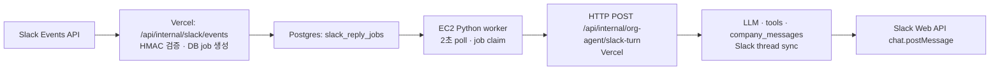
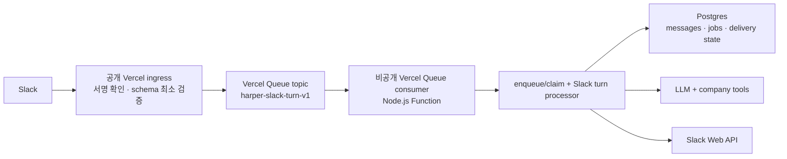

# Slack → Vercel Queue → Vercel brain 전환 구현 계획

## 0. 결정 요약

**목표 구조는 `Slack Events API → Vercel Queue → Vercel의 비공개 Queue consumer → Harper Slack turn processor → LLM / DB / Slack Web API`다.**

- Queue consumer가 호출하는 **Vercel Function**이 여기서 말하는 “Vercel brain”이다. LLM 호출, Slack thread 동기화, company-side tool 실행, 답변 저장, `chat.postMessage`는 모두 그 Function 안에서 실행한다.
- 별도 EC2/상시 Python Slack reply worker는 최종 구조에서 필요 없다. 현재 EC2는 LLM을 실행하지 않고, Postgres를 2초마다 poll해서 Vercel의 `/api/internal/org-agent/slack-turn`으로 HTTP relay하는 역할만 한다.
- `company_messages`, `company_slack_threads`, `slack_reply_jobs`는 없애지 않는다. 이들은 대화 이력, Slack event 중복 방지, 같은 thread의 최신 turn 우선, LLM 결과 저장 후 Slack 재전송을 보장하는 **업무 상태 원장**이다. 없애는 것은 DB poller이지 DB 상태가 아니다.
- Vercel Queue는 at-least-once delivery이고 순서가 엄격히 보장되지 않는다. 따라서 현재의 Postgres 기반 멱등성·supersede·응답 캐시 계약을 Queue consumer에서도 보존한다.

이 문서는 구현·전환 설계다. 이 저장소에는 Queue consumer, migration, Cron reconciler까지 준비되어 있지만, 이 문서 기준으로 **migration 적용·Vercel 배포·EC2 worker 중지는 수행하지 않았다.** 실제 production 전환은 아래의 canary/배포 순서를 따른다.

## 1. 왜 “Slack webhook에서 API를 바로 호출하고 응답을 받는” 구조가 아닌가

웹 채팅은 브라우저가 API 요청을 유지하고 HTTP 응답 또는 streaming response를 받는 모델이다. Slack Events API는 다르다.

1. Slack은 event를 Harper의 공개 URL로 전달한다.
2. Harper는 **3초 안에 2xx ACK**를 돌려줘야 한다.
3. Slack 답변은 그 HTTP response body가 아니라, 이후 Harper가 Slack Web API `chat.postMessage`를 호출해 thread에 별도로 쓴다.

따라서 LLM을 webhook request 안에서 실행하면 3초 제한을 넘겨 Slack retry가 발생하고, 같은 질문을 여러 번 실행할 위험이 커진다. Slack도 ACK를 빠르게 반환하고 event 처리는 queue에 넘기라고 권장한다. Queue/비동기 처리는 여기서 불필요한 우회가 아니라 Slack의 요청 모델에 맞는 경계다.

문제는 현재의 **queue라는 개념**이 아니라 구현 방식이다. 지금은 Postgres job table을 EC2 Python process가 2초 주기로 조회하고, 해당 process가 다시 Vercel의 internal HTTP endpoint를 호출한다. 최종 구조는 이 poll/relay를 Vercel Queue의 push delivery로 바꾼다.

## 2. 현재 구조와 제거할 비용

### 현재 실제 경로



현재 호출원은 다음과 같다.

| 생산 지점 | 현재 하는 일 | 전환 시 처리 |
| --- | --- | --- |
| `src/app/api/internal/slack/events/route.ts` | Slack 서명 확인 후 `queueHarperSlackEvent()`로 DB job 생성 | 서명 확인 후 Vercel Queue에 event envelope publish |
| `src/app/api/internal/slack/interactivity/route.ts` | 버튼 선택을 저장하고 `enqueue_slack_reply_job_v2` 호출 | 같은 DB transaction에서 job과 Queue dispatch 상태를 생성한 뒤 Queue publish |
| `src/lib/org/agent/slackRoleCreation.ts` | role-creation bootstrap turn의 DB job 생성 | 같은 job-row dispatch 경로 사용 |
| `harper_worker/slack_agent_worker.py` | DB poll, claim, retry, Vercel internal HTTP 호출 | 최종적으로 제거 |
| `src/app/api/internal/org-agent/slack-turn/route.ts` | 실제 LLM/tool/Slack 처리 | `processSlackTurn()`을 export하여 Queue consumer가 같은 Function 안에서 직접 호출; HTTP wrapper는 legacy drain 호환용 |

`slack_agent_worker.py`의 기본 poll interval은 2초다. idle 상태에서 새 job은 평균 약 1초, 최악 약 2초를 poll 대기에 쓴다. thread reply는 현재 routing과 respond를 별도 internal HTTP 요청으로 수행한다. direct mention은 worker 코드의 경로에 따라 routing을 생략할 수 있지만, EC2 poll/claim과 EC2→Vercel HTTP hop은 여전히 남는다.

### 목표 경로



Queue consumer route는 일반 public API endpoint가 아니다. `vercel.json`의 `queue/v2beta` trigger로 등록하면 Vercel Queue infrastructure만 호출할 수 있는 air-gapped Function이 된다. Slack ingress만 public endpoint로 남는다.

## 3. 최종 설계 원칙

### 3.1 역할 분리

| 계층 | 담당 | 하지 않는 일 |
| --- | --- | --- |
| Slack ingress | raw body 읽기, Slack HMAC/timestamp/app ID 검증, URL verification 응답, 정상 event의 durable publish | LLM, tool, Slack history 동기화, DB poll |
| Vercel Queue | event를 durable하게 보관·전달, 실패 delivery 재시도 | 업무 상태 판단, strict ordering 보장 |
| Queue consumer (Vercel brain) | event/job을 멱등하게 업무 job으로 만들고 claim한 뒤 Slack turn을 직접 실행 | public caller 신뢰, HTTP self-call |
| Postgres | 대화 원장, event/job dedupe, thread 최신성, cancellation, 생성된 답변·Slack timestamp 저장 | background polling으로 실행 주체가 되는 일 |
| Slack Web API | status 표시, thread 읽기, 최종 메시지 게시 | job durable state 보관 |

### 3.2 메시지에는 최소 데이터만 넣는다

topic 이름은 `harper-slack-turn-v1`으로 고정한다. payload에는 bot token, Slack signing secret, internal worker secret, full raw request header를 넣지 않는다.

```ts
type SlackTurnQueueMessage =
  | {
      version: 1;
      kind: "event";
      event: {
        apiAppId: string;
        eventId: string;
        teamId: string;
        event: {
          type: string;
          channel?: string;
          user?: string;
          ts?: string;
          eventTs?: string;
          threadTs?: string;
          text?: string;
          subtype?: string;
          botId?: string;
          files?: CompactSlackFile[];
        };
      };
    }
  | {
      version: 1;
      kind: "reply_job";
      jobId: string;
      source: "interactivity" | "role_creation_bootstrap" | "recovery";
    };
```

- `event`에는 현재 `SlackEventEnvelope`와 `compactHarperSlackFilesForQueue()`가 실제 처리에 사용하는 필드만 정규화하여 넣는다. 이 event는 이미 Slack signature를 통과한 데이터다.
- Queue operation은 4 KB 단위로 과금될 수 있으므로, 파일 metadata와 text는 현재 job에 저장하는 범위 이상을 복사하지 않는다. 현재 adapter는 file URL/token을 제거하고 field length/file count를 제한한다.
- Slack event publish의 idempotency key는 `slack:event:<event_id>`다. Slack 재시도나 ingress network ambiguity로 같은 event를 다시 publish해도 한 Vercel Queue message로 합쳐진다.
- DB에는 `slack_reply_jobs.slack_event_id` unique constraint를 계속 사용한다. Queue dedupe TTL이 끝난 뒤의 중복 delivery와 DB/Queue 경계의 재시도까지 막는 마지막 안전장치다.

### 3.3 같은 thread의 순서와 최신성은 DB가 보장한다

Vercel Queue는 at-least-once, approximate ordering이다. 따라서 “같은 thread가 항상 FIFO로 실행된다”는 가정을 하면 안 된다.

기존 `enqueue_slack_reply_job_v2`를 순서 안전하게 재정의하고, single-job `claim_slack_reply_job_v3`를 다음 계약으로 둔다.

1. `(slack_event_id)`는 한 번만 insert한다.
2. 새 trigger의 `slack_message_ts`가 기존 pending/processing trigger보다 **실제로 더 최신일 때만** 기존 job을 supersede한다. DB insert time으로 최신성을 판단하지 않는다.
3. 늦게 도착한 과거 event는 context는 저장할 수 있으나, 더 최신 job을 취소하거나 새 LLM 답변을 만들지 않는다.
4. consumer는 job ID를 받은 뒤 atomic claim을 한다. 이미 completed/ignored/superseded이거나 다른 정상 consumer가 lease를 보유한 job은 ACK하고 끝낸다.
5. 실행 중 supersede되면 현재의 job watcher/`AbortSignal` 계약처럼 tool/Slack post 직전에 취소를 다시 확인한다.

이렇게 하면 서로 다른 thread는 병렬 처리하면서도, 하나의 thread에서는 과거 event가 뒤늦게 와서 최신 답변을 덮어쓰지 않는다. 초기에는 대규모 ordering system을 추가하지 않는다.

### 3.4 “한 번 실행”이 아니라 “중복돼도 한 번만 보이게” 만든다

Queue가 timeout이나 infra failover 뒤 동일 message를 다시 줄 수 있다. 다음 순서를 유지한다.

1. job을 claim하고 Slack thread/history를 동기화한다.
2. LLM/tool 결과와 assistant `company_messages`를 DB에 먼저 저장한다.
3. 저장된 `response_text`가 있으면 LLM/tool은 다시 실행하지 않는다.
4. Slack `chat.postMessage` 성공으로 받은 `slack_response_ts`를 저장한다.
5. job을 `completed`로 표시하고 Queue message를 ACK한다.

3~4 사이에 Function이 죽어도 retry는 생성된 답변만 다시 Slack에 보내며, `slack_response_ts`가 있으면 다시 post하지 않는다. 이것이 Queue만으로는 제공하지 않는 Slack 사용자 관점의 exactly-once 효과다.

## 4. 구현 단위

### 단계 A — 사전 확인 및 고정할 운영값

코드 변경 전에 다음을 실제 Vercel production project에서 확인한다.

- Vercel Queues public beta 사용 권한과 production team/billing 상태
- 현재 Vercel Function plan, Fluid Compute 활성 여부, `maxDuration` 상한
- 현재 Vercel Function 실행 region과 Supabase primary region. Queue는 producer/consumer와 가까운 같은 region으로 둔다. 데이터가 Queue region의 3 AZ에 복제된다는 점과 regional failover 시 인접 region을 잠시 사용할 수 있다는 점도 보안 검토에 포함한다.
- Slack event의 실제 최대 payload/file metadata 크기와 최근 Slack turn p50/p95/p99 실행 시간
- 현재 production `slack_reply_jobs` RPC/schema가 migration source와 실제로 일치하는지. migration history의 모양만 보고 live schema 변경을 추측하지 않는다.

초기 운영값은 아래로 시작한다. production plan/observed data가 다르면 이 값을 조정하고 문서의 값을 같이 갱신한다.

| 설정 | 초기값 | 근거 |
| --- | ---: | --- |
| consumer Function runtime | Node.js | 현재 Slack turn과 동일한 SDK/runtime |
| `maxDuration` | 300초 | 현재 Slack turn route와 동일한 안전한 출발점 |
| Queue visibility lease | 390초 | 300초 Function 종료보다 길게 두되, crash 뒤 stale-lease(360초) 복구가 불필요하게 오래 막히지 않게 함 |
| failed message retry delay | 5~300초 | capacity는 5초, 일반 오류는 exponential backoff. trigger fallback은 60초 |
| Queue message retention | 24시간 | Vercel Queue 상한 범위에서 retry/debug window 확보 |
| 최대 실제 LLM turn concurrency | 20 | DB의 atomic claim cap으로 강제. 현재 Queue beta SDK/trigger 설정에는 검증된 concurrency field를 추가하지 않음 |
| job retry budget | 실제 LLM claim 5회 | broker delivery 횟수가 아니라 DB `attempt_count`로 판단하여 capacity/중복 delivery가 예산을 소진시키지 않게 함 |

Vercel Queue의 beta configuration field는 변할 수 있으므로, 구현하는 날 최신 SDK와 `vercel.json` schema에서 consumer concurrency 설정 이름을 확인한다. 이름을 추측해 설정하지 않는다.

### 단계 B — Queue adapter와 비공개 consumer 추가

새 파일/책임은 다음처럼 둔다.

| 위치 | 변경 | 책임 |
| --- | --- | --- |
| `src/lib/org/slackTurnQueue.ts` | 신규 | typed payload validation, `@vercel/queue` publish, idempotency key 생성 |
| `src/app/api/queues/process-slack-turn/route.ts` | 신규 | `handleCallback` 기반 private push consumer, schema 검증, processor 호출, retryable error 전달 |
| `vercel.json` | 수정 | 새 route에 `queue/v2beta` trigger, topic, retry delay 등록 |
| `package.json` / lockfile | 수정 | 현재 안정 버전의 `@vercel/queue` 추가 |

consumer route는 `requireInternalWorkerSecret()`을 쓰지 않는다. 그 secret은 EC2가 public-ish internal route를 호출하기 위해 필요했던 인증이다. Queue trigger의 Vercel-only invocation과 typed schema validation이 새 경계다. 다른 internal API에서 해당 secret을 쓸 수 있으므로 이 단계에서 전역으로 제거하지 않는다.

예상되는 Vercel 설정의 형태는 아래이며, 정확한 beta 옵션은 구현 시 SDK/문서 버전에 맞춘다.

```json
{
  "functions": {
    "app/api/queues/process-slack-turn/route.ts": {
      "experimentalTriggers": [
        {
          "type": "queue/v2beta",
          "topic": "harper-slack-turn-v1",
          "retryAfterSeconds": 60,
          "initialDelaySeconds": 0
        }
      ]
    }
  }
}
```

이 trigger가 붙은 route에는 public URL이 없어야 한다. 일반 browser/curl에서 200을 받는 endpoint로 만들지 않는다.

### 단계 C — HTTP controller의 Slack turn processor를 직접 호출 가능하게 분리

현재 `src/app/api/internal/org-agent/slack-turn/route.ts`의 orchestration은 `processSlackTurn()`으로 export했다. Queue consumer가 이를 직접 호출하고, 기존 `POST` route는 EC2 drain 기간의 호환 wrapper로만 남긴다. 추후 route module과 service module을 물리적으로 분리할 수 있지만, 이번 전환에서 HTTP self-call은 이미 제거된다.

```text
src/app/api/internal/org-agent/slack-turn/route.ts
  processSlackTurn({ jobId, phase, publicSiteUrl })
  POST (이행 중 internal-secret 호환 wrapper)

src/app/api/queues/process-slack-turn/route.ts
  Queue callback → processSlackTurn 직접 호출
```

`processSlackTurn`은 다음을 한 invocation 안에서 수행한다.

1. atomic single-job claim/lease와 terminal 상태 확인
2. channel, integration, thread, caller membership/role 검증
3. direct mention은 router 생략, managed thread reply만 `decideHarperSlackThreadReply`로 respond/ignore 판단
4. Slack `conversations.replies` 동기화, 파일 정보 보강, `company_messages` 기록
5. 기존 `runOrgAgentChat` 또는 `runOrgRoleCreationChat`, 기존 company-side tools 실행
6. response cache → Slack post → completion 순서로 durable finalize
7. superseded/ignore/access-denied는 정상 ACK outcome으로, transient DB/Slack/model 오류는 retryable outcome으로 구분

기존 worker의 `route`/`respond` 두 HTTP phase를 Queue consumer에서 다시 HTTP로 부르지 않는다. 논리적인 routing과 response 단계는 남지만 같은 Function/service 안에서 이어 실행한다. 이로써 EC2→Vercel hop과 phase 사이의 중복 route load/auth/HTTP round trip이 없어진다.

### 단계 D — event ingress를 Queue-first로 전환

`src/app/api/internal/slack/events/route.ts`의 최종 책임은 다음으로 좁힌다.

1. raw body, timestamp, signature 검증
2. JSON parse와 `url_verification` response
3. `api_app_id` 확인
4. 필요한 event fields만 `event` queue message로 정규화
5. `send("harper-slack-turn-v1", payload, { idempotencyKey })`가 성공한 뒤 200 반환

`queueHarperSlackEvent()`의 현재 채널 판별/job insert/mention status 생성 코드는 consumer 쪽 domain service로 옮긴다. Queue publish가 성공하지 않으면 ingress는 5xx를 반환해서 Slack이 재전달하게 한다. Queue accept 뒤에는 200을 즉시 반환한다.

Slack의 URL verification은 queue에 넣지 않는다. `app_uninstalled`도 같은 event Queue로 보내 consumer가 installation을 revoke하게 하며, LLM job을 만들지 않는다.

`after()`로 하던 “답변 작성 중” status 표시는 durable processing의 근거가 아니므로 consumer가 channel/integration을 확인한 뒤 best-effort로 처리한다. status 실패는 event ACK나 job 처리 실패로 취급하지 않는다.

### 단계 E — 버튼/role bootstrap producer도 Queue로 통일

Slack button interactivity는 user action을 즉시 검증·저장하고 Slack에 ACK해야 한다. 해당 database write를 모두 Queue-first로 바꾸면 user choice가 queue delivery 실패 시 사라질 수 있다. 따라서 이 두 producer에는 **기존 `slack_reply_jobs` 행에 붙이는 transactional outbox 상태**를 쓴다. 새 Supabase table은 만들지 않는다.

| producer | transaction에서 보장할 것 | commit 뒤 즉시 할 일 | 드문 publish 실패의 복구 |
| --- | --- | --- | --- |
| role quick action 등 `slack/interactivity` | action state + `slack_reply_jobs`의 dispatch 상태 | `reply_job` message publish | job-row dispatch reconciler가 재publish |
| `slackRoleCreation` bootstrap | bootstrap message + `slack_reply_jobs`의 dispatch 상태 | `reply_job` message publish | job-row dispatch reconciler가 재publish |

별도 `slack_queue_dispatch_outbox` table은 만들지 않는다. `slack_reply_jobs`에 `queue_dispatch_status`, `queue_dispatch_attempt_count`, `queue_dispatched_at`, `queue_last_error`, `queue_next_attempt_at`, `queue_source` 같은 nullable dispatch columns를 추가한다. job RPC가 job과 이 상태를 **같은 transaction**에서 만든다. 이 job-row outbox가 DB→Vercel Queue dual-write gap을 메운다.

- Slack interactivity는 commit 뒤 즉시 `after()`에서 publish하여 3초 ACK SLA를 막지 않는다. 정상 경로에는 Cron 대기가 없다.
- publish 성공을 기록하기 전 request가 끊겨도 같은 `jobId`/attempt idempotency key로 재시도한다.
- request path publish가 실패하면 Slack interactive ACK 자체를 불필요하게 오래 붙잡지 않는다. 같은 job의 dispatch 상태를 `retryable`로 남긴다.
- Vercel Cron은 5분 간격의 **예외 복구/경보**로만 dispatch pending job을 batch publish한다. EC2의 2초 poller를 재현하지 않는다. 정확한 cron 최소 주기는 현 Vercel plan에서 확인한다.
- reconciler가 일정 횟수 넘게 실패한 dispatch job은 alert를 내고, `slack_reply_jobs`를 무한 pending으로 숨기지 않는다.

### 단계 F — retry와 timeout 계약

Queue consumer의 callback은 아래처럼 outcome을 구분한다.

| outcome | Queue 처리 | DB job 상태 |
| --- | --- | --- |
| completed, ignored, access denied, superseded, terminal duplicate | 정상 ACK | completed/ignored 또는 기존 terminal state |
| 새 job이 아직 processing인 중복 delivery | 5초 뒤 재전달 | ACK하지 않음. 원래 Function이 죽으면 stale lease 뒤 이 message가 recovery claim |
| 20개 LLM claim cap 도달 | 5초 뒤 재전달 | 아직 `queued`이며 retry/LLM attempt 예산을 소진하지 않음 |
| 일시적 Slack 429/5xx, DB 연결 오류, model provider 일시 오류 | callback 실패로 반환하여 Queue retry | retry와 다음 시각/오류를 기록 |
| LLM 결과 저장 후 Slack 전송 실패 | retry | 생성된 response cache 유지; 다음 시도는 Slack delivery만 수행 |
| validation 오류, disabled channel, revoked installation | 정상 ACK | 필요하면 ignored/audit 기록 |
| retry budget 소진 | 정상 ACK 후 failed/alert | failed + 원인 보존 |

Vercel Queue의 기본 visibility timeout은 60초이므로 LLM consumer에 그대로 쓰면 안 된다. 300초 Function이 아직 실행 중인데 60초 후 같은 message가 다시 전달될 수 있다. visibility lease는 Function max duration보다 긴 390초로 둔다.

Queue가 at-least-once이므로 delivery count는 LLM 시도 횟수와 같지 않다. capacity 또는 fresh in-flight duplicate는 5초 재전달만 요청하고 DB attempt를 증가시키지 않는다. 반대로 실제로 claim한 LLM turn만 DB `attempt_count`를 증가시키며, 5회에 도달하면 job을 `failed`로 남기고 ACK한다. 이 terminal 상태 기록이 일시적으로 실패했을 때는 delivery count가 높아도 ACK하지 않고 재전달한다. interaction/bootstrap의 `queue_dispatch_attempt_count`는 **연속 Queue publish 실패**만 세며, publish 성공 시 0으로 되돌린다.

300초를 넘는 한 번의 Slack turn은 Function timeout으로 끝날 수 있다. 그래서 processor에는 270초 내에 LLM/tool을 종료·저장하는 application time budget을 두고, response cache를 먼저 저장한다. 관측 결과 정상 turn이 300초에 근접하면 그때만 다음 두 옵션 중 하나를 선택한다.

1. prompt/context/tool loop를 줄여 300초 budget 안으로 맞춘다.
2. Vercel plan과 Fluid Compute max duration을 확인한 뒤 consumer에 더 큰 `maxDuration`을 설정한다. Pro/Enterprise의 일반 상한은 현재 최대 800초지만, 이 값은 plan과 Vercel 정책에 따라 재확인한다.

timeout은 “답변이 즉시 유실된다”는 뜻은 아니다. consumer가 ACK하지 못하면 Queue가 다시 전달하고, DB response cache가 있으면 LLM을 다시 실행하지 않는다. 다만 매번 time budget을 넘는 요청은 결국 실패하므로 timeout metric과 alert가 필요하다.

### 단계 G — 안전한 점진 전환과 롤백

한 event를 DB poller와 Vercel Queue 양쪽에 동시에 실행하면 중복 답변 위험이 있다. shadow execution은 LLM/tool/Slack post 없이 payload validation과 routing까지만 허용한다.

1. **준비 배포**: Queue adapter, private consumer, processor extraction, schema/RPC/outbox, tests를 배포한다. 이 시점부터 ingress event는 Queue를 거치지만, `production` target의 job은 consumer가 DB에 만든 뒤 기존 EC2 poller만 처리한다.
2. **격리된 Slack test workspace/channel**: 기존 `company_slack_channels.worker_target`을 `vercel_queue`로 설정한 전용 test channel에서만 Queue consumer가 job을 claim하게 한다. production 일반 channel은 기존 `production` target을 유지한다.
3. **실제 low-volume smoke**: mention, managed thread reply, ignored reply, button, role bootstrap, retry delivery를 검증한다. Queue message/job/Slack response trace ID가 하나로 연결되는지 확인한다.
4. **채널 단위 확대**: 이상이 없을 때 workspace/channel 단위로 `worker_target = vercel_queue`를 선택한다. 기존 route-change RPC는 processing job이 있으면 전환을 거부하고 queued/retry job만 잠금 아래 전환한다. ingress event는 Queue를 거쳐 job을 만들지만, job target이 `production`이면 EC2만, `vercel_queue`면 Queue consumer만 claim하므로 한 job을 양쪽이 실행하지 않는다.
5. **전면 cutover**: 모든 활성 채널을 Vercel Queue로 옮긴다. 이후 새 DB-poller job 생성을 중지하고, 기존 `db_poller` job이 terminal state가 될 때까지 EC2는 그대로 둔다.
6. **drain 확인**: production 대상의 queued/processing/retry legacy job 수가 0인지, stale lock가 없는지, consumer failure/timeout이 기준 이하인지 확인한다.
7. **별도 제거 배포**: 그 후에만 `harper_worker` service, `worker_target`, bulk claim RPC, `/api/internal/org-agent/slack-turn`의 worker-only auth/wrapper와 관련 운영 문서를 제거한다. 같은 배포에서 enable과 deletion을 동시에 하지 않는다.

**롤백**은 channel의 `worker_target`을 `production`으로 되돌리고 EC2 worker를 계속 실행하는 방식이다. queue message가 이미 accept된 경우 consumer는 job target/terminal state를 확인해 duplicate Slack post를 하지 않는다. Queue 자체에만 있던 event를 잃지 않도록, rollback은 consumer와 DB idempotency가 배포된 상태에서만 허용한다.

Vercel push Queue는 deployment ID별로 메시지를 분리하고, publish한 deployment가 같은 deployment의 consumer로 받는다. 배포 중 schema 호환성이 섞이지 않는 장점이 있으므로, payload의 `version: 1`을 유지하고 breaking change는 새 version/topic으로 낸다.

### 단계 H — local/staging 운영 변경

현재 `worker_target`은 production job을 developer의 local worker로 route하는 용도로도 쓰인다. Vercel Queue push mode에서는 이 방식이 그대로 성립하지 않는다.

- local/preview 검증에는 **별도 Slack test app/workspace/channel 및 별도 Vercel development/preview Queue**를 쓴다.
- production Slack event나 customer channel을 developer local consumer로 route하지 않는다.
- Vercel Queue의 local development 동작과 preview deployment partition을 사전 검증한다.
- company-side E2E가 role fixture를 필요로 하면 workspace의 internal-role isolation 계약을 따른다. `testOnly=true`, stable `testFixture`, allowlisted `testTalentIds` 없이 test role을 만들거나 talent matching path에 섞지 않는다. 가능한 경우 role 생성 없이 일반 Slack 도움 질문으로 smoke한다.

## 5. DB/RPC 변경 상세

### 유지하는 것

- `company_messages`의 Slack 대화 원장과 metadata
- `company_slack_threads`의 managed-thread / role-creation 상태
- `slack_reply_jobs`의 `slack_event_id` unique dedupe, prompt/files, response cache, `slack_response_ts`, 오류 감사 기록
- `finalize_slack_company_agent_reply_v1`의 “DB response 저장 뒤 Slack 전송, Slack timestamp 뒤 completed” 보장

### 추가/수정하는 것

| 대상 | 변경 |
| --- | --- |
| `company_slack_channels.worker_target` | 이미 있는 channel routing 값을 그대로 사용. `production`은 EC2 poller, `vercel_queue`는 Vercel Queue consumer이며 migration 자체는 값을 일괄 전환하지 않음 |
| `slack_reply_jobs` | trigger Slack timestamp 기반 최신성, 그리고 **새 table 없이** interactivity/bootstrap의 Queue dispatch 상태·시도 횟수·오류·다음 시각을 nullable columns로 추가. Queue message ID/delivery count는 Vercel metadata와 log correlation으로 남김 |
| 기존 `enqueue_slack_reply_job_v2` + insert trigger | 기존 event dedupe/job 생성 계약은 유지하고, trigger가 `vercel_queue` job에 dispatch 상태를 같은 insert transaction에서 arm |
| `claim_slack_reply_job_v3` | 특정 job을 consumer가 atomic lease. legacy bulk polling claim과 분리 |
| finalize/discard RPC | 새 lease/delivery ID를 확인하고, 다른 delivery가 완료/취소한 job을 덮어쓰지 않도록 조건 강화 |

`worker_target`과 기존 bulk claim RPC는 첫 Queue 배포에서 삭제하지 않는다. legacy drain이 끝난 뒤의 제거 작업이다. DB migration은 production schema를 inspect한 뒤 additive하게 작성하며, migration history 부재만으로 live schema가 없다고 가정하지 않는다.

## 6. 관측성, 비용, 보안

### 필수 trace와 metric

모든 로그/metric에는 prompt나 답변 원문 대신 아래 식별자와 시간만 남긴다.

```text
slack_event_id
queue_message_id
queue_delivery_attempt
slack_reply_job_id
company_workspace_id
slack_channel_id
slack_thread_ts
producer_published_at
consumer_started_at
job_claimed_at
llm_started_at / llm_completed_at
slack_posted_at
outcome / error_class
```

대시보드/alert 기준은 다음이다.

- ingress ACK p95와 Slack 3초 timeout 비율
- Queue publish 실패, queue age, redelivery 수, job-row dispatch backlog
- consumer p50/p95/p99, timeout 수, retry budget 소진 수
- Slack 429/5xx, model provider 오류, duplicate/superseded 비율
- `response_text`가 이미 있어 delivery만 재시도한 수
- Queue operation 수, Function invocation/active CPU/provisioned memory, EC2 종료 전후 월 비용

### 비용의 실제 변화

Queue 자체는 Vercel의 관리형 서비스 비용이 추가된다. 현재 공시상 Queue API operation은 region에 따라 대략 **$0.60~$0.96 / 100만 operation**부터이고, publish·delivery·retry가 operation을 만든다. 이 규모에서 가장 큰 비용 변수는 Queue가 아니라 LLM token/model 사용량이다.

현재 LLM과 tools는 이미 Vercel Slack turn Function에서 실행된다. 따라서 이행으로 “LLM이 새로 Vercel에서 돌아서” 큰 compute 비용이 생기는 것은 아니다. 오히려 EC2 상시 비용과 poll request, EC2→Vercel relay, thread reply의 별도 phase invocation을 줄인다. 반면 Queue consumer Function은 Function invocation과 실행 중 provisioned memory 비용을 사용한다.

Fluid Compute에서 model/DB/Slack API를 **기다리는 시간은 active CPU 과금에는 포함되지 않지만**, Function instance의 provisioned memory는 요청이 끝날 때까지 과금된다. low-volume 환경에서는 `maxDuration`을 필요 이상으로 길게 두거나 consumer concurrency를 무제한으로 두지 않는 이유다.

### 보안 경계

- 공개 ingress에서만 Slack signing secret HMAC과 request timestamp를 검증한다.
- Queue에는 secret/token을 넣지 않는다. bot token은 consumer가 기존 encrypted integration record에서 읽고 복호화한다.
- Queue consumer는 Vercel trigger로만 호출 가능하게 하고, 일반 public route/HTTP bearer secret으로 열지 않는다.
- Queue payload와 observability log는 company-side message 내용을 최소화한다. Vercel Queue region과 failover data residency 특성을 security review에 남긴다.
- 기존 Slack membership/Owner/Admin 권한 검증은 processor 안에 남긴다. Queue라는 내부 호출자라는 이유로 user-level access control을 우회하지 않는다.

## 7. 검증 계획 및 완료 기준

### 단위/contract test

- Slack signature를 통과한 payload만 Queue publish하는지, `url_verification`은 즉시 응답하는지
- `event_id` idempotency key와 DB unique dedupe가 모두 동작하는지
- Queue consumer가 public/internal HTTP `fetch`로 slack-turn route를 호출하지 않고 service를 직접 부르는지
- `app_mention`, managed thread reply, `reply_to_harper_threads=false` context-only reply, bot/subtype/disabled channel/revoked integration이 기존 정책을 유지하는지
- interactivity와 role-creation bootstrap이 job + job-row dispatch 상태를 원자적으로 만들고 중복 click에도 한 turn만 만들지
- out-of-order 같은-thread events에서 과거 message가 최신 job을 supersede하지 않는지
- concurrent duplicate delivery에서 claim 하나만 LLM을 실행하는지
- LLM response 저장 후 Slack post가 실패했을 때 재시도에 LLM/tool을 다시 실행하지 않는지
- timeout/supersede 시 Slack post 직전에 abort/terminal check를 수행하는지

### isolated integration test

전용 Slack test workspace/channel과 non-production Supabase/Vercel environment에서 다음을 한다.

1. `@Harper` 질문 → 3초 이내 Slack ACK → Queue message → one job → one thread 답변
2. 서로 다른 20개 thread의 mock turn → consumer concurrency 20과 claim 경계 확인; 실제 LLM smoke는 별도 3개 thread에서 각각의 답변 확인
3. 같은 thread에서 빠른 두 질문 → 최신 trigger만 유효하고 과거 event가 최신 답변을 취소하지 않는지 확인
4. managed thread 일반 댓글/mention 정책이 기존과 같은지 확인
5. 버튼 선택 및 role-creation bootstrap → job-row dispatch publish와 response 확인
6. consumer를 의도적으로 transient failure시키기 → Queue redelivery 및 cached response delivery 확인
7. consumer가 300초 timeout 또는 deploy interruption을 만났을 때 no duplicate Slack post / recovery 확인
8. public internet에서 consumer route 호출이 차단되는지 확인

### production canary 완료 기준

- dedicated low-risk channel에서 실제 Slack event 20건 이상을 처리했을 때 missing reply/duplicate post가 0건
- ingress ACK p95가 1초 이하이고 Slack retry header가 정상 범위
- Queue consumer timeout 0건, retry budget exhausted 0건, job-row dispatch backlog 0건
- 같은 thread 순서/취소 정책과 Owner/Admin access denial이 현행과 일치
- Vercel Functions/Queue 비용과 EC2 비용을 한 주기 비교하여 예상 밖 증가가 없는지 확인
- legacy job이 0이고, rollback runbook을 실제 canary channel에서 한 번 검증

## 8. 배포 순서와 운영 체크리스트

이 작업을 실제 배포로 진행할 때는 별도 명시적 배포 승인을 받고 다음 순서를 따른다.

1. production project/plan/region/Queue beta 권한을 확인한다.
2. schema가 additive한 migration, Queue consumer, queue adapter, processor extraction, tests를 준비한다.
3. short targeted build/type/test와 isolated Queue/Slack integration test를 통과시킨다.
4. Queue consumer가 포함된 web revision을 배포하되, production producer는 기존 backend로 유지한다.
5. isolated channel을 `vercel_queue`로 canary 전환하고 end-to-end trace/rollback을 확인한다.
6. channel 단위로 확대한다. 어느 순간에도 같은 event를 두 execution backend가 Slack post까지 실행하게 하지 않는다.
7. 전체 cutover 뒤 legacy job drain을 확인한다.
8. EC2 service는 먼저 중지하지 않는다. legacy drain과 rollback window를 통과한 **다음 별도 배포**에서 제거한다.
9. 배포가 성공했을 때만 deployed revision과 실제 runtime behavior를 기준으로 관련 Notion 문서를 갱신한다. 배포 전/실패 배포에서는 Notion을 live behavior처럼 갱신하지 않는다.

## 9. 명시적인 답변

- **동시에 여러 메시지가 처리될 수 있나?** 예. Queue consumer가 여러 message를 병렬로 실행할 수 있고, 초기에는 서로 다른 thread 기준 최대 20개로 시작하되 같은 thread의 최신성·중복은 DB claim/supersede로 안전하게 처리한다.
- **기존 방식에 비해 줄어드는 network 또는 latency는?** EC2의 2초 DB polling 대기와 EC2→Vercel internal HTTP relay, thread reply의 별도 phase HTTP round trip이 사라지며, Queue delivery가 추가되더라도 보통 LLM/Slack API 시간이 훨씬 커서 사용자 체감 latency는 줄거나 최소한 더 예측 가능해진다.
- **Vercel 비용·제한시간 문제는?** Queue operation과 Function memory 비용은 추가되지만 low-volume에서는 크지 않고 EC2 상시 비용/중복 invocation은 줄며, 다만 현재 `maxDuration=300`이면 5분을 넘는 단일 LLM turn은 종료되므로 270초 time budget·재시도/응답 캐시를 두고 필요 시 plan을 확인해 duration을 늘려야 한다.

## 10. 근거 문서

- [Slack Events API — acknowledgement, retry, queue 권고](https://docs.slack.dev/apis/events-api/)
- [Vercel Queues — push consumer, delivery semantics, security, deployment partition](https://vercel.com/docs/queues)
- [Vercel Queues concepts — at-least-once와 idempotency](https://vercel.com/docs/queues/concepts)
- [Vercel Queue API — retention, delay, idempotency](https://vercel.com/docs/queues/api)
- [Vercel Function duration limits](https://vercel.com/docs/functions/configuring-functions/duration)
- [Vercel Fluid Compute pricing](https://vercel.com/docs/functions/usage-and-pricing)
