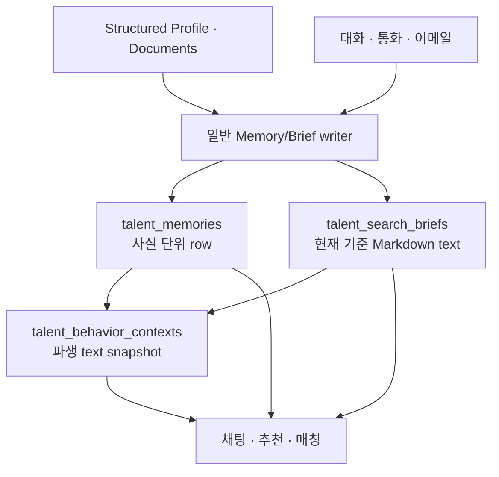

# Talent Memory와 Search Brief 구현 계획

문서 상태: 구현 전 설계안  
작성 기준: 2026-09-03  
적용 범위: `harper_beta/` Career 웹·채팅·통화·프로필, `harper_worker/opp`의 추천/매칭 context  
관련 문서: [High-end AI Career Agent 제품 제안](./high-end-ai-career-agent-product-plan-2026-07-02.md), [Behavior Context 구현 계획](../../harper_worker/docs/behavior_context_implementation_plan_20260812.md)

## 1. 결론: Memory는 행, Brief는 문서로 둔다

최종 권고는 다음 hybrid 구조다.

| 구성 | 저장 모델 | canonical인 것 | 이유 |
| --- | --- | --- | --- |
| **Memory** | 일반적인 Memory row의 집합 | 장기 사실·과거 맥락·출처·시점·정정 관계 | 사실 하나를 잃지 않고, 수정·archive·source 확인·관련 retrieval을 안전하게 하기 위해서 |
| **Search Brief** | Talent당 하나의 Markdown `text` 문서 | 현재 기회 탐색 기준의 사람 친화적 표현 | 사용자가 읽고 고치기 쉽고, chat/recommendation prompt에 그대로 넣을 수 있어서 |
| **Behavior Context** | Talent당 하나의 파생 `context_text` | 없음 | Brief·Memory·최근 활동에서 만든 bounded working snapshot이므로 언제든 재생성 가능해서 |

즉 “Memory와 Brief가 각각 한 덩어리 text여야 한다”는 방향은 **Brief에는 맞지만 Memory에는 맞지 않는다.** Memory를 한 문서로 두면 현재 기준을 고칠 때 과거 사실을 덮어쓰거나, 출처·시점·정정·삭제를 문단 수준에서만 다뤄야 한다. 사용자가 처음 지적한 “고급 정보가 사라진다”는 문제를 가장 잘 막는 저장 단위는 Memory row다.

반대로 Brief를 row 목록으로만 만들면 “Harper가 지금 이런 기준으로 기회를 찾고 있다”는 사용자 경험이 key/value 또는 카드 나열로 돌아간다. Brief는 현재 기준을 짧은 Markdown으로 읽을 수 있는 하나의 문서여야 한다. 이 문서는 매번 새로 생성하지 않고 **section patch**로만 갱신한다.

이 선택은 일반적인 제품 경계와도 맞는다. Notion도 자유 서술은 page/block content로, 날짜·관계 같은 시스템 데이터는 properties로 나눈다. [Notion의 page content와 properties 구분](https://developers.notion.com/guides/data-apis/working-with-page-content) ATS인 Greenhouse도 후보자의 workflow·offer·문서·활동 feed·note를 분리해 다룬다. [Greenhouse candidate profile](https://support.greenhouse.io/hc/en-us/articles/30352015432987-Candidate-profile-redesign-overview) ChatGPT도 대화와 별도로 관리·삭제할 수 있는 saved memory를 두고, 개별 memory의 우선순위·삭제·history를 제공한다. [OpenAI Memory FAQ](https://help.openai.com/en/articles/8590148-memory-faq/)

Harper는 ATS처럼 사건별 table을 만들지 않는다. 다만 **원자적인 기억**과 **현재 탐색 설명문**을 같은 text blob으로 혼합하지 않는다.

## 2. 왜 세 대안 중 hybrid인가

| 대안 | 장점 | 결정적 단점 | 판단 |
| --- | --- | --- | --- |
| Memory·Brief 모두 단일 Markdown 문서 | schema가 매우 단순하고 사람에게 읽기 좋음 | Memory의 출처, 시점, 삭제, 동시 수정, 관련 retrieval이 문단 patch에 의존. 과거 사실을 보존하기 어렵고 문서가 커질수록 writer가 위험해짐 | 선택하지 않음 |
| Memory·Brief 모두 row | write와 provenance가 강하고 partial read가 쉬움 | Brief까지 슬롯/카드 목록이 되어 사용자가 현재 기준을 한눈에 읽기 어렵고, 정성적 기준의 맥락이 분절됨 | 선택하지 않음 |
| **Memory row + Brief Markdown** | Memory는 잃지 않고 관리하며, Brief는 짧고 읽기 쉬움. read/write 비용을 각각 최적화 가능 | 두 원본의 동기화 계약이 필요 | **선택** |

이 설계에서 새 persistence가 정당화되는 irreducible durable fact는 분명하다.

- Memory row: “Talent가 직접 말했거나 제공한 자료에서 확인된 이 사실이, 언제 어떤 source에서 왔고 지금도 유효한가.” 이 사실은 text 문서만으로 안전하게 읽고 고치기 어렵고, Memory reader·삭제 UI·Behavior Context builder가 직접 필요로 한다.
- Brief text: “Talent에게 지금 적용 중이라고 보여 준 현재 탐색 기준의 문장.” 이 문서는 UI와 recommendation prompt가 직접 읽는다. 과거 Memory를 매번 다시 요약해 만들지 않기 위해 별도 current-state text가 필요하다.
- Brief–Memory binding: “이 Brief의 어느 문단이 어떤 Memory 사실을 현재 기준으로 사용하고 있는가.” Memory archive·정정 시 정확히 영향받는 Brief fragment만 patch하기 위해 필요하다. 이 관계는 user-visible Markdown이나 일반 prompt에 들어가지 않는다.

추천 rationale, 대화 계획, intent score 같은 transient LLM 판단은 저장하지 않는다.

## 3. 전체 모델



### 3.1 원본의 경계

- **Memory**: Profile이나 Document 자체가 아닌 장기 사실·맥락의 원본이다. 과거 offer, 인터뷰, 네트워크 접촉, 이전 선호, 설명 가능한 추천 거절 이유도 모두 같은 일반 Memory row로 저장한다. Career timeline table은 만들지 않는다.
- **Brief**: 현재 탐색 기준의 원본이다. 역할, 지역, 근무 방식, 꼭 필요한 조건, 피하고 싶은 조건, 회사·팀 선호 등 현재 적용해야 할 내용을 자연어로 설명한다.
- **Behavior Context**: Memory와 Brief를 다시 압축한 cache다. 원본을 대체하지 않는다.
- **운영 state**: 지원/연결/동의/회사 답변/차단 회사/구독 설정/공개 범위는 기존 구조화된 table이 원본이다. Memory나 Brief 문장으로 이를 우회하지 않는다.

현재 기준이 변하면 과거 Memory를 삭제하지 않는다. 새 사실을 추가하거나 이전 Memory를 supersede하고, Brief의 해당 문장만 바꾼다. 과거 사건만 말하면 Brief는 바뀌지 않는다.

## 4. Memory row의 최소 계약

Memory는 scenario별 type을 갖지 않는 한 종류의 row다. `offer`, `interview`, `career_timeline`, `company_rejection` 같은 table이나 enum을 만들지 않는다.

```text
talent_memories
  id                         uuid PK
  talent_id                  uuid FK -> talent_users
  content                    text
  authority                  user_statement | imported_source
  source_refs                jsonb
  occurred_at                timestamptz null
  status                     active | superseded | archived
  supersedes_memory_id       uuid null self FK
  created_at / updated_at    timestamptz
  archived_at                timestamptz null
```

필드의 목적은 최소한이다.

- `content`: 하나의 읽을 수 있는 사실 또는 맥락. 사용자가 직접 쓴 표현은 최대한 보존한다.
- `authority`: 사용자가 직접 말했는지, 사용자가 제공한 document에서 온 사실인지 구분한다. 모델의 추론만으로 별도 canonical row를 만들지 않는다.
- `source_refs`: 원 대화·문서·profile row를 찾기 위한 provenance다. prompt에는 raw internal id를 넣지 않는다.
- `occurred_at`: 과거와 현재를 구분하기 위한 보조 정보다. workflow stage가 아니다.
- `status`와 `supersedes_memory_id`: 정정이나 변화가 생겨도 과거 사실을 조용히 덮어쓰지 않기 위한 최소 관계다.

`search_use`, 품질 score, intent, confidence, recommendation reason, scenario kind 같은 추가 의미 column은 두지 않는다. “지금 탐색에 쓰이는가”는 Brief 문서가 담당한다.

### 4.1 Brief–Memory binding과 turn-local ref

Brief 문장 안에 Memory UUID, `<!-- memory: ... -->` comment, 또는 영구 숫자를 넣지 않는다. 이는 문서를 구현 세부사항으로 오염시키고, 모든 Brief read에서 불필요한 token을 쓴다.

대신 server는 아래와 같은 작은 binding만 별도로 유지한다.

```text
talent_search_brief_memory_links
  talent_id
  memory_id
  fragment_key              -- opaque server-side fragment address
  fragment_hash             -- current exact fragment fingerprint
  brief_revision
```

이는 “이 Memory가 현재 Brief의 이 fragment를 뒷받침한다”는 최소 관계다. 새로운 scenario나 LLM 판단을 저장하는 table이 아니다. Memory archive·정정과 Brief patch executor가 실제로 이 관계를 읽으므로, 별도 persistence의 이유가 분명하다.

LLM에는 실제 UUID를 주지 않는다. Memory를 수정하는 writer turn에서만, server가 해당 요청에 한정된 짧은 ref를 붙여 준다.

```text
Relevant memories
[1] 2026년 기준 초기 스타트업을 더 선호한다고 확인했다.
[2] 서울 또는 원격 근무를 선호한다.
[3] 계약직 역할은 검토하지 않는다.
```

`[1]`은 이번 tool execution에서만 유효한 alias이고, server가 실제 `memory_id`로 해석한다. 일반 chat/recommendation prompt와 Brief Markdown에는 이 ref조차 넣지 않는다. 새 Memory는 같은 tool call 안에서 `new-1`처럼 참조할 수 있고, server가 insert 뒤 실제 id와 binding을 만든다.

### 4.2 Memory lifecycle

1. Talent가 명시적으로 말한 장기 사실 또는 user-provided source에서 직접 확인된 사실만 저장한다.
2. 새 사실이면 row 하나를 추가한다. 같은 실행의 재시도는 idempotency key로 중복을 막는다.
3. 정정·현재 기준 변화라면 새 row를 만들고, 정말 같은 사실의 교체일 때만 이전 row를 `superseded`로 연결한다.
4. Talent가 삭제/잊기를 요청하면 row를 archive하거나 privacy/deletion policy에 따라 삭제한다. source chat/file은 기존 retention 규칙을 따른다.
5. 민감한 개인 정보는 자동 저장하지 않는다. 명시 요청과 제품 privacy 기준이 있을 때만 최소한으로 처리한다.

Memory가 많아져도 이것이 곧 prompt가 길어진다는 뜻은 아니다. row는 보존을 위한 단위이고, 읽기 단위는 Brief·Behavior Context·on-demand retrieval로 따로 제한한다.

## 5. Search Brief Markdown의 계약

Brief는 Talent당 한 row의 `content text`다. 부수적으로 `revision`, `content_hash`, `updated_at`만 둔다. Memory의 materialized dump가 아니라, 사용자가 검토할 수 있는 **현재 탐색 기준 문서**다.

```markdown
# 지금 Harper가 탐색하는 기준

## 찾고 있는 역할과 방향
- …

## 지역과 근무 방식
- …

## 꼭 필요한 조건과 피하고 싶은 조건
- …

## 회사와 팀 선호
- …
```

이 heading은 UI와 partial patch를 위한 문서 주소일 뿐, 모든 Talent가 모든 section을 채워야 하는 schema가 아니다. 기존 온보딩 질문에 딱 맞지 않는 현재 기준은 적절한 section에 쓰거나 짧은 새 section으로 남긴다. key/value form과 `talent_insights`의 동적 key 목록을 사용자에게 다시 노출하지 않는다.

Brief에 들어갈 기준은 다음에 한정한다.

1. Talent가 현재 기회 탐색에 적용하라고 명시한 내용
2. Talent가 UI에서 확인·수정한 현재 기준
3. 기존 `talent_insights` backfill에서 이미 미래 매칭에 쓰이던 내용(단, migration 후 Talent가 검토 가능해야 함)

Brief에 들어가지 않는 내용은 과거 사건, 아직 결정하지 않은 답, 단발성 탐색, Harper의 관찰, workflow state다. 예를 들어 “보상은 아직 모르겠다”는 onboarding 질문을 완료시키지만 Brief에 보상 문장을 만들지 않는다.

## 6. Memory와 Brief를 같이 유지하는 write 계약

두 저장소가 있다고 해서 대화마다 전체 Memory와 Brief를 dual-write하는 것이 아니다.

| 변화 | Memory write | Brief write |
| --- | --- | --- |
| 과거 사건·장기 사실을 새로 말함 | row insert | 없음 |
| 현재 탐색 조건을 명시함 | row insert 또는 supersede | 해당 Markdown section patch |
| 현재 기준을 철회함 | 필요하면 row에 변화 사실 기록 | 해당 section patch/remove |
| Memory만 archive함 | row archive | 그 사실이 Brief에 반영돼 있었다면 동일 transaction에서 patch |
| Brief를 직접 고침 | 새/정정된 사실을 row로 반영 | 해당 section patch |

기본 UI는 rendered Brief와 section 단위 editor다. 사용자가 `지역과 근무 방식` section을 수정하면 그 section만 update한다. Brief는 card database가 아니며, 카드별 `search_use` 상태를 추가로 만들지 않는다.

대화·통화 writer가 내는 최소 구조는 아래 정도다.

```text
memoryMutations: create | supersede | archive
briefPatch?:
  baseRevision
  beforeAnchor / afterAnchor
  replacementMarkdown
  sourceMemoryRefs: [1, new-1]
coveredOnboardingChecklist?: string[]
```

이는 LLM의 intermediate reasoning을 저장하는 구조가 아니라, 실제 persistence executor가 필요로 하는 command다. `sourceMemoryRefs`는 위의 turn-local 숫자 ref이며, persistent UUID가 아니다. 서버는 ownership, 유효한 local ref/실제 id, revision, anchor, allowed enum, idempotency만 검증한다. 어떤 문장이 반드시 조건인지나 어느 section이 자연스러운지는 model과 user confirmation이 판단하며 서버가 keyword heuristic으로 바꾸지 않는다.

Memory mutation과 Brief patch가 함께 있을 때는 하나의 transaction으로 적용한다. Brief의 `baseRevision`이나 anchor가 최신 내용과 맞지 않으면 전체 transaction을 실패시키고 최신 Brief section을 다시 읽는다. 오래된 두 문장을 서버가 의미적으로 합치지 않는다.

### 6.1 직접 Markdown 편집

Talent에게 전체 Brief Markdown editor도 제공할 수 있다. 다만 기본 UX가 아니며, 전체 문서를 직접 바꿔 저장한 경우에는 writer가 그 변경을 Memory row에 반영하는 단일 reconciliation write를 수행해야 한다. 그렇지 않으면 Brief와 Memory의 의미가 drift한다.

비용을 위해 평소에는 section editor를 쓴다. 전체 Markdown 편집은 사용자의 명시적 action일 때만 허용하고, 수정된 Brief 전체를 매 chat turn마다 모델이 재작성하는 경로는 만들지 않는다.

Memory를 archive하거나 supersede할 때 server는 binding으로 영향받는 Brief fragment만 찾는다. fragment가 다른 active Memory와 함께 쓰인 경우에만 그 fragment와 남은 short ref를 writer에게 다시 주어 작은 patch를 받는다. Brief 전체를 읽거나 새로 쓰지 않는다.

## 7. UI

### 7.1 Brief

기존 `talent_insights` UI를 다음으로 바꾼다.

- Profile Overview에는 `현재 탐색 기준`의 짧은 rendered Brief preview와 `수정` 진입점만 보인다.
- 별도 Brief 화면에서는 전체 Markdown을 renderer로 보여 준다. heading navigation, 마지막 갱신 시각, section별 수정, 전체 편집 모드를 제공한다.
- 설명은 “이 내용은 이후 기회를 찾고 추천할 때 반영됩니다”로 충분하다. hidden score, 추론 과정, internal id는 보여 주지 않는다.
- Profile/경력 저장 버튼과 Brief 저장 버튼은 분리한다. 이력 한 줄을 고치면서 탐색 기준 전체가 덮어써져서는 안 된다.

### 7.2 Memory

Memory는 단일 거대 Markdown이 아니라 row 기반 목록으로 보여 준다. 하지만 사용자에게는 개인 CRM처럼 수백 개의 technical card를 강요하지 않는다.

- 기본 화면: 최근에 기억한 내용과 검색 가능한 목록, 내용·시점·출처·현재/보관 상태
- 상세: 원 source를 볼 수 있는 link, 정정·archive·삭제 action
- 과거 offer나 인터뷰도 다른 사실과 같은 Memory entry로 보인다. timeline tab이나 event-type 전용 화면은 만들지 않는다.
- Memory를 저장하는 것과 회사에 profile을 공유하는 것은 별개의 action임을 명확히 한다.

이 UI 차이가 중요하다. Brief는 “현재 적용되는 기준”을 읽기 위한 문서이고, Memory는 “Harper가 잊지 말아야 할 사실”을 확인·관리하는 목록이다.

## 8. 온보딩과 prompt에서 기존 insight 역할을 유지하는 방법

### 8.1 질문 완료 체크

현재 `talent_calls.state.checklist`의 `covered` 상태는 계속 canonical이다. 이는 질문을 했고 사용자가 답했는지의 기록이지, Memory 또는 Brief가 비어 있지 않은지의 기록이 아니다.

- “보상은 모르겠다”, “해외 근무 자격은 없다”, “팀 규모 선호는 없다”도 해당 질문의 `covered`다.
- 이 답은 Memory에 남길 가치가 있을 수 있지만, Brief에 조건으로 쓰이지 않을 수 있다.
- 따라서 `ONBOARDING_QUESTION_CHECKLIST`의 key, label, promptHint, priority, kind와 기존 완료 조건을 유지한다.
- legacy `insightKey`/`relatedInsightKeys`는 backfill mapping으로만 사용하고, 전환 뒤 progress는 `talent_calls.state.checklist`만 읽는다.

### 8.2 Prompt read contract

| 작업 | 기본 context | 필요할 때만 | 넣지 않는 것 |
| --- | --- | --- | --- |
| 일반 채팅 | Brief 전체, structured Profile/setting, 최근 대화 | 특정 질문과 관련된 Memory row | 모든 Memory row |
| 온보딩 | Brief, checklist coverage와 다음 missing 질문 | 관련 Memory | 빈 insight slot을 채우려는 추측 |
| 추천/매칭 | Brief, 구조화된 hard boundary, Behavior Context | 역할 관련 Memory excerpt | 전체 Memory와 raw document 전문 |
| Brief 편집 | 현재 Brief section과 필요한 Memory row | conflict 시 최신 section | 전체 Memory history |

Search Brief는 짧아야 하므로 chat/recommendation prompt에 항상 넣는다. Memory는 먼저 Behavior Context와 query-filtered read로 제한한다. full-text/semantic retrieval은 실제 evaluation에서 row retrieval coverage가 부족하다는 증거가 있을 때만 추가한다.

### 8.3 기존 writer의 전환

새 scenario-named tool을 만들지 않는다.

- `update_talent_profile`은 row memo/profile writer의 경계를 유지하면서 `memoryMutations`와 optional `briefPatch`를 받도록 확장한다.
- `runCareerInsightExtraction`은 현재처럼 onboarding 뒤 insight/checklist를 추출하되, `extracted_insights` object 대신 `memoryMutations`, optional `briefPatch`, `covered_onboarding_checklist`를 반환한다.
- 이것은 현재 이미 존재하는 extraction call의 output contract만 바꾸는 것이다. Brief를 매번 다시 쓰기 위한 추가 LLM call을 만들지 않는다.
- chat, realtime, wrap-up, recommendation에서 `talent_insights` 대신 Brief를 current criteria로 읽는다.

## 9. 비용과 확장성

### 9.1 write 비용

일반적인 write 비용은 작다.

- 과거 사실: Memory row 1개 insert, Behavior Context outbox event 1개
- 현재 탐색 기준: Memory row 1개 + Brief의 작은 section patch + outbox event
- 과거 기준 정정: 이전 row update + 새 row insert + Brief section patch

Brief의 DB `text` column은 PostgreSQL row-version 특성상 SQL update 때 전체 value가 새 row version으로 기록된다. 이를 line-level physical write로 바꾸려 할 필요는 없다. 비용의 중심은 DB write보다 **LLM이 전체 문서를 읽고 다시 쓰는 token 비용**이다. Brief는 작게 유지하고, model은 replacement Markdown fragment만 반환하게 하면 된다.

### 9.2 read 비용

- Brief: 한 row full read. UI와 normal prompt에 항상 사용 가능하다.
- Memory: `(talent_id, status, occurred_at)` index와 source reference를 우선 사용해 소수 row만 읽는다. 기본 prompt에 전체 Memory를 넣지 않는다.
- Brief–Memory binding: 일반 prompt에는 읽지 않는다. Memory archive·정정·Brief patch에서만 affected fragment를 찾는 데 사용하며, model에는 UUID 대신 short ref만 준다.
- Behavior Context: 기존 outbox cursor를 사용해 talent별 변경을 batch 처리한다. Memory write 한 번마다 동기 LLM snapshot rebuild를 하지 않는다.
- vector/embedding: Phase 1의 전제조건이 아니다. 실제 retrieval evaluation이 부족함을 보일 때만 도입한다.

### 9.3 확장성의 한계

수백·수천 Memory row가 생겨도 Brief의 길이는 커지지 않는다. 이것이 두 모델을 분리한 가장 큰 이유다. 반면 Brief가 너무 길어지면 product가 조용히 기준을 버리면 안 된다. UI는 현재 기준이 많다는 점을 보여 주고, Talent가 정리하거나 Harper와 대화해 정리하게 한다.

Memory row는 개인화 context용이다. “특정 회사의 offer를 받은 Talent 전체” 같은 운영 분석이 정말 필요해지면 그때 별도 목적의 구조화된 operational fact를 논의할 수 있다. 지금의 일반 Memory를 미리 scenario schema로 분해하지 않는다.

## 10. 대표 시나리오

| 상황 | Memory | Brief | checklist |
| --- | --- | --- | --- |
| 과거에 특정 회사에서 offer가 왔지만 진행하지 않았음 | user-statement row 1개, 시점/회사 source가 있으면 보존 | 사용자가 현재 기준으로 연결하지 않으면 변경 없음 | 해당 없음 |
| “앞으로 서울 또는 원격만 찾아 달라” | 현재 선언 row 추가 | 지역/근무 방식 section patch | location 질문 중이면 covered |
| “보상은 아직 모르겠다” | 필요 시 불확실성 맥락 row | 변경 없음 | compensation covered |
| 대기업 선호에서 초기 스타트업 선호로 바뀜 | 새 row + 이전 row supersede | 회사/팀 section patch | 기존 coverage 유지 |
| 추천을 거절하고 장기 이유를 말함 | 이유 row 추가 | 앞으로 반영해 달라고 명시할 때만 patch | 해당 없음 |
| Brief 화면에서 지역 문장을 고침 | 해당 변화가 사실이면 row 추가/정정 | location section patch | 해당 없음 |
| Memory 삭제 요청 | row archive/delete | binding으로 영향 fragment를 찾고, 필요할 때만 해당 fragment patch | 질문 완료 이력은 유지 |

## 11. 전환 단계

### Phase 0 — 계약과 inventory

1. Memory row와 Brief Markdown의 data contract, user wording, patch contract를 확정한다.
2. `talent_insights`의 key 분포와 모든 reader/writer를 read-only로 inventory한다.
3. `talent_calls.state.checklist` coverage와 `talent_insights` fallback 의존도를 확인한다.

### Phase 1 — storage와 read-only 검증

1. `talent_memories`, `talent_search_briefs`, Brief–Memory binding migration, RLS, revision/idempotency/index를 추가한다.
2. legacy insight를 Memory row로 idempotent backfill하고, 현재 미래 매칭 내용으로 Brief Markdown을 한 번 만든다. `require` 수준을 자동 추론하지 않는다.
3. active onboarding call의 coverage를 legacy mapping으로 seed한다.
4. Brief renderer와 Memory read-only UI로 사용자 관점의 backfill을 검토한다.

### Phase 2 — 단일 writer

1. `update_talent_profile`과 onboarding extraction을 Memory mutation + Brief patch writer로 전환한다.
2. paired write, checklist merge, Behavior Context outbox enqueue를 하나의 transaction으로 묶는다.
3. Profile 저장과 Brief 저장을 분리한다.
4. `onboardingInterviewProgress`와 progress reader에서 `currentInsightContent` fallback을 제거한다.

### Phase 3 — reader cutover

1. session, chat, realtime, wrap-up, recommendation이 Brief와 Memory reader를 사용하게 한다.
2. 한 run에서 legacy insights와 새 Brief/Memory를 중복 주입하지 않는다.
3. legacy reader와 unified reader를 run 단위로 비교한 뒤 `talent_insights` 신규 write를 중단한다.

### Phase 4 — 정리와 운영

1. legacy `talent_insights` UI, hook, JSON prompt guidance를 제거한다.
2. Behavior Context worker에 Memory/Brief change reader를 추가하고 batch refresh를 검증한다.
3. retrieval 품질, Brief patch conflict, prompt token, outbox lag, user edit 성공률을 관측한다.

## 12. 검증과 release gate

구현 전에 reusable LLM evaluation을 `docs/evaluation/talent-unified-memory/`에 등록한다. 평가 unit은 “최근 대화, Brief, 필요한 Memory row를 주었을 때 writer가 올바른 Memory mutation·Brief patch·checklist coverage를 내는가”다. 비식별 frozen input/gold, canonical runner, prompt/input contract, model/run config, provenance, privacy boundary, release gate를 registry 규칙에 맞춰 둔다.

출시 전 반드시 확인한다.

- 과거 고급 사실이 Brief 변경으로 사라지지 않는지
- 사용자가 명시하지 않은 조건이 Brief에 자동으로 추가되지 않는지
- `없음`/`아직 모름`도 onboarding coverage로 남는지
- Memory mutation과 Brief patch가 함께 필요한 경우 atomic한지
- 한 Memory row 수정이 다른 row 또는 Profile draft를 덮어쓰지 않는지
- Brief Markdown과 일반 prompt에 Memory UUID 또는 영구 internal ref가 노출되지 않는지
- writer turn의 short ref가 다른 Talent·다른 요청의 Memory를 가리킬 수 없는지
- Brief가 매 update마다 LLM으로 전체 재생성되지 않는지
- normal prompt가 전체 Memory를 읽지 않는지
- Memory/Brief가 회사 공유 정보로 자동 사용되지 않는지
- legacy insights와 unified reader가 한 run에 중복 사용되지 않는지

## 13. 최종 판단

사용자가 처음 지적한 문제는 “현재 기준을 예쁘게 요약하지 못한다”보다 **중요한 사실이 안전하게 남지 않는다**는 문제다. 그 원본에는 row가 맞다.

사용자가 실제로 보고 고치고 싶은 것은 “Harper가 지금 어떤 기준으로 기회를 찾는가”다. 그 경험에는 짧은 Markdown Brief가 맞다.

따라서 Harper는 **Memory는 행 기반으로 보존하고, Brief는 text 문서로 유지한다.** 이 조합이 비용, 확장성, 수정 안전성, 온보딩 호환성, 사용자 경험의 균형이 가장 좋다.
