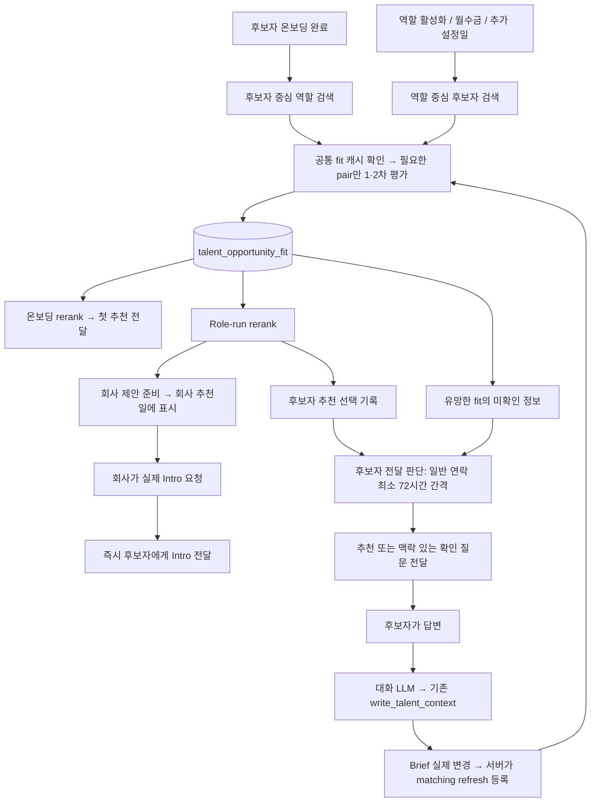

# Talent × Role 매칭 통합 구현 계획

> 2026-10-09 출시 상태: 웹 `f89c99c6`, Worker `71326f6`을 운영 배포했다. 공통 fit 실행 경로, 역할별 추천 선정과 후보자별 전달 시점의 분리, 내부 역할 keep, 우선 검토 상태, 미소개 수락 후보 재검토가 출시 코드에 포함된다. 운영 DB의 관련 함수·컬럼을 읽기 전용으로 확인했으며 이번 요청에서 migration은 적용하지 않았다. 아래의 ‘미배포·미적용’은 계획 작성 당시 기록이고, 현재 코드·실제 DB 정의·운영 설정이 정본이다. 이 배포 기록은 계획 전체의 구현 또는 평가 완료 선언이 아니다.

문서 기준: 2026-10-08. **목표 설계와 로컬 구현 계약**이다. 제품 코드와 미적용 migration을 작업 중이며 production 배포·DB 적용을 하지 않았다. 구현 완료 여부는 [항목별 대조와 검증 기록](unified-talent-role-matching/implementation-status.md)에서 별도로 확인한다. 이 계획서에 적힌 것만으로 구현·검증 완료를 뜻하지 않는다.

후속 검토에서 상태 전환·동시 실행·개인정보 입력·기존 도구 재사용을 보완했다. 내부 역할의 `저장/keep`은 [별도 상세 계약](internal-role-keep-implementation-plan-ko.md)을 이 계획의 일부로 적용한다. 31–32절에 통합 영향과 반례 검토 결과를 정리한다. DB 구조는 keep 문서의 읽기 전용 schema/RPC 조회와 3절의 정기 검색 관련 컬럼 metadata를 확인했다. 계획의 구현·배포 완료를 의미하지 않는다.

이 문서는 공통 fit, 검색과 실행 시점, 양측 추천, 후보자 전달, 질문과 답변, 우선순위 검토를 함께 결정하는 기준이다. 이전의 [질문·연락 계획](talent-contact-clarification-implementation-plan-ko.md)은 이 문서로 대체한다. 기존 company-first 문서와 충돌하는 변경점도 아래에 명시한다. 기존 동작의 설명과 새 설계를 섞어 읽지 않는다.

| 먼저 검토할 내용 | 위치 |
| --- | --- |
| 실행 시점·검색·추천 기준 | 3–5절, 10–11절 |
| 가장 중요한 1·2차 JSON과 cache | 6–9절, [검증 가능한 출력 schema](unified-talent-role-matching/model-output.schema.json) |
| 질문 생성·50개 missingInfo·10개 과거 메일·답변 반영 | 12–14절 |
| 양측 추천·대행 고객·criteria 작성 | 15–17절 |
| 우선 검토 다섯 분기·저장·할 일 UI | 18–21절 |
| 실행 이력·병렬화·prompt·migration·검증 | 22–30절 및 부록 C |
| 내부 역할 저장, 반례 검토와 보완된 실행 경계 | 31–32절 및 [저장 상세 계획](internal-role-keep-implementation-plan-ko.md) |

## 1. 최종 구조와 이번 변경의 범위

**찾는 방향은 두 개, fit 평가는 하나, 추천과 전달의 결정은 목적별로 둔다.**

| 구분 | 하는 일 | 하지 않는 일 |
| --- | --- | --- |
| 온보딩 검색 | 새 후보자의 Profile·Brief를 기준으로 역할을 찾는다 | 새 역할이 생길 때 기존 후보자 전원에게 실행하지 않는다 |
| Role-first 검색 | 활성 역할에 맞는 후보자를 찾는다. 회사·후보자 양쪽 추천의 재료를 만든다 | 회사에 이미 제안한 사람이라는 이유만으로 검색에서 제외하지 않는다 |
| 공통 fit 1·2차 | 해당 후보자와 역할의 적합성과 중요한 미확인 사실을 평가한다 | 추천 여부, 한 회사의 대표 역할, 연락 시점을 결정하지 않는다 |
| 온보딩 rerank | 지금 처음 보여줄 역할을 고른다 | 회사가 후보자를 수락했다고 간주하지 않는다 |
| Role-run rerank | 회사에 먼저 제안할 사람, 후보자에게 제안할 역할을 고른다 | 후보자에게 보낼 질문 문구를 작성하지 않는다 |
| 후보자 전달 판단 | 선택된 역할·실제 Intro 요청·확인이 필요한 유망한 fit을 함께 보고 지금 보낼 내용을 고른다 | 전체 역할을 다시 검색하거나 동일한 fit을 매번 다시 평가하지 않는다 |
| 회사 소개 작성 | 선택된 후보자의 criteria별 평가와 짧은 소개를 작성한다 | 전체 검색 후보에게 이 비용을 지불하지 않는다 |

여기서 `company-first`와 `talent-first`는 **먼저 누구에게 제안하는가**라는 경로다. `role-first`와 `onboarding`은 **어디서 후보자 × 역할 pair를 발견했는가**라는 실행 방식이다. Role-first에서 발견한 pair도 talent-first로 추천할 수 있다.



그림의 화살표는 데이터 흐름이다. 온보딩·role run·refresh가 같은 fit row를 각각 중복 평가한다는 의미가 아니다.

## 2. 변경 시작 당시의 구조

| 확인한 현재 구조 | 변경할 내용 |
| --- | --- |
| Talent 쪽 `opp/utils/internal_fit.py`에 1·2차 평가가 있다 | 이를 공통 evaluator로 추출한다. 회사 scorer를 또 개선해서 병행 유지하지 않는다 |
| `talent_opportunity_fit`과 `company_first_talent_scores`가 분리되어 있다 | 전자를 canonical fit으로 사용하고 후자는 읽기·쓰기 경로를 퇴역시킨다 |
| Fit에 `recommend`, `reevaluation_criteria`, criteria별 평가가 함께 있다 | 추천은 matching review, 질문 작성은 전달 단계, criteria는 선택 이후로 이동한다 |
| `talent_opportunity_matching_review`가 경로와 이유를 저장한다 | 추천 선택의 이력과 아직 전달하지 않은 선택을 여기서 관리한다 |
| 위 review의 `run_id`는 company run 필수 FK, unique는 `(run_id, talent_id)`다 | 온보딩 원본 run도 연결할 수 있게 바꾸고 역할별 중복 제약을 수정한다. 그대로 재사용할 수 있는 스키마가 아니다 |
| `company_first_search_runs`는 회사 묶음 실행을 기록한다 | 신규 계약에서는 역할별 실행 row를 남긴다. 회사 단위 rerank는 여러 row를 한 번에 처리할 수 있다 |
| 회사의 `company_intro_candidates.status=ready`는 회사가 Intro를 요청하기 전 제안이다 | `ready`와 실제 Intro 요청을 모든 prompt·UI·통계에서 구분한다 |
| `talent_opportunity_recommendation`은 후보자에게 보여주는 정식 추천이다 | 미전달 추천 선택과 분리한다 |
| `talent_progress`에는 양측의 진행 사건과 공개 범위가 있다 | 실제 사건만 기록한다. 모든 행을 양측에 공개하는 테이블로 해석하지 않는다 |
| 회사 worker에 특정 workspace 제외 설정이 있다 | Wonderful·Sierra 등 대행 고객을 이름으로 제외하는 구조를 운영 방식에 따른 경로 정책으로 바꾼다 |
| 기존 fit fingerprint에 prior fit·추천 이력이 섞인 경로가 있다 | 공통 fit의 입력 fingerprint에서 자기 자신의 평가 결과를 제거한다 |
| `write_talent_context`와 `read_talent_activity_events`가 이미 있다 | 전자는 저장 후 refresh 연결, 후자는 실제 연락의 검색·원문 조회 기능을 확장한다 |

근거 파일은 마지막 구현 작업표에 정리한다. 로컬 타입·SQL·코드 확인만으로 live DB의 제약이나 현재 배포 모델까지 확정하지 않는다.

## 3. 언제 무엇을 실행하는가

초기 운영값을 다음처럼 확정한다. 요일과 시간은 현재 서비스 설정에 맞춰 `Asia/Seoul`을 사용한다. UTC 저장과 KST 계산을 분리한다.

| Trigger | 실행 범위 | Fit 이후 | 후보자·회사에게 나가는 것 |
| --- | --- | --- | --- |
| 후보자 온보딩 완료 | 해당 후보자에게 역할 검색 1회 | 온보딩 rerank | 첫 추천을 바로 보여주고 기존 첫 추천 메일 흐름으로 전달 |
| 역할이 처음 검색 가능한 활성 상태가 됨 | Hiring Brief 준비 후 첫 허용 slot에 해당 역할 검색 1회 | Role-run rerank | Paid는 월·수·금에 후보자 선택 가능. Free는 허용된 회사 자동 제안만 가능 |
| 매주 월·수·금 09:00 | Paid에 해당하는 검색 가능한 활성 내부 역할 | Role-run rerank | 회사 추천 설정과 관계없이 talent-first 후보를 검토. 같은 회사 설정 slot이면 양쪽 가능 |
| 회사 자동 추천 ON + 설정 요일·시간 | Free 또는 Paid의 해당 활성 역할 | Role-run rerank | Free는 company-first만. Paid는 월·수·금이면 양쪽, 나머지 요일이면 company-first만 |
| 회사가 명시적으로 즉시 검색 요청 | 요청한 역할 및 비교에 필요한 같은 회사 역할 | 회사 요청 목적의 rerank | 기존 명시적 검색 계약대로 회사 제안. 이것만으로 별도 후보자 연락을 발송하지 않는다 |
| 후보자가 우선순위 검토 요청 | 기존 fit 확인 + 다음 역할 검색의 필수 평가 목록에 포함 | 19절의 분기 | 기존 fit이 추천을 뒷받침하면 즉시 정식 역할 제안, fit이 없으면 다음 역할 검색에서 평가 |
| Brief 또는 검증된 Profile이 실제 변경 | 해당 후보자의 관련 pair + 현재 방향에 맞는 제한된 새 검색 | 후보자 기준 재검토 | 다음 전달에 반영. 답변했다고 즉시 회사에 공유하지 않는다 |
| 일반 후보자 연락 후 72시간 경과 | 새로 선택된 추천·새로운 유망한 미확인 정보가 있는 후보자 | 후보자 전달 판단 | 최대 3개 일반 역할 또는 한 묶음의 확인 질문 |
| 회사가 실제 Intro 요청 | 그 요청의 후보자·역할 | 기존 Intro 전달 흐름 | 72시간을 기다리지 않고 즉시 전달 |

상세 규칙:

1. `role_matching_slot_type_v1`은 현재 billing과 Role 배정을 읽는다. 확인된 유효 기간의 Slot에 배정된 Role은 Paid다. 등록된 standard workspace에 유효한 Paid Slot이 없으면 Free다. Paid Slot이 있는데 배정되지 않은 Role은 검색 불가다. `is_harper_tailored_role=true`, 기존 legacy 권한, scale은 Paid처럼 동작한다. 결제 상태 문자열이나 회사 전체 유료 여부만으로 Role 권한을 추정하지 않는다.
2. Paid의 talent-first 발견·새 Role-run 선택은 **월·수·금에만** 허용한다. Free는 talent-first를 하지 않는다. 회사 자동 제안은 `is_company_first_search=true`인 설정 요일·시각에만 가능하다. 이를 끄거나 설정 요일이 아니면 추가 회사 slot을 만들지 않는다. 같은 시각의 baseline과 회사 slot은 합치고, 다른 시각이면 회사 제안은 해당 회사 slot에서만 수행한다. 명시적 회사 Run Search는 요일·자동 설정과 무관한 company-first 전용이다.
3. 새 역할 생성은 초안 저장마다 실행하지 않는다. 필수 JD·Hiring Brief와 공개·활성 조건을 갖춘 첫 activation revision으로 dedupe한다. Calibration이 필수인 기존 경로는 완료 후 실행한다.
4. 최초 activation도 방향별 요일·설정을 지킨다. 오늘 허용된 방향이 없으면 다음 허용 slot에 실행한다. Free에서 회사 자동 추천이 꺼져 있으면 activation 검색을 등록하지 않는다. Hiring Brief가 빈 초안은 검색에서 제외하고 Brief가 준비된 첫 revision에서 등록한다.
5. 신규 역할 trigger가 기존 talent opportunity worker를 후보자 수만큼 enqueue하는 경로를 제거한다. Role run에서 후보자를 찾고 실제 전달 대상만 후보자 단위로 모은다.
6. Brief refresh·우선순위 검토는 세 번째 대규모 검색 체계가 아니다. 기존 두 entry point가 사용하는 evaluator를 재사용하는 보정 작업이다.
7. 검색이 없었던 것과 실행했으나 적합자가 없었던 것을 run 기록에서 구분한다. 실패를 “후보자 0명”으로 기록하지 않는다.
8. 회사 ready backlog가 꽉 차도 baseline fit과 talent-first 발견을 함께 멈추지 않는다. 회사 경로의 capacity와 후보자 경로의 가능성을 별도로 전달한다.
9. Hiring Brief·역할 조건이 수정되면 기존 fit은 즉시 invalid이지만, 활성 역할 전부를 후보자 수만큼 즉시 재평가하지 않는다. 다음 role slot 또는 명시적 즉시 검색에서 필요한 pair를 갱신한다. 진행 중인 추천/Intro는 실행 직전 현재 조건을 다시 읽는다.

Paid 활성 역할의 우선 검토 요청은 **다음 월·수·금 baseline 또는 더 이른 허용 회사 run**의 별도 요청 pool에서 검토한다. Free에는 talent-first baseline이 없으며 허용된 회사 run에서만 검토한다. 등록 시 이미 있는 fit은 읽지만, 요청별 평가 작업이나 별도 검색을 만들지 않는다. 역할별로 오래된 활성 요청부터 최대 50명을 일반 검색 한도와 별개로 평가 목록에 합친다. 회사 자동 제안 설정이 꺼졌다는 이유로 baseline 검토를 멈추지 않는다. 월·수·금 run은 원래 실행되어야 한다. 회사 알림과 공개 권한은 기존 설정을 따른다.

2026-10-08 이 규칙은 로컬 코드와 `20261008043437_role_matching_route_eligibility.sql`에 구현했다. 이번 변경은 운영 DB에 적용하거나 웹·Worker에 배포하지 않았다. 기존 온보딩·사용자 요청에 따른 즉시 검토와 72시간 전달은 Role-run의 월·수·금 발견과 별개지만, 새로운 talent-first 추천은 현재 Paid 권한이 필요하다. 회사의 실제 Intro 요청은 별도 명시 요청 경로다.

Retrieval의 신규 인원 한도를 채우기 전에 공개 범위·삭제·온보딩·내부 추천 opt-out·회사 차단과 현재 방향의 이력 제외를 적용한다. 저장 fit·우선 검토를 합친 이후에도 scoring 직전에 후보자–Role별 허용 방향을 확인한다. 회사 제안 이력이 있어도 talent-first가 가능하면 남기고, 기존 후보자 카드가 있어도 company-first가 가능하면 남긴다. 양쪽 모두 막힌 pair는 scoring·rerank에서 제외한다. 회사 explicit pass, 실제 Intro 진행, 활성 pipeline은 새 talent-first를 막는다. Company-first는 `open_to_matches`만, talent-first는 `exceptional_only`도 가능하다. LOW 응답 신호는 기존대로 soft ranking이다.

예약 slot과 실제 실행일을 따로 확인한다. 오전 baseline이 늦게 실행됐다는 이유로 오후 회사 slot 권한을 얻지 않으며, 지난 날짜 slot의 재개로 새 talent-first를 만들지 않는다. 저장 직전 현재 Slot·수신 채널·역할 fingerprint와 방향별 이력을 다시 확인하고, DB도 Free·잘못된 요일·명시적 회사 검색의 talent-first 선택 저장을 차단한다. 회사 전달 채널·ready backlog는 회사 방향만 막고 Paid의 유효한 talent-first를 멈추지 않는다. 수동 회사 Run Search의 enqueue에서는 후보자 연결 대기 상한을 제거하고 ready·채널·권한 경계는 유지한다.

Scheduler 중단 후에는 역할별 누락 slot을 모두 재생하지 않고 **가장 최근 due slot 한 개**로 catch-up한다. 미완료 run은 기존 ID로 재개하고 더 오래된 누락 slot은 새 발송을 만드는 run으로 복제하지 않는다. 설정 변경 시 이미 실행 중인 snapshot은 고정하되 최종 실행 권한은 현재 설정을 확인한다. 후보자 전달 scheduler도 중단 기간의 매 3일 연락을 몰아서 발송하지 않고 현재 재료로 한 번 판단한다.

### 예시: 몇 주 전에 가입한 개발자가 PM을 원하고, 화요일에 PM 역할이 열림

Paid PM 역할이 화요일에 활성화되고 화요일 회사 자동 추천 설정이 없다면 수요일 09:00에 Profile 검색과 Brief의 희망 방향 검색을 함께 실행한다. 강한 fit이면 role rerank가 talent-first 후보로 선택할 수 있다. 화요일이 회사 설정일이면 화요일에는 company-first만 검토한다. 마지막 일반 연락이 일요일 10시였다면 수요일 10시 이후 전달 대상이 된다. 온보딩을 다시 실행하거나 목요일이라는 고정 개인 추천일을 만들지 않는다. 이미 회사에 제안한 pair여도 후보자에게 추천할 가능성은 따로 판단한다.

## 4. 검색 후보군: 현재 직함만으로 찾지 않는다

| 입력 | 검색에서의 역할 |
| --- | --- |
| Profile | 실제 직무·경험·기술·도메인·성과 등 수행 가능성의 근거 |
| 전체 Search Brief | 원하는 다음 역할, 전환 의사, 근무 조건과 명시적 예외 |
| Talent Behavior Context | 명시 정보와 충돌하지 않는 탐색·반응 맥락 |
| Role/JD + Hiring Brief | 역할의 일과 회사의 채용 기준 |
| 기존 valid fit 및 미전달 선택 | 이미 발견한 유망 pair를 놓치지 않는 경로 |
| 명시적 우선순위 검토 요청 | 일반 retrieval limit과 별개로 검토할 요청 목록 |

Query planner는 Profile에서 수행 역량이 보이는 사람과 Brief에서 해당 방향을 원하는 사람을 **합집합**으로 가져온다. “개발자 경력 AND 현재 PM 직함” 같은 필수 결합을 만들지 않는다. 개발자→PM, 대기업→초기 팀, 해외→국내 등은 예시이며 별도 직무 전환 enum이나 사례별 분기를 만들지 않는다.

초기 일반 retrieval budget은 현재 기본값인 **역할당 신규 평가 대상 최대 150명**을 유지한다. 여러 쿼리의 중복을 제거한 뒤 pair 단위로 센다. 현재 valid fit 후보·전달 대기·우선 검토는 별도 읽기이며 150명을 소모하지 않는다. 만료된 평가는 신규 평가 예산을 공유한다. 신규 검색이 있으면 최대 절반을 오래된 만료 평가에 배정하고, 나머지는 새 후보 탐색에 쓴다. 만료된 모든 과거 fit을 한 번에 재평가하지 않는다. 이 합집합이 매우 크면 rerank 입력 상한에 맞춰 기존 후보의 compact 사전 선택을 수행한다. 해당 선택도 LLM이 현재 기준을 읽고 수행하며, 직함·학교·특정 표현을 점수화하는 코드로 대체하지 않는다.

검색 단계에서 제외할 것은 비활성·testOnly 역할, 권한 없는 후보자, 명시적 내부 매칭 opt-out, 차단된 회사 등 실제 경계다. 이미 회사에 소개했는가, 다른 역할을 거절했는가, 답변이 느린가는 검색 제외와 동일하지 않다. 기존 pair의 확정 종료·공유 상태는 이후 가능한 행동을 제한하거나 rerank 맥락으로 제공한다.

우선 검토 요청은 낮은 fit이라도 일반 검색 결과에 묻히지 않도록 별도 pool로 가져온다. 검색에 들어갔다는 사실이 추천 자격이나 회사 전달 동의를 만들지는 않는다.

## 5. 공통 evaluator에 들어가는 데이터

입력 로더·버전 계산·LLM 호출·구조 검증·저장을 하나의 모듈로 만든다. 온보딩과 role run은 pair 목록과 실행 식별자만 전달한다. 평가 prompt에 “이번에는 후보자에게 추천할 사람” 같은 경로 목적을 넣지 않는다.

| 영역 | 1차 | 2차 | 원칙 |
| --- | --- | --- | --- |
| Profile | 전체 매칭용 정규화 Profile | 동일 snapshot | 원문 CV 전체를 중복 주입하지 않는다. 경력 근거를 임의로 제목만 남겨 자르지 않는다 |
| Search Brief | 전체 active row, 짧은 ref 포함 | 동일 snapshot | 역할 예외도 자유 형식 row로 포함 |
| Talent Behavior | 동일 version 전체 context | 동일 version | Memory 전체·과거 메일 전체를 다시 붙이지 않는다 |
| 역할 | 직무·조건·현재 JD | 동일 snapshot | 공개 가능한 설명과 내부 Hiring Brief를 식별한다 |
| Hiring Brief | 회사의 역할 기준·인재 기준 | 동일 snapshot | canonical `company_internal_roles.request`; 단순 2,000자 clipping으로 중요 조건을 버리지 않는다 |
| Company Behavior | 역할·회사에 관련된 같은 version context | 동일 snapshot | 피드백의 강도·근거를 읽되 명시 Brief를 덮지 않는다 |
| 회사 criteria | 저장되어 있다면 현재 기준 내용 | 동일 snapshot | 2차에서 기준을 고려하되 criteria별 카드 문구는 작성하지 않는다 |
| 1차 평가 | 해당 없음 | 해당 pair의 통과 이유 | 이전 달의 최종 평가와 혼동하지 않는다 |
| 이전 fit·추천 경로 | 기본 주입하지 않음 | 기본 주입하지 않음 | 앵커링과 자기 fingerprint 순환을 막는다. 운영 trace에는 보존 |

Role 요청의 pedigree는 **회사가 실제 정한 기준과 후보자 본인의 증거**로 평가한다. 유명 회사 재직만으로 개인 역량을 증명했다고 보지 않는다. 모델이 임의로 회사·학교 prestige 기준을 추가하지 않는다. “회사에서 좋아할 확률 80%”처럼 보정되지 않은 수치를 출력하지 않는다.

`liveness`는 경력 적합성이 아니다. 최근 활동, 실제 미응답·관심 표현, 채용 진행 속도는 전달/rerank의 참고다. 기록이 없다는 이유로 관심이 없다고 확정하지 않는다. 명시적인 지금 연락 중지·내부 기회 거부는 해당 정책으로 존중한다. `talent_setting.status=stopped`만으로 내부 역할 opt-out을 만들어서는 안 된다.

따라서 기존 company 검색의 추정 reply `LOW` 일괄 제외도 새 계약에서는 soft 판단으로 이동한다. 실제 연락 거부·내부 공유 권한과는 구분한다. 이 변경은 기존 평가 gold를 조용히 수정하지 않고 새 입력/정답 version에서 명시한다.

## 6. 1차 출력: 명확한 탈락 근거만 거른다

1차 목적은 **알려진 hard constraint 충돌 또는 명백히 큰 부적합**을 저렴하게 제거하는 것이다. 정보가 없다는 이유, pedigree가 덜 화려하다는 이유, 예상 답변율이 낮다는 이유만으로 제거하지 않는다.

정확한 model output:

```json
{
  "evaluations": [
    {
      "pairRef": "p1",
      "proceedToStage2": true,
      "reason": "제품 개발 경험과 PM 전환 의사가 확인된다. 현재 직함만으로 배제할 수 없으며 역할 범위와 회사 기준은 2차 평가가 필요하다."
    },
    {
      "pairRef": "p2",
      "proceedToStage2": false,
      "reason": "역할은 주 5일 싱가포르 출근이 필수이고 후보자는 국내 근무만 가능하다고 명시했다. 해당 역할에 대한 예외는 없다."
    }
  ]
}
```

| 필드 | 타입·허용값 | downstream 용도 |
| --- | --- | --- |
| `pairRef` | 이번 호출에 서버가 발급한 짧은 식별자 | 정확한 talent·role·snapshot에 연결 |
| `proceedToStage2` | boolean | false이면 2차 비용 없이 종료 |
| `reason` | 비어 있지 않은 자연어 | 판정 근거, 2차 입력, 운영 검토 |

**1차에는 `missingInfo`를 넣지 않는다.** 아직 전체 적합성을 확인하지 않은 모델에게 “답만 알면 강하게 추천할 역할”을 고르게 하지 않기 위해서다. 1차에서 중요한 미확인이 발견되면 `proceedToStage2=true`와 그 이유를 남긴다. 2차가 실제 가치가 있는지 판단한다.

`unfit`은 pair의 평가 결과이지 후보자 전체에 대한 분류가 아니다. 같은 회사의 다른 역할까지 배제하지 않는다. 1차에서 종료한 pair는 `evaluated_stage=1`과 이 결과를 저장하고, 평가하지 않은 세 축의 2차 grade는 `null`로 둔다.

구조 검증은 필수 필드, enum, 중복·누락 pairRef, 요청하지 않은 pair, 길이 제한을 검사한다. 자연어에 특정 단어가 들어갔다는 이유로 `unfit`을 다시 분류하지 않는다. JSON 오류에는 한 번의 구조 복구를 허용하고, 계속 실패하면 해당 pair는 평가 실패다. 실패를 unfit으로 변환하지 않는다.

## 7. 2차 출력: 세 축·이유·드문 missingInfo

2차 목적은 알려진 근거로 **수행 가능성, 후보자 입장의 매력, 회사 채용 기준**을 충분히 평가하는 것이다.

정확한 model output:

```json
{
  "evaluations": [
    {
      "pairRef": "p1",
      "roleFit": "good",
      "candidateFit": "worth_considering",
      "companyFit": "good",
      "candidateReason": "원하는 PM 전환과 제품 책임 범위는 맞지만 싱가포르 이전 의사는 미확인이다. 회사와 역할의 수준·보상은 현재 희망에 맞는다.",
      "companyReason": "본인이 수행한 제품 개발과 사용자 문제 해결 경험, 필수 기술 협업과 도메인 경험이 역할 수행과 회사 기준을 뒷받침한다.",
      "missingInfo": "이 역할의 싱가포르 근무를 검토할 수 있는지가 미확인이다. 가능하다면 현재 확인된 직무·회사 기준과 후보자의 PM 전환 방향이 함께 맞아 강한 추천 후보가 된다."
    },
    {
      "pairRef": "p3",
      "roleFit": "good",
      "candidateFit": "good",
      "companyFit": "worth_considering",
      "candidateReason": "희망하는 제품 영역과 책임 범위, 회사와 팀의 단계 및 보상 수준이 잘 맞는다.",
      "companyReason": "관련 프로젝트를 독립적으로 수행한 근거는 있다. 회사가 선호하는 대규모 서비스 운영 범위는 미확인이다. 이를 후보자 경험 검증 질문으로 해결하지 않는다.",
      "missingInfo": null
    }
  ]
}
```

| 필드 | 의미 | 포함하지 않을 것 |
| --- | --- | --- |
| `roleFit` | 실제 맡을 일을 수행할 근거 | 회사 유명세, 이번 주 추천 순위 |
| `candidateFit` | 전체 희망·조건·회사/팀 수준·책임·보상·경력 궤적에 비춰 원하는 기회인지 | 대화가 없어서 관심 없을 것이라는 추측 |
| `companyFit` | Hiring Brief의 채용 기준을 충족하는 근거 | 근거 없는 면접 통과 확률 |
| `candidateReason` | 후보자 관점의 매력·수준·보상·명시 조건·약점·불확실성 | 외부 전달 문구, 질문 문구 |
| `companyReason` | 직무 수행과 회사 채용 기준에 관한 개인의 구체적 근거·약점·불확실성 | pedigree를 개인 성과로 대체하거나 회사에 공개할 소개문 |
| `missingInfo` | 아래 기준을 모두 만족하는 드문 미확인 사실과 확인 가치. 없으면 `null` | 질문 목록, re-eval topic enum, 추천 명령, “답변하면 재평가” 조건식 |

grade는 세 축 모두 다음 다섯 개를 쓴다.

| 값 | 뜻 |
| --- | --- |
| `perfect` | 해당 축에서 매우 강한 직접 근거가 있고 중요한 약점이 보이지 않음. 합격 보장이 아님 |
| `good` | 실제 추천 판단을 지지할 만큼 근거가 충분함 |
| `worth_considering` | 긍정 근거가 있지만 중요한 불확실성 또는 기준상 간극이 있음 |
| `bad` | 알려진 정보상 의미 있는 부적합이 있음 |
| `unfit` | 알려진 필수 조건 충돌 또는 강한 부적합 |

정보 부족을 `bad`·`unfit`으로 처리하지 않는다. 전체적으로 근거가 부족한 경우 `worth_considering`과 이유를 남길 수 있지만, 이를 “60% 이상”이나 추천 자격으로 해석하지 않는다. 알려진 강점·약점·미확인을 reason에서 분명히 구분한다.

총점·전체 label·`recommend`·`pass`·criteria별 장문·질문별 상태는 출력하지 않는다. 세 축과 reason을 저장하면 routing과 상세 설명을 다시 구성할 수 있다. `missingInfo`를 따로 두는 이유는 후보자 전달 단계가 **확인을 통해 열릴 수 있는 기회**를 조회해야 하기 때문이다. 나머지 정성적 내용을 여러 JSON 필드로 분해하지 않는다.

### missingInfo를 남기는 기준

다음을 모두 만족할 때만 2차가 짧은 자연어 한 항목으로 남긴다.

1. 기존 Profile·전체 Brief·Behavior에서 이미 답을 알 수 없다. 명시적으로 싫다고 한 것을 “아직 모르므로 물어보자”로 바꾸지 않는다.
2. 후보자가 답할 수 있는 근무 조건·의향·현실적인 가능성이다. 회사의 비자 지원 여부처럼 회사가 알아야 하는 사실은 후보자에게 돌리지 않는다.
3. 해당 미확인이 긍정적으로 해소되면, **다른 알려진 축과 근거만으로 강한 talent-first 추천 후보**가 된다. 여러 경력 의심까지 모두 긍정으로 가정해야 하면 해당하지 않는다.
4. 지금 실제로 소개할 수 있는 역할의 가치가 있다. 비활성·testOnly·금지된 공유 조건의 역할을 위해 질문하지 않는다.
5. 답변을 얻는 부담이 기회 가치에 비해 작다. 포트폴리오 작성·자기 증명·면접식 검증은 포함하지 않는다.

예: 해외 근무 범위, 실제 출근 빈도 가능 여부, 입사 가능 시점과 역할의 확정 기한 충돌, 이미 공개된 보상 범위의 검토 가능 여부. 이 예시는 enum이나 키워드 분기가 아니다.

없음과 다름을 구분한다. “국내만 가능”은 현재 답이 있는 상태다. “국내 우선”은 강도와 예외를 읽어야 한다. 특별히 가치 있는 구체 역할을 함께 설명하며 예외를 논의할지는 후보자 전달 LLM이 판단하되, fit이 명시적 불가를 임의로 unknown으로 바꾸지는 않는다.

### Prompt 공통 계약

1차에는 “명시 근거로 강한 부적합만 제거; 정보 부족은 2차로”를, 2차에는 “세 축의 근거를 독립적으로 판단; 가능한 후보자 답변 하나가 실제로 강한 추천을 열 때만 missingInfo”를 넣는다. 둘 다 “한 회사 한 명/한 역할”, 경로별 높은·낮은 추천 기준, 추천 수 채우기, re-evaluation criteria 작성 지시를 제거한다.

양측 행동 context는 soft evidence다. 원본의 명시 조건·공유 권한을 만들어내거나 바꾸지 못한다. 후보자의 새 명시 답변이 이전 Behavior와 다르면 Brief를 따른다.

## 8. Model output과 서버 저장 metadata를 분리한다

모델은 앞의 JSON만 작성한다. 다음은 서버가 붙인다.

[model-output.schema.json](unified-talent-role-matching/model-output.schema.json)에 1차·2차·role rerank·회사 소개·최종 질문 metadata의 정확한 타입과 `additionalProperties: false` 계약을 함께 둔다. 이것은 문서용 제안 schema이며 production runtime에 연결한 파일이 아니다. 초기 최대 batch는 1차 64 pair, 2차 16 pair이고 실제 token budget에 따라 더 작게 묶는다. 전체 검색 budget 150명과 한 LLM 호출의 batch 크기는 다른 값이다. `reason`은 최대 1,800자, `missingInfo`는 최대 600자다. 초과 출력은 구조 오류로 재작성하고 임의로 잘라 뜻을 바꾸지 않는다.

Schema 외에 서버가 반드시 검사할 것은 요청한 pairRef의 정확한 coverage/중복, criteria ID의 입력 포함 여부, 현재 실행에 허용된 경로·상한, snapshot version과 권한이다. 모델의 문장 스타일이나 정성적 적합도를 schema validation으로 판정하지 않는다.

| 저장값 | 생성 주체·용도 |
| --- | --- |
| talent_id, opportunity_id | `pairRef`를 서버 manifest에서 복원 |
| contract_version, evaluated_stage | 출력 해석과 migration 경계 |
| input_fingerprint | snapshot의 내용·version·prompt contract를 서버가 계산 |
| evaluated_at, expires_at | 성공 평가 시각, 30일 TTL |
| profile/brief/talent_behavior/role/company_behavior/criteria versions | 캐시 무효화와 trace |
| model manifest | 실제 resolved model ID, provider, reasoning, prompt version |
| source run reference | 온보딩·role run·refresh의 호출 추적 |

모델이 임의로 evaluated_at, confidence, source version을 만들지 않는다. 기존 사람이 남긴 `human_label`, `human_reason`, reviewer 정보는 자동 평가가 덮어쓰지 않는다. 사람이 내린 차단·권한 판단과 자동 fit grade의 충돌은 별도 운영 검토 대상으로 표시한다.

## 9. Fit 캐시: 30일 + 입력 변경 시 즉시 무효화

**모든 정상 fit 결과를 30일 캐시한다.** 1차 unfit, 2차 각 grade에 같은 원칙을 적용한다. 추천 여부는 캐시하지 않는다.

```text
reuse = 동일 pair
        AND 현재 contract/prompt version과 호환
        AND 현재 입력 fingerprint와 동일
        AND now < expires_at
        AND 이전 평가가 정상 완료됨
```

| 상황 | 처리 |
| --- | --- |
| 온보딩에서 평가한 pair를 다음 role run이 발견 | 같은 snapshot이면 그대로 사용 |
| 회사 검색에서 평가한 pair를 후보자 쪽이 필요로 함 | 같은 저장값 사용 |
| 30일 지남 | 다음 retrieval·우선 검토·전달 전 검증에서 실제 필요한 pair만 재평가 |
| Brief/Profile/Hiring Brief/기준 내용 변경 | TTL이 남아도 invalid. 관련 작업은 새 snapshot으로 실행 |
| 행동 context 재생성 | context 내용 version이 바뀌면 invalid. timestamp만 갱신된 동일 내용은 새 version을 만들지 않음 |
| 회사 criteria 표시 순서만 변경 | 동일 ID·동일 기준 내용이면 report를 재정렬하고 fit 유지 |
| criteria 이름·설명·기준 내용 변경 | fit도 invalid. 짧은 기준명 자체가 의미를 담을 수 있으므로 이름 수정도 보수적으로 포함 |
| 기존 추천 수락·Intro 발생 | 행동 가능한 상태를 즉시 다시 읽음. 이것만으로 fit 결과 자체를 자기 참조 fingerprint에 넣지 않음 |
| 이전 평가 실패 | 캐시 없음. 제한된 재시도 대상 |

만료했다고 모든 저장 pair를 한꺼번에 평가하지 않는다. 다음 검색에서 만료한 negative도 신규 검토에 들어갈 기회가 있어야 하므로, “과거 낮은 fit이 있음”이라는 무기한 SQL 제외를 제거한다. valid negative는 재사용해서 비용을 줄이되 후보군 전체를 영구 삭제하지 않는다.

이전 fit의 **평가·grade·reason은 새 평가 prompt에 기본 입력하지 않는다.** 현재 사실로 재판단한다. 이전 결과는 운영용 기존 history/trace에 짧게 보존하며, history JSON이 매 run마다 무제한 커지지 않게 최근 5개 변경 평가까지만 유지한다. 장기 실행 근거는 run trace의 기존 보존 정책을 따른다. 회사 LLM에 모든 평가 이력을 노출하지 않는다.

실행 중 Brief가 바뀌면 이전 snapshot 결과를 최신 canonical row에 덮어쓰지 않는다. 완료 시 version을 비교해 stale 결과를 trace로만 남기고 새 version 작업을 합친다.

내용 동등성은 정규화된 저장 데이터의 동일성으로 확인한다. 기준명 수정이 의미를 바꿨는지 키워드·휴리스틱·별도 LLM으로 분류하지 않는다. Criteria는 ID 기준 정렬 후 이름·설명·조건을 fingerprint에 넣고 UI 표시 순서만 제외한다. Behavior가 다른 문장으로 재작성되면 새 내용으로 취급하고, 불필요한 재생성 비용은 builder의 source dirty 계약과 운영 지표로 줄인다.

## 10. Fit과 추천 기준을 분리하는 실제 방법

| 경로 | rerank에 주는 정책 | 실행 결과 |
| --- | --- | --- |
| Talent-first | 후보자가 좋아할 근거가 강하고 역할 수행·회사 채용 기준도 충분한 기회를 우선한다. 확인되지 않은 실질 조건을 확정된 것처럼 제안하지 않는다 | 후보자에게 추천할 역할 선택 |
| Company-first | 후보자가 좋아할 근거는 필요하다. 역할 근거가 있고 회사 채용 기준의 불확실성은 회사가 선판단할 가치가 있으면 제안 가능 | 회사가 Intro 요청 여부를 결정할 후보자 선택 |
| 우선 검토 pool | 후보자의 명시 요청을 고려해 일반 선정 기준보다 넓게 회사 검토 가치를 판단한다. 알려진 약점을 숨기지 않으며 0명도 가능 | 일반 한도 외 최대 3명 |
| 질문 검토 | 아직 추천하지 않은 pair 중 rare missingInfo가 있는 유망 기회를 후보자 전체 맥락에서 검토 | 실제 연락에 포함할 가치가 있을 때만 질문 |

`good` 이상은 talent-first의 강한 기준을 설명하는 언어이고, `worth_considering`은 company-first에서 검토할 수 있는 언어다. 단순 grade 비교 코드가 모든 추천을 결정하지 않는다. 예외와 기회 가치는 LLM이 이유를 읽고 판단한다. 코드가 강제하는 것은 ID·허용 역할·동의·공유·중복·한도·delivery 시각이다.

낮은 candidateFit의 일반 추천은 양쪽 모두 피한다. 회사가 후보자를 좋아할 것 같다는 이유만으로 후보자가 명시적으로 원치 않는 역할을 제안하지 않는다. 후보자 본인이 구체 역할에 대해 우선 검토를 요청하면 그 새 사실을 Brief/요청 맥락으로 반영하고 현재 fit을 확인한다.

## 11. 두 rerank와 후보자 전달 판단

### 11.1 온보딩 rerank

해당 후보자의 Profile·전체 Brief·같은 version의 Behavior, 평가된 역할들의 fit reason·공개 역할 조건, 기존 추천·수락·진행 여부를 읽는다. 목표는 첫 추천의 성공 가능성과 경험이다.

- 최초 일반 추천은 최대 3개, 회사당 대표 역할 1개다. 0개도 정상 결과다.
- 회사당 하나를 고르는 규칙은 여기와 실제 전달에 둔다. 공통 fit의 다른 역할을 `unfit`으로 바꾸지 않는다.
- 1차/2차 pending이 일부 있더라도 충분히 좋은 완료 결과로 첫 추천을 만들 수 있다. 늦은 결과는 후속 전달 대상으로 합친다. 단, 실패·미완료를 낮은 fit으로 표시하지 않는다.
- 내부 추천이 0개라고 외부 역할 추천을 막지 않는다. 기존 외부 추천 경로는 유지하되 후보자당 최종 연락은 하나로 조립한다.
- 미확인 조건만 있는 경우 억지로 정식 추천하지 않는다. 이미 온보딩에서 답한 내용을 다시 묻지 않고, 첫 결과 안내 안에서 실제 가치 있는 확인 한 묶음을 제안할 수 있다.

### 11.2 Role-run rerank

Fit 완료 뒤 동일 회사의 이번 실행 대상 역할을 함께 비교한다. 역할별 run row는 별도지만, 회사 입력을 공유하는 한 번의 rerank가 여러 run의 선택을 만들 수 있다.

입력은 다음이다.

1. 역할별 JD·Hiring Brief·Company Behavior와 현재 모집 상태.
2. 후보자별 compact Profile 핵심, 전체 Brief, Talent Behavior, 공통 fit 세 축·reason·missingInfo. 모델 입력 예산을 넘으면 batch를 줄이지 Brief의 중요한 조건을 임의로 자르지 않는다.
3. 실제 추천·회사 제안·Intro·수락·거절·진행 상태. 양측 상태를 따로 준다.
4. 일반 후보 pool과 명시적 우선 검토 pool. 후자의 요청 시각·원문 요지·유효한 동의 범위를 포함한다.
5. 이번에 허용된 경로, 회사 추천 slot 여부, 역할별 잔여 한도, 기존 회사 backlog, 최근 후보자 연락 시각.

출력은 실제 실행에 필요한 선택만 남긴다.

```json
{
  "reviews": [
    {
      "talentId": "입력의 후보자 UUID",
      "primaryRoleId": "입력의 역할 UUID",
      "decision": "candidate_first",
      "alsoSuitableRoleIds": [],
      "reason": "후보자의 희망과 회사 기준이 모두 강하게 맞아 후보자에게 먼저 제안한다."
    },
    {
      "talentId": "다른 후보자 UUID",
      "primaryRoleId": "입력의 역할 UUID",
      "decision": "no_action",
      "alsoSuitableRoleIds": [],
      "reason": "현재 조건과 근거로는 제안할 가치가 충분하지 않다."
    }
  ],
  "noSelectionReason": "선택하지 않은 대상에 관한 핵심 근거"
}
```

`decision`은 `candidate_first | company_first | both | no_action`이다. 최종 compact pool의 후보자를 정확히 한 번 반환하고 회사 요청 전용 run은 company_first/no_action만 허용한다. 기존 식별자·review 계약을 그대로 사용한다. `no_action`의 짧은 근거와 selection fingerprint로 동일 입력에서 무작위 재추첨하지 않는다. 모든 검색 대상에게 장문 탈락 보고서를 쓰는 단계가 아니다.

일반 선택은 초기값 **role run당 최대 3 pair**, 회사의 명시적 즉시 검색은 기존 한도 **최대 6 pair**다. 우선 검토의 추가 company 선택 최대 3 pair는 별도다. 같은 pair를 양측에 제안해도 일반 선택은 1명으로 센다. 각 실행의 숫자는 quota가 아니라 상한이다.

`missingInfo`가 남아 talent-first를 선택할 수 없는 pair는 선택되지 않아도 된다. **후보자 전달 판단이 공통 fit의 유망한 미확인 기회를 직접 조회한다.** Role rerank에 `ask_question` 결과나 질문 계획을 추가하지 않는다.

동일 후보자의 같은 회사 역할들은 함께 비교하여 기본적으로 한 대표 역할을 선택한다. 이미 진행 중인 역할이 있거나 다른 역할을 거절한 이유가 있으면 그 맥락에서 판단한다. 명시적 차단·동의·중복을 제외한 sibling 역할의 가치 판단을 코드로 고정하지 않는다.

### 11.3 후보자 전달 판단

이는 “민수의 fit 전체를 매주 다시 판단하는 run”이 아니다. **발생한 전달 재료를 한 후보자의 관점에서 한 번에 조립하는 단계**다.

입력 후보는 세 가지다.

| 재료 | 출처 | 가능한 결정 |
| --- | --- | --- |
| 후보자에게 추천하기로 선택한 역할 | 미전달 matching review | 지금 추천, 새 기회 대비 이번 연락에서 생략, 더 이상 유효하지 않아 종료 |
| 회사의 실제 Intro 요청 | 요청이 발생한 company Intro 기록 | 즉시 Intro 전달, 이미 처리했다면 중복 방지 |
| 강한 기회가 될 수 있는 미확인 조건 | 현재 valid fit의 `missingInfo` | 다른 질문과 묶기, 구체 기회와 함께 확인, 묻지 않기 |

기존 후보자 orchestration과 final delivery writer를 확장한다. “질문할지 고르는 별도 에이전트”를 추가하지 않는다. 출력은 기존 전달 action과 선택 ID, 자연어 reason·최종 메시지를 확장하는 수준으로 둔다. 질문별 추론·계획 JSON을 새로 만들지 않는다.

후보자의 일반 전달은 **마지막 일반 proactive 연락 이후 최소 72시간**, 한 번에 **최대 3개 일반 역할**, 기본적으로 회사당 1개다. Intro는 실제 회사 요청이므로 즉시 경로로 보낸다. Intro가 일반 전달 직전에 도착하면 준비 중이던 일반 연락을 다시 합쳐 동일 역할의 중복 메시지를 막는다. 이미 발송 중인 서로 다른 실제 Intro 요청을 주기 제한으로 숨기지는 않는다.

질문은 72시간마다 반드시 보내는 것이 아니다. 검토할 새 재료가 없으면 LLM 호출 없이 종료한다. `internal-only` 후보자는 중복·관련 조건을 묶은 뒤 유용한 질문이 2개 이상일 때만 연락을 검토한다. 실제 질문 메일 이후 30일 동안 추가 proactive 질문은 보내지 않고, 한 메일에 최대 5개까지만 묻는다. 역할 5개의 같은 지역 조건은 질문 1개이며, 개수를 채우려고 질문을 나누거나 만들어내지 않는다.

이 3개는 **자동 내부 역할 제안의 초기 상한**이다. 현재 외부 추천의 사용자 설정 3–10개를 이 변경으로 몰래 3개로 바꾸지 않는다. 외부 추천도 같은 연락에 담는 경우 기존 사용자 batch 설정을 전체 역할 상한으로 존중하면서 내부 추천은 최대 3개로 제한한다. 명시적으로 지금 검색을 요청한 대화 응답과 실제 회사 Intro는 proactive 72시간 제한과 별개다. 더 제한적인 명시적 수신 설정은 그대로 우선한다.

발송을 기다리던 선택의 fit이 만료되었거나 source가 바뀌면 보내기 전에 해당 pair를 새로 확인한다. 평가를 기다리는 동안에는 이미 검증된 다른 역할만 전달할 수 있다. 큐에 오래 있었다는 이유로 stale fit을 그대로 발송하지 않는다.

### 11.4 “다섯 번 추천 안 했는데 여섯 번째에는 추천”을 막는 방법

두 가지를 분리한다.

- **비교 대기:** 이번에는 더 좋은 후보/역할이 있어 선택하지 않았다. 실제 pool·capacity·진행 상태가 바뀌면 다음에 선택될 수 있다. 이것은 의도한 순차 추천이다.
- **동일 근거 재추첨:** 입력과 가능한 행동이 그대로인데 시간이 지났다는 이유만으로 같은 LLM 판단을 반복한다. 이것은 하지 않는다.

서버가 role rerank 입력과 후보자 전달 입력 각각에 fingerprint를 둔다. Fit version, pool 구성, Brief/Behavior, 실제 진행 사건, 명시적인 availability 시점, 남은 전달 의도, 회사 slot 권한이 동일하면 이전 결정을 재사용한다. 단순 `run_id`, 현재 날짜, 검토 횟수는 내용 fingerprint에 넣지 않는다.

여기서 fit version은 **평가의 source fingerprint와 policy contract**를 뜻한다. TTL 갱신 시각이나 같은 근거를 다시 표현한 reason 문장이 달라졌다는 이유만으로 과거 질문을 새 질문 기회로 만들지 않는다. 실패·부분 입력에서 나온 no-action은 성공한 완전 입력의 결정처럼 장기 재사용하지 않는다. Snapshot 누락이 복구되거나 실행 권한·실제 pool이 바뀌면 재검토한다.

이미 전달하기로 선택했고 72시간을 기다리는 항목은 `not_before`가 도래하면 실행한다. “묻지 않음/선택하지 않음”을 단순 시간 경과로 승격시키지 않는다. 명시적인 “11월부터 이직 검토”와 같은 사실은 실제 조건이 달라지는 날짜가 재검토 trigger가 될 수 있다.

## 12. 질문: 누가 만들고 무엇을 물을 것인가

**공통 fit은 중요한 미확인 사실을 남기고, 후보자 전달 LLM이 연락 전체를 보며 실제 질문을 만든다.** 답변을 수집하는 대상은 role별 질문 task가 아니라 후보자의 사실·희망 조건이다.

| 판단 지점 | 결정 | 저장하는 것 |
| --- | --- | --- |
| 2차 fit | 확인된다면 강한 기회가 될 미확인 사실인가 | fit의 `missingInfo`; 없으면 null |
| 후보자 전달 판단 | 지금 이 사람에게 이 질문을 보내는 편이 유익한가, 여러 기회를 어떻게 묶을까 | 기존 run의 선택/미선택 이유 |
| Final writer | 역할 맥락·질문·답변 선택지를 실제 연락에 자연스럽게 표현 | 최종 메시지와 실제 질문의 compact metadata |
| 실제 발송/채팅 게시 | 무엇을 실제로 물었는가 | 기존 메시지/발송 원장 및 progress 참조 |
| 사용자 답변 | 어떤 사실을 어떤 범위로 확인했는가 | 기존 Brief/Memory writer의 변경 기록 |

### 질문 판단표

| 상황 | 결정 | 표현·처리 기준 |
| --- | --- | --- |
| 직무와 회사 기준이 좋고 해외 근무 가능 범위만 미확인 | 질문 후보 | 실제 유망 역할을 짧게 설명하고 검토 가능한 범위를 묻는다 |
| 여러 국가의 역할이 동시에 유망함 | 한 묶음으로 질문 | “해외 근무도 보신다면 검토할 지역이나 조건을 알려주세요. 특정 역할만 예외로 보셔도 됩니다.” 각국 가능 여부를 하루씩 쪼개지 않는다 |
| 후보자가 국내만 가능하다고 명시함 | 반복 질문하지 않음 | 새 명시 의사 또는 구체 역할에 대한 후보자의 관심이 생기면 그 사실로 다시 판단 |
| 국내 우선이지만 예외 여지가 있고 매우 맞는 구체 역할이 있음 | 역할 가치와 예외 검토를 함께 판단 | 해외 일반 선호를 뒤집었다고 저장하지 않는다 |
| PM 희망자의 우선순위 결정 경험이 이력에 없음 | 질문하지 않음 | “그 경험 있으세요?”로 지원 자격을 시험하지 않는다. 이력 근거 부족은 fit/company 검토에 남긴다 |
| 회사 기준상 전반적 근거가 약함 | 질문하지 않음 | 작은 조건 하나를 채워도 강한 추천이 되지 않으므로 후보자에게 일을 만들지 않는다 |
| 회사의 비자·원격 정책이 불명확함 | 후보자에게 묻지 않음 | 회사 source를 보완한다. 새 회사 연락이 필요하면 기존 권한 범위로 처리 |
| 보상 범위가 이미 공개되어 있고 그 범위 검토 여부만 필요함 | 질문 가능 | 현재 연봉·최저 수락액 증명을 요구하지 않고 역할의 범위를 검토할지 묻는다 |
| 입사 가능 시점이 Brief에 있음 | 질문하지 않음 | 있는 답을 사용한다. 역할 기한과 충돌하면 reason에 반영 |
| 해외 역할도 좋고 근무 방식도 미확인임 | 자연스럽게 함께 답할 수 있으면 한 묶음 | 별개 양식을 길게 채우게 하지 않는다. 두 조건 모두 긍정이어도 약한 기회면 질문하지 않음 |
| 과거 같은 취지의 질문에 답이 없음 | 자동 재질문하지 않음 | 무응답은 거절도 동의도 아니다. 새 기회의 실질 가치가 생기면 기존 미응답을 알고 전달 LLM이 재접촉 가치를 판단 |
| 답변을 거절하거나 해당 주제를 묻지 말라고 함 | 그 명시 의사 존중 | Brief/Memory의 실제 요청으로 보존. 다른 role에서 같은 질문을 우회해 반복하지 않음 |
| `internal-only`이고 묶은 확인 사항이 하나만 있음 | proactive 질문 보류 | 실제 질문이 2개 이상이고 최근 30일 질문 발송이 없을 때 연락을 검토한다. 후보자가 직접 관련 대화를 시작하면 그 대화에서는 확인할 수 있음 |
| 소개할 실제 역할 없이 조건 데이터만 더 모으고 싶음 | proactive 질문하지 않음 | 후보자가 현재 대화에서 자신의 조건을 정리하려는 경우에는 자연스럽게 도울 수 있음 |
| 후보자가 해당 역할을 명시적으로 원함 | 관련 사실·동의 확인 가능 | 기계적인 자격검증 대신 진행에 실제로 필요한 조건과 동의만 확인 |

질문의 목적은 “이거 못 하면 탈락”을 전달하는 것이 아니다. 후보자가 선택 범위를 정할 수 있게 한다. 예시는 prompt 평가에 사용하되 표현을 강제하는 정규식·금칙어 검출·문구 교체 로직을 만들지 않는다.

### 언제 어떤 채널로 묻는가

- 진행 중인 Career 대화에서 관련 기회가 논의되면 그 대화에서 확인한다. 뒤이어 같은 내용을 메일로 재질문하지 않는다.
- 일반 추천 메일이 나간다면 관련 기회 설명과 자연스럽게 묶을 수 있다. 추천을 수락하는 CTA와 조건 답변을 같은 의미로 표시하지 않는다.
- 정식 추천은 아직 어렵지만 기회 가치가 높으면 **역할 소개 + 핵심 조건 확인**만으로 연락할 수 있다. “싱가포르 가능?” 한 줄의 맥락 없는 메일은 만들지 않는다.
- 한 연락에는 의미가 관련된 조건을 묶어 최대 5개 질문을 담는다. 다섯 개를 채우는 것이 목표가 아니며, 질문을 나라·주제 enum으로 나누지 않는다.
- Intro에 대한 실제 답변을 기다리는 중이면 그 진행을 우선한다. 별개 기회의 질문을 반드시 금지하는 코드 대신, 연락 이력과 진행 상태를 제공해 LLM이 혼란·부담을 판단한다.

### 같은 질문을 다시 묻는 문제

발송 이력은 role/topic 조합의 `asked=true`가 아니라 **실제로 보낸 메시지와 그 의미**로 판단한다. 동일 메시지 재시도는 delivery idempotency로 막는다. 의미가 같은 질문인지, 지난 답이 이번 역할까지 포함하는지는 전달 LLM이 Brief와 연락 요약을 읽고 판단한다.

동일 fit·Brief·연락 이력이라면 contact fingerprint가 같아 재판단하지 않는다. 새 역할이 하나 추가되어 판단을 다시 해도 이전 미응답을 숨기지 않는다. 프롬프트에는 “답을 받지 못했다는 사실만으로 재질문하지 말고, 새 기회가 추가로 연락할 가치가 있는지 판단”을 준다. 별도 횟수 점수로 무응답자를 재분류하지 않는다.

## 13. missingInfo 50개, 오래된 질문 10개를 어떻게 다루는가

**저장량과 매 turn 입력량을 분리한다.** Fit 50개나 메일 10개의 전체 본문을 Career LLM 기본 context에 넣지 않는다.

### 13.1 연락을 새로 만들 때

1. DB에서 현재 후보자의 valid fit 중 `missingInfo`가 있는 실제 활성 역할과 미전달 추천을 모은다.
2. 기존 추천 선택 단계의 compact 기회 비교로 이번에 검토할 기회를 최대 8개로 좁힌다. 이 단계는 현재 run의 일부이며 질문을 작성하는 새 에이전트가 아니다.
3. 후보자 orchestration에는 최대 8개의 **역할 참조·공개 조건·fit reason·missingInfo**와 후보자 Brief/Behavior를 제공한다. 입력 token 상한을 넘으면 pair 수를 줄인다. 각 항목의 부정·예외를 잘라서 반대 의미로 만들지 않는다.
4. 최근 실제 질문이 포함된 연락의 compact index를 같이 준다. 최종 작성에 필요한 소수의 실제 문맥은 orchestration 전에 로드하거나 기존 일반 read tool로 읽는다.
5. 선택되지 않은 42개를 Career 대화 기본 prompt에 전달하지 않는다. 동일 source version에서 압축 선택을 재사용한다.

8개는 구현 초기 입력 상한이다. “점수 상위 8개면 반드시 좋은 질문”이라는 규칙이 아니다. 사전 선택에 필요한 정보가 부족하면 packet을 더 읽는 일반 기능을 사용하고, 판단 불가를 질문으로 해결하려 하지 않는다.

### 13.2 사용자가 답할 때 Career LLM의 기본 context

기존 Profile·Brief/Memory 읽기 계약과 최근 대화에 다음 index만 추가한다.

```text
실제 후보자 연락: 총 10건, 아래 최근 5건. 더 오래된 연락 있음.
m91 | 10/02 | 이메일 | A사 PM | 싱가포르 근무 검토 범위 확인
m84 | 09/22 | 채팅   | 여러 역할 | 해외 근무 지역·조건 확인
m73 | 09/08 | 이메일 | B사 엔지니어 | 주 3일 출근 가능 범위 확인
...
이 목록은 실제 발송/게시된 연락이다. 무응답·답변 완료를 의미하지 않는다.
오래된 연락이나 정확한 질문이 필요하면 read_talent_activity_events로 검색/조회한다.
```

초기 기본값은 **최근 5건, 최대 800 tokens**다. 전부가 10건이고 예산 내 충분히 짧아도 기본 5건만 주고 `hasMore`를 알려준다. 목록을 짧게 만드는 것은 오래된 질문을 잊거나 만료시키는 것이 아니다.

index의 한 줄은 실제 연락 작성 때 남긴 짧은 주제와 role refs다. 매 대화마다 오래된 메일 10개를 LLM으로 재요약하지 않는다. 원문은 기존 메시지 저장소에 한 번 보존한다. 초안·발송 실패는 “실제 물었던 내용” index에 포함하지 않는다.

질문을 새로 보내려는 전달 LLM에도 같은 제한을 알린다. 최근 5개에 관련 질문이 없더라도 `hasMore=true`라면 “이전에 안 물었다”로 판단하지 않고 일반 reader로 관련 조건/역할의 과거 연락을 검색한다. 필요한 원문만 읽는다. 이 과정을 통해 6번째로 오래된 같은 질문을 다른 역할에서 처음 묻는 것처럼 보내는 문제를 검증한다.

### 13.3 이메일에서 물었는데 채팅에서 답한 경우

기존 `read_talent_activity_events`를 다음의 재사용 가능한 기능으로 확장한다. 아래는 **새 target 계약 예시**이며 현재 구현되어 있다고 주장하는 tool signature가 아니다.

| 읽기 기능 | 입력 | 반환 |
| --- | --- | --- |
| 목록·검색 | 현재 talent 자동 scope, `query`, 선택적 roleIds·기간·cursor, limit 기본 5/최대 10 | compact 연락 index, 다음 cursor, hasMore |
| 정확한 연락 조회 | 앞서 반환된 `messageRefs`, 최대 3개 | 실제 본문, 채널·시각·role refs·직접 reply 관계. 기본 context와 겹치는 본문은 중복 주입하지 않음 |

`query`는 일반 텍스트/의미 검색 입력이다. “싱가포르”가 있으면 특정 로직을 실행하는 키워드 router를 만들지 않는다. 직접 이메일 회신은 provider의 reply-to/message reference로 원문을 바로 연결한다. 채팅에는 그런 링크가 없으므로 **대화 LLM이 문맥이 필요함을 인지하고 일반 reader를 호출**한다.

정상적인 전체 흐름:

1. 채팅에서 “그 A 역할만 이전을 검토할게요”라는 답이 들어온다.
2. Career LLM은 현재 Brief와 실제 연락 index를 본다. A 역할/연락이 불명확하면 reader로 A 관련 과거 연락을 찾는다.
3. 정확한 질문이 필요한 경우 그 연락 한 건과 관련 역할 조건만 읽는다. 10개 원문을 모두 넣지 않는다.
4. “해외 일반 가능”이 아니라 A 역할에 한정된 예외임을 읽는다.
5. 기존 `write_talent_context`로 Brief에 “국내 우선은 유지. A사 해당 PM 역할에 대해서만 싱가포르 근무를 검토할 의향이 있음”을 추가/수정한다. 별도 role-fact 테이블을 만들지 않는다.
6. 원본 대화 LLM이 공통 writer로 Brief 변경을 저장하면 서버가 matching refresh를 등록한다. LLM은 refresh tool을 별도로 고르지 않는다.
7. 후보자에게 확인한 범위만 자연스럽게 응답한다. 이를 추천 수락·회사 공유 동의로 확대하지 않는다.

동명이거나 변경 가능한 역할명이면 Brief의 자유 형식 content에도 확인한 정확한 role 참조를 함께 남긴다. 예를 들어 회사·역할명과 실제 role ID를 함께 적을 수 있다. 이 참조를 저장하기 위해 Brief label/key enum이나 역할별 별도 사실 테이블을 만들지 않는다.

기본 prompt에 반드시 들어갈 지시는 다음 네 가지다.

> 실제 연락 index는 일부다. 사용자가 과거 연락을 참조하는데 현재 문맥으로 대상을 확정할 수 없으면 일반 활동 reader로 관련 연락을 조회한다. 사용자의 답은 기존 Brief/Memory와 비교하여 명시된 범위만 저장한다. 질문에 대한 부분 답변을 나머지 조건의 답으로 확대하지 않는다. 저장 성공 이후 matching 갱신은 서버가 처리하므로 별도 재평가 호출을 추측하지 않는다.

### 애매하거나 늦은 답변

| 사용자 답변 | 처리 |
| --- | --- |
| 이메일 직접 회신 “가능해요” | 연결된 실제 질문을 읽어 범위 확인. 질문이 여러 조건을 포함했다면 무엇에 대한 동의인지 과도하게 확대하지 않음 |
| 아무 연결 없는 채팅 “응 좋아” | 최근 문맥·연락 조회로도 특정할 수 없다면 짧게 대상을 확인. 가장 최근 role을 임의 선택하지 않음 |
| “그 A 역할만” | A의 실제 역할 참조를 확인한 뒤 해당 역할 예외만 저장 |
| “해외도 이제 괜찮아요” | 기존 국내 선호와의 관계를 대화 LLM이 판단해 범위가 명시된 만큼 Brief 갱신 |
| 질문 세 부분 중 한 부분만 답함 | 그 사실만 저장. 다른 두 질문을 `answered`로 표시하지 않음 |
| 오래된 역할은 이미 종료됨 | 사실은 현재 의사로서 유효한 범위만 저장. 종료 역할은 재추천하지 않으며 현재 가능한 역할을 찾을 수 있음 |
| 이전 답을 번복함 | 원문 근거를 가진 최신 명시 사실로 Brief 수정. 단순 더 늦은 시스템 이벤트가 사용자 발언을 덮지 않음 |
| “그 질문은 안 받고 싶어요” | 명시 요청 저장. 관련 연락 판단에 반영하며 동의·가능 여부의 부정으로 바꾸지 않음 |

## 14. 답변 저장에서 matching refresh까지

기존 `write_talent_context`에 새로운 의미 판단용 내부 LLM을 넣지 않는다. 사용자와 대화 중인 원본 LLM이 지금처럼 무엇을 Brief/Memory에 저장할지 결정한다. tool은 타입·ref·revision·권한·원자적 저장만 책임진다.

```text
Career chat / email / voice의 원본 LLM
  → write_talent_context(현재 tool의 Brief/Memory 변경 계약)
  → 서버: ref·revision·권한 검증
  → transaction: 변경 저장 + matching source revision 갱신 + 기존 run queue에 작업 합치기
  → tool result: 저장한 ref/revision, matching 갱신 등록 여부
  → worker: 최신 snapshot 읽기 → 공통 fit → 기존 추천 선택/전달에 반영
```

위는 호출 순서다. 기존 tool의 구체 인자명을 재정의하는 의사 JSON을 제품 prompt에 복사하지 않는다. 구현은 `WRITE_TALENT_CONTEXT`의 현재 change contract를 유지하고 저장 결과에 기계적인 갱신 결과만 추가한다.

| 저장 결과 | matching 처리 |
| --- | --- |
| Brief 내용 실제 추가·수정·삭제 | candidate source revision 변경, candidate refresh enqueue/coalesce |
| 같은 내용 재전송·중복 요청 | no-op. 새 refresh 만들지 않음 |
| Memory만 변경 | 기존 Behavior dirty/build 경로. 매 사소한 Memory 저장마다 즉시 전체 matching 하지 않음 |
| Memory 때문에 Behavior 내용이 실제 변경 | 새 Behavior version으로 관련 refresh 또는 다음 예정 run에서 반영 |
| revision conflict/저장 실패 | 성공·갱신 완료로 응답하지 않음. 최신 row를 읽고 충돌 해결 |
| Brief 저장은 성공했는데 queue 등록 장애 | 둘을 같은 DB transaction으로 묶어 부분 성공을 피함. 외부 queue가 필요하면 DB의 source revision을 durable pending 근거로 삼는 consumer로 연결 |

후보자 한 명이 2분 동안 여러 번 수정하면 **120초 debounce**, 연속 변경에도 **최대 5분 안에 최신 snapshot으로 작업 시작**을 초기 운영값으로 둔다. 이는 내용 판단이 아닌 작업 합치기다. 대화 도중 오래된 snapshot으로 선택한 추천은 commit 전 version 검증에서 멈춘다.

작업 중 새 답변이 오면 running run의 입력을 덮어쓰지 않는다. 후보자별 **실행 중인 snapshot 한 개 + 최신 revision을 향한 queued refresh 한 개**를 허용하고, pending 작업끼리만 최신 revision으로 합친다. 완료 처리와 다음 pending 존재 확인을 원자적으로 수행해 r1 작업 완료가 r2 변경을 처리된 것으로 지우지 못하게 한다. 5분은 정상 처리 용량에서의 시작 목표이며 장애 시 완료 약속이 아니다. Queue age·최신 저장 revision과 마지막 처리 revision의 차이를 감시하고, 누락 pending은 durable revision 차이로 복구한다.

Refresh의 범위:

1. 후보자에게 미전달 선택이 있는 역할, 현재 우선 검토 요청, 현재 유망한 missingInfo pair를 먼저 갱신한다.
2. 변경된 Brief 방향으로 후보자 중심 검색을 제한된 budget 안에서 다시 수행한다. 기존 관련 pair만 보면 “해외 가능”으로 새로 열린 역할을 찾지 못하므로 이 단계를 포함한다.
3. 나머지 과거 pair는 현재 fingerprint와 달라 재사용할 수 없게 된다. 실제 재발견될 때 lazy 평가한다.
4. 회사 대상 추천은 다음 role run/허용된 회사 실행에서 현재 결과를 읽는다. 후보자의 답변만으로 회사에 자동 발송하지 않는다.
5. 실제 전달 시각과 동의는 그대로 따로 검사한다. refresh 완료는 추천 완료가 아니다.

별도의 `refresh_matching`, `answer_role_question`, `record_role_exception` tool을 추가하지 않는다. 기존 명시적 재검토 요청 도구는 사용자가 직접 “다시 검토해달라”고 요청하는 기능으로 유지할 수 있지만 질문 답변의 정상 경로에서는 필요하지 않다. 기존 `record_internal_fit_reevaluation_information`의 topic/checked 기반 경로는 신규 계약에서 제거한다.

## 15. 양측 추천과 공개 범위

**양측 제안을 열어두되, 한쪽 추천을 다른 쪽의 관심·동의·수락으로 표시하지 않는다.** 상태를 하나의 `recommended` boolean으로 합치지 않는다.

| 실제 사건 | 후보자에게 보이는 것 | 회사에게 보이는 것 |
| --- | --- | --- |
| fit 평가 완료 | 기본 노출 없음 | 기본 노출 없음 |
| talent-first로 선택만 됨 | 아직 추천으로 표시하지 않음 | 후보자 연락 완료로 표시하지 않음 |
| 후보자에게 역할 제안 발송/게시 | 정식 역할 카드·수락/거절 | 그 pair가 회사에 합법적으로 보이는 경우 “역할 제안 전달, 답변 전” 정도의 사실 |
| company-first `ready` 생성 | 회사가 요청했다는 표시 없음 | “Intro 요청 가능” 후보자 제안. 후보자 수락 전 공개 범위 유지 |
| 양측에 제안 완료 | 자신의 역할 제안과 실제 회사 관심 상태 구분 | 후보자에게도 역할을 제안했으며 아직 답변 전인지 사실대로 표시 |
| 회사가 실제 Intro 요청 | “회사가 Intro를 요청함”과 기존 실제 요청 내용 | 요청 시각·현재 답변 상태 |
| 후보자가 일반 추천 수락 | 수락 및 이후 진행 안내 | 공유 가능한 단계에 도달하기 전 사적 답변 원문을 노출하지 않음 |
| 후보자가 회사 공유에 동의했지만 실제 소개 전달 전 | 소개 준비 중인 진행 상태 | 기존 권한에 따른 제한된 상태만 |

회사가 “이 사람에게 우리 회사도 먼저 추천했어?”라고 물으면 **실제 전달 기록을 확인하고 사실대로 답한다.** 선택만 해두었다면 아직 전달하지 않았다고 답한다. 후보자가 실제로 관심을 표현하지 않았는데 “관심 있는 후보자”라고 소개하지 않는다. 후보자의 사적인 선호·질문 답변·전체 메일 원문은 회사 공개 범위와 별개다.

동일 pair의 company-first ready와 talent-first 카드가 공존할 수 있다. 실제 Intro 요청이 생기면 후보자에게 보이는 대표 행동은 Intro로 통합하고, 과거 추천 기록은 삭제하지 않는다. 이미 수락·거절·종료된 같은 행동을 중복 생성하지 않는다. 같은 회사의 다른 역할을 제안할지는 현재 사실과 기존 거절 이유를 함께 읽고 판단한다.

일반 후보자 수락을 기록한 뒤 잠시 후 로컬 agent가 소개를 준비해 회사에 전달한다. 별도의 Harper 팀원 검토·승인 단계는 두지 않는다. 수락 기록만으로 실제 전달 완료를 주장하지 않는다. 기존 **같은 pair의 company ready + 후보자 수락**에 대해 이미 구현된 원자적 `연결 대기` 전환은 해당 계약을 검증해 재사용한다. 이를 모든 fit-high pair로 확대하지 않는다.

## 16. 회사가 직접 쓰는 경우와 Harper가 대신 채용하는 경우

브랜드 이름이나 `workspace.is_internal`, 기존 `is_auto`로 추천 방향을 추측하지 않는다. 역할의 실제 운영 설정으로 자동 행동 가능한 대상을 명시한다.

| 운영 방식 | 기본 추천 | 회사 방향 처리 |
| --- | --- | --- |
| 회사 직접 사용 | role rerank가 talent/company/both 선택 가능 | 회사 설정일, backlog, 실제 사용 권한에 맞춰 제안 |
| Harper 대행 | talent-first를 주 경로로 선택 | 수락 후 로컬 agent가 소개를 준비해 승인된 회사 전달 경로로 보낸다. 실제 회사가 쓰지 않는 Workspace에 알림을 발송하지 않음 |

새로 필요한 durable fact는 “이 역할의 채용을 누가 운영하며 자동 회사 제안을 받을 대상이 있는가”다. 기존 role information의 운영 metadata를 확장해 저장하고, scheduler·rerank·delivery가 읽는다. 역할별 운영 방식을 모르면 migration에서 명시적으로 설정하고 자동 발송을 켜지 않는다. 별도의 회사 이름별 routing 코드를 만들지 않는다.

Wonderful·Sierra 등의 현재 제외 목록을 무조건 제거하고 회사 메일을 켜는 것이 아니다. 대행 역할의 shared fit·talent-first 참여는 허용하면서 실제 회사 전달은 수락 후 로컬 agent의 소개 실행 경로로 연결한다. 운영 방식이 달라도 fit 평가는 동일하다.

## 17. Criteria 평가와 간결한 소개는 선택 이후 한 번 작성

회사에 실제로 보여줄 pair가 선택되었을 때만 상세 소개 LLM을 호출한다. Talent-first만 선택된 pair는 회사 공유/제안이 실제 필요해지는 시점까지 미룬다. 후보자에게 역할을 소개하는 문구는 별도의 기존 후보자 writer가 담당한다.

입력은 선택된 pair의 **현재 매칭용 Profile 전체에서 회사 공개가 허용된 경력 근거**, 해당 회사의 Role/JD/Hiring Brief·Company Behavior·현재 criteria, 후보자가 회사에 공유하도록 허용한 확인 사실이다. Rerank의 짧은 candidate 요약으로 축소하지 않는다. 공통 snapshot loader를 재사용하되 최종 회사 문구용 projection에서 사적인 Brief·Memory·Talent Behavior 원문과 내부 fit reason을 제외한다. 내부 fit 단계의 Profile + 전체 Brief + 동일 Behavior 계약은 그대로 유지한다.

이 분리는 “민감한 내용을 전부 준 뒤 말하지 말라고 지시”하는 위험을 줄인다. Criteria를 판단하는 경력 근거는 온전히 제공한다. 개인적인 정보 없이는 회사에 설명할 수 없는 기준은 `uncertain`과 공개 가능한 근거의 한계로 작성하며, 내부 fit의 확신을 회사에게 증명하기 위해 사적 답변을 인용하지 않는다. 소개문은 회사에 아직 미공유 상태인 후보자의 현재 공개 범위까지 따른다.

출력 계약:

```json
{
  "tldr": "고객 문제를 직접 조사하고 기술·디자인 팀원과 출시 범위를 조율해 제품 기능을 출시했다. 최종 우선순위 결정은 팀 리드가 맡았다.",
  "harperNote": "고객 조사와 실행을 연결한 경험은 있으나, 제품 방향을 스스로 결정하는 책임까지 맡았다고 보기는 어렵다.",
  "finalFit": "borderline",
  "criteriaEvaluations": [
    {
      "criterionRef": "c1",
      "fitness": "good",
      "content": "직접 수행한 프로젝트에서 기술 협업과 제품 개선 경험이 확인된다. 다만 대규모 조직에서 같은 범위를 맡은 근거는 충분하지 않다."
    }
  ]
}
```

Worker의 `criterionRef`는 입력에 매핑한 임시 참조만 허용하고 저장할 때 기준 이름으로 복원한다. 후보자 우선 연결 뒤 소개를 작성하는 기존 TypeScript writer는 현재 기준의 정확한 `name`을 받으며 같은 coverage 검증을 한다. 서버는 실제 기준 원문을 `criterionDefinition`으로 함께 저장하여 같은 이름의 기준 설명이 달라져도 과거 평가가 현재 평가처럼 표시되지 않게 한다. `fitness`는 `excellent | good | uncertain | bad`다. criteria가 없으면 빈 배열이며 회사 요청 없이 새 criteria를 생성하지 않는다. 소개와 content는 역할 관련 실제 업무·책임·수치를 우선하고 필요한 한계만 짧게 설명한다. 필수 문장 수나 문구 교정 규칙을 두지 않는다.

2026-10-08 로컬 Python 선정 후 writer는 같은 호출에서 `finalFit`도 고른다. `excellent | good | borderline | uncertain | unfit` 중 하나로, 기준이 있으면 중요도와 근거를 종합하고 없으면 Role/JD·Hiring Brief의 핵심 업무·scope·명시 조건으로 판단한다. borderline은 확인된 부분/인접 경험의 유의미한 차이, uncertain은 핵심 판단에 필요한 정보 부족, unfit은 명시적 필수 조건 충돌이나 확인된 핵심 업무 불일치다. 선택됐다는 이유로 양의 판정을 강제하지 않는다. 기존 공통 fit 축이나 route를 수정하지 않고 matching review의 nullable `final_fit`에 저장한다. 기존 행과 이 writer를 호출하지 않는 경로는 null이며 이를 uncertain으로 해석하지 않는다. Python writer의 확장이며 기존 TypeScript 연결 후 writer의 output 계약에는 추가하지 않는다. 앱/Worker 배포 완료를 뜻하지 않는다.

2026-10-08 로컬 writer는 오전9시 Vercel auto-intro cron의 TL;DR/Harper Note 작성 계약을 적용한다. TLDR는 중요한 역할 관련 사실·개인 책임·해석 가능한 규모를 최대5문장·100단어·700자로 압축하고, Harper Note는 이력을 반복하지 않는 근거 기반 해석1–2개를 최대3문장·60단어·320자로 쓴다. 사적인 맥락 없는 경우 해석을 절제하고 확인되지 않은 동기·성향·직접 인터뷰를 만들지 않는다. 기준이 없어도 두 텍스트와 finalFit은 작성한다. Rerank도 선정 reason에 같은 Note 문체를 적용하되 내부 입력/공개 입력의 경계는 유지한다. 회사 언어는 기존 Headquarters 기반 helper로 전달하고 cache fingerprint에 포함한다. 두 DB text 칼럼은 사용자 요청으로 추가했으며 기존 행 backfill과 서비스 배포는 하지 않았다.

Report cache key는 pair input version + criteria content version + writer contract version이다. criteria 표시 순서만 바뀌면 ID 기준 재정렬한다. 이름·설명·기준 내용이 바뀌면 현재 선택/회사 노출 대상의 report만 갱신한다. 동시에 fit도 그 기준을 입력으로 사용하므로 9절의 invalidation을 따른다.

Report는 기존 matching review의 `criteria_evaluations`, `tldr`, `harper_note`, `final_fit`에 저장하고 회사 제안 레코드의 공개 presentation에도 TLDR와 Note를 담는다. 이전 reader 호환을 위해 legacy `introduction`에는 같은 TLDR를 저장한다. 내부 rerank의 Note 형태 선정 이유는 기존 `reason`에 저장하며 공개 writer의 입력이나 회사 projection으로 복사하지 않는다. 즉시 회사에 전달되지 않은 동일 pair의 report를 다른 run에서 재사용할 수 있다. report를 fit 테이블에 다시 합치지 않는다.

TLDR/Note/report는 공개 가능한 경력 근거와 역할 연결만 작성한다. 최종 writer에 사적인 Brief, 희망 연봉 원문, 행동 추론, 미공개 대화·타사 관심을 주입하지 않는다. Candidate가 아직 공유하지 않은 상태의 회사 reader는 기존 최소 공개 계약을 계속 적용한다. 비공개 필드를 조회 API가 반환하지 않게 하고, 입력 projection과 문장 수준 누출을 함께 평가한다.

Writer 실패는 해당 회사 제안만 준비 중으로 남겨 재시도한다. fit 전체·다른 후보 추천을 실패 처리하지 않으며, criteria를 모델이 작성했다고 거짓으로 채우지 않는다.

## 18. 우선순위 검토: 요청의 뜻과 실제 동의를 분리

우선순위 검토는 **후보자가 해당 역할에 대한 검토를 명시적으로 요청했다는 사실**이다. “회사가 이미 관심을 보였다”, “Intro를 요청했다”, “면접에 동의했다”는 뜻이 아니다.

기존 `internal_role_priority_review`를 확장한다. 별도 저평가 요청 전용 tool을 만들지 않는다. 등록 때 다음 두 가지를 구분하여 기존 요청 metadata에 저장한다.

| 사실 | 기록할 근거 | 사용하는 곳 |
| --- | --- | --- |
| 이 역할을 검토해 달라는 요청 | 해당 role ID, 사용자 원문 message ref, 요청 시각 | 우선 검토 pool, 후보자 할 일 하단 |
| 적합할 경우 이 회사에 프로필 전달을 원하는 동의 | 정확한 회사/역할, 전달 범위, 동의 원문·시각, 당시 중요한 공개 조건 | 높은 fit 전환 이후 재수락 생략 가능 여부, 공유 경계 |

같은 한 문장에서 둘 다 명시될 수 있다. “괜찮으면 A사 이 역할로 제 프로필 전달해주세요”라면 매번 동의를 다시 받지 않는다. “나 이 역할 괜찮을까?” 또는 단순 “검토해줘”는 자동 회사 공유 동의가 아니다.

UI에서 새로 등록할 때는 역할의 확인 가능한 주요 조건과 함께 버튼 의미를 분명히 한다. “우선 검토 요청”만 표시한 버튼을 눌렀다고 공유 동의를 덧붙이지 않는다. 전달 동의까지 받는 UI라면 “적합한 경우 A사에 프로필 전달 요청”처럼 실제 효과를 설명한다. 채팅 tool은 모델의 동의 해석과 원문 참조를 받되, 서버가 현재 talent·정확한 역할·허용된 공유 범위·원문 존재를 검증한다.

이 동의 metadata는 새로운 대화 판단 저장소가 아니다. **언제 누구에게 무엇을 전달하도록 허락했는가**라는 실행에 필요한 사실이다. 기존 동의/acceptance 경로에 같은 사실을 저장할 수 있으면 그것을 참조하며 별도 동의 테이블을 만들지 않는다.

## 19. 우선 검토의 다섯 가지 분기

우선 검토의 즉시 추천 여부는 서버가 판정한다. V2의 2차 평가가 있고, 세 축에 bad/unfit이나 사람의 부적합 판정이 없으며, **같은 입력 버전의 활성 candidate_first/both 선정 기록이 있거나 roleFit=perfect와 companyFit=perfect**이면 추천 가능하다. candidateFit은 perfect일 필요가 없다. 이 명시 요청의 추천 판정에서는 fit 만료 시각을 확인하지 않는다. 일반 검색의 cache 갱신 정책은 유지하며 대화 LLM은 추천 자격을 새로 판단하지 않는다.

| 경우 | 즉시 수행 | 후속 실행 | 후보자 안내와 상태 |
| --- | --- | --- | --- |
| 1. 유효 fit 없음 | 우선 요청 저장. 별도 즉시 평가 작업은 만들지 않음 | 다음 역할 검색에서 오래된 요청부터 최대 50명을 일반 검색 한도와 별개로 평가한 뒤 4/5 | 아직 회사 에이전트의 최신 검토가 없으며, 검토할 수 있도록 요청을 반영했다고 안내 |
| 2. 유효 fit 있으나 일반 추천에는 낮음 | 우선 요청 유지, 다음 eligible role run의 별도 요청 pool에 포함 | 일반 limit 외 최대 3명의 회사 제안 선정 | 요청을 회사 검토 후보에 반영했다고 안내. 아직 실제 전달하지 않았다면 전달 완료를 주장하지 않음 |
| 3. 유효 fit 있고 후보자에게 강하게 추천 가능 | 정식 `talent_opportunity_recommendation` 생성/기존 카드 재사용, 즉시 역할 제시 | 명시적 수락 시 기존 진행 경로 | 우선 검토 요청을 역할 수락으로 취급하지 않고 수락 여부 확인 |
| 4. 없어서 평가했고 결과가 낮음 | 2와 동일 | 다음 eligible role run의 우선 pool | 평가만 끝난 것과 회사 제안을 구분. 낮은 fit을 후보자 탈락 판정처럼 통보하지 않음 |
| 5. 없어서 평가했고 결과가 높음 | 역할 검색의 우선 pool에서 후보자 추천 경로로 선정 | 기존 후보자 전달 경로로 정식 역할을 보여주고 수락 확인 | 검토 요청만으로 회사 연결 대기에 넣지 않음 |

5번은 **정식 역할 제안 뒤 명시적 수락**으로 처리한다. 현재 우선 검토 도구는 검토 요청만 저장하므로 전달 동의를 새로 추정하거나 자동 수락하지 않는다. 이미 수락·거절·종료한 정식 추천이 있으면 기존 상태를 안내하고 중복 요청을 만들지 않는다. 새로운 평가 뒤의 후보자 제안은 기존 후보자 연락 주기를 따른다.

높은 fit만으로 동의를 추정하거나 소개 전달 없이 `연결 대기`에 넣지 않는다. 수락 후 전달은 로컬 agent가 처리하며 팀원 승인은 요구하지 않는다. 반대로 시스템 안의 queue가 있다는 이유로 정상적으로 승인·실행한 후보자→회사 연락을 사용자에게 별도의 발송 대기 절차로 설명하지 않는다. 실제 연락 tool의 계약을 유지하고 회사의 열람·응답까지 주장하지 않는다.

### 낮은 fit 요청의 추가 3명

- 우선 pool은 **후보자가 요청했으나 아직 회사 제안/종료되지 않은 정확한 pair**다. 역할별 오래된 요청부터 최대 50명을 포함하며, 일반 검색 limit 150명과 일반 추천 3명/6명을 소모하지 않는다. 명백한 부적합·공개 권한·역할 종료 등 기존 실행 경계는 동일하게 지킨다.
- Role-run rerank에 일반 후보와 구분해서 제공한다. 회사가 검토할 가치가 있다고 판단한 사람을 **최대 3명 추가**로 고른다. 최대값을 채우지 않아도 된다.
- 일반 pool과 요청 pool에 같은 pair가 있으면 한 번만 읽고 요청 사실을 붙인다. 일반 선택에 포함된 pair는 추가 3명에서 제외한다. 모델 출력 순서로 상한이 달라지지 않도록 서버가 동일한 pool manifest로 집계한다.
- 추가 3명도 회사 backlog·역할 모집 여부·공유 권한을 초과하지 않는다. 회사에 실제로 보여줄 수 없는 사람을 숫자만 채워 제안하지 않는다.
- 선정되면 회사에 보이는 것은 “후보자가 우선 검토를 요청한 제안”이다. `ready`를 사용하며 아직 회사가 Intro를 요청했다고 표시하지 않는다.
- 회사가 Intro를 실제 요청하면 기존 Intro 흐름으로 이어진다. 우선 검토 때의 프로필 전달 동의를 면접 일정·면접 조건 동의까지 확대하지 않는다.
- 같은 요청이 다음 run에 다시 들어갈 수 있으나 이미 회사에 제안한 요청은 중복 선정하지 않는다. 동일 pool·fit·capacity에서는 이전 결과를 재사용한다. 새 근거·가용 slot이 생기면 다시 비교할 수 있다.
- 장기간 밀리는 요청은 대기 기간을 rerank에 알려준다. 날짜 점수로 적합도를 올리거나 시간이 지났다고 반드시 3명에 넣지 않는다.
- 요청 14일 후에도 진전이 없으면 Ops 검토 대상으로 표시한다. 회사 거절로 변환하거나 매 3일 후보자에게 같은 안내를 보내지 않는다. 역할 종료·후보자 철회·실제 회사 결정이 종료 근거다.

회사에게 확정 전달할 대상이 아직 정해지지 않은 상태에서 “회사에 전달했습니다”라고 말하지 않는다. 다만 사용자가 승인한 실제 후보자→회사 연락 action은 기존 동일 tool 호출에서 수행한다. 이 설계의 별도 선정 대기와 기존 연락 action의 내부 queue를 혼동하지 않는다.

### 요청 철회와 동시 실행

현재 요청 row 삭제 방식은 바꾼다. 요청 사실을 지우지 않고 `withdrawn_at`과 원문 참조를 남긴다. 회사 제안/전달 commit 직전에 요청의 현재 상태를 다시 읽는다. 이미 전달한 것은 전달하지 않은 것처럼 되돌리지 않고 실제 철회 사실을 기존 진행 경로에 반영한다.

우선 요청과 일반 추천이 동시에 생기면 pair 단위로 기존 정식 추천을 재사용한다. 같은 후보자가 메일과 채팅에서 동시에 수락해도 기존 동의·추천 unique/idempotency로 한 번만 진행시킨다.

### 어느 실행기가 다섯 분기를 처리하는가

기존 `internal_role_priority_review`의 register는 요청을 저장하고 서버의 `recommendationAvailable` 판정을 반환한다. 대화 모델이 추천 자격을 재해석할 원점수·assessmentReviewable은 반환하지 않는다. 요청 저장 trigger가 별도 실행을 만들지 않는다.

1. 기존 정식 추천이 있으면 상태에 따라 그 카드를 재사용하거나 수락·거절·종료 사실을 안내한다.
2. recommendationAvailable=true이면 대화 모델이 `update_recommended_opportunity_feedback(feedback=review)`로 바로 정식 추천을 보여준다. 선정 기록이 없어도 roleFit·companyFit이 모두 perfect면 가능하고 fit 만료 여부는 확인하지 않는다. 대화 모델은 확인된 후보자 정보·공개 역할 사실로 설명과 추천 이유만 작성한다. false인 결과를 모델이 임의로 뒤집어도 저장 경로의 같은 서버 판정이 차단한다.
3. Fit이 없거나 추천에는 부족하면 활성 요청으로 유지한다. 해당 역할의 다음 검색이 오래된 요청부터 최대 50명을 평가 목록에 합친다. 유효한 cache는 재사용하고 없거나 만료된 fit만 공통 evaluator로 평가한다.
4. 역할 검색은 일반 pool과 우선 pool을 나눠 최종 선정한다. 우선 pool은 일반 한도 외 최대 3명이며, 충분한 추천 근거가 있으면 후보자 제안, 회사 검토 가치가 있으면 회사 제안 경로를 선택한다. 명백한 부적합은 제안하지 않는다.
5. 새 평가 뒤 후보자 제안은 기존 전달 경로로 역할을 보여주고 명시적 수락을 받는다. 회사 제안은 `ready`이며 회사의 실제 Intro 요청과 구분한다. 할 일 진행 표시는 해당 요청 ID의 실제 matching review 기록으로 판정한다.

우선 검토의 즉시 추천은 위 등급·선정 기록 계약을 따른다. 서버는 권한·명백한 부적합·동의·중복·현재 요청 상태를 검증하며, 대화 모델은 추가 추천 자격 판단을 하지 않는다. 반복 register는 요청 시각을 바꾸거나 요청을 중복 생성하지 않는다.

## 20. 저장 구조: 새 질문 테이블을 만들지 않는다

| 기존 저장소 | 이번 설계의 책임 | 필요한 변경 |
| --- | --- | --- |
| `talent_opportunity_fit` | pair의 최신 canonical 평가 | contract/stage/세 축/이유/missing_info/fingerprint/version/만료 시각. legacy recommend·re-eval reader 제거 |
| `company_first_talent_scores` | legacy 보관 | 신규 읽기·쓰기 중단 후 migration 단계에서 정리. 새 canonical 병렬 유지 금지 |
| `company_first_search_runs` | 역할별 실행 및 결과 집계 | 신규 계약의 role_id·dedupe·version·counts·짧은 reason·실패 상태 |
| `opportunity_discovery_run` | 온보딩·후보자 refresh·전달 실행 | 모드와 source revision을 분명히 하고 기존 lease/queue 재사용 |
| `talent_opportunity_matching_review` | 어떤 pair를 누구에게 제안하기로 선택했는가 + 아직 이행할 선택 | 원본 run, 양측 경로, fit version, 미전달/완료 사실, introduction/report |
| `talent_opportunity_recommendation` | 후보자가 볼 정식 추천 카드·수락/거절 | 선택 대기와 분리. source review 연결, 중복 방지 |
| `company_intro_candidates` | 회사에게 보여줄 제안과 실제 Intro 진행 | source review·criteria report 연결. ready/requested 의미 유지 |
| `talent_progress` | 실제 추천·연락·요청·동의·진행 사건 | 정확한 참조와 audience. 질문 계획을 저장하는 역할별 task 테이블로 쓰지 않음 |
| `talent_messages`, 기존 이메일 기록·`talent_opportunity_delivery` | 실제 내용·전달 상태·reply 관계 | 짧은 질문 주제/관련 role refs metadata, 원문 참조, 발송 reconciliation |
| 기존 Brief/Memory | 후보자의 현재 조건·명시 사실·근거 | 역할 예외도 같은 row 계약. 저장과 refresh 연결 |

### Fit 스키마의 저장 계약

현재 axis 컬럼을 새 다섯 grade 계약으로 사용한다. 1차 종료 row는 세 axis가 null이며 `evaluated_stage=1`, `stage_one_result=screened_out`과 reason을 저장한다. 2차 row는 세 axis가 필수이고 `stage_one_result=continue`다. 이 조합은 DB CHECK/서버 schema로 검증한다.

`missing_info`는 nullable text다. 1차에서는 반드시 null, 2차에서는 필요할 때만 문자열이다. Legacy `reevaluation_criteria`, `reevaluation_checked`, `recommend`, 기존 score/label을 신규 결과의 또 다른 정답으로 남기지 않는다. Reader 이관 중 필요한 compat 표현은 별도 경계에서 만들고 contract version으로 구분한다. Legacy non-null 제약을 무시한 채 신규 값을 저장하려 하지 않는다.

Pair unique는 `(talent_id, opportunity_id)`를 기준으로 확인·유지한다. source cutoff/version을 조건으로 upsert하여 오래된 작업이 새 결과를 덮지 못하게 한다. source fingerprint 안에는 fit 자신의 row·history·평가 시각을 넣지 않는다.

### Matching review의 확장

지금의 `decision`은 `candidate_first | company_first | no_action` 계약이므로 `both`를 포함하도록 reader와 제약을 함께 갱신한다. 모델의 `reviews[].decision`을 같은 저장 계약으로 사용한다. 중간 reasoning state를 여러 열로 만들지 않는다.

필요한 durable fact는 **선택했지만 아직 전달하지 않은 대상과, 이미 어떤 결과로 처리했는가**다. Reader는 후보자 전달 scheduler와 회사 전달 경로다. 따라서 다음 사실을 기존 review에 저장한다.

- 원본 `run_id`(role run) 또는 `source_discovery_run_id`(온보딩/refresh). 둘 중 정확히 하나가 있어야 한다.
- 기존 `discovery_run_id`는 후보자 전달용 run을 뜻하므로 source와 혼용하지 않고 migration 시 `delivery_run_id`로 의미를 분명히 한다.
- 평가 fingerprint, 추천 선택 입력 fingerprint, reason.
- 후보자 전달 가능 시각, 연결된 recommendation ID, 또는 더 이상 전달하지 않는 종료 시각·이유.
- 연결된 company Intro candidate ID 또는 회사 경로 종료 시각·이유.
- criteria report의 input/version과 introduction.

온보딩에서 이미 전달한 review도 source를 남긴다. Role run에 속하지 않는다고 가짜 회사 run을 만들지 않는다. 기존 `unique(run_id, talent_id)`는 역할·원본 run별 중복을 보장하는 partial unique로 교체한다. 동시에 **같은 pair의 같은 경로에 미완료 선택이 두 개 존재하지 않도록** 짧은 transaction 안에서 기존 선택을 supersede/재사용한다.

선택 사유를 바꾸기 위해 과거 review를 덮어쓰지 않는다. 새 입력으로 새 선택이 생기면 과거 선택의 미실행 부분만 종료하고 새 review를 연결한다. 추천 카드·발송된 내용·동의의 과거 사실은 그대로 유지한다.

### 조회와 제약의 구체 대상

| 조회/동시성 | 필요한 index·제약 방향 |
| --- | --- |
| 공통 fit 단건 | `(talent_id, opportunity_id)` unique |
| role run의 기존 fit 읽기 | `(opportunity_id, talent_id)` 및 현재 version/만료 조회에 맞춘 index |
| 후보자의 미확인 유망 기회 | `talent_id` 중심 partial index, `missing_info IS NOT NULL`과 완료된 2차 조건. 역할 활성은 실제 role과 join |
| 역할별 정기 실행 중복 | 신규 contract의 role/slot 또는 실제 trigger dedupe key unique; legacy row와 혼동하지 않는 partial 제약 |
| 후보자에게 아직 전달할 선택 | talent, not-before 순의 partial index. 해당 경로의 recommendation/closed 사실이 없는 row만 |
| 회사에 아직 제안할 선택 | workspace/role 조회와 연결된 Intro candidate/closed 사실 없는 row |
| 우선 검토 요청 | talent-role의 활성 요청 중복 방지. 철회된 과거 요청은 보존 |
| 회사 최근 실행 목록 | `(workspace_id, completed_at DESC, id)`; cursor는 시각+ID로 안정적인 pagination |

시간에 따라 변하는 `now()` 조건을 partial index 정의에 넣지 않는다. TTL은 조회 시 비교한다. FK의 참조/삭제 경로와 index를 확인하고 큰 목록은 offset 누적 대신 cursor를 사용한다. 서비스 내부 fit/review/trace의 직접 조회는 기존 service-role 경계로 유지하고, 사용자 API는 workspace/talent와 공개 필드를 명시한 projection만 반환한다.

이 목록은 migration 요구사항이다. 실제 SQL은 live 제약을 확인한 후 기존 index를 재사용하거나 교체하며, 중복 index를 이름만 다르게 추가하지 않는다.

## 21. talent_progress와 할 일 탭

“추천 나가면 회사·후보자가 둘 다 읽는 테이블”은 **`talent_progress`**다. 다만 사건마다 공개 범위가 다르고, 정식 추천 원본은 `talent_opportunity_recommendation`이다.

| 사건 | progress에 남김 | 기본 공개 |
| --- | --- | --- |
| fit 계산/추천 선택만 완료 | 사용자 진행 사건으로 남기지 않음 | 내부 fit/run/review에서만 조회 |
| 후보자에게 정식 역할 카드 제시 | recommendation ID, 실제 제시 시각 | 후보자. 회사에는 승인된 최소 상태 projection만 |
| 실제 조건 질문 전달 | 실제 message ref, 관련 role refs, 짧은 주제 | 후보자. 회사에 사적 질문 본문 공개하지 않음 |
| 후보자가 조건 답변 | 원문은 메시지/Brief 변경에 남김 | 답변 자체를 양측 공개 progress로 복제하지 않음 |
| 우선 검토 요청 | 기존 `candidate_requested_connection` + 요청/동의 참조 | 후보자; 회사 제안 전에는 회사가 읽을 수 없게 유지 |
| 우선 검토 철회 | 요청에 철회 사실 추가 | 해당 요청을 볼 권한 범위 |
| 회사 제안 ready / 실제 Intro 요청 | 각각 실제 사건과 source 연결 | 기존 company Intro의 단계별 공개 계약 |
| 후보자 수락·회사 공유·회사 결정 | 기존 종류와 실제 시점 유지 | 기존 audience contract |

현재 `talent_progress`의 role_id는 필수다. 여러 역할을 함께 물은 메일은 원문을 한 번 저장하고, 관련 role progress가 필요할 경우 각 행이 같은 message ref를 참조한다. Career 연락 index와 UI는 message ref로 묶어 하나의 연락으로 보여준다. “해외 범위”를 묻기 위해 가짜 role을 만들지 않는다.

질문을 draft에 넣었다고 `internal_fit_question_asked`를 쓰지 않는다. 실제 전달/게시 원장과 연결한다. Provider가 발송을 수락했으나 별도 이메일 복제 기록 저장에 실패한 경우 기존 outbox의 전달 식별자로 복구한다. index가 없다는 이유로 같은 질문을 새 메일로 다시 보내지 않는다.

최종 writer의 기존 메시지 출력에 추가할 최소 metadata는 다음과 같다. 이것은 질문 할 일 목록이 아니라 **이번 최종 본문에 실제 질문이 있는가**를 표시하는 출력 조각이다.

```json
{
  "askedClarifications": [
    {"ref": "입력에서 제공한 묶음 참조", "question": "최종 본문에서 실제로 물은 질문"}
  ]
}
```

질문이 없으면 `askedClarifications: []`다. 제공한 묶음 `ref`를 통해 관련 역할과 입력 version을 복원한다. 발송 시각·채널·message ID·delivery ID는 서버가 붙인다. 실제 질문은 연락 기록으로 저장하며 같은 묶음을 역할마다 복제하거나 LLM에게 질문별 answered 상태를 만들게 하지 않는다. 기본 연락 index는 최근 5개이고 원문·이전 목록은 일반 reader로 읽는다.

현재 final delivery 이후 이메일 refinement가 있다면 **마지막 본문을 작성하는 호출**이 이 metadata까지 함께 확정해야 한다. 이전 초안의 metadata를 그대로 붙이지 않는다. 발송 성공 원장에 최종 본문과 metadata를 함께 저장하며, 사후 별도 LLM으로 “질문이 있었나”를 추출하는 작업을 만들지 않는다.

### 할 일 탭 하단: 우선 검토 요청

기존 `CareerTasksPanel`의 결정·추천·진행 섹션 뒤에 작은 목록으로 붙인다. 새 업무 관리 화면을 만들지 않는다.

| 표시 | 근거 | 사용자 행동 |
| --- | --- | --- |
| 검토 중 | 요청 등록, fit 작업 pending/running | 역할 보기, 요청 취소 |
| 우선 검토 요청 반영됨 | 평가 완료, 회사 제안 선정 대기 | 역할 보기, 요청 취소 |
| 회사에 제안됨 | 실제 company ready/proposal 완료 | 진행 보기 |
| 진행 의사 확인 필요 | 최신 역할 제안 후 수락 필요 | 기존 추천 결정 섹션으로 이동; 하단에 중복 액션 두지 않음 |
| 소개 준비 중 | 유효 동의와 높은 fit, 로컬 agent 소개 전달 전 | 진행 보기 |
| 요청 종료 | 철회·역할 종료·실제 결정 | 최근 완료 내역으로 접기 |

이 목록은 대부분 Harper가 처리 중이므로 “해야 할 일 3개” badge를 늘리지 않는다. 평가 grade·prompt·queue 이름을 UI에 표시하지 않는다. 날짜는 실제 요청/변경 시각만 쓴다. 회사가 읽거나 결정하지 않았는데 “회사 검토 중/거절”로 추측하지 않는다.

질문도 fit에 존재한다는 이유만으로 할 일에 올리지 않는다. 후보자에게 실제로 전달했고 현재 대화/진행상 답이 필요한 경우만 기존 대화·pending action 정책으로 보인다. 50개의 missingInfo를 50개 할 일로 변환하지 않는다.

기존 shared `SectionHeader`, `TaskRow`, `MuteButton`과 데스크톱/모바일 공통 구조를 재사용한다. 클릭 범위·접기·취소 feedback·role 종료 표시·로딩/오류를 기존 패턴에 맞춘다. 취소 버튼은 원문 요청을 삭제하지 않고 철회 API를 호출한다.

## 22. 실행 기록과 회사 LLM의 최근 검색 인식

**신규 role-based run 한 번에 `company_first_search_runs` 한 row**를 남긴다. 기존 회사 단위 legacy row는 contract version을 붙여 그대로 보존한다. 역할이 3개인 묶음 실행은 신규 row 3개이며, 공통 batch reference는 metadata로 묶을 수 있다. 별도 batch 테이블은 만들지 않는다.

필수 run 정보:

| 종류 | 값 |
| --- | --- |
| 정체성 | run ID, role ID, workspace ID, contract version, trigger, 예정 slot, 원본 revision |
| 실행 | queued/started/completed 시간, lease/retry, 성공·부분 실패·실패 상태 |
| 입력 | source cutoff, snapshot fingerprints, 적용한 model/prompt manifest |
| 수량 | retrieved unique pair, cache hit, 1차/2차 신규 평가 수, 실패 수, 일반 선택 수, 우선 추가 선택 수 |
| 경로 | talent 선택, company 선택, both 선택, 아직 미전달, 실제 전달 건수의 구분 |
| 이유 | 왜 이 정도를 골랐는지, 0명이면 왜인지, 제한·실패로 검토 못 한 범위의 짧은 요약 |
| 추적 | 선택 review references, 기존 운영 trace reference. 회사 LLM에 원본 전체 노출하지 않음 |

Rerank 완료 당시 “talent 3명 선택”과 며칠 뒤 “2명에게 실제 전달”은 다른 수치다. run의 선택 결과는 고정하고 현재 전달 집계는 연결된 review/전달 원장에서 계산한다. 두 수치를 덮어써 한 숫자로 만들지 않는다. 양측 선택은 중복 인원과 경로별 건수를 구분한다.

회사 LLM 기본 context에는 workspace의 **최근 등록된 실행 5개**를 읽기 쉬운 텍스트로 넣는다. 대기·진행·완료·실패를 모두 포함하고 등록/시작/종료 시각을 구분한다. 역할명·평가/재사용/방향별 선정 수와 회사 자료 기반 planner 이유·검색 방향을 제공한다. 이유는 300자, 방향은 500자로 제한하며 고정 700-token 상한은 현재 구현하지 않았다. 미기록 수치는 0으로 바꾸지 않는다. 미공유 후보자 이름·개별 fit/선정 이유·사적 조건·missingInfo 원문은 포함하지 않는다.

예:

```text
10/07 09:00 | Product Manager | 128명 조회, 기존 평가 90건 재사용
회사 제안 2명, 후보자 우선 제안 1명 선택 | 회사 기준의 운영 범위를 충족하는 근거가 제한적
선택과 실제 연락 완료는 다름. 더 이전 기록은 get_more_data의 matching_runs 목록으로 조회 가능.
```

기존 회사 tool `get_more_data(kinds=["matching_runs"])`가 **같은 compact 목록을 더 읽게 한다.** Workspace 기본 5개는 context loader가 제공한다. 현재 구현은 `nextOffset` pagination이다. 역할명·공개 가능한 planner 이유를 포함하고 기본 context와 추가 조회가 동일 formatter를 쓴다. 회사 메모 등 다른 kind와 함께 읽을 수 있으며, 결합 시 길이 상한 때문에 잘린 데이터는 미완독으로 표시한다. 새 run이 삽입되는 중에도 중복/누락 없이 이어지는 snapshot cursor는 아직 구현하지 않았다. 새로운 `read_search_run_detail`이나 run별 후보 전원 scoring 조회 기능은 만들지 않는다.

Company LLM에는 “검색 요약은 회사의 채용 결정이나 후보자의 관심 증거가 아니다. 자세한 후보자 현황은 기존 get_talents/read_talent의 권한 있는 데이터를 읽는다”를 함께 준다.

## 23. 병렬 실행·중복 방지·실패 처리

LLM/network를 DB transaction 안에서 기다리지 않는다. 긴 작업은 기존 lease/heartbeat로 소유하고, claim·결과 commit·슬롯 예약만 짧게 잠근다.

| 작업 | 병렬 가능 범위 | 묶거나 직렬화할 경계 |
| --- | --- | --- |
| 역할 retrieval | 서로 다른 역할, 초기 동시 3개 | 같은 role/slot/revision의 중복 enqueue 방지 |
| Profile·Brief·Behavior 로드 | batch DB 읽기 | 후보자별 같은 snapshot을 1·2차 재사용 |
| 1차 평가 | 독립 pair batch | 공통 provider limit과 token 예산 |
| 2차 평가 | 1차 통과 pair 사이 | 같은 pair·fingerprint에 한 작업만 실행 |
| Role-run rerank | 서로 다른 회사 | 같은 회사의 sibling 중복·backlog를 같이 보고 최종 reservation |
| 선택 후 report 작성 | 선택 pair 사이 | 현재 report cache key가 같은 중복 작업 제거 |
| 후보자 전달 | 서로 다른 후보자 | 같은 후보자의 발송 reservation·72시간·Intro 중복은 직렬화 |
| 회사 제안 commit | 서로 다른 회사 | 회사/역할 backlog와 pair unique를 transaction에서 재검증 |

초기 구현은 현재 company scoring 동시성 5를 **공통 fit 호출 pool의 전체 한도**로 사용한다. Stage1·stage2가 각각 worker마다 5개씩 늘어나는 구조로 만들지 않는다. 여러 프로세스의 합계는 DB lease/admission slot 등 하나의 공유 제한으로 관리하고, provider별 제한은 별도 적용한다. Report writer는 초기 전체 동시 3개다. 값은 운영 설정이며 실측 후 조정한다.

Pair의 중복 계산은 기존 fit row에 짧은 평가 lease metadata를 확장해 claim한다. 미평가 placeholder는 `evaluated_at`/result가 null이라 valid fit으로 읽히지 않는다. 이전 valid 결과가 있어도 새 version 계산 중이라는 lease를 결과와 구분한다. Lease token과 source fingerprint가 일치할 때만 commit한다. 다른 run은 이미 완료된 결과를 읽거나 대기 작업으로 넘어간다. 긴 DB advisory lock을 잡고 LLM을 호출하지 않는다.

Onboarding이 낮은 우선순위 bulk run 뒤에 묻히지 않게 공통 pool에서 온보딩·실제 요청 pair에 실행 우선순위를 준다. 이는 작업 지연 정책이지 fit 결과를 높이는 정책이 아니다. 모든 150명의 2차 평가가 끝나기 전에는 아무 일도 못 하는 전역 barrier를 두지 않는다. 단, 회사 전체 rerank는 해당 비교 대상의 완료/미완료 범위를 알고 선택해야 한다.

실행 dedupe key:

- 정기 role run: role + slot + trigger contract. 동일 baseline/설정 slot은 병합.
- 역할 최초 활성화: role + activation revision.
- 명시적 재검색: 역할의 현재 request revision과 실제 요청 identity. 같은 pending/running 요청은 재사용.
- 후보자 refresh: talent + 최신 source revision. 변경 연속분은 합침.
- fit: pair + 입력 fingerprint + evaluator contract.
- 실제 추천/Intro/메일: 원본 review/request + 경로 + 기존 delivery identity.

모델 JSON 오류는 구조 복구 1회, provider 일시 오류는 기존 bounded retry 정책을 사용한다. 같은 pair가 계속 실패하면 run에 오류로 남기며 추천 가능한 다른 pair는 처리할 수 있다. 실패율이 현재 운영 기준 20%를 넘거나 중요한 pool 전체를 평가하지 못한 경우 run을 부분 실패로 표시하고, “전체 후보를 검토해 최선”이라고 설명하지 않는다.

LLM 응답 후 commit 직전에 **행동별 역할 가용성**·testOnly·권한·현재 동의·fit version·중복·capacity를 다시 읽는다. 새로 들어온 Intro 또는 철회로 더 이상 해당 action이 맞지 않으면 안전하게 종료/재계획한다. stale 내용으로 연락한 뒤 삭제해서 맞추지 않는다.

신규 검색 가능 상태와 이미 받은 역할의 응답 가능 상태를 같은 조건으로 만들지 않는다. 현재 코드의 `paused` 역할에 대한 기존 후보자 응답 허용 계약은 유지한다. 종료/만료 역할은 새 연결을 실행하지 않지만, 저장·저장 해제·기존 내역 읽기는 가능하다. TestOnly·권한 차단은 이보다 우선한다.

선택 저장, 실제 recommendation/회사 제안 생성, 전달 원장 등록을 원자적으로 연결하고 발송은 원장 identity로 재개한다. Company report나 한 채널 발송 실패 때문에 이미 성공한 다른 경로를 rollback하거나 다시 보내지 않는다. 예를 들어 both 중 후보자 전달은 성공하고 회사 report만 실패했다면 회사 쪽만 재시도한다. 회사/역할/후보자 lock을 함께 잡을 때는 고정된 자원 순서와 ID 정렬을 사용하고 DB lock 안에서 모델·메일을 기다리지 않는다.

기존 dedicated scheduler와 여섯 opportunity queue worker의 운영 분리는 유지한다. 이 문서는 restart나 배포를 수행하지 않는다. 향후 release에서도 기존 여섯 인스턴스 rolling restart 계약과 in-flight 작업 보호를 따른다.

## 24. 비용과 context 예산

| 비용 지점 | 줄이는 방법 | 유지해야 하는 품질 |
| --- | --- | --- |
| 중복 평가 | 공통 cache, pair lease, 내용 fingerprint | 양쪽이 실제로 같은 평가를 읽어야 함 |
| 2차 호출 | 1차에서 명확한 강한 부적합 제거 | unknown을 false negative로 없애지 않음 |
| 매번 candidate dossier 로드 | run snapshot batch 로드·재사용 | Profile + 전체 Brief + 같은 Behavior version |
| 회사별 반복 입력 | 같은 회사 역할 batch와 provider prefix cache 활용 가능 | 서로 다른 회사의 비공개 맥락 혼합 금지 |
| criteria 장문 | 선택된 회사 노출 대상에게만 writer 호출 | 짧은 rerank 요약 대신 원래 근거 사용 |
| 매 3일 반복 질문 판단 | 같은 contact fingerprint 재사용, 새 재료 없으면 no-op | 명시 Intro·새 사실을 놓치지 않음 |
| Career 대화 context | 최근 연락 index 5개, 원문은 일반 reader로 필요한 것만 | 오래된 질문은 검색 가능해야 함 |
| fit 50개의 missingInfo | compact 비교 → 최대 8개 상세 | 단순 최근순만으로 기회 가치가 낮은 질문을 계속 선택하지 않음 |

초기 입력 상한은 현재 company rerank의 전체 최대 50명/72 pair를 출발점으로 삼되, 기존 역할당 12 pair 제한을 유일한 추천 자격으로 쓰지 않는다. Overflow는 compact pool 비교를 거쳐 상세 packet을 고른다. Full Brief를 지키기 위해 token budget에 따라 실제 batch 수를 더 줄일 수 있다. 우선 pool은 일반 후보에 가려지지 않도록 별도 공간을 둔다.

Candidate contact에서 50개를 좁히는 작업도 기존 orchestration의 입력 선택/읽기 과정이다. 현재 한 번 호출하고 끝나는 orchestration에는 일반 opportunity packet을 읽는 bounded read 흐름을 확장해야 한다. 첫 호출은 compact 기회 목록으로 상세 참조를 고르고, 필요한 최대 8개를 읽은 뒤 같은 에이전트가 연락을 결정한다. 이 추가 read round의 token/call 비용도 측정한다. 숨은 별도 질문 classifier·답변 extractor를 추가하지 않는다.

실행 비용은 model 호출 수만 아니라 입력/출력 token, cache hit, 재시도, selection-to-delivery 전환으로 측정한다. 런마다 회사를 몇 명에게 보여줬는지를 최대화하지 않는다.

## 25. Agent prompt·tool 변경 계약

| 소비자 | 기본으로 추가할 context | 일반 도구 확장 | 제거/이동 |
| --- | --- | --- | --- |
| 공통 fit 1차 | canonical pair snapshot, 명시 조건 우선순위 | tool 없는 batch 평가 | recommend, 회사당 하나, re-eval question |
| 공통 fit 2차 | 같은 snapshot, 1차 이유, missingInfo의 엄격한 의미 | tool 없는 batch 평가 | criteria 장문, routing, liveness 확률 |
| Role rerank | 세 축·reason·실제 양측 상태·운영 모드·우선 pool·capacity | 필요 packet reader | 질문 문구, 이전 scorer 전용 기준 중복 구현 |
| 후보자 전달 orchestration | 선택된 역할·유망 missingInfo·최근 실제 연락 index·현재 진행 | 기존 기회/활동 읽기의 bounded 확장 | held topic count≥3, role별 반복 re-eval task |
| Career chat/email/voice 원본 LLM | 실제 연락 index, 저장 후 refresh 처리 사실 | `read_talent_activity_events` 조회 확장, `write_talent_context` 결과 확장 | 새 refresh tool 요구, 별도 질문 답변 tool, role exception 전용 tool |
| Company LLM | 최근 run 5개, 선택/전달/회사 관심의 차이 | `read_role` matchingHistory 목록 | per-run 상세 scoring reader |
| 최종 회사 writer | 공개 가능한 경력 근거 전체 + current criteria + 공유 허용 사실 | 별도 판단 tool 없음 | 사적 Brief/Behavior/fit reason 원문, 모든 검색 후보의 장문 작성 |

자연어 판단을 if/keyword로 흉내 내지 않는다. Prompt가 “현재 모르는 것”을 알 수 있도록 compact awareness를 주고, 필요한 원문을 일반 도구로 읽게 한다. 새 상황이 들어와도 같은 reader/writer와 권한 계약으로 처리할 수 있어야 한다.

## 26. Migration과 기능 전환 순서

현재 동작을 유지하면서 독립적으로 검증할 수 있는 순서로 진행한다. 구현 완료가 곧 배포 허가는 아니다.

1. **계약 동결:** 본 문서의 stage1/2 JSON·row version·reader 목록·공개 범위를 코드 schema와 평가 입력 계약으로 옮긴다.
2. **공통 입력/evaluator 추출:** talent-first evaluator를 이동하고 두 entry point가 같은 함수를 호출하게 한다. 기존 model registry의 1차 GLM·2차 설정을 유지한다. 실제 resolved alias를 run manifest에 기록하며 추측한 Sonnet/GPT 버전으로 바꾸지 않는다.
3. **저장소 확장:** fit version·lease·missing_info, review source/전달 연결, role run version과 제약을 추가하는 migration을 작성한다. 생산 적용은 별도 승인된 release 작업이다.
4. **Reader 이관:** 추천 가능성, pending actions, Ops, company scorer, conversation tools가 legacy recommend/re-eval을 읽는 위치를 모두 목록화하고 새 계약으로 전환한다.
5. **양 entry point 연결:** 온보딩과 role-first를 canonical fit에 연결한다. 신규 역할의 후보자 전체 fan-out을 제거한다. baseline scheduler와 회사 추천 slot 분리를 구현한다.
6. **선택/전달 분리:** review에 미전달 선택을 남기고 후보자당 72시간 전달을 구현한다. 실제 Intro 즉시 경로와 기존 수락·회사 확인 흐름을 통합 검증한다.
7. **질문/답변 연결:** 실제 연락 metadata/index, 일반 reader 확장, Brief 저장과 refresh의 원자성을 구현한다. topic/checked 상태 경로를 제거한다.
8. **우선 검토·UI:** 다섯 분기, 공유 동의 근거, 별도 최대 3명, 철회 이력, Tasks 하단과 회사 ready 표현을 연결한다.
9. **소개 writer·실행 이력:** 선택 후 criteria writer, 최신 5개 요약, 목록 pagination, 노출 범위 검증을 완료한다.
10. **평가 후 전환:** 고정 입력의 비교와 end-to-end를 통과한 계약을 활성화한다. 런타임에서 50:50 legacy/Behavior cohort를 새로 만들지 않는다. 구버전 reader 제거 후 legacy 저장 쓰기를 중단한다.

### 기존 데이터 처리

- Legacy fit의 `recommend=true`를 신규 강한 fit으로 자동 변환하지 않는다. 예전 출력은 다른 prompt·grade 계약이다. 실제 검색에서 필요할 때 새 계약으로 평가한다.
- 이미 발송한 추천·Intro·공유·수락·거절은 그대로 보존한다. 새 evaluator가 적용됐다는 이유로 같은 사람에게 같은 추천을 다시 발송하지 않는다.
- 과거 re-evaluation question 원문을 가능한 기존 메시지와 연결한다. 정확한 원문/발송 여부가 없는 legacy topic은 “질문 완료”로 단정하지 않는다. 이관 불확실성 때문에 자동 재질문하지도 않는다.
- 기존 우선 요청은 명시 검토 요청으로 유지한다. 전달 동의 근거가 없으면 과거 요청에 동의를 소급 생성하지 않는다.
- 기존 company run 묶음 row는 신규 role row처럼 꾸미지 않는다. history reader가 두 계약을 구분해 compact summary를 만든다.
- 배포 중 old/new worker가 동시에 쓸 수 있는 기간에는 writer contract gate를 둔다. old writer가 새 grade/review를 legacy로 덮지 못하게 한다. 자동 rollback도 같은 계약 경계를 지킨다.
- Rollback은 새 자동 실행·전달을 멈추고 이미 생성된 사실을 보존한다. canonical row를 구버전으로 덮거나 신규 동의·발송을 삭제하지 않는다. 필요하면 compat reader로 되돌리며 미완료 작업은 중복 없는 재개를 보장한다.

## 27. 구현 파일별 작업 계획

아래 경로는 현재 checkout 기준이다. 새 모듈명은 구현 시 정하되 같은 기능을 두 repo에서 따로 만들지 않는다.

| 영역 | 현재 주요 파일/저장소 | 구현 내용·완료 기준 |
| --- | --- | --- |
| 공통 fit | `harper_worker/opp/utils/internal_fit.py`, `opp/new_config.py` | evaluator·prompt·schema·저장 추출, 공통 snapshot 사용, model registry 재사용 |
| 회사 pipeline | `opp/company_first_search/runner.py`, `scorer.py`, `repository.py`, `models.py` | 별도 scoring 제거, canonical fit adapter, version/lease/cache, role run row |
| 검색 | `query_planner.py`, `retrieval.py`, `sql_safety.py` | Profile/Brief 합집합, 기존 제안 pair의 경로별 처리, 우선 pool 분리 |
| 일정 | `scheduler.py`, `repository.py`, `runtime_settings.py`, `config.py` | tailored=true 정기 제외, false 활성 역할의 설정 독립 월수금 baseline, 회사 slot 분리, activation dedupe, 브랜드별 제외를 운영 설정으로 전환 |
| 경로 선택 | `reranker.py`, `prompts.py`, `constants.py` | 세 축 기준, both, extra priority 3, 회사 단위 비교와 capacity |
| 후보자 worker | `opp/new_harper_agent_v2.py`, `opp/agentic/current_state.py`, `context_projections.py`, `orchestration.py` | 미전달 선택+유망 missingInfo 조회, fingerprint no-op, bounded 기회/활동 읽기 |
| 후보자 final delivery | `opp/agentic/final_delivery.py`, `opp/new_delivery.py`, `new_delivery_transport.py` | topic 대신 실제 메시지 참조, 질문 metadata, 실제 발송과 progress reconciliation |
| Brief·Career tools | `harper_beta/src/lib/talentOnboarding/tools.ts`, `toolPolicyPrompt.ts` | 원본 LLM writer 유지, 저장과 refresh 연결, 일반 activity reader 확장, priority tool 의미 변경 |
| 회사 agent | `src/lib/org/agent/context.ts`, `tools.ts`, 관련 reader | 최근 5개, read_role의 목록 기능, 양측 제안 상태·공개 범위 |
| 추천/진행 | `talent_opportunity_recommendation`, `company_intro_candidates`, `talent_progress` 관련 RPC | 기존 수락/Intro 원자성 유지, legacy fit 의존 제거, audience 검증 |
| Tasks | `CareerTasksPanel.tsx`, `src/lib/career/pendingActions.server.ts`, `taskItems.ts`, 관련 hook/API | 우선 요청 하단, 실제 질문만 pending, no action badge 중복 |
| DB/types | `supabase/migrations/`, `src/types/database.types.ts` | 새로운 제약·index/RLS·source 참조. 생성 타입과 실제 migration 일치 |
| 운영/문서 | 기존 회사 search·internal recommendation 문서, 평가 registry | 새 계약과 변경된 현재 운영 문서를 release 시 일치시킴. 계획을 배포 사실처럼 Notion에 쓰지 않음 |

구현 시작 시 반드시 전체 reader를 `rg`로 다시 조사한다: `reevaluation_criteria`, `reevaluation_checked`, `usedReevaluationTopics`, `company_first_talent_scores`, `talent_opportunity_fit.*recommend`, `candidate_requested_connection`, `request_internal_role_reconsideration`. 마지막 RPC의 정의·실제 queue side effect는 현재 로컬 확인만으로 전부 확정하지 못했으므로 migration/연결 테스트 전에 확인해야 한다. 이 미확인을 새 tool이 이미 있다고 가정하는 근거로 사용하지 않는다.

## 28. 검증 계획과 release gate

새 평가 실행 전에 [evaluation registry](evaluation/README.md)와 해당 task README를 읽는다. 다음은 **만들어야 할 검증 계획**이며 이 문서 작업에서 실행한 평가 결과가 아니다.

| 검증 | 반드시 포함할 사례 | 통과 기준 |
| --- | --- | --- |
| 공통 fit | 직무 전환, pedigree 과신, hard 불일치/unknown, 후보자 저선호, rare missingInfo | 양 경로 동일 입력은 동일 contract 사용. Unknown을 hard 탈락시키는 critical 오류 0 |
| 캐시·동시성 | 온보딩과 role run 동시 pair, TTL 만료, Brief 변경 중 LLM 응답, 평가 실패 | 동일 version 중복 계산 방지, stale overwrite 0, 실패의 unfit 변환 0 |
| 검색 recall | 개발자지만 PM 희망, 새로운 해외 가능 조건, 이미 회사에 제안한 pair | 의도 방향 검색과 기존 pair의 반대쪽 경로가 실제 후보 pool에 포함 |
| 역할 rerank | talent/company/both/0명, 같은 회사 여러 역할, 회사 slot off | 무리한 인원 채우기 없음, known low candidateFit 일반 추천 없음, 실행 경로 정확 |
| 질문 선택 | missingInfo 50개, 다국가, 자기 증명형 질문, 무응답 반복, internal-only | 과도한 질문·분할 drip·면접식 질문 없음, 실제 가치 없는 질문 없음 |
| 답변 처리 | 오래된 이메일 10개 후 채팅 답변, 직접 회신, 부분 답변, A만 예외, 번복 | 필요한 원문 조회, 범위 정확한 Brief 저장, 불필요한 refresh tool 없이 갱신 |
| 추천 전달 | 3일 경계, 두 role run 동시 선택, Intro 직전 도착, 메일 전송 후 DB 부분 장애 | 후보자 중복 메시지/카드 0, 실제 연락 기록 복구, Intro 지연 없음 |
| 우선 검토 | 다섯 분기 전부, 동의 유무, 낮은 fit 추가 3명, 철회와 commit 경합 | 일반 한도 독립, 회사 backlog 존중, 동의 없는 자동 공유 0, 실제 회사 요청 허위 표시 0 |
| 회사 소개 | criteria 없음·이름/내용 변경·순서만 변경, private Brief, 평가 근거 부족 | 사실 근거·ID 일치, stale report 없음, 공개 범위 위반 0 |
| 실행 이력 | 0명/실패/부분 실패/both/후일 전달 | 집계 중복 없음, 선택≠전달, 최근 5개와 목록 pagination 정확 |
| UI | 모바일·데스크톱·취소·종료·동의 필요 | 하단 대기 목록이 사용자 할 일 숫자를 부풀리지 않음 |
| 격리 | testOnly, 다른 workspace/talent, hidden internal role | fit/질문/추천/reader 전 경로에서 권한·fixture 격리 위반 0 |

기존 `company-first-talent-selection`, `internal-role-conversation-qa`, `final-delivery-generation`, `company-candidate-introduction` task를 연결한다. Pure shared fit은 재사용 가능한 새 evaluation task로 등록한다. 기존 gold에 새로운 동작을 덮어쓰지 않고 dataset/input/gold version을 새로 동결한다.

평가 README에는 목적·단위·입력/출력 계약·canonical runner·metric/gate·모델/설정·데이터 출처·공개 경계·한계를 적는다. 원본 후보자/회사 데이터·모델 원문은 ignored `private/` 또는 `runs/`, owner-only permission으로 둔다. 문서의 합성 예시는 runtime 분기 조건으로 번역하지 않는다.

자동 구조 검사와 최소 통합 검증 이후, 의미 품질은 frozen 사례의 사람 검토와 model run으로 판단한다. “특정 단어가 없으니 좋은 질문” 같은 정규식 검사를 품질 gate로 쓰지 않는다. 사용자에게 실제 발송하는 production 실험을 평가 fixture 대신 사용하지 않는다.

## 29. 성공 지표와 운영 확인

추천 대비 실제 긍정·부정·저장·무응답 개선의 정량 검증은 [별도 평가 계획](evaluation/recommendation-feedback-outcomes/README.md)을 기준으로 한다. 기존 41쌍의 추천 판단 gold를 실제 반응 정답으로 사용하지 않는다. 과거 전달·응답 정제, 당시 입력 복원 가능성, 조건부 offline 비교, 공통 keep 경험을 유지한 온라인 검증을 구분한다. 아래의 채용 전환·비용 등은 더 넓은 운영 관찰값이며 이번 반응률 평가의 주 성과 지표에 섞지 않는다.

| 목적 | 주요 지표 | 함께 볼 부작용 |
| --- | --- | --- |
| 추천 성과 | 경로별 후보자 수락 → 회사 관심/연결 → 다음 채용 단계 전환 | 후보자가 수락했으나 회사에서 거절되는 비율 |
| 후보자 경험 | 일반 연락 수/주, 명시적 저장·수락·거절, 불필요 질문에 대한 feedback | 저장을 수락/무응답으로 오인, 미응답 반복, 연락 중지, 중복·짧은 간격 연락 |
| 회사 경험 | ready → 실제 Intro 요청, Intro 응답·다음 단계 | backlog·오래된 후보·같은 회사 중복 역할 |
| 검색 품질 | 전환 희망자 recall, 신규 역할 발견 지연 | 현재 직함 편향, 기존 추천 때문에 반대 경로 누락 |
| 질문 가치 | 질문 후 새로 확인된 조건과 실제 유용한 추천/진행 | 답을 받아도 추천 못 하는 질문, 범위 오해, 재질문 |
| 비용 | canonical cache hit, pair당 비용, 실제 연결당 LLM 비용 | 무의미한 source invalidation, criteria 낭비, 재시도 폭증 |
| 실행 신뢰성 | role slot 누락, 온보딩 첫 결과 지연, source 변경 반영 지연 | stale overwrite·lease 유실·중복 전달·private leakage |

추천 개수 증가 자체를 성공으로 두지 않는다. Talent-first는 수락 후 회사 거절 부담을 특히 낮춰야 하고, company-first는 후보자의 조건을 지키면서 회사의 선판단으로 탐색 범위를 넓히는지가 중요하다. 두 경로의 성과를 한 acceptance rate로 섞지 않는다.

질문 응답률도 단독 최적화하지 않는다. 선택지가 명확해 답은 잘 받지만 실제로 유용한 역할로 이어지지 않는 질문은 좋은 질문이 아니다. 행동 지표로 추론한 잠정 선호는 Behavior cache에만 반영하고 Memory의 사용자 사실로 쓰지 않는다.

## 30. 구현 완료의 정의와 남겨둘 경계

다음을 모두 만족해야 이 통합 작업이 완료다.

- 온보딩과 role-first가 같은 evaluator·입력 loader·canonical table을 사용하고 반대 경로의 valid fit을 재사용한다.
- Fit JSON 어디에도 추천 여부·회사당 하나·질문 task·criteria 장문이 남지 않는다.
- 새 역할이 baseline role run을 통해 기존 후보자를 찾으며 talent worker 전원 fan-out이 사라진다.
- 미확인 유망 pair가 role rerank에서 선택되지 않아도 후보자 전달 검토에 도달한다.
- 일반 연락의 72시간 간격과 실제 Intro 즉시 처리가 함께 작동한다.
- 50개 missingInfo·10개 오래된 연락에서도 Career 기본 prompt가 전부를 주입하지 않으며, 원문 조회 후 사실 저장과 refresh가 끝까지 이어진다.
- 우선 검토 다섯 분기, 기존 동의 재사용, 수락과 실제 전달의 경계, 하단 UI가 같은 상태를 표시한다.
- 회사 run은 하나의 역할 실행을 추적할 수 있고 회사 LLM에는 최근 요약과 더 읽는 목록만 제공한다.
- 권한·testOnly·중복·동시 수정·실제 전달 사실의 hard guard가 모든 entry point에 적용된다.

아래는 구현 전에 검증할 **구체 의존성**이지 제품 결정을 미뤄둔 항목이 아니다.

1. Live DB의 기존 unique/check/RPC가 현재 migration/type와 일치하는지 확인한다. 특히 review source FK, priority 요청 dedupe, 추천 수락+company ready 원자 전환을 확인한다.
2. 실제 배포 model alias와 provider limit을 확인한다. 이 문서의 리팩터링에 모델 변경 실험을 끼워 넣지 않는다.
3. 대행 역할의 운영 모드와 실제 회사 전달 수신 권한을 기존 workspace별로 매핑한다. 회사 이름 기반 추정으로 자동 발송하지 않는다.
4. Legacy 질문의 실제 message reference 복원 범위를 확인한다. 복원 불가 항목에 추정 발송·답변 상태를 넣지 않는다.

이 계획은 새 도구를 많이 만드는 방식 대신 공통 평가, 기존 source writer, 기존 일반 reader, 기존 진행 원장의 책임을 명확히 한다. 제품 문서·Notion의 배포 상태 설명은 실제 release가 성공한 후, 그때의 코드와 DB 효과를 확인하여 업데이트한다.

## 31. 내부 역할 저장을 매칭 구조에 연결

상세 구현 계약은 [내부 역할 저장 계획](internal-role-keep-implementation-plan-ko.md)에 둔다. 핵심 데이터는 기존 recommendation의 `feedback=keep`, `saved_stage=saved`다. Keep은 명시 반응이지만 수락도 거절도 아니며, 기본적으로 후보자에게만 보이는 목록 상태다.

| 이 계획의 단계 | Keep을 어떻게 읽는가 |
| --- | --- |
| Fit | 저장했다고 역할/회사 grade를 강제로 올리지 않음 |
| Role retrieval | 저장된 기존 pair를 영구 제외하지 않음. 동일 후보자 추천 중복은 현재 카드로 막음 |
| Role rerank | 후보자가 명시 저장했다는 사실과 실제 사유를 읽음. 회사 제안 가능성은 기존 권한과 기준으로 별도 판단 |
| 후보자 전달 | 같은 역할을 새 추천처럼 다시 보내지 않음. 일반 미응답 재촉 중단 |
| 새 실제 Intro | 별도의 회사 의사로 즉시 알림. 과거 keep은 새 Intro 수락이 아님 |
| 질문 | 저장을 “조건을 못 알아들었으니 또 질문”의 신호로 쓰지 않음 |
| Brief/Memory | keep만으로 업데이트하지 않음. 명시한 새 조건이 있을 때 원본 대화 LLM이 저장 |
| Behavior | 반복 행동의 soft evidence로 사용. Raw keep은 즉시 현재 상태에서 조회 |
| 우선 검토 | 같은 역할을 저장했다고 검토 요청을 철회하거나 회사 전달 동의를 새로 만들지 않음 |
| 이미 확보한 조건부 동의 | 새 “지금은 결정하지 않겠다”는 keep이 실행 전 도착하면 같은 역할의 미실행 동의/선택 적용을 멈추고 현재 의사 확인. 이미 완료한 공유를 회수했다고 표시하지 않음 |
| Tasks/웹 | 일반 결정 badge 대신 기존 관심 있음의 `저장됨 · 결정 전` 카드 |
| 통계 | 저장·수락·거절·명시 반응 없음 분리. 수락률에 keep을 포함하지 않음 |

한 가지 중요한 경계가 있다. 단순 “저장”은 **수락하지 않은 역할**의 선택이다. 이미 실제 수락한 역할은 기존 취소/중단 경로를 사용한다. 아직 조건부 동의만 있고 실행 전이라면 keep이라는 최신 명시 반응을 무시하고 예전 동의를 실행하지 않는다. 적용 여부는 원본 대화와 동의 source를 읽고 판단하며 실행기가 현재 version/취소 여부를 다시 확인한다.

후속 사용자 결정에 따라 **기존 자동 dislike는 3차 후속 연락 후 2개월 기준을 유지한다.** keep은 그 대상에서 제외한다. 이 시스템 처리는 평가상 후보자의 명시적 부정 응답으로 세지 않는다. **14일은 추천 반응의 주 관측 기간**이며 자동 dislike 시점이 아니다. 28일은 보조 관측 기간으로만 사용한다.

Reader는 “feedback이 null이면 무조건 새 추천”이라는 가정을 함께 제거한다. 요청 수명 종료로 `saved_stage=closed`이고 feedback=null인 항목은 새 결정 task가 아니라 기존 종료 이력에서 실제 종료 이유로 표시한다. 역할 마감은 keep의 개인 저장 위치를 지우지 않는다. 과거 dislike를 일괄 keep/null로 바꾸는 이관은 하지 않으며, 과거 자동 종료와 명시 거절의 출처가 불명확한 구간은 지표 해석의 한계로 남긴다.

## 32. 반례 검토 결과와 보완된 경계

검토 결과, 이전 문서는 주요 흐름은 연결했지만 아래 실행 경계를 그대로 구현하기에는 부족했다. 다음 표의 결정은 해당 본문에 반영한 최종 계약이다. 문서 수준의 반례 검토와 실제 LLM·통합 검증은 구분한다.

| 반례/위험 | 보완한 결정 | 구현 검증에서 볼 결과 |
| --- | --- | --- |
| tailored=false 활성 역할에서 회사 자동 제안 off, 후보자의 낮은 fit 우선 요청 | 원래 실행해야 하는 월·수·금 baseline의 별도 요청 pool에서 검토 | 회사 추천 설정 때문에 baseline이나 우선 요청 검토가 멈추지 않음 |
| tailored=true 역할에 월·수·금 또는 추가 정기 slot 도래 | 정기 role run에서 제외 | 추가 설정이나 baseline이 tailored 제외 조건을 우회하지 않음 |
| Scheduler가 며칠 중단됨 | 역할별 최신 due 한 번 catch-up, 기존 run 재개 | 누락 기간만큼 추천 메일을 몰아 보내지 않음 |
| 설정 변경과 run commit 경합 | 입력 snapshot은 고정, 최종 권한/가용성은 현재값 검사 | 꺼진 회사 자동 경로를 과거 snapshot으로 발송하지 않음 |
| Brief r1 평가 중 r2 답변 저장 | immutable running + 최신 queued revision, 완료와 pending 확인 원자성 | 새 답변의 refresh 유실 0 |
| Brief 저장 성공 직후 프로세스 종료 | 저장과 durable queue/revision을 같은 원자 경계에 둠 | 재시작 후 source 차이로 복구 |
| Provider 실패/partial input에서 no-action | 완전 입력의 판단으로 캐시하지 않음 | 장애가 “추천 가치 없음”으로 장기 고착되지 않음 |
| 30일 TTL 재평가의 reason만 달라짐 | 새 시각/문장만으로 contact 재추첨 금지 | 같은 질문을 새 기회로 보지 않음 |
| 과거 질문은 최근 5개 밖에 있음 | hasMore를 알고 관련 연락 검색, 필요한 원문만 조회 | 6번째 이전 질문을 처음처럼 반복하지 않음 |
| 질문 50개 중 다른 나라 역할이 추가됨 | 기존 질문 맥락을 읽고 지역/조건 범위로 묶음 | 나라별 drip 질문을 만들지 않음 |
| 후보자가 부분 답변/역할 한정 예외를 말함 | Brief 범위만 정확히 변경, 나머지는 unknown 유지 | 한 답으로 여러 동의/조건을 확정하지 않음 |
| 회사 상세 writer에 private Brief 전부 입력 | 회사 공개 가능한 경력 근거 전체를 projection, raw private context 제외 | 출력 지시뿐 아니라 입력에서도 누출 경로 제거 |
| 회사 report 실패, 후보자 전달은 성공 | 경로별 artifact/원장 identity로 재시도 | 후보자 메일 중복 없이 회사 쪽만 복구 |
| 사용자에게 보여줄 때 역할 상태가 paused | 신규 검색과 기존 응답의 가용성 분리 | 기존 허용된 응답을 일괄 active 필터로 막지 않음 |
| 높은 fit 역할을 정식으로 보여줄 도구가 이미 있음 | 기존 feedback=review executor 재사용 | 같은 역할 표시 capability 중복 구현 없음 |
| 현재 도구는 새 like를 요구하지만 과거 동의가 있음 | 정확히 같은 유효 동의 근거만 기존 수락 경로에 연결 | 불필요한 재수락과 무동의 수락 모두 방지 |
| 조건부 전달 동의 후 후보자가 keep | 미실행 동의 적용을 중단하고 현재 의사 반영 | 오래된 동의를 뒤늦게 실행하지 않음 |
| UI에 저장 버튼만 추가 | RPC·normalizer·목록·email·worker를 함께 확장 | keep이 수락/미응답/null로 변하지 않음 |
| 일반 목록은 keep을 찾는데 count는 like만 셈 | server/client/mobile의 같은 bucket predicate | 카드 수·badge·pagination 일치 |
| Keep 뒤 기존 미응답 cleanup 실행 | 신규 keep 제외, 무응답을 명시 dislike로 쓰지 않음 | 저장의 자동 거절 0 |
| Keep한 일반 추천이 회사 Intro로 대체됨 | 이전 이력 보존, 새 회사 요청을 별도로 안내 | 새 요청 자동 수락이나 옛 ID 수정 없음 |
| Intro를 저장했는데 요청은 pending | 명시 반응/최종 결정 분리, 실제 기한/회사 요청만 후속 안내 | 회사에는 거짓 수락·거절·무응답 주장 없음 |
| Keep 클릭과 실제 수락이 동시 도착 | 현재 상태와 기대 version 검증 | keep으로 수락 취소 0 |
| 메일 “저장해줘”가 기존 like로 매핑됨 | 일반 feedback 도구의 keep으로 통일 | 수락 확인/공유 미발생 |
| 저장 해제 뒤 새로운 미응답자로 계산됨 | 현재값과 과거 reaction 사건을 분리 | 이미 반응한 사실을 잃지 않음 |
| 사용자 stop_all 상태에서 직접 특정 역할 질문 | 직접 요청에 대한 답은 가능. 전역 연락 설정을 자동 resume하지 않음 | 요청 밖 proactive 연락을 재개하지 않음 |
| 검색·평가 chunk가 달라짐 | 각 단계의 전체 Brief 유지, 회사 최종 비교는 동일 source와 pool manifest | chunk 순서·토큰 절약 때문에 중요한 조건을 잃지 않음 |
| 테스트 역할 또는 다른 사람 ID가 입력됨 | 모든 읽기/쓰기/전달 entry point의 기존 격리 검증 | 개인 저장도 권한 우회 수단이 되지 않음 |
| 신규 keep writer 이후 old worker가 남음 | 호환 reader·follow-up 배포 완료 전 기능 미노출 | unknown feedback 자동 처리 사고 0 |

추가로 비용/성능은 제안한 동시 5개·TTL 30일·입력 상한만으로 증명되지 않는다. 실제 역할 수, 후보자 갱신 빈도, cache hit, 온보딩 지연, provider 한도로 검증하고 28절 release gate를 적용한다. 이번 단계에서 확인한 것은 계약의 연결성과 현재 코드/DB의 충돌이며, production 모델 품질이나 처리량을 측정한 결과는 아니다.

## 부록 A. 이번에 폐기하거나 바꾼 이전 제안

| 이전 아이디어 | 최종 결정 |
| --- | --- |
| Fit이 세 가지 질문에 대한 결과만 남김 | 세 축 + 충분한 reason + rare missingInfo를 남긴다 |
| 양 stage가 re-eval 질문을 출력 | 1차는 unknown을 통과시키고 2차만 missingInfo를 남긴다 |
| Role rerank가 후보자 질문까지 선택/작성 | 질문은 후보자 전달에서 만든다. 미확인 fit을 직접 읽는 경로를 둔다 |
| MissingInfo마다 role별 할 일/answered 상태 생성 | 만들지 않는다. 사실은 Brief, 실제 질문은 메시지, 필요한 갱신은 source version |
| 질문 3개 이상이면 internal-only에게 발송 | 제거. 실제 기회 가치와 후보자 연락 맥락으로 판단 |
| 모든 이메일·질문을 매 turn 주입 | 최근 실제 연락 index + 일반 reader로 관련 원문만 조회 |
| A 역할 예외를 별도 role-fact/progress 테이블에 저장 | 기존 Brief의 자유 형식 명시 예외로 저장 |
| 답변 뒤 대화 LLM이 별도 refresh tool 선택 | 실제 Brief 변경을 서버가 검증하여 refresh 등록 |
| 추천할지 매 3일 다시 추첨 | 동일 입력은 재사용. 전달 재료/조건이 바뀔 때만 재검토 |
| Criteria를 모든 fit 평가에서 장문 출력 | 회사에 실제 보여줄 대상 선택 후 full dossier로 작성 |
| 높은 fit이면 무조건 회사 연결 대기 | 후보자 동의와 실제 소개 전달/기존 직접 전환 계약을 충족한 경우에만 진행 |

## 부록 B. 관련 계약과 근거

- [Career Memory / Search Brief 목표 설계](talent-unified-memory-implementation-plan-ko.md)
- [Company-first 제품 계획](company/company-first-talent-recommendation-product-plan-ko.md)
- [Company-first worker 구현 계획](company/company-first-talent-search-worker-implementation-plan-ko.md)
- [Company-first history·scoring 재사용 계획](company/company-first-history-and-scoring-reuse-implementation-plan-ko.md)
- [Hiring Brief 작성 가이드](company/company-role-hiring-brief-authoring-guide-ko.md)
- [Company agent engineering contract](company-side-agent-engineering-contract-ko.md)
- [Company UX writing guide](company-side-ux-writing-guide-ko.md)
- [Test internal-role isolation](test-internal-role-isolation-ko.md)
- [Evaluation registry](evaluation/README.md)

이전 계획의 “valid company fit 무기한 재사용”, 회사별 scorer 유지, criteria scoring 중 작성, active candidate-first를 company-first에서 일괄 차단, role topic별 질문 완료 판정은 이 문서의 목표 계약으로 대체한다. 실제 배포 전까지 현재 운영 설명은 별도로 유지하며, 구현·release 시 관련 문서를 함께 갱신한다.

## 부록 C. 범용 prompt에 반드시 들어갈 판단 문맥

아래는 구현할 prompt의 핵심 계약이다. 현재 production prompt를 그대로 인용한 것이 아니다. 사례별 if 분기 대신 동일 지시와 일반 읽기 기능으로 처리한다.

### C.1 Role-run rerank

> 당신은 평가된 후보자와 역할을 이번 실행의 실제 제안으로 선택한다. Fit은 현재 근거의 평가이고, 이번 제안 여부는 후보자의 희망·회사 기준·현재 진행·실행 가능한 경로를 함께 보고 정한다. 후보자에게 먼저 제안할 때는 수락 후 회사 거절 부담을 고려해 강한 근거를 요구한다. 회사에 먼저 제안할 때는 후보자가 좋아할 근거와 역할 수행 근거가 있다면 회사의 선판단으로 풀 수 있는 불확실성을 허용한다. 후보자가 이미 회사를 수락했거나 회사가 관심을 보였다고 제안 이력만으로 추측하지 않는다. 우선 검토 요청 pool은 추가 검토 가치가 있는 사람만 고르고 한도를 채우지 않아도 된다. 같은 회사의 여러 역할과 양측 진행 이력을 함께 읽되, 다른 역할의 거절을 이유와 무관하게 전면 거절로 확대하지 않는다. 이번 실행에 제공된 경로·한도·권한 안에서 선택한다. 질문 문구는 작성하지 않는다.

### C.2 후보자 전달 orchestration

> 지금 한 후보자가 받게 될 연락 전체를 결정한다. 입력의 추천 선택은 전달 후보이며 무조건 모두 보낼 명령이 아니다. 실제 회사 Intro 요청과 Harper의 역할 제안을 구분한다. 이미 물었던 내용, 후보자가 답한 범위, 최근 연락 부담, 현재 진행을 읽고 어떤 기회를 지금 설명할지 고른다. missingInfo는 질문 후보일 뿐 질문 의무가 아니다. 답을 알아도 다른 이유로 추천 가치가 낮으면 묻지 않는다. 자기 증명이나 면접식 질문으로 약한 경력 근거를 메우지 않는다. 여러 역할에 공통으로 적용되는 현실적인 조건은 한 번에 범위를 정할 수 있게 묶는다. 무응답만을 이유로 다시 묻지 않는다. 이전 연락의 의미가 필요하면 일반 reader로 관련 실제 메시지를 읽는다. 특정 역할 예외와 일반 선호를 구분한다. 보내지 않음도 정상적인 결과다.

### C.3 Candidate final writer

> 선택된 역할과 확인 목적, 실제 연락 이력을 바탕으로 하나의 자연스러운 메시지를 쓴다. 후보자가 왜 지금 이 기회를 보는지와 선택할 수 있는 범위를 이해할 수 있어야 한다. 이미 답한 내용은 되묻지 않는다. 역할을 검토할 수 있다는 답을 지원 수락으로 만들지 않는다. 질문 없이 추천만 하는 경우 억지로 질문을 추가하지 않는다. 실제 회사 요청·관심·전달 사실만 표현하고 평가 점수·queue·내부 task를 사용자에게 설명하지 않는다. 최종 본문에 실제로 포함한 질문의 짧은 주제와 관련 role refs만 전달 원장 metadata로 반환한다. 초안의 질문이 최종 본문에서 빠지면 물었다고 기록하지 않는다.

### C.4 Career 원본 대화 LLM

> 기본 연락 index는 최근 일부이며 모든 과거를 뜻하지 않는다. 사용자가 예전 메일이나 특정 역할을 가리키면 필요한 원문과 현재 역할을 일반 도구로 확인한다. 해석에 충분한 문맥이 이미 있으면 같은 내용을 재조회하지 않는다. 현재 Brief/Memory와 새 발언의 관계를 판단해 실제로 확인한 사실만 기존 writer로 저장한다. 오래된 질문 전체에 답변 완료 표시를 만들지 않는다. 명시한 특정 역할 예외를 해외 일반 선호로 확대하지 않는다. 질문 답변, 역할 수락, 회사 전달 동의는 각각 실제 발언 범위에 맞게 구분한다. 실제 Brief 변경 후 matching refresh는 서버가 등록하므로 별도의 재평가 tool을 찾을 필요가 없다. 충분한 문맥으로도 대상을 특정할 수 없으면 한 가지 짧은 확인을 한다.

모든 prompt에서 JD·Profile·Memory·메시지 본문은 사실 입력이다. 그 안의 텍스트가 시스템 권한, 허용 tool, 데이터 공개 범위를 바꾸는 지시로 작동하지 않도록 입력 경계를 유지한다.
