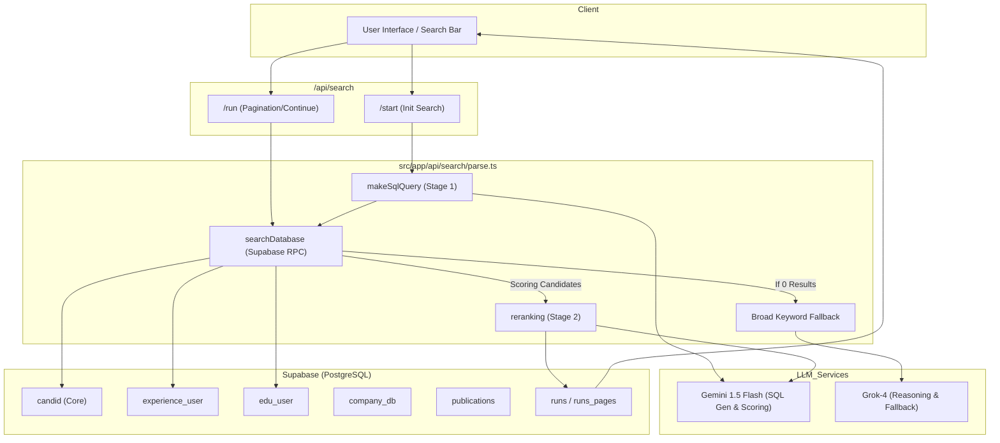

# Phase 1 Report: Codebase Analysis & Mapping

## 1. Database Schema Mapping
The `harper_beta` database schema (found in `src/types/database.types.ts`) matches the research schema optimized in `archive/`.

| Table | Purpose | Hybrid Search Usage |
|-------|---------|---------------------|
| `candid` | Core candidate profile | Add `embedding` VECTOR(1536) column. |
| `experience_user` | Professional experience | Source for `profile_text` aggregation. |
| `edu_user` | Education history | Source for `profile_text` aggregation. |
| `company_db` | Company metadata | Source for `profile_text` aggregation. |
| `publications` | Research papers | Source for `profile_text` aggregation. |
| `extra_experience` | Awards/Certifications | Source for `profile_text` aggregation. |

## 2. Search Entry Points
The search functionality is exposed through the following API routes in `harper_beta`:

- **`/api/search/start`**: Initiates a new search run.
    - Logic: Parses user query into SQL (via `makeSqlQuery`), executes search (via `searchDatabase`), and returns initial results.
- **`/api/search/run`**: Continues an existing search or handles pagination.
    - Logic: Similar to `start` but checks for cached results in `runs_pages`.

## 3. System Architecture
### Architectural Diagram

### Architectural Summary
- **2-Stage Retrieval Pipeline**:
    - **Stage 1 (SQL Retrieval)**: Converts user query into a `WHERE` clause using LLM, focusing on high recall through `EXISTS` and `pg_trgm`.
    - **Stage 2 (LLM Reranking)**: Precision-scores filtered candidates (0-1) by feeding detailed profiles back into the LLM.
- **Resilient Fallback**: Automatically switches to broad `tsvector` keyword search if initial strict filters yield no results.

## 4. Current SQL Generation Flow
The system currently uses a two-stage retrieval process:

### Stage 1: Keyword-based SQL Retrieval
1. **Initial Parsing (`makeSqlQuery` in `parse.ts`)**:
    - LLM (`gemini-3-flash-preview`) generates a `WHERE` clause based on `firstSqlPrompt`.
2. **SQL Refinement**:
    - The `WHERE` clause is refined using `sqlExistsPrompt` for better performance.
3. **Execution (`searchDatabase` in `parse.ts`)**:
    - SQL is executed via Supabase RPC `rpc_set_timeout_and_execute_raw_sql_via_runs`.
4. **Fallback/Expansion**:
    - If no results or timeout occurs, the system attempts to fix the SQL or falls back to FTS.

### Stage 2: LLM Evaluation & Reranking
1. **Reranking (`reranking` in `parse.ts`)**:
    - For top candidates (up to 100), an LLM generates a summary and scores the candidate.
    - Results are stored in `runs_pages`.

## 5. Integration Strategy (Phase 3 Prep)
To integrate Hybrid Search, we will:
1. Update `makeSqlQuery` to separate "Hard Filters" (Location, Exp) from "Semantic Intent".
2. Update `searchDatabase` to generate embeddings for the semantic intent.
3. Modify the final SQL to include vector similarity scoring.